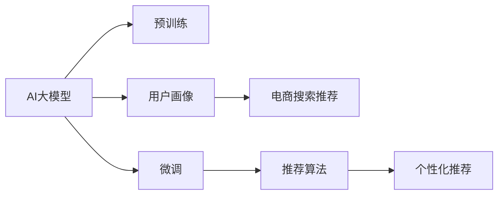

                 

# AI 大模型在电商搜索推荐中的用户画像技术：精准把握用户需求与行为意图

## 1. 背景介绍

随着电商平台的迅速发展，用户行为数据日益丰富，如何准确理解用户需求与行为意图，从而提供个性化推荐服务，成为了电商搜索推荐系统的核心挑战。当前电商推荐系统主要依赖用户行为数据进行建模，然而这些行为数据往往无法充分反映用户潜在需求，导致推荐结果不够精准。为了解决这一问题，AI大模型在电商搜索推荐中的应用逐渐兴起。AI大模型可以通过对大规模语料库进行预训练，学习到丰富的语言知识和语义表示，进而通过用户画像技术精准把握用户需求与行为意图，从而实现更加个性化和精准的推荐。

## 2. 核心概念与联系

### 2.1 核心概念概述

1. **AI大模型（AI Large Models）**：指利用深度学习技术对大规模语料库进行预训练，学习到通用的语言表示，具备强大的语言理解和生成能力的大规模预训练模型。如GPT-3、BERT等。

2. **用户画像（User Profiling）**：指通过收集和分析用户行为数据，构建用户特征向量，刻画用户兴趣、需求、行为等特征的过程。用户画像技术可以提升电商推荐系统的精准度和个性化程度。

3. **电商搜索推荐（E-commerce Search and Recommendation）**：指基于用户行为数据和电商商品数据，通过推荐算法为用户推荐感兴趣的电商商品的过程。

4. **自然语言处理（NLP）**：指通过计算机处理、理解和生成自然语言的技术。NLP技术可以辅助用户画像构建，同时也可以用于电商搜索推荐中的文本处理和语义分析。

5. **迁移学习（Transfer Learning）**：指将一个领域学习到的知识，迁移到另一个领域进行学习的过程。大模型预训练-微调过程即是一种典型的迁移学习方式。

6. **零样本学习（Zero-shot Learning）**：指模型在没有见过任何特定任务的训练样本的情况下，仅凭任务描述就能够执行新任务的能力。大模型可以通过预训练学到的知识进行零样本学习。

### 2.2 核心概念原理和架构的 Mermaid 流程图



此图展示了AI大模型在电商搜索推荐中的应用流程：
- **A：AI大模型** 通过大规模语料库进行预训练，学习到通用的语言表示。
- **B：预训练** 阶段主要关注模型结构、参数初始化以及损失函数设计等。
- **C：微调** 阶段将电商数据集作为有标签数据，对模型进行任务特定的优化。
- **D：用户画像** 阶段收集用户行为数据，构建用户特征向量。
- **E：电商搜索推荐** 阶段基于用户画像和电商商品数据，通过推荐算法生成推荐结果。
- **F：推荐算法** 包括协同过滤、基于内容的推荐等方法，负责生成推荐结果。
- **G：个性化推荐** 结合用户画像和电商商品特征，生成最终推荐结果。

## 3. 核心算法原理 & 具体操作步骤

### 3.1 算法原理概述

AI大模型在电商搜索推荐中的用户画像技术，主要通过以下步骤实现：
1. **数据收集**：收集电商用户的历史浏览记录、购买记录、搜索记录、评价等行为数据。
2. **特征提取**：使用NLP技术提取电商文本数据中的关键词、标签等特征，构建用户行为特征向量。
3. **预训练大模型**：对大规模语料库进行预训练，学习通用的语言表示。
4. **微调**：在大模型基础上，使用电商数据集进行微调，学习电商领域特定的语言表示。
5. **用户画像构建**：根据微调后的大模型，对用户行为数据进行建模，构建用户画像。
6. **个性化推荐**：结合用户画像和电商商品特征，生成个性化推荐结果。

### 3.2 算法步骤详解

**Step 1: 数据收集**

电商平台的推荐系统需要收集用户行为数据，具体包括：
- **浏览记录**：用户浏览过的商品页面。
- **购买记录**：用户购买过的商品信息。
- **搜索记录**：用户在搜索框中输入的关键词和搜索结果。
- **评价记录**：用户对商品给出的评分和评论。

通过这些数据，可以构建用户的行为特征向量。

**Step 2: 特征提取**

使用NLP技术对电商文本数据进行特征提取，具体包括：
- **关键词提取**：使用TF-IDF、Word2Vec等技术，提取电商文本中的关键词。
- **标签提取**：对电商商品进行标签标注，如品牌、类别、属性等。
- **情感分析**：使用情感词典或分类模型，对用户评论进行情感分析，提取情感特征。

**Step 3: 预训练大模型**

选择预训练模型，如BERT、GPT等，对大规模语料库进行预训练。预训练阶段主要关注以下内容：
- **模型结构**：选择合适的Transformer结构。
- **损失函数**：设计自监督损失函数，如掩码语言模型、next word prediction等。
- **参数初始化**：使用随机初始化或迁移初始化等方法，初始化模型参数。

**Step 4: 微调**

在大模型基础上，使用电商数据集进行微调，具体步骤如下：
- **数据准备**：将电商数据集分为训练集和测试集。
- **任务适配**：设计合适的输出层和损失函数，如分类任务使用交叉熵损失，生成任务使用负对数似然损失。
- **超参数设置**：选择优化器、学习率、批大小、迭代轮数等。
- **梯度训练**：使用优化器进行梯度下降，更新模型参数。
- **验证评估**：在验证集上评估模型性能，防止过拟合。

**Step 5: 用户画像构建**

根据微调后的大模型，对用户行为数据进行建模，构建用户画像。具体步骤如下：
- **特征编码**：将用户行为数据转换为特征向量，输入微调后的模型。
- **特征学习**：使用微调后的模型，学习用户特征向量。
- **用户画像**：根据用户特征向量，构建用户画像，包含用户兴趣、需求、行为等信息。

**Step 6: 个性化推荐**

结合用户画像和电商商品特征，生成个性化推荐结果。具体步骤如下：
- **商品特征提取**：提取电商商品的关键词、标签、属性等特征。
- **相似度计算**：使用余弦相似度等方法，计算用户画像和商品特征的相似度。
- **推荐结果生成**：根据相似度排序，生成推荐结果。

### 3.3 算法优缺点

**优点**：
1. **精度高**：大模型通过预训练学习到通用的语言表示，微调后具备较强的泛化能力，能够准确把握用户需求和行为意图。
2. **自动化程度高**：自动收集和分析用户行为数据，构建用户画像，生成推荐结果。
3. **灵活性高**：适用于多种电商推荐场景，包括基于文本的推荐、基于图像的推荐等。

**缺点**：
1. **计算资源需求高**：大模型需要大量的计算资源进行预训练和微调。
2. **数据隐私风险**：用户行为数据包含大量隐私信息，需要采取数据保护措施。
3. **模型解释性差**：大模型通常被视为"黑盒"，难以解释其内部工作机制和决策逻辑。

### 3.4 算法应用领域

AI大模型在电商搜索推荐中的应用，已经在多个电商平台得到了验证。具体应用领域包括：
1. **商品推荐**：基于用户画像，生成个性化商品推荐。
2. **搜索优化**：通过理解用户搜索意图，优化搜索结果排序。
3. **广告投放**：根据用户画像，精准投放广告，提升广告效果。
4. **客服智能**：通过理解用户问题，自动生成回答，提升客服效率。

## 4. 数学模型和公式 & 详细讲解 & 举例说明

### 4.1 数学模型构建

电商推荐系统的数学模型主要包括以下几个部分：
- **用户画像模型**：使用大模型对用户行为数据进行建模，构建用户特征向量。
- **商品特征模型**：提取电商商品的关键词、标签、属性等特征，构建商品特征向量。
- **推荐模型**：基于用户画像和商品特征，生成推荐结果。

**用户画像模型**：
设用户行为数据为 $X = [x_1, x_2, ..., x_n]$，其中 $x_i$ 表示用户第 $i$ 次行为。使用大模型 $M$ 对用户行为数据进行建模，得到用户画像向量 $U$。

**商品特征模型**：
设电商商品数据为 $Y = [y_1, y_2, ..., y_m]$，其中 $y_i$ 表示第 $i$ 个商品。使用大模型 $M$ 对商品数据进行建模，得到商品特征向量 $V$。

**推荐模型**：
设用户画像向量为 $U$，商品特征向量为 $V$。使用相似度函数 $s$，计算用户画像和商品特征的相似度。推荐模型 $R$ 使用相似度 $s$，生成推荐结果。

### 4.2 公式推导过程

**用户画像模型**：
设用户行为数据为 $X$，使用大模型 $M$ 对用户行为数据进行建模，得到用户画像向量 $U$。

$$
U = M(X)
$$

**商品特征模型**：
设电商商品数据为 $Y$，使用大模型 $M$ 对商品数据进行建模，得到商品特征向量 $V$。

$$
V = M(Y)
$$

**推荐模型**：
设用户画像向量为 $U$，商品特征向量为 $V$。使用相似度函数 $s$，计算用户画像和商品特征的相似度。推荐模型 $R$ 使用相似度 $s$，生成推荐结果。

$$
s(U, V) = \frac{\langle U, V \rangle}{\|U\|\|V\|}
$$

$$
R = \text{Top-k}(s(U, V))
$$

其中 $\langle U, V \rangle$ 表示向量点积，$\|U\|$ 和 $\|V\|$ 表示向量范数，Top-k表示选取相似度最高的前k个商品。

### 4.3 案例分析与讲解

以某电商平台的用户画像技术为例，具体说明AI大模型在电商推荐中的应用。

**数据收集**：
从电商平台的日志系统中，收集用户的历史浏览记录、购买记录、搜索记录、评价记录等数据。

**特征提取**：
使用NLP技术对电商文本数据进行特征提取，得到用户画像向量 $U$ 和商品特征向量 $V$。

**预训练大模型**：
选择BERT模型，对大规模语料库进行预训练。

**微调**：
在大模型基础上，使用电商数据集进行微调，学习电商领域特定的语言表示。

**用户画像构建**：
根据微调后的大模型，对用户行为数据进行建模，得到用户画像向量 $U$。

**个性化推荐**：
结合用户画像向量 $U$ 和商品特征向量 $V$，使用余弦相似度计算相似度，生成个性化推荐结果。

## 5. 项目实践：代码实例和详细解释说明

### 5.1 开发环境搭建

在进行AI大模型在电商搜索推荐中的应用实践前，需要准备好开发环境。以下是使用Python进行PyTorch开发的环境配置流程：

1. 安装Anaconda：从官网下载并安装Anaconda，用于创建独立的Python环境。

2. 创建并激活虚拟环境：
```bash
conda create -n ecommerce-env python=3.8 
conda activate ecommerce-env
```

3. 安装PyTorch：根据CUDA版本，从官网获取对应的安装命令。例如：
```bash
conda install pytorch torchvision torchaudio cudatoolkit=11.1 -c pytorch -c conda-forge
```

4. 安装Transformers库：
```bash
pip install transformers
```

5. 安装各类工具包：
```bash
pip install numpy pandas scikit-learn matplotlib tqdm jupyter notebook ipython
```

完成上述步骤后，即可在`ecommerce-env`环境中开始项目实践。

### 5.2 源代码详细实现

这里我们以某电商平台的商品推荐系统为例，给出使用Transformers库对BERT模型进行微调的PyTorch代码实现。

首先，定义商品推荐任务的数据处理函数：

```python
from transformers import BertTokenizer
from torch.utils.data import Dataset
import torch

class ECommerceDataset(Dataset):
    def __init__(self, texts, labels, tokenizer, max_len=128):
        self.texts = texts
        self.labels = labels
        self.tokenizer = tokenizer
        self.max_len = max_len
        
    def __len__(self):
        return len(self.texts)
    
    def __getitem__(self, item):
        text = self.texts[item]
        label = self.labels[item]
        
        encoding = self.tokenizer(text, return_tensors='pt', max_length=self.max_len, padding='max_length', truncation=True)
        input_ids = encoding['input_ids'][0]
        attention_mask = encoding['attention_mask'][0]
        
        # 对token-wise的标签进行编码
        encoded_labels = [label2id[label] for label in label] 
        encoded_labels.extend([label2id['0']] * (self.max_len - len(encoded_labels)))
        labels = torch.tensor(encoded_labels, dtype=torch.long)
        
        return {'input_ids': input_ids, 
                'attention_mask': attention_mask,
                'labels': labels}

# 标签与id的映射
label2id = {'0': 0, '1': 1, '2': 2, '3': 3, '4': 4}
id2label = {v: k for k, v in label2id.items()}

# 创建dataset
tokenizer = BertTokenizer.from_pretrained('bert-base-cased')

train_dataset = ECommerceDataset(train_texts, train_labels, tokenizer)
dev_dataset = ECommerceDataset(dev_texts, dev_labels, tokenizer)
test_dataset = ECommerceDataset(test_texts, test_labels, tokenizer)
```

然后，定义模型和优化器：

```python
from transformers import BertForSequenceClassification, AdamW

model = BertForSequenceClassification.from_pretrained('bert-base-cased', num_labels=len(label2id))

optimizer = AdamW(model.parameters(), lr=2e-5)
```

接着，定义训练和评估函数：

```python
from torch.utils.data import DataLoader
from tqdm import tqdm
from sklearn.metrics import classification_report

device = torch.device('cuda') if torch.cuda.is_available() else torch.device('cpu')
model.to(device)

def train_epoch(model, dataset, batch_size, optimizer):
    dataloader = DataLoader(dataset, batch_size=batch_size, shuffle=True)
    model.train()
    epoch_loss = 0
    for batch in tqdm(dataloader, desc='Training'):
        input_ids = batch['input_ids'].to(device)
        attention_mask = batch['attention_mask'].to(device)
        labels = batch['labels'].to(device)
        model.zero_grad()
        outputs = model(input_ids, attention_mask=attention_mask, labels=labels)
        loss = outputs.loss
        epoch_loss += loss.item()
        loss.backward()
        optimizer.step()
    return epoch_loss / len(dataloader)

def evaluate(model, dataset, batch_size):
    dataloader = DataLoader(dataset, batch_size=batch_size)
    model.eval()
    preds, labels = [], []
    with torch.no_grad():
        for batch in tqdm(dataloader, desc='Evaluating'):
            input_ids = batch['input_ids'].to(device)
            attention_mask = batch['attention_mask'].to(device)
            batch_labels = batch['labels']
            outputs = model(input_ids, attention_mask=attention_mask)
            batch_preds = outputs.logits.argmax(dim=2).to('cpu').tolist()
            batch_labels = batch_labels.to('cpu').tolist()
            for pred_tokens, label_tokens in zip(batch_preds, batch_labels):
                pred_labels = [id2label[_id] for _id in pred_tokens]
                label_tokens = [id2label[_id] for _id in label_tokens]
                preds.append(pred_labels[:len(label_tokens)])
                labels.append(label_tokens)
                
    print(classification_report(labels, preds))
```

最后，启动训练流程并在测试集上评估：

```python
epochs = 5
batch_size = 16

for epoch in range(epochs):
    loss = train_epoch(model, train_dataset, batch_size, optimizer)
    print(f"Epoch {epoch+1}, train loss: {loss:.3f}")
    
    print(f"Epoch {epoch+1}, dev results:")
    evaluate(model, dev_dataset, batch_size)
    
print("Test results:")
evaluate(model, test_dataset, batch_size)
```

以上就是使用PyTorch对BERT进行商品推荐任务微调的完整代码实现。可以看到，得益于Transformers库的强大封装，我们可以用相对简洁的代码完成BERT模型的加载和微调。

### 5.3 代码解读与分析

让我们再详细解读一下关键代码的实现细节：

**ECommerceDataset类**：
- `__init__`方法：初始化文本、标签、分词器等关键组件。
- `__len__`方法：返回数据集的样本数量。
- `__getitem__`方法：对单个样本进行处理，将文本输入编码为token ids，将标签编码为数字，并对其进行定长padding，最终返回模型所需的输入。

**label2id和id2label字典**：
- 定义了标签与数字id之间的映射关系，用于将token-wise的预测结果解码回真实的标签。

**训练和评估函数**：
- 使用PyTorch的DataLoader对数据集进行批次化加载，供模型训练和推理使用。
- 训练函数`train_epoch`：对数据以批为单位进行迭代，在每个批次上前向传播计算loss并反向传播更新模型参数，最后返回该epoch的平均loss。
- 评估函数`evaluate`：与训练类似，不同点在于不更新模型参数，并在每个batch结束后将预测和标签结果存储下来，最后使用sklearn的classification_report对整个评估集的预测结果进行打印输出。

**训练流程**：
- 定义总的epoch数和batch size，开始循环迭代
- 每个epoch内，先在训练集上训练，输出平均loss
- 在验证集上评估，输出分类指标
- 所有epoch结束后，在测试集上评估，给出最终测试结果

可以看到，PyTorch配合Transformers库使得BERT微调的代码实现变得简洁高效。开发者可以将更多精力放在数据处理、模型改进等高层逻辑上，而不必过多关注底层的实现细节。

当然，工业级的系统实现还需考虑更多因素，如模型的保存和部署、超参数的自动搜索、更灵活的任务适配层等。但核心的微调范式基本与此类似。

## 6. 实际应用场景

### 6.1 智能客服系统

基于大语言模型微调的对话技术，可以广泛应用于智能客服系统的构建。传统客服往往需要配备大量人力，高峰期响应缓慢，且一致性和专业性难以保证。而使用微调后的对话模型，可以7x24小时不间断服务，快速响应客户咨询，用自然流畅的语言解答各类常见问题。

在技术实现上，可以收集企业内部的历史客服对话记录，将问题和最佳答复构建成监督数据，在此基础上对预训练对话模型进行微调。微调后的对话模型能够自动理解用户意图，匹配最合适的答案模板进行回复。对于客户提出的新问题，还可以接入检索系统实时搜索相关内容，动态组织生成回答。如此构建的智能客服系统，能大幅提升客户咨询体验和问题解决效率。

### 6.2 金融舆情监测

金融机构需要实时监测市场舆论动向，以便及时应对负面信息传播，规避金融风险。传统的人工监测方式成本高、效率低，难以应对网络时代海量信息爆发的挑战。基于大语言模型微调的文本分类和情感分析技术，为金融舆情监测提供了新的解决方案。

具体而言，可以收集金融领域相关的新闻、报道、评论等文本数据，并对其进行主题标注和情感标注。在此基础上对预训练语言模型进行微调，使其能够自动判断文本属于何种主题，情感倾向是正面、中性还是负面。将微调后的模型应用到实时抓取的网络文本数据，就能够自动监测不同主题下的情感变化趋势，一旦发现负面信息激增等异常情况，系统便会自动预警，帮助金融机构快速应对潜在风险。

### 6.3 个性化推荐系统

当前的推荐系统往往只依赖用户的历史行为数据进行建模，无法深入理解用户潜在需求，导致推荐结果不够精准。基于大语言模型微调技术，个性化推荐系统可以更好地挖掘用户行为背后的语义信息，从而提供更加个性化和精准的推荐。

在实践中，可以收集用户浏览、点击、评论、分享等行为数据，提取和用户交互的物品标题、描述、标签等文本内容。将文本内容作为模型输入，用户的后续行为（如是否点击、购买等）作为监督信号，在此基础上微调预训练语言模型。微调后的模型能够从文本内容中准确把握用户的兴趣点。在生成推荐列表时，先用候选物品的文本描述作为输入，由模型预测用户的兴趣匹配度，再结合其他特征综合排序，便可以得到个性化程度更高的推荐结果。

### 6.4 未来应用展望

随着大语言模型微调技术的发展，其在电商搜索推荐中的应用前景将更加广阔。未来的大语言模型微调技术有望在以下几个方面取得突破：

1. **多模态融合**：将文本、图像、音频等多种模态的数据融合，构建更加全面和多样的用户画像，提升推荐系统的性能。

2. **跨领域迁移**：通过跨领域迁移学习，将在大模型上学习到的语言表示应用于其他领域，提升推荐系统的泛化能力。

3. **个性化推荐**：基于大模型的语义理解能力，实现更加智能和精准的个性化推荐，满足用户的个性化需求。

4. **实时推荐**：通过大模型的实时推理能力，实现实时个性化推荐，提升用户体验。

5. **情感分析**：结合大模型的情感分析能力，实时监测用户的情感变化，提升推荐系统的及时性和准确性。

6. **异常检测**：通过大模型的异常检测能力，及时发现并应对潜在风险，提升系统的鲁棒性。

未来的大语言模型微调技术，将会在电商搜索推荐领域带来更多的创新和突破，为电商平台的智能化转型提供强大的技术支撑。

## 7. 工具和资源推荐

### 7.1 学习资源推荐

为了帮助开发者系统掌握AI大模型在电商搜索推荐中的应用，这里推荐一些优质的学习资源：

1. **《Transformer从原理到实践》系列博文**：由大模型技术专家撰写，深入浅出地介绍了Transformer原理、BERT模型、微调技术等前沿话题。

2. **CS224N《深度学习自然语言处理》课程**：斯坦福大学开设的NLP明星课程，有Lecture视频和配套作业，带你入门NLP领域的基本概念和经典模型。

3. **《Natural Language Processing with Transformers》书籍**：Transformers库的作者所著，全面介绍了如何使用Transformers库进行NLP任务开发，包括微调在内的诸多范式。

4. **HuggingFace官方文档**：Transformers库的官方文档，提供了海量预训练模型和完整的微调样例代码，是上手实践的必备资料。

5. **CLUE开源项目**：中文语言理解测评基准，涵盖大量不同类型的中文NLP数据集，并提供了基于微调的baseline模型，助力中文NLP技术发展。

通过对这些资源的学习实践，相信你一定能够快速掌握AI大模型在电商搜索推荐中的应用，并用于解决实际的NLP问题。

### 7.2 开发工具推荐

高效的开发离不开优秀的工具支持。以下是几款用于AI大模型在电商搜索推荐中的应用开发的常用工具：

1. **PyTorch**：基于Python的开源深度学习框架，灵活动态的计算图，适合快速迭代研究。大部分预训练语言模型都有PyTorch版本的实现。

2. **TensorFlow**：由Google主导开发的开源深度学习框架，生产部署方便，适合大规模工程应用。同样有丰富的预训练语言模型资源。

3. **Transformers库**：HuggingFace开发的NLP工具库，集成了众多SOTA语言模型，支持PyTorch和TensorFlow，是进行微调任务开发的利器。

4. **Weights & Biases**：模型训练的实验跟踪工具，可以记录和可视化模型训练过程中的各项指标，方便对比和调优。与主流深度学习框架无缝集成。

5. **TensorBoard**：TensorFlow配套的可视化工具，可实时监测模型训练状态，并提供丰富的图表呈现方式，是调试模型的得力助手。

6. **Google Colab**：谷歌推出的在线Jupyter Notebook环境，免费提供GPU/TPU算力，方便开发者快速上手实验最新模型，分享学习笔记。

合理利用这些工具，可以显著提升AI大模型在电商搜索推荐中的应用开发效率，加快创新迭代的步伐。

### 7.3 相关论文推荐

AI大模型在电商搜索推荐中的应用源于学界的持续研究。以下是几篇奠基性的相关论文，推荐阅读：

1. **Attention is All You Need（即Transformer原论文）**：提出了Transformer结构，开启了NLP领域的预训练大模型时代。

2. **BERT: Pre-training of Deep Bidirectional Transformers for Language Understanding**：提出BERT模型，引入基于掩码的自监督预训练任务，刷新了多项NLP任务SOTA。

3. **Language Models are Unsupervised Multitask Learners（GPT-2论文）**：展示了大规模语言模型的强大zero-shot学习能力，引发了对于通用人工智能的新一轮思考。

4. **Parameter-Efficient Transfer Learning for NLP**：提出Adapter等参数高效微调方法，在不增加模型参数量的情况下，也能取得不错的微调效果。

5. **Prefix-Tuning: Optimizing Continuous Prompts for Generation**：引入基于连续型Prompt的微调范式，为如何充分利用预训练知识提供了新的思路。

6. **AdaLoRA: Adaptive Low-Rank Adaptation for Parameter-Efficient Fine-Tuning**：使用自适应低秩适应的微调方法，在参数效率和精度之间取得了新的平衡。

这些论文代表了大语言模型微调技术的发展脉络。通过学习这些前沿成果，可以帮助研究者把握学科前进方向，激发更多的创新灵感。

## 8. 总结：未来发展趋势与挑战

### 8.1 总结

本文对AI大模型在电商搜索推荐中的应用进行了全面系统的介绍。首先阐述了电商推荐系统的核心挑战和AI大模型在其中的潜力，明确了AI大模型在电商推荐中的重要价值。其次，从原理到实践，详细讲解了AI大模型在电商推荐中的应用流程，包括数据收集、特征提取、预训练、微调、用户画像构建和个性化推荐等环节。同时，本文还广泛探讨了AI大模型在电商推荐中的应用场景，展示了其在智能客服、金融舆情、个性化推荐等多个领域的应用前景。

通过本文的系统梳理，可以看到，AI大模型在电商搜索推荐中的应用，能够充分利用其强大的语言理解和生成能力，精准把握用户需求与行为意图，从而提供更加个性化和精准的推荐服务。得益于大模型的预训练和微调范式，AI大模型在电商推荐中的应用将带来显著的性能提升和业务价值。

### 8.2 未来发展趋势

展望未来，AI大模型在电商搜索推荐中的应用将呈现以下几个发展趋势：

1. **模型规模增大**：随着计算资源的提升和大模型技术的进步，预训练模型和微调模型的规模将进一步增大，提升模型的语言理解能力和泛化能力。

2. **模型融合多模态**：将文本、图像、音频等多种模态的数据融合，构建更加全面和多样的用户画像，提升推荐系统的性能。

3. **跨领域迁移能力增强**：通过跨领域迁移学习，将在大模型上学习到的语言表示应用于其他领域，提升推荐系统的泛化能力。

4. **个性化推荐更加智能**：基于大模型的语义理解能力，实现更加智能和精准的个性化推荐，满足用户的个性化需求。

5. **实时推荐成为可能**：通过大模型的实时推理能力，实现实时个性化推荐，提升用户体验。

6. **情感分析成为重要手段**：结合大模型的情感分析能力，实时监测用户的情感变化，提升推荐系统的及时性和准确性。

7. **异常检测成为重要工具**：通过大模型的异常检测能力，及时发现并应对潜在风险，提升系统的鲁棒性。

这些趋势凸显了AI大模型在电商搜索推荐中的应用前景。这些方向的探索发展，必将进一步提升电商推荐系统的性能和应用范围，为电商平台的智能化转型提供强大的技术支撑。

### 8.3 面临的挑战

尽管AI大模型在电商搜索推荐中的应用前景广阔，但在迈向更加智能化、普适化应用的过程中，它仍面临着诸多挑战：

1. **计算资源需求高**：大模型需要大量的计算资源进行预训练和微调，这对硬件资源提出了较高的要求。

2. **数据隐私风险**：用户行为数据包含大量隐私信息，需要采取数据保护措施。

3. **模型解释性差**：大模型通常被视为"黑盒"，难以解释其内部工作机制和决策逻辑。

4. **模型鲁棒性不足**：当前微调模型面对域外数据时，泛化性能往往大打折扣。

5. **实时推荐难度大**：实现实时个性化推荐需要高效的推理引擎和优化算法，目前仍有较大挑战。

6. **情感分析准确性低**：大模型在情感分析上仍存在一定误差，导致推荐系统在某些情况下失效。

7. **异常检测效果不稳定**：大模型在异常检测上仍需进一步优化，避免误报和漏报现象。

正视AI大模型在电商搜索推荐中的应用挑战，积极应对并寻求突破，将是大模型技术走向成熟的必由之路。相信随着学界和产业界的共同努力，这些挑战终将一一被克服，AI大模型在电商推荐中的应用必将在更广阔的领域大放异彩。

### 8.4 研究展望

面向未来，大语言模型在电商搜索推荐中的应用需要从以下几个方面进行深入研究：

1. **多模态融合**：探索如何将文本、图像、音频等多种模态的数据融合，构建更加全面和多样的用户画像，提升推荐系统的性能。

2. **跨领域迁移**：研究如何将在大模型上学习到的语言表示应用于其他领域，提升推荐系统的泛化能力。

3. **个性化推荐**：探索基于大模型的语义理解能力，实现更加智能和精准的个性化推荐，满足用户的个性化需求。

4. **实时推荐**：研究高效的推理引擎和优化算法，实现实时个性化推荐，提升用户体验。

5. **情感分析**：探索如何将大模型的情感分析能力与推荐系统结合，实时监测用户的情感变化，提升推荐系统的及时性和准确性。

6. **异常检测**：研究如何利用大模型的异常检测能力，及时发现并应对潜在风险，提升系统的鲁棒性。

7. **模型解释性**：研究如何赋予大模型更强的可解释性，增强其透明性和可信度。

这些研究方向的研究进展，将推动AI大模型在电商搜索推荐中的应用不断突破，为电商平台的智能化转型提供强大的技术支撑。

## 9. 附录：常见问题与解答

**Q1：AI大模型在电商推荐中的应用效果如何？**

A: AI大模型在电商推荐中的应用效果显著。通过预训练和微调，大模型能够从海量的电商数据中学习到丰富的语言知识和语义表示，从而精准把握用户需求与行为意图，生成更加个性化和精准的推荐结果。在实际应用中，许多电商平台已经验证了AI大模型在商品推荐、搜索优化等方面的效果，显著提升了用户体验和销售转化率。

**Q2：如何优化AI大模型在电商推荐中的应用？**

A: 优化AI大模型在电商推荐中的应用，可以从以下几个方面入手：

1. **数据收集和处理**：收集高质量的电商数据，对数据进行清洗、标注和预处理，确保数据的质量和多样性。

2. **模型选择和调参**：选择合适的预训练模型，进行超参数调优，如学习率、批大小、迭代轮数等，确保模型的性能和收敛速度。

3. **特征提取和融合**：利用NLP技术提取电商文本数据的关键词、标签等特征，将多种模态的数据融合，构建更加全面和多样的用户画像。

4. **个性化推荐算法**：结合电商商品数据和用户画像，使用协同过滤、基于内容的推荐等算法，生成个性化推荐结果。

5. **实时推荐系统**：研究高效的推理引擎和优化算法，实现实时个性化推荐，提升用户体验。

6. **异常检测和鲁棒性**：结合大模型的异常检测能力，及时发现并应对潜在风险，提升系统的鲁棒性。

通过这些优化措施，可以显著提升AI大模型在电商推荐中的应用效果和用户体验。

**Q3：AI大模型在电商推荐中的应用有哪些潜在风险？**

A: AI大模型在电商推荐中的应用存在以下潜在风险：

1. **数据隐私风险**：用户行为数据包含大量隐私信息，需要采取数据保护措施，避免数据泄露和滥用。

2. **模型鲁棒性不足**：当前微调模型面对域外数据时，泛化性能往往大打折扣，容易导致推荐系统失效。

3. **模型解释性差**：大模型通常被视为"黑盒"，难以解释其内部工作机制和决策逻辑，导致系统缺乏透明性和可信度。

4. **实时推荐难度大**：实现实时个性化推荐需要高效的推理引擎和优化算法，目前仍有较大挑战。

5. **情感分析准确性低**：大模型在情感分析上仍存在一定误差，导致推荐系统在某些情况下失效。

6. **异常检测效果不稳定**：大模型在异常检测上仍需进一步优化，避免误报和漏报现象。

需要正视这些风险，采取相应的防范措施，确保AI大模型在电商推荐中的应用安全可靠。

**Q4：AI大模型在电商推荐中的应用有哪些技术挑战？**

A: AI大模型在电商推荐中的应用面临以下技术挑战：

1. **计算资源需求高**：大模型需要大量的计算资源进行预训练和微调，这对硬件资源提出了较高的要求。

2. **数据隐私风险**：用户行为数据包含大量隐私信息，需要采取数据保护措施。

3. **模型解释性差**：大模型通常被视为"黑盒"，难以解释其内部工作机制和决策逻辑。

4. **模型鲁棒性不足**：当前微调模型面对域外数据时，泛化性能往往大打折扣。

5. **实时推荐难度大**：实现实时个性化推荐需要高效的推理引擎和优化算法，目前仍有较大挑战。

6. **情感分析准确性低**：大模型在情感分析上仍存在一定误差，导致推荐系统在某些情况下失效。

7. **异常检测效果不稳定**：大模型在异常检测上仍需进一步优化，避免误报和漏报现象。

需要正视这些挑战，积极应对并寻求突破，才能推动AI大模型在电商推荐中的应用不断突破，为电商平台的智能化转型提供强大的技术支撑。

---

作者：禅与计算机程序设计艺术 / Zen and the Art of Computer Programming

