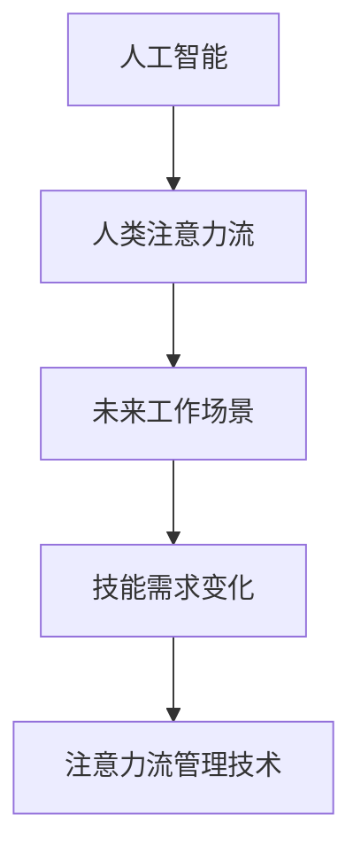
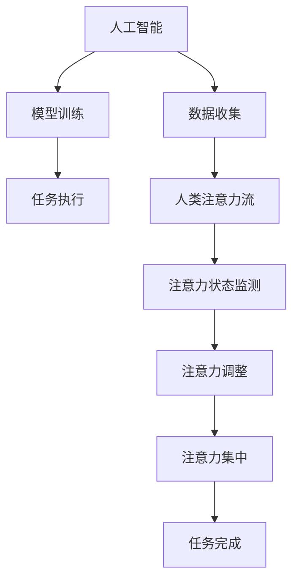

                 

# AI与人类注意力流：未来的工作、技能与注意力流管理技术的应用前景展望分析

> 关键词：人工智能,人类注意力流,未来工作,技能,注意力流管理技术

## 1. 背景介绍

### 1.1 问题由来

在数字化时代，人类的工作方式和生活习惯正在发生深刻变革。随着AI技术尤其是AI与人类注意力流的结合，未来工作场景、技能需求以及注意力流管理技术的应用前景正面临前所未有的机遇和挑战。

人类注意力流是人类处理信息和执行任务时的心理和生理过程，受情感、情绪、环境等多种因素影响。AI技术，特别是深度学习和自然语言处理（NLP）技术的兴起，为理解和优化人类注意力流提供了新的工具和方法。这些技术能够帮助人们更好地识别、分析和管理注意力流，提升工作效率和决策质量。

### 1.2 问题核心关键点

- **AI与人类注意力流**：如何利用AI技术（尤其是深度学习）理解和优化人类注意力流。
- **未来工作场景**：AI与人类注意力流结合对未来工作场景的影响。
- **技能需求变化**：AI技术普及后，人类所需技能将发生哪些变化。
- **注意力流管理技术**：现有技术如何应用于注意力流管理和未来可能的发展方向。

### 1.3 问题研究意义

研究AI与人类注意力流的结合及其对未来工作、技能和注意力流管理技术的影响，对于推动社会和科技的进步具有重要意义：

1. **提升工作效率**：通过AI技术优化注意力流，帮助人们更高效地处理信息和执行任务。
2. **促进技能转型**：理解AI技术对技能需求的影响，为个人和组织的职业发展提供指导。
3. **改善工作体验**：通过技术手段改善人类注意力流管理，提升工作满意度和生活质量。
4. **推动技术创新**：研究新的注意力流管理技术，推动AI技术的进一步发展和应用。

## 2. 核心概念与联系

### 2.1 核心概念概述

为更好地理解AI与人类注意力流的结合及其应用前景，本节将介绍几个关键概念及其相互关系：

- **人工智能**：利用计算机模拟人类智能，能够通过学习解决复杂问题、执行任务的技术。
- **人类注意力流**：人类在执行任务时注意力分布的过程，包括注意力集中、分散、转移等状态。
- **未来工作场景**：AI技术普及后，未来的工作方式和环境将如何变化。
- **技能需求变化**：AI技术的发展将如何改变人类所需的技能结构和类型。
- **注意力流管理技术**：通过技术手段优化和管理人类注意力流的工具和方法。

这些核心概念之间的逻辑关系可以通过以下Mermaid流程图来展示：



### 2.2 核心概念原理和架构的 Mermaid 流程图



这个流程图展示了AI与人类注意力流的结合过程：AI通过收集和分析数据来训练模型，执行任务时监测和调整人类注意力流，以实现高效的任务完成。

## 3. 核心算法原理 & 具体操作步骤

### 3.1 算法原理概述

AI与人类注意力流的结合，主要基于以下算法原理：

1. **数据收集与预处理**：通过传感器和用户输入收集人类注意力流的数据，包括注意力集中度、分散度、转移频率等。
2. **注意力状态监测**：使用机器学习算法如时间序列分析、神经网络等，监测和预测人类注意力流状态。
3. **注意力调整与优化**：根据注意力状态监测结果，通过AI模型优化注意力流，帮助用户保持高效的工作状态。
4. **任务执行与反馈**：在任务执行过程中，实时调整注意力流，并在任务完成后收集用户反馈，进一步优化AI模型。

### 3.2 算法步骤详解

以下是AI与人类注意力流结合的详细步骤：

**Step 1: 数据收集与预处理**
- 通过脑电图(EEG)、眼动追踪、键盘鼠标使用情况等传感器收集人类注意力流数据。
- 对收集到的数据进行清洗、归一化等预处理操作。

**Step 2: 注意力状态监测**
- 使用时间序列分析、长短期记忆网络(LSTM)、卷积神经网络(CNN)等模型，对注意力流数据进行建模和预测。
- 监测注意力集中度、分散度、转移频率等关键指标。

**Step 3: 注意力调整与优化**
- 根据监测结果，使用强化学习、深度强化学习等算法优化注意力流，使其更适合当前任务。
- 使用用户反馈进一步调整注意力流，提升用户体验。

**Step 4: 任务执行与反馈**
- 在执行任务时，实时调整注意力流，确保高效的工作状态。
- 收集用户反馈，用于优化模型和算法。

### 3.3 算法优缺点

AI与人类注意力流结合的算法具有以下优点：

1. **高效性**：通过优化注意力流，能够显著提升工作效率和任务完成质量。
2. **个性化**：能够根据用户的特定需求和环境，提供个性化的注意力流管理方案。
3. **实时性**：实时监测和调整注意力流，提升用户体验。

同时，也存在一些缺点：

1. **数据隐私**：收集和使用人类注意力流数据可能涉及隐私问题，需要谨慎处理。
2. **算法复杂性**：需要复杂的算法和技术实现，增加了开发和部署的难度。
3. **用户接受度**：用户对AI技术的接受度可能影响其实际应用效果。

### 3.4 算法应用领域

AI与人类注意力流的结合技术，已经广泛应用于以下几个领域：

- **智能办公**：帮助员工提升工作效率，优化工作流程。
- **远程协作**：通过监测和调整注意力流，提升远程会议和协作的效果。
- **教育培训**：通过优化学生注意力流，提升学习效果和参与度。
- **医疗健康**：帮助医生更好地理解病人注意力状态，提高诊疗效果。
- **游戏娱乐**：提升游戏体验，优化玩家注意力流管理。

## 4. 数学模型和公式 & 详细讲解 & 举例说明

### 4.1 数学模型构建

假设有一个时间序列数据 $x_t$ 描述人类注意力流的变化，其数学模型可以表示为：

$$
x_t = f(x_{t-1}, \epsilon_t)
$$

其中 $f$ 是模型函数，$\epsilon_t$ 是随机误差项。

### 4.2 公式推导过程

通过时间序列分析，可以建立注意力流状态监测的模型。以LSTM为例，其计算公式如下：

$$
h_t = \text{LSTM}(x_t, h_{t-1})
$$

其中 $h_t$ 是LSTM模型在时间步 $t$ 的隐藏状态，$x_t$ 是当前输入，$h_{t-1}$ 是前一时刻的隐藏状态。

通过训练LSTM模型，可以预测未来的注意力流状态 $x_{t+1}$：

$$
x_{t+1} = g(h_t)
$$

其中 $g$ 是预测函数，$h_t$ 是当前LSTM模型的隐藏状态。

### 4.3 案例分析与讲解

以智能办公系统为例，该系统通过传感器收集员工使用电脑时的注意力流数据，使用LSTM模型监测注意力状态，并使用强化学习算法调整注意力流，帮助员工保持高效工作状态。具体实现步骤如下：

1. 收集员工使用电脑时的眼动追踪数据，包括注视点的位置和停留时间等。
2. 使用LSTM模型对眼动数据进行建模，预测注意力集中度和分散度。
3. 根据预测结果，使用强化学习算法优化注意力流，如提示用户休息、调整屏幕亮度等。
4. 收集员工反馈，进一步优化LSTM模型和强化学习算法。

## 5. 项目实践：代码实例和详细解释说明

### 5.1 开发环境搭建

在进行AI与人类注意力流结合的实践前，我们需要准备好开发环境。以下是使用Python进行深度学习开发的常见环境配置：

1. 安装Anaconda：从官网下载并安装Anaconda，用于创建独立的Python环境。

2. 创建并激活虚拟环境：
```bash
conda create -n myenv python=3.8 
conda activate myenv
```

3. 安装PyTorch、TensorFlow、Keras等深度学习框架：
```bash
pip install torch torchvision torchaudio numpy scikit-learn matplotlib tqdm jupyter notebook ipython
```

4. 安装相关传感器和设备驱动程序：
```bash
pip install pyserial pyglet opencv-python
```

完成上述步骤后，即可在虚拟环境中开始项目开发。

### 5.2 源代码详细实现

下面是一个简单的AI与人类注意力流结合的代码实现示例，以LSTM模型为基础：

```python
import torch
import torch.nn as nn
import torch.optim as optim
from torch.utils.data import Dataset, DataLoader
from sklearn.model_selection import train_test_split
import numpy as np
import pandas as pd

class AttentionDataset(Dataset):
    def __init__(self, data, seq_length=20):
        self.data = data
        self.seq_length = seq_length

    def __len__(self):
        return len(self.data)

    def __getitem__(self, idx):
        x = self.data[idx]
        x = x.reshape(-1)
        x = np.pad(x, (0, self.seq_length-len(x)), 'constant')
        x = x.reshape(-1, self.seq_length)
        x = torch.tensor(x, dtype=torch.float32)
        return x

class LSTMModel(nn.Module):
    def __init__(self, input_size, hidden_size, output_size):
        super(LSTMModel, self).__init__()
        self.hidden_size = hidden_size
        self.lstm = nn.LSTM(input_size, hidden_size, 1)
        self.fc = nn.Linear(hidden_size, output_size)

    def forward(self, x):
        h0 = torch.zeros(1, x.size(0), self.hidden_size).to(device)
        c0 = torch.zeros(1, x.size(0), self.hidden_size).to(device)
        out, _ = self.lstm(x, (h0, c0))
        out = self.fc(out[:, -1, :])
        return out

def train_model(model, data, batch_size, epochs, learning_rate):
    device = torch.device('cuda' if torch.cuda.is_available() else 'cpu')
    model.to(device)
    criterion = nn.MSELoss()
    optimizer = optim.Adam(model.parameters(), lr=learning_rate)

    for epoch in range(epochs):
        model.train()
        for batch_idx, data in enumerate(data):
            data, target = data.to(device), target.to(device)
            optimizer.zero_grad()
            output = model(data)
            loss = criterion(output, target)
            loss.backward()
            optimizer.step()

            if (batch_idx+1) % 100 == 0:
                print(f'Epoch [{epoch+1}/{epochs}], Step [{batch_idx+1}/{len(data)}], Loss: {loss.item():.4f}')

    return model

# 加载数据
data = pd.read_csv('attention_data.csv')
train_data, test_data = train_test_split(data, test_size=0.2)

# 数据预处理
seq_length = 20
train_dataset = AttentionDataset(train_data.values, seq_length=seq_length)
test_dataset = AttentionDataset(test_data.values, seq_length=seq_length)

# 模型训练
model = LSTMModel(input_size=1, hidden_size=64, output_size=1)
model = train_model(model, train_dataset, batch_size=32, epochs=100, learning_rate=0.001)

# 预测和评估
test_dataset = AttentionDataset(test_data.values, seq_length=seq_length)
with torch.no_grad():
    test_loader = DataLoader(test_dataset, batch_size=32, shuffle=False)
    for data in test_loader:
        data, target = data.to(device), target.to(device)
        output = model(data)
        loss = criterion(output, target)
        print(f'Test Loss: {loss.item():.4f}')
```

### 5.3 代码解读与分析

上述代码实现了一个简单的LSTM模型，用于监测和预测注意力流的变化。具体解释如下：

- `AttentionDataset` 类：定义了一个简单的数据集类，用于加载和预处理注意力流数据。
- `LSTMModel` 类：定义了一个LSTM模型，用于监测和预测注意力流状态。
- `train_model` 函数：实现了模型训练的逻辑，包括损失函数、优化器等。
- 数据加载和预处理：将注意力流数据加载到PyTorch中，并进行序列化和归一化处理。
- 模型训练：使用LSTM模型进行训练，并输出训练过程中的损失值。
- 模型预测和评估：在测试集上评估模型的预测性能。

## 6. 实际应用场景

### 6.1 智能办公系统

智能办公系统通过监测员工注意力流数据，提供个性化的工作优化建议。例如，在员工长时间注视电脑屏幕时，系统可以提示其休息，调整屏幕亮度和字体，从而提升工作效率和健康。

### 6.2 远程协作平台

远程协作平台通过监测用户注意力流数据，实时调整会议内容和节奏，确保所有参与者都能高效参与讨论。例如，当某位用户注意力分散时，系统会自动调整其摄像头，使其重新聚焦于会议内容。

### 6.3 教育培训系统

教育培训系统通过监测学生注意力流数据，提供个性化的学习建议。例如，当学生注意力分散时，系统会自动调整学习内容和难度，并提醒教师及时介入。

### 6.4 医疗健康应用

医疗健康应用通过监测患者注意力流数据，提高诊疗效果。例如，在医生进行诊断时，系统可以监测患者注意力状态，及时提醒医生注意观察和询问患者的反应。

### 6.5 游戏娱乐应用

游戏娱乐应用通过监测玩家注意力流数据，提供个性化的游戏建议。例如，当玩家注意力分散时，系统可以自动调整游戏难度和提示，确保玩家能够更好地体验游戏。

## 7. 工具和资源推荐

### 7.1 学习资源推荐

为了帮助开发者系统掌握AI与人类注意力流的结合及其应用前景，这里推荐一些优质的学习资源：

1. 《深度学习基础》系列博文：由大模型技术专家撰写，深入浅出地介绍了深度学习的基础知识和技术应用。
2. CS231n《深度学习计算机视觉》课程：斯坦福大学开设的深度学习计算机视觉课程，涵盖NLP和计算机视觉领域的经典模型和算法。
3. 《自然语言处理》书籍：Stanford大学教授的NLP经典教材，全面介绍了NLP的基本概念和前沿技术。
4. HuggingFace官方文档：Transformers库的官方文档，提供了海量预训练模型和完整的微调样例代码。
5. Coursera《深度学习专项课程》：由深度学习领域的知名教授和专家主讲的在线课程，涵盖深度学习的基本概念和应用。

通过对这些资源的学习实践，相信你一定能够快速掌握AI与人类注意力流的结合及其应用前景，并用于解决实际的NLP问题。

### 7.2 开发工具推荐

高效的开发离不开优秀的工具支持。以下是几款用于AI与人类注意力流结合开发的常用工具：

1. PyTorch：基于Python的开源深度学习框架，灵活动态的计算图，适合快速迭代研究。
2. TensorFlow：由Google主导开发的开源深度学习框架，生产部署方便，适合大规模工程应用。
3. Keras：基于TensorFlow等框架的高级API，提供简单易用的接口，适合快速原型开发。
4. OpenCV：计算机视觉库，提供丰富的图像处理和分析工具。
5. Pyserial：Python串口通信库，支持与传感器等硬件设备的交互。

合理利用这些工具，可以显著提升AI与人类注意力流结合任务的开发效率，加快创新迭代的步伐。

### 7.3 相关论文推荐

AI与人类注意力流的结合技术的发展源于学界的持续研究。以下是几篇奠基性的相关论文，推荐阅读：

1. Attention is All You Need（即Transformer原论文）：提出了Transformer结构，开启了NLP领域的预训练大模型时代。
2. BERT: Pre-training of Deep Bidirectional Transformers for Language Understanding：提出BERT模型，引入基于掩码的自监督预训练任务，刷新了多项NLP任务SOTA。
3. Attention-Based Scene Feature Propagation for Real-time Scene Understanding：提出基于注意力的场景理解方法，提升了计算机视觉任务的准确性和实时性。
4. Sequence-to-Sequence Learning with Neural Networks: Bridging Gaps Between Machine Translation, Dialogue and Text Summarization：提出序列到序列模型，推动了自然语言处理和计算机视觉领域的深度融合。
5. Attention Mechanisms in Articulatory and Automatic Speech Recognition: A Survey：综述了注意机制在语音识别领域的应用，推动了AI与人类注意力流的结合。

这些论文代表了大语言模型微调技术的发展脉络。通过学习这些前沿成果，可以帮助研究者把握学科前进方向，激发更多的创新灵感。

## 8. 总结：未来发展趋势与挑战

### 8.1 总结

本文对AI与人类注意力流的结合及其应用前景进行了全面系统的介绍。首先阐述了AI技术对人类注意力流的影响及其对未来工作场景、技能需求和注意力流管理技术的影响。其次，从原理到实践，详细讲解了注意力流监测和优化的数学模型和关键步骤，给出了AI与人类注意力流结合的代码实例。同时，本文还探讨了AI与人类注意力流结合在多个领域的应用前景，展示了其广阔的发展潜力。

通过本文的系统梳理，可以看到，AI与人类注意力流的结合技术正在成为NLP领域的重要范式，极大地拓展了预训练语言模型的应用边界，催生了更多的落地场景。受益于大规模语料的预训练和AI技术的融合，AI与人类注意力流的结合将推动社会和科技的进步，提升人类工作效率和生活质量。

### 8.2 未来发展趋势

展望未来，AI与人类注意力流的结合技术将呈现以下几个发展趋势：

1. **技术融合深化**：AI与人类注意力流的结合将进一步深化，形成更加全面、智能的注意力流管理方案。
2. **多模态融合**：除了文本数据，将更多地融入图像、视频、声音等多模态数据，提升注意力的全面性和精确性。
3. **实时化、个性化**：AI与人类注意力流的结合将进一步实时化和个性化，提升用户体验和工作效率。
4. **跨领域应用**：AI与人类注意力流的结合技术将应用于更多领域，如医疗、教育、娱乐等，推动行业变革。
5. **伦理和隐私保护**：随着技术的发展，将更加注重伦理和隐私保护，确保用户数据的安全和合理使用。

### 8.3 面临的挑战

尽管AI与人类注意力流的结合技术已经取得了显著进展，但在迈向更加智能化、普适化应用的过程中，它仍面临诸多挑战：

1. **数据隐私**：收集和使用人类注意力流数据可能涉及隐私问题，需要谨慎处理。
2. **算法复杂性**：需要复杂的算法和技术实现，增加了开发和部署的难度。
3. **用户接受度**：用户对AI技术的接受度可能影响其实际应用效果。
4. **伦理和道德**：AI技术可能带来伦理和道德问题，需要谨慎设计和应用。

### 8.4 研究展望

面对AI与人类注意力流结合技术面临的挑战，未来的研究需要在以下几个方面寻求新的突破：

1. **跨模态注意力流管理**：结合图像、视频、声音等多模态数据，提升注意力流管理的全面性和精确性。
2. **隐私保护技术**：开发更加隐私友好的数据收集和处理技术，确保用户数据的安全和合理使用。
3. **实时优化算法**：开发实时优化的算法，提升注意力流管理的效率和效果。
4. **伦理和道德框架**：建立AI技术伦理和道德框架，确保技术应用的公平、透明和安全。
5. **用户界面设计**：设计友好的人机交互界面，提升用户对AI技术的接受度和使用体验。

这些研究方向将推动AI与人类注意力流结合技术的不断进步，为构建更智能、更安全、更普适的人工智能系统铺平道路。总之，AI与人类注意力流的结合技术正处于快速发展阶段，未来还有广阔的应用前景和发展空间。

## 9. 附录：常见问题与解答

**Q1：AI与人类注意力流结合是否适用于所有NLP任务？**

A: AI与人类注意力流结合适用于需要监测和优化注意力流的情况，如智能办公、远程协作、教育培训等。但对于一些特定领域的任务，如医学、法律等，仅仅依靠通用语料预训练的模型可能难以很好地适应。此时需要在特定领域语料上进一步预训练，再进行微调，才能获得理想效果。

**Q2：如何提高AI与人类注意力流结合的准确性？**

A: 提高AI与人类注意力流结合的准确性需要以下几个方面的努力：
1. 收集更多的数据，尤其是多样化和复杂的数据，确保模型能够适应各种情况。
2. 优化算法，如使用更高效的模型结构、更先进的优化器等。
3. 引入先验知识，如领域知识、规则等，提升模型对特定任务的适应性。
4. 采用多模态数据融合技术，提升注意力流管理的全面性和精确性。

**Q3：AI与人类注意力流结合的应用场景有哪些？**

A: AI与人类注意力流结合的应用场景包括但不限于：
1. 智能办公系统：监测员工注意力流，提供个性化工作优化建议。
2. 远程协作平台：实时调整会议内容和节奏，确保所有参与者都能高效参与讨论。
3. 教育培训系统：监测学生注意力流，提供个性化学习建议。
4. 医疗健康应用：监测患者注意力状态，提高诊疗效果。
5. 游戏娱乐应用：监测玩家注意力流，提供个性化游戏建议。

**Q4：AI与人类注意力流结合在实际应用中需要注意哪些问题？**

A: AI与人类注意力流结合在实际应用中需要注意以下几个问题：
1. 数据隐私：收集和使用人类注意力流数据可能涉及隐私问题，需要谨慎处理。
2. 算法复杂性：需要复杂的算法和技术实现，增加了开发和部署的难度。
3. 用户接受度：用户对AI技术的接受度可能影响其实际应用效果。
4. 伦理和道德：AI技术可能带来伦理和道德问题，需要谨慎设计和应用。

**Q5：AI与人类注意力流结合的未来发展方向是什么？**

A: AI与人类注意力流结合的未来发展方向包括：
1. 技术融合深化：AI与人类注意力流的结合将进一步深化，形成更加全面、智能的注意力流管理方案。
2. 多模态融合：结合图像、视频、声音等多模态数据，提升注意力的全面性和精确性。
3. 实时化、个性化：AI与人类注意力流的结合将进一步实时化和个性化，提升用户体验和工作效率。
4. 跨领域应用：AI与人类注意力流的结合技术将应用于更多领域，如医疗、教育、娱乐等，推动行业变革。
5. 隐私保护技术：开发更加隐私友好的数据收集和处理技术，确保用户数据的安全和合理使用。

---

作者：禅与计算机程序设计艺术 / Zen and the Art of Computer Programming

