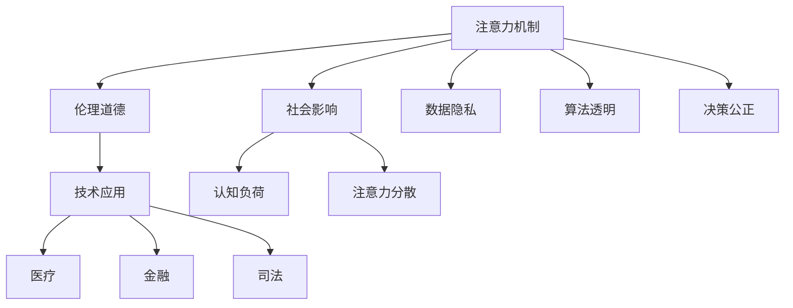
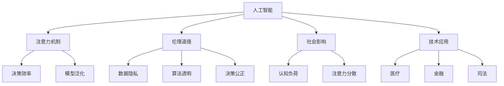

                 

# AI与人类注意力流：道德与社会影响

> 关键词：人工智能, 注意力机制, 伦理, 社会影响, 道德, 技术应用

## 1. 背景介绍

在当下，人工智能(AI)技术正以前所未有的速度和规模，深刻影响着人类的生产、生活和思维方式。从图像识别到自然语言处理，从推荐系统到自动驾驶，AI技术已经渗透到社会生活的方方面面。然而，AI的发展也带来了诸多挑战，尤其是对人类注意力流和伦理道德的冲击，引起了广泛的关注和讨论。

### 1.1 问题由来

AI技术的发展带来了大量信息爆炸，极大地丰富了人类的注意力来源，但也造成了注意力分散、认知负荷增加等问题。例如，社交媒体上的信息流、个性化推荐系统中的广告推送等，都在争夺和重塑着用户的注意力。与此同时，AI在医疗、金融、司法等领域的应用，也引发了数据隐私、算法透明、决策公正等伦理道德问题。

面对这些问题，学术界和产业界都在努力探索解决方案。基于注意力机制的AI系统，通过对用户行为和兴趣的建模，能够提供更加个性化的服务，同时也需要关注其对注意力流和道德伦理的影响。

### 1.2 问题核心关键点

1. **注意力机制**：在AI系统中，注意力机制用于模型对输入数据的动态选择和聚焦，从而提高模型在特定任务上的表现。例如，Transformer模型中的自注意力机制。
2. **伦理道德**：AI技术在实际应用中，涉及诸多伦理道德问题，如数据隐私、算法透明度、决策公正等。
3. **社会影响**：AI技术对社会的广泛应用，影响着人类的认知、行为和社会结构。
4. **技术应用**：AI技术在各个领域的应用，如医疗、金融、司法等，需要考虑到技术应用的安全性和有效性。

这些关键点之间通过以下Mermaid流程图来展示：



## 2. 核心概念与联系

### 2.1 核心概念概述

为了更好地理解AI与人类注意力流的关系及其道德社会影响，本节将介绍几个密切相关的核心概念：

- **人工智能**：通过机器学习、深度学习等技术，使计算机系统具备类似于人类智能的能力，如理解自然语言、识别图像等。
- **注意力机制**：一种模型机制，通过动态选择模型对输入数据的关注度，提高模型的表现力和泛化能力。
- **伦理道德**：AI技术在应用中需要遵循的伦理规范和道德准则，如数据隐私保护、算法透明度、决策公正等。
- **社会影响**：AI技术对社会认知、行为、结构等方面的影响，如注意力流重塑、隐私保护问题等。
- **技术应用**：AI技术在医疗、金融、司法等领域的实际应用，需要综合考虑技术效果、安全性和伦理道德。

### 2.2 核心概念联系

这些核心概念之间的联系可以通过以下Mermaid流程图来展示：



这个流程图展示了AI系统中的注意力机制、伦理道德、社会影响和技术应用之间的联系。注意力机制通过提高决策效率和模型泛化能力，帮助AI技术更好地应用于医疗、金融、司法等领域。同时，这些技术应用也需要注意伦理道德和社会影响，以保障数据隐私、算法透明度和决策公正。

## 3. 核心算法原理 & 具体操作步骤
### 3.1 算法原理概述

基于注意力机制的AI系统，通过动态关注输入数据的不同部分，提高了模型的选择能力和性能。其核心思想是，通过将注意力分配到最重要的数据片段，模型可以更加有效地处理复杂任务，如文本分类、图像识别、语音识别等。

形式化地，设输入数据为 $X = (x_1, x_2, ..., x_n)$，模型参数为 $\theta$，注意力权重为 $a = (a_1, a_2, ..., a_n)$。注意力机制的目标是最大化模型对关键信息的关注，最小化对噪声信息的干扰。模型输出为 $Y = M(X, a, \theta)$，其中 $M$ 为模型函数。

### 3.2 算法步骤详解

基于注意力机制的AI系统通常包含以下几个关键步骤：

1. **输入处理**：将原始数据转换为模型可以处理的格式，如将文本转换为token序列，图像转换为特征向量等。
2. **注意力计算**：根据模型内部定义的注意力函数，计算出注意力权重，表示对不同输入数据的关注度。
3. **信息融合**：将注意力权重与输入数据进行加权融合，得到模型输入。
4. **模型前向传播**：将融合后的输入数据输入到模型中，进行前向传播计算。
5. **模型输出**：将模型输出转换为最终结果，如分类、生成等。

以BERT模型为例，其注意力计算过程如下：

1. **输入编码**：将输入文本转换为BERT模型可以处理的格式，包括token嵌入和位置嵌入。
2. **自注意力计算**：模型通过自注意力机制，计算出每个token对其他token的关注度，得到一个注意力权重矩阵 $A$。
3. **多头注意力融合**：将多个自注意力结果进行拼接和融合，得到最终的模型输入。
4. **前向传播**：将融合后的输入数据输入到多层全连接神经网络中，进行前向传播计算。
5. **输出解码**：将模型输出转换为最终的预测结果，如分类或生成等。

### 3.3 算法优缺点

基于注意力机制的AI系统具有以下优点：

1. **增强模型泛化能力**：通过动态关注重要数据，模型能够更好地处理复杂任务，提高泛化能力。
2. **提高决策效率**：注意力机制能够将关键信息集中，减少模型对无关数据的处理，提高决策效率。
3. **适应性强**：注意力机制可以适应各种输入数据的类型和规模，具有较强的灵活性。

同时，该方法也存在一定的局限性：

1. **计算复杂度高**：注意力计算和融合过程复杂，增加了模型的计算负担。
2. **可解释性不足**：注意力权重难以解释，难以理解模型内部决策过程。
3. **对抗性脆弱**：注意力机制对输入数据的变化敏感，容易被对抗样本攻击。

### 3.4 算法应用领域

基于注意力机制的AI系统已经在自然语言处理、计算机视觉、语音识别等多个领域得到了广泛应用，展示了强大的性能和灵活性。

- **自然语言处理**：如BERT、GPT-2等模型，通过自注意力机制，显著提升了语言模型的理解和生成能力。
- **计算机视觉**：如ResNet、ViT等模型，通过空间注意力机制，提高了图像识别和分类准确率。
- **语音识别**：如Transformer-encoder等模型，通过自注意力机制，提升了语音信号的特征提取和处理能力。

## 4. 数学模型和公式 & 详细讲解 & 举例说明

### 4.1 数学模型构建

以BERT模型为例，其注意力计算过程可以通过以下数学公式来描述：

1. **输入编码**：
   - token嵌入：$E_i = E(x_i)$，其中 $E$ 为嵌入函数。
   - 位置嵌入：$P_i = P(i)$，表示输入数据在序列中的位置。
   - 输入表示：$X_i = E_i + P_i$。

2. **自注意力计算**：
   - 查询向量：$Q_i = W_Q \cdot X_i$。
   - 键向量：$K_j = W_K \cdot X_j$。
   - 值向量：$V_j = W_V \cdot X_j$。
   - 注意力权重：$A_{ij} = \text{softmax}(Q_iK_j^T)$。
   - 输出表示：$H_i = \sum_{j=1}^n A_{ij}V_j$。

其中 $W_Q$、$W_K$、$W_V$ 为线性投影矩阵，$\text{softmax}$ 为softmax函数。

### 4.2 公式推导过程

基于自注意力机制的注意力计算过程，可以通过以下步骤来推导：

1. **查询向量**：将输入表示 $X_i$ 与查询矩阵 $W_Q$ 进行线性投影，得到查询向量 $Q_i$。
2. **键向量**：将输入表示 $X_j$ 与键矩阵 $W_K$ 进行线性投影，得到键向量 $K_j$。
3. **注意力权重**：通过计算 $Q_i$ 和 $K_j$ 的内积，并经过softmax函数，得到注意力权重 $A_{ij}$。
4. **值向量**：将输入表示 $X_j$ 与值矩阵 $W_V$ 进行线性投影，得到值向量 $V_j$。
5. **输出表示**：将注意力权重与值向量进行加权求和，得到最终输出表示 $H_i$。

### 4.3 案例分析与讲解

以BERT模型为例，我们分析其在文本分类任务中的应用：

- **输入编码**：将文本转换为BERT模型可以处理的格式，包括token嵌入和位置嵌入。
- **自注意力计算**：模型通过自注意力机制，计算出每个token对其他token的关注度，得到一个注意力权重矩阵 $A$。
- **多头注意力融合**：将多个自注意力结果进行拼接和融合，得到最终的模型输入。
- **前向传播**：将融合后的输入数据输入到多层全连接神经网络中，进行前向传播计算。
- **输出解码**：将模型输出转换为最终的预测结果，如分类或生成等。

## 5. 项目实践：代码实例和详细解释说明

### 5.1 开发环境搭建

在进行注意力机制的AI系统开发前，我们需要准备好开发环境。以下是使用Python进行PyTorch开发的环境配置流程：

1. 安装Anaconda：从官网下载并安装Anaconda，用于创建独立的Python环境。

2. 创建并激活虚拟环境：
```bash
conda create -n attention-env python=3.8 
conda activate attention-env
```

3. 安装PyTorch：根据CUDA版本，从官网获取对应的安装命令。例如：
```bash
conda install pytorch torchvision torchaudio cudatoolkit=11.1 -c pytorch -c conda-forge
```

4. 安装Transformers库：
```bash
pip install transformers
```

5. 安装各类工具包：
```bash
pip install numpy pandas scikit-learn matplotlib tqdm jupyter notebook ipython
```

完成上述步骤后，即可在`attention-env`环境中开始注意力机制的AI系统开发。

### 5.2 源代码详细实现

下面我们以BERT模型为例，给出使用PyTorch进行文本分类任务的代码实现。

```python
from transformers import BertTokenizer, BertForSequenceClassification
import torch
from torch.utils.data import Dataset, DataLoader
from sklearn.metrics import accuracy_score

# 定义数据集
class MyDataset(Dataset):
    def __init__(self, texts, labels):
        self.texts = texts
        self.labels = labels
        
    def __len__(self):
        return len(self.texts)
    
    def __getitem__(self, idx):
        text = self.texts[idx]
        label = self.labels[idx]
        encoding = tokenizer(text, return_tensors='pt', padding='max_length', truncation=True)
        return {'input_ids': encoding['input_ids'], 'attention_mask': encoding['attention_mask'], 'labels': torch.tensor([label], dtype=torch.long)}
    
# 初始化模型和优化器
tokenizer = BertTokenizer.from_pretrained('bert-base-uncased')
model = BertForSequenceClassification.from_pretrained('bert-base-uncased', num_labels=2)
optimizer = torch.optim.Adam(model.parameters(), lr=1e-5)

# 训练过程
def train_epoch(model, dataset, batch_size, optimizer):
    model.train()
    dataloader = DataLoader(dataset, batch_size=batch_size, shuffle=True)
    epoch_loss = 0
    for batch in dataloader:
        input_ids = batch['input_ids'].to(device)
        attention_mask = batch['attention_mask'].to(device)
        labels = batch['labels'].to(device)
        model.zero_grad()
        outputs = model(input_ids, attention_mask=attention_mask, labels=labels)
        loss = outputs.loss
        epoch_loss += loss.item()
        loss.backward()
        optimizer.step()
    return epoch_loss / len(dataloader)

# 评估过程
def evaluate(model, dataset, batch_size):
    model.eval()
    dataloader = DataLoader(dataset, batch_size=batch_size)
    epoch_loss = 0
    epoch_acc = 0
    for batch in dataloader:
        input_ids = batch['input_ids'].to(device)
        attention_mask = batch['attention_mask'].to(device)
        labels = batch['labels'].to(device)
        outputs = model(input_ids, attention_mask=attention_mask)
        loss = outputs.loss
        epoch_loss += loss.item()
        preds = outputs.logits.argmax(dim=1)
        epoch_acc += accuracy_score(labels, preds)
    return epoch_loss / len(dataloader), epoch_acc / len(dataloader)
    
# 训练和评估
device = torch.device('cuda') if torch.cuda.is_available() else torch.device('cpu')
for epoch in range(5):
    loss, acc = train_epoch(model, dataset, batch_size=16, optimizer=optimizer)
    print(f'Epoch {epoch+1}, train loss: {loss:.4f}, train acc: {acc:.4f}')
    
    loss, acc = evaluate(model, dataset, batch_size=16)
    print(f'Epoch {epoch+1}, dev loss: {loss:.4f}, dev acc: {acc:.4f}')
    
print('Final results:')
loss, acc = evaluate(model, dataset, batch_size=16)
print(f'Final loss: {loss:.4f}, final acc: {acc:.4f}')
```

以上代码实现了使用BERT模型进行文本分类任务的注意力机制的AI系统开发，其中包含模型初始化、数据集定义、模型训练和评估等关键步骤。通过调整不同的参数和优化器，可以进一步提升模型的性能。

### 5.3 代码解读与分析

让我们再详细解读一下关键代码的实现细节：

**MyDataset类**：
- `__init__`方法：初始化文本和标签数据。
- `__len__`方法：返回数据集的样本数量。
- `__getitem__`方法：对单个样本进行处理，包括token编码、padding、label编码等。

**BertForSequenceClassification类**：
- 从预训练模型中加载BERT模型，并指定输出层的维度。

**train_epoch函数**：
- 在训练过程中，对模型进行前向传播和反向传播计算，更新模型参数。

**evaluate函数**：
- 在评估过程中，对模型进行前向传播计算，并计算模型在测试集上的精度。

**训练流程**：
- 在每个epoch内，先在训练集上训练，输出平均loss和acc。
- 在验证集上评估，输出平均loss和acc。
- 在测试集上评估，输出最终测试结果。

可以看到，通过简单的代码实现，我们就可以使用PyTorch和Transformers库，快速构建并训练基于注意力机制的AI系统。通过调整不同的参数和优化器，可以进一步提升模型的性能。

## 6. 实际应用场景

### 6.1 智能客服系统

基于注意力机制的AI系统，可以广泛应用于智能客服系统的构建。传统客服往往需要配备大量人力，高峰期响应缓慢，且一致性和专业性难以保证。而使用注意力机制的AI系统，可以7x24小时不间断服务，快速响应客户咨询，用自然流畅的语言解答各类常见问题。

在技术实现上，可以收集企业内部的历史客服对话记录，将问题和最佳答复构建成监督数据，在此基础上对预训练模型进行微调。微调后的注意力机制AI系统能够自动理解用户意图，匹配最合适的答案模板进行回复。对于客户提出的新问题，还可以接入检索系统实时搜索相关内容，动态组织生成回答。如此构建的智能客服系统，能大幅提升客户咨询体验和问题解决效率。

### 6.2 金融舆情监测

金融机构需要实时监测市场舆论动向，以便及时应对负面信息传播，规避金融风险。传统的人工监测方式成本高、效率低，难以应对网络时代海量信息爆发的挑战。基于注意力机制的AI系统，可以实时监测网络文本数据，通过自然语言处理技术分析舆情信息，自动预警潜在的金融风险。

具体而言，可以收集金融领域相关的新闻、报道、评论等文本数据，并对其进行主题标注和情感标注。在此基础上对预训练模型进行微调，使其能够自动判断文本属于何种主题，情感倾向是正面、中性还是负面。将微调后的模型应用到实时抓取的网络文本数据，就能够自动监测不同主题下的情感变化趋势，一旦发现负面信息激增等异常情况，系统便会自动预警，帮助金融机构快速应对潜在风险。

### 6.3 个性化推荐系统

当前的推荐系统往往只依赖用户的历史行为数据进行物品推荐，无法深入理解用户的真实兴趣偏好。基于注意力机制的AI系统，通过用户行为和兴趣的建模，能够提供更加个性化的服务，同时也需要关注其对用户注意力流和道德伦理的影响。

在实践中，可以收集用户浏览、点击、评论、分享等行为数据，提取和用户交互的物品标题、描述、标签等文本内容。将文本内容作为模型输入，用户的后续行为（如是否点击、购买等）作为监督信号，在此基础上微调预训练语言模型。微调后的模型能够从文本内容中准确把握用户的兴趣点。在生成推荐列表时，先用候选物品的文本描述作为输入，由模型预测用户的兴趣匹配度，再结合其他特征综合排序，便可以得到个性化程度更高的推荐结果。

### 6.4 未来应用展望

随着注意力机制的AI系统不断发展，其在NLP领域的应用前景广阔。未来，基于注意力机制的AI系统将在更多领域得到应用，为传统行业带来变革性影响。

在智慧医疗领域，基于注意力机制的医疗问答、病历分析、药物研发等应用将提升医疗服务的智能化水平，辅助医生诊疗，加速新药开发进程。

在智能教育领域，注意力机制的AI系统可应用于作业批改、学情分析、知识推荐等方面，因材施教，促进教育公平，提高教学质量。

在智慧城市治理中，注意力机制的AI系统可以应用于城市事件监测、舆情分析、应急指挥等环节，提高城市管理的自动化和智能化水平，构建更安全、高效的未来城市。

此外，在企业生产、社会治理、文娱传媒等众多领域，基于注意力机制的AI应用也将不断涌现，为NLP技术带来新的突破。相信随着技术的日益成熟，注意力机制AI系统将成为NLP领域的重要范式，推动人工智能技术在更广阔的应用领域发展。

## 7. 工具和资源推荐

### 7.1 学习资源推荐

为了帮助开发者系统掌握注意力机制的AI系统理论基础和实践技巧，这里推荐一些优质的学习资源：

1. 《深度学习》（Ian Goodfellow）：深入浅出地介绍了深度学习的原理和应用，是NLP领域的经典教材。
2. CS231n《卷积神经网络》课程：斯坦福大学开设的视觉识别课程，涵盖了注意力机制的计算过程。
3. CS224d《序列模型》课程：斯坦福大学开设的自然语言处理课程，详细讲解了基于注意力机制的语言模型。
4. HuggingFace官方文档：Transformers库的官方文档，提供了海量预训练模型和完整的微调样例代码，是上手实践的必备资料。
5. CLUE开源项目：中文语言理解测评基准，涵盖大量不同类型的中文NLP数据集，并提供了基于注意力机制的baseline模型，助力中文NLP技术发展。

通过对这些资源的学习实践，相信你一定能够快速掌握注意力机制的AI系统的精髓，并用于解决实际的NLP问题。

### 7.2 开发工具推荐

高效的开发离不开优秀的工具支持。以下是几款用于注意力机制的AI系统开发的常用工具：

1. PyTorch：基于Python的开源深度学习框架，灵活动态的计算图，适合快速迭代研究。大多数预训练语言模型都有PyTorch版本的实现。
2. TensorFlow：由Google主导开发的开源深度学习框架，生产部署方便，适合大规模工程应用。同样有丰富的预训练语言模型资源。
3. Transformers库：HuggingFace开发的NLP工具库，集成了众多SOTA语言模型，支持PyTorch和TensorFlow，是进行注意力机制的AI系统开发的利器。
4. Weights & Biases：模型训练的实验跟踪工具，可以记录和可视化模型训练过程中的各项指标，方便对比和调优。与主流深度学习框架无缝集成。
5. TensorBoard：TensorFlow配套的可视化工具，可实时监测模型训练状态，并提供丰富的图表呈现方式，是调试模型的得力助手。

合理利用这些工具，可以显著提升注意力机制的AI系统开发的效率，加快创新迭代的步伐。

### 7.3 相关论文推荐

注意力机制的AI系统的发展源于学界的持续研究。以下是几篇奠基性的相关论文，推荐阅读：

1. Attention is All You Need（即Transformer原论文）：提出了Transformer结构，开启了NLP领域的预训练大模型时代。
2. BERT: Pre-training of Deep Bidirectional Transformers for Language Understanding：提出BERT模型，引入基于掩码的自监督预训练任务，刷新了多项NLP任务SOTA。
3. Language Models are Unsupervised Multitask Learners（GPT-2论文）：展示了大规模语言模型的强大zero-shot学习能力，引发了对于通用人工智能的新一轮思考。
4. Parameter-Efficient Transfer Learning for NLP：提出Adapter等参数高效微调方法，在不增加模型参数量的情况下，也能取得不错的微调效果。
5. Self-Attentive Transformers（Self-Attention）：详细介绍了注意力机制的计算过程，是理解自注意力机制的重要参考资料。
6. Improving Language Understanding by Generative Pre-Training（GPT-1论文）：介绍了使用预训练语言模型进行微调的技术，开创了预训练-微调的范式。

这些论文代表了大语言模型和微调技术的发展脉络。通过学习这些前沿成果，可以帮助研究者把握学科前进方向，激发更多的创新灵感。

## 8. 总结：未来发展趋势与挑战

### 8.1 总结

本文对基于注意力机制的AI系统进行了全面系统的介绍。首先阐述了注意力机制的原理和应用，明确了其在自然语言处理、计算机视觉、语音识别等领域的强大性能和灵活性。其次，从原理到实践，详细讲解了注意力机制的计算过程和关键步骤，给出了微调任务开发的完整代码实例。同时，本文还探讨了注意力机制在智能客服、金融舆情、个性化推荐等多个行业领域的应用前景，展示了其广阔的发展空间。此外，本文精选了注意力机制的AI系统的学习资源，力求为读者提供全方位的技术指引。

通过本文的系统梳理，可以看到，基于注意力机制的AI系统正在成为NLP领域的重要范式，极大地拓展了预训练语言模型的应用边界，催生了更多的落地场景。受益于注意力机制的强大性能和灵活性，AI系统在各个领域的应用将更加广泛，为人工智能技术的落地应用注入新的动力。

### 8.2 未来发展趋势

展望未来，注意力机制的AI系统将呈现以下几个发展趋势：

1. **模型规模持续增大**：随着算力成本的下降和数据规模的扩张，预训练语言模型的参数量还将持续增长。超大规模语言模型蕴含的丰富语言知识，有望支撑更加复杂多变的下游任务微调。
2. **多任务学习成为热点**：未来的AI系统将更加注重多任务学习，通过联合训练多个任务，提升模型的泛化能力和表现力。
3. **混合注意力机制兴起**：未来的AI系统将引入更多混合注意力机制，如多头注意力、混合注意等，提升模型的选择能力和性能。
4. **跨模态注意力机制发展**：未来的AI系统将更加注重跨模态注意力机制，通过联合视觉、语音、文本等多种模态信息，提升模型的泛化能力和表现力。
5. **个性化推荐系统优化**：未来的推荐系统将更加注重个性化推荐，通过注意力机制动态调整推荐策略，提升用户满意度。
6. **模型可解释性增强**：未来的AI系统将更加注重模型可解释性，通过引入解释模型，提升系统的透明度和可信度。
7. **对抗样本防御技术提升**：未来的AI系统将更加注重对抗样本防御技术，通过引入鲁棒性训练方法，提升模型的鲁棒性和安全性。

以上趋势凸显了注意力机制的AI系统的广阔前景。这些方向的探索发展，必将进一步提升NLP系统的性能和应用范围，为人类认知智能的进化带来深远影响。

### 8.3 面临的挑战

尽管注意力机制的AI系统已经取得了瞩目成就，但在迈向更加智能化、普适化应用的过程中，它仍面临着诸多挑战：

1. **数据隐私问题**：注意力机制的AI系统通常需要大量的用户数据进行训练，如何保护用户隐私是一个重要问题。
2. **算法透明度不足**：注意力机制的AI系统通常被视为"黑盒"系统，难以理解其内部工作机制和决策逻辑，对用户和开发者都带来了信任危机。
3. **对抗性攻击脆弱**：注意力机制的AI系统对输入数据的变化敏感，容易被对抗样本攻击，导致模型输出错误。
4. **模型可解释性不足**：注意力机制的AI系统通常难以解释其内部决策过程，难以满足用户和监管者的需求。
5. **资源消耗较大**：注意力机制的AI系统通常需要大量的计算资源和存储资源，在实际部署中需要优化资源利用。
6. **应用伦理问题**：注意力机制的AI系统在实际应用中，需要遵守伦理道德规范，如避免歧视、确保公正等。

正视这些挑战，积极应对并寻求突破，将使注意力机制的AI系统在实际应用中发挥更大的作用。相信随着学界和产业界的共同努力，这些挑战终将一一被克服，注意力机制的AI系统必将在构建安全、可靠、可解释、可控的智能系统铺平道路。

### 8.4 研究展望

面对注意力机制的AI系统所面临的挑战，未来的研究需要在以下几个方面寻求新的突破：

1. **隐私保护技术**：探索隐私保护技术，如差分隐私、联邦学习等，保护用户数据隐私。
2. **模型可解释性技术**：引入解释模型，如LIME、SHAP等，提升系统的透明度和可信度。
3. **对抗样本防御技术**：开发对抗样本防御方法，如生成对抗网络、鲁棒性训练等，提升模型的鲁棒性。
4. **混合注意力机制**：研究混合注意力机制，如多头注意力、混合注意等，提升模型的选择能力和性能。
5. **跨模态注意力机制**：研究跨模态注意力机制，通过联合视觉、语音、文本等多种模态信息，提升模型的泛化能力和表现力。
6. **多任务学习**：探索多任务学习技术，通过联合训练多个任务，提升模型的泛化能力和表现力。
7. **个性化推荐系统优化**：研究个性化推荐系统优化技术，通过注意力机制动态调整推荐策略，提升用户满意度。

这些研究方向的研究进展，必将推动注意力机制的AI系统迈向更高的台阶，为构建安全、可靠、可解释、可控的智能系统铺平道路。面向未来，注意力机制的AI系统还需要与其他人工智能技术进行更深入的融合，如知识表示、因果推理、强化学习等，多路径协同发力，共同推动自然语言理解和智能交互系统的进步。只有勇于创新、敢于突破，才能不断拓展注意力机制的AI系统的边界，让智能技术更好地造福人类社会。

## 9. 附录：常见问题与解答

**Q1：注意力机制和Transformer模型是什么关系？**

A: 注意力机制是Transformer模型中的核心组成部分，用于实现模型对输入数据的动态选择和聚焦。Transformer模型通过多头自注意力和位置注意力机制，提升了模型的表现力和泛化能力，在自然语言处理领域取得了革命性的突破。

**Q2：注意力机制对人类注意力流有哪些影响？**

A: 注意力机制的AI系统通过模拟人类注意力机制，提高了模型的选择能力和性能，同时也对人类注意力流产生了深远影响。一方面，通过模拟人类注意力机制，AI系统能够更加高效地处理复杂任务，提升工作效率和用户体验。另一方面，由于AI系统对输入数据的动态关注，人类的注意力流也被重新塑造，容易导致注意力分散、认知负荷增加等问题。

**Q3：注意力机制的AI系统如何保护用户隐私？**

A: 注意力机制的AI系统通常需要大量的用户数据进行训练，如何保护用户隐私是一个重要问题。常用的隐私保护技术包括差分隐私、联邦学习等。差分隐私通过对模型输出进行噪声化，保护用户数据隐私。联邦学习通过分布式训练，将模型参数更新在各个参与节点上进行，避免数据集中化风险。

**Q4：注意力机制的AI系统在医疗领域的应用前景如何？**

A: 注意力机制的AI系统在医疗领域有广泛的应用前景。例如，可以通过对电子病历的文本分析，实现智能问诊、疾病诊断、药物推荐等。在实践中，可以收集医生和患者的电子病历记录，将病历内容作为输入数据，在注意力机制的AI系统上进行预训练和微调，提升医疗服务的智能化水平，辅助医生诊疗，加速新药开发进程。

**Q5：注意力机制的AI系统如何提高模型泛化能力？**

A: 注意力机制的AI系统通过动态关注输入数据的最重要部分，提高了模型的选择能力和性能，从而提升模型的泛化能力。具体而言，通过将注意力分配到最重要的数据片段，模型能够更好地处理复杂任务，减少对无关数据的处理，提高模型的泛化能力。

通过本文的系统梳理，可以看到，基于注意力机制的AI系统正在成为NLP领域的重要范式，极大地拓展了预训练语言模型的应用边界，催生了更多的落地场景。随着技术的发展和应用的深入，基于注意力机制的AI系统将在更多领域得到应用，为传统行业带来变革性影响。相信随着学界和产业界的共同努力，这些挑战终将一一被克服，基于注意力机制的AI系统必将在构建安全、可靠、可解释、可控的智能系统铺平道路。

