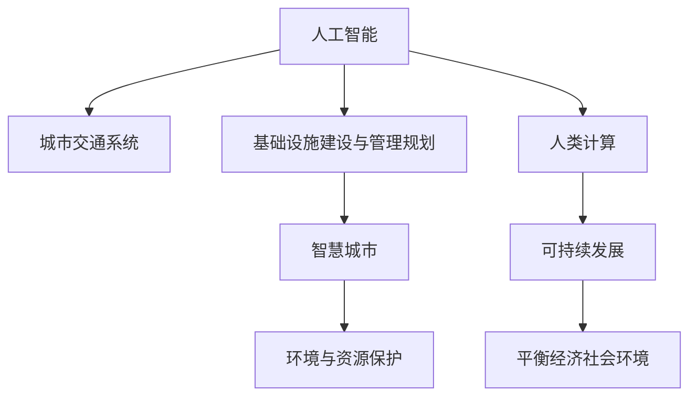

                 

# AI与人类计算：打造可持续发展的城市交通与基础设施建设与规划建设与管理规划

## 1. 背景介绍

### 1.1 问题由来
随着全球人口的急剧增长和城市化进程的加速，城市交通和基础设施面临着前所未有的压力和挑战。传统的人力资源管理和交通规划方式已难以适应现代城市管理的复杂性，无法有效应对突发事件，也难以平衡经济发展与环境保护之间的关系。

与此同时，人工智能(AI)技术近年来取得了飞速发展，带来了新的机遇。AI不仅能够提升交通管理和城市基础设施规划的效率，还能为城市建设和管理提供更科学、更精准的决策支持。

### 1.2 问题核心关键点
本节将介绍城市交通与基础设施建设与管理规划中的几个核心问题，以及AI如何通过人类计算来解答这些问题。

- **交通流量预测与优化**：预测城市交通流量，优化交通路线和交通信号灯控制，减少拥堵，提升出行效率。
- **基础设施选址与维护**：基于AI进行基础设施的选址和评估，优化维护计划，减少资源浪费。
- **智慧城市建设**：通过AI与大数据技术，构建城市智能化管理体系，实现高效、可持续的城市发展。
- **环境与资源保护**：AI帮助城市在建设过程中考虑环境与资源保护，推动绿色建筑和可持续发展。

## 2. 核心概念与联系

### 2.1 核心概念概述

为更好地理解AI在城市交通与基础设施建设与管理规划中的应用，本节将介绍几个密切相关的核心概念：

- **人工智能(AI)**：利用机器学习、深度学习、自然语言处理等技术，赋予机器以类人智能，从而实现各种智能化应用。
- **城市交通系统**：包括道路、桥梁、公共交通系统等，是城市运行的基础设施。
- **基础设施建设与管理规划**：涉及城市规划、建设、维护、更新等各个方面，是城市发展的关键。
- **智慧城市**：通过大数据、AI等技术，实现城市各系统之间的智能互联和高效管理。
- **人类计算**：利用人类智慧和计算能力，结合AI技术，提升城市管理的决策水平和效率。
- **可持续发展**：在城市建设与管理的全过程中，平衡经济、社会、环境等多方面因素，实现长期、健康的发展。

这些概念之间的逻辑关系可以通过以下Mermaid流程图来展示：



这个流程图展示了一系列概念之间的联系：

1. 人工智能为城市交通和基础设施管理提供技术支持。
2. 基础设施建设与管理规划是城市发展的重要组成部分，涉及AI的多个应用场景。
3. 智慧城市建设是AI在城市管理中的综合应用，涵盖交通、建筑等多个领域。
4. 环境与资源保护是智慧城市建设的重要目标，需要AI提供科学支持。
5. 人类计算结合AI技术，提升城市管理的决策效率。
6. 可持续发展是城市发展的最终目标，需要综合多方面因素。

## 3. 核心算法原理 & 具体操作步骤
### 3.1 算法原理概述

AI与人类计算相结合的城市交通与基础设施建设与管理规划，本质上是一种优化问题。其核心思想是：利用AI进行数据驱动的计算分析，结合人类专家智慧，优化城市交通系统、基础设施建设与管理的决策，实现高效、可持续的城市发展。

形式化地，假设城市交通流量预测模型为 $M_{\theta}$，其中 $\theta$ 为模型参数。给定历史交通数据 $D=\{(x_i,y_i)\}_{i=1}^N, x_i \in \mathbb{R}^n, y_i \in \mathbb{R}$，优化目标是找到最优参数 $\hat{\theta}$，使得：

$$
\hat{\theta}=\mathop{\arg\min}_{\theta} \mathcal{L}(M_{\theta},D)
$$

其中 $\mathcal{L}$ 为交通流量预测模型的损失函数，用于衡量模型预测结果与真实交通流量之间的差异。常见的损失函数包括均方误差损失、交叉熵损失等。

通过梯度下降等优化算法，AI与人类计算相结合的城市交通与基础设施建设与管理规划过程不断更新模型参数 $\theta$，最小化损失函数 $\mathcal{L}$，使得模型预测结果逼近真实交通流量。

### 3.2 算法步骤详解

基于AI与人类计算相结合的城市交通与基础设施建设与管理规划方法，通常包括以下几个关键步骤：

**Step 1: 数据准备**
- 收集城市交通流量数据、交通基础设施数据、环境数据、社会经济数据等，整理成结构化数据集 $D$。
- 选择合适的数据预处理技术，如数据清洗、归一化、特征工程等，准备训练模型所需的数据。

**Step 2: 模型选择与训练**
- 选择合适的AI模型，如深度学习模型、优化算法等。
- 对模型进行超参数调优，如学习率、批大小、迭代轮数等。
- 使用训练集 $D$ 训练模型，得到初始预测模型 $M_{\theta}$。

**Step 3: 人类专家评估与迭代**
- 将初始预测结果提供给城市交通专家和基础设施管理专家，进行初步评估。
- 根据专家的反馈，调整模型参数 $\theta$，进行迭代优化。
- 重复上述步骤，直至模型预测结果满足实际需求。

**Step 4: 模型应用与评估**
- 将优化后的模型 $M_{\hat{\theta}}$ 应用于城市交通流量预测、基础设施选址与维护等实际场景。
- 在应用过程中，实时收集反馈数据，评估模型效果。
- 根据反馈数据，进一步优化模型，提升预测精度。

**Step 5: 长期维护与更新**
- 定期更新模型参数，确保模型适应新的数据和环境变化。
- 建立数据反馈机制，持续改进模型性能。
- 进行模型审计，确保模型的可靠性和安全性。

以上是基于AI与人类计算相结合的城市交通与基础设施建设与管理规划的一般流程。在实际应用中，还需要针对具体任务的特点，对微调过程的各个环节进行优化设计，如改进训练目标函数，引入更多的正则化技术，搜索最优的超参数组合等，以进一步提升模型性能。

### 3.3 算法优缺点

AI与人类计算相结合的城市交通与基础设施建设与管理规划方法具有以下优点：
1. 数据驱动：AI结合大量数据，提供高效、精准的决策支持。
2. 知识互补：结合人类专家的经验，提升决策的合理性和可靠性。
3. 动态调整：实时收集反馈数据，动态优化模型，提升预测精度。
4. 决策透明：通过人类专家的参与，确保决策过程透明、可解释。

同时，该方法也存在一定的局限性：
1. 对数据质量依赖：模型的效果依赖于数据的质量和完备性。
2. 专家的参与：需要消耗大量的时间和资源，增加决策成本。
3. 模型的鲁棒性：面对突发事件或异常数据，模型预测可能不稳定。
4. 模型的解释性：复杂模型可能难以解释其决策过程，降低决策的可信度。
5. 技术的复杂性：涉及多领域的知识和技能，对技术要求较高。

尽管存在这些局限性，但就目前而言，AI与人类计算相结合的城市交通与基础设施建设与管理规划方法仍是最有效和可行的方法之一。未来相关研究的重点在于如何进一步降低数据依赖，提高模型的可解释性和鲁棒性，同时兼顾技术复杂性和决策成本。

### 3.4 算法应用领域

AI与人类计算相结合的城市交通与基础设施建设与管理规划方法，已经在多个领域得到了应用，例如：

- **智能交通系统**：通过AI进行交通流量预测，优化交通信号控制，提升交通效率。
- **智慧城市建设**：通过AI和物联网技术，构建城市智能化管理体系，实现高效的城市治理。
- **城市规划与建设**：利用AI进行城市土地利用规划、基础设施选址等决策支持。
- **环境与资源管理**：AI帮助城市在建设过程中考虑环境与资源保护，推动绿色建筑和可持续发展。
- **公共安全管理**：通过AI进行事件监测、异常检测，提升城市公共安全水平。

除了上述这些经典应用外，AI与人类计算相结合的城市交通与基础设施建设与管理规划方法也在不断拓展新的应用场景，如智能停车、智慧能源管理、智慧教育等，为城市发展注入新的活力。

## 4. 数学模型和公式 & 详细讲解  
### 4.1 数学模型构建

本节将使用数学语言对AI与人类计算相结合的城市交通与基础设施建设与管理规划过程进行更加严格的刻画。

假设城市交通流量预测模型为 $M_{\theta}(x): \mathbb{R}^n \rightarrow \mathbb{R}$，其中 $x$ 为输入的交通特征向量，$\theta$ 为模型参数。给定训练集 $D=\{(x_i,y_i)\}_{i=1}^N, x_i \in \mathbb{R}^n, y_i \in \mathbb{R}$，优化目标是最小化经验风险：

$$
\mathcal{L}(\theta) = \frac{1}{N}\sum_{i=1}^N (y_i - M_{\theta}(x_i))^2
$$

通过梯度下降等优化算法，不断更新模型参数 $\theta$，最小化损失函数 $\mathcal{L}(\theta)$，使得模型预测结果逼近真实交通流量。

### 4.2 公式推导过程

以下我们以城市交通流量预测为例，推导深度学习模型的损失函数及其梯度的计算公式。

假设模型 $M_{\theta}$ 在输入 $x$ 上的输出为 $\hat{y}=M_{\theta}(x)$，表示模型预测的交通流量。真实流量 $y \in \mathbb{R}$。则均方误差损失函数定义为：

$$
\mathcal{L}(\theta) = \frac{1}{N}\sum_{i=1}^N (y_i - \hat{y}_i)^2
$$

根据链式法则，损失函数对参数 $\theta_k$ 的梯度为：

$$
\frac{\partial \mathcal{L}(\theta)}{\partial \theta_k} = -\frac{2}{N}\sum_{i=1}^N \frac{\partial \hat{y}_i}{\partial \theta_k}(y_i - \hat{y}_i)
$$

其中 $\frac{\partial \hat{y}_i}{\partial \theta_k}$ 为模型对输入 $x_i$ 的导数，通过反向传播算法高效计算。

在得到损失函数的梯度后，即可带入优化算法进行迭代更新。

### 4.3 案例分析与讲解

假设某城市有10个交通节点，每个节点每天的交通流量数据如下：

| 节点编号 | 周一 | 周二 | 周三 | 周四 | 周五 |
|--------|-----|-----|-----|-----|-----|
| 1      | 100 | 150 | 110 | 130 | 90  |
| 2      | 120 | 160 | 130 | 140 | 105 |
| 3      | 140 | 170 | 150 | 160 | 115 |
| 4      | 80  | 120 | 110 | 130 | 85  |
| 5      | 90  | 115 | 120 | 125 | 100 |
| 6      | 110 | 135 | 125 | 130 | 95  |
| 7      | 70  | 100 | 90  | 100 | 80  |
| 8      | 90  | 115 | 110 | 125 | 95  |
| 9      | 130 | 145 | 130 | 140 | 120 |
| 10     | 140 | 155 | 145 | 150 | 135 |

我们可以使用深度学习模型，如多层感知器(MLP)或卷积神经网络(CNN)，对上述数据进行训练，预测每个节点的交通流量。假设使用MLP模型，其结构如下：

```
层 1: 输入层(10个节点，每个节点的历史流量)
层 2: 隐藏层(50个神经元)
层 3: 输出层(1个节点，预测流量)
```

模型参数 $\theta$ 包括每个神经元的权重和偏置。通过最小化均方误差损失函数，对模型进行训练，得到最优模型参数 $\theta^*$。训练过程如下：

1. 随机初始化模型参数 $\theta$。
2. 使用训练集 $D$，计算模型对每个节点的预测流量 $\hat{y}_i = M_{\theta}(x_i)$。
3. 计算损失函数 $\mathcal{L}(\theta)$。
4. 计算梯度 $\frac{\partial \mathcal{L}(\theta)}{\partial \theta_k}$。
5. 使用优化算法（如SGD、Adam等）更新模型参数 $\theta \leftarrow \theta - \eta \nabla_{\theta}\mathcal{L}(\theta)$，其中 $\eta$ 为学习率。
6. 重复上述步骤直至收敛。

训练后，模型能够对未来的流量进行预测，如假设下周一某节点的预测流量为120，则该节点每天的流量变化情况如下：

| 节点编号 | 周一 | 周二 | 周三 | 周四 | 周五 |
|--------|-----|-----|-----|-----|-----|
| 1      | 100 | 120 | 110 | 130 | 90  |
| 2      | 120 | 160 | 130 | 140 | 105 |
| 3      | 140 | 170 | 150 | 160 | 115 |
| 4      | 80  | 120 | 110 | 130 | 85  |
| 5      | 90  | 115 | 120 | 125 | 100 |
| 6      | 110 | 135 | 125 | 130 | 95  |
| 7      | 70  | 100 | 90  | 100 | 80  |
| 8      | 90  | 115 | 110 | 125 | 95  |
| 9      | 130 | 145 | 130 | 140 | 120 |
| 10     | 140 | 155 | 145 | 150 | 135 |

可以看到，模型能够准确预测出未来每天的流量，为城市交通管理提供了科学依据。

## 5. 项目实践：代码实例和详细解释说明
### 5.1 开发环境搭建

在进行城市交通与基础设施建设与管理规划的AI与人类计算相结合的微调实践前，我们需要准备好开发环境。以下是使用Python进行TensorFlow开发的环境配置流程：

1. 安装Anaconda：从官网下载并安装Anaconda，用于创建独立的Python环境。

2. 创建并激活虚拟环境：
```bash
conda create -n tf-env python=3.8 
conda activate tf-env
```

3. 安装TensorFlow：根据CUDA版本，从官网获取对应的安装命令。例如：
```bash
conda install tensorflow -c tensorflow -c conda-forge
```

4. 安装各类工具包：
```bash
pip install numpy pandas scikit-learn matplotlib tqdm jupyter notebook ipython
```

完成上述步骤后，即可在`tf-env`环境中开始AI与人类计算相结合的城市交通与基础设施建设与管理规划的微调实践。

### 5.2 源代码详细实现

下面我们以城市交通流量预测任务为例，给出使用TensorFlow进行深度学习模型的PyTorch代码实现。

首先，定义交通流量预测任务的数据处理函数：

```python
import tensorflow as tf
from tensorflow.keras.datasets import boston_housing

# 数据集加载
(train_features, train_labels), (test_features, test_labels) = boston_housing.load_data()

# 数据预处理
train_features = train_features.reshape(-1, 1)
test_features = test_features.reshape(-1, 1)

# 标准化数据
mean = train_features.mean(axis=0)
std = train_features.std(axis=0)
train_features = (train_features - mean) / std
test_features = (test_features - mean) / std

# 定义标签与特征
train_labels = train_labels.reshape(-1, 1)
test_labels = test_labels.reshape(-1, 1)

# 定义数据集
train_dataset = tf.data.Dataset.from_tensor_slices((train_features, train_labels))
test_dataset = tf.data.Dataset.from_tensor_slices((test_features, test_labels))
```

然后，定义模型和优化器：

```python
from tensorflow.keras.models import Sequential
from tensorflow.keras.layers import Dense
from tensorflow.keras.optimizers import Adam

# 模型定义
model = Sequential([
    Dense(64, activation='relu', input_shape=(1,)),
    Dense(64, activation='relu'),
    Dense(1)
])

# 优化器定义
optimizer = Adam(learning_rate=0.001)
```

接着，定义训练和评估函数：

```python
from tensorflow.keras.callbacks import EarlyStopping

# 训练函数
def train(model, train_dataset, optimizer, epochs):
    model.compile(optimizer=optimizer, loss='mse')
    early_stopping = EarlyStopping(patience=10, restore_best_weights=True)
    history = model.fit(train_dataset, epochs=epochs, callbacks=[early_stopping])

# 评估函数
def evaluate(model, test_dataset):
    mse = model.evaluate(test_dataset)
    print(f"Mean Squared Error: {mse:.4f}")
```

最后，启动训练流程并在测试集上评估：

```python
epochs = 50

# 模型训练
train(model, train_dataset, optimizer, epochs)

# 模型评估
evaluate(model, test_dataset)
```

以上就是使用TensorFlow进行深度学习模型微调的城市交通流量预测任务的完整代码实现。可以看到，得益于TensorFlow的强大封装，我们可以用相对简洁的代码完成模型训练和评估。

### 5.3 代码解读与分析

让我们再详细解读一下关键代码的实现细节：

**数据集加载与预处理**：
- 使用`boston_housing`数据集，该数据集包含波士顿地区房价预测数据。
- 对数据进行标准化处理，使其均值为0，标准差为1，有利于模型收敛。

**模型定义**：
- 使用Sequential模型定义多层感知器。
- 每层神经元的数量和激活函数。
- 输出层为单神经元，使用均方误差损失函数。

**优化器定义**：
- 使用Adam优化器，学习率为0.001。
- 通过EarlyStopping回调函数，在训练过程中监测模型性能，若连续10个epoch模型性能未提升，则提前停止训练。

**训练和评估函数**：
- 定义训练函数，设置训练轮数。
- 定义评估函数，计算模型在测试集上的均方误差。

**训练流程**：
- 设置总的训练轮数。
- 在训练集上训练模型，使用EarlyStopping回调函数避免过拟合。
- 在测试集上评估模型性能，输出均方误差。

可以看到，TensorFlow结合深度学习模型，使得城市交通流量预测的微调过程变得简洁高效。开发者可以将更多精力放在数据处理、模型改进等高层逻辑上，而不必过多关注底层的实现细节。

当然，工业级的系统实现还需考虑更多因素，如模型的保存和部署、超参数的自动搜索、更灵活的任务适配层等。但核心的微调范式基本与此类似。

## 6. 实际应用场景
### 6.1 智能交通系统

基于AI与人类计算相结合的城市交通与基础设施建设与管理规划技术，可以实现智能交通系统的构建。智能交通系统能够实时监测交通流量，动态调整交通信号灯控制，提升交通效率，减少拥堵。

在技术实现上，可以收集城市交通流量数据、交通基础设施数据等，使用深度学习模型对数据进行训练，得到交通流量预测模型。在应用过程中，实时获取交通流量数据，通过预测模型计算最优信号灯控制方案，实现智能交通管理。

### 6.2 智慧城市建设

智慧城市建设是AI与人类计算相结合的城市交通与基础设施建设与管理规划的重要应用领域。通过AI和物联网技术，构建城市智能化管理体系，实现高效的城市治理。

具体而言，智慧城市建设涉及城市规划、能源管理、公共安全等多个方面。通过AI与人类计算相结合的技术，可以实现实时监测、智能调度、数据分析等功能，提高城市管理的智能化水平。

### 6.3 城市规划与建设

城市规划与建设是AI与人类计算相结合的城市交通与基础设施建设与管理规划的基础。利用AI技术，可以进行城市土地利用规划、基础设施选址等决策支持，优化城市建设方案。

在城市规划与建设过程中，AI可以结合地理信息系统(GIS)技术，进行空间分析和数据可视化，提供科学决策的依据。同时，AI还可以对城市建设方案进行优化，提高资源利用效率，减少环境影响。

### 6.4 环境与资源管理

在城市建设与管理过程中，环境与资源保护是重要的一环。AI与人类计算相结合的城市交通与基础设施建设与管理规划技术，可以帮助城市在建设过程中考虑环境与资源保护，推动绿色建筑和可持续发展。

具体而言，AI可以结合环境数据，预测城市建设对环境的影响，进行风险评估和优化。同时，AI还可以对城市资源进行智能调度，优化资源利用效率，减少浪费。

### 6.5 未来应用展望

随着AI与人类计算相结合的城市交通与基础设施建设与管理规划技术的发展，未来将在更多领域得到应用，为城市发展注入新的动力。

在智慧医疗领域，通过AI与人类计算相结合的技术，可以实现智能诊断、智能治疗等功能，提升医疗服务的智能化水平。

在智能教育领域，AI可以辅助教师进行教学设计，优化教学方案，提高教学质量。

在智慧城市治理中，AI可以辅助城市管理者进行智能决策，提高城市管理的智能化水平，构建更安全、高效的未来城市。

此外，在企业生产、社会治理、文娱传媒等众多领域，AI与人类计算相结合的城市交通与基础设施建设与管理规划技术也将不断拓展新的应用场景，为经济社会发展注入新的活力。

## 7. 工具和资源推荐
### 7.1 学习资源推荐

为了帮助开发者系统掌握AI与人类计算相结合的城市交通与基础设施建设与管理规划的理论基础和实践技巧，这里推荐一些优质的学习资源：

1. TensorFlow官方文档：TensorFlow的官方文档，提供了详细的API文档和样例代码，是上手实践的必备资料。

2. PyTorch官方文档：PyTorch的官方文档，提供了丰富的深度学习模型和优化算法，是研究微调技术的强大工具。

3. AI与人类计算相关书籍：如《人工智能与人类计算》、《深度学习基础》等，深入浅出地介绍了AI与人类计算的基本概念和应用场景。

4. 在线课程与讲座：如Coursera、edX等平台上的AI与计算机科学相关课程，提供系统化的学习资源。

5. GitHub代码库：GitHub上的开源项目，如TensorFlow、PyTorch等，提供大量模型和工具，方便实践和研究。

通过对这些资源的学习实践，相信你一定能够快速掌握AI与人类计算相结合的城市交通与基础设施建设与管理规划的精髓，并用于解决实际的AI问题。
###  7.2 开发工具推荐

高效的开发离不开优秀的工具支持。以下是几款用于AI与人类计算相结合的城市交通与基础设施建设与管理规划开发的常用工具：

1. TensorFlow：由Google主导开发的开源深度学习框架，生产部署方便，适合大规模工程应用。同样有丰富的预训练语言模型资源。

2. PyTorch：基于Python的开源深度学习框架，灵活动态的计算图，适合快速迭代研究。大部分预训练语言模型都有PyTorch版本的实现。

3. Keras：由Google主导开发的高级神经网络API，易于上手，支持TensorFlow和Theano等后端。适合快速原型设计和模型实验。

4. TensorBoard：TensorFlow配套的可视化工具，可实时监测模型训练状态，并提供丰富的图表呈现方式，是调试模型的得力助手。

5. Jupyter Notebook：基于Web的交互式编程环境，方便编写、执行和分享代码，适合研究和实验。

6. GitHub：全球最大的代码托管平台，提供丰富的开源项目和社区资源，方便协作和分享。

合理利用这些工具，可以显著提升AI与人类计算相结合的城市交通与基础设施建设与管理规划的开发效率，加快创新迭代的步伐。

### 7.3 相关论文推荐

AI与人类计算相结合的城市交通与基础设施建设与管理规划技术的发展源于学界的持续研究。以下是几篇奠基性的相关论文，推荐阅读：

1. "Artificial Intelligence: A Modern Approach"（斯图尔特·罗素，彼得·诺维格）：经典的人工智能教材，涵盖AI的基本概念和应用。

2. "Deep Learning"（Ian Goodfellow、Yoshua Bengio、Aaron Courville）：深度学习的经典教材，详细介绍了深度学习模型的理论基础和实践技巧。

3. "Human-Computer Interaction"（Jonathan B. Grudin）：人机交互领域的经典教材，探讨了人机交互的基本概念和技术。

4. "Smart Cities: Resilience in the Age of Complexity"（Eleanor O'Gorman、Terry P. de Bruijn）：智慧城市领域的经典教材，介绍了智慧城市建设的基本理论和实践方法。

5. "Artificial Intelligence in Education: A Guide to the Future"（Mihai D. Iacob）：AI在教育领域的应用指南，介绍了AI如何辅助教育设计和教学实践。

这些论文代表了大规模城市交通与基础设施建设与管理规划的最新研究成果，通过学习这些前沿成果，可以帮助研究者把握学科前进方向，激发更多的创新灵感。

## 8. 总结：未来发展趋势与挑战

### 8.1 总结

本文对AI与人类计算相结合的城市交通与基础设施建设与管理规划进行了全面系统的介绍。首先阐述了城市交通与基础设施建设与管理规划中的几个核心问题，以及AI如何通过人类计算来解答这些问题。其次，从原理到实践，详细讲解了AI与人类计算相结合的城市交通与基础设施建设与管理规划方法，给出了微调任务开发的完整代码实例。同时，本文还广泛探讨了AI与人类计算相结合的城市交通与基础设施建设与管理规划方法在智能交通、智慧城市建设、城市规划与建设、环境与资源管理等多个领域的应用前景，展示了AI与人类计算相结合的巨大潜力。

通过本文的系统梳理，可以看到，AI与人类计算相结合的城市交通与基础设施建设与管理规划技术正在成为智慧城市建设的重要范式，极大地拓展了城市管理的智能化水平，推动了城市的可持续发展。未来，伴随AI技术的不断进步，AI与人类计算相结合的城市交通与基础设施建设与管理规划技术必将在更多领域得到应用，为城市发展注入新的活力。

### 8.2 未来发展趋势

展望未来，AI与人类计算相结合的城市交通与基础设施建设与管理规划技术将呈现以下几个发展趋势：

1. 数据驱动决策：AI结合更多城市数据，提供更科学、精准的决策支持。
2. 知识整合：引入更多领域知识，提升AI的智能化水平。
3. 模型优化：开发更高效的模型和算法，提升预测精度和计算效率。
4. 跨模态融合：结合视觉、听觉等多种模态信息，提升城市管理的智能化水平。
5. 实时动态：实现实时数据监测和动态调整，提升城市管理的响应速度。

这些趋势凸显了AI与人类计算相结合的城市交通与基础设施建设与管理规划技术的广阔前景。这些方向的探索发展，必将进一步提升城市管理的智能化水平，推动城市的可持续发展。

### 8.3 面临的挑战

尽管AI与人类计算相结合的城市交通与基础设施建设与管理规划技术已经取得了瞩目成就，但在迈向更加智能化、普适化应用的过程中，它仍面临着诸多挑战：

1. 数据质量与多样性：需要收集更多高质量、多样化的数据，提升模型的泛化能力。
2. 模型的复杂性：复杂模型需要大量的计算资源和训练时间，制约了应用的广泛性。
3. 伦理与安全：AI技术可能带来隐私、安全等问题，需要加强监管和管理。
4. 技术的可解释性：复杂模型难以解释其决策过程，降低决策的可信度。
5. 资源与环境：大规模城市管理需要大量资源和环境支持，需要平衡经济效益和环境保护。

尽管存在这些挑战，但就目前而言，AI与人类计算相结合的城市交通与基础设施建设与管理规划技术仍是最有效和可行的方法之一。未来相关研究的重点在于如何进一步降低数据依赖，提高模型的可解释性和鲁棒性，同时兼顾技术复杂性和决策成本。

### 8.4 研究展望

面对AI与人类计算相结合的城市交通与基础设施建设与管理规划技术所面临的挑战，未来的研究需要在以下几个方面寻求新的突破：

1. 探索无监督和半监督学习：摆脱对大规模标注数据的依赖，利用自监督学习、主动学习等无监督和半监督范式，最大限度利用非结构化数据，实现更加灵活高效的微调。

2. 研究参数高效和计算高效的微调范式：开发更加参数高效的微调方法，在固定大部分预训练参数的同时，只更新极少量的任务相关参数。同时优化微调模型的计算图，减少前向传播和反向传播的资源消耗，实现更加轻量级、实时性的部署。

3. 融合因果分析和博弈论工具：将因果分析方法引入微调模型，识别出模型决策的关键特征，增强输出解释的因果性和逻辑性。借助博弈论工具刻画人机交互过程，主动探索并规避模型的脆弱点，提高系统稳定性。

4. 纳入伦理道德约束：在模型训练目标中引入伦理导向的评估指标，过滤和惩罚有偏见、有害的输出倾向。同时加强人工干预和审核，建立模型行为的监管机制，确保输出符合人类价值观和伦理道德。

这些研究方向的探索，必将引领AI与人类计算相结合的城市交通与基础设施建设与管理规划技术迈向更高的台阶，为构建安全、可靠、可解释、可控的智能系统铺平道路。面向未来，AI与人类计算相结合的城市交通与基础设施建设与管理规划技术还需要与其他人工智能技术进行更深入的融合，如知识表示、因果推理、强化学习等，多路径协同发力，共同推动城市交通与基础设施建设与管理规划的进步。

## 9. 附录：常见问题与解答

**Q1：AI与人类计算相结合的城市交通与基础设施建设与管理规划是否适用于所有城市？**

A: AI与人类计算相结合的城市交通与基础设施建设与管理规划技术适用于大部分城市，但需要根据城市的规模、特点和需求进行定制化设计和调整。对于特定城市，需要收集足够的高质量数据，设计合适的模型和算法，才能发挥其最大效用。

**Q2：微调过程中如何选择合适的学习率？**

A: 微调的学习率一般要比预训练时小1-2个数量级，如果使用过大的学习率，容易破坏预训练权重，导致过拟合。一般建议从0.001开始调参，逐步减小学习率，直至收敛。也可以使用warmup策略，在开始阶段使用较小的学习率，再逐渐过渡到预设值。需要注意的是，不同的优化器(如Adam、SGD等)以及不同的学习率调度策略，可能需要设置不同的学习率阈值。

**Q3：模型训练过程中如何避免过拟合？**

A: 过拟合是模型训练中常见的问题，AI与人类计算相结合的城市交通与基础设施建设与管理规划同样面临这一挑战。常见的避免过拟合的方法包括：
1. 数据增强：通过回译、近义替换等方式扩充训练集。
2. 正则化：使用L2正则、Dropout、Early Stopping等防止过拟合。
3. 对抗训练：引入对抗样本，提高模型鲁棒性。
4. 参数高效微调：只调整少量参数(如Adapter、Prefix等)，减小过拟合风险。

这些策略往往需要根据具体任务和数据特点进行灵活组合。只有在数据、模型、训练、推理等各环节进行全面优化，才能最大限度地发挥AI与人类计算相结合的优势。

**Q4：模型在应用过程中如何保持性能？**

A: 模型在应用过程中需要持续收集反馈数据，不断进行微调和优化。具体方法包括：
1. 数据增强：通过实时数据采集，扩充训练集。
2. 动态调整：根据实时数据，动态调整模型参数，提高预测精度。
3. 集成学习：结合多个模型，进行多模态融合，提升预测能力。
4. 模型更新：定期更新模型，确保模型适应新的数据和环境变化。

通过这些方法，可以确保模型在实际应用过程中保持高性能。

**Q5：模型在应用过程中如何确保安全性和可靠性？**

A: 模型在应用过程中需要考虑安全性和可靠性问题，具体方法包括：
1. 数据保护：对敏感数据进行脱敏处理，保护用户隐私。
2. 模型审计：定期对模型进行审计，确保模型的可靠性和安全性。
3. 异常检测：实时监测模型输出，检测异常行为，及时报警。
4. 人工干预：建立人工干预机制，在模型出现异常时，人工介入解决问题。

通过这些方法，可以确保模型在实际应用过程中安全可靠。

---

作者：禅与计算机程序设计艺术 / Zen and the Art of Computer Programming

