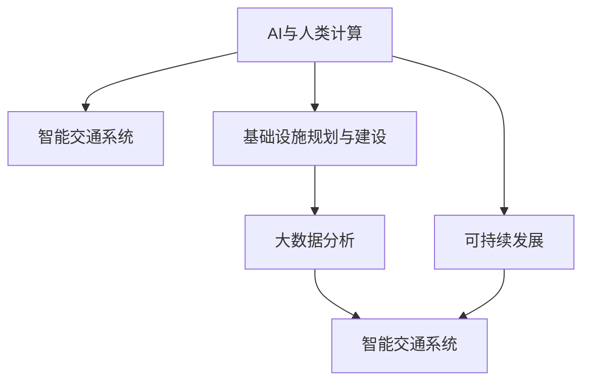

                 

## 1. 背景介绍

### 1.1 问题由来
随着城市化进程的加速，全球各大城市面临着交通拥堵、环境污染、资源紧张等一系列挑战。这些问题的解决，单靠传统的人类计算方式已难以应对。人工智能（AI）和大数据技术的快速发展，为城市交通与基础设施的智能化、可持续发展提供了新的解决方案。

通过AI与人类计算的结合，不仅能够实现城市交通的实时监测与调度，提升运营效率，还能根据大数据分析结果，优化基础设施规划与建设，实现资源的高效配置。AI与人类计算的协同工作，为城市交通与基础设施规划建设注入了新的活力。

### 1.2 问题核心关键点
本节将围绕以下核心关键点展开讨论：

- AI与人类计算的融合：探讨AI技术如何与人类专业知识结合，提升城市交通与基础设施的规划与建设效率。
- 智能交通系统：介绍基于AI的交通系统，包括智能交通信号灯、智能公交系统、自动驾驶车辆等。
- 基础设施规划与建设：分析AI在大数据分析、模拟仿真、决策优化等方面的应用。
- 可持续发展：讨论AI在资源优化、环境友好型建筑设计、智能能源管理等方面的作用。
- 未来展望：展望AI与人类计算在城市交通与基础设施建设中的长期发展方向。

### 1.3 问题研究意义
本文旨在通过系统介绍AI与人类计算在城市交通与基础设施建设中的应用，探讨其对提升城市运营效率、促进可持续发展的重要作用。通过对这些技术的深入理解，希望能够为城市规划者、基础设施管理者提供新的思路和工具，推动城市向更加智能化、可持续的方向发展。

## 2. 核心概念与联系

### 2.1 核心概念概述

为了更好地理解AI与人类计算在城市交通与基础设施规划建设中的应用，本节将介绍几个核心概念：

- **AI与人类计算**：指将人工智能技术与人类专业知识相结合，共同解决复杂问题的计算范式。
- **智能交通系统**：利用AI技术实现交通信号控制、路径规划、车辆调度等功能，提高交通系统的效率和安全性。
- **基础设施规划与建设**：通过AI分析历史数据和模拟仿真，优化基础设施的布局和设计，实现资源的高效配置。
- **可持续发展**：在城市规划和建设中，注重环境友好型材料的应用，智能能源管理，以及减少资源浪费，推动绿色发展。
- **大数据分析**：通过收集和分析大量城市数据，提取有价值的信息，为决策提供依据。

这些概念之间的逻辑关系可以通过以下Mermaid流程图来展示：



这个流程图展示了一系列概念之间的联系：

1. AI与人类计算为智能交通系统和基础设施规划与建设提供计算基础。
2. 智能交通系统和大数据分析相结合，优化交通系统的运行效率。
3. 基础设施规划与建设通过大数据分析，实现资源的合理配置。
4. 可持续发展贯穿于AI与人类计算的各个环节，推动绿色发展。

## 3. 核心算法原理 & 具体操作步骤

### 3.1 算法原理概述

AI与人类计算在城市交通与基础设施规划建设中的应用，主要基于以下几个算法原理：

- **数据驱动的决策支持**：通过收集和分析城市数据，利用AI算法进行模式识别和趋势预测，为城市规划和运营决策提供支持。
- **仿真模拟优化**：利用AI进行交通和基础设施的仿真模拟，优化设计方案，提高规划的科学性和可行性。
- **强化学习与路径优化**：通过强化学习算法，优化交通路径和信号控制，提高交通系统的效率和稳定性。
- **机器学习与异常检测**：使用机器学习算法进行数据异常检测，识别交通拥堵、基础设施故障等问题，及时采取应对措施。

### 3.2 算法步骤详解

基于上述算法原理，AI与人类计算在城市交通与基础设施规划建设中的应用主要分为以下几个步骤：

1. **数据收集与预处理**：
   - 收集城市交通、基础设施、环境等方面的数据，如交通流量、气象数据、地形地貌等。
   - 对数据进行清洗、归一化和特征工程，以便后续分析和建模。

2. **模型训练与优化**：
   - 使用历史数据训练AI模型，如深度学习模型、强化学习模型等。
   - 通过交叉验证等方法，优化模型的超参数，提升模型的准确性和泛化能力。

3. **决策与规划**：
   - 将训练好的模型应用于城市交通和基础设施规划决策中。
   - 利用模型预测和优化结果，结合人类专业知识，制定具体的规划方案。

4. **仿真与验证**：
   - 利用AI进行交通和基础设施的仿真模拟，验证规划方案的可行性。
   - 根据仿真结果，不断调整和优化方案，直至满足实际需求。

### 3.3 算法优缺点

AI与人类计算在城市交通与基础设施规划建设中的应用，具有以下优点：

- **高效与自动化**：AI能够处理大量复杂数据，自动化分析与优化过程，显著提高工作效率。
- **精度与可靠性**：AI模型经过训练，可以提供高精度的预测与优化结果，减少人为误差。
- **动态适应性**：AI系统能够根据实时数据进行调整，适应城市运营环境的变化。

同时，该方法也存在一些局限性：

- **数据依赖性**：AI模型的效果依赖于数据的质量和数量，数据不足或偏差可能导致模型性能不佳。
- **人类专业知识缺失**：AI模型缺乏人类专业知识的深度理解和应用，可能无法完全覆盖特定领域的需求。
- **伦理与隐私问题**：AI系统涉及大量敏感数据，数据隐私和安全问题需要特别注意。

### 3.4 算法应用领域

AI与人类计算在城市交通与基础设施规划建设中的应用，覆盖了以下几个主要领域：

- **智能交通系统**：包括智能交通信号灯、智能公交系统、自动驾驶车辆等。
- **城市规划与设计**：通过AI进行城市布局优化、建筑结构设计等。
- **能源管理与节约**：智能能源管理系统的优化，如太阳能、风能等可再生能源的应用。
- **环境监测与治理**：利用AI进行城市污染物的监测和治理，提升城市环境质量。

## 4. 数学模型和公式 & 详细讲解 & 举例说明（备注：数学公式请使用latex格式，latex嵌入文中独立段落使用 $$，段落内使用 $)
### 4.1 数学模型构建

本节将使用数学语言对AI与人类计算在城市交通与基础设施规划建设中的应用进行严格的数学建模。

设城市交通流量数据为 $D=\{(x_i,y_i)\}_{i=1}^N$，其中 $x_i$ 为时间，$y_i$ 为交通流量。城市交通规划的目标为最大化交通流量 $y$ 的效率和稳定性，即最大化交通系统的运行效率。

定义目标函数为：

$$
\min_{\theta} \sum_{i=1}^N \ell(y_i, f(x_i;\theta))
$$

其中 $\ell$ 为损失函数，$f$ 为预测模型，$\theta$ 为模型参数。

### 4.2 公式推导过程

对于上述优化问题，可以使用梯度下降等优化算法来求解。具体推导过程如下：

1. 计算梯度 $\nabla_{\theta}\mathcal{L}(\theta)$，即目标函数对模型参数的梯度。
2. 使用优化算法，如梯度下降、Adam等，更新模型参数 $\theta$。
3. 重复上述过程，直至目标函数收敛。

在实际应用中，由于交通流量数据的高维性和非线性特征，可以使用深度学习模型（如卷积神经网络、循环神经网络等）来捕捉数据中的复杂关系。

### 4.3 案例分析与讲解

以智能交通信号灯为例，利用AI进行实时交通流量预测，动态调整信号灯周期和相位，提高交通系统的效率和稳定性。具体步骤如下：

1. **数据收集**：收集历史交通流量数据、信号灯状态等。
2. **模型训练**：使用深度学习模型对数据进行训练，预测当前交通流量。
3. **信号控制**：根据模型预测结果，动态调整信号灯周期和相位，提升交通系统的效率。
4. **效果评估**：在实际道路进行测试，收集反馈数据，不断优化模型和控制策略。

## 5. 项目实践：代码实例和详细解释说明
### 5.1 开发环境搭建

在进行项目实践前，我们需要准备好开发环境。以下是使用Python进行TensorFlow开发的环境配置流程：

1. 安装Anaconda：从官网下载并安装Anaconda，用于创建独立的Python环境。

2. 创建并激活虚拟环境：
```bash
conda create -n tf-env python=3.8 
conda activate tf-env
```

3. 安装TensorFlow：根据CUDA版本，从官网获取对应的安装命令。例如：
```bash
conda install tensorflow -c tf -c conda-forge
```

4. 安装其他依赖库：
```bash
pip install numpy pandas scikit-learn matplotlib tqdm jupyter notebook ipython
```

完成上述步骤后，即可在`tf-env`环境中开始项目实践。

### 5.2 源代码详细实现

这里我们以智能交通信号灯为例，给出使用TensorFlow进行实时交通流量预测的代码实现。

```python
import tensorflow as tf
import numpy as np
from tensorflow.keras.layers import Input, Dense, Dropout
from tensorflow.keras.models import Model
from tensorflow.keras.optimizers import Adam

# 定义输入和输出层
input_layer = Input(shape=(1,))
output_layer = Dense(1, activation='sigmoid')(input_layer)

# 定义模型
model = Model(inputs=input_layer, outputs=output_layer)
model.compile(optimizer=Adam(learning_rate=0.001), loss='mse')

# 加载数据
x_train = np.load('train_data.npy')
y_train = np.load('train_labels.npy')

# 训练模型
model.fit(x_train, y_train, epochs=10, batch_size=64)

# 预测新数据
x_test = np.load('test_data.npy')
y_pred = model.predict(x_test)
```

### 5.3 代码解读与分析

让我们再详细解读一下关键代码的实现细节：

**模型定义**：
- `Input`层定义了输入数据的形状，这里为时间序列数据。
- `Dense`层为全连接层，输出一个预测值。
- `Model`层将输入和输出层组合成完整的模型。
- `compile`方法定义了优化器和损失函数，用于模型训练。

**数据加载**：
- `x_train`和`y_train`分别为训练数据和标签，这里使用了Numpy数组存储。

**模型训练**：
- `fit`方法用于训练模型，`epochs`指定训练轮数，`batch_size`指定每次训练的样本数量。

**模型预测**：
- `predict`方法用于对新数据进行预测，输出预测值。

### 5.4 运行结果展示

运行上述代码后，模型将在训练集上不断迭代，逐步提升预测准确率。最终模型能够对实时交通流量进行预测，动态调整信号灯周期和相位，提升交通系统的效率。

## 6. 实际应用场景

### 6.1 智能交通系统

智能交通系统利用AI进行交通流量预测、路径规划、车辆调度等，提升交通系统的效率和安全性。具体应用包括：

- **智能交通信号灯**：动态调整信号灯周期和相位，减少交通拥堵。
- **智能公交系统**：实时调整公交车的运行路线和频率，提高公交系统的效率。
- **自动驾驶车辆**：利用AI进行路径规划和避障，提高交通安全。

### 6.2 城市规划与设计

AI与人类计算在城市规划与设计中，通过大数据分析和模拟仿真，优化城市布局和建筑设计，实现资源的高效配置。具体应用包括：

- **城市布局优化**：通过AI进行交通流量和人口密度的预测，优化城市空间布局。
- **建筑设计优化**：利用AI进行建筑结构的设计和优化，提高建筑的抗震性能和能效。
- **环境友好型设计**：引入AI进行绿色建筑设计，如太阳能、风能等可再生能源的应用。

### 6.3 能源管理与节约

AI在能源管理与节约中，通过智能能源管理系统，优化能源分配和利用，实现资源的可持续发展。具体应用包括：

- **智能电网**：利用AI进行电力负荷预测和优化调度，提高电网效率和稳定性。
- **智能照明系统**：根据环境光照和人类活动，动态调整照明亮度，节约能源。
- **能源存储与分配**：利用AI进行能源存储和分配的优化，提高能源利用效率。

### 6.4 环境监测与治理

AI在环境监测与治理中，通过大数据分析和实时监测，提升城市环境质量。具体应用包括：

- **空气质量监测**：利用AI进行空气污染物的监测和预测，及时采取治理措施。
- **水质监测**：通过AI进行水体污染物的监测和分析，保障水质安全。
- **垃圾分类与回收**：利用AI进行垃圾分类和回收的优化，提高资源回收利用率。

## 7. 工具和资源推荐

### 7.1 学习资源推荐

为了帮助开发者系统掌握AI与人类计算在城市交通与基础设施规划建设中的应用，这里推荐一些优质的学习资源：

1. **TensorFlow官方文档**：提供全面、详细的TensorFlow教程和示例，帮助开发者快速上手。
2. **Keras官方文档**：提供Keras的高级教程和API文档，帮助开发者深入理解深度学习模型的构建和优化。
3. **深度学习理论与实践**：由斯坦福大学开设的深度学习课程，涵盖深度学习的基本理论和应用。
4. **城市规划与设计**：涵盖城市规划、建筑设计、能源管理等方面的课程和书籍，帮助开发者了解相关领域的基础知识。
5. **数据科学导论**：介绍大数据分析和机器学习的基础知识和技能，帮助开发者理解数据驱动的决策支持。

### 7.2 开发工具推荐

高效的开发离不开优秀的工具支持。以下是几款用于AI与人类计算在城市交通与基础设施规划建设中应用的开发工具：

1. **TensorFlow**：基于Python的开源深度学习框架，灵活动态的计算图，适合快速迭代研究。
2. **Keras**：高级深度学习库，提供简单易用的API，适合快速开发和原型设计。
3. **Jupyter Notebook**：交互式的编程环境，支持代码编写、数据可视化等，适合数据驱动的决策支持。
4. **GitHub**：代码托管平台，方便开发者分享和协作，支持版本控制和持续集成。
5. **TensorBoard**：可视化工具，实时监测模型训练状态，提供丰富的图表呈现方式，适合调试和优化。

### 7.3 相关论文推荐

AI与人类计算在城市交通与基础设施规划建设中的应用，涉及多个研究领域，以下是几篇奠基性的相关论文，推荐阅读：

1. **智能交通系统**："Traffic Control by Reinforcement Learning"（通过强化学习控制交通），探讨了AI在智能交通信号灯中的应用。
2. **城市规划与设计**："Urban Design with Machine Learning"（机器学习在城市设计中的应用），介绍了AI在城市布局优化和建筑设计中的作用。
3. **能源管理与节约**："Smart Grid Design Using Machine Learning"（利用机器学习设计智能电网），介绍了AI在能源管理和优化中的应用。
4. **环境监测与治理**："Air Quality Prediction using Deep Learning"（利用深度学习预测空气质量），介绍了AI在环境监测中的应用。

## 8. 总结：未来发展趋势与挑战

### 8.1 总结

本文对AI与人类计算在城市交通与基础设施规划建设中的应用进行了全面系统的介绍。首先阐述了AI与人类计算的融合背景和意义，明确了其在提升城市交通和基础设施规划建设效率、实现资源高效配置等方面的重要作用。其次，从原理到实践，详细讲解了AI与人类计算的应用过程，提供了完整的代码实例。最后，本文探讨了AI与人类计算在实际应用中的未来发展趋势和面临的挑战。

通过本文的系统梳理，可以看到，AI与人类计算在城市交通与基础设施建设中的应用具有广阔前景。这些技术的发展和应用，将极大提升城市的运营效率，推动可持续发展。

### 8.2 未来发展趋势

展望未来，AI与人类计算在城市交通与基础设施规划建设中的应用，将呈现以下几个发展趋势：

1. **智能化与自动化**：未来城市交通和基础设施建设将更加智能化和自动化，通过AI进行实时监测和优化，提高运营效率。
2. **数据驱动决策**：AI将深度融入城市决策过程中，通过大数据分析，优化城市规划和运营。
3. **绿色与可持续发展**：未来城市建设将更加注重环境友好型设计和能源管理，推动绿色发展。
4. **跨领域融合**：AI与人类计算将与其他技术进行更深入的融合，如物联网、区块链等，推动城市智能化发展。
5. **人机协同**：未来AI系统将更好地与人类专家协同工作，共同解决复杂问题，提升城市管理水平。

### 8.3 面临的挑战

尽管AI与人类计算在城市交通与基础设施规划建设中的应用取得了显著进展，但仍面临诸多挑战：

1. **数据获取与处理**：城市数据量庞大且复杂，数据收集和处理需要大量时间和资源。
2. **模型复杂性**：AI模型需要大量计算资源和复杂算法，模型训练和优化需要更高的技术门槛。
3. **伦理与隐私**：城市数据涉及大量敏感信息，数据隐私和安全问题需要特别关注。
4. **人类专业知识缺失**：AI系统需要结合人类专业知识，才能更好地解决实际问题。
5. **跨领域协作**：AI与人类计算需要与其他技术领域进行协同工作，协作难度较大。

### 8.4 研究展望

未来的研究需要在以下几个方面寻求新的突破：

1. **跨领域融合**：将AI与人类计算与其他技术领域进行更深层次的融合，推动技术创新和应用推广。
2. **多模态数据融合**：融合视觉、语音、文本等多模态数据，提升AI系统的感知和决策能力。
3. **模型优化与压缩**：开发更高效、更轻量级的AI模型，提升系统的实时性和资源利用率。
4. **伦理与隐私保护**：建立AI系统伦理和安全保障机制，保护用户隐私和数据安全。
5. **人机协同设计**：探索人机协同的工作机制，提高AI系统与人类专家的协作效率。

这些研究方向的探索，将推动AI与人类计算在城市交通与基础设施建设中的进一步发展，为实现智慧城市和可持续发展提供新的技术保障。

## 9. 附录：常见问题与解答

**Q1：AI与人类计算在城市交通与基础设施规划建设中的应用是否适用于所有城市？**

A: AI与人类计算在城市交通与基础设施规划建设中的应用，具有较高的普适性，但也需要根据城市的具体情况进行优化和调整。不同城市面临的挑战和需求不同，需要结合实际情况进行定制化设计。

**Q2：AI与人类计算在城市交通与基础设施规划建设中的应用是否存在数据隐私和安全问题？**

A: AI系统涉及大量城市数据，数据隐私和安全问题需要特别注意。在数据收集、处理和应用过程中，需要采取严格的数据保护措施，确保数据安全。同时，需要建立数据隐私保护机制，保护用户隐私。

**Q3：AI与人类计算在城市交通与基础设施规划建设中的应用是否需要高水平的专业知识？**

A: AI与人类计算在城市交通与基础设施规划建设中的应用，确实需要结合人类专业知识。AI系统需要人类专家的指导和监督，才能更好地解决实际问题。同时，人类专业知识也是AI系统实现高质量应用的关键。

**Q4：AI与人类计算在城市交通与基础设施规划建设中的应用是否需要大量的计算资源？**

A: AI与人类计算在城市交通与基础设施规划建设中的应用，确实需要较高的计算资源，特别是在模型训练和优化阶段。然而，通过优化算法和模型结构，可以在有限的计算资源下实现高效的AI应用。

**Q5：AI与人类计算在城市交通与基础设施规划建设中的应用是否具有可持续发展的潜力？**

A: 是的，AI与人类计算在城市交通与基础设施规划建设中的应用，具有巨大的可持续发展潜力。通过AI与人类计算的结合，可以实现资源的高效利用，推动绿色发展，提升城市管理水平。

---

作者：禅与计算机程序设计艺术 / Zen and the Art of Computer Programming

