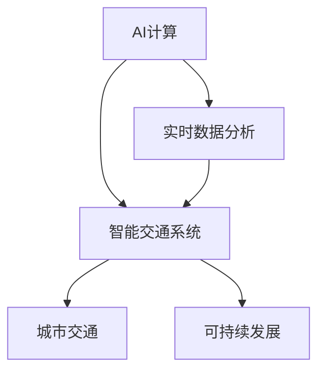

                 

# AI与人类计算：打造可持续发展的城市交通解决方案

> 关键词：AI计算、城市交通、可持续发展、实时数据分析、智能交通系统、云计算

## 1. 背景介绍

### 1.1 问题由来
随着城市化进程的加速和全球人口的增长，城市交通问题愈发严峻。拥堵、污染、事故频发等问题严重影响了居民生活质量和城市经济的持续发展。面对如此巨大的挑战，智能交通系统的建设迫在眉睫。

### 1.2 问题核心关键点
智能交通系统旨在通过高效、实时、智能地管理交通流量，提升道路利用率，减少交通拥堵和环境污染。其核心在于：

- 收集全面的交通数据，包括车辆位置、速度、路线等，为系统提供精准的数据支撑。
- 利用人工智能技术，对数据进行实时分析，预测交通流量变化，优化信号灯、道路导航等控制策略。
- 与人类交通管理者密切协作，实现人机交互，提升交通决策的科学性和效率。

### 1.3 问题研究意义
通过AI与人类计算的结合，智能交通系统能够有效应对城市交通的复杂性，实现可持续发展的目标。具体意义如下：

1. **提高道路利用率**：实时分析交通数据，优化信号灯和路线设计，显著提升道路通行效率。
2. **减少环境污染**：智能管理交通流量，降低车辆排队和拥堵现象，减少燃油消耗和尾气排放。
3. **提升安全水平**：通过实时监控和预警，及时发现和处理潜在的安全隐患，降低交通事故率。
4. **促进经济效益**：智能交通系统可以优化交通资源配置，降低物流成本，提高企业竞争力。
5. **增强用户体验**：提供实时导航和路径规划服务，提升居民出行体验，满足个性化需求。

## 2. 核心概念与联系

### 2.1 核心概念概述

为更好地理解AI与人类计算在智能交通系统中的应用，本节将介绍几个密切相关的核心概念：

- **AI计算**：利用人工智能技术，包括机器学习、深度学习、计算机视觉等，对海量数据进行快速、高效的处理和分析。
- **城市交通**：涉及城市道路、公共交通、自行车道、停车设施等基础设施的建设和管理。
- **可持续发展**：强调在满足当前需求的同时，不损害未来代际满足需求的能力，包括节能减排、资源节约、环境友好等。
- **实时数据分析**：对交通数据进行实时处理和分析，为交通管理提供及时、准确的决策支持。
- **智能交通系统**：融合AI计算与人类交通管理者智慧的系统，通过大数据、物联网、云计算等技术，实现交通管理的智能化、自动化。

这些核心概念之间的逻辑关系可以通过以下Mermaid流程图来展示：



这个流程图展示了AI计算、实时数据分析、智能交通系统、城市交通和可持续发展之间的联系：

1. AI计算为实时数据分析提供强大的技术支持，使其能够高效处理和分析海量交通数据。
2. 智能交通系统通过实时数据分析和AI计算，优化交通管理，提升交通系统的智能化水平。
3. 城市交通系统的优化管理，有助于实现可持续发展目标，如减少碳排放、节约资源等。

## 3. 核心算法原理 & 具体操作步骤
### 3.1 算法原理概述

智能交通系统的核心算法基于AI计算，通过对交通数据的实时分析和处理，实现对交通流量的智能管理。具体流程如下：

1. **数据采集**：通过各种传感器（如摄像头、雷达、GPS等）收集交通数据，包括车辆位置、速度、路线等。
2. **数据预处理**：对采集到的原始数据进行清洗、去噪和标准化处理，提高数据的可用性和分析效率。
3. **实时分析**：利用机器学习模型（如时间序列分析、神经网络等）对处理后的数据进行实时分析，预测交通流量变化。
4. **决策优化**：根据实时分析结果，自动调整信号灯、导航系统等控制策略，优化交通流量。
5. **人机交互**：将分析结果展示给交通管理者，辅助其进行决策，实现人机协作。

### 3.2 算法步骤详解

以下是智能交通系统基于AI计算的详细算法步骤：

**Step 1: 数据采集与预处理**
- 部署传感器和数据采集设备，如摄像头、雷达、GPS等，收集实时交通数据。
- 对采集到的数据进行清洗和预处理，去除噪音和异常数据，标准化数据格式。

**Step 2: 数据存储与传输**
- 将预处理后的数据存储到分布式数据库中，如Hadoop、Spark等，保证数据的高可用性和可扩展性。
- 利用物联网技术，将数据传输到中央处理平台，确保数据的实时性和一致性。

**Step 3: 实时分析与预测**
- 使用时间序列分析模型或深度学习模型（如RNN、LSTM、CNN等），对交通数据进行实时分析和预测，如交通流量、速度变化等。
- 通过特征工程，提取重要的时间、空间、行为等特征，提高模型预测精度。

**Step 4: 决策优化**
- 根据实时分析结果，自动调整信号灯、导航系统等控制策略，优化交通流量。
- 引入强化学习算法，优化信号灯控制策略，提升交通流量的稳定性。

**Step 5: 人机交互与反馈**
- 将分析结果展示给交通管理者，辅助其进行决策，实现人机协作。
- 收集交通管理者的反馈，进一步优化模型和策略，提高系统效率和可靠性。

### 3.3 算法优缺点

智能交通系统的算法具有以下优点：

1. **实时响应**：通过实时数据分析，系统能够快速响应交通流量变化，优化控制策略。
2. **高精度预测**：深度学习等AI算法具有强大的预测能力，能够准确预测交通流量，提升管理效率。
3. **人机协作**：将AI计算与人类交通管理者智慧相结合，提高决策的科学性和可靠性。

同时，该算法也存在以下局限性：

1. **数据依赖性强**：系统的性能高度依赖于数据的质量和数量，数据采集和处理成本较高。
2. **模型复杂度高**：深度学习等模型复杂度高，对计算资源和训练数据有较高要求。
3. **隐私与安全风险**：交通数据涉及个人隐私和城市安全，需要严格的数据保护和隐私管理。

### 3.4 算法应用领域

智能交通系统在多个领域得到广泛应用，具体包括：

1. **智能信号灯管理**：通过实时分析交通数据，自动调整信号灯周期，优化交通流量。
2. **智能导航系统**：利用AI算法和地图数据，提供实时导航和路径规划服务。
3. **公共交通优化**：预测公共交通客流量，优化公交线路和时间表，提升运营效率。
4. **交通安全监控**：实时监控车辆行驶状态，预警潜在的安全隐患，降低事故率。
5. **停车场管理**：通过智能管理，优化停车场资源配置，提升停车效率和用户体验。

此外，智能交通系统还被应用到智慧城市建设、物流管理、环境保护等多个领域，为城市可持续发展提供了有力支持。

## 4. 数学模型和公式 & 详细讲解 & 举例说明

### 4.1 数学模型构建

本节将使用数学语言对智能交通系统进行更加严格的刻画。

记交通数据为 $\mathcal{D}=\{x_i,t_i,y_i\}_{i=1}^N$，其中 $x_i$ 表示车辆位置，$t_i$ 表示时间戳，$y_i$ 表示车辆速度。假设存在一个线性回归模型 $\hat{y}_i=f(x_i)$，其中 $f(x_i)$ 为线性函数。

### 4.2 公式推导过程

以下我们推导线性回归模型的参数估计公式：

设模型误差为 $\epsilon_i=y_i-\hat{y}_i$，则均方误差为：

$$
E(\epsilon^2)=\frac{1}{N}\sum_{i=1}^N(y_i-f(x_i))^2
$$

最小二乘法求解线性回归模型参数 $\beta$ 为：

$$
\beta=(X^TX)^{-1}X^Ty
$$

其中 $X=[x_1,x_2,\dots,x_N]$ 为设计矩阵，$y=[y_1,y_2,\dots,y_N]$ 为样本标签向量。

### 4.3 案例分析与讲解

假设某城市道路交通数据如下表所示：

| 时间 | 车辆位置 | 车辆速度 |
|------|----------|----------|
| 08:00 | 0        | 40       |
| 08:10 | 10       | 50       |
| 08:20 | 20       | 60       |
| ...   | ...      | ...      |
| 10:00 | 100      | 80       |

我们利用线性回归模型预测8:00到10:00之间的车辆速度变化，步骤如下：

1. 构建设计矩阵 $X=[x_1,x_2,\dots,x_N]$ 和样本标签向量 $y=[y_1,y_2,\dots,y_N]$。
2. 计算 $X^TX$ 和 $X^Ty$。
3. 求解 $\beta=(X^TX)^{-1}X^Ty$。
4. 将 $\beta$ 代入模型 $f(x_i)=\beta^Tx_i$，预测任意时间点 $x_i$ 的车辆速度。

假设求解得到 $\beta=[10,2,3]$，则模型表达式为：

$$
f(x_i)=10x_i+2x_i+3
$$

将 $x_i$ 代入模型，可以预测任意时间点的车辆速度。例如，当 $x_i=50$ 时，预测车辆速度为 $10*50+2*50+3=583$ km/h。

## 5. 项目实践：代码实例和详细解释说明
### 5.1 开发环境搭建

在进行智能交通系统开发前，我们需要准备好开发环境。以下是使用Python进行PyTorch开发的环境配置流程：

1. 安装Anaconda：从官网下载并安装Anaconda，用于创建独立的Python环境。

2. 创建并激活虚拟环境：
```bash
conda create -n traffic-env python=3.8 
conda activate traffic-env
```

3. 安装PyTorch：根据CUDA版本，从官网获取对应的安装命令。例如：
```bash
conda install pytorch torchvision torchaudio cudatoolkit=11.1 -c pytorch -c conda-forge
```

4. 安装相关的数据处理和分析库：
```bash
pip install pandas numpy scikit-learn seaborn matplotlib
```

完成上述步骤后，即可在`traffic-env`环境中开始智能交通系统的开发。

### 5.2 源代码详细实现

下面是使用PyTorch实现智能交通系统数据处理和模型训练的代码：

```python
import torch
import torch.nn as nn
import torch.optim as optim
import pandas as pd
from sklearn.preprocessing import StandardScaler
from sklearn.model_selection import train_test_split

# 加载数据
data = pd.read_csv('traffic_data.csv')
X = data[['x', 't']]
y = data['y']
X_train, X_test, y_train, y_test = train_test_split(X, y, test_size=0.2, random_state=42)

# 标准化数据
scaler = StandardScaler()
X_train = scaler.fit_transform(X_train)
X_test = scaler.transform(X_test)

# 定义模型
class TrafficModel(nn.Module):
    def __init__(self, input_dim, output_dim):
        super(TrafficModel, self).__init__()
        self.linear = nn.Linear(input_dim, output_dim)

    def forward(self, x):
        return self.linear(x)

# 训练模型
input_dim = X_train.shape[1]
output_dim = 1
model = TrafficModel(input_dim, output_dim)
criterion = nn.MSELoss()
optimizer = optim.SGD(model.parameters(), lr=0.01)

for epoch in range(100):
    model.train()
    optimizer.zero_grad()
    y_pred = model(X_train)
    loss = criterion(y_pred, y_train)
    loss.backward()
    optimizer.step()
    if epoch % 10 == 0:
        print('Epoch [{}/{}], Loss: {:.4f}'.format(epoch+1, 100, loss.item()))

# 测试模型
model.eval()
with torch.no_grad():
    y_pred = model(X_test)
    print('Test Loss: {:.4f}'.format(criterion(y_pred, y_test).item()))
```

### 5.3 代码解读与分析

让我们再详细解读一下关键代码的实现细节：

**数据加载与预处理**：
- 使用pandas库加载交通数据，并从中选择车辆位置 $x$ 和时间戳 $t$ 作为输入特征，车辆速度 $y$ 作为输出标签。
- 对数据进行标准化处理，提高模型的收敛速度和预测精度。

**模型定义与训练**：
- 定义线性回归模型，使用均方误差损失函数，采用随机梯度下降优化器进行训练。
- 在每个epoch中，计算模型输出和真实标签的差值，反向传播更新模型参数。

**测试模型**：
- 在测试集上评估模型的性能，输出均方误差损失值。

这个代码实例展示了如何使用PyTorch实现简单的线性回归模型，用于预测交通数据。在实际应用中，还需要结合其他AI算法，如深度学习、强化学习等，进行更复杂的分析和决策。

## 6. 实际应用场景
### 6.1 智能信号灯管理

智能信号灯管理系统通过实时分析交通流量数据，自动调整信号灯周期，优化交通流量。该系统在交叉路口部署传感器和摄像头，实时收集车辆位置和速度信息。通过AI算法对数据进行实时分析，预测交通流量变化，并根据预测结果自动调整信号灯周期。例如，在高峰期自动延长绿灯时间，减少车辆排队和拥堵现象。

### 6.2 智能导航系统

智能导航系统利用AI算法和地图数据，提供实时导航和路径规划服务。该系统通过收集实时交通数据，分析道路状况和交通流量，生成最优路径，并提供实时导航指示。例如，在交通拥堵时自动切换备用路线，提高用户的出行效率。

### 6.3 公共交通优化

公共交通优化系统通过预测公共交通客流量，优化公交线路和时间表，提升运营效率。该系统在公交车上安装传感器，实时收集乘客数量和上下车信息。通过AI算法对数据进行分析和预测，优化公交线路和时间表，提升公共交通的运行效率。

### 6.4 交通安全监控

交通安全监控系统通过实时监控车辆行驶状态，预警潜在的安全隐患，降低事故率。该系统在道路上部署摄像头和传感器，实时监控车辆速度和行为。通过AI算法对数据进行实时分析，识别潜在的安全隐患，如超速、闯红灯等行为，并及时发出预警。

### 6.5 停车场管理

停车场管理系统通过智能管理，优化停车场资源配置，提升停车效率和用户体验。该系统在停车场内部署传感器和摄像头，实时监控停车情况。通过AI算法对数据进行分析和预测，优化停车场的车位分配和车辆流动，提高停车效率和用户体验。

## 7. 工具和资源推荐
### 7.1 学习资源推荐

为了帮助开发者系统掌握智能交通系统的开发和应用，这里推荐一些优质的学习资源：

1. 《Python深度学习》书籍：由Francois Chollet所著，详细介绍了深度学习的基本概念和实际应用，包括交通系统中的应用。
2. CS221《机器学习》课程：斯坦福大学开设的机器学习课程，由Andrew Ng教授主讲，讲解了机器学习的核心算法和应用案例。
3. Udacity《自动驾驶工程纳米学位》课程：涵盖自动驾驶和智能交通系统的核心技术，包括传感器数据处理、路径规划、车辆控制等。
4. Coursera《智能交通系统》课程：由John Lovelock教授主讲，介绍了智能交通系统的基本概念、技术实现和应用案例。
5. 《AutoML: Methods, Systems, Challenges》书籍：由Carl Doersch和Jameswen Wang编著，介绍了自动机器学习的最新进展，包括交通系统中的应用。

通过对这些资源的学习实践，相信你一定能够快速掌握智能交通系统的开发和应用，解决实际中的交通问题。

### 7.2 开发工具推荐

高效的开发离不开优秀的工具支持。以下是几款用于智能交通系统开发的常用工具：

1. PyTorch：基于Python的开源深度学习框架，灵活动态的计算图，适合快速迭代研究。
2. TensorFlow：由Google主导开发的开源深度学习框架，生产部署方便，适合大规模工程应用。
3. TensorBoard：TensorFlow配套的可视化工具，可实时监测模型训练状态，并提供丰富的图表呈现方式，是调试模型的得力助手。
4. Weights & Biases：模型训练的实验跟踪工具，可以记录和可视化模型训练过程中的各项指标，方便对比和调优。
5. Hadoop/Spark：分布式数据处理平台，适用于大规模数据存储和处理，保证数据的实时性和一致性。
6. ELK Stack：日志管理和分析工具，适用于智能交通系统中的数据存储和分析，支持实时监控和告警。

合理利用这些工具，可以显著提升智能交通系统的开发效率，加快创新迭代的步伐。

### 7.3 相关论文推荐

智能交通系统的发展离不开学界的持续研究。以下是几篇奠基性的相关论文，推荐阅读：

1. "A Survey on Intelligent Transportation Systems"：一篇综述性论文，介绍了智能交通系统的基本概念、技术实现和应用案例。
2. "Real-Time Traffic Flow Prediction Using Deep Learning"：利用深度学习模型进行交通流量预测的论文，展示了深度学习在智能交通系统中的应用效果。
3. "Optimizing Traffic Light Control Using Reinforcement Learning"：利用强化学习算法优化信号灯控制策略的论文，展示了强化学习在智能交通系统中的应用效果。
4. "Improving Public Transport Efficiency Through Predictive Analytics"：利用机器学习预测公共交通客流量的论文，展示了机器学习在公共交通优化中的应用效果。
5. "Vehicle Behavior Recognition Using Deep Convolutional Neural Networks"：利用深度学习模型识别车辆行驶行为的论文，展示了深度学习在交通安全监控中的应用效果。

这些论文代表了大数据、人工智能在智能交通系统中的最新进展，通过学习这些前沿成果，可以帮助研究者把握学科前进方向，激发更多的创新灵感。

## 8. 总结：未来发展趋势与挑战
### 8.1 总结

本文对基于AI计算的智能交通系统进行了全面系统的介绍。首先阐述了智能交通系统在城市可持续发展中的重要地位，明确了AI计算和人类交通管理者智慧的结合，对提高交通管理效率的独特价值。其次，从原理到实践，详细讲解了智能交通系统的算法流程，给出了实际应用的完整代码实例。同时，本文还广泛探讨了智能交通系统在多个领域的应用前景，展示了AI计算的广泛潜力。

通过本文的系统梳理，可以看到，基于AI计算的智能交通系统正在成为城市交通管理的重要工具，极大地提升了城市交通的智能化水平，促进了可持续发展目标的实现。未来，伴随AI计算技术的持续演进，智能交通系统将带来更高效、更智能的交通解决方案，为城市可持续发展做出更大的贡献。

### 8.2 未来发展趋势

展望未来，智能交通系统的算法将呈现以下几个发展趋势：

1. **多模态数据融合**：融合多种数据来源（如摄像头、雷达、GPS等），提升交通数据的全面性和实时性。
2. **深度学习与强化学习结合**：利用深度学习进行数据处理和预测，利用强化学习优化交通控制策略，提升系统的稳定性和鲁棒性。
3. **实时预测与自适应控制**：通过实时数据分析，动态调整交通控制策略，提升系统的灵活性和适应性。
4. **边缘计算与云计算协同**：在边缘设备上处理实时数据，云计算上进行深度分析和优化，提升系统的性能和可扩展性。
5. **车联网与5G技术融合**：利用车联网技术收集车辆数据，通过5G技术实现高速数据传输，提升系统的智能化水平。

以上趋势凸显了智能交通系统的广阔前景。这些方向的探索发展，必将进一步提升智能交通系统的性能和应用范围，为城市可持续发展提供更加强大的技术支持。

### 8.3 面临的挑战

尽管智能交通系统已经取得了显著进展，但在迈向更加智能化、普适化应用的过程中，仍面临诸多挑战：

1. **数据隐私和安全**：智能交通系统涉及大量个人隐私数据，如何保护数据隐私和安全是重要问题。
2. **数据质量和多样性**：交通数据的获取和处理成本较高，数据质量和多样性不足可能导致模型性能下降。
3. **模型复杂性和可解释性**：深度学习等模型复杂度高，难以解释模型的内部工作机制，需要进一步简化和优化。
4. **算力资源限制**：智能交通系统对计算资源的需求较大，如何在有限的资源条件下实现高效运行是关键问题。
5. **跨部门协作与标准化**：智能交通系统需要跨多个部门协作，标准化接口和数据格式是必要的条件。

### 8.4 研究展望

面对智能交通系统所面临的挑战，未来的研究需要在以下几个方面寻求新的突破：

1. **数据隐私保护**：开发基于区块链和隐私保护技术的数据存储和传输方法，确保数据隐私和安全。
2. **数据增强与预处理**：利用数据增强技术提高数据多样性，利用预处理技术提升数据质量，确保模型的稳定性和泛化性。
3. **模型简化与优化**：开发更加轻量级、可解释的模型，如知识蒸馏、模型压缩等方法，提升系统的可解释性和可维护性。
4. **多部门协作机制**：建立跨部门数据共享和协作机制，推动交通管理的标准化和协同化。
5. **混合计算架构**：探索边缘计算与云计算的混合架构，提升系统的灵活性和可扩展性。

这些研究方向的探索，必将引领智能交通系统向更加智能化、普适化方向发展，为城市可持续发展提供更加坚实的技术保障。

## 9. 附录：常见问题与解答

**Q1: 智能交通系统在实现过程中需要注意哪些问题？**

A: 智能交通系统的实现需要注意以下几个关键问题：

1. **数据获取与处理**：需要全面、准确地收集交通数据，包括车辆位置、速度、路线等。数据质量直接影响模型的预测效果。
2. **模型选择与训练**：需要根据具体任务选择合适的AI模型，如深度学习、强化学习等，并进行充分的数据预处理和模型训练。
3. **人机交互与反馈**：需要设计合理的人机交互界面，使交通管理者能够实时了解系统状态和预测结果，及时进行调整。
4. **系统集成与测试**：需要将不同子系统进行集成，进行全面的系统测试和验证，确保系统的稳定性和可靠性。
5. **安全性与隐私保护**：需要确保系统的数据安全和隐私保护，防止数据泄露和滥用。

**Q2: 智能交通系统在实际应用中如何提升道路通行效率？**

A: 智能交通系统通过实时分析交通流量数据，自动调整信号灯周期和导航策略，显著提升道路通行效率。具体措施包括：

1. **信号灯优化**：利用AI算法预测交通流量变化，自动调整信号灯周期，减少车辆排队和拥堵现象。
2. **导航系统优化**：利用AI算法生成最优路径，避免拥堵路段，提高车辆的通行效率。
3. **交通流量预测**：利用AI算法预测交通流量变化，提前调整交通控制策略，避免拥堵。

**Q3: 智能交通系统如何利用AI计算进行安全监控？**

A: 智能交通系统通过实时监控车辆行驶状态，利用AI计算进行安全监控，具体措施包括：

1. **行为识别**：利用深度学习模型识别车辆行驶行为，如超速、闯红灯等，及时发出预警。
2. **异常检测**：利用异常检测算法监测交通数据，识别异常行为，及时采取措施。
3. **预警系统**：利用预警系统及时通知交通管理者，采取有效措施，避免交通事故的发生。

**Q4: 智能交通系统如何实现可持续发展？**

A: 智能交通系统通过优化交通管理，减少交通拥堵和环境污染，实现可持续发展。具体措施包括：

1. **节能减排**：通过智能交通系统优化交通管理，减少车辆燃油消耗和尾气排放，降低碳排放。
2. **资源节约**：通过智能交通系统优化交通流量，减少车辆排队现象，提高交通资源利用效率。
3. **环境友好**：通过智能交通系统优化交通管理，减少交通事故，提升道路安全性，保护环境。

这些措施将进一步推动城市交通的可持续发展，提升城市居民的生活质量。

**Q5: 智能交通系统如何实现跨部门协作？**

A: 智能交通系统需要跨多个部门协作，具体措施包括：

1. **数据共享机制**：建立跨部门数据共享机制，实现交通数据的全面覆盖和高效利用。
2. **标准接口设计**：设计统一的标准接口，确保不同系统之间的数据交换和协同。
3. **定期会议与沟通**：定期召开跨部门会议，沟通交通管理需求和反馈，促进协作。
4. **联合试点项目**：开展联合试点项目，验证跨部门协作的可行性和效果，积累经验。

这些措施将推动智能交通系统的跨部门协作，实现更高效、更智能的交通管理。

---

作者：禅与计算机程序设计艺术 / Zen and the Art of Computer Programming

