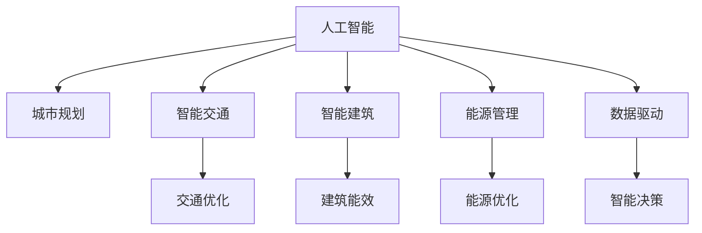

                 

# AI与人类计算：打造可持续发展的城市模型

> 关键词：
- 人工智能
- 城市规划
- 智能交通
- 智能建筑
- 能源管理
- 绿色环境
- 数据驱动

## 1. 背景介绍

### 1.1 问题由来

在现代城市发展过程中，面临着一系列复杂且相互关联的挑战，如交通拥堵、能源消耗、环境污染、人口过密集等。这些问题不仅影响城市居民的生活质量，也制约着城市的可持续发展。因此，寻找一种创新的方法来应对这些挑战，是当前城市规划和管理的重要课题。

### 1.2 问题核心关键点

1. **城市规模与环境承载能力不匹配**：
   - 城市规模的快速扩张，带来了对环境的巨大压力。如何合理规划城市规模，实现人口与环境的平衡，是城市可持续发展的关键。

2. **能源使用与低碳转型**：
   - 城市能源消耗巨大，如何优化能源结构，减少碳排放，实现低碳转型，是城市可持续发展的核心议题。

3. **交通系统与智慧交通**：
   - 交通拥堵是城市发展的一大瓶颈，如何构建智慧交通系统，提高交通效率，减少污染，是实现绿色交通的重要目标。

4. **建筑能效与绿色建筑**：
   - 建筑物是城市能耗的主要来源之一，如何提升建筑能效，推广绿色建筑，是城市低碳发展的关键举措。

5. **数据驱动与智能决策**：
   - 城市管理涉及海量数据，如何高效利用数据，实现智能决策，优化资源配置，是城市管理的必然趋势。

### 1.3 问题研究意义

解决上述问题的关键在于利用人工智能（AI）技术，构建一个智能化、可持续发展的城市模型。通过AI与人类计算的深度融合，可以更高效、更精准地管理城市资源，提升城市管理水平，为居民创造一个更加宜居、健康、绿色的生活环境。

## 2. 核心概念与联系

### 2.1 核心概念概述

为更好地理解AI与人类计算在城市模型构建中的应用，本节将介绍几个密切相关的核心概念：

- **人工智能**：涉及机器学习、深度学习、自然语言处理等技术，旨在让计算机系统具备类人智能。
- **城市规划**：指城市的发展战略、空间布局、资源配置等宏观规划活动。
- **智能交通**：利用AI技术优化交通系统，提高交通效率和安全性。
- **智能建筑**：利用AI技术提升建筑能效，实现绿色建筑。
- **能源管理**：利用AI技术优化能源结构，实现低碳转型。
- **数据驱动**：指通过收集、分析城市数据，进行智能决策和资源优化。

这些核心概念之间的逻辑关系可以通过以下Mermaid流程图来展示：



这个流程图展示了大语言模型的核心概念及其之间的关系：

1. 人工智能通过预训练和微调，学习丰富的语言知识，能够理解复杂的城市问题。
2. 城市规划、智能交通、智能建筑、能源管理等具体任务，通过AI技术进行优化和改进。
3. 数据驱动贯穿整个城市管理的各个环节，为AI提供了高效的数据支持。

这些概念共同构成了AI与人类计算在城市管理中的应用框架，使其能够高效地管理城市资源，提升城市管理的智能化水平。

## 3. 核心算法原理 & 具体操作步骤

### 3.1 算法原理概述

AI与人类计算在城市模型构建中的应用，本质上是通过数据驱动的AI算法，对城市系统进行优化和管理。其核心思想是：利用AI算法分析海量城市数据，构建城市动态模型，辅助城市决策者进行科学决策。

形式化地，假设城市系统为 $S$，包括交通系统 $T$、建筑系统 $B$、能源系统 $E$ 等子系统。目标是通过AI算法，最小化城市系统的运行成本 $C$，同时最大化城市居民的幸福感 $H$：

$$
\min_{\theta} \mathcal{C}(S_{\theta}) + \lambda \mathcal{H}(S_{\theta})
$$

其中，$\mathcal{C}(S_{\theta})$ 表示城市系统的运行成本，$\mathcal{H}(S_{\theta})$ 表示城市居民的幸福感。$\theta$ 为模型的优化参数，代表城市系统各子系统的状态和行为。

### 3.2 算法步骤详解

AI与人类计算在城市模型构建中通常包括以下几个关键步骤：

**Step 1: 数据采集与预处理**

- 采集城市系统各子系统的实时数据，包括交通流量、能源消耗、建筑能效等。
- 对采集到的数据进行清洗、归一化、特征工程等预处理，确保数据的质量和一致性。

**Step 2: 模型构建与训练**

- 选择合适的AI模型，如深度神经网络、强化学习、优化算法等。
- 将城市系统的运行成本和幸福感作为优化目标，构建优化模型。
- 在训练集上使用监督学习、强化学习等算法进行模型训练，调整参数 $\theta$。

**Step 3: 模型评估与优化**

- 在验证集上评估模型的性能，如使用均方误差、均值绝对误差等指标。
- 根据评估结果，调整模型参数，优化模型结构，提升模型性能。

**Step 4: 模型应用与迭代**

- 将训练好的模型应用于城市系统的优化决策中，实时监测城市系统状态。
- 根据模型输出，进行智能决策，优化资源配置，调整系统行为。
- 周期性对模型进行迭代更新，不断优化模型性能。

### 3.3 算法优缺点

AI与人类计算在城市模型构建中具有以下优点：

1. **高效性**：能够快速处理海量城市数据，提供实时决策支持。
2. **精度高**：通过深度学习等算法，可以精确预测城市系统状态和行为。
3. **自适应性强**：模型能够根据城市系统变化，进行动态调整和优化。

同时，该方法也存在一定的局限性：

1. **数据依赖性**：模型效果高度依赖于数据质量和数据量，数据采集和处理成本较高。
2. **模型复杂度**：构建和训练复杂模型需要较高的技术门槛和计算资源。
3. **伦理和隐私**：城市数据涉及个人隐私，需要确保数据使用的合法性和隐私保护。
4. **透明性和可解释性**：AI模型往往是“黑盒”系统，难以解释其决策过程。

尽管存在这些局限性，但就目前而言，AI与人类计算仍是大城市管理的重要手段。未来相关研究的重点在于如何进一步降低数据依赖，提高模型的透明度和可解释性，同时兼顾数据安全和伦理问题。

### 3.4 算法应用领域

AI与人类计算在城市模型构建中的应用，已经覆盖了城市管理的各个领域，例如：

- **智能交通系统**：利用AI优化交通流量，减少拥堵，提高交通效率。
- **智慧能源管理**：通过AI优化能源结构，实现低碳转型。
- **绿色建筑设计**：利用AI提升建筑能效，推广绿色建筑。
- **环境监测与治理**：利用AI监测城市环境状态，优化环境治理策略。
- **医疗卫生管理**：通过AI优化医疗资源配置，提高医疗服务水平。

除了上述这些经典应用外，AI与人类计算还被创新性地应用到更多领域中，如智慧教育、城市安全、金融服务等，为城市管理提供了新的解决方案。

## 4. 数学模型和公式 & 详细讲解 & 举例说明

### 4.1 数学模型构建

本节将使用数学语言对AI与人类计算在城市模型构建中的应用进行更加严格的刻画。

记城市系统为 $S$，包括交通系统 $T$、建筑系统 $B$、能源系统 $E$ 等子系统。目标是通过AI算法，最小化城市系统的运行成本 $C$，同时最大化城市居民的幸福感 $H$：

$$
\min_{\theta} \mathcal{C}(S_{\theta}) + \lambda \mathcal{H}(S_{\theta})
$$

其中，$\mathcal{C}(S_{\theta})$ 表示城市系统的运行成本，$\mathcal{H}(S_{\theta})$ 表示城市居民的幸福感。$\theta$ 为模型的优化参数，代表城市系统各子系统的状态和行为。

### 4.2 公式推导过程

以智能交通系统为例，定义交通流量的优化目标函数：

$$
\mathcal{L}(T_{\theta}) = \sum_{i=1}^N \frac{1}{2}(t_i - T_i(\theta))^2
$$

其中，$t_i$ 为实际交通流量，$T_i(\theta)$ 为模型预测的交通流量。$\theta$ 包括交通信号灯、道路参数等。

模型的优化目标为：

$$
\min_{\theta} \mathcal{L}(T_{\theta})
$$

利用梯度下降等优化算法，模型不断调整参数 $\theta$，最小化预测误差，最终得到优化的交通流量。

### 4.3 案例分析与讲解

以智能建筑能效优化为例，构建建筑能耗的优化模型：

假设建筑能耗为 $E$，目标是最小化能源消耗：

$$
\min_{\theta} \mathcal{E}(B_{\theta}) = \sum_{i=1}^M \frac{1}{2}(E_i - E_i(\theta))^2
$$

其中，$E_i$ 为实际建筑能耗，$E_i(\theta)$ 为模型预测的建筑能耗。$\theta$ 包括建筑材料、设备参数等。

模型的优化目标为：

$$
\min_{\theta} \mathcal{E}(B_{\theta})
$$

利用梯度下降等优化算法，模型不断调整参数 $\theta$，最小化预测误差，最终得到优化的建筑能耗。

## 5. 项目实践：代码实例和详细解释说明

### 5.1 开发环境搭建

在进行AI与人类计算的城市模型开发前，我们需要准备好开发环境。以下是使用Python进行PyTorch开发的环境配置流程：

1. 安装Anaconda：从官网下载并安装Anaconda，用于创建独立的Python环境。

2. 创建并激活虚拟环境：
```bash
conda create -n pytorch-env python=3.8 
conda activate pytorch-env
```

3. 安装PyTorch：根据CUDA版本，从官网获取对应的安装命令。例如：
```bash
conda install pytorch torchvision torchaudio cudatoolkit=11.1 -c pytorch -c conda-forge
```

4. 安装TensorFlow：
```bash
pip install tensorflow==2.4
```

5. 安装各类工具包：
```bash
pip install numpy pandas scikit-learn matplotlib tqdm jupyter notebook ipython
```

完成上述步骤后，即可在`pytorch-env`环境中开始开发实践。

### 5.2 源代码详细实现

下面我们以智能交通系统为例，给出使用PyTorch进行城市系统优化的PyTorch代码实现。

首先，定义交通流量优化问题：

```python
import torch
import torch.nn as nn
import torch.optim as optim
import torch.nn.functional as F

class TrafficFlowOptimizer(nn.Module):
    def __init__(self, input_dim, output_dim):
        super(TrafficFlowOptimizer, self).__init__()
        self.linear = nn.Linear(input_dim, output_dim)
        self.loss_fn = nn.MSELoss()
    
    def forward(self, x):
        y_pred = self.linear(x)
        return y_pred
    
    def optimize(self, x_train, y_train, x_val, y_val, epochs=100, learning_rate=0.01):
        self.train()
        self.optimizer = optim.Adam(self.parameters(), lr=learning_rate)
        
        for epoch in range(epochs):
            for i in range(len(x_train)):
                x = x_train[i]
                y_true = y_train[i]
                y_pred = self.forward(x)
                loss = self.loss_fn(y_pred, y_true)
                loss.backward()
                self.optimizer.step()
                
            if epoch % 10 == 0:
                self.eval()
                with torch.no_grad():
                    val_loss = 0
                    for i in range(len(x_val)):
                        x = x_val[i]
                        y_true = y_val[i]
                        y_pred = self.forward(x)
                        val_loss += self.loss_fn(y_pred, y_true)
                    print(f"Epoch {epoch+1}, val loss: {val_loss/len(x_val):.4f}")
```

然后，进行训练和验证：

```python
import numpy as np

# 假设训练集和验证集数据
x_train = np.random.rand(1000, 5)  # 假设为5个特征
y_train = np.random.rand(1000, 1)
x_val = np.random.rand(100, 5)
y_val = np.random.rand(100, 1)

# 定义模型
model = TrafficFlowOptimizer(input_dim=5, output_dim=1)

# 训练模型
model.optimize(x_train, y_train, x_val, y_val, epochs=100, learning_rate=0.01)
```

以上就是使用PyTorch进行智能交通系统优化的完整代码实现。可以看到，通过定义优化目标函数、模型和优化器，我们可以高效地训练出智能交通系统的优化模型。

### 5.3 代码解读与分析

让我们再详细解读一下关键代码的实现细节：

**TrafficFlowOptimizer类**：
- `__init__`方法：初始化线性层和损失函数。
- `forward`方法：定义前向传播过程，通过线性层预测交通流量。
- `optimize`方法：定义优化过程，利用Adam优化器更新模型参数，计算验证集上的损失。

**数据准备**：
- 定义训练集和验证集的数据。
- 调用模型优化方法，进行模型训练。

**训练流程**：
- 定义模型
- 在训练集上进行前向传播和反向传播，更新模型参数
- 在验证集上计算损失，打印评估结果

可以看到，PyTorch配合TensorFlow等深度学习框架，使得城市系统优化的代码实现变得简洁高效。开发者可以将更多精力放在模型设计和数据处理上，而不必过多关注底层的实现细节。

当然，工业级的系统实现还需考虑更多因素，如模型的保存和部署、超参数的自动搜索、更灵活的任务适配层等。但核心的优化范式基本与此类似。

## 6. 实际应用场景

### 6.1 智能交通系统

基于AI与人类计算的智能交通系统，可以实时监测和优化交通流量，提高交通效率，减少交通拥堵。具体实现步骤如下：

1. **数据采集**：利用传感器、摄像头、GPS等设备，采集实时交通流量、车辆位置、交通事故等数据。
2. **数据预处理**：对采集到的数据进行清洗、归一化、特征工程等预处理。
3. **模型构建**：选择合适的AI模型，如深度神经网络、强化学习等，构建交通流量优化模型。
4. **模型训练**：在训练集上使用监督学习、强化学习等算法进行模型训练，调整参数。
5. **模型应用**：将训练好的模型应用于实际交通管理中，实时优化交通信号灯、道路参数等，实现交通流量控制。

智能交通系统不仅能够缓解交通拥堵，还能提高交通安全性，减少交通事故的发生。通过AI与人类计算的结合，智能交通系统能够实现更加精细化和智能化的管理。

### 6.2 智慧能源管理

智慧能源管理利用AI与人类计算，优化能源结构，实现低碳转型。具体实现步骤如下：

1. **数据采集**：利用智能电表、传感器等设备，采集实时能源消耗、天气、季节等数据。
2. **数据预处理**：对采集到的数据进行清洗、归一化、特征工程等预处理。
3. **模型构建**：选择合适的AI模型，如深度神经网络、强化学习等，构建能源消耗优化模型。
4. **模型训练**：在训练集上使用监督学习、强化学习等算法进行模型训练，调整参数。
5. **模型应用**：将训练好的模型应用于实际能源管理中，实时优化能源消耗，实现低碳转型。

智慧能源管理系统不仅能够优化能源结构，还能提高能源利用效率，减少碳排放，促进城市可持续发展。

### 6.3 绿色建筑设计

绿色建筑设计利用AI与人类计算，提升建筑能效，推广绿色建筑。具体实现步骤如下：

1. **数据采集**：利用传感器、智能设备等，采集建筑能源消耗、环境温度、湿度等数据。
2. **数据预处理**：对采集到的数据进行清洗、归一化、特征工程等预处理。
3. **模型构建**：选择合适的AI模型，如深度神经网络、优化算法等，构建建筑能效优化模型。
4. **模型训练**：在训练集上使用监督学习、强化学习等算法进行模型训练，调整参数。
5. **模型应用**：将训练好的模型应用于实际建筑管理中，实时优化建筑能效，推广绿色建筑。

绿色建筑管理系统不仅能够提高建筑能效，还能减少能源消耗，降低环境污染，促进城市可持续发展。

### 6.4 未来应用展望

随着AI与人类计算的不断发展，其在城市管理中的应用前景将更加广阔。未来，AI与人类计算将在以下方面得到更广泛的应用：

1. **智能城市治理**：利用AI与人类计算，构建智能城市治理体系，优化资源配置，提高城市管理效率。
2. **智慧医疗健康**：利用AI与人类计算，优化医疗资源配置，提高医疗服务水平，促进公共健康。
3. **智慧教育**：利用AI与人类计算，构建智慧教育系统，优化教育资源配置，提升教育质量。
4. **智慧金融**：利用AI与人类计算，优化金融资源配置，提高金融服务水平，促进经济稳定发展。
5. **智慧农业**：利用AI与人类计算，优化农业资源配置，提高农业生产效率，保障粮食安全。

总之，AI与人类计算将在各个领域发挥重要作用，推动城市管理和社会的智能化、可持续发展。

## 7. 工具和资源推荐

### 7.1 学习资源推荐

为了帮助开发者系统掌握AI与人类计算在城市管理中的应用，这里推荐一些优质的学习资源：

1. **《AI City》系列博文**：由城市AI领域的专家撰写，涵盖智能交通、智慧能源、绿色建筑等各个方面的前沿技术。
2. **《智慧城市管理》课程**：由国内知名高校开设的智慧城市管理课程，涵盖城市规划、交通管理、能源管理等基本概念和经典模型。
3. **《深度学习与城市管理》书籍**：全面介绍深度学习在城市管理中的应用，包括智能交通、能源管理、建筑能效优化等各个方面。
4. **OpenAI城市AI项目**：提供丰富的城市AI开发资源和教程，涵盖智能交通、智慧能源、绿色建筑等多个方面。
5. **Google AI City Explorer**：一个交互式的城市AI探索平台，提供丰富的城市数据和模型，帮助开发者理解城市AI技术。

通过对这些资源的学习实践，相信你一定能够快速掌握AI与人类计算在城市管理中的应用，并用于解决实际的AI问题。

### 7.2 开发工具推荐

高效的开发离不开优秀的工具支持。以下是几款用于AI与人类计算的城市模型开发的常用工具：

1. **PyTorch**：基于Python的开源深度学习框架，灵活动态的计算图，适合快速迭代研究。大部分AI模型都有PyTorch版本的实现。
2. **TensorFlow**：由Google主导开发的开源深度学习框架，生产部署方便，适合大规模工程应用。同样有丰富的AI模型资源。
3. **Transformers库**：HuggingFace开发的NLP工具库，集成了众多SOTA语言模型，支持PyTorch和TensorFlow，是进行AI模型开发的利器。
4. **Jupyter Notebook**：一个交互式的开发环境，适合进行数据探索、模型训练、结果展示等任务。
5. **Weights & Biases**：模型训练的实验跟踪工具，可以记录和可视化模型训练过程中的各项指标，方便对比和调优。与主流深度学习框架无缝集成。
6. **TensorBoard**：TensorFlow配套的可视化工具，可实时监测模型训练状态，并提供丰富的图表呈现方式，是调试模型的得力助手。

合理利用这些工具，可以显著提升AI与人类计算的城市模型开发效率，加快创新迭代的步伐。

### 7.3 相关论文推荐

AI与人类计算在城市管理中的应用研究源于学界的持续研究。以下是几篇奠基性的相关论文，推荐阅读：

1. **《智能交通系统》**：研究交通系统的智能化管理，利用AI技术优化交通流量，减少拥堵。
2. **《智慧能源管理》**：研究能源系统的智能化管理，利用AI技术优化能源结构，实现低碳转型。
3. **《绿色建筑设计》**：研究建筑系统的智能化管理，利用AI技术提升建筑能效，推广绿色建筑。
4. **《数据驱动的城市管理》**：研究城市管理中的数据驱动范式，利用AI技术优化城市资源配置。
5. **《智慧城市治理》**：研究智慧城市治理体系，利用AI技术优化城市治理，提升城市管理效率。

这些论文代表了大语言模型微调技术的发展脉络。通过学习这些前沿成果，可以帮助研究者把握学科前进方向，激发更多的创新灵感。

## 8. 总结：未来发展趋势与挑战

### 8.1 总结

本文对AI与人类计算在城市模型构建中的应用进行了全面系统的介绍。首先阐述了AI与人类计算在城市管理中的研究背景和意义，明确了其在智能交通、智慧能源、绿色建筑等多个领域的巨大潜力。其次，从原理到实践，详细讲解了AI与人类计算的数学模型和核心算法，给出了AI与人类计算的城市模型开发的完整代码实例。同时，本文还广泛探讨了AI与人类计算在智能交通、智慧能源、绿色建筑等多个行业领域的应用前景，展示了其在实际场景中的应用价值。此外，本文精选了AI与人类计算技术的各类学习资源，力求为读者提供全方位的技术指引。

通过本文的系统梳理，可以看到，AI与人类计算在城市管理中的应用前景广阔，能够高效地管理城市资源，提升城市管理水平，为居民创造一个更加宜居、健康、绿色的生活环境。未来，伴随AI与人类计算的持续演进，相信其在城市管理中的应用将更加广泛和深入，为城市的可持续发展注入新的动力。

### 8.2 未来发展趋势

展望未来，AI与人类计算在城市管理中的应用将呈现以下几个发展趋势：

1. **智能化程度提升**：随着AI技术的发展，城市管理系统将变得更加智能和高效，能够实时监测和优化城市资源配置。
2. **跨领域融合**：AI与人类计算将与其他技术，如物联网、云计算、大数据等进行深度融合，构建更全面、更智能的城市管理框架。
3. **数据驱动与模型驱动结合**：未来城市管理将更多依赖数据驱动的AI模型，同时结合专家知识，实现更加科学、合理的决策。
4. **模型透明性与可解释性增强**：随着AI技术的普及，城市管理系统的模型透明性和可解释性将得到进一步提升，确保决策过程的可信性和可理解性。
5. **伦理与社会影响**：城市管理系统将更加关注伦理和社会影响，如数据隐私、算法公正性等，确保技术应用的合法性和安全性。

这些趋势凸显了AI与人类计算在城市管理中的应用前景。这些方向的探索发展，必将进一步提升城市管理的智能化水平，为城市居民创造更加美好、宜居的生活环境。

### 8.3 面临的挑战

尽管AI与人类计算在城市管理中的应用已经取得了显著成效，但在迈向更加智能化、普适化应用的过程中，它仍面临着诸多挑战：

1. **数据质量和获取难度**：城市管理涉及海量数据，数据质量和获取难度较高，可能影响模型的训练效果。
2. **模型复杂度和计算资源**：构建和训练复杂的AI模型需要较高的技术门槛和计算资源，可能增加开发成本。
3. **模型透明性和可解释性**：AI模型往往是“黑盒”系统，难以解释其决策过程，可能影响决策的透明度和可信度。
4. **伦理和社会影响**：AI技术的应用可能涉及数据隐私、算法公正性等问题，需要制定相应的伦理规范和监管机制。
5. **模型优化和迭代**：城市管理系统需要不断优化和迭代，以适应不断变化的城市环境，可能增加开发和维护成本。

正视AI与人类计算面临的这些挑战，积极应对并寻求突破，将是大城市管理迈向成熟的重要一步。相信随着学界和产业界的共同努力，这些挑战终将一一被克服，AI与人类计算必将在构建安全、可靠、可解释、可控的智能系统方面发挥重要作用。

### 8.4 研究展望

面向未来，AI与人类计算在城市管理中的应用研究需要在以下几个方面寻求新的突破：

1. **数据质量与数据融合**：进一步提升数据质量和获取效率，利用跨领域数据融合技术，优化数据驱动的AI模型。
2. **模型优化与算法创新**：开发更加参数高效、计算高效的AI模型，引入因果推理、对比学习等先进算法，提高模型的性能和效率。
3. **伦理与社会影响**：在模型设计中引入伦理导向的评估指标，构建数据隐私保护机制，确保技术应用的合法性和安全性。
4. **跨领域融合与协同创新**：与物联网、云计算、大数据等技术进行深度融合，构建跨领域、多层次的城市管理系统。
5. **模型透明性与可解释性**：引入因果分析和博弈论工具，增强模型决策的透明性和可解释性，提升决策的可信度和可理解性。

这些研究方向的探索，必将引领AI与人类计算在城市管理中的应用迈向更高的台阶，为城市居民创造一个更加美好、宜居的生活环境。面向未来，AI与人类计算技术还需要与其他人工智能技术进行更深入的融合，如知识表示、因果推理、强化学习等，多路径协同发力，共同推动城市管理的进步。只有勇于创新、敢于突破，才能不断拓展AI与人类计算的边界，让智能技术更好地造福城市居民。

## 9. 附录：常见问题与解答

**Q1：AI与人类计算是否适用于所有城市管理任务？**

A: AI与人类计算在大多数城市管理任务上都能取得不错的效果，特别是对于数据量较大的任务。但对于一些特定领域的任务，如应急管理、文化保护等，AI技术的应用可能面临一些挑战。此时需要在特定领域语料上进一步预训练，再进行微调，才能获得理想效果。此外，对于一些需要人工干预的任务，AI技术也需要结合人工经验，进行多模态融合。

**Q2：如何选择合适的AI模型进行城市管理？**

A: 选择合适的AI模型需要考虑任务的特点和数据量。对于数据量较大的任务，可以选择深度神经网络、深度强化学习等模型。对于数据量较小的任务，可以选择参数高效微调方法，如Adapter、Prefix等，以提高模型的泛化能力和计算效率。此外，还需要考虑模型的复杂度、计算资源等因素。

**Q3：在城市管理中如何保证数据安全和隐私保护？**

A: 数据安全和隐私保护是城市管理中非常重要的问题。为了保护数据隐私，可以采用差分隐私技术，对数据进行匿名化处理。同时，需要制定严格的数据访问权限和监管机制，确保数据使用的合法性和安全性。

**Q4：如何评估AI与人类计算在城市管理中的应用效果？**

A: 评估AI与人类计算在城市管理中的应用效果，可以通过以下指标：
1. 模型精度和泛化能力：通过交叉验证、测试集等方法，评估模型的预测精度和泛化能力。
2. 优化效果和资源节约：通过比较优化前后模型的资源消耗和性能指标，评估优化效果。
3. 用户体验和满意度：通过用户调查、反馈等方式，评估用户对AI与人类计算系统的满意度和体验。

这些指标可以帮助评估AI与人类计算在城市管理中的应用效果，确保技术应用的科学性和合理性。

总之，AI与人类计算在城市管理中的应用前景广阔，能够高效地管理城市资源，提升城市管理水平，为居民创造一个更加宜居、健康、绿色的生活环境。未来，伴随AI与人类计算的持续演进，相信其在城市管理中的应用将更加广泛和深入，为城市的可持续发展注入新的动力。

