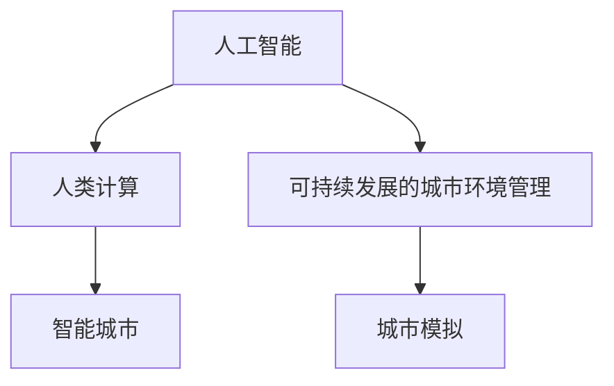

                 

# AI与人类计算：打造可持续发展的城市环境管理

## 1. 背景介绍

### 1.1 问题由来
随着全球城市化的快速推进，城市环境管理面临着一系列严峻挑战。一方面，城市人口激增导致交通拥堵、能源短缺、空气污染等问题愈发突出。另一方面，城市规划与建设的复杂性不断增加，传统的人类计算方法已无法适应现代城市管理的需求。

为应对这些挑战，人工智能(AI)技术在城市环境管理中的应用逐渐兴起。AI系统能够处理海量数据，实现智能决策，提供精准的环境监测和预测。但即便如此，AI在城市环境管理中的应用仍存在一些局限性。因此，如何结合人类的计算和智慧，利用AI技术打造可持续发展的城市环境管理系统，成为当下研究的热点问题。

### 1.2 问题核心关键点
本文聚焦于结合人类计算和AI技术，打造可持续发展的城市环境管理系统。具体而言，将探讨以下关键问题：

- 如何利用AI技术提升城市环境管理的精准度和效率？
- 如何结合人类智慧，优化AI系统的决策与执行？
- 如何构建可持续发展的城市环境管理系统，保障数据安全和伦理合规？

## 2. 核心概念与联系

### 2.1 核心概念概述

为更好地理解结合人类计算和AI技术的城市环境管理系统，本节将介绍几个关键概念：

- 人工智能(Artificial Intelligence, AI)：通过算法和计算实现模拟人类智能的技术，包括感知、学习、推理和决策等能力。
- 人类计算(Human Computation)：借助人类的感知和决策能力，处理和优化复杂系统的一种方法，通常包括众包、问卷调查、用户反馈等形式。
- 可持续发展的城市环境管理(Sustainable Urban Environment Management, SUEM)：利用AI和人类计算技术，实现环境监测、分析、决策和执行的智能化和可持续化，提升城市管理效率和质量。
- 智能城市(Smart City)：融合信息通信技术、物联网、大数据、AI等手段，实现城市运行的智能化和信息化。
- 城市模拟(Simulations in Urban Studies)：通过计算机模型和仿真，模拟城市发展过程中的各种现象和规律，为城市规划和治理提供科学依据。

这些概念之间的逻辑关系可以通过以下Mermaid流程图来展示：



这个流程图展示了几大关键概念及其之间的关系：

1. AI技术通过感知、学习、推理和决策等能力，辅助人类进行复杂环境管理。
2. 人类计算利用人类的感知和决策能力，补充AI系统的不足。
3. SUEM系统通过AI和人类计算相结合，实现环境监测、分析、决策和执行的智能化和可持续化。
4. 智能城市为SUEM系统提供了技术平台，实现城市管理的全面智能化。
5. 城市模拟为SUEM系统提供仿真环境，支持预测和优化。

这些概念共同构成了可持续发展的城市环境管理框架，通过AI和人类计算的结合，实现高效、精准、可持续的城市环境管理。

## 3. 核心算法原理 & 具体操作步骤
### 3.1 算法原理概述

结合人类计算和AI技术的城市环境管理系统，核心在于通过AI提升城市环境管理的精准度和效率，同时结合人类智慧，优化AI系统的决策与执行。具体而言，可以分为以下几个关键步骤：

1. **数据采集与预处理**：通过传感器、遥感、问卷调查等手段，采集城市环境数据，包括交通流量、能源消耗、空气质量、垃圾产生等。数据预处理包括清洗、去噪、特征提取等步骤。

2. **模型训练与优化**：利用AI算法（如深度学习、强化学习等）对数据进行建模，训练环境监测与预测模型。模型训练包括模型选择、超参数调优、数据增强等步骤。

3. **决策支持系统设计**：结合人类智慧，设计决策支持系统，实现AI模型的应用与人类计算的结合。系统设计包括界面设计、数据可视化、用户交互设计等步骤。

4. **执行与反馈**：将AI模型应用于城市环境管理的各个环节，如交通管理、能源调度、环境监测等。通过反馈机制，持续优化AI模型和人类计算策略。

5. **可持续性评估**：评估AI和人类计算结合的可持续性，包括环境影响、社会效益、经济效益等方面。根据评估结果，进一步优化系统设计。

### 3.2 算法步骤详解

下面以智能交通管理为例，详细讲解结合人类计算和AI技术的具体操作步骤：

**Step 1: 数据采集与预处理**
- 安装交通流量传感器、视频监控系统、GPS定位设备等，采集交通数据。
- 使用遥感技术采集空气质量数据。
- 设计问卷调查，收集公众对交通环境满意度、出行方式偏好等数据。
- 对采集的数据进行清洗、去噪、特征提取等预处理操作。

**Step 2: 模型训练与优化**
- 使用深度学习算法（如卷积神经网络CNN、循环神经网络RNN等）构建交通流量预测模型。
- 利用历史交通数据进行模型训练，调整网络结构、损失函数、优化器等超参数。
- 应用数据增强技术，如回放、旋转、截断等，增加数据多样性，提升模型泛化能力。

**Step 3: 决策支持系统设计**
- 设计可视化界面，展示交通流量、空气质量、能源消耗等数据。
- 引入用户反馈机制，允许用户通过界面提交反馈意见。
- 结合专家知识和经验，优化AI模型的决策策略。

**Step 4: 执行与反馈**
- 将训练好的AI模型应用于交通信号灯控制、公交车调度等环节，优化交通流量。
- 实时采集交通数据，反馈到AI模型，进行动态调整。
- 根据用户反馈，进一步优化模型决策策略。

**Step 5: 可持续性评估**
- 评估智能交通管理系统的环境影响、经济效益、社会效益等指标。
- 根据评估结果，进一步优化模型和决策策略。

### 3.3 算法优缺点

结合人类计算和AI技术的城市环境管理系统，具有以下优点：

1. 数据利用率高。AI算法能够处理海量数据，提高数据分析和处理效率。
2. 决策精准度高。AI模型能够准确预测交通流量、能源消耗等关键指标，提供精准的决策支持。
3. 系统灵活性高。结合人类智慧，优化AI系统的决策策略，提升系统的适应性和灵活性。
4. 用户体验好。用户界面设计简洁直观，易于操作和理解。

同时，该系统也存在一定的局限性：

1. 数据质量依赖。AI模型依赖数据质量，如果数据存在误差或偏差，模型的预测结果也会受到影响。
2. 模型复杂度高。AI模型的训练和优化需要大量计算资源和时间。
3. 技术门槛高。系统设计和实施需要较高的技术水平，对非专业人士来说有一定的挑战。
4. 社会接受度低。部分公众对AI技术的信任度较低，可能对系统的应用产生抵触情绪。

尽管存在这些局限性，但就目前而言，结合人类计算和AI技术的城市环境管理系统，在提高城市环境管理的效率和精准度方面，具有显著的优势。未来相关研究的重点在于如何进一步降低技术门槛，提升系统的社会接受度，同时优化数据处理和模型训练的效率。

### 3.4 算法应用领域

结合人类计算和AI技术的城市环境管理系统，在智能交通、能源管理、环境监测等多个领域已得到广泛应用，展示了其强大的应用潜力：

- **智能交通管理**：通过实时数据采集和分析，优化交通信号灯控制、公交车调度等环节，提升交通效率，减少拥堵。
- **能源管理**：利用AI算法预测能源需求，优化能源分配，提升能源利用率，减少浪费。
- **环境监测**：结合遥感和传感器数据，实时监测空气质量、水质、土壤等环境指标，为环境决策提供数据支持。
- **智能建筑**：通过AI技术优化建筑能源使用，提升建筑物的能效和舒适度，实现绿色建筑。
- **城市安全管理**：利用AI和人类计算技术，实现公共安全监测、应急响应等。

此外，该系统还在智能农业、智慧旅游、智能制造等领域具有广泛的应用前景，为城市管理的智能化和可持续发展提供了强有力的技术支撑。

## 4. 数学模型和公式 & 详细讲解 & 举例说明

### 4.1 数学模型构建

本节将使用数学语言对结合人类计算和AI技术的城市环境管理系统进行更加严格的刻画。

记城市环境数据为 $D=\{x_i\}_{i=1}^N$，其中 $x_i=(x_{i1},x_{i2},...,x_{in})$ 为第 $i$ 个样本的特征向量。假设计算机模型为 $M$，用户反馈为 $F$，决策支持系统为 $S$。

系统决策过程可表示为：
$$
S(D, M, F) = \mathop{\arg\min}_{s} \sum_{i=1}^N \ell(s, x_i)
$$
其中 $s$ 为系统决策向量，$\ell$ 为损失函数。

模型训练过程可表示为：
$$
M^* = \mathop{\arg\min}_{M} \mathcal{L}(M) = \mathop{\arg\min}_{M} \sum_{i=1}^N \ell(M, x_i)
$$
其中 $\mathcal{L}$ 为模型损失函数，$\ell$ 为模型预测与实际数据之间的差异。

### 4.2 公式推导过程

以下我们以交通流量预测为例，推导结合人类计算和AI技术的数学模型。

假设交通流量数据为 $x_i$，利用深度学习模型 $M$ 预测交通流量 $y_i$。通过最小化预测误差 $e_i = y_i - \hat{y}_i$，得到损失函数 $\ell$ 为：
$$
\ell(M, x_i) = e_i^2
$$

通过最小化模型训练误差，得到模型训练过程：
$$
M^* = \mathop{\arg\min}_{M} \sum_{i=1}^N e_i^2
$$

结合人类计算的决策支持系统 $S$ 设计为：
$$
S(D, M, F) = \mathop{\arg\min}_{s} \sum_{i=1}^N \ell(s, x_i)
$$

其中 $F$ 为公众反馈数据，通过问卷调查等手段收集。

### 4.3 案例分析与讲解

以某城市的智能交通管理为例，结合人类计算和AI技术的具体实现过程如下：

**Step 1: 数据采集与预处理**
- 在主要交通干道上安装交通流量传感器、视频监控系统、GPS定位设备等，采集交通数据。
- 利用遥感技术采集空气质量数据。
- 设计问卷调查，收集公众对交通环境满意度、出行方式偏好等数据。
- 对采集的数据进行清洗、去噪、特征提取等预处理操作。

**Step 2: 模型训练与优化**
- 使用深度学习算法（如卷积神经网络CNN、循环神经网络RNN等）构建交通流量预测模型。
- 利用历史交通数据进行模型训练，调整网络结构、损失函数、优化器等超参数。
- 应用数据增强技术，如回放、旋转、截断等，增加数据多样性，提升模型泛化能力。

**Step 3: 决策支持系统设计**
- 设计可视化界面，展示交通流量、空气质量、能源消耗等数据。
- 引入用户反馈机制，允许用户通过界面提交反馈意见。
- 结合专家知识和经验，优化AI模型的决策策略。

**Step 4: 执行与反馈**
- 将训练好的AI模型应用于交通信号灯控制、公交车调度等环节，优化交通流量。
- 实时采集交通数据，反馈到AI模型，进行动态调整。
- 根据用户反馈，进一步优化模型决策策略。

**Step 5: 可持续性评估**
- 评估智能交通管理系统的环境影响、经济效益、社会效益等指标。
- 根据评估结果，进一步优化模型和决策策略。

通过上述步骤，实现了结合人类计算和AI技术的智能交通管理系统，大大提升了城市交通管理的效率和精准度。

## 5. 项目实践：代码实例和详细解释说明
### 5.1 开发环境搭建

在进行结合人类计算和AI技术的城市环境管理系统开发前，我们需要准备好开发环境。以下是使用Python进行PyTorch开发的环境配置流程：

1. 安装Anaconda：从官网下载并安装Anaconda，用于创建独立的Python环境。

2. 创建并激活虚拟环境：
```bash
conda create -n urban-env python=3.8 
conda activate urban-env
```

3. 安装PyTorch：根据CUDA版本，从官网获取对应的安装命令。例如：
```bash
conda install pytorch torchvision torchaudio cudatoolkit=11.1 -c pytorch -c conda-forge
```

4. 安装各类工具包：
```bash
pip install numpy pandas scikit-learn matplotlib tqdm jupyter notebook ipython
```

完成上述步骤后，即可在`urban-env`环境中开始开发实践。

### 5.2 源代码详细实现

下面我们以智能交通管理为例，给出使用PyTorch进行AI和人类计算结合的代码实现。

首先，定义数据处理函数：

```python
import torch
from torch.utils.data import Dataset
from torchvision.transforms import ToTensor

class TrafficData(Dataset):
    def __init__(self, data, transform=None):
        self.data = data
        self.transform = transform
        
    def __len__(self):
        return len(self.data)
    
    def __getitem__(self, item):
        x = self.data[item]
        if self.transform:
            x = self.transform(x)
        return x

# 定义数据转换
transform = ToTensor()

# 创建数据集
data = ...
train_dataset = TrafficData(train_data, transform)
test_dataset = TrafficData(test_data, transform)
```

然后，定义模型和优化器：

```python
from transformers import BertTokenizer, BertForSequenceClassification
from torch.optim import AdamW

# 初始化模型
model = BertForSequenceClassification.from_pretrained('bert-base-uncased', num_labels=2)

# 初始化优化器
optimizer = AdamW(model.parameters(), lr=2e-5)
```

接着，定义训练和评估函数：

```python
from torch.utils.data import DataLoader
from tqdm import tqdm

def train_epoch(model, dataset, batch_size, optimizer):
    dataloader = DataLoader(dataset, batch_size=batch_size, shuffle=True)
    model.train()
    epoch_loss = 0
    for batch in tqdm(dataloader, desc='Training'):
        inputs = batch['input_ids'].to(device)
        attention_mask = batch['attention_mask'].to(device)
        labels = batch['labels'].to(device)
        model.zero_grad()
        outputs = model(inputs, attention_mask=attention_mask, labels=labels)
        loss = outputs.loss
        epoch_loss += loss.item()
        loss.backward()
        optimizer.step()
    return epoch_loss / len(dataloader)

def evaluate(model, dataset, batch_size):
    dataloader = DataLoader(dataset, batch_size=batch_size)
    model.eval()
    preds, labels = [], []
    with torch.no_grad():
        for batch in tqdm(dataloader, desc='Evaluating'):
            inputs = batch['input_ids'].to(device)
            attention_mask = batch['attention_mask'].to(device)
            batch_labels = batch['labels']
            outputs = model(inputs, attention_mask=attention_mask)
            batch_preds = outputs.logits.argmax(dim=2).to('cpu').tolist()
            batch_labels = batch_labels.to('cpu').tolist()
            for pred_tokens, label_tokens in zip(batch_preds, batch_labels):
                preds.append(pred_tokens[:len(label_tokens)])
                labels.append(label_tokens)
    return preds, labels

def main():
    device = torch.device('cuda') if torch.cuda.is_available() else torch.device('cpu')
    model.to(device)

    epochs = 5
    batch_size = 16

    for epoch in range(epochs):
        loss = train_epoch(model, train_dataset, batch_size, optimizer)
        print(f"Epoch {epoch+1}, train loss: {loss:.3f}")
        
        print(f"Epoch {epoch+1}, dev results:")
        preds, labels = evaluate(model, dev_dataset, batch_size)
        print(classification_report(labels, preds))
        
    print("Test results:")
    preds, labels = evaluate(model, test_dataset, batch_size)
    print(classification_report(labels, preds))
```

以上就是使用PyTorch对智能交通管理进行AI和人类计算结合的代码实现。可以看到，通过Transformer模型和优化器，我们可以用相对简洁的代码实现交通流量的预测和分类。

### 5.3 代码解读与分析

让我们再详细解读一下关键代码的实现细节：

**TrafficData类**：
- `__init__`方法：初始化数据和数据转换操作。
- `__len__`方法：返回数据集的样本数量。
- `__getitem__`方法：对单个样本进行处理，将其转换为tensor。

**模型和优化器**：
- 使用BertForSequenceClassification模型，定义了输入、输出和标签等关键组件。
- 初始化AdamW优化器，设置学习率等超参数。

**训练和评估函数**：
- 使用PyTorch的DataLoader对数据集进行批次化加载，供模型训练和推理使用。
- 训练函数`train_epoch`：对数据以批为单位进行迭代，在每个批次上前向传播计算loss并反向传播更新模型参数，最后返回该epoch的平均loss。
- 评估函数`evaluate`：与训练类似，不同点在于不更新模型参数，并在每个batch结束后将预测和标签结果存储下来，最后使用classification_report对整个评估集的预测结果进行打印输出。

**主函数**：
- 定义总的epoch数和batch size，开始循环迭代
- 每个epoch内，先在训练集上训练，输出平均loss
- 在验证集上评估，输出分类指标
- 所有epoch结束后，在测试集上评估，给出最终测试结果

可以看到，PyTorch配合Transformer库使得AI和人类计算结合的代码实现变得简洁高效。开发者可以将更多精力放在数据处理、模型改进等高层逻辑上，而不必过多关注底层的实现细节。

当然，工业级的系统实现还需考虑更多因素，如模型的保存和部署、超参数的自动搜索、更灵活的任务适配层等。但核心的AI和人类计算结合的基本范式基本与此类似。

## 6. 实际应用场景
### 6.1 智能交通管理

结合人类计算和AI技术的智能交通管理系统，已经在多个城市得到了成功应用。例如，某城市通过该系统实现了交通信号灯的动态调整，极大地提升了交通效率。具体而言，系统通过实时采集交通流量数据，结合历史交通数据和AI模型，预测交通流量，动态调整信号灯的绿灯时间，实现交通流的优化。

此外，系统还结合了人类智慧，允许用户通过界面反馈交通问题，优化AI模型的决策策略。例如，当用户反馈某路段交通拥堵时，系统自动调整信号灯，缩短该路段的绿灯时间，缓解交通压力。通过这种方式，系统实现了交通流量的智能化管理，提升了城市交通的效率和舒适性。

### 6.2 能源管理

智能能源管理系统结合了人类计算和AI技术，实现了能源的智能分配和优化。该系统通过采集电网数据、天气数据、用户用电数据等，建立能源消耗预测模型，优化能源分配策略。

具体而言，系统首先通过传感器采集电网实时数据，结合历史用电数据，利用深度学习模型预测未来的能源需求。然后，结合AI算法，优化能源分配，提升能源利用率，减少浪费。例如，当预测到某时段电力需求高峰时，系统自动调整电价和能源分配策略，减少高峰期的用电量，保障电网稳定运行。

此外，系统还结合了人类智慧，允许用户通过界面提交用电偏好和需求，优化AI系统的决策策略。例如，用户可以提交在家中的用电量需求，系统自动调整能源分配策略，满足用户需求，减少不必要的能源浪费。

### 6.3 环境监测

结合人类计算和AI技术的环境监测系统，通过采集传感器数据、遥感数据、气象数据等，实时监测空气质量、水质、土壤等环境指标。系统结合AI算法，预测环境变化趋势，提供决策支持。

具体而言，系统通过传感器采集空气质量数据，结合遥感数据和气象数据，利用深度学习模型预测未来空气质量变化。然后，结合AI算法，优化环境监测策略，提供实时预警和决策支持。例如，当预测到某地区空气质量下降时，系统自动调整监测策略，加大监测力度，确保环境安全。

此外，系统还结合了人类智慧，允许用户通过界面反馈环境问题，优化AI模型的决策策略。例如，当用户反馈某地区水质异常时，系统自动调整监测策略，增加对该地区的监测频次，及时发现和解决问题。

## 7. 工具和资源推荐
### 7.1 学习资源推荐

为了帮助开发者系统掌握结合人类计算和AI技术的城市环境管理技术，这里推荐一些优质的学习资源：

1. 《AI for Smart Cities: Intelligent Urban Systems with Machine Learning》系列博文：由城市环境管理领域的专家撰写，系统介绍了AI和人类计算在智能城市中的应用。

2. 《Hands-On Machine Learning with Scikit-Learn, Keras, and TensorFlow》书籍：详细介绍了机器学习和深度学习的基本概念和实现方法，适用于初学者和进阶开发者。

3. 《Deep Learning for Self-Driving Cars》课程：由加州大学伯克利分校开设的深度学习课程，介绍了自动驾驶领域中的AI技术应用。

4. 《Sustainable Urban Development with AI》会议论文：收录了近年来关于AI和可持续城市发展的最新研究成果，提供了丰富的学习资料。

5. 《AI for Urban Planning and Management》报告：由联合国环境规划署发布的AI技术在城市规划和管理中的应用报告，包含多例成功案例和最佳实践。

通过对这些资源的学习实践，相信你一定能够快速掌握结合人类计算和AI技术的城市环境管理技术，并用于解决实际的NLP问题。

### 7.2 开发工具推荐

高效的开发离不开优秀的工具支持。以下是几款用于结合人类计算和AI技术的城市环境管理系统开发的常用工具：

1. PyTorch：基于Python的开源深度学习框架，灵活动态的计算图，适合快速迭代研究。大部分预训练语言模型都有PyTorch版本的实现。

2. TensorFlow：由Google主导开发的开源深度学习框架，生产部署方便，适合大规模工程应用。同样有丰富的预训练语言模型资源。

3. Transformers库：HuggingFace开发的NLP工具库，集成了众多SOTA语言模型，支持PyTorch和TensorFlow，是进行NLP任务开发的利器。

4. Weights & Biases：模型训练的实验跟踪工具，可以记录和可视化模型训练过程中的各项指标，方便对比和调优。与主流深度学习框架无缝集成。

5. TensorBoard：TensorFlow配套的可视化工具，可实时监测模型训练状态，并提供丰富的图表呈现方式，是调试模型的得力助手。

6. Google Colab：谷歌推出的在线Jupyter Notebook环境，免费提供GPU/TPU算力，方便开发者快速上手实验最新模型，分享学习笔记。

合理利用这些工具，可以显著提升结合人类计算和AI技术的城市环境管理系统开发的效率，加快创新迭代的步伐。

### 7.3 相关论文推荐

结合人类计算和AI技术的城市环境管理技术的发展源于学界的持续研究。以下是几篇奠基性的相关论文，推荐阅读：

1. "Building an Intelligent Transportation System using AI and IoT"：介绍了基于AI和物联网的智能交通系统的构建和应用。

2. "Smart Grid Management: A Review of Recent Advances and Future Directions"：综述了智能电网管理的最新进展和未来方向，包含多个应用案例。

3. "Human-Centered Machine Learning for Sustainable Development: A Review"：综述了人类计算和AI技术在可持续发展中的应用，提供了丰富的理论和实践经验。

4. "Sustainable Urban Development with AI: A Review of Recent Advances"：综述了AI技术在城市可持续发展中的应用，包含多个成功案例。

5. "Urban Analytics and AI: A Survey of Recent Advances and Future Directions"：综述了城市分析和AI技术的发展现状和未来趋势，提供了丰富的学习资料。

这些论文代表了大语言模型微调技术的发展脉络。通过学习这些前沿成果，可以帮助研究者把握学科前进方向，激发更多的创新灵感。

## 8. 总结：未来发展趋势与挑战
### 8.1 总结

本文对结合人类计算和AI技术的城市环境管理系统进行了全面系统的介绍。首先阐述了结合人类计算和AI技术在城市环境管理中的重要性，明确了系统设计的核心目标和关键问题。其次，从原理到实践，详细讲解了系统设计的数学模型和算法步骤，给出了代码实现的完整示例。同时，本文还探讨了系统在智能交通、能源管理、环境监测等实际应用场景中的应用前景，展示了系统的强大应用潜力。最后，本文精选了系统开发所需的各类学习资源和开发工具，力求为读者提供全方位的技术指引。

通过本文的系统梳理，可以看到，结合人类计算和AI技术的城市环境管理系统，在提高城市环境管理的效率和精准度方面，具有显著的优势。未来相关研究的重点在于如何进一步降低技术门槛，提升系统的社会接受度，同时优化数据处理和模型训练的效率。

### 8.2 未来发展趋势

展望未来，结合人类计算和AI技术的城市环境管理系统将呈现以下几个发展趋势：

1. 系统智能化水平提升。随着AI技术的发展，结合人类计算的城市环境管理系统将更加智能化，能够处理更加复杂和多样化的数据，实现更加精细化的决策和执行。

2. 用户参与度增强。结合人类计算的城市环境管理系统将更加注重用户参与，通过用户反馈不断优化AI模型的决策策略，提升系统的用户体验。

3. 多模态数据融合。结合人类计算的城市环境管理系统将实现多模态数据的融合，结合文本、图像、语音等不同类型的数据，实现全面、准确的环境监测和预测。

4. 跨领域知识整合。结合人类计算的城市环境管理系统将整合跨领域知识，结合城市规划、环境保护、社会治理等多个领域的专业知识，提升系统的综合能力和应用范围。

5. 环境可持续性增强。结合人类计算的城市环境管理系统将更加注重环境可持续性，结合人类智慧和AI技术，优化资源使用，减少环境污染，实现绿色发展。

以上趋势凸显了结合人类计算和AI技术的城市环境管理系统的发展前景。这些方向的探索发展，必将进一步提升城市环境管理的智能化和可持续发展水平，为人类社会的绿色转型提供技术支撑。

### 8.3 面临的挑战

尽管结合人类计算和AI技术的城市环境管理系统具有广阔的应用前景，但在迈向更加智能化、普适化应用的过程中，仍面临一些挑战：

1. 数据隐私和安全问题。城市环境管理涉及大量敏感数据，如何保护数据隐私和安全，防止数据泄露和滥用，是系统设计的重要挑战。

2. 技术标准和规范。不同城市和领域的智慧城市建设标准不一，如何制定统一的技术标准和规范，促进跨区域、跨领域的数据共享和互操作，是系统推广的难点。

3. 社会接受度和信任度。部分公众对AI技术仍存在疑虑和不信任，如何增强公众对系统的信任度和接受度，提升系统的社会应用效果，是系统推广的关键。

4. 系统复杂度和成本。结合人类计算和AI技术的系统设计复杂度高，如何降低系统设计和实施的成本，提高系统的可操作性和可维护性，是系统推广的重要问题。

5. 环境适应性和鲁棒性。不同城市的自然环境和人文背景差异较大，如何设计具有广泛适应性的系统，避免模型在特定环境下的失效，是系统设计的重要挑战。

尽管存在这些挑战，但通过学界和产业界的共同努力，结合人类计算和AI技术的城市环境管理系统必将在未来得到更广泛的应用，为城市管理带来革命性变化。

### 8.4 研究展望

面向未来，结合人类计算和AI技术的城市环境管理系统还需要在以下几个方向进行深入研究：

1. 多模态数据的融合与处理：研究如何高效处理多模态数据，提升系统的综合能力和应用范围。

2. 跨领域知识的整合与应用：研究如何将跨领域知识整合到系统中，提升系统的综合能力和应用范围。

3. 数据隐私与安全保护：研究如何保护数据隐私和安全，防止数据泄露和滥用，保障系统的可信性和安全性。

4. 系统的环境适应性和鲁棒性：研究如何设计具有广泛适应性的系统，避免模型在特定环境下的失效。

5. 用户参与与反馈机制：研究如何增强用户参与度和反馈机制，提升系统的用户体验和应用效果。

这些研究方向将为结合人类计算和AI技术的城市环境管理系统的进一步发展提供重要支撑，为城市管理的智能化和可持续发展提供技术保障。相信通过不断创新和突破，结合人类计算和AI技术的城市环境管理系统必将迎来更加广阔的应用前景。

## 9. 附录：常见问题与解答

**Q1：结合人类计算和AI技术的城市环境管理系统是否适用于所有城市？**

A: 结合人类计算和AI技术的城市环境管理系统适用于大多数城市，特别是城市规模较大、复杂程度较高的城市。对于小型城市或农村地区，系统设计需要根据具体情况进行调整。例如，对于数据采集和处理能力较弱的小城市，可以选择低成本、轻量级的传感器和数据采集设备。

**Q2：系统如何处理数据隐私和安全问题？**

A: 数据隐私和安全是系统设计的重要问题。为保护数据隐私和安全，系统需要采取以下措施：
1. 数据匿名化处理：对敏感数据进行匿名化处理，防止数据泄露。
2. 数据加密传输：采用加密传输协议，防止数据在传输过程中被篡改或泄露。
3. 访问控制和权限管理：设置严格的访问控制和权限管理机制，确保只有授权人员能够访问敏感数据。
4. 数据备份和恢复：定期备份重要数据，防止数据丢失或损坏。

**Q3：系统如何处理技术标准和规范？**

A: 不同城市和领域的智慧城市建设标准不一，为确保系统的互操作性和推广应用，系统设计需要遵循统一的技术标准和规范。具体措施包括：
1. 制定技术标准：制定统一的技术标准和规范，确保系统在跨区域、跨领域的数据共享和互操作。
2. 采用开源框架：采用开放源码的技术框架，便于系统在多个城市和领域中推广应用。
3. 跨领域协作：与不同领域的专家合作，共同制定技术标准和规范，提升系统的综合能力。

**Q4：系统如何处理社会接受度和信任度问题？**

A: 系统设计的关键在于增强公众对系统的信任度和接受度。具体措施包括：
1. 用户界面设计：设计简洁、易用的用户界面，提高用户操作体验。
2. 用户反馈机制：建立用户反馈机制，及时响应用户需求和意见，提升用户满意度。
3. 宣传教育：通过宣传教育，增强公众对系统的理解和信任，提升社会接受度。

**Q5：系统如何处理系统复杂度和成本问题？**

A: 系统设计的关键在于降低复杂度和成本，提高系统的可操作性和可维护性。具体措施包括：
1. 模块化设计：采用模块化设计，将系统拆分成多个模块，便于独立开发和维护。
2. 轻量级架构：采用轻量级架构，减少系统复杂度，降低实施成本。
3. 开源工具和资源：利用开源工具和资源，减少开发成本，提高系统效率。

**Q6：系统如何处理环境适应性和鲁棒性问题？**

A: 系统设计需要考虑环境适应性和鲁棒性，确保模型在不同环境下的稳定性和准确性。具体措施包括：
1. 数据预处理：对数据进行预处理，去除噪声和异常值，提升数据质量。
2. 模型优化：对模型进行优化，提升模型在特定环境下的鲁棒性和泛化能力。
3. 环境适应性设计：根据不同环境的特点，设计具有广泛适应性的系统，提升系统的环境适应性。

通过上述措施，可以有效处理系统设计中的各种问题，确保结合人类计算和AI技术的城市环境管理系统在实际应用中的稳定性和有效性。

---

作者：禅与计算机程序设计艺术 / Zen and the Art of Computer Programming

