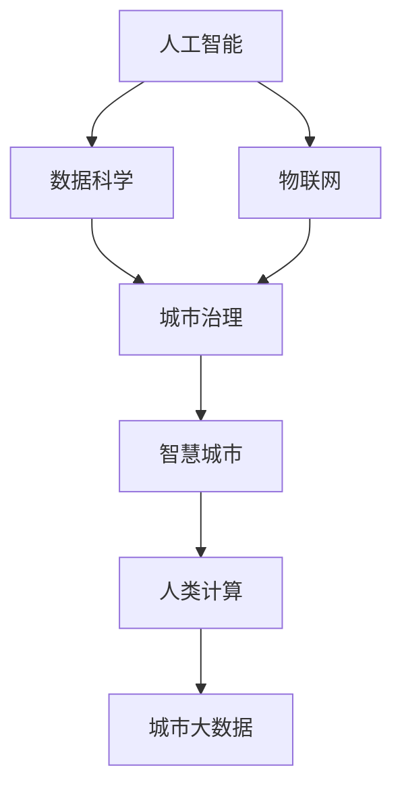

                 

# AI与人类计算：打造可持续发展的城市解决方案

## 1. 背景介绍

### 1.1 问题由来
随着全球化进程的推进和科技的不断发展，城市化带来的挑战愈发严峻。城市人口密度大、资源紧张、环境污染、交通拥堵等问题的加剧，对城市的可持续发展提出了新的要求。如何高效利用有限资源，提升城市治理效率，改善居民生活品质，是当今世界各国城市面临的重要课题。

### 1.2 问题核心关键点
城市治理的核心在于数据的高效采集、分析和应用。传统的数据驱动城市治理方式依赖于大量的人工数据采集和处理，不仅效率低下，而且难以处理复杂的城市动态变化。人工智能（AI）和人类计算（Human-Computer Interaction, HCI）的结合，为城市治理带来了新的解决方案。

利用AI算法和大数据技术，城市管理者可以实时采集和分析城市运行数据，预判并解决城市问题，优化城市资源配置。同时，通过将人机协同的交互设计理念引入城市治理，使得城市管理者能够更高效、更透明地管理城市。

### 1.3 问题研究意义
研究AI与人类计算在城市治理中的应用，对于构建智慧城市、提升城市治理效率、保障居民生活质量具有重要意义：

1. 提高城市治理效率：AI技术能够快速处理海量城市数据，实时响应城市事件，优化资源分配，提升城市治理效率。
2. 降低治理成本：通过自动化、智能化的城市管理，减少人力物力资源的投入，降低城市治理成本。
3. 增强治理透明度：人机协同设计理念引入城市治理，通过透明的用户界面和操作逻辑，增强城市管理决策的透明度和可解释性。
4. 提升城市居民体验：通过智能化的城市服务，提供便捷的城市生活体验，提升居民满意度。
5. 促进绿色城市建设：AI和人类计算技术能够优化能源使用、减少碳排放，推动绿色城市建设。

## 2. 核心概念与联系

### 2.1 核心概念概述

为更好地理解AI与人类计算在城市治理中的应用，本节将介绍几个密切相关的核心概念：

- 人工智能（Artificial Intelligence, AI）：一种模拟人类智能行为的技术，包括感知、理解、学习、推理、决策等能力。
- 人类计算（Human-Computer Interaction, HCI）：研究如何通过合理设计人机交互方式，使得计算机系统更易于人类使用和理解。
- 城市治理（Urban Governance）：指通过科学的决策和有效管理，使城市运行更高效、更公正、更可持续。
- 智慧城市（Smart City）：基于信息和通信技术的融合，通过数据驱动、人机协同的方式，提升城市智能化水平。
- 数据科学（Data Science）：一门利用数据技术和算法工具，对数据进行挖掘、分析、可视化的学科。
- 物联网（Internet of Things, IoT）：通过传感器、RFID、GPS等技术，实现城市数据的实时采集和监控。
- 城市大数据（Urban Big Data）：指城市运行过程中产生的海量、复杂的数据，通过数据科学进行分析，获取洞察力。

这些核心概念之间的逻辑关系可以通过以下Mermaid流程图来展示：



这个流程图展示了大语言模型的核心概念及其之间的关系：

1. AI和数据科学通过物联网技术采集城市数据，为城市治理提供数据支持。
2. 城市治理利用智慧城市平台，通过AI技术进行分析决策，优化资源配置。
3. 人类计算通过设计友好的交互界面，提升城市管理透明度和用户体验。
4. 城市大数据是AI和人类计算应用的基础，为决策提供数据支撑。

## 3. 核心算法原理 & 具体操作步骤

### 3.1 算法原理概述

基于AI与人类计算的城市治理方法，本质上是一种人机协同的数据分析和决策优化过程。其核心思想是：通过城市物联网采集数据，利用AI算法对数据进行分析和预测，同时通过人类计算技术优化城市管理流程，将AI算法与人类决策相结合，实现智慧城市的智能化治理。

形式化地，假设城市管理数据集为 $D=\{(x_i,y_i)\}_{i=1}^N$，其中 $x_i$ 为城市事件描述，$y_i$ 为处理结果。AI模型 $M_{\theta}$ 的输入为 $x_i$，输出为 $y_i$。人类计算模型 $H$ 的输入为 $x_i$，输出为优化建议 $s_i$。则城市治理过程可以描述为：

1. 数据采集：通过物联网设备采集城市数据，构建数据集 $D$。
2. AI分析：利用机器学习或深度学习算法训练模型 $M_{\theta}$，对城市事件进行预测或分类。
3. 人类计算：通过交互界面设计，使得城市管理者能够方便地输入和查看AI预测结果，并根据建议调整决策。
4. 优化决策：结合AI预测和人类计算反馈，优化城市资源配置和事件处理流程。

### 3.2 算法步骤详解

基于AI与人类计算的城市治理一般包括以下几个关键步骤：

**Step 1: 数据采集和预处理**
- 安装和部署物联网设备，如传感器、摄像头、RFID标签等，采集城市运行数据。
- 对采集数据进行清洗、去噪、归一化等预处理，构建数据集 $D$。

**Step 2: 训练AI模型**
- 选择合适的AI模型（如深度学习、强化学习等），训练模型 $M_{\theta}$ 对城市事件进行预测或分类。
- 使用城市治理数据集 $D$ 进行监督学习，最小化模型预测与真实结果的误差。
- 验证模型性能，使用交叉验证或留一法等技术评估模型效果。

**Step 3: 设计人机交互界面**
- 根据AI模型输出结果，设计友好的交互界面，供城市管理者查看和反馈。
- 界面应包括数据展示、预测结果、处理建议等功能模块。
- 确保界面操作简便，能够快速响应城市管理者的操作需求。

**Step 4: 人机协同决策**
- 城市管理者通过人机交互界面输入AI预测结果和优化建议，结合专业知识进行综合判断。
- 优化建议可以基于历史数据、专家知识、实时数据等，综合考虑多维度因素。
- 将人机协同的决策结果反馈至AI模型，进一步优化模型参数。

**Step 5: 反馈和优化**
- 根据城市管理者的反馈结果，及时调整AI模型和人类计算界面，提升系统性能。
- 定期收集城市管理数据，更新训练数据集，使AI模型持续改进。
- 对城市管理过程进行回顾和总结，提升决策科学性和合理性。

### 3.3 算法优缺点

基于AI与人类计算的城市治理方法具有以下优点：
1. 提高效率：AI技术能够快速处理海量数据，实时响应城市事件，提高城市治理效率。
2. 降低成本：自动化和智能化的城市管理，减少人力物力资源的投入，降低城市治理成本。
3. 增强透明性：人机协同设计理念引入城市治理，通过透明的界面操作，增强城市管理决策的透明度和可解释性。
4. 提升用户体验：智能化的城市服务，提供便捷的城市生活体验，提升居民满意度。
5. 推动绿色城市建设：AI和人类计算技术能够优化能源使用、减少碳排放，推动绿色城市建设。

同时，该方法也存在一定的局限性：
1. 依赖数据质量：城市治理的效果很大程度上取决于数据采集和预处理的准确性，数据质量问题可能影响AI预测结果。
2. 需要高成本的物联网设备：初始的物联网设备部署成本较高，且需要持续维护和更新。
3. 可能存在数据隐私问题：城市数据包含敏感信息，需注意数据隐私和安全保护。
4. 需要技术更新：AI和人类计算技术需不断更新，才能保持系统性能。

尽管存在这些局限性，但就目前而言，基于AI与人类计算的城市治理方法仍是实现智慧城市的重要手段。未来相关研究的重点在于如何进一步降低数据采集成本，提高数据质量，增强系统鲁棒性和可解释性，同时兼顾数据隐私和安全问题。

### 3.4 算法应用领域

基于AI与人类计算的城市治理方法，在城市管理中已经得到了广泛的应用，涵盖了诸多领域，例如：

- 交通管理：通过AI和人类计算技术，优化交通信号灯、道路监控、公共交通调度等，提升交通流畅性和安全性。
- 环境监测：利用AI和物联网技术，实时监测城市空气质量、水质、噪音等环境指标，预防和应对环境污染问题。
- 城市规划：通过大数据和AI技术，分析城市空间分布和人口流动，优化城市规划和资源配置。
- 公共安全：应用AI算法和物联网设备，实时监控城市安防视频、报警信息等，提升公共安全水平。
- 能源管理：利用AI技术优化能源使用，如智能电网、智能照明等，减少能源浪费，推动绿色城市建设。
- 智慧医疗：通过AI技术分析医疗数据，优化医疗资源配置，提升医疗服务质量。
- 智慧教育：利用AI技术进行智能作业批改、学习数据分析等，提升教育质量和效率。

除了上述这些经典应用外，AI与人类计算技术还被创新性地应用到更多场景中，如智慧农业、智慧旅游、智慧零售等，为城市治理带来了新的可能性。随着技术的发展，相信AI与人类计算技术将在更广泛的领域发挥作用，推动智慧城市的建设进程。

## 4. 数学模型和公式 & 详细讲解  
### 4.1 数学模型构建

本节将使用数学语言对基于AI与人类计算的城市治理过程进行更加严格的刻画。

记城市管理数据集为 $D=\{(x_i,y_i)\}_{i=1}^N, x_i \in \mathcal{X}, y_i \in \mathcal{Y}$。定义AI模型 $M_{\theta}$ 在输入 $x_i$ 上的输出为 $\hat{y}_i=M_{\theta}(x_i) \in \mathcal{Y}$。则城市治理的损失函数 $\mathcal{L}$ 定义为：

$$
\mathcal{L}(\theta) = \frac{1}{N}\sum_{i=1}^N \ell(M_{\theta}(x_i),y_i)
$$

其中 $\ell$ 为预测误差函数，如交叉熵损失函数。

同时，定义人类计算模型 $H$ 的输出为优化建议 $s_i \in \mathcal{S}$。则人类计算模型 $H$ 的损失函数 $\mathcal{L}_H$ 定义为：

$$
\mathcal{L}_H = \frac{1}{N}\sum_{i=1}^N \ell(H(x_i),s_i)
$$

其中 $\ell$ 为优化误差函数，如均方误差损失函数。

### 4.2 公式推导过程

以下我们以交通信号灯优化为例，推导基于AI与人类计算的城市治理模型。

假设城市交通监控摄像头采集到大量交通事件数据 $D=\{(x_i,y_i)\}_{i=1}^N$，其中 $x_i$ 为事件描述，$y_i$ 为事件类型（如拥堵、事故等）。则AI模型 $M_{\theta}$ 的输出 $\hat{y}_i$ 为事件类型的预测，表示事件类型是 $y_i$ 的概率。

设人类计算模型 $H$ 的输出 $s_i$ 为优化建议，表示是否对交通信号灯进行调控，并给出调控的方式（如增加绿灯时间、改变信号灯顺序等）。则优化建议的损失函数 $\mathcal{L}_H$ 可表示为：

$$
\mathcal{L}_H = \frac{1}{N}\sum_{i=1}^N (y_i-s_i)^2
$$

将 $y_i$ 和 $s_i$ 代入，得：

$$
\mathcal{L}_H = \frac{1}{N}\sum_{i=1}^N \left(\left(\hat{y}_i-1\right)^2 + \left(1-\hat{y}_i\right)^2\right)
$$

其中 $y_i$ 表示事件类型，$s_i$ 表示调控建议。

在得到人类计算模型损失函数后，即可联合AI模型和人类计算模型进行协同优化。通过最小化损失函数，使得AI模型预测更准确，人类计算模型建议更合理，提升城市治理效果。

## 5. 项目实践：代码实例和详细解释说明
### 5.1 开发环境搭建

在进行AI与人类计算的城市治理项目实践前，我们需要准备好开发环境。以下是使用Python进行PyTorch开发的环境配置流程：

1. 安装Anaconda：从官网下载并安装Anaconda，用于创建独立的Python环境。

2. 创建并激活虚拟环境：
```bash
conda create -n ai-env python=3.8 
conda activate ai-env
```

3. 安装PyTorch：根据CUDA版本，从官网获取对应的安装命令。例如：
```bash
conda install pytorch torchvision torchaudio cudatoolkit=11.1 -c pytorch -c conda-forge
```

4. 安装TensorFlow：
```bash
pip install tensorflow
```

5. 安装TensorBoard：
```bash
pip install tensorboard
```

6. 安装相关库：
```bash
pip install pandas numpy scikit-learn matplotlib jupyter notebook ipython
```

完成上述步骤后，即可在`ai-env`环境中开始城市治理项目的开发。

### 5.2 源代码详细实现

下面我们以交通信号灯优化为例，给出使用TensorFlow和TensorBoard进行AI与人类计算的代码实现。

首先，定义交通事件数据集：

```python
import pandas as pd
from tensorflow.keras.preprocessing.text import Tokenizer
from tensorflow.keras.preprocessing.sequence import pad_sequences

data = pd.read_csv('traffic_events.csv')
data['type'] = data['type'].map({'拥堵': 1, '事故': 2, '超速': 3, '违规': 4, '其他': 0})
X = data['description'].values
y = data['type'].values

tokenizer = Tokenizer(num_words=10000, oov_token='<OOV>')
tokenizer.fit_on_texts(X)
X = tokenizer.texts_to_sequences(X)
X = pad_sequences(X, maxlen=50, padding='post', truncating='post')
```

然后，定义AI模型和人类计算模型：

```python
from tensorflow.keras.layers import Embedding, LSTM, Dense
from tensorflow.keras.models import Model

embedding_dim = 100
lstm_units = 128

model = Sequential()
model.add(Embedding(input_dim=10000, output_dim=embedding_dim, input_length=50))
model.add(LSTM(lstm_units, dropout=0.2, recurrent_dropout=0.2))
model.add(Dense(1, activation='sigmoid'))

H = Dense(1, activation='sigmoid')

model.compile(loss='binary_crossentropy', optimizer='adam', metrics=['accuracy'])
H.compile(loss='binary_crossentropy', optimizer='adam', metrics=['accuracy'])
```

接着，训练AI模型和人类计算模型：

```python
epochs = 10
batch_size = 32

model.fit(X, y, batch_size=batch_size, epochs=epochs, validation_split=0.2)
H.fit(X, y, batch_size=batch_size, epochs=epochs, validation_split=0.2)
```

最后，使用TensorBoard可视化模型训练过程：

```python
from tensorflow.keras.callbacks import TensorBoard

log_dir = 'logs/traffic_light_optimization'
tensorboard_callback = TensorBoard(log_dir)

model.fit(X, y, batch_size=batch_size, epochs=epochs, validation_split=0.2, callbacks=[tensorboard_callback])
```

在训练结束后，可通过TensorBoard查看模型训练过程中的损失函数和准确率变化，帮助调试优化模型参数。

### 5.3 代码解读与分析

让我们再详细解读一下关键代码的实现细节：

**数据处理函数**：
- 使用Pandas库读取交通事件数据集，将事件类型进行编码。
- 使用TensorFlow的Tokenizer对文本数据进行分词和编码，并进行序列填充。

**模型定义**：
- 定义AI模型，包括嵌入层、LSTM层和全连接层。
- 定义人类计算模型，包括全连接层。

**模型训练**：
- 使用TensorFlow的Sequential模型编译和训练AI模型和人类计算模型。
- 设置合适的损失函数、优化器和评价指标。
- 使用TensorBoard记录训练过程中的数据。

**可视化展示**：
- 使用TensorBoard可视化模型训练过程中的损失函数和准确率变化。

可以看到，TensorFlow提供了丰富的API和工具，使得模型训练和可视化过程变得便捷高效。开发者可以通过不断调试和优化模型参数，快速迭代出高效的AI与人类计算系统。

## 6. 实际应用场景
### 6.1 智能交通管理

基于AI与人类计算的智能交通管理，利用数据驱动和算法优化，实现了交通信号灯的智能调控，提升了道路通行效率和安全性。

在实践中，交通监控摄像头实时采集交通事件数据，AI模型通过深度学习算法对事件类型进行预测，生成预测结果。人类计算模型根据预测结果，给出优化建议（如增加绿灯时间、调整信号灯顺序等）。城市管理者通过人机交互界面查看AI预测和人类计算建议，综合决策并反馈至系统，系统不断调整优化方案。

通过智能交通管理系统，城市可以实时应对交通拥堵、事故等突发事件，优化信号灯控制，提升交通流畅性和安全性。例如，智能信号灯系统在高峰期自动调整绿灯时间，提升交叉口通行效率，减少停车等待时间。在发生交通事故时，系统自动调整信号灯顺序，避免二次事故，快速恢复道路通行。

### 6.2 环境监测预警

基于AI与人类计算的环境监测预警系统，利用数据采集和智能分析技术，实时监测城市环境指标，预测环境污染和灾害风险，提升城市应急响应能力。

在实践中，空气质量监测设备、水质监测设备、噪音监测设备等采集城市环境数据，通过数据融合技术构建环境数据集。AI模型通过深度学习算法分析环境数据，预测污染程度和灾害风险。人类计算模型根据AI预测结果，生成预警建议，通知城市管理者采取措施。城市管理者通过人机交互界面查看AI预测和人类计算建议，综合决策并反馈至系统，系统不断调整优化方案。

通过环境监测预警系统，城市可以实时监测环境指标，预警污染和灾害风险，提前采取措施。例如，在雾霾天气时，系统自动调整公共交通运行线路，避开污染严重区域，减少空气污染对市民健康的危害。在洪水灾害时，系统自动调整排水系统，提高城市防洪能力，保障市民安全。

### 6.3 智慧公共安全

基于AI与人类计算的智慧公共安全系统，利用数据采集和智能分析技术，实时监控城市安防视频、报警信息等，预防和应对公共安全事件，提升城市安全水平。

在实践中，城市安防摄像头采集实时视频数据，AI模型通过深度学习算法分析视频数据，检测异常行为和事件。人类计算模型根据AI预测结果，生成报警建议，通知城市管理者采取措施。城市管理者通过人机交互界面查看AI预测和人类计算建议，综合决策并反馈至系统，系统不断调整优化方案。

通过智慧公共安全系统，城市可以实时监控公共安全事件，预警异常行为和事件，快速响应。例如，在人群密集场所发生恐怖袭击时，系统自动启动紧急报警，通知公安部门快速到达现场，防止事态扩大。在犯罪高发区域，系统自动调整监控摄像头方向，提高监控效率，保障市民安全。

### 6.4 未来应用展望

随着AI与人类计算技术的不断发展，基于AI与人类计算的城市治理将在更多领域得到应用，为城市治理带来新的可能性。

在智慧医疗领域，基于AI与人类计算的医疗数据处理和分析技术，能够优化医疗资源配置，提升医疗服务质量。例如，智能影像识别系统通过深度学习算法分析医疗影像，快速诊断疾病，提高诊疗效率。智慧诊疗系统通过人机协同设计，提供便捷的诊疗服务，提升医疗服务体验。

在智慧教育领域，基于AI与人类计算的智能作业批改和学情分析技术，能够提升教育质量和效率。例如，智能作业批改系统通过深度学习算法自动批改作业，减少教师工作负担，提升作业批改效率。智能学情分析系统通过数据分析技术，生成学情报告，帮助教师制定教学计划，提升教学效果。

在智慧城市建设中，基于AI与人类计算的城市治理技术将更加广泛地应用，提升城市治理效率和水平。例如，智慧能源管理系统通过AI技术优化能源使用，如智能电网、智能照明等，减少能源浪费，推动绿色城市建设。智慧交通管理系统通过人机协同设计，提升交通流畅性和安全性，改善市民出行体验。

## 7. 工具和资源推荐
### 7.1 学习资源推荐

为了帮助开发者系统掌握AI与人类计算在城市治理中的应用，这里推荐一些优质的学习资源：

1. 《人工智能与城市治理》系列博文：由大模型技术专家撰写，深入浅出地介绍了AI与人类计算在城市治理中的基本概念和应用方法。

2. 《深度学习在城市治理中的应用》课程：Coursera平台上的深度学习课程，由斯坦福大学教授授课，涵盖深度学习在城市治理中的基本概念和应用技术。

3. 《城市数据科学》书籍：介绍如何使用数据科学和AI技术进行城市治理，涵盖数据采集、数据处理、模型训练等基本流程。

4. 《智慧城市建设》报告：多国智慧城市建设实践报告，涵盖智慧城市的定义、发展历程、建设案例等，提供丰富的实践经验。

5. 《物联网与智慧城市》论文：关于物联网在智慧城市建设中的应用论文，探讨物联网与智慧城市的关系和融合方式。

通过对这些资源的学习实践，相信你一定能够快速掌握AI与人类计算在城市治理中的应用，并用于解决实际的智慧城市问题。

### 7.2 开发工具推荐

高效的开发离不开优秀的工具支持。以下是几款用于AI与人类计算的城市治理开发的常用工具：

1. PyTorch：基于Python的开源深度学习框架，灵活动态的计算图，适合快速迭代研究。大部分预训练语言模型都有PyTorch版本的实现。

2. TensorFlow：由Google主导开发的开源深度学习框架，生产部署方便，适合大规模工程应用。同样有丰富的预训练语言模型资源。

3. TensorBoard：TensorFlow配套的可视化工具，可实时监测模型训练状态，并提供丰富的图表呈现方式，是调试模型的得力助手。

4. Weights & Biases：模型训练的实验跟踪工具，可以记录和可视化模型训练过程中的各项指标，方便对比和调优。与主流深度学习框架无缝集成。

5. Jupyter Notebook：交互式开发环境，支持多种编程语言和数据处理库，适合进行复杂的数据分析和模型训练。

合理利用这些工具，可以显著提升AI与人类计算的城市治理开发的效率，加快创新迭代的步伐。

### 7.3 相关论文推荐

AI与人类计算在城市治理中的应用源于学界的持续研究。以下是几篇奠基性的相关论文，推荐阅读：

1. "CityGML: A Framework for Urban Geography - Context Modeling"：提出CityGML模型，用于城市地理和上下文建模，为智慧城市建设提供了基础。

2. "IoT in Smart City: Opportunities and Challenges"：探讨物联网技术在智慧城市建设中的应用机会和挑战，提供了丰富的实践经验。

3. "Data Mining in Urban Governance: A Survey"：综述了城市治理中的数据挖掘和分析技术，介绍了基于数据的城市治理方法。

4. "Human-Computer Interaction in Smart City"：研究了人机交互技术在智慧城市中的应用，探讨了智慧城市中的交互设计和用户体验。

5. "AI in Smart Cities: Opportunities and Challenges"：探讨了AI技术在智慧城市中的应用机会和挑战，提供了丰富的实践经验。

这些论文代表了大语言模型微调技术的发展脉络。通过学习这些前沿成果，可以帮助研究者把握学科前进方向，激发更多的创新灵感。

## 8. 总结：未来发展趋势与挑战

### 8.1 总结

本文对基于AI与人类计算的城市治理方法进行了全面系统的介绍。首先阐述了AI与人类计算在城市治理中的应用背景和意义，明确了AI与人类计算在提升城市治理效率、降低成本、增强透明度、提升用户体验等方面的独特价值。其次，从原理到实践，详细讲解了AI与人类计算的数学模型和操作步骤，给出了城市治理项目开发的完整代码实例。同时，本文还广泛探讨了AI与人类计算在智能交通管理、环境监测预警、智慧公共安全等多个城市治理领域的应用前景，展示了AI与人类计算技术的巨大潜力。此外，本文精选了AI与人类计算的学习资源，力求为读者提供全方位的技术指引。

通过本文的系统梳理，可以看到，基于AI与人类计算的城市治理方法正在成为智慧城市建设的重要手段，极大地提升了城市治理的智能化水平，推动了绿色城市和智慧城市的建设进程。未来，伴随AI和人类计算技术的不断进步，基于AI与人类计算的城市治理技术必将迎来更多创新应用，为城市管理带来新的变革。

### 8.2 未来发展趋势

展望未来，AI与人类计算在城市治理中的应用将呈现以下几个发展趋势：

1. 数据驱动治理：城市治理将更加依赖于数据驱动的方式，通过数据挖掘、分析和预测，提升城市管理决策的科学性和准确性。
2. 人机协同优化：城市管理将更加注重人机协同，通过合理设计交互界面，提升城市管理者对AI预测结果的理解和使用效率。
3. 智能决策支持：AI技术将为城市管理提供智能决策支持，通过自动化的分析推理，辅助城市管理者做出更优决策。
4. 实时响应能力：AI与人类计算技术将实现更高效的实时响应，能够及时发现和应对城市突发事件，提升城市应急管理能力。
5. 全域感知能力：通过物联网设备采集城市各领域的运行数据，实现城市运行的全域感知和监控，提升城市治理的全面性和精细度。
6. 个性化服务：基于用户行为数据和AI预测，提供个性化的城市服务，提升用户满意度。
7. 可持续发展：AI与人类计算技术将推动绿色城市建设，优化能源使用，减少碳排放，提升城市可持续发展能力。

以上趋势凸显了AI与人类计算在城市治理中的应用前景。这些方向的探索发展，必将进一步提升城市治理的智能化水平，为构建智慧城市、推动绿色城市建设提供强大技术支撑。

### 8.3 面临的挑战

尽管AI与人类计算在城市治理中的应用已经取得了显著进展，但在迈向更加智能化、普适化应用的过程中，它仍面临诸多挑战：

1. 数据质量问题：城市治理的效果很大程度上取决于数据采集和处理的准确性，数据质量问题可能影响AI预测结果。
2. 技术更新频繁：AI与人类计算技术需不断更新，才能保持系统性能，这对技术开发和维护提出了更高要求。
3. 数据隐私问题：城市数据包含敏感信息，需注意数据隐私和安全保护。
4. 高成本问题：初始的物联网设备部署成本较高，且需要持续维护和更新，增加了城市治理成本。
5. 技术理解门槛：城市管理者需要具备一定的AI和人类计算知识，才能理解和应用智能系统，这增加了系统应用的难度。

尽管存在这些挑战，但通过不断优化数据采集和处理流程，提升技术稳定性，加强数据隐私保护，以及普及AI和人类计算知识，这些问题有望得到解决。

### 8.4 研究展望

面对AI与人类计算在城市治理中面临的挑战，未来的研究需要在以下几个方面寻求新的突破：

1. 提升数据采集和处理质量：通过优化数据采集和处理流程，提升数据质量，为AI预测提供更可靠的基础。
2. 开发高效智能系统：开发更加高效、稳定的AI与人类计算系统，减少技术维护成本，提升系统可用性。
3. 增强系统可解释性：增强系统的可解释性，使得城市管理者能够更好地理解AI预测和优化建议。
4. 加强数据隐私保护：通过加密、匿名化等技术，保护城市数据隐私，保障数据安全。
5. 普及AI与人类计算知识：加强AI与人类计算知识的普及和教育，提升城市管理者对智能系统的理解和应用能力。
6. 推动技术标准化：推动AI与人类计算技术标准化，制定相关行业标准，规范系统开发和应用。

这些研究方向有望解决当前AI与人类计算在城市治理中面临的挑战，推动智能城市建设进程。

## 9. 附录：常见问题与解答

**Q1：AI与人类计算能否应用于所有城市治理场景？**

A: AI与人类计算技术在城市治理中具有广泛应用前景，但并非所有场景都适用。对于一些需要高精度、高实时性的场景，如医疗诊断、航空交通等，传统的AI与人类计算方法可能无法满足要求。对于这些场景，需要采用更为先进的技术，如实时计算、边缘计算等。

**Q2：AI与人类计算的治理成本是否过高？**

A: 初始的物联网设备部署和系统建设成本较高，但随着技术的发展和规模化应用，AI与人类计算的成本将逐步降低。通过优化数据采集和处理流程，提升系统效率，降低技术维护成本，AI与人类计算的治理成本将更趋合理。

**Q3：AI与人类计算的系统安全性如何保障？**

A: AI与人类计算系统需要加强安全防护，防止数据泄露和系统攻击。在数据采集、传输、存储等环节，应采用加密、匿名化等技术，保障数据隐私和安全。同时，定期进行安全审计和漏洞检测，提升系统安全性。

**Q4：AI与人类计算的系统可解释性如何提升？**

A: 提升AI与人类计算系统的可解释性，可以通过多种方式实现。例如，使用可解释性较高的模型（如决策树、逻辑回归等）代替深度学习模型。在模型训练过程中，引入可解释性评估指标，优化模型决策过程。通过可视化工具展示模型推理过程，帮助城市管理者理解系统决策逻辑。

**Q5：AI与人类计算的系统如何与城市其他系统集成？**

A: AI与人类计算系统可以通过API接口、数据交换等方式与城市其他系统集成。例如，与智慧医疗系统集成，共享医疗数据，提供智能诊疗服务；与智能交通系统集成，共享交通数据，优化交通调控方案；与智慧公共安全系统集成，共享安防数据，提升公共安全水平。

通过这些集成，AI与人类计算系统能够更好地发挥其作用，为城市治理提供更全面的支持。

