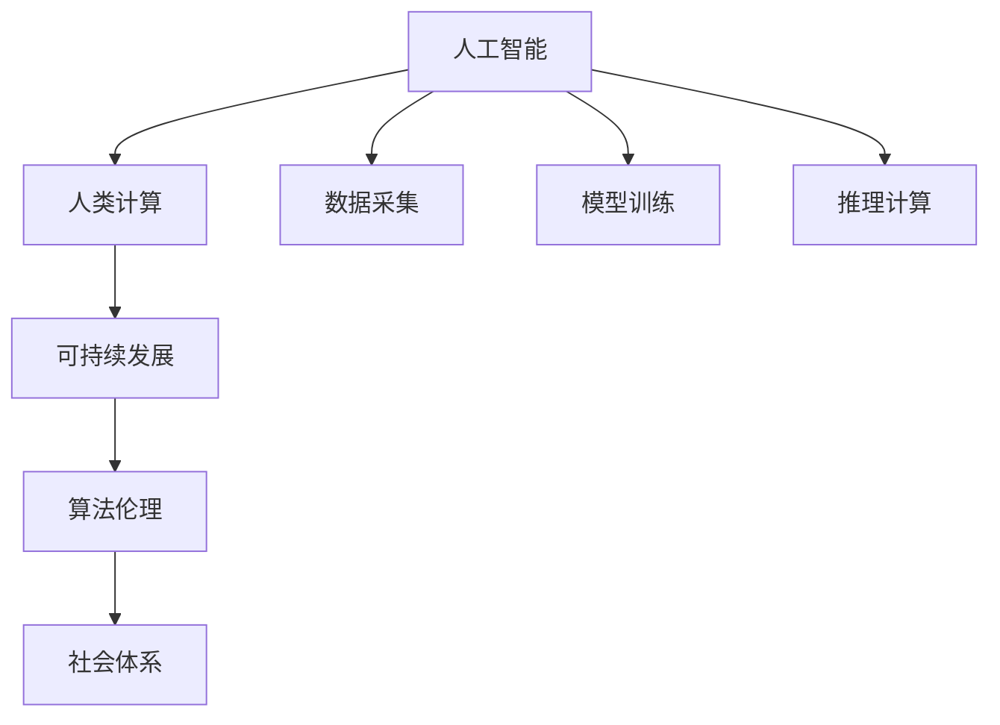

                 

# AI与人类计算：打造可持续的社会体系

> 关键词：人工智能,人类计算,可持续发展,社会体系,算法伦理

## 1. 背景介绍

### 1.1 问题由来
随着人工智能(AI)技术的迅猛发展，AI在各行各业的应用深度和广度都在不断扩大。无论是自动驾驶、智能制造，还是医疗诊断、金融风控，AI正通过强大的数据处理和决策能力，极大地提升了生产效率和决策水平。然而，AI技术虽然带来了前所未有的便利，也引发了一系列新的挑战，特别是对人类社会的可持续发展带来了深远影响。

过去，人类计算主要以机械、电子计算为主，依赖于物理世界的传感器、处理器和存储设备。而现代AI技术则主要依赖于大量数据和复杂算法，通过在云端进行计算，完成了从物理世界到虚拟世界的转变。这种转变使得AI技术在带来巨大经济和社会效益的同时，也对传统计算模式和社会体系提出了新的挑战。

如何构建可持续的社会体系，让AI技术既能充分发挥其潜能，又能有效避免其可能带来的负面影响，成为了当今科技发展的重要课题。本文将探讨AI与人类计算的结合，以及如何通过AI技术实现可持续发展的社会体系。

### 1.2 问题核心关键点
现代AI技术的一个显著特点是其高度依赖数据和计算资源。随着数据量的爆炸性增长和计算能力的持续提升，AI技术的应用范围和深度不断扩展，但其对能源、环境和社会的影响也在日益加剧。具体来说，现代AI技术面临以下几个核心问题：

1. **数据来源和质量**：AI模型通常需要大量高质量的数据进行训练，数据采集、标注和清洗过程可能涉及伦理和隐私问题。
2. **计算资源消耗**：AI模型的训练和推理需要消耗大量电力，甚至可能导致环境污染和资源浪费。
3. **算法伦理和社会影响**：AI决策过程中可能出现偏见、歧视等问题，对社会公正和公平带来挑战。
4. **模型透明性和可解释性**：复杂的AI模型往往难以解释其决策过程，增加了对人类社会的不透明性。

这些问题的存在，要求我们重新审视AI技术的社会责任和可持续性，探索如何在技术进步的同时，构建更加公平、透明、可持续的社会体系。

## 2. 核心概念与联系

### 2.1 核心概念概述

为了更好地理解AI与人类计算的结合及其对社会体系的影响，本节将介绍几个密切相关的核心概念：

- **人工智能(AI)**：通过算法、模型和数据，赋予机器以智能行为的技术。
- **人类计算**：利用人类的智慧和劳动，进行复杂计算和问题解决的过程。
- **可持续发展**：通过合理利用资源和保护环境，实现经济、社会和环境的长期健康发展。
- **算法伦理**：在AI算法设计和应用中，关注其对社会、伦理和公平性的影响。
- **社会体系**：由政府、企业、社区和个人组成，通过规则和制度共同维护的社会结构。

这些核心概念之间的逻辑关系可以通过以下Mermaid流程图来展示：



这个流程图展示了一系列从AI技术到社会体系的关系：

1. AI技术在数据采集、模型训练和推理计算中发挥重要作用。
2. 人类计算提供原始数据和计算资源，参与AI模型的设计、验证和优化。
3. 可持续发展旨在通过合理利用资源和保护环境，实现AI技术的健康发展。
4. 算法伦理关注AI模型对社会、伦理和公平性的影响。
5. 社会体系通过规则和制度，保障AI技术的合理应用。

这些概念共同构成了AI与人类计算结合的框架，为探索如何在AI技术应用中实现可持续发展提供了基础。

## 3. 核心算法原理 & 具体操作步骤
### 3.1 算法原理概述

AI与人类计算结合的核心理论基础在于数据驱动的模型训练和优化。具体来说，AI技术的核心算法原理包括以下几个方面：

1. **数据驱动的模型训练**：通过大量标注数据，利用机器学习算法训练出高精度的模型，用于各类预测和决策任务。
2. **模型的微调和优化**：通过收集新的数据，不断微调和优化现有模型，提高其泛化能力和性能。
3. **分布式计算和并行计算**：利用大规模集群和分布式计算技术，提高AI模型的训练和推理效率。
4. **模型压缩和加速**：通过模型压缩和加速技术，减少计算资源消耗，提高模型推理速度。
5. **人类计算与AI的协同**：通过人工干预和智能辅助，结合人类智慧和经验，提升AI模型的可靠性和鲁棒性。

这些算法原理为AI技术的可持续发展提供了基础，但也提出了新的挑战。

### 3.2 算法步骤详解

AI与人类计算结合的实际操作流程可以大致分为以下几个步骤：

**Step 1: 数据采集与清洗**
- 收集各类来源的数据，包括传感器数据、用户行为数据、公开数据等。
- 对数据进行清洗和预处理，去除噪声和异常值，确保数据质量和一致性。
- 采用隐私保护技术，如数据脱敏、差分隐私等，保护用户隐私。

**Step 2: 模型训练与微调**
- 选择合适的模型架构和算法，如神经网络、决策树、集成学习等。
- 使用训练集对模型进行迭代训练，调整模型参数以优化性能。
- 对模型进行微调，利用少量标注数据，调整顶层或关键部分，提高模型在特定任务上的表现。

**Step 3: 分布式计算与资源管理**
- 利用云计算平台和分布式计算框架，如TensorFlow、PyTorch等，进行模型训练和推理。
- 合理配置计算资源，如CPU、GPU、TPU等，提高计算效率。
- 采用节能减排策略，如计算任务优化、数据中心能效提升等，减少能源消耗。

**Step 4: 模型部署与优化**
- 将训练好的模型部署到实际应用场景中，进行推理计算。
- 实时监控模型性能，收集反馈信息，进行模型优化。
- 利用模型压缩、加速等技术，提高模型推理效率，减少资源消耗。

**Step 5: 社会影响评估与反馈**
- 定期评估AI模型对社会、伦理和环境的影响，收集用户反馈和公共意见。
- 根据评估结果，调整模型训练和应用策略，确保其符合社会责任和可持续发展的要求。
- 参与社会公共事务，推动AI技术的公平、透明和责任化应用。

### 3.3 算法优缺点

AI与人类计算结合的算法具有以下优点：

1. **高效性与精确性**：通过大规模数据驱动的模型训练，AI技术能够快速准确地处理和分析复杂问题，提高生产效率和决策质量。
2. **灵活性与适应性**：利用人类智慧和经验，可以不断优化和调整AI模型，使其适应不断变化的环境和任务需求。
3. **协同性与互补性**：AI技术可以与人类计算相结合，发挥各自的优势，形成协同效应，提升整体系统的效率和可靠性。

但该算法也存在以下缺点：

1. **数据依赖性高**：AI模型高度依赖数据质量，数据采集和清洗过程可能涉及伦理和隐私问题，且需要大量标注数据。
2. **资源消耗大**：模型训练和推理计算需要消耗大量电力，可能带来环境污染和资源浪费。
3. **模型复杂度高**：复杂的AI模型难以解释其决策过程，增加了对人类社会的不透明性。
4. **伦理与社会风险**：AI决策过程中可能出现偏见、歧视等问题，对社会公正和公平带来挑战。

这些优缺点需要在AI技术的应用中加以平衡和考虑。

### 3.4 算法应用领域

AI与人类计算结合的算法在多个领域中得到了广泛应用，包括但不限于：

1. **智能制造与工业自动化**：通过AI技术优化生产流程、提高产品质量和生产效率，实现智能化制造。
2. **智慧医疗与健康监测**：利用AI技术进行疾病预测、诊断和治疗，提升医疗服务的质量和效率。
3. **智慧城市与公共管理**：通过AI技术进行城市管理、公共安全、交通调控等，提升城市运行效率和治理水平。
4. **金融科技与风险管理**：利用AI技术进行风险预测、信用评估、智能投顾等，提升金融服务的精准度和安全性。
5. **农业科技与精准农业**：通过AI技术进行作物监测、病虫害防治、智能灌溉等，提高农业生产的效率和可持续性。

这些应用领域展示了AI技术在提升生产力、优化资源利用和改善公共服务方面的潜力。

## 4. 数学模型和公式 & 详细讲解 & 举例说明

### 4.1 数学模型构建

为了更好地理解AI与人类计算结合的算法，我们需要构建数学模型来描述其工作原理。

假设我们有一个二分类任务，输入特征 $x$，标签 $y$，模型的参数为 $\theta$。模型的预测输出为 $y'$，目标是最小化预测错误率，即：

$$
\mathop{\min}_{\theta} \mathbb{E}[(1-y')y']
$$

其中，$\mathbb{E}$ 表示期望，$y'$ 为模型的预测输出，$y$ 为真实标签。

通过梯度下降等优化算法，我们可以最小化上述目标函数，得到最优参数 $\theta^*$。具体的优化目标函数为：

$$
J(\theta) = -\frac{1}{N} \sum_{i=1}^N y_i \log(y'_i) + (1-y_i) \log(1-y'_i)
$$

其中，$N$ 为样本总数，$y_i$ 为真实标签，$y'_i$ 为模型的预测输出。

### 4.2 公式推导过程

在二分类任务中，我们使用逻辑回归模型，预测输出 $y'$ 为：

$$
y' = \sigma(\theta^T x)
$$

其中，$\sigma$ 为 sigmoid 函数，$\theta$ 为模型参数。

将预测输出代入目标函数，得：

$$
J(\theta) = -\frac{1}{N} \sum_{i=1}^N [y_i \log(\sigma(\theta^T x_i)) + (1-y_i) \log(1-\sigma(\theta^T x_i))]
$$

通过链式法则，对模型参数 $\theta$ 的梯度为：

$$
\frac{\partial J(\theta)}{\partial \theta} = -\frac{1}{N} \sum_{i=1}^N [y_i \frac{\partial \sigma(\theta^T x_i)}{\partial \theta} - (1-y_i) \frac{\partial (1-\sigma(\theta^T x_i))}{\partial \theta}]
$$

其中，$\frac{\partial \sigma(\theta^T x_i)}{\partial \theta} = (1-\sigma(\theta^T x_i)) \sigma(\theta^T x_i) x_i$。

通过求解上述梯度方程，即可更新模型参数 $\theta$，实现模型的最小化。

### 4.3 案例分析与讲解

假设我们有一个图像分类任务，模型参数为 $\theta$，输入为图像 $x$，输出为分类结果 $y$。我们使用卷积神经网络(CNN)进行训练，预测输出为 $y'$。

首先，我们对图像进行预处理，如归一化、裁剪等。然后，通过卷积层、池化层等构建特征提取网络，将图像特征映射为高维向量。接着，使用全连接层进行分类，预测输出 $y'$。最后，通过交叉熵损失函数计算预测错误率，并使用梯度下降等优化算法更新模型参数 $\theta$。

通过不断迭代训练和微调，我们得到了一个高精度的图像分类模型。使用该模型，我们可以在实际应用中快速准确地识别图像，提高生产效率和决策质量。

## 5. 项目实践：代码实例和详细解释说明

### 5.1 开发环境搭建

在进行AI与人类计算结合的算法实践前，我们需要准备好开发环境。以下是使用Python进行TensorFlow开发的环境配置流程：

1. 安装Anaconda：从官网下载并安装Anaconda，用于创建独立的Python环境。

2. 创建并激活虚拟环境：
```bash
conda create -n ai-env python=3.8 
conda activate ai-env
```

3. 安装TensorFlow：根据CUDA版本，从官网获取对应的安装命令。例如：
```bash
conda install tensorflow
```

4. 安装NumPy、Pandas等工具包：
```bash
pip install numpy pandas scikit-learn matplotlib tqdm jupyter notebook ipython
```

完成上述步骤后，即可在`ai-env`环境中开始AI与人类计算结合的算法实践。

### 5.2 源代码详细实现

这里我们以智能制造为例，展示使用TensorFlow实现AI与人类计算结合的算法。

首先，定义数据处理函数：

```python
import tensorflow as tf
import numpy as np
from tensorflow.keras.preprocessing.image import ImageDataGenerator

def preprocess_data(train_dir, val_dir, batch_size):
    train_datagen = ImageDataGenerator(rescale=1./255, shear_range=0.2, zoom_range=0.2, horizontal_flip=True)
    train_generator = train_datagen.flow_from_directory(
        train_dir,
        target_size=(224, 224),
        batch_size=batch_size,
        class_mode='binary'
    )
    
    val_datagen = ImageDataGenerator(rescale=1./255)
    val_generator = val_datagen.flow_from_directory(
        val_dir,
        target_size=(224, 224),
        batch_size=batch_size,
        class_mode='binary'
    )
    
    return train_generator, val_generator
```

然后，定义模型和优化器：

```python
from tensorflow.keras import Model
from tensorflow.keras.layers import Conv2D, MaxPooling2D, Flatten, Dense

model = Model(inputs=tf.keras.layers.Input(shape=(224, 224, 3)), outputs=Dense(1, activation='sigmoid'))

optimizer = tf.keras.optimizers.Adam(learning_rate=1e-4)
```

接着，定义训练和评估函数：

```python
def train_epoch(model, train_generator, batch_size, optimizer):
    model.compile(optimizer=optimizer, loss='binary_crossentropy', metrics=['accuracy'])
    model.fit(train_generator, epochs=10, batch_size=batch_size, validation_data=val_generator)
    
def evaluate(model, val_generator, batch_size):
    model.evaluate(val_generator, batch_size=batch_size)
```

最后，启动训练流程并在验证集上评估：

```python
train_generator, val_generator = preprocess_data(train_dir='train/', val_dir='val/', batch_size=32)

train_epoch(model=model, train_generator=train_generator, batch_size=32, optimizer=optimizer)
evaluate(model=model, val_generator=val_generator, batch_size=32)
```

以上就是使用TensorFlow实现AI与人类计算结合的算法完整代码实现。可以看到，TensorFlow提供了强大的模型构建和优化工具，使我们能够高效地实现AI与人类计算的结合。

### 5.3 代码解读与分析

让我们再详细解读一下关键代码的实现细节：

**preprocess_data函数**：
- 定义了数据增强的参数，如缩放、旋转等。
- 使用ImageDataGenerator对训练集和验证集进行预处理，生成批次数据。

**train_epoch函数**：
- 使用编译函数配置模型和优化器。
- 使用fit函数进行模型训练，并在验证集上评估性能。

**evaluate函数**：
- 使用evaluate函数计算模型在验证集上的性能指标。

**训练流程**：
- 定义训练集和验证集的路径和批大小。
- 调用train_epoch函数进行模型训练。
- 调用evaluate函数在验证集上评估模型性能。

可以看到，TensorFlow提供了强大的工具和接口，使AI与人类计算的结合变得简单易行。开发者可以根据具体任务，灵活使用不同的预处理和优化策略，实现高效的AI算法开发。

## 6. 实际应用场景

### 6.1 智能制造

AI与人类计算的结合在智能制造领域具有广泛应用。通过AI技术，可以实时监测生产线状态，预测设备故障，优化生产流程，提高生产效率和产品质量。

在具体实践中，我们可以采集传感器数据、操作日志和质量检测数据，训练和微调AI模型，实现对生产线的智能化管理。例如，利用计算机视觉技术进行质量检测，利用自然语言处理技术进行设备维护记录的文本分析，利用强化学习技术进行生产调度优化等。

### 6.2 智慧医疗

智慧医疗是AI与人类计算结合的另一个重要应用场景。通过AI技术，可以实现疾病预测、诊断、治疗方案优化等功能，提升医疗服务的质量和效率。

在智慧医疗中，我们可以采集患者的电子健康记录、基因数据、影像数据等，训练和微调AI模型，实现个性化医疗、精准诊断和治疗。例如，利用深度学习技术进行医学影像分析，利用自然语言处理技术进行病历记录的文本分析，利用强化学习技术进行治疗方案优化等。

### 6.3 智慧城市

智慧城市也是AI与人类计算结合的重要应用领域。通过AI技术，可以实现城市管理、公共安全、交通调控等功能，提升城市运行的效率和治理水平。

在智慧城市中，我们可以采集交通流量数据、环境监测数据、公共安全事件数据等，训练和微调AI模型，实现城市智能化管理。例如，利用计算机视觉技术进行交通流量分析，利用自然语言处理技术进行舆情分析，利用强化学习技术进行交通调控等。

### 6.4 未来应用展望

随着AI技术的不断进步，未来AI与人类计算的结合将呈现以下几个发展趋势：

1. **多模态融合**：AI系统将不仅处理文本和图像数据，还将处理语音、视频、传感器等多模态数据，实现更加全面和准确的智能决策。
2. **自监督学习**：AI系统将更多地利用未标注数据进行自监督学习，减少对标注数据的依赖，提高数据利用效率。
3. **联邦学习**：AI系统将通过分布式协同训练，保护数据隐私和模型安全，实现跨组织和多设备的数据共享和模型优化。
4. **持续学习**：AI系统将具备持续学习的能力，通过实时数据更新和模型微调，实现对环境变化的快速适应。
5. **伦理与透明**：AI系统将更加注重伦理和透明性，通过可解释性技术、公平性评估和透明性审查，提升系统信任度和可接受性。

这些趋势将进一步推动AI与人类计算的结合，实现更加智能化、普适化和社会化的应用。

## 7. 工具和资源推荐

### 7.1 学习资源推荐

为了帮助开发者系统掌握AI与人类计算结合的理论基础和实践技巧，这里推荐一些优质的学习资源：

1. 《深度学习》系列教材：由Ian Goodfellow、Yoshua Bengio和Aaron Courville合著，全面介绍了深度学习的基本概念和算法。
2. 《机器学习实战》一书：由Peter Harrington编写，通过实际案例演示了机器学习算法的应用。
3. CS223N《机器学习与统计模式识别》课程：斯坦福大学开设的著名课程，涵盖了机器学习的基础理论和应用实践。
4. Coursera《机器学习基础》课程：由Andrew Ng教授主讲，通过视频和作业形式介绍机器学习的核心概念。
5. TensorFlow官方文档：TensorFlow的详细文档和示例，帮助开发者快速上手AI算法开发。

通过对这些资源的学习实践，相信你一定能够快速掌握AI与人类计算结合的精髓，并用于解决实际的AI问题。

### 7.2 开发工具推荐

高效的开发离不开优秀的工具支持。以下是几款用于AI算法开发和应用的常用工具：

1. TensorFlow：由Google主导开发的开源深度学习框架，生产部署方便，适合大规模工程应用。
2. PyTorch：Facebook开发的深度学习框架，灵活易用，适合研究和原型开发。
3. Jupyter Notebook：用于数据处理、模型训练和结果展示的交互式开发环境。
4. Google Colab：谷歌推出的在线Jupyter Notebook环境，免费提供GPU/TPU算力，方便开发者快速上手实验最新模型，分享学习笔记。
5. Weights & Biases：模型训练的实验跟踪工具，可以记录和可视化模型训练过程中的各项指标，方便对比和调优。
6. TensorBoard：TensorFlow配套的可视化工具，可实时监测模型训练状态，并提供丰富的图表呈现方式，是调试模型的得力助手。

合理利用这些工具，可以显著提升AI算法的开发效率，加快创新迭代的步伐。

### 7.3 相关论文推荐

AI与人类计算结合的研究源于学界的持续研究。以下是几篇奠基性的相关论文，推荐阅读：

1. "Human and Machine Collaboration in Smart Manufacturing: A Survey"：综述了AI在智能制造中的应用，探讨了人机协作的多种模式。
2. "AI in Healthcare: Challenges and Opportunities"：讨论了AI在智慧医疗中的挑战和机遇，分析了AI技术对医疗服务的潜在影响。
3. "Intelligent Cities and AI: Towards a Sustainable Future"：探讨了AI在智慧城市中的应用，提出了实现可持续发展的策略。
4. "Towards a Theory of Computational Mechanisms"：探讨了计算与人类智能的结合，提出了一种新的计算理论框架。
5. "Ethics and Transparency in AI: A Survey"：综述了AI伦理和透明性的相关研究，探讨了如何实现AI系统的可解释性和公平性。

这些论文代表了大规模AI与人类计算结合研究的发展脉络。通过学习这些前沿成果，可以帮助研究者把握学科前进方向，激发更多的创新灵感。

## 8. 总结：未来发展趋势与挑战

### 8.1 研究成果总结

本文对AI与人类计算结合的算法进行了全面系统的介绍。首先阐述了AI技术在各行各业的应用，以及其在带来便利的同时引发的社会挑战。其次，从原理到实践，详细讲解了AI算法与人类计算结合的理论基础和操作流程，给出了代码实例和详细解释说明。同时，本文还广泛探讨了AI算法在智能制造、智慧医疗、智慧城市等多个领域的应用前景，展示了AI技术的巨大潜力。此外，本文精选了AI算法的各类学习资源，力求为读者提供全方位的技术指引。

通过本文的系统梳理，可以看到，AI与人类计算的结合为解决复杂问题提供了新的思路和方法，大幅提升了生产效率和社会效益。未来，随着AI技术的不断发展，AI与人类计算的结合将更加深入，为构建可持续发展的社会体系带来新的机遇和挑战。

### 8.2 未来发展趋势

展望未来，AI与人类计算结合的算法将呈现以下几个发展趋势：

1. **智能与透明**：AI系统将更加注重透明性和可解释性，通过可视化、可解释性技术提升系统的可信度和可接受性。
2. **普适与多样**：AI系统将更加普适和多样化，适应不同场景和应用需求，实现更加个性化和灵活的应用。
3. **伦理与社会**：AI系统将更加注重伦理和社会责任，通过公平性评估和透明性审查，提升系统的公平性和公正性。
4. **持续与动态**：AI系统将具备持续学习的能力，通过实时数据更新和模型微调，实现对环境变化的快速适应。
5. **多模态与融合**：AI系统将处理多种模态数据，实现多模态信息的融合，提升系统的综合能力和应用广度。

这些趋势凸显了AI与人类计算结合的广阔前景。这些方向的探索发展，必将进一步提升AI算法的性能和应用范围，为构建可持续发展的社会体系提供新的技术路径。

### 8.3 面临的挑战

尽管AI与人类计算结合的算法已经取得了显著进展，但在迈向更加智能化、普适化应用的过程中，它仍面临着诸多挑战：

1. **数据隐私与安全**：AI系统在处理大量数据时，可能涉及用户隐私和数据安全问题，需要采取严格的数据保护措施。
2. **模型鲁棒性与公平性**：AI模型在实际应用中可能出现偏见和歧视，需要加强模型的鲁棒性和公平性。
3. **资源消耗与效率**：AI系统的训练和推理计算需要消耗大量资源，如何提高计算效率，减少资源消耗，需要进一步研究和优化。
4. **可解释性与透明性**：复杂的AI模型难以解释其决策过程，需要开发可解释性技术，提升系统的透明性。
5. **伦理与社会责任**：AI系统在决策过程中可能带来伦理和社会责任问题，需要加强伦理导向和公平性评估。

这些挑战需要在技术和社会多方面协同努力，才能在推动AI技术发展的同时，保障其健康、公正和可持续的发展。

### 8.4 研究展望

面对AI与人类计算结合的算法面临的挑战，未来的研究需要在以下几个方面寻求新的突破：

1. **隐私保护与数据安全**：开发数据匿名化和差分隐私等技术，保护用户隐私和数据安全。
2. **模型鲁棒性与公平性**：引入因果推断和公平性评估工具，增强模型的鲁棒性和公平性。
3. **计算效率与节能**：开发高效计算和模型压缩技术，减少计算资源消耗，提高计算效率。
4. **模型可解释性与透明性**：开发可解释性技术和透明性审查机制，提升模型的透明性和可信度。
5. **伦理与社会责任**：建立伦理导向和公平性评估机制，确保AI系统的公平性、公正性和社会责任。

这些研究方向将引领AI与人类计算结合的算法迈向更高的台阶，为构建可持续发展的社会体系提供新的技术路径。面向未来，AI与人类计算的结合需要与其他人工智能技术进行更深入的融合，如知识表示、因果推理、强化学习等，多路径协同发力，共同推动AI技术的进步。

## 9. 附录：常见问题与解答

**Q1：AI与人类计算结合的算法如何处理数据隐私问题？**

A: 在AI与人类计算结合的算法中，处理数据隐私问题至关重要。常见的处理方法包括：

1. **数据脱敏**：对数据进行匿名化和脱敏处理，隐藏用户的个人身份信息。
2. **差分隐私**：在数据处理和分析过程中，加入随机噪声，保护个体隐私。
3. **联邦学习**：通过分布式协同训练，保护数据隐私和模型安全。
4. **本地计算**：在本地设备上进行数据处理和分析，减少数据传输和存储风险。

这些方法可以有效保护数据隐私，确保AI系统的合法合规应用。

**Q2：如何提高AI模型的鲁棒性和公平性？**

A: 提高AI模型的鲁棒性和公平性，需要在数据处理、模型训练和应用过程中采取多种措施：

1. **数据平衡与多样性**：确保训练数据集的多样性和平衡性，减少数据偏见。
2. **公平性评估**：引入公平性评估工具，检测模型输出中的偏见和歧视问题。
3. **因果推断**：利用因果推断方法，分析模型决策的因果关系，避免过度拟合和偏见。
4. **对抗训练**：引入对抗样本，增强模型鲁棒性，减少对抗攻击。
5. **可解释性技术**：开发可解释性技术，提升模型的透明性和可信度。

这些方法可以有效提升AI模型的鲁棒性和公平性，确保其在实际应用中的可靠性和公正性。

**Q3：如何在计算资源有限的情况下，提高AI模型的训练和推理效率？**

A: 在计算资源有限的情况下，提高AI模型的训练和推理效率，需要采取以下措施：

1. **模型压缩**：使用模型剪枝、量化等技术，减少模型参数量和计算量。
2. **分布式计算**：利用分布式计算框架，如TensorFlow、PyTorch等，提高计算效率。
3. **计算优化**：使用计算优化技术，如梯度累积、混合精度训练等，提高计算效率和资源利用率。
4. **数据增强**：通过数据增强技术，丰富数据集的多样性，提高模型泛化能力。
5. **硬件优化**：使用高性能硬件设备，如GPU、TPU等，提高计算速度和资源利用率。

这些措施可以有效提高AI模型的训练和推理效率，适应资源有限的实际应用场景。

**Q4：如何在AI系统中实现持续学习？**

A: 实现AI系统的持续学习，需要采取以下措施：

1. **实时数据更新**：通过实时数据更新，确保模型不断获取新的知识，适应环境变化。
2. **模型微调**：利用微调技术，根据新数据调整模型参数，提升模型泛化能力。
3. **强化学习**：通过强化学习，优化模型决策策略，提高模型适应性和鲁棒性。
4. **知识库与规则库**：引入知识库和规则库，指导模型决策，增强模型可靠性和鲁棒性。
5. **多模型融合**：通过多模型融合，提升模型的综合能力和泛化能力。

这些措施可以有效实现AI系统的持续学习，使其能够不断适应环境变化，提高系统的稳定性和可靠性。

**Q5：如何在AI系统中引入伦理和透明性？**

A: 在AI系统中引入伦理和透明性，需要采取以下措施：

1. **伦理评估与审查**：引入伦理评估工具，检测模型决策中的伦理问题。
2. **透明性审查**：开发透明性审查机制，确保模型的决策过程可解释和透明。
3. **公平性评估**：引入公平性评估工具，检测模型输出中的偏见和歧视问题。
4. **用户反馈与监督**：收集用户反馈，监督模型行为，确保模型的公平性和公正性。
5. **规则与指导**：引入伦理规则和指导原则，指导模型的开发和应用。

这些措施可以有效提升AI系统的伦理性和透明性，确保其符合社会责任和道德标准。

---

作者：禅与计算机程序设计艺术 / Zen and the Art of Computer Programming

