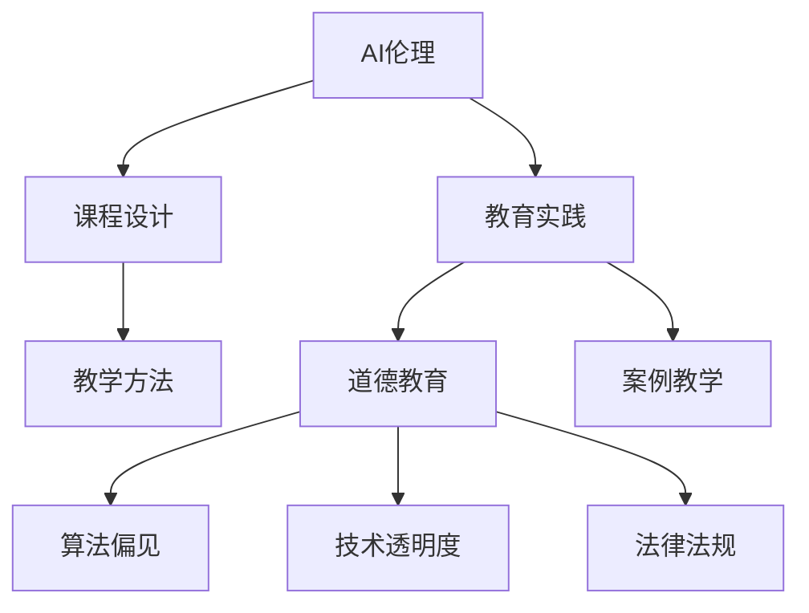

                 

# AI伦理的教育实践:伦理教育的课程设计和教学方法

> 关键词：AI伦理, 教育实践, 课程设计, 教学方法, 道德教育, 算法偏见, 技术透明度, 法律法规, 案例教学

## 1. 背景介绍

### 1.1 问题由来
近年来，人工智能(AI)技术的飞速发展，带来了前所未有的便利和效率提升。然而，随着AI在医疗、金融、教育等领域的广泛应用，其潜在的伦理问题也逐渐凸显。AI系统的决策透明度、数据隐私、算法偏见、责任归属等问题，已经引起了社会各界的高度关注。在AI技术不断普及的过程中，伦理教育显得尤为重要。

### 1.2 问题核心关键点
AI伦理教育的核心在于：如何在AI技术的教学过程中，培养学生的伦理意识，使其能够理解和应用AI技术的同时，坚守道德底线，做出符合伦理原则的决策。这不仅包括对AI技术基础知识的学习，更重要的是对AI伦理问题的识别、分析和应对能力。

### 1.3 问题研究意义
AI伦理教育的开展，有助于提升学生对AI技术的理解，增强其批判性思维和伦理决策能力，促进AI技术的健康发展。同时，通过伦理教育，可以培育社会责任感和道德自律性，构建AI技术的社会共识，确保AI技术的应用符合社会利益。

## 2. 核心概念与联系

### 2.1 核心概念概述

为更好地理解AI伦理教育，本节将介绍几个密切相关的核心概念：

- AI伦理(AI Ethics)：涉及AI技术的道德、法律、社会等方面，旨在规范和指导AI技术的开发和使用，以防止其带来的负面影响。
- 教育实践(Education Practice)：将理论知识转化为实践能力的过程，强调理论与实践的结合。
- 课程设计(Curriculum Design)：为达成教学目标，精心设计的教学计划和活动安排。
- 教学方法(Teaching Method)：在教学过程中采用的策略和技巧，如案例教学、项目式学习等。
- 道德教育(Moral Education)：通过培养学生的道德观念，使其形成正确的价值观和行为准则。
- 算法偏见(Algorithmic Bias)：AI算法在训练数据中学习到的人为偏见，导致不公平的输出结果。
- 技术透明度(Transparency of Technology)：AI技术的决策过程和机制，是否能够被用户理解，确保用户对其行为的合理性有清晰的认识。
- 法律法规(Legal and Regulatory Framework)：与AI技术相关的法律规定和政策指导，确保AI应用的合法性和合规性。
- 案例教学(Case Study Teaching)：通过具体案例的分析和讨论，引导学生理解和应用AI伦理问题。

这些核心概念之间的逻辑关系可以通过以下Mermaid流程图来展示：



这个流程图展示了一体化AI伦理教育的逻辑关系：

1. AI伦理是教育实践的基础，指导课程设计和教学方法的选择。
2. 课程设计关注于理论知识和实际技能的整合。
3. 教学方法涵盖案例教学、项目式学习等具体手段。
4. 道德教育是课程的核心，培养学生的伦理意识和行为规范。
5. 算法偏见、技术透明度和法律法规是道德教育的重要组成部分。
6. 案例教学是教学方法的重要体现，通过具体案例深化学生对AI伦理问题的理解。

## 3. 核心算法原理 & 具体操作步骤
### 3.1 算法原理概述

AI伦理教育的核心在于培养学生的伦理意识和决策能力，通过理论学习、实践操作、案例分析等多种手段，使其能够理解和应用AI技术的道德规范。其基本原理包括：

1. **理论知识传授**：系统介绍AI技术的基本概念、发展历程、应用场景等，为理解伦理问题提供背景知识。
2. **实践技能训练**：通过编程、实验等手段，使学生亲身体验AI技术的操作过程，增强其对技术细节的理解。
3. **伦理问题分析**：通过案例分析和讨论，引导学生识别和思考AI技术的伦理问题，如算法偏见、数据隐私、责任归属等。
4. **道德决策训练**：培养学生在面对具体伦理困境时，能够做出符合伦理原则的决策，确保AI技术的合理应用。
5. **法律法规学习**：介绍与AI技术相关的法律法规，增强学生的法律意识，确保技术应用的合规性。

### 3.2 算法步骤详解

基于上述原理，AI伦理教育的实施可以概括为以下五个步骤：

**Step 1: 确定教学目标和内容**
- 根据学生的基础和需求，明确AI伦理教育的总体目标和具体内容。
- 将AI伦理知识分解为多个模块，如AI基础、伦理原则、算法偏见、法律法规等，确保系统性和全面性。

**Step 2: 设计课程结构和教学活动**
- 根据教学目标，设计课程的结构和活动安排，包括理论讲授、实践操作、案例分析、讨论交流等环节。
- 将理论知识和实践操作相结合，通过项目式学习、实验实训等方式，提升学生的动手能力和应用能力。

**Step 3: 选择教学方法和工具**
- 根据教学内容，选择合适的教学方法，如案例教学、项目式学习、讨论式学习等。
- 使用先进的技术工具，如编程环境、AI平台、案例库等，增强教学的互动性和趣味性。

**Step 4: 实施教学活动和评估效果**
- 按照课程设计，有序实施教学活动，关注学生的参与度和反馈。
- 通过测验、作业、项目答辩等方式，评估学生的学习效果和实践能力。
- 定期收集学生和教师的反馈，优化课程设计和教学方法。

**Step 5: 持续改进和更新**
- 根据最新的AI技术和伦理问题，定期更新教学内容和教学方法。
- 建立持续改进机制，及时调整课程内容和教学策略，确保教学的时效性和前瞻性。

### 3.3 算法优缺点

AI伦理教育的实施具有以下优点：
1. **系统性**：通过系统的课程设计和活动安排，全面覆盖AI伦理的各个方面，避免知识盲点。
2. **实践性**：结合实践操作和项目实训，增强学生对AI技术的理解和应用能力。
3. **互动性**：通过案例分析和讨论，激发学生的思考和交流，增强学习的主动性。
4. **前沿性**：及时更新教学内容和教学方法，跟踪最新的AI技术和伦理问题。

同时，该方法也存在一定的局限性：
1. **资源需求高**：需要配备先进的教学设备和工具，同时要求教师具备较高的AI和伦理知识水平。
2. **评估复杂**：AI伦理问题的多维性，使得学生的伦理理解难以量化评估。
3. **适应性差**：课程设计和教学方法可能不适用于所有学生，需要灵活调整。
4. **效果不确定**：伦理教育的效果受学生个体差异和外界环境影响较大，难以保证一致性。

尽管存在这些局限性，但就目前而言，系统化的AI伦理教育仍是培养学生伦理意识和决策能力的重要途径。未来相关研究的重点在于如何进一步优化教学过程，提升教学效果，确保教学资源的高效利用。

### 3.4 算法应用领域

AI伦理教育已经在多个领域得到了应用，如计算机科学、工程、法律、医学等。具体应用场景包括：

- **计算机科学**：在AI技术课程中融入伦理教育，提升学生的道德素养，确保技术的负责任使用。
- **工程学科**：在产品设计和开发阶段，加入伦理审查和决策，避免技术应用中的伦理问题。
- **法律学科**：通过法律伦理课程，培养学生的法律意识，确保AI技术应用的合规性。
- **医学领域**：在医疗AI技术应用中，注重隐私保护和责任归属，提升患者的信任度和接受度。

除了这些经典应用外，AI伦理教育还在更多领域展现出了广阔的应用前景，如教育、金融、环境、公共政策等，为AI技术的健康发展提供了重要保障。

## 4. 数学模型和公式 & 详细讲解 & 举例说明

### 4.1 数学模型构建

本节将使用数学语言对AI伦理教育过程进行更加严格的刻画。

假设AI伦理教育的目标是培养学生的伦理意识和决策能力，记学生的伦理水平为 $E$，经过一系列教育活动后的变化量为 $E'$。教育活动的影响可以表示为函数 $f$，其输入为教育活动的设计和实施情况，输出为学生的伦理变化量。

$$
E' = f(E, \text{教学活动设计}, \text{教学实施情况})
$$

其中，教学活动设计包括课程目标、内容安排、教学方法等；教学实施情况包括教师的教学水平、学生的参与度、教学资源的配置等。

### 4.2 公式推导过程

为了更直观地展示AI伦理教育的效果，可以引入一个简化的公式来描述教育过程的影响：

$$
E' = \alpha \cdot E + \beta \cdot \text{教育投入} + \gamma \cdot \text{教学效果}
$$

其中：
- $\alpha$ 表示教育活动的乘数效应，即教育活动对学生伦理水平的提升比例。
- $\beta$ 表示教育投入的影响系数，即教育资源（如教师水平、教学设备等）对教育效果的贡献度。
- $\gamma$ 表示教学效果的影响系数，即教学活动设计和实施的准确性对学生伦理水平的影响。

通过以上公式，可以系统地评估和优化AI伦理教育的各个环节，确保其有效性。

### 4.3 案例分析与讲解

以一个具体的案例来分析AI伦理教育的实际效果。假设在一个AI技术的项目式学习课程中，教师设计了多个伦理问题讨论环节，并使用编程实验来模拟AI系统的决策过程。学生通过理论学习、实践操作和案例分析，逐步增强了对AI伦理问题的理解。

**案例描述**：某班级进行了为期一个月的AI伦理教育课程，课程内容包括理论讲授、案例分析和编程实验。课程结束后，对学生的伦理水平进行了评估。

**案例分析**：
- 课程目标明确，重点围绕算法偏见、数据隐私、责任归属等问题展开，确保学生理解伦理问题的核心。
- 教学活动设计合理，将理论知识与实践操作相结合，使用编程实验和案例分析，增强学生的实践能力和理解深度。
- 教师教学水平高，具备丰富的AI和伦理知识，能够引导学生深入思考和讨论。
- 学生参与度高，积极参与讨论和实验，通过实际问题分析，提升对伦理问题的敏感性和应对能力。

**效果评估**：
- 课程结束时，通过测验和项目答辩，评估学生的学习效果。结果显示，学生的伦理水平显著提升，能够更准确地识别和分析AI伦理问题。
- 学生反馈问卷显示，大部分学生认为课程设计合理，教学方法有效，能够帮助其理解和应用AI伦理知识。

这个案例展示了AI伦理教育如何通过系统化的课程设计和实践活动，有效提升学生的伦理意识和决策能力。通过类似的案例分析，可以进一步优化教学过程，提升教学效果。

## 5. 项目实践：代码实例和详细解释说明
### 5.1 开发环境搭建

在进行AI伦理教育实践前，我们需要准备好开发环境。以下是使用Python进行PyTorch开发的环境配置流程：

1. 安装Anaconda：从官网下载并安装Anaconda，用于创建独立的Python环境。

2. 创建并激活虚拟环境：
```bash
conda create -n ai-ethics-env python=3.8 
conda activate ai-ethics-env
```

3. 安装PyTorch：根据CUDA版本，从官网获取对应的安装命令。例如：
```bash
conda install pytorch torchvision torchaudio cudatoolkit=11.1 -c pytorch -c conda-forge
```

4. 安装TensorFlow：
```bash
conda install tensorflow
```

5. 安装各类工具包：
```bash
pip install numpy pandas scikit-learn matplotlib tqdm jupyter notebook ipython
```

完成上述步骤后，即可在`ai-ethics-env`环境中开始AI伦理教育的实践。

### 5.2 源代码详细实现

下面以一个具体的AI伦理教育课程设计为例，给出使用Python进行AI伦理教育的代码实现。

首先，定义课程的总体目标和内容模块：

```python
# 定义课程目标和内容模块
course_name = "AI Ethics and Decision Making"
course_target = "Enhance students' understanding of AI ethics and decision-making skills."
course_modules = {
    "AI Basics": "Introduction to AI technology and its development history.",
    "Ethical Principles": "Discussion on fundamental ethical principles and guidelines.",
    "Algorithmic Bias": "Analysis of algorithmic bias and its impact.",
    "Technology Transparency": "Understanding the transparency of AI decision-making processes.",
    "Legal and Regulatory Framework": "Introduction to relevant laws and regulations."
}
```

然后，设计具体的教学活动和评估方法：

```python
# 设计教学活动和评估方法
activities = {
    "AI Basics": {
        "activities": [
            "Lecture on AI basics",
            "Group discussion on AI applications"
        ],
        "assessment": "Multiple-choice quiz on AI basics."
    },
    "Ethical Principles": {
        "activities": [
            "Case study analysis",
            "Ethical dilemma simulation"
        ],
        "assessment": "Essay on ethical principles and their application."
    },
    "Algorithmic Bias": {
        "activities": [
            "Project on bias detection",
            "Bias mitigation workshop"
        ],
        "assessment": "Bias detection project report."
    },
    "Technology Transparency": {
        "activities": [
            "Transparency assessment exercise",
            "Technical interview"
        ],
        "assessment": "Technology transparency project."
    },
    "Legal and Regulatory Framework": {
        "activities": [
            "Legal case analysis",
            "Regulatory compliance simulation"
        ],
        "assessment": "Legal compliance report."
    }
}
```

最后，使用Jupyter Notebook启动教学活动：

```python
from IPython.display import display

# 创建课程结构
display(Markdown("## {}: AI Ethics and Decision Making".format(course_name)))
display(Markdown("### Course Target: {}".format(course_target)))

# 显示课程内容模块
for module, content in course_modules.items():
    display(Markdown("#### {}".format(module)))
    display(Markdown("##### Content Description: {}".format(content)))

# 显示教学活动
display(Markdown("### Activities"))
for module, activities in activities.items():
    display(Markdown("#### {}".format(module)))
    for activity in activities["activities"]:
        display(Markdown("##### {}".format(activity)))
    display(Markdown("##### Assessment: {}".format(activities["assessment"])))
```

这个代码实现了课程结构和教学活动的展示，使学生能够清晰地了解课程内容和活动安排。

### 5.3 代码解读与分析

让我们再详细解读一下关键代码的实现细节：

**课程目标和内容模块**：
- 定义课程的总体目标和各个内容模块，包括AI基础、伦理原则、算法偏见等，确保课程的系统性和全面性。

**教学活动和评估方法**：
- 设计具体的教学活动和评估方法，如讲座、讨论、项目等，确保学生能够多维度地理解AI伦理问题。

**Jupyter Notebook展示**：
- 使用Jupyter Notebook创建课程结构的展示，通过Markdown格式清晰地呈现课程内容、活动和评估方法，增强学生的学习体验。

**实践和优化**：
- 根据学生反馈和评估结果，及时调整教学活动和评估方法，优化课程设计，确保教学效果。

## 6. 实际应用场景
### 6.1 智能制造教育

在智能制造领域，AI伦理教育对于培养高素质技术人才至关重要。智能制造涉及大量的AI技术应用，如机器人编程、工业数据分析、智能仓储管理等。通过AI伦理教育，学生能够理解AI技术的伦理问题，如数据隐私、系统透明度、责任归属等，从而在设计和使用AI系统时，做出符合伦理原则的决策。

例如，在智能仓储管理项目中，学生需要通过编程实验和案例分析，识别并解决数据隐私保护和系统透明度的伦理问题，确保系统的安全可靠。同时，通过伦理教育，学生能够意识到算法偏见可能带来的不公平影响，避免在应用过程中产生歧视性输出。

### 6.2 金融科技教育

金融科技领域的应用，如智能投顾、风险评估、反欺诈检测等，涉及大量的AI技术。然而，这些应用往往需要处理敏感的个人财务信息，涉及数据隐私、算法公正性等伦理问题。通过AI伦理教育，学生能够理解金融科技的伦理要求，确保技术应用的合规性和安全性。

例如，在智能投顾项目中，学生需要分析算法偏见和数据隐私问题，设计透明的决策过程，确保投资建议的公正性和用户的信任。同时，通过伦理教育，学生能够理解法律法规对金融科技的约束，确保技术应用的合规性。

### 6.3 医疗健康教育

医疗健康领域的应用，如智能诊断、个性化治疗、患者数据分析等，涉及大量的AI技术。然而，这些应用往往需要处理患者敏感信息，涉及隐私保护、责任归属等伦理问题。通过AI伦理教育，学生能够理解医疗AI的伦理要求，确保技术应用的合规性和安全性。

例如，在智能诊断项目中，学生需要分析数据隐私和算法偏见问题，设计透明的决策过程，确保诊断结果的准确性和患者的信任。同时，通过伦理教育，学生能够理解法律法规对医疗AI的约束，确保技术应用的合规性。

### 6.4 未来应用展望

随着AI技术的普及和伦理问题的日益凸显，AI伦理教育将具有更加重要的意义。未来的AI伦理教育将呈现以下几个发展趋势：

1. **跨学科融合**：AI伦理教育将与其他学科如哲学、社会学、法律等深度融合，构建更全面、系统的伦理教育体系。
2. **技术工具应用**：借助AI、大数据等技术工具，实现伦理教育的智能化、个性化，提高教学效果。
3. **持续更新和优化**：随着AI技术的不断发展和伦理问题的不断涌现，AI伦理教育需要持续更新和优化，确保其前瞻性和时效性。
4. **全球化视角**：随着AI技术应用的全球化，AI伦理教育也需要具备全球化视角，理解和应对不同文化背景下的伦理问题。

总之，未来的AI伦理教育将更加注重跨学科融合、技术工具应用和持续优化，为AI技术的健康发展提供重要保障。

## 7. 工具和资源推荐
### 7.1 学习资源推荐

为了帮助开发者系统掌握AI伦理教育的理论基础和实践技巧，这里推荐一些优质的学习资源：

1. 《人工智能伦理》系列博文：由知名AI伦理专家撰写，深入浅出地介绍了AI伦理的基础知识、伦理问题及解决方案。

2. 《AI伦理教育指南》书籍：全面介绍了AI伦理教育的目标、方法、评估等，是教育工作者和学生的必备参考资料。

3. 《AI伦理实践案例》论文集：收录了大量AI伦理问题的实践案例，通过具体案例分析，帮助学生理解和应用AI伦理知识。

4. 《AI伦理教育论坛》在线课程：提供系统的AI伦理教育课程，涵盖AI基础、伦理原则、案例分析等各个方面，适合各层次学生学习。

通过对这些资源的学习实践，相信你一定能够系统地掌握AI伦理教育的核心内容，并用于解决实际的AI伦理问题。

### 7.2 开发工具推荐

高效的开发离不开优秀的工具支持。以下是几款用于AI伦理教育开发的常用工具：

1. Jupyter Notebook：免费的交互式编程环境，支持Markdown格式，适合教学活动的展示和交互。
2. GitLab/GitHub：版本控制和协作平台，适合团队合作和项目管理。
3. Microsoft Teams：在线协作工具，支持视频会议、文档共享等功能，适合远程教学和实时互动。
4. Zoom：视频会议平台，适合线上教学和远程讨论。
5. Kaggle：数据科学竞赛平台，提供丰富的数据集和案例库，适合学生实践和竞赛。

合理利用这些工具，可以显著提升AI伦理教育的开发效率，加快创新迭代的步伐。

### 7.3 相关论文推荐

AI伦理教育的研究始于学界的持续探索。以下是几篇奠基性的相关论文，推荐阅读：

1. "The Ethics of Artificial Intelligence" by Nick Bostrom：讨论了AI伦理的核心问题和解决方案，为AI伦理教育提供了理论基础。
2. "AI Ethics in the Curriculum: A Framework for Integrating Ethics into Computer Science Education" by Adele Goldberg：提出了将AI伦理教育融入计算机科学课程的框架，为AI伦理教育提供了实践指南。
3. "Algorithmic Fairness, Accountability, Transparency, and Ethics" by Jacob Steinhardt, Pedro Domingos, and trevor J. Darrell：探讨了算法偏见、公平性等伦理问题，为AI伦理教育提供了技术视角。
4. "Ethics in Machine Learning and Artificial Intelligence" by Rowan Zelenetz-Woodruff：介绍了AI伦理教育的最新研究成果，为AI伦理教育提供了前沿视角。

这些论文代表了大语言模型微调技术的发展脉络。通过学习这些前沿成果，可以帮助研究者把握学科前进方向，激发更多的创新灵感。

## 8. 总结：未来发展趋势与挑战
### 8.1 总结

本文对AI伦理教育的课程设计和教学方法进行了全面系统的介绍。首先阐述了AI伦理教育的研究背景和意义，明确了伦理教育在培养学生伦理意识和决策能力方面的独特价值。其次，从原理到实践，详细讲解了AI伦理教育的设计和实施过程，给出了AI伦理教育的完整代码实例。同时，本文还广泛探讨了AI伦理教育在智能制造、金融科技、医疗健康等多个领域的应用前景，展示了AI伦理教育的重要意义。此外，本文精选了AI伦理教育的各类学习资源，力求为读者提供全方位的技术指引。

通过本文的系统梳理，可以看到，AI伦理教育已经成为培养学生伦理意识和决策能力的重要途径。AI伦理教育的开展，有助于提升学生对AI技术的理解，增强其批判性思维和伦理决策能力，促进AI技术的健康发展。未来，伴随AI技术的不断演进和伦理问题的不断涌现，AI伦理教育需要不断优化和创新，才能适应新形势下的需求。

### 8.2 未来发展趋势

展望未来，AI伦理教育将呈现以下几个发展趋势：

1. **跨学科融合**：AI伦理教育将与其他学科如哲学、社会学、法律等深度融合，构建更全面、系统的伦理教育体系。
2. **技术工具应用**：借助AI、大数据等技术工具，实现伦理教育的智能化、个性化，提高教学效果。
3. **持续更新和优化**：随着AI技术的不断发展和伦理问题的不断涌现，AI伦理教育需要持续更新和优化，确保其前瞻性和时效性。
4. **全球化视角**：随着AI技术应用的全球化，AI伦理教育也需要具备全球化视角，理解和应对不同文化背景下的伦理问题。

以上趋势凸显了AI伦理教育的广阔前景。这些方向的探索发展，必将进一步提升AI伦理教育的系统性和有效性，为AI技术的健康发展提供重要保障。

### 8.3 面临的挑战

尽管AI伦理教育已经取得了一定进展，但在迈向更加智能化、普适化应用的过程中，它仍面临着诸多挑战：

1. **资源需求高**：需要配备先进的教学设备和工具，同时要求教师具备较高的AI和伦理知识水平。
2. **评估复杂**：AI伦理问题的多维性，使得学生的伦理理解难以量化评估。
3. **适应性差**：课程设计和教学方法可能不适用于所有学生，需要灵活调整。
4. **效果不确定**：伦理教育的效果受学生个体差异和外界环境影响较大，难以保证一致性。

尽管存在这些局限性，但就目前而言，系统化的AI伦理教育仍是培养学生伦理意识和决策能力的重要途径。未来相关研究的重点在于如何进一步优化教学过程，提升教学效果，确保教学资源的高效利用。

### 8.4 研究展望

面对AI伦理教育所面临的种种挑战，未来的研究需要在以下几个方面寻求新的突破：

1. **探索无监督和半监督教育方法**：摆脱对大规模标注数据的依赖，利用自监督学习、主动学习等无监督和半监督范式，最大限度利用非结构化数据，实现更加灵活高效的伦理教育。
2. **开发更加参数高效的伦理教育方法**：开发更加参数高效的伦理教育方法，在固定大部分预训练参数的同时，只更新极少量的任务相关参数，提高教育效率。
3. **融合因果和对比学习范式**：通过引入因果推断和对比学习思想，增强伦理教育建立稳定因果关系的能力，学习更加普适、鲁棒的语言表征，从而提升教育泛化性和抗干扰能力。
4. **引入更多先验知识**：将符号化的先验知识，如知识图谱、逻辑规则等，与神经网络模型进行巧妙融合，引导伦理教育过程学习更准确、合理的伦理知识。同时加强不同模态数据的整合，实现视觉、语音等多模态信息与文本信息的协同建模。
5. **结合因果分析和博弈论工具**：将因果分析方法引入伦理教育，识别出教育决策的关键特征，增强教育输出解释的因果性和逻辑性。借助博弈论工具刻画人机交互过程，主动探索并规避教育的脆弱点，提高系统稳定性。
6. **纳入伦理道德约束**：在教育目标中引入伦理导向的评估指标，过滤和惩罚有害的输出倾向。同时加强人工干预和审核，建立教育行为的监管机制，确保输出符合人类价值观和伦理道德。

这些研究方向的探索，必将引领AI伦理教育技术迈向更高的台阶，为构建安全、可靠、可解释、可控的智能系统铺平道路。面向未来，AI伦理教育还需要与其他人工智能技术进行更深入的融合，如知识表示、因果推理、强化学习等，多路径协同发力，共同推动自然语言理解和智能交互系统的进步。只有勇于创新、敢于突破，才能不断拓展语言模型的边界，让智能技术更好地造福人类社会。

## 9. 附录：常见问题与解答
**Q1：AI伦理教育是否适用于所有学科？**

A: AI伦理教育在计算机科学、工程、法律、医学等学科中已经得到广泛应用。然而，对于某些学科，如文学、艺术等，AI伦理问题可能并不突出。因此，需要根据学科特点和需求，灵活调整AI伦理教育的内容和方法，确保其适用性和有效性。

**Q2：如何进行跨学科的AI伦理教育？**

A: 跨学科的AI伦理教育需要综合考虑各学科的特点和需求，设计系统化的课程内容和教学方法。例如，在计算机科学课程中，可以结合人工智能应用实例，探讨AI伦理问题；在法律课程中，可以讨论AI技术在法律应用中的合规性和法律风险；在医学课程中，可以分析AI系统在患者隐私保护和算法偏见中的应用。

**Q3：如何在AI伦理教育中融入技术工具？**

A: 利用先进的技术工具，如编程环境、AI平台、案例库等，可以显著提升AI伦理教育的效率和效果。例如，在教学过程中，可以使用Python编程环境进行AI模型训练和推理，使用Jupyter Notebook展示教学内容，使用案例库提供丰富的教学素材。

**Q4：如何评估AI伦理教育的效果？**

A: AI伦理教育的效果评估较为复杂，可以从以下几个方面入手：
1. 理论知识掌握情况：通过测验和讨论，评估学生对AI伦理知识的理解和掌握程度。
2. 实践技能应用能力：通过编程实验和项目答辩，评估学生对AI伦理问题的分析和解决能力。
3. 伦理意识和行为规范：通过问卷调查和行为观察，评估学生的伦理意识和行为规范。

**Q5：AI伦理教育的未来发展方向是什么？**

A: AI伦理教育的未来发展方向包括：
1. 跨学科融合：与其他学科如哲学、社会学、法律等深度融合，构建更全面、系统的伦理教育体系。
2. 技术工具应用：借助AI、大数据等技术工具，实现伦理教育的智能化、个性化，提高教学效果。
3. 持续更新和优化：随着AI技术的不断发展和伦理问题的不断涌现，AI伦理教育需要持续更新和优化，确保其前瞻性和时效性。
4. 全球化视角：随着AI技术应用的全球化，AI伦理教育也需要具备全球化视角，理解和应对不同文化背景下的伦理问题。

通过对这些问题的深入探讨，可以帮助我们更好地理解和实践AI伦理教育，确保其在培养学生伦理意识和决策能力方面的有效性。

---

作者：禅与计算机程序设计艺术 / Zen and the Art of Computer Programming

