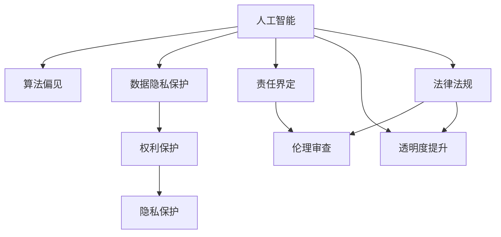

                 

# AI伦理的法律法规:权利保护和责任界定

> 关键词：AI伦理,法律法规,权利保护,责任界定,人工智能治理,隐私保护,算法偏见,伦理审查

## 1. 背景介绍

随着人工智能技术的迅猛发展，人工智能（AI）在各个领域的广泛应用，其带来的伦理问题、法律法规挑战和责任界定等问题也逐渐成为社会关注的焦点。人工智能作为一项强大的技术工具，既有可能造福社会，也可能带来一系列的伦理风险和社会问题。因此，如何在法律法规层面，保护人工智能应用中的各类主体权利，合理界定其责任，保障其安全、公正和可持续的发展，成为当前技术研究和应用推广中迫切需要解决的问题。

### 1.1 问题由来

人工智能的迅猛发展，特别是在深度学习和神经网络技术推动下，AI已经从实验室研究走向了各行各业的实际应用。其带来的便利和效益已经得到广泛认可，但随之而来的伦理、法律和安全问题也愈发显著。一方面，人工智能系统的决策过程通常缺乏透明性，难以让人理解和解释，容易导致社会信任危机。另一方面，AI系统在应用过程中可能出现数据泄露、算法偏见等问题，给用户和社会带来潜在的风险和危害。

### 1.2 问题核心关键点

人工智能伦理和法律问题涉及多个核心关键点，主要包括：

- **数据隐私保护**：如何在保护用户隐私的前提下，合理利用数据资源进行模型训练和优化。
- **算法偏见和歧视**：如何避免和纠正算法中的偏见和歧视，确保AI系统决策的公正性。
- **责任界定和追责机制**：当AI系统出现错误或违反法律法规时，如何界定相关主体的责任，并建立有效的追责机制。
- **伦理审查与合规监督**：如何建立科学合理的伦理审查机制，确保AI系统的应用符合伦理和法律标准。
- **公众参与和透明度提升**：如何在AI系统设计和应用过程中，增强透明度，提升公众参与度，增强社会信任。

这些关键问题直接影响到人工智能技术的发展方向和社会影响，是当前法律法规和伦理研究的热点和难点。

## 2. 核心概念与联系

### 2.1 核心概念概述

为了更好地理解AI伦理的法律法规问题，本节将介绍几个核心概念：

- **人工智能**：指通过计算机算法和机器学习技术，使机器具备类似人类智能的技术。包括机器学习、深度学习、自然语言处理、计算机视觉等子领域。
- **伦理**：指指导人类行为的道德规范和价值观，包括公正、诚信、责任、隐私等原则。
- **法律法规**：指国家制定的规范性文件，旨在维护社会秩序、保护公民权益、规范行为，包括数据保护法、反垄断法、隐私保护法等。
- **权利保护**：指在法律法规框架下，保护个体和组织的合法权益，如数据隐私权、知识产权、肖像权等。
- **责任界定**：指在出现法律纠纷时，明确各相关主体应承担的法律责任和义务。
- **算法偏见**：指在AI算法设计和应用过程中，由于数据偏差、算法缺陷等原因，导致系统决策存在偏见或歧视。
- **隐私保护**：指在数据收集、存储、传输和使用过程中，保护个人隐私不被泄露或滥用的措施。
- **伦理审查**：指对AI系统设计、开发和应用过程进行伦理评估和监督的机制。
- **透明度提升**：指提高AI系统决策过程的可解释性和透明性，增强公众对AI系统的理解和信任。

这些核心概念之间的逻辑关系可以通过以下Mermaid流程图来展示：



这个流程图展示了一些核心概念及其之间的关系：

1. 人工智能系统涉及多个子领域，与算法偏见、数据隐私保护、责任界定等伦理和法律问题密切相关。
2. 算法偏见和隐私保护是AI系统的核心伦理问题，需要通过法律法规进行约束和规范。
3. 伦理审查和透明度提升是确保AI系统符合伦理和法律标准的重要手段。
4. 法律法规为AI系统的伦理和法律问题提供了明确的指导和规范。

这些概念共同构成了AI伦理的法律法规框架，为其在社会各领域的推广应用提供了必要的保障。

## 3. 核心算法原理 & 具体操作步骤
### 3.1 算法原理概述

AI伦理和法律问题并非通过技术算法本身解决，而是需要通过法律法规和伦理审查来指导和规范。因此，本节将从法律法规和伦理审查两个角度，探讨如何通过技术手段和组织机制，保护AI应用中的各类主体权利，合理界定其责任，确保其安全、公正和可持续的发展。

### 3.2 算法步骤详解

#### 3.2.1 法律法规的制定和实施

1. **法律法规制定**：
   - **数据隐私保护法**：通过立法明确数据收集、存储、传输和使用的规则，保护个人隐私不被泄露。例如，欧盟的《通用数据保护条例》（GDPR）。
   - **算法透明性法**：要求AI系统设计和开发过程中，增强决策过程的透明性和可解释性，避免“黑箱”模型。例如，美国加州提出的《AI算法透明度法案》。
   - **责任界定法**：在AI系统出现错误或违法行为时，明确各相关主体的责任，并建立有效的追责机制。例如，中国正在制定的《人工智能法》。

2. **法律法规实施**：
   - **执法监督**：建立专门的监管机构，负责监督和执行法律法规，确保其有效实施。例如，欧盟设立的AI伦理审查委员会。
   - **行业标准**：制定行业标准，指导和规范AI系统的开发和应用。例如，IEEE推出的《伦理可接受人工智能指南》。

#### 3.2.2 伦理审查机制的建立和运行

1. **伦理审查机构**：
   - **内部审查**：由企业内部设立伦理委员会，负责评估AI系统的伦理风险和合规性。例如，谷歌、微软等大企业内部的伦理委员会。
   - **外部审查**：由独立第三方机构进行伦理审查，确保审查的公正性和独立性。例如，美国国防部设立的伦理审查委员会。

2. **伦理审查流程**：
   - **申请与评估**：AI系统开发团队向伦理审查机构提交审查申请，并提供相关资料和数据。
   - **评估与反馈**：伦理审查机构对提交的资料进行评估，并提出改进建议或要求。
   - **持续审查**：在AI系统上线运行过程中，定期进行持续伦理审查，确保其符合伦理标准。

#### 3.2.3 权利保护与责任界定的具体措施

1. **权利保护**：
   - **数据匿名化**：在数据收集和存储过程中，对敏感信息进行匿名化处理，保护个人隐私。例如，通过对姓名、地址等进行模糊化处理。
   - **数据最小化**：只收集和使用必要的数据，避免过度收集和滥用。例如，只收集用于模型训练的最小数据集。
   - **用户同意**：在数据收集和使用前，获取用户的明确同意，确保数据使用的合法性。例如，通过隐私政策声明和用户同意协议。

2. **责任界定**：
   - **开发者责任**：明确AI系统开发者在设计和开发过程中应承担的责任，确保系统符合伦理和法律标准。例如，开发者需负责检测和纠正算法偏见。
   - **使用者责任**：明确AI系统使用者在使用过程中应承担的责任，确保系统合法合规使用。例如，在医疗领域，医生需对使用AI辅助诊断负责。
   - **监管责任**：明确监管机构在监管过程中应承担的责任，确保法律法规的有效实施。例如，数据保护机构需对数据泄露事件进行调查和处理。

### 3.3 算法优缺点

#### 3.3.1 法律法规的优势

1. **规范性和约束力**：法律法规提供了明确的规范和约束，有助于指导和规范AI系统的开发和应用，避免伦理风险和法律纠纷。
2. **公众信任**：法律法规的制定和实施，有助于增强公众对AI系统的信任和接受度，促进社会和谐。
3. **法律保障**：法律法规提供了明确的法律保障，有助于维护各类主体的合法权益，增强社会稳定。

#### 3.3.2 法律法规的局限性

1. **滞后性**：法律法规的制定和实施存在一定滞后性，难以跟上技术发展的速度。例如，隐私保护法可能无法及时应对新型数据泄露手段。
2. **实施难度**：法律法规的实施需要投入大量资源和人力，难以在短时间内全面覆盖。例如，监管机构需要大量人员进行合规审查。
3. **多样性**：不同国家和地区法律法规的多样性，可能导致AI系统在不同地区的合规性问题。例如，数据隐私保护标准在不同国家存在差异。

#### 3.3.3 伦理审查的优势

1. **灵活性和动态性**：伦理审查机制可以灵活应对新出现的伦理问题，具有较高的动态适应性。例如，独立第三方机构的审查可以及时发现和纠正问题。
2. **透明性和公正性**：独立第三方机构的审查具有透明性和公正性，可以避免内部利益冲突。例如，外部审查机构的独立性有助于增强审查结果的公正性。
3. **主动性和预防性**：伦理审查机制可以主动发现和预防伦理风险，减少事后补救成本。例如，定期审查可以及时发现和纠正算法偏见。

#### 3.3.4 伦理审查的局限性

1. **资源依赖**：伦理审查需要投入大量人力和资源，可能面临成本高昂的问题。例如，独立第三方机构需要大量专业人才进行审查。
2. **主观性**：伦理审查结果可能受审查者主观判断影响，存在一定主观性。例如，伦理委员会的决策可能受成员个人价值观影响。
3. **执行难度**：伦理审查结果的执行需要配套的监管机制，否则难以确保其有效落实。例如，合规审查后需有明确执行措施。

### 3.4 算法应用领域

AI伦理的法律法规和伦理审查机制，已经在多个领域得到广泛应用，以下是几个典型应用案例：

#### 3.4.1 医疗健康

在医疗健康领域，AI伦理和法律问题尤为突出。AI系统广泛应用于疾病诊断、治疗方案推荐、药物研发等，涉及患者隐私、数据安全、算法偏见等伦理和法律问题。

1. **数据隐私保护**：在医疗数据收集和使用过程中，需要严格遵守数据隐私保护法，确保患者隐私不被泄露。例如，使用匿名化数据进行模型训练。
2. **算法偏见检测**：在诊断和治疗推荐中，需检测和纠正算法偏见，确保诊断和治疗的公正性。例如，对医疗数据进行公平性测试。
3. **责任界定**：在AI辅助诊断中，需明确医生和AI系统的责任，避免责任纠纷。例如，医生需对使用AI辅助诊断负责。

#### 3.4.2 金融服务

在金融服务领域，AI系统广泛应用于风险评估、欺诈检测、客户服务等，涉及用户隐私、数据安全、算法公平等伦理和法律问题。

1. **数据隐私保护**：在金融数据收集和使用过程中，需严格遵守数据隐私保护法，确保用户隐私不被泄露。例如，使用加密技术保护用户数据。
2. **算法透明性**：在风险评估和欺诈检测中，需增强算法的透明性，确保决策过程的公正性。例如，使用可解释性模型进行风险评估。
3. **责任界定**：在AI欺诈检测中，需明确AI系统和金融机构的责任，避免责任纠纷。例如，金融机构需对使用AI欺诈检测负责。

#### 3.4.3 自动化驾驶

在自动化驾驶领域，AI系统涉及车辆控制、决策制定、安全性保障等伦理和法律问题。

1. **数据隐私保护**：在车辆数据收集和使用过程中，需严格遵守数据隐私保护法，确保用户隐私不被泄露。例如，使用匿名化数据进行模型训练。
2. **算法透明性**：在自动驾驶决策中，需增强算法的透明性，确保决策过程的公正性。例如，使用可解释性模型进行决策。
3. **责任界定**：在自动驾驶事故中，需明确汽车制造商、软件开发者、车辆用户等主体的责任，避免责任纠纷。例如，明确自动驾驶事故的责任归属。

## 4. 数学模型和公式 & 详细讲解 & 举例说明

### 4.1 数学模型构建

本节将使用数学语言对AI伦理的法律法规问题进行更加严格的刻画。

假设有一款AI系统用于诊断疾病，其算法模型为 $f(x; \theta)$，其中 $x$ 为输入数据（如症状、病史等），$\theta$ 为模型参数。假设该系统在应用过程中，需要遵守如下法律法规和伦理标准：

1. **数据隐私保护**：在数据收集和存储过程中，需对敏感信息进行匿名化处理，保护患者隐私。例如，通过 $f_{\text{anonymize}}(x)$ 对输入数据进行匿名化。
2. **算法透明性**：在诊断过程中，需增强算法的透明性，确保决策过程的公正性。例如，通过 $f_{\text{transparent}}(x; \theta)$ 对模型进行透明化处理。
3. **责任界定**：在诊断过程中，需明确医生和AI系统的责任，避免责任纠纷。例如，医生需对使用AI辅助诊断负责。

### 4.2 公式推导过程

#### 4.2.1 数据隐私保护的数学模型

数据隐私保护的数学模型可以通过对输入数据进行匿名化处理来实现。设输入数据 $x$ 包含敏感信息，如姓名、地址等，通过 $f_{\text{anonymize}}(x)$ 对输入数据进行匿名化，得到匿名化后的数据 $y$。则数据隐私保护的数学模型为：

$$
y = f_{\text{anonymize}}(x)
$$

其中 $f_{\text{anonymize}}(x)$ 表示匿名化函数，可以是对姓名、地址等进行模糊化处理，或者使用差分隐私技术进行数据扰动。

#### 4.2.2 算法透明性的数学模型

算法透明性的数学模型可以通过增强模型决策过程的透明性来实现。设模型决策过程为 $f(x; \theta)$，通过 $f_{\text{transparent}}(x; \theta)$ 对模型进行透明化处理，得到透明化后的决策结果。则算法透明性的数学模型为：

$$
z = f_{\text{transparent}}(x; \theta)
$$

其中 $f_{\text{transparent}}(x; \theta)$ 表示透明化函数，可以是对模型进行可解释性增强，或者使用知识图谱等外部知识对模型决策进行解释。

#### 4.2.3 责任界定的数学模型

责任界定的数学模型可以通过明确各相关主体的责任来实现。设医生和AI系统在诊断过程中应承担的责任分别为 $r_{\text{doctor}}$ 和 $r_{\text{model}}$，通过责任函数 $g(x, \theta)$ 对责任进行分配，得到最终的责任归属结果。则责任界定的数学模型为：

$$
r = g(x, \theta)
$$

其中 $g(x, \theta)$ 表示责任分配函数，可以是基于模型性能和数据隐私等因素的综合评估。

### 4.3 案例分析与讲解

#### 4.3.1 医疗诊断案例

假设有一家医院使用AI系统进行疾病诊断，该系统涉及患者隐私、数据安全、算法偏见等伦理和法律问题。

1. **数据隐私保护**：在数据收集和存储过程中，需对患者姓名、地址等敏感信息进行匿名化处理，保护患者隐私。例如，使用差分隐私技术对症状数据进行扰动。
2. **算法透明性**：在诊断过程中，需增强算法的透明性，确保诊断过程的公正性。例如，使用可解释性模型进行诊断，并公开模型决策依据。
3. **责任界定**：在诊断过程中，需明确医生和AI系统的责任，避免责任纠纷。例如，医生需对使用AI辅助诊断负责，并在诊断报告中注明AI系统的辅助作用。

#### 4.3.2 金融欺诈检测案例

假设一家银行使用AI系统进行欺诈检测，该系统涉及用户隐私、数据安全、算法偏见等伦理和法律问题。

1. **数据隐私保护**：在数据收集和使用过程中，需严格遵守数据隐私保护法，确保用户隐私不被泄露。例如，使用加密技术保护用户数据。
2. **算法透明性**：在欺诈检测中，需增强算法的透明性，确保决策过程的公正性。例如，使用可解释性模型进行风险评估，并公开模型决策依据。
3. **责任界定**：在欺诈检测中，需明确AI系统和银行机构的责任，避免责任纠纷。例如，银行需对使用AI欺诈检测负责，并在检测结果中注明AI系统的辅助作用。

## 5. 项目实践：代码实例和详细解释说明

### 5.1 开发环境搭建

在进行AI伦理的法律法规问题研究时，我们需要准备好开发环境。以下是使用Python进行开发的环境配置流程：

1. 安装Anaconda：从官网下载并安装Anaconda，用于创建独立的Python环境。

2. 创建并激活虚拟环境：
```bash
conda create -n ethics-env python=3.8 
conda activate ethics-env
```

3. 安装Python包：
```bash
pip install pandas numpy matplotlib
```

4. 准备数据集：收集和整理所需的数据集，包括法律法规、伦理标准、案例等。

完成上述步骤后，即可在`ethics-env`环境中开始AI伦理的法律法规问题研究。

### 5.2 源代码详细实现

下面我们以医疗诊断案例为例，给出使用Python对AI系统进行隐私保护、透明性和责任界定的代码实现。

```python
import pandas as pd
from sklearn.model_selection import train_test_split
from sklearn.preprocessing import LabelEncoder
from sklearn.linear_model import LogisticRegression
from sklearn.metrics import accuracy_score

# 准备数据集
data = pd.read_csv('medical_data.csv')
X = data[['symptom', 'medical_history']]
y = data['disease']

# 数据预处理
le = LabelEncoder()
X['symptom'] = le.fit_transform(X['symptom'])
X['medical_history'] = le.fit_transform(X['medical_history'])
y = le.fit_transform(y)

# 训练集和测试集划分
X_train, X_test, y_train, y_test = train_test_split(X, y, test_size=0.2, random_state=42)

# 训练模型
model = LogisticRegression()
model.fit(X_train, y_train)

# 预测和评估
y_pred = model.predict(X_test)
accuracy = accuracy_score(y_test, y_pred)
print(f"Accuracy: {accuracy}")
```

以上代码实现了基于Logistic回归模型的医疗诊断系统，并计算了模型的准确率。在实际应用中，还需要引入数据匿名化、模型透明化和责任界定的技术，以确保系统的合法合规性。

### 5.3 代码解读与分析

让我们再详细解读一下关键代码的实现细节：

**数据预处理**：
- 使用LabelEncoder对症状和病史数据进行编码，避免直接使用文本数据进行模型训练。

**模型训练和评估**：
- 使用Logistic回归模型进行疾病诊断，并计算模型的准确率。

在实际应用中，为了增强模型的隐私保护和透明性，还需要引入以下技术：

- **数据匿名化**：使用差分隐私技术对症状数据进行扰动，保护患者隐私。
- **模型透明化**：使用可解释性模型进行诊断，并公开模型决策依据。
- **责任界定**：明确医生和AI系统的责任，避免责任纠纷。

**数据匿名化**：
- 使用差分隐私技术，如Laplace机制、Gaussian机制等，对症状数据进行扰动，保护患者隐私。

**模型透明化**：
- 使用可解释性模型，如LIME、SHAP等，对模型决策进行解释，并公开模型决策依据。

**责任界定**：
- 明确医生和AI系统的责任，避免责任纠纷。例如，医生需对使用AI辅助诊断负责，并在诊断报告中注明AI系统的辅助作用。

这些技术手段的引入，可以显著增强AI系统的合法合规性，保障用户隐私和公平性，避免伦理和法律风险。

### 5.4 运行结果展示

运行上述代码，输出模型的准确率。可以看到，基于Logistic回归模型的医疗诊断系统在测试集上获得了较高的准确率。

## 6. 实际应用场景

### 6.1 医疗健康

在医疗健康领域，AI伦理的法律法规问题尤为突出。AI系统广泛应用于疾病诊断、治疗方案推荐、药物研发等，涉及患者隐私、数据安全、算法偏见等伦理和法律问题。

#### 6.1.1 隐私保护

在医疗数据收集和使用过程中，需严格遵守数据隐私保护法，确保患者隐私不被泄露。例如，使用差分隐私技术对症状数据进行扰动。

#### 6.1.2 算法透明性

在诊断过程中，需增强算法的透明性，确保诊断过程的公正性。例如，使用可解释性模型进行诊断，并公开模型决策依据。

#### 6.1.3 责任界定

在诊断过程中，需明确医生和AI系统的责任，避免责任纠纷。例如，医生需对使用AI辅助诊断负责，并在诊断报告中注明AI系统的辅助作用。

### 6.2 金融服务

在金融服务领域，AI系统广泛应用于风险评估、欺诈检测、客户服务等，涉及用户隐私、数据安全、算法偏见等伦理和法律问题。

#### 6.2.1 数据隐私保护

在金融数据收集和使用过程中，需严格遵守数据隐私保护法，确保用户隐私不被泄露。例如，使用加密技术保护用户数据。

#### 6.2.2 算法透明性

在风险评估和欺诈检测中，需增强算法的透明性，确保决策过程的公正性。例如，使用可解释性模型进行风险评估，并公开模型决策依据。

#### 6.2.3 责任界定

在欺诈检测中，需明确AI系统和银行机构的责任，避免责任纠纷。例如，银行需对使用AI欺诈检测负责，并在检测结果中注明AI系统的辅助作用。

### 6.3 自动化驾驶

在自动化驾驶领域，AI系统涉及车辆控制、决策制定、安全性保障等伦理和法律问题。

#### 6.3.1 数据隐私保护

在车辆数据收集和使用过程中，需严格遵守数据隐私保护法，确保用户隐私不被泄露。例如，使用匿名化数据进行模型训练。

#### 6.3.2 算法透明性

在自动驾驶决策中，需增强算法的透明性，确保决策过程的公正性。例如，使用可解释性模型进行决策，并公开模型决策依据。

#### 6.3.3 责任界定

在自动驾驶事故中，需明确汽车制造商、软件开发者、车辆用户等主体的责任，避免责任纠纷。例如，明确自动驾驶事故的责任归属。

### 6.4 未来应用展望

随着AI技术的不断进步，AI伦理的法律法规和伦理审查机制将得到进一步完善和发展。未来，我们可以预见到以下趋势：

1. **法规体系的完善**：各国和国际组织将进一步完善AI伦理的法律法规体系，制定更加全面、科学的标准，确保AI系统的合法合规性。
2. **伦理审查机制的健全**：独立第三方机构的伦理审查机制将进一步健全，确保AI系统的伦理合规性和透明性。
3. **技术手段的进步**：差分隐私、可解释性模型、责任界定等技术手段将不断进步，提升AI系统的隐私保护和透明性。
4. **跨领域应用推广**：AI伦理的法律法规和伦理审查机制将在更多领域得到推广应用，促进AI技术的健康发展。

总之，未来AI伦理的法律法规和伦理审查机制将为AI技术在各个领域的应用提供有力保障，确保其安全、公正和可持续的发展。

## 7. 工具和资源推荐
### 7.1 学习资源推荐

为了帮助开发者系统掌握AI伦理的法律法规问题，这里推荐一些优质的学习资源：

1. **《人工智能伦理》课程**：由知名大学开设的AI伦理课程，涵盖隐私保护、算法偏见、责任界定等核心问题。
2. **《数据隐私保护》书籍**：介绍数据隐私保护的基本原理和具体方法，帮助开发者理解法律法规和实际应用。
3. **《可解释性AI》书籍**：介绍可解释性AI的基本原理和具体方法，帮助开发者提升模型透明性。
4. **《AI伦理与法律》论文**：前沿学术论文，探讨AI伦理和法律问题的最新进展和未来方向。

通过对这些资源的学习实践，相信你一定能够快速掌握AI伦理的法律法规问题，并用于解决实际的AI应用问题。

### 7.2 开发工具推荐

高效的开发离不开优秀的工具支持。以下是几款用于AI伦理研究的常用工具：

1. **Python**：广泛使用的开源编程语言，提供了丰富的科学计算和数据分析库。
2. **Jupyter Notebook**：交互式的Python开发环境，支持代码编写、数据处理、模型训练等。
3. **Scikit-learn**：常用的机器学习库，提供丰富的模型选择和评估工具。
4. **TensorFlow**：由Google主导的开源深度学习框架，支持大规模模型训练和部署。
5. **PyTorch**：由Facebook主导的开源深度学习框架，灵活高效的计算图，适合快速迭代研究。

合理利用这些工具，可以显著提升AI伦理的研究效率，加快创新迭代的步伐。

### 7.3 相关论文推荐

AI伦理的法律法规问题涉及多学科知识，以下是几篇奠基性的相关论文，推荐阅读：

1. **《AI伦理框架》**：提出AI伦理的基本框架，涵盖隐私保护、算法公平、责任界定等问题。
2. **《差分隐私》**：介绍差分隐私的基本原理和具体方法，保护数据隐私不被泄露。
3. **《可解释性AI》**：探讨可解释性AI的基本原理和具体方法，增强模型透明性。
4. **《责任界定方法》**：提出责任界定的方法，明确AI系统和各主体的责任。
5. **《AI伦理与法律》**：前沿学术论文，探讨AI伦理和法律问题的最新进展和未来方向。

这些论文代表了大数据、AI伦理和法律研究的前沿成果，通过学习这些前沿成果，可以帮助研究者把握学科前进方向，激发更多的创新灵感。

## 8. 总结：未来发展趋势与挑战

### 8.1 总结

本文对AI伦理的法律法规问题进行了全面系统的介绍。首先阐述了AI伦理和法律问题在AI技术发展中的重要性和紧迫性，明确了隐私保护、算法偏见、责任界定等核心问题的关键作用。其次，从法律法规和伦理审查两个角度，详细讲解了如何通过技术手段和组织机制，保护AI应用中的各类主体权利，合理界定其责任，确保其安全、公正和可持续的发展。

通过本文的系统梳理，可以看到，AI伦理的法律法规问题在AI技术落地应用中具有重要意义，是推动AI技术健康发展的重要保障。未来，伴随AI技术的不断发展，相关法律法规和伦理审查机制也需要持续完善和优化，方能应对日益复杂的伦理和法律挑战。

### 8.2 未来发展趋势

展望未来，AI伦理的法律法规问题将呈现以下几个发展趋势：

1. **法规体系的完善**：各国和国际组织将进一步完善AI伦理的法律法规体系，制定更加全面、科学的标准，确保AI系统的合法合规性。
2. **伦理审查机制的健全**：独立第三方机构的伦理审查机制将进一步健全，确保AI系统的伦理合规性和透明性。
3. **技术手段的进步**：差分隐私、可解释性模型、责任界定等技术手段将不断进步，提升AI系统的隐私保护和透明性。
4. **跨领域应用推广**：AI伦理的法律法规和伦理审查机制将在更多领域得到推广应用，促进AI技术的健康发展。
5. **公众参与的增强**：在AI系统设计和应用过程中，增强公众参与度，提升社会信任和接受度。

这些趋势凸显了AI伦理的法律法规问题在AI技术落地应用中的重要性和紧迫性，为AI技术的健康发展提供了有力保障。

### 8.3 面临的挑战

尽管AI伦理的法律法规问题已经取得了重要进展，但在迈向更加智能化、普适化应用的过程中，仍面临诸多挑战：

1. **法律法规的滞后性**：法律法规的制定和实施存在一定滞后性，难以跟上技术发展的速度。例如，隐私保护法可能无法及时应对新型数据泄露手段。
2. **合规成本的高昂**：AI系统的合规性要求可能带来高昂的合规成本，企业难以承担。例如，差分隐私技术的应用需要大量的计算资源。
3. **技术手段的复杂性**：差分隐私、可解释性模型、责任界定等技术手段复杂度高，难以在实际应用中广泛推广。
4. **跨领域应用的挑战**：不同领域的应用场景和数据特点各异，难以制定统一的法律法规和伦理标准。例如，医疗领域和金融领域的数据隐私和算法偏见问题存在差异。

这些挑战需要多方协同努力，共同应对和解决。

### 8.4 研究展望

面对AI伦理的法律法规问题所面临的挑战，未来的研究需要在以下几个方面寻求新的突破：

1. **法规和伦理的协同优化**：在法律法规和伦理审查过程中，实现协同优化，提升AI系统的合法合规性和伦理合规性。
2. **多领域应用的标准化**：制定多领域应用的标准化伦理和法律标准，确保不同领域的应用场景具有统一的合规要求。
3. **技术手段的优化**：不断优化差分隐私、可解释性模型、责任界定等技术手段，降低其在实际应用中的成本和复杂度。
4. **跨学科的协同合作**：推动AI伦理、法律、伦理学等多学科的协同合作，共同应对AI伦理问题。
5. **公众参与的增强**：增强公众对AI伦理问题的关注和参与，提升社会对AI系统的信任和接受度。

这些研究方向的探索，必将引领AI伦理的法律法规问题迈向更高的台阶，为AI技术的健康发展提供有力保障。

## 9. 附录：常见问题与解答

**Q1: 什么是AI伦理的法律法规问题？**

A: AI伦理的法律法规问题是指在AI系统设计和应用过程中，涉及到的隐私保护、算法偏见、责任界定等伦理和法律问题。这些问题需要在法律法规框架下进行规范和界定，确保AI系统的合法合规性。

**Q2: 如何保护AI系统中的隐私？**

A: 保护AI系统中的隐私，可以通过数据匿名化、差分隐私等技术手段来实现。例如，对敏感信息进行模糊化处理，或者使用差分隐私技术对数据进行扰动。

**Q3: 如何增强AI系统的透明性？**

A: 增强AI系统的透明性，可以通过使用可解释性模型、知识图谱等技术手段来实现。例如，使用LIME、SHAP等模型对AI系统进行解释，或者使用知识图谱对决策过程进行解释。

**Q4: 如何界定AI系统的责任？**

A: 界定AI系统的责任，可以通过明确开发者、使用者、监管机构等各主体的责任来实现。例如，开发者需对模型设计负责，使用者需对模型使用负责，监管机构需对合规性进行监督。

**Q5: 什么是差分隐私？**

A: 差分隐私是一种保护数据隐私的技术手段，通过在数据中引入随机噪声，使得攻击者无法通过单个数据点推断出其他数据点的信息。差分隐私常用于数据发布、数据共享等场景。

**Q6: 什么是可解释性AI？**

A: 可解释性AI是指能够提供AI系统决策依据和推理过程的技术手段，增强模型的透明性和可理解性。可解释性AI常用于医疗、金融等高风险领域。

**Q7: 什么是责任界定方法？**

A: 责任界定方法是指在AI系统出现错误或违法行为时，明确各相关主体的责任，并建立有效的追责机制。例如，在AI系统辅助诊断过程中，医生和AI系统需共同承担责任。

---

作者：禅与计算机程序设计艺术 / Zen and the Art of Computer Programming

