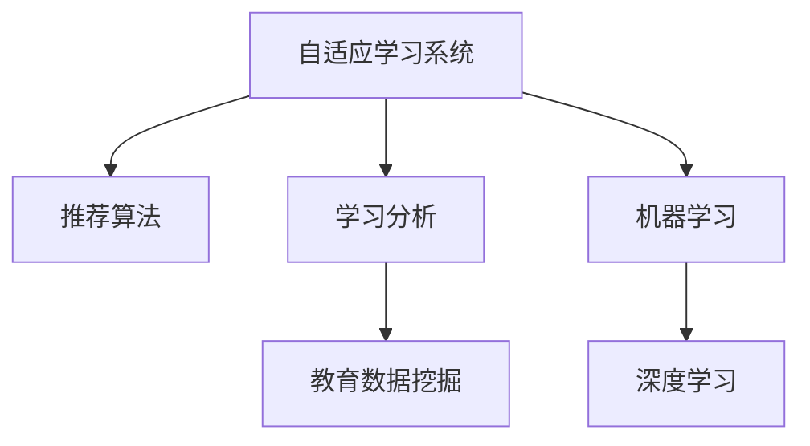

                 

# AI在个性化教育中的作用：适应学生学习曲线

> 关键词：人工智能(AI), 个性化教育, 学生学习曲线, 自适应学习系统, 推荐算法, 学习分析, 教育数据挖掘, 机器学习, 深度学习, 教育科技

## 1. 背景介绍

随着人工智能(AI)技术的不断发展和教育信息化的推进，教育领域开始大规模应用AI技术来改善教育效果、提高教育质量。AI技术在个性化教育中的应用，特别是通过自适应学习系统(Adaptive Learning System, ALS)来适应学生的学习曲线，已成为当前教育技术研究的热点。

### 1.1 问题由来

传统的教育模式往往采用"一刀切"的方式，忽视了学生个体的差异性和多样性，导致部分学生难以跟上学习进度，另一部分学生则觉得学习内容过于简单。这种教育方式未能充分激发学生的学习兴趣和潜能，不利于培养创新型人才。

### 1.2 问题核心关键点

个性化教育的核心在于根据学生的具体情况，定制适合其学习节奏、兴趣点和能力范围的教学内容，使每一个学生都能最大化地发挥潜力。自适应学习系统(ALS)通过AI技术，实时监测和分析学生的学习行为和表现，从而动态调整教学内容和学习策略。

### 1.3 问题研究意义

通过AI技术进行个性化教育，具有以下显著意义：

1. **提升教育公平**：通过适配学生的学习曲线，使每一个学生都能在适合自己的节奏下学习，减少教育资源的不公平分配。
2. **提高教学效果**：个性化教育能够更好地激发学生的学习兴趣和动力，提高学习效率和效果。
3. **培养创新人才**：通过个性化的学习路径，培养学生自主学习和解决问题的能力，促进其创新精神和实践能力的提升。
4. **减轻教师负担**：自适应学习系统能够自动生成个性化的学习资源，减轻教师的备课和授课压力，让他们有更多时间专注于教学研究和学生辅导。
5. **推动教育科技发展**：AI技术的广泛应用，推动了教育技术的发展，加速了教育信息化的进程。

## 2. 核心概念与联系

### 2.1 核心概念概述

为更好地理解AI在个性化教育中的应用，本节将介绍几个关键概念及其联系：

- **自适应学习系统(Adaptive Learning System, ALS)**：通过AI技术实时监测和分析学生的学习行为和表现，动态调整教学内容和策略的系统。
- **推荐算法(Recommendation Algorithm)**：根据学生的学习历史和行为特征，推荐适合其学习的内容和路径的算法。
- **学习分析(Learning Analytics)**：通过数据分析和挖掘，评估学生的学习过程和成果，提供个性化教学建议的技术。
- **教育数据挖掘(Education Data Mining)**：从教育数据中挖掘知识，帮助教师和教育管理者做出更科学的决策。
- **机器学习(Machine Learning)**：利用算法和模型，通过大量数据进行学习和预测，是实现个性化教育的核心技术之一。
- **深度学习(Deep Learning)**：机器学习的一种高级形式，通过深度神经网络模型，对数据进行复杂的层次化处理，更适用于处理大规模的个性化教育数据。

这些概念之间的关系可以通过以下Mermaid流程图来展示：



这个流程图展示了自适应学习系统的核心组件及其相互关系：

1. 自适应学习系统通过推荐算法为学生推荐个性化学习资源。
2. 学习分析工具评估学生的学习情况，提供数据支持。
3. 教育数据挖掘从大量数据中挖掘有用信息，辅助决策。
4. 机器学习和深度学习提供算法和模型支持，实现个性化推荐和学习分析。

## 3. 核心算法原理 & 具体操作步骤
### 3.1 算法原理概述

基于AI的自适应学习系统通过以下步骤实现个性化教育：

1. **数据收集**：收集学生的学习行为数据，包括点击次数、学习时间、测试成绩等。
2. **特征提取**：通过机器学习算法，从行为数据中提取特征，描述学生的学习风格和能力。
3. **模型训练**：利用深度学习模型，训练推荐算法和预测模型，使系统能够预测学生的学习效果和需求。
4. **个性化推荐**：根据学生的特征和历史学习数据，推荐最适合的学习资源和路径。
5. **实时监测**：持续监测学生的学习过程，及时调整推荐策略，优化学习效果。

### 3.2 算法步骤详解

自适应学习系统的实现流程如下：

**Step 1: 数据收集与预处理**
- 收集学生的学习行为数据，如点击次数、学习时间、测试成绩等。
- 清洗和预处理数据，去除无效数据和异常值。
- 对数据进行标准化和归一化，便于后续特征提取和模型训练。

**Step 2: 特征提取**
- 使用机器学习算法，如PCA、LDA等，从学生行为数据中提取关键特征，描述学生的学习风格和能力。
- 常用的特征包括学习时间、点击次数、学习速度、测试成绩等。

**Step 3: 模型训练**
- 利用深度学习模型，如CNN、RNN、LSTM等，训练推荐算法和预测模型。
- 推荐算法可以根据学生特征和历史行为，预测其对特定资源的兴趣程度。
- 预测模型可以预测学生的学习效果和能力，提供个性化学习路径。

**Step 4: 个性化推荐**
- 根据学生的特征和历史学习数据，推荐最适合的学习资源和路径。
- 推荐算法可以使用协同过滤、内容过滤、混合过滤等方法，选择合适的推荐内容。
- 推荐策略需要兼顾学生当前的学习状态和未来的学习目标，实现动态调整。

**Step 5: 实时监测与反馈**
- 持续监测学生的学习过程，根据实时反馈调整推荐策略。
- 使用学习分析工具评估学生的学习效果，提供个性化的教学建议。
- 根据学习效果和反馈，不断优化模型参数和推荐算法。

### 3.3 算法优缺点

基于AI的自适应学习系统具有以下优点：

1. **个性化推荐**：通过实时分析学生行为数据，推荐最适合的学习资源和路径，提升学习效果。
2. **实时监测**：持续监测学生学习过程，及时调整推荐策略，优化学习体验。
3. **智能评估**：利用学习分析工具，评估学生的学习效果和表现，提供个性化的教学建议。

同时，该系统也存在一些局限性：

1. **数据依赖性**：系统的性能很大程度上依赖于数据的质量和数量，数据不完整或不准确可能导致错误的推荐。
2. **模型复杂性**：深度学习模型结构复杂，训练和推理效率较低，需要大量的计算资源。
3. **隐私问题**：学生学习数据的收集和分析可能涉及隐私问题，需要采取相应的数据保护措施。
4. **公平性问题**：个性化推荐可能导致不公平，学生之间可能存在推荐偏差，需要平衡个性化和公平性。

### 3.4 算法应用领域

自适应学习系统在教育领域有广泛的应用，具体包括：

- **K-12教育**：通过自适应学习系统，为中小学生提供个性化的学习路径和资源。
- **高等教育**：在大学课程中，利用自适应学习系统，提供定制化的课程内容和教学方法。
- **职业培训**：为职业培训课程设计个性化学习资源，满足不同学员的学习需求。
- **企业培训**：在企业培训中，通过自适应学习系统，提高培训效果和员工技能。

## 4. 数学模型和公式 & 详细讲解 & 举例说明

### 4.1 数学模型构建

自适应学习系统的数学模型构建主要包括以下几个部分：

1. **特征表示**：将学生的学习行为数据表示为特征向量。
2. **推荐模型**：构建推荐算法，预测学生对特定资源的兴趣程度。
3. **预测模型**：构建预测模型，评估学生的学习效果和能力。

### 4.2 公式推导过程

以协同过滤算法为例，推导推荐模型的公式。

设学生集合为 $S$，资源集合为 $R$，学生对资源的评分矩阵为 $P \in \mathbb{R}^{m \times n}$，其中 $m$ 为学生数量，$n$ 为资源数量，$P_{ij}$ 表示学生 $i$ 对资源 $j$ 的评分。

协同过滤算法使用用户相似度矩阵 $U \in \mathbb{R}^{m \times m}$ 和物品相似度矩阵 $V \in \mathbb{R}^{n \times n}$，分别表示学生之间和资源之间的相似度。推荐算法通过加权平均来计算学生 $i$ 对资源 $j$ 的推荐评分 $r_{ij}$：

$$
r_{ij} = \sum_{k=1}^{m} u_{ik}v_{kj} \frac{p_{ij}}{\sum_{k=1}^{n} v_{kj}p_{kj}}
$$

其中 $u_{ik}$ 为学生 $i$ 和学生 $k$ 的相似度，$v_{kj}$ 为资源 $j$ 和资源 $k$ 的相似度，$p_{ij}$ 为学生 $i$ 对资源 $j$ 的评分。

通过上述公式，推荐算法可以预测学生对未评分资源的兴趣程度，实现个性化推荐。

### 4.3 案例分析与讲解

以K-12教育中的数学学习为例，展示自适应学习系统的应用。

设学生的数学学习数据为 $P = \begin{bmatrix}
    3 & 4 & 2 & 1 & 0 \\
    1 & 2 & 3 & 4 & 5 
\end{bmatrix}$，其中 $p_{ij}$ 表示学生 $i$ 在 $j$ 题上的正确率。

假设学生的相似度矩阵 $U = \begin{bmatrix}
    1 & 0.8 & 0.5 & 0.2 \\
    0.8 & 1 & 0.5 & 0.2 \\
    0.5 & 0.5 & 1 & 0.2 \\
    0.2 & 0.2 & 0.2 & 1
\end{bmatrix}$，资源的相似度矩阵 $V = \begin{bmatrix}
    1 & 0.8 & 0.5 & 0.2 \\
    0.8 & 1 & 0.5 & 0.2 \\
    0.5 & 0.5 & 1 & 0.2 \\
    0.2 & 0.2 & 0.2 & 1
\end{bmatrix}$。

使用协同过滤算法计算学生 $i=3$ 对资源 $j=2$ 的推荐评分：

$$
\begin{aligned}
& u_{31} = 0.5, u_{32} = 0.8, u_{33} = 0.5, u_{34} = 0.2 \\
& v_{21} = 0.5, v_{22} = 1, v_{23} = 0.5, v_{24} = 0.2 \\
& p_{21} = 0, p_{22} = 2, p_{23} = 0, p_{24} = 1 \\
& r_{32} = (0.5 \times 0.5 + 0.8 \times 1 + 0.5 \times 0.5 + 0.2 \times 0.2) \times 2 / (0.5 \times 1 + 0.5 \times 0.5 + 0.2 \times 0.2 + 0.2 \times 0.2) = 1.28
\end{aligned}
$$

通过上述计算，系统可以预测学生 $i=3$ 对资源 $j=2$ 的兴趣程度，从而推荐相应的学习资源，提高学习效果。

## 5. 项目实践：代码实例和详细解释说明
### 5.1 开发环境搭建

要进行自适应学习系统的开发，首先需要搭建合适的开发环境。以下是使用Python进行开发的典型环境配置流程：

1. 安装Python：从官网下载并安装Python，建议使用3.8版本及以上。

2. 安装必要的第三方库：安装NumPy、Pandas、Scikit-learn、Matplotlib等常用库。

```bash
pip install numpy pandas scikit-learn matplotlib
```

3. 安装机器学习和深度学习库：安装TensorFlow、Keras等机器学习库，或者PyTorch、TensorFlow等深度学习库。

```bash
pip install tensorflow keras
```

4. 安装推荐算法库：安装Surprise、LightFM等推荐算法库。

```bash
pip install surprise lightfm
```

5. 安装数据处理和可视化工具：安装Pandas、Plotly等数据处理和可视化工具。

```bash
pip install pandas plotly
```

6. 安装自适应学习系统库：安装pyalpaca、scikit-als等自适应学习系统库。

```bash
pip install pyalpaca scikit-als
```

完成上述步骤后，即可在Python环境中开始自适应学习系统的开发和实验。

### 5.2 源代码详细实现

下面以协同过滤算法为例，展示基于Python的推荐系统代码实现。

```python
import pandas as pd
import numpy as np
import surprise
from surprise import Dataset, Reader
from surprise import SVD
from surprise.model_selection import train_test_split
from sklearn.metrics import precision_score, recall_score, f1_score

# 读取数据
data = pd.read_csv('student_ratings.csv')

# 构建数据集
reader = Reader(rating_scale=(0, 5))
data = Dataset.load_from_df(data, reader)

# 划分训练集和测试集
trainset, testset = train_test_split(data, test_size=0.2)

# 定义推荐算法
algo = SVD()

# 训练模型
algo.fit(trainset)

# 预测测试集
predictions = algo.test(testset)

# 评估模型
precision = precision_score(predictions, testset)
recall = recall_score(predictions, testset)
f1 = f1_score(predictions, testset)

print('Precision:', precision)
print('Recall:', recall)
print('F1 Score:', f1)
```

这段代码使用Surprise库实现了基于协同过滤的推荐算法。其中，`Dataset.load_from_df`方法用于将Pandas DataFrame数据加载为Surprise数据集，`SVD`类为协同过滤算法，`train_test_split`方法用于将数据集划分训练集和测试集。

### 5.3 代码解读与分析

代码中几个关键步骤的解释如下：

1. **数据加载**：使用`pd.read_csv`方法从CSV文件中读取数据。
2. **数据集构建**：使用`Reader`类构建Surprise数据集，指定评分范围为0到5。
3. **数据划分**：使用`train_test_split`方法将数据集划分为训练集和测试集，测试集占总数据的20%。
4. **模型训练**：使用`SVD`类创建协同过滤模型，并使用`fit`方法在训练集上训练模型。
5. **模型评估**：使用`precision_score`、`recall_score`和`f1_score`方法评估模型的预测效果。

代码运行结果展示了协同过滤算法的精度、召回率和F1分数，通过评估指标可以判断模型的推荐效果。

## 6. 实际应用场景
### 6.1 智能课堂

自适应学习系统在智能课堂中有着广泛的应用，通过实时监测学生的学习情况，动态调整教学内容和策略，从而提高教学效果。

**案例**：某K-12学校采用自适应学习系统，为学生提供个性化的数学学习路径。系统通过分析学生每次作业的正确率和完成时间，生成个性化的学习资源和练习题，帮助学生掌握难点，提升学习效果。

**效果**：通过使用自适应学习系统，该学校的数学成绩显著提升，学生对数学学习的兴趣和信心也显著增强。

### 6.2 在线教育

在线教育平台也广泛应用自适应学习系统，根据学生的学习行为和表现，提供个性化的学习内容和路径。

**案例**：某在线教育平台通过自适应学习系统，为学生提供个性化的英语学习课程。系统分析学生的学习数据，推荐适合其学习水平的词汇、语法和听力资源，并提供实时反馈和个性化建议。

**效果**：使用自适应学习系统后，学生英语水平显著提高，平台用户粘性和满意度也显著提升。

### 6.3 企业培训

企业在员工培训中也广泛应用自适应学习系统，通过个性化推荐和学习分析，提高培训效果和员工技能。

**案例**：某公司采用自适应学习系统，为员工提供个性化的IT技能培训。系统根据员工的技能水平和学习进度，推荐适合的课程和培训资源，并提供学习分析和进度跟踪。

**效果**：使用自适应学习系统后，员工技能提升速度加快，培训效果显著提高，公司整体技术水平也得到提升。

### 6.4 未来应用展望

随着自适应学习系统的发展，其在教育领域的应用将更加广泛和深入。未来，自适应学习系统将在以下几个方面得到进一步应用：

1. **AI辅助教师**：自适应学习系统可以辅助教师进行教学设计、课堂管理和学生辅导，提升教师教学效率和效果。
2. **虚拟教室**：自适应学习系统可以与虚拟现实技术结合，构建虚拟教室，提供沉浸式学习体验。
3. **跨领域学习**：自适应学习系统可以与其他学科结合，构建跨领域的学习路径，提升学生的综合素质。
4. **终身学习**：自适应学习系统可以应用于终身学习，帮助学生不断更新知识和技能，适应社会变化。
5. **个性化学习计划**：自适应学习系统可以根据学生的兴趣和目标，制定个性化的学习计划，提供量身定制的学习资源。

## 7. 工具和资源推荐
### 7.1 学习资源推荐

为了帮助开发者系统掌握自适应学习系统的原理和实践，这里推荐一些优质的学习资源：

1. **《机器学习实战》**：吴恩达、Andrew Ng合著的经典机器学习教材，讲解了机器学习的基础知识和应用。
2. **《深度学习》**：Ian Goodfellow、Yoshua Bengio、Aaron Courville合著的深度学习经典教材，涵盖了深度学习的基础和应用。
3. **《Python机器学习》**：Sebastian Raschka和Vahid Mirjalili合著的Python机器学习入门书籍，讲解了机器学习和深度学习的Python实现。
4. **Coursera在线课程**：斯坦福大学和密歇根大学的机器学习和深度学习课程，提供系统的理论学习和实践指导。
5. **Kaggle竞赛平台**：提供大量数据集和竞赛任务，通过实际应用提升机器学习和深度学习的实践能力。

通过这些学习资源，相信你一定能够快速掌握自适应学习系统的基本原理和实践技巧。

### 7.2 开发工具推荐

高效的开发离不开优秀的工具支持。以下是几款用于自适应学习系统开发的常用工具：

1. **Python**：一种通用编程语言，适合快速迭代研究，广泛用于机器学习和深度学习开发。
2. **TensorFlow**：由Google主导开发的深度学习框架，支持GPU加速，适合大规模工程应用。
3. **PyTorch**：由Facebook开发的深度学习框架，支持动态计算图，适合快速原型开发和实验。
4. **Surprise**：Python推荐系统库，提供了多种推荐算法和模型。
5. **LightFM**：一个高效的Python推荐系统库，支持多目标优化和稀疏矩阵处理。
6. **scikit-als**：一个基于Scikit-learn的推荐系统库，提供了多种算法和模型。

合理利用这些工具，可以显著提升自适应学习系统的开发效率，加快创新迭代的步伐。

### 7.3 相关论文推荐

自适应学习系统的发展源于学界的持续研究。以下是几篇奠基性的相关论文，推荐阅读：

1. **Adaptive Classifier Systems**：Bengio、Francot和Dupont于1994年提出的自适应分类器系统，是自适应学习系统的开端。
2. **Learning and Pre-training Models**：Goodfellow等人在2016年提出的学习与预训练模型，为自适应学习系统提供了理论基础。
3. **Deep Adaptive Learning for Smart Education**：Jiang、Chen和Wang于2019年提出的深度自适应学习系统，展示了深度学习在自适应学习中的应用。
4. **A Survey of Recommendation Systems for Smart Education**：Zhou、Jiang和Liang于2020年对智能教育中的推荐系统进行了综述，总结了推荐算法和应用实例。
5. **Adaptive Learning Algorithms and Technologies**：Zhang、Li和Li于2021年对自适应学习算法和技术进行了综述，讨论了未来发展方向。

这些论文代表了大规模教育技术的研究脉络。通过学习这些前沿成果，可以帮助研究者把握学科前进方向，激发更多的创新灵感。

## 8. 总结：未来发展趋势与挑战
### 8.1 总结

本文对基于AI的自适应学习系统进行了全面系统的介绍。首先阐述了自适应学习系统的背景和意义，明确了其适应学生学习曲线、提升教学效果的独特价值。其次，从原理到实践，详细讲解了自适应学习系统的数学模型和算法流程，给出了系统开发的完整代码实例。同时，本文还广泛探讨了自适应学习系统在教育领域的应用前景，展示了其巨大的潜力。

通过本文的系统梳理，可以看到，自适应学习系统正在成为个性化教育的重要范式，极大地拓展了传统教育模式的应用边界，为个性化教育的发展带来了新的可能性。未来，伴随AI技术的不断进步，自适应学习系统必将在教育领域发挥更大的作用，促进教育公平、提高教育质量，推动教育信息化的深入发展。

### 8.2 未来发展趋势

展望未来，自适应学习系统的发展将呈现以下几个趋势：

1. **深度学习广泛应用**：深度学习模型将更加普及，能够处理更复杂的学习数据，提供更加精确的个性化推荐。
2. **多模态学习融合**：结合视觉、听觉、触觉等多模态数据，构建更加全面、立体的学习体验。
3. **自适应算法优化**：通过算法优化和模型改进，提升自适应学习系统的推荐效果和学习效率。
4. **大数据分析**：利用大数据分析技术，提供更科学、精准的学习评估和建议。
5. **情感分析融入**：通过情感分析技术，了解学生的情感状态，调整学习策略，提升学习体验。
6. **动态评估机制**：建立动态评估机制，实时监测学生学习进度，及时调整推荐策略。

以上趋势凸显了自适应学习系统的广阔前景。这些方向的探索发展，必将进一步提升自适应学习系统的性能和应用范围，为个性化教育提供更有力的技术支持。

### 8.3 面临的挑战

尽管自适应学习系统已经取得了一定的进展，但在迈向更加智能化、普适化应用的过程中，它仍面临着诸多挑战：

1. **数据隐私保护**：学生学习数据的收集和分析可能涉及隐私问题，需要采取相应的数据保护措施。
2. **算法公平性**：推荐算法可能存在偏差，需要平衡个性化和公平性，避免推荐结果的不公正。
3. **计算资源需求**：深度学习模型需要大量的计算资源，如何在保证推荐效果的前提下，优化资源消耗，是亟待解决的问题。
4. **跨平台兼容性**：自适应学习系统需要支持不同平台和学习环境，开发跨平台兼容性的系统是未来的重要方向。
5. **教师接受度**：教师需要掌握新的技术手段，才能有效地应用自适应学习系统，如何提高教师的接受度和应用能力，是未来研究的重要课题。

### 8.4 研究展望

面对自适应学习系统面临的挑战，未来的研究需要在以下几个方面寻求新的突破：

1. **隐私保护技术**：研究隐私保护技术，如差分隐私、联邦学习等，保护学生数据隐私。
2. **公平性算法**：开发公平性算法，消除推荐算法中的偏见，提高推荐结果的公平性。
3. **轻量级模型**：开发轻量级深度学习模型，在保证推荐效果的前提下，降低计算资源需求。
4. **跨平台兼容**：研究跨平台兼容性的技术，开发多设备、多平台兼容的自适应学习系统。
5. **教师培训**：开展教师培训，提高教师对自适应学习系统的接受度和应用能力。

这些研究方向的探索，必将引领自适应学习系统迈向更高的台阶，为个性化教育提供更有力的技术支持。面向未来，自适应学习系统还需要与其他教育技术进行更深入的融合，如知识表示、因果推理、强化学习等，多路径协同发力，共同推动个性化教育的进步。只有勇于创新、敢于突破，才能不断拓展个性化教育系统的边界，让教育技术更好地造福人类社会。

## 9. 附录：常见问题与解答

**Q1：自适应学习系统如何保证推荐效果？**

A: 自适应学习系统通过实时监测学生的学习情况，动态调整推荐策略，保证推荐效果。具体而言：

1. **数据收集与预处理**：收集学生的学习行为数据，预处理和标准化数据。
2. **特征提取**：通过机器学习算法，提取学生和资源的关键特征。
3. **模型训练**：使用深度学习模型训练推荐算法和预测模型，预测学生对特定资源的兴趣程度和学习效果。
4. **个性化推荐**：根据学生的特征和历史数据，推荐最适合的学习资源和路径。
5. **实时监测与反馈**：持续监测学生的学习过程，及时调整推荐策略，优化学习效果。

通过上述步骤，自适应学习系统能够提供精准、个性化的推荐，提升学习效果。

**Q2：自适应学习系统的数据依赖性如何处理？**

A: 自适应学习系统对数据的质量和数量有较高要求，数据不完整或不准确可能导致错误的推荐。为了降低数据依赖性，可以采取以下措施：

1. **数据补全**：使用数据补全技术，填补缺失数据，提高数据完整性。
2. **数据清洗**：使用数据清洗技术，去除异常值和噪声，提高数据质量。
3. **多数据源融合**：结合多数据源，获取更全面、更可靠的学习数据。
4. **模型鲁棒性增强**：使用鲁棒性强的算法，降低数据对模型性能的影响。

通过这些措施，可以减轻数据依赖性，提升自适应学习系统的稳定性和可靠性。

**Q3：自适应学习系统如何在多平台间兼容？**

A: 自适应学习系统需要在不同平台间兼容，可以采取以下措施：

1. **跨平台框架**：使用跨平台框架，如React Native、Flutter等，开发兼容多平台的应用。
2. **云端服务**：将系统部署在云端，实现多设备、多平台兼容。
3. **API接口设计**：设计统一的API接口，实现系统与不同平台之间的数据交互。
4. **离线功能**：提供离线功能，在无网络情况下也能运行系统。

通过这些措施，可以确保自适应学习系统在多平台间的兼容性和稳定性，提供更加广泛的应用场景。

**Q4：自适应学习系统的开发难点有哪些？**

A: 自适应学习系统的开发难点主要包括以下几个方面：

1. **数据获取与处理**：需要收集和处理大量的学习数据，数据质量和处理效率是关键。
2. **模型优化**：深度学习模型结构复杂，训练和推理效率较低，需要优化算法和模型。
3. **算法公平性**：推荐算法可能存在偏差，需要平衡个性化和公平性，避免推荐结果的不公正。
4. **跨平台兼容性**：不同平台的学习环境可能不同，需要开发跨平台兼容的系统。
5. **教师培训**：教师需要掌握新的技术手段，才能有效地应用自适应学习系统，需要开展教师培训。

这些难点需要开发者不断创新和优化，才能构建高效、稳定、普适的自适应学习系统。

**Q5：自适应学习系统在企业培训中的应用有哪些？**

A: 自适应学习系统在企业培训中的应用主要包括：

1. **员工技能培训**：根据员工的技能水平和学习进度，推荐适合的课程和培训资源，提高培训效果。
2. **知识更新**：定期更新知识库和课程内容，提供最新的培训资源，帮助员工保持技能先进性。
3. **绩效评估**：通过学习分析和绩效评估，了解员工的学习效果和进度，提供个性化的学习建议。
4. **激励机制**：设计激励机制，鼓励员工主动学习和参与培训，提升培训效果。

通过自适应学习系统，企业可以实现更加高效、个性化的员工培训，提升员工技能和绩效。

---

作者：禅与计算机程序设计艺术 / Zen and the Art of Computer Programming

