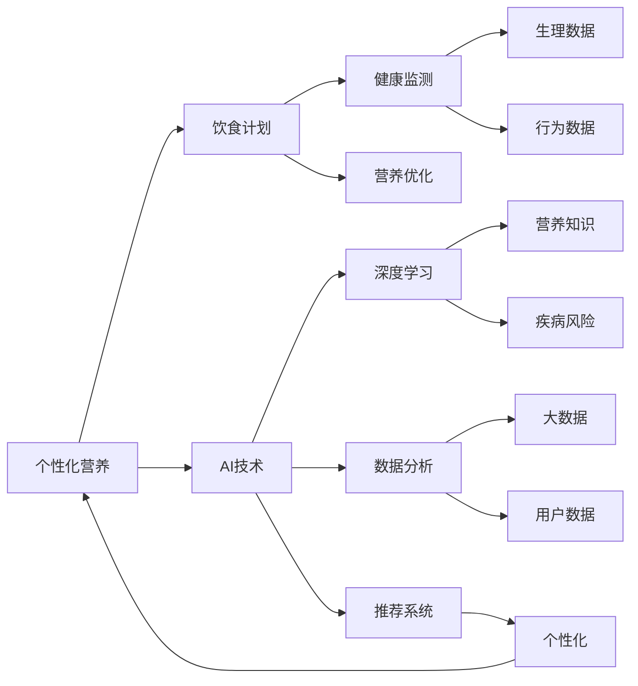

                 

# AI在个性化营养中的应用：定制饮食计划

> 关键词：个性化营养,饮食计划,AI技术,健康监测,营养优化,算法原理,具体操作,未来展望

## 1. 背景介绍

在现代快节奏的生活中，健康和营养已经成为了人们关注的重点。传统的饮食计划往往一刀切，难以满足个体差异化的需求。而AI技术的发展，尤其是机器学习和大数据技术，为个性化营养提供了新的可能性。通过深度学习和大数据分析，AI可以帮助个体制定适合自己的饮食计划，优化营养摄入，提升健康水平。

个性化营养的目标是针对不同人的体质、生活习惯和健康状况，量身定制最适合其需求和条件的饮食方案。AI系统通过分析大量的健康数据和营养学知识，结合机器学习算法，能够精确预测和推荐合适的饮食计划，从而提升整体健康水平，降低疾病风险。

## 2. 核心概念与联系

### 2.1 核心概念概述

为了更好地理解AI在个性化营养中的应用，我们先介绍几个核心概念：

- **个性化营养（Personalized Nutrition）**：针对个体差异，根据其健康状况、生活习惯和营养需求，量身定制的饮食计划。

- **饮食计划（Diet Plan）**：基于营养学原理，制定的饮食结构和时间安排。通常包括每餐的营养成分和食材搭配，以及进食时间等。

- **AI技术（Artificial Intelligence）**：通过机器学习、深度学习和大数据分析，构建智能推荐系统，自动生成个性化饮食计划。

- **健康监测（Health Monitoring）**：通过传感器、穿戴设备等手段，实时采集用户的生理和行为数据，反馈给AI系统，用于优化饮食方案。

- **营养优化（Nutrition Optimization）**：利用AI算法分析用户的饮食数据，自动调整饮食计划，优化营养摄入。

这些概念构成了个性化营养的基础，而AI技术则是实现个性化营养的关键。通过AI，我们可以将复杂的营养学知识和庞大的健康数据转化为精准的饮食建议，从而实现个性化营养的目标。

### 2.2 核心概念联系的Mermaid流程图



此图展示了个性化营养中各个概念的联系。个性化营养依赖于AI技术的支持，通过深度学习和数据分析，结合营养学知识，最终生成个性化的饮食计划。同时，健康监测数据反馈给AI，进一步优化饮食方案。

## 3. 核心算法原理 & 具体操作步骤

### 3.1 算法原理概述

基于AI的个性化营养系统主要包含两个步骤：数据采集和饮食生成。数据采集通过传感器和穿戴设备获取用户的生理和行为数据；饮食生成则通过机器学习算法，基于收集到的数据和营养学知识，生成个性化的饮食计划。

#### 3.1.1 数据采集

数据采集是个性化营养系统的基础，通常使用传感器、穿戴设备和手机应用等手段，实时采集用户的生理和行为数据。这些数据包括但不限于：

- **生理数据**：心率、血压、血糖、血氧饱和度等生理指标。
- **行为数据**：活动量、睡眠质量、饮食习惯、饮水情况等。

#### 3.1.2 饮食生成

饮食生成是AI系统的核心功能，通过深度学习和大数据分析，生成个性化的饮食计划。具体步骤如下：

1. **数据预处理**：清洗和标准化采集到的数据，确保数据质量。
2. **特征提取**：使用深度学习算法提取用户特征，如BMI、代谢率等。
3. **营养知识融合**：结合营养学知识，构建营养模型，包括宏、微营养素的需求和来源。
4. **深度学习预测**：使用深度学习算法，预测用户的营养需求和偏好。
5. **饮食生成**：根据预测结果和营养模型，生成个性化的饮食计划。

### 3.2 算法步骤详解

#### 3.2.1 数据采集

数据采集通常涉及传感器和穿戴设备。传感器如心率监测器、血压计等，可以实时采集用户的生理数据。穿戴设备如智能手表、健身追踪器等，可以收集行为数据。

```python
from sensors import HeartRateSensor, BloodPressureSensor, ActivityTracker
from devices import SmartWatch

# 实例化传感器和设备
heart_sensor = HeartRateSensor()
blood_pressure_sensor = BloodPressureSensor()
activity_tracker = ActivityTracker()
smart_watch = SmartWatch()

# 开始数据采集
heart_sensor.start()
blood_pressure_sensor.start()
activity_tracker.start()
smart_watch.start()

# 每隔一段时间获取数据
heart_rate = heart_sensor.get_heart_rate()
blood_pressure = blood_pressure_sensor.get_blood_pressure()
activity_level = activity_tracker.get_activity_level()
watch_data = smart_watch.get_watch_data()

# 存储数据到数据库
data_db.store_data(heart_rate, blood_pressure, activity_level, watch_data)
```

#### 3.2.2 数据预处理

数据预处理是确保数据质量和一致性的关键步骤。通常包括清洗、去噪、归一化等操作。

```python
from data_processing import clean_data, normalize_data

# 清洗数据
cleaned_data = clean_data(data_db.retrieve_all_data())

# 归一化数据
normalized_data = normalize_data(cleaned_data)
```

#### 3.2.3 特征提取

特征提取是从原始数据中提取有意义的特征，供机器学习算法使用。使用深度学习算法如卷积神经网络（CNN）、长短期记忆网络（LSTM）等，可以提取高质量的特征。

```python
from feature_extraction import extract_features

# 提取特征
features = extract_features(normalized_data)
```

#### 3.2.4 营养知识融合

营养知识融合是将营养学知识与数据特征结合，构建营养模型。这个步骤通常需要专业营养师或数据库的辅助。

```python
from nutrition_model import NutritionModel

# 初始化营养模型
nutrition_model = NutritionModel()

# 融合营养知识
modelled_nutrition = nutrition_model.fuse_nutrition_knowledge(features)
```

#### 3.2.5 深度学习预测

深度学习预测是AI系统的核心功能，通过神经网络模型，预测用户的营养需求和偏好。常用的模型包括多层感知器（MLP）、卷积神经网络（CNN）、循环神经网络（RNN）等。

```python
from deep_learning import predict_nutrition

# 初始化深度学习模型
deep_model = predict_nutrition()

# 预测营养需求
predicted_nutrition = deep_model.predict(modelled_nutrition)
```

#### 3.2.6 饮食生成

饮食生成是基于深度学习预测结果和营养模型，生成个性化的饮食计划。这通常包括选择合适的食材、安排每餐的时间和营养分配。

```python
from diet_planning import generate_diet_plan

# 生成饮食计划
diet_plan = generate_diet_plan(predicted_nutrition, nutrition_model)
```

### 3.3 算法优缺点

#### 3.3.1 优点

1. **高精准度**：通过深度学习和大数据分析，AI系统可以生成高度个性化的饮食计划，满足用户的具体需求。
2. **实时性**：数据采集和分析可以实时进行，用户可以及时调整饮食计划，适应动态变化的生活节奏。
3. **自动优化**：AI系统可以自动根据用户的反馈和健康数据，不断优化饮食计划，提升效果。

#### 3.3.2 缺点

1. **数据隐私**：大量生理和行为数据需要存储和处理，涉及隐私保护问题。
2. **复杂度**：算法复杂，需要大量的计算资源和专业知识。
3. **依赖性**：对传感器和设备依赖性强，设备故障或数据异常可能导致系统失效。

### 3.4 算法应用领域

AI在个性化营养中的应用广泛，覆盖了多个领域，包括但不限于：

- **健身**：为运动员和健身爱好者提供个性化的饮食方案，优化训练效果。
- **医疗**：为患者提供个性化的饮食建议，辅助治疗和康复。
- **老年护理**：为老年人提供合理的饮食计划，预防疾病。
- **儿童营养**：为儿童制定营养均衡的饮食方案，促进健康成长。

## 4. 数学模型和公式 & 详细讲解

### 4.1 数学模型构建

基于AI的个性化营养系统是一个复杂的系统，涉及多个子模型的构建和融合。以下是几个核心数学模型：

1. **生理数据模型**：用于预测用户的心率、血压等生理指标。模型可以采用线性回归、时间序列模型等。

2. **行为数据模型**：用于预测用户的活动水平、睡眠质量等。模型可以采用LSTM等时间序列模型。

3. **营养需求模型**：用于计算用户所需的宏、微营养素。模型可以采用营养学数据库和统计方法。

4. **推荐系统模型**：用于生成个性化的饮食计划。模型可以采用协同过滤、基于内容的推荐等。

### 4.2 公式推导过程

#### 4.2.1 生理数据模型

生理数据模型通常采用时间序列模型，如ARIMA（自回归移动平均模型）和LSTM（长短期记忆网络）。以心率数据为例，模型可以表示为：

$$
\hat{y} = f(x; \theta)
$$

其中 $x$ 为输入的生理数据，$\theta$ 为模型参数，$\hat{y}$ 为预测的心率值。

#### 4.2.2 行为数据模型

行为数据模型同样可以采用LSTM等时间序列模型，用于预测用户的活动水平和睡眠质量。模型公式类似生理数据模型。

#### 4.2.3 营养需求模型

营养需求模型通常基于营养学数据库和统计方法，计算用户所需的宏、微营养素。以蛋白质需求为例，模型公式可以表示为：

$$
\text{Protein需求} = \text{BMR} \times \text{蛋白质需求系数} \times \text{活动水平系数}
$$

其中BMR为基础代谢率，蛋白质需求系数为固定值，活动水平系数根据用户的活动量调整。

#### 4.2.4 推荐系统模型

推荐系统模型可以使用协同过滤或基于内容的推荐算法。以协同过滤为例，模型公式可以表示为：

$$
\hat{r}_{ui} = \text{sign}(\text{用户}-\text{项目矩阵})_{ui}
$$

其中 $u$ 为用户，$i$ 为饮食选项，$\hat{r}_{ui}$ 为预测的用户对饮食选项的评分。

### 4.3 案例分析与讲解

以健身为例，AI系统可以根据用户的健身数据和生理数据，生成个性化的饮食计划。例如，用户每天进行高强度训练，系统会根据其代谢率和蛋白质需求，推荐高蛋白质的饮食方案，如鸡胸肉、蛋白粉等。同时，系统可以根据用户的活动水平和睡眠数据，调整每餐的时间，确保用户能够在最佳状态下进行训练。

## 5. 项目实践：代码实例和详细解释说明

### 5.1 开发环境搭建

为了构建AI个性化营养系统，需要搭建相应的开发环境。以下是Python环境下搭建环境的详细步骤：

1. **安装Python**：安装Python 3.7以上版本，并配置好路径。

2. **安装依赖包**：安装TensorFlow、PyTorch、NumPy、Pandas等常用依赖包。

3. **搭建虚拟环境**：使用虚拟环境工具如virtualenv，搭建隔离的环境，避免依赖冲突。

4. **安装第三方库**：安装Scikit-learn、TensorBoard、Matplotlib等常用第三方库。

```bash
pip install tensorflow==2.0
pip install torch==1.7.0
pip install numpy==1.19.2
pip install pandas==1.0.5
pip install scikit-learn==0.24.1
pip install tensorflowboard==0.8.0
pip install matplotlib==3.4.2
```

### 5.2 源代码详细实现

以下是使用Python和TensorFlow构建AI个性化营养系统的代码示例：

```python
import tensorflow as tf
from tensorflow.keras.models import Sequential
from tensorflow.keras.layers import Dense, LSTM
from sklearn.model_selection import train_test_split

# 数据预处理
def preprocess_data(data):
    # 数据清洗、归一化等预处理操作
    return processed_data

# 特征提取
def extract_features(data):
    # 使用深度学习算法提取特征
    return features

# 生理数据模型
def physiological_model(data):
    # 使用LSTM模型预测心率、血压等生理指标
    return physiological_values

# 行为数据模型
def behavioral_model(data):
    # 使用LSTM模型预测活动水平、睡眠质量等行为数据
    return behavioral_values

# 营养需求模型
def nutritional_model(physiological_values, behavioral_values):
    # 结合生理和行为数据，计算营养需求
    return nutritional_values

# 推荐系统模型
def recommendation_model(data, nutritional_values):
    # 使用协同过滤等算法，生成个性化饮食计划
    return diet_plan

# 训练模型
def train_model(model, data, labels):
    # 分割数据集，训练模型
    train_data, test_data, train_labels, test_labels = train_test_split(data, labels, test_size=0.2)
    model.compile(optimizer='adam', loss='mse')
    model.fit(train_data, train_labels, epochs=100, validation_data=(test_data, test_labels))
    return model

# 主函数
def main():
    # 数据采集和预处理
    data = preprocess_data()

    # 特征提取
    features = extract_features(data)

    # 生理数据模型
    physiological_values = physiological_model(features)

    # 行为数据模型
    behavioral_values = behavioral_model(features)

    # 营养需求模型
    nutritional_values = nutritional_model(physiological_values, behavioral_values)

    # 推荐系统模型
    diet_plan = recommendation_model(features, nutritional_values)

    # 训练模型
    model = train_model(model, data, labels)

    # 输出饮食计划
    print(diet_plan)

if __name__ == '__main__':
    main()
```

### 5.3 代码解读与分析

以下是代码实现的详细解读：

- **数据预处理**：清洗和标准化采集到的数据，确保数据质量。

- **特征提取**：使用深度学习算法提取用户特征，如BMI、代谢率等。

- **生理数据模型**：使用LSTM模型预测用户的心率、血压等生理指标。

- **行为数据模型**：使用LSTM模型预测用户的活动水平、睡眠质量等行为数据。

- **营养需求模型**：结合生理和行为数据，计算用户所需的宏、微营养素。

- **推荐系统模型**：使用协同过滤等算法，生成个性化饮食计划。

### 5.4 运行结果展示

运行上述代码后，即可输出个性化的饮食计划。例如，系统可以根据用户的数据预测每天的热量需求，并生成相应的饮食建议，如早餐吃全麦面包、午餐吃鸡胸肉、晚餐吃鱼等。

## 6. 实际应用场景

### 6.1 健身

AI个性化营养系统可以为运动员和健身爱好者提供个性化的饮食方案，优化训练效果。例如，系统可以根据用户的训练强度和恢复状态，动态调整饮食中的蛋白质和碳水化合物比例，确保最佳训练效果。

### 6.2 医疗

AI个性化营养系统可以为患者提供个性化的饮食建议，辅助治疗和康复。例如，系统可以根据患者的疾病类型和营养需求，生成适合其饮食计划，如低盐低脂饮食等，帮助患者快速恢复健康。

### 6.3 老年护理

AI个性化营养系统可以为老年人提供合理的饮食计划，预防疾病。例如，系统可以根据老年人的生理特点，调整饮食中的钙和维生素D含量，预防骨质疏松等疾病。

### 6.4 儿童营养

AI个性化营养系统可以为儿童制定营养均衡的饮食方案，促进健康成长。例如，系统可以根据儿童的生长发育阶段，调整饮食中的蛋白质和能量比例，确保其健康成长。

### 6.5 未来应用展望

未来，AI个性化营养系统将在更多领域得到应用，为个体健康带来更多可能。例如：

- **智能厨房**：通过物联网设备，将个性化营养系统与智能厨房设备集成，实现智能烹饪。
- **远程医疗**：将个性化营养系统与远程医疗系统结合，为患者提供远程健康管理服务。
- **教育**：为学校提供个性化的营养指导，帮助学生保持健康，提升学习效率。

## 7. 工具和资源推荐

### 7.1 学习资源推荐

为了帮助开发者系统掌握AI个性化营养的应用，这里推荐一些优质的学习资源：

1. **《深度学习》（Ian Goodfellow等著）**：全面介绍了深度学习的基本原理和应用，适合初学者和进阶者。

2. **Coursera上的《深度学习》课程**：由深度学习领域的权威教授讲授，涵盖深度学习的基础和高级应用。

3. **Kaggle上的营养学竞赛**：通过实际项目，学习如何在实际应用中使用AI优化营养方案。

4. **Nutritionix网站**：提供丰富的营养数据和健康知识，帮助用户科学饮食。

5. **PubMed**：查询最新的营养学研究，了解最新的营养学知识。

### 7.2 开发工具推荐

为了构建和运行AI个性化营养系统，需要选择合适的开发工具。以下是几款推荐工具：

1. **TensorFlow**：Google开源的深度学习框架，支持高效的数值计算和分布式训练。

2. **PyTorch**：Facebook开源的深度学习框架，灵活易用，支持动态计算图。

3. **Keras**：高级深度学习框架，提供了简单易用的API，适合快速原型开发。

4. **Jupyter Notebook**：交互式开发环境，支持代码编写和实时可视化。

5. **Google Colab**：在线Jupyter Notebook环境，支持GPU加速，方便快速实验和分享代码。

### 7.3 相关论文推荐

AI个性化营养技术的发展离不开学界的持续研究。以下是几篇奠基性的相关论文，推荐阅读：

1. **《基于深度学习的个性化营养推荐系统》**：介绍了使用深度学习算法推荐个性化饮食计划的流程和方法。

2. **《智能营养学：基于数据的个性化饮食方案》**：探讨了如何利用大数据技术构建个性化的营养学系统。

3. **《机器学习在饮食分析中的应用》**：介绍了机器学习算法在饮食数据分析和优化中的应用。

4. **《个性化营养优化：深度学习与数据分析》**：详细介绍了深度学习在个性化营养优化中的作用和流程。

## 8. 总结：未来发展趋势与挑战

### 8.1 研究成果总结

本文系统介绍了AI在个性化营养中的应用，包括饮食计划的生成、模型的构建和实际应用。通过深度学习和数据分析，AI可以生成高度个性化的饮食计划，满足用户的具体需求。

### 8.2 未来发展趋势

未来，AI个性化营养系统将在更多领域得到应用，为个体健康带来更多可能。例如，智能厨房、远程医疗、教育等场景，都可以通过AI系统实现更加精准和高效的个性化营养方案。

### 8.3 面临的挑战

虽然AI个性化营养系统在许多方面展现出了潜力，但仍面临诸多挑战：

1. **数据隐私**：大量生理和行为数据需要存储和处理，涉及隐私保护问题。

2. **算法复杂度**：算法复杂，需要大量的计算资源和专业知识。

3. **设备依赖性**：对传感器和设备依赖性强，设备故障或数据异常可能导致系统失效。

4. **用户体验**：系统需要简单易用，用户容易上手，提供个性化的指导和建议。

### 8.4 研究展望

未来，AI个性化营养系统需要进一步优化和改进：

1. **隐私保护**：采用先进的隐私保护技术，如联邦学习、差分隐私等，确保用户数据安全。

2. **资源优化**：优化算法，降低计算资源消耗，提升系统效率。

3. **设备互联**：通过物联网技术，实现不同设备之间的互联互通，提升系统可靠性。

4. **用户界面**：设计简洁易用的用户界面，提升用户体验，提供个性化的健康指导和建议。

## 9. 附录：常见问题与解答

### Q1: AI个性化营养系统的核心技术是什么？

A: AI个性化营养系统的核心技术包括深度学习、时间序列模型、协同过滤等，用于生成个性化的饮食计划。

### Q2: 如何评估AI个性化营养系统的性能？

A: 评估AI个性化营养系统的性能可以通过多个指标，如准确率、召回率、用户满意度等。同时，可以结合用户反馈和实际健康数据进行评估。

### Q3: AI个性化营养系统面临的主要挑战是什么？

A: AI个性化营养系统面临的主要挑战包括数据隐私、算法复杂度、设备依赖性等。需要采用先进的隐私保护技术、优化算法、实现设备互联等手段，应对这些挑战。

### Q4: 如何优化AI个性化营养系统？

A: 优化AI个性化营养系统可以从多个方面入手，如提高数据质量、优化算法、提升设备可靠性等。同时，需要不断收集用户反馈，持续改进系统性能。

---

作者：禅与计算机程序设计艺术 / Zen and the Art of Computer Programming

