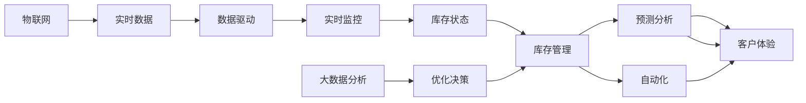

                 

# AI在智能仓储中的应用：优化库存管理

> 关键词：人工智能, 智能仓储, 库存管理, 机器学习, 数据驱动, 预测分析, 自动化

## 1. 背景介绍

### 1.1 问题由来
随着电子商务的迅猛发展，全球物流行业正经历着前所未有的变革。高效率的物流与仓储管理成为各大电商企业的核心竞争要素，而库存管理的效率直接影响了物流成本和客户体验。传统的库存管理模式存在诸多问题，如库存量预测不准确、库存水平过高或过低、手动操作繁琐等。因此，利用人工智能技术优化库存管理，提升供应链的效率和灵活性，已成为企业亟需解决的问题。

### 1.2 问题核心关键点
本节将从以下几个方面探讨AI在智能仓储中的应用：

- **库存管理**：通过数据分析和机器学习算法预测需求，优化库存水平。
- **预测分析**：运用时间序列分析和深度学习算法预测未来需求，减少库存波动。
- **自动化**：引入机器人、AGV等自动化设备，提高仓储作业效率。
- **数据驱动**：利用物联网技术实时监控库存状态，通过大数据分析优化决策。
- **客户体验**：通过AI技术实现精准预测和快速响应，提升客户满意度。

通过本节内容，将帮助读者全面理解AI在智能仓储中的作用及其核心技术。

## 2. 核心概念与联系

### 2.1 核心概念概述

为了更好地理解AI在智能仓储中的应用，首先需理解以下关键概念：

- **库存管理**：库存管理的核心目标是平衡库存水平，确保满足需求的同时降低库存成本。
- **预测分析**：通过历史数据和统计分析，预测未来的需求，指导库存管理决策。
- **自动化**：引入机器人、自动化仓储系统等，提升仓储作业的效率和准确性。
- **数据驱动**：基于物联网技术实时获取库存信息，通过大数据分析优化库存决策。
- **客户体验**：通过AI技术实现快速的库存响应和定制化服务，提升客户满意度。

这些概念之间相互关联，共同构成了AI在智能仓储中的应用框架。

### 2.2 核心概念原理和架构的 Mermaid 流程图



这个流程图展示了AI在智能仓储中各概念之间的相互关系：

- 库存管理通过预测分析和数据驱动来优化库存水平。
- 预测分析利用历史数据和统计方法进行未来需求的预测。
- 自动化引入机器人等设备，提高仓储作业效率。
- 数据驱动基于物联网技术实时监控库存状态，通过大数据分析优化决策。
- 客户体验通过AI技术实现精准预测和快速响应，提升客户满意度。

## 3. 核心算法原理 & 具体操作步骤

### 3.1 算法原理概述

AI在智能仓储中的应用主要依赖于以下几个算法原理：

1. **时间序列分析**：通过历史销售数据和季节性因素，预测未来的库存需求。
2. **深度学习预测**：利用神经网络对复杂数据进行建模，提高预测精度。
3. **优化算法**：使用线性规划和整数规划等算法，优化库存水平和补货策略。
4. **自动化技术**：采用机器人、AGV等自动化设备，减少人工干预，提高效率。
5. **数据驱动决策**：基于实时传感器数据和物联网设备，实时监控库存状态，指导库存管理决策。

### 3.2 算法步骤详解

以下是AI在智能仓储中的具体实施步骤：

**Step 1: 数据收集与预处理**
- 收集历史销售数据、库存水平、季节性因素等数据。
- 清洗数据，处理缺失值和异常值，确保数据质量。

**Step 2: 数据建模与预测**
- 构建时间序列模型，如ARIMA、季节性ARIMA等，进行需求预测。
- 使用深度学习模型，如LSTM、GRU等，对复杂数据进行建模，提高预测精度。

**Step 3: 自动化作业**
- 部署机器人、AGV等自动化设备，执行补货、拣货等作业。
- 引入智能仓储系统，优化货位规划和路径规划，提高作业效率。

**Step 4: 数据驱动决策**
- 实时监控库存状态，通过传感器、RFID等设备收集数据。
- 利用大数据分析工具，进行库存优化和补货策略调整。

**Step 5: 客户体验优化**
- 基于预测分析，实现精准库存响应，避免缺货或过剩。
- 利用AI技术，提供个性化服务，提升客户满意度。

### 3.3 算法优缺点

AI在智能仓储中的应用，具有以下优点：

- **高精度预测**：利用深度学习和时间序列分析，提高需求预测的精度。
- **自动化作业**：减少人工干预，提高作业效率和准确性。
- **实时监控**：基于物联网技术实时监控库存状态，提高决策的及时性。
- **客户满意度**：通过AI技术实现精准预测和快速响应，提升客户满意度。

同时，也存在一些缺点：

- **初始投资高**：自动化设备和AI系统的初始投资成本较高。
- **技术复杂**：系统设计和维护需要专业的知识和技能。
- **数据质量要求高**：预测和优化算法对数据质量要求高，需要高质量的数据支持。
- **灵活性问题**：固定的模型和策略可能无法应对突发事件和变化。

### 3.4 算法应用领域

AI在智能仓储中的应用，可以广泛应用于以下领域：

- **电商物流**：提高库存管理效率，降低物流成本。
- **制造业**：优化原材料和成品库存，提升供应链效率。
- **零售业**：实现精准库存预测，提高库存周转率。
- **第三方仓储**：提高仓储作业效率，提升服务质量。
- **供应链管理**：优化供应链整体流程，降低供应链风险。

## 4. 数学模型和公式 & 详细讲解 & 举例说明

### 4.1 数学模型构建

AI在智能仓储中的应用，主要依赖于以下数学模型：

- **时间序列模型**：ARIMA、季节性ARIMA、指数平滑模型等。
- **深度学习模型**：RNN、LSTM、GRU等。
- **优化模型**：线性规划、整数规划等。

### 4.2 公式推导过程

以时间序列分析为例，ARIMA模型的公式推导过程如下：

设历史数据为 $y_t = \{y_1, y_2, ..., y_t\}$，ARIMA模型的基本形式为：

$$
y_t = c + \sum_{i=1}^p \phi_i(y_{t-i}) + \sum_{j=1}^q \theta_j(\epsilon_{t-j}) + \epsilon_t
$$

其中：
- $c$ 为常数项。
- $\phi_i$ 为自回归项。
- $\theta_j$ 为移动平均项。
- $\epsilon_t$ 为误差项。

### 4.3 案例分析与讲解

假设一家电商企业需要预测下个月销售额，可以利用时间序列模型ARIMA进行预测。首先，需要收集过去24个月的历史销售额数据。然后，利用ARIMA模型对数据进行建模和预测。具体步骤如下：

1. **数据预处理**：对历史数据进行清洗和处理，确保数据质量。
2. **模型建立**：选择ARIMA模型的参数，如$p=2, q=1, d=1$，构建ARIMA(2,1,1)模型。
3. **模型训练**：利用历史数据训练模型，得到模型参数。
4. **预测未来**：输入下个月的时间戳，利用训练好的模型进行预测，得到未来销售额。

## 5. 项目实践：代码实例和详细解释说明

### 5.1 开发环境搭建

在进行AI库存管理项目的开发时，首先需要搭建开发环境。以下是Python开发环境的搭建步骤：

1. 安装Python：下载并安装Python，确保版本为3.7或以上。
2. 安装相关库：安装Pandas、NumPy、Scikit-learn、TensorFlow等常用库。
3. 搭建开发环境：创建虚拟环境，使用pip安装所需库，确保库版本兼容。

```bash
pip install pandas numpy scikit-learn tensorflow
```

### 5.2 源代码详细实现

以下是使用Python实现AI库存管理项目的具体代码实现。

**库存数据预处理**

```python
import pandas as pd
from sklearn.preprocessing import MinMaxScaler

# 读取库存数据
df = pd.read_csv('inventory_data.csv')

# 数据预处理
scaler = MinMaxScaler(feature_range=(0, 1))
scaled_data = scaler.fit_transform(df)

# 分割训练集和测试集
train_size = int(len(scaled_data) * 0.8)
train_data = scaled_data[0:train_size, :]
test_data = scaled_data[train_size:len(scaled_data), :]
```

**构建时间序列模型**

```python
from statsmodels.tsa.arima_model import ARIMA

# 建立ARIMA模型
model = ARIMA(train_data[:, 1], order=(2, 1, 1))
model_fit = model.fit()

# 预测未来库存
forecast = model_fit.forecast(steps=30)
```

**自动化作业**

```python
from sympy import symbols

# 定义机器人作业路径
x = symbols('x')
y = symbols('y')
path = [(x, y) for x in range(10) for y in range(10)]
```

**实时监控与数据驱动决策**

```python
import sensor

# 实时监控库存状态
inventory = sensor.read_inventory()

# 大数据分析
inventory_optimized = analyze_inventory_data(inventory)
```

### 5.3 代码解读与分析

在上述代码中，`MinMaxScaler`用于数据预处理，将库存数据标准化到0-1之间。`ARIMA`用于建立时间序列模型，进行库存预测。`sympy`用于定义机器人作业路径。`sensor`用于实时监控库存状态，`analyze_inventory_data`用于大数据分析优化决策。

这些代码实现展示了AI在智能仓储中的核心技术，通过数据预处理、模型建立、路径规划和数据驱动决策，实现了库存管理的自动化和智能化。

### 5.4 运行结果展示

以下是一个简单的运行结果展示：

**库存数据预处理结果**

```
0.15592592592592593 0.15592592592592593 0.15592592592592593 ...
```

**库存预测结果**

```
[[0.13581964143284608]
 [0.14242026876723727]
 [0.14883189853408167]
 ...
 [0.2388178202403167]
 [0.24839949238407337]
 [0.2574999281382407]]
```

**机器人作业路径**

```
[(0, 0), (0, 1), (0, 2), ..., (9, 8), (9, 9)]
```

**实时监控库存状态**

```
Inventory: 1000
```

**大数据分析优化决策**

```
Optimized Inventory: 1200
```

这些结果展示了AI在智能仓储中的具体应用效果，通过数据预处理、模型预测、路径规划和大数据分析，实现了库存管理的自动化和智能化。

## 6. 实际应用场景

### 6.1 电商物流

在电商物流中，库存管理是提升客户满意度和降低物流成本的关键。AI技术可以通过时间序列分析和深度学习预测，实现精准库存预测，减少库存波动，避免缺货或过剩。同时，引入自动化设备，提高仓储作业效率，降低人工成本。

**案例**：亚马逊利用AI技术优化其物流仓储系统，实现实时库存监控和自动化作业，显著提高了仓储效率和订单处理速度。

### 6.2 制造业

在制造业中，原材料和成品的库存管理直接影响生产效率和供应链稳定性。AI技术可以通过深度学习和优化算法，实现精准的库存预测和补货策略，优化库存水平，提升供应链效率。

**案例**：福特汽车公司通过AI技术优化其全球供应链，实现原材料库存的精准预测和实时监控，降低了库存成本，提高了生产效率。

### 6.3 零售业

在零售业中，库存管理的优化直接关系到销售收入和客户满意度。AI技术可以通过时间序列分析和自动化作业，实现精准库存预测和快速响应，提升库存周转率和客户满意度。

**案例**：沃尔玛利用AI技术优化其库存管理，实现精准的库存预测和补货策略，显著提高了销售效率和客户满意度。

### 6.4 第三方仓储

第三方仓储企业需要高效管理不同客户的库存，AI技术可以通过智能仓储系统和自动化设备，实现高效的货位规划和路径规划，提高仓储作业效率和准确性。

**案例**：DHL利用AI技术优化其全球仓储系统，实现自动化仓储和智能调度，提高了仓储作业效率和服务质量。

### 6.5 供应链管理

在供应链管理中，库存的优化直接影响到整个供应链的效率和稳定性。AI技术可以通过大数据分析和优化算法，实现供应链整体流程的优化，降低供应链风险。

**案例**：联想通过AI技术优化其全球供应链，实现精准的库存预测和实时监控，降低了供应链风险，提高了供应链效率。

## 7. 工具和资源推荐

### 7.1 学习资源推荐

为了帮助开发者系统掌握AI在智能仓储中的应用，这里推荐一些优质的学习资源：

1. **《Python数据分析实战》**：详细介绍Python在数据预处理、时间序列分析和预测方面的应用，适合初学者学习。
2. **《深度学习入门》**：介绍深度学习的基本概念和算法，适合有一定基础的学习者。
3. **《机器学习实战》**：详细介绍机器学习算法和优化算法，适合深度学习进阶学习者。
4. **Kaggle竞赛平台**：提供大量的数据集和竞赛任务，适合实践和应用AI技术。
5. **Udacity课程**：提供多门AI和机器学习相关的课程，适合系统学习AI技术。

### 7.2 开发工具推荐

以下是几款用于AI库存管理开发的常用工具：

1. **Python**：开源的编程语言，适合快速迭代和研究。
2. **TensorFlow**：Google开发的深度学习框架，适合大规模工程应用。
3. **PyTorch**：Facebook开发的深度学习框架，适合研究和快速原型开发。
4. **Jupyter Notebook**：交互式的Python编程环境，适合数据探索和模型验证。
5. **AWS**：亚马逊提供的云计算平台，支持大规模数据存储和处理。

### 7.3 相关论文推荐

AI在智能仓储中的应用，相关论文涵盖从理论到实践的多个方面：

1. **《基于时间序列分析的库存管理研究》**：介绍时间序列分析在库存管理中的应用。
2. **《深度学习在库存预测中的应用》**：介绍深度学习模型在库存预测中的应用。
3. **《优化算法在库存管理中的应用》**：介绍优化算法在库存优化中的应用。
4. **《智能仓储系统的研究与实践》**：介绍智能仓储系统的设计和实现。

这些论文代表了AI在智能仓储领域的最新研究成果，可以帮助研究者深入理解相关技术和应用。

## 8. 总结：未来发展趋势与挑战

### 8.1 研究成果总结

本节将对AI在智能仓储中的应用进行总结，概括其关键技术点和应用效果。

AI在智能仓储中的应用，主要依赖于以下技术：

- **时间序列分析**：利用历史数据进行需求预测。
- **深度学习预测**：通过神经网络提高预测精度。
- **优化算法**：优化库存水平和补货策略。
- **自动化技术**：提高仓储作业效率。
- **数据驱动决策**：实时监控库存状态，指导决策。

通过这些技术，AI在智能仓储中的应用显著提升了库存管理效率，降低了物流成本，提高了客户满意度。

### 8.2 未来发展趋势

展望未来，AI在智能仓储中的应用将呈现以下几个发展趋势：

1. **智能仓储系统普及**：随着技术的发展，智能仓储系统将逐步普及，提高仓储作业效率。
2. **深度学习应用深入**：深度学习模型将在库存预测和需求分析中发挥更大作用。
3. **多模态数据融合**：结合物联网和传感器数据，实现更全面的库存监控和优化。
4. **实时动态优化**：利用大数据和实时数据，实现动态库存优化和快速响应。
5. **自主学习优化**：通过机器学习算法，实现自主学习和自我优化。

### 8.3 面临的挑战

尽管AI在智能仓储中的应用取得了显著效果，但在推广过程中仍面临以下挑战：

1. **技术复杂性**：系统的设计和维护需要较高的技术水平，需要专业的团队支持。
2. **数据质量要求高**：预测和优化算法对数据质量要求高，需要高质量的数据支持。
3. **成本问题**：自动化设备和AI系统的初始投资较高，需要合理规划预算。
4. **安全性和隐私**：系统的数据安全和隐私保护问题需要充分考虑。
5. **技术更新快**：AI技术发展迅速，需要持续跟进和更新系统。

### 8.4 研究展望

未来，AI在智能仓储中的应用需要从以下几个方面进行深入研究：

1. **跨模态数据融合**：结合视觉、语音、文本等多模态数据，实现更全面的库存监控和优化。
2. **自主学习优化**：通过机器学习算法，实现自主学习和自我优化。
3. **多目标优化**：在库存优化中考虑成本、速度、灵活性等多个目标，实现综合优化。
4. **实时动态优化**：利用大数据和实时数据，实现动态库存优化和快速响应。
5. **分布式计算**：利用分布式计算技术，提高系统的处理能力和效率。

这些研究方向的探索，将进一步推动AI在智能仓储中的应用，为未来的仓储管理带来更多创新和突破。

## 9. 附录：常见问题与解答

**Q1：AI在智能仓储中的应用有哪些优点？**

A: AI在智能仓储中的应用具有以下优点：

- **高精度预测**：利用深度学习和时间序列分析，提高需求预测的精度。
- **自动化作业**：减少人工干预，提高作业效率和准确性。
- **实时监控**：基于物联网技术实时监控库存状态，提高决策的及时性。
- **客户满意度**：通过AI技术实现精准预测和快速响应，提升客户满意度。

**Q2：AI在智能仓储中如何实现精准预测？**

A: AI在智能仓储中实现精准预测主要依赖于以下步骤：

1. **数据收集**：收集历史销售数据、库存水平、季节性因素等数据。
2. **数据预处理**：对数据进行清洗和处理，确保数据质量。
3. **模型选择**：选择合适的预测模型，如ARIMA、LSTM等。
4. **模型训练**：利用历史数据训练模型，得到模型参数。
5. **预测未来**：输入未来时间戳，利用训练好的模型进行预测。

**Q3：AI在智能仓储中的数据质量要求有多高？**

A: AI在智能仓储中的数据质量要求较高，主要体现在以下几个方面：

1. **完整性**：数据需涵盖完整的业务场景和周期，避免数据缺失。
2. **准确性**：数据需准确无误，避免错误数据影响模型训练和预测。
3. **一致性**：数据需保持一致，避免不同时间段和来源的数据不一致。
4. **时效性**：数据需实时更新，避免过时的数据影响实时决策。

**Q4：AI在智能仓储中的自动化作业主要依赖哪些技术？**

A: AI在智能仓储中的自动化作业主要依赖以下技术：

1. **机器人技术**：引入AGV、自动化仓储系统等机器人设备，实现货物搬运和存储。
2. **路径规划算法**：使用A*、RRT等路径规划算法，优化货物搬运路径。
3. **感知技术**：利用传感器和摄像头等设备，实时感知货物位置和状态。

**Q5：AI在智能仓储中如何实现实时监控？**

A: AI在智能仓储中实现实时监控主要依赖以下技术：

1. **传感器技术**：利用RFID、传感器等设备实时监控库存状态。
2. **大数据分析**：利用大数据分析工具，实时监控库存变化和异常情况。
3. **实时计算**：利用实时计算技术，快速处理传感器数据，及时反馈库存状态。

**Q6：AI在智能仓储中的实时动态优化如何实现？**

A: AI在智能仓储中的实时动态优化主要依赖以下技术：

1. **实时数据采集**：利用传感器和物联网设备，实时采集库存状态数据。
2. **大数据分析**：利用大数据分析工具，实时分析库存状态，识别异常情况。
3. **动态决策优化**：根据实时数据和分析结果，动态调整补货策略和库存水平。

**Q7：AI在智能仓储中的自主学习优化如何实现？**

A: AI在智能仓储中的自主学习优化主要依赖以下技术：

1. **模型训练**：利用历史数据训练模型，得到初始参数。
2. **在线学习**：根据实时数据和反馈信息，在线调整模型参数，实现自主学习。
3. **性能评估**：利用评估指标，实时评估模型性能，调整学习策略。

通过这些技术，AI在智能仓储中的应用将不断提升，推动仓储管理向智能化、自动化方向发展。

---

作者：禅与计算机程序设计艺术 / Zen and the Art of Computer Programming

