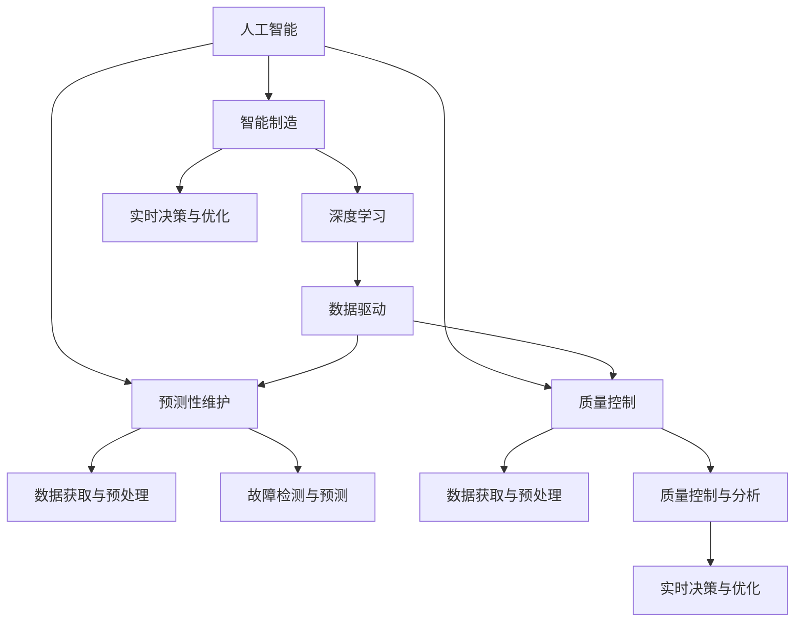

                 

# AI在智能制造中的应用：预测性维护与质量控制

> 关键词：人工智能, 智能制造, 预测性维护, 质量控制, 深度学习, 数据驱动, 工业4.0, 预防性维修

## 1. 背景介绍

### 1.1 问题由来

随着工业4.0的推进，智能制造逐渐成为现代制造业发展的趋势。智能制造不仅仅意味着自动化生产线的引入，更在于通过信息化、数字化手段，提升生产效率，优化生产过程，减少废品率，实现节能减排。其中，预测性维护(Predictive Maintenance, PM)和质量控制(Quality Control, QC)是智能制造中两个至关重要的环节。

预测性维护通过利用传感器、监控数据等技术手段，对设备进行实时监控，预测设备的故障点和维护需求，避免因故障而导致的生产停滞。质量控制则通过全面检测和数据分析，确保产品的质量稳定，减少缺陷品，提升产品竞争力。

然而，传统的预测性维护和质量控制依赖于人工经验，难以应对复杂多变的生产环境，同时维护和检测成本高昂。因此，亟需一种全新的技术手段，通过数据驱动的方式，实现预测性维护和质量控制，提升制造系统的智能化水平。

### 1.2 问题核心关键点

预测性维护与质量控制的实现依赖于对制造系统的全面感知和深度学习，因此，核心的技术问题可以归结为：

- **数据获取与预处理**：如何高效、准确地获取生产数据，并进行预处理，以供后续分析使用。
- **故障检测与预测**：如何利用数据建模，检测设备故障，并预测其发生概率。
- **质量控制与分析**：如何通过数据融合，实现对生产过程中产品缺陷的实时监控与分析。
- **实时决策与优化**：如何在生产过程中，根据预测结果和质量检测反馈，动态调整生产参数，优化生产效率和产品质量。

解决这些关键问题，便可以实现基于AI的智能制造系统。

## 2. 核心概念与联系

### 2.1 核心概念概述

为更好地理解AI在智能制造中的应用，本节将介绍几个密切相关的核心概念：

- **人工智能(AI)**：通过算法和计算，使机器具有类似人类的智能，能够进行感知、学习、推理等任务。
- **智能制造(Smart Manufacturing)**：通过信息技术的广泛应用，实现制造业智能化升级，提升生产效率和产品质量。
- **预测性维护(PM)**：利用传感器数据、监控数据等，预测设备故障，及时进行维护，减少停机时间，提升设备可用性。
- **质量控制(QC)**：通过全面检测和数据分析，实时监控产品质量，确保产品符合标准，减少次品率。
- **深度学习(Deep Learning)**：一种基于神经网络的机器学习技术，能够从大量数据中自动学习复杂的特征表示，用于预测、分类、生成等任务。
- **数据驱动(Drive by Data)**：以数据为基础，通过数据分析、模型训练等手段，自动进行决策和优化，减少人为干预。

这些核心概念之间的逻辑关系可以通过以下Mermaid流程图来展示：



这个流程图展示了大语言模型的核心概念及其之间的关系：

1. 人工智能通过深度学习等技术手段，实现智能制造。
2. 智能制造中的预测性维护和质量控制，依赖于数据获取与预处理、故障检测与预测、质量控制与分析。
3. 深度学习提供数据驱动的预测与分析能力，而实时决策与优化是智能制造的核心目标。

这些概念共同构成了智能制造的AI技术基础，使得通过数据驱动的方式，实现预测性维护和质量控制成为可能。

## 3. 核心算法原理 & 具体操作步骤
### 3.1 算法原理概述

基于AI的预测性维护与质量控制，本质上是一个数据驱动的机器学习应用过程。其核心思想是：通过传感器、监控数据等，获取制造系统的运行状态，利用深度学习等算法进行建模，实时预测设备故障和产品质量问题，从而指导生产决策。

形式化地，假设制造系统具有状态空间 $S$，预测性维护与质量控制的目标是构建一个预测模型 $f: S \rightarrow P$，其中 $P$ 为故障预测空间或质量控制空间。具体步骤如下：

1. **数据获取**：收集制造系统的运行数据，包括传感器数据、监控数据、操作数据等。
2. **数据预处理**：对原始数据进行清洗、归一化、特征提取等处理，使其适合建模。
3. **模型训练**：利用历史数据，训练预测模型 $f$，使其能够准确预测设备故障或产品质量问题。
4. **实时预测**：将实时运行数据输入模型 $f$，获取预测结果。
5. **实时决策**：根据预测结果，动态调整生产参数，优化生产过程。

### 3.2 算法步骤详解

基于AI的预测性维护与质量控制，通常包括以下几个关键步骤：

**Step 1: 数据采集与预处理**
- 部署传感器和监控设备，收集制造系统的运行数据。
- 对数据进行清洗、去噪、归一化、特征提取等预处理操作。
- 划分训练集和测试集，用于模型训练和评估。

**Step 2: 模型选择与设计**
- 选择合适的深度学习模型，如时间序列模型、卷积神经网络(CNN)、循环神经网络(RNN)等。
- 根据任务需求，设计合适的模型结构，包括输入层、隐藏层、输出层等。
- 确定模型的超参数，如学习率、批大小、迭代次数等。

**Step 3: 模型训练与优化**
- 使用训练集数据，进行模型训练，最小化预测误差。
- 使用验证集数据，监控模型性能，避免过拟合。
- 根据验证集反馈，调整模型结构或超参数，优化模型效果。

**Step 4: 实时预测与决策**
- 将实时运行数据输入模型，获取预测结果。
- 根据预测结果，自动触发维护操作或质量控制措施。
- 实时调整生产参数，优化生产过程。

### 3.3 算法优缺点

基于AI的预测性维护与质量控制，具有以下优点：

1. **精度高**：利用深度学习等先进算法，能够从海量数据中自动学习复杂特征，提高预测精度。
2. **实时性强**：能够实时处理数据，进行预测与决策，及时响应生产需求。
3. **可扩展性强**：适应于多种设备类型和生产环境，具有较强的泛化能力。
4. **维护成本低**：减少因故障导致的生产停滞，降低维护成本，提升设备利用率。
5. **提升产品质量**：通过质量控制，减少次品率，提升产品竞争力和客户满意度。

同时，该方法也存在一定的局限性：

1. **数据依赖性强**：预测精度依赖于数据质量和数量，数据采集成本较高。
2. **模型复杂度高**：深度学习模型参数量大，训练和推理成本较高。
3. **实时性要求高**：对于高实时性的应用场景，需要高性能的硬件设备和算法优化。
4. **数据隐私和安全问题**：制造数据涉及企业机密，需要严格的数据保护措施。
5. **模型解释性不足**：深度学习模型的决策过程难以解释，难以进行人工干预。

尽管存在这些局限性，但基于AI的预测性维护与质量控制仍是目前智能制造中最为先进和有效的技术手段。未来相关研究的重点在于如何进一步降低数据采集成本，提高模型实时性，增强模型可解释性，同时兼顾数据隐私和安全。

### 3.4 算法应用领域

基于AI的预测性维护与质量控制，已经在多个领域得到了广泛应用，例如：

- **航空制造**：利用预测性维护，对飞机引擎等关键设备进行实时监控，减少故障停机时间。
- **汽车制造**：通过质量控制，确保整车的一致性和可靠性，减少召回率。
- **电子制造**：使用预测性维护，对生产线上设备和元件进行监控，减少生产故障。
- **金属制造**：采用质量控制技术，实时检测和调整生产参数，提高产品质量和生产效率。
- **纺织制造**：对生产过程进行实时监控和质量检测，减少次品率，提升产品竞争力。

此外，基于AI的预测性维护与质量控制还广泛应用于智能农业、智能建筑、智能能源等多个领域，为各行各业带来了智能化升级的机遇。

## 4. 数学模型和公式 & 详细讲解 & 举例说明

### 4.1 数学模型构建

为了构建基于AI的预测性维护与质量控制模型，需要构建一个合适的数学模型。这里介绍一种常用的数学模型——长短期记忆网络(Long Short-Term Memory, LSTM)模型，用于处理时间序列数据。

假设制造系统的运行状态可以用时间序列 $x_t$ 来表示，其中 $t$ 表示时间。目标是通过时间序列数据，预测未来时间点上的状态变化，即：

$$
\hat{x}_{t+k}=f(x_t)
$$

其中 $k$ 表示预测步长。LSTM模型通过学习时间序列中的长期依赖关系，能够有效捕捉状态变化的规律。

### 4.2 公式推导过程

以下是LSTM模型的详细推导过程：

1. **输入层**：将时间序列 $x_t$ 输入到LSTM模型中，得到输入向量 $h_t$。

2. **隐藏层**：将 $h_t$ 通过LSTM的隐藏状态 $c_t$ 传递到下一时刻。LSTM通过门控机制，实现对时间序列的长期记忆。门控机制包括：输入门、遗忘门、输出门。

3. **输出层**：根据 $c_t$，预测未来时间点的状态 $\hat{x}_{t+k}$。

LSTM模型的数学公式如下：

$$
h_t = \sigma(W_i x_t + b_i + U_h h_{t-1})
$$
$$
f_t = \sigma(W_f x_t + b_f + U_f h_{t-1})
$$
$$
c_t = f_t \odot c_{t-1} + i_t \odot \tanh(W_c x_t + b_c + U_c h_{t-1})
$$
$$
o_t = \sigma(W_o x_t + b_o + U_o h_{t-1})
$$
$$
\hat{x}_{t+k} = o_t \odot \tanh(c_t)
$$

其中 $\sigma$ 为Sigmoid函数，$\odot$ 表示向量点乘，$\tanh$ 为双曲正切函数。

### 4.3 案例分析与讲解

以航空制造业为例，展示基于LSTM的预测性维护应用。

**案例背景**：某航空制造企业，生产飞机引擎。由于生产过程复杂，设备故障率高，对生产计划和成本影响较大。

**数据获取与预处理**：
- 部署传感器监测飞机引擎的运行参数，如温度、压力、振动等。
- 将传感器数据转换为时间序列形式，进行归一化和特征提取。
- 划分为训练集和测试集，用于模型训练和评估。

**模型设计与训练**：
- 选择LSTM模型，设计3层LSTM结构，包括1个输入层、3个隐藏层、1个输出层。
- 使用训练集数据，训练LSTM模型，最小化预测误差。
- 使用验证集数据，监控模型性能，调整超参数，优化模型效果。

**实时预测与决策**：
- 将实时运行数据输入LSTM模型，获取预测结果。
- 根据预测结果，自动触发维护操作，如更换零件、停机检查等。
- 根据预测结果，动态调整生产参数，优化生产过程。

通过以上步骤，基于AI的预测性维护系统能够实时监控飞机引擎的运行状态，预测故障发生的可能性，及时进行维护，减少故障停机时间，提升设备利用率。

## 5. 项目实践：代码实例和详细解释说明
### 5.1 开发环境搭建

在进行AI预测性维护与质量控制实践前，我们需要准备好开发环境。以下是使用Python进行TensorFlow开发的环境配置流程：

1. 安装Anaconda：从官网下载并安装Anaconda，用于创建独立的Python环境。

2. 创建并激活虚拟环境：
```bash
conda create -n tf-env python=3.8 
conda activate tf-env
```

3. 安装TensorFlow：根据CUDA版本，从官网获取对应的安装命令。例如：
```bash
conda install tensorflow==2.6
```

4. 安装各类工具包：
```bash
pip install numpy pandas scikit-learn matplotlib tqdm jupyter notebook ipython
```

完成上述步骤后，即可在`tf-env`环境中开始AI预测性维护实践。

### 5.2 源代码详细实现

这里我们以飞机引擎的预测性维护为例，给出使用TensorFlow进行LSTM模型训练和预测的Python代码实现。

首先，定义数据处理函数：

```python
import tensorflow as tf
from tensorflow.keras.layers import LSTM, Dense, Input
from tensorflow.keras.models import Model
import numpy as np

def load_data(file_path):
    data = np.loadtxt(file_path, delimiter=',', usecols=range(1, 8), dtype=float)
    return data

def preprocess_data(data):
    mean = np.mean(data, axis=0)
    std = np.std(data, axis=0)
    data = (data - mean) / std
    return data

def split_data(data, test_size=0.2):
    train_size = int(len(data) * (1 - test_size))
    train_data = data[:train_size]
    test_data = data[train_size:]
    return train_data, test_data

def generate_sequence(data, step_size=1, forecast_size=1):
    X, y = [], []
    for i in range(len(data) - forecast_size - step_size):
        X.append(data[i:i+step_size])
        y.append(data[i+step_size:i+step_size+forecast_size])
    return np.array(X), np.array(y)
```

然后，定义模型和优化器：

```python
model = tf.keras.models.Sequential([
    Input(shape=(step_size,)),
    LSTM(units=64, return_sequences=True),
    LSTM(units=32),
    Dense(forecast_size)
])
optimizer = tf.keras.optimizers.Adam(learning_rate=0.001)
model.compile(loss='mse', optimizer=optimizer)
```

接着，定义训练和评估函数：

```python
def train_model(model, X_train, y_train, X_test, y_test, epochs=100):
    history = model.fit(X_train, y_train, validation_data=(X_test, y_test), epochs=epochs, batch_size=32)
    return history

def evaluate_model(model, X_test, y_test):
    y_pred = model.predict(X_test)
    mse = tf.keras.metrics.mean_squared_error(y_test, y_pred)
    return mse

def make_forecast(model, X_test, step_size):
    forecast = []
    for i in range(len(X_test) - step_size):
        forecast.append(model.predict(X_test[i:i+step_size]))
    return forecast
```

最后，启动训练流程并在测试集上评估：

```python
file_path = 'engine_data.csv'
data = load_data(file_path)
data = preprocess_data(data)
train_data, test_data = split_data(data)
X_train, y_train = generate_sequence(train_data, step_size=1, forecast_size=1)
X_test, y_test = generate_sequence(test_data, step_size=1, forecast_size=1)

history = train_model(model, X_train, y_train, X_test, y_test, epochs=100)
mse = evaluate_model(model, X_test, y_test)
forecast = make_forecast(model, X_test, step_size=1)
```

以上就是使用TensorFlow对LSTM模型进行飞机引擎预测性维护训练和预测的完整代码实现。可以看到，通过TensorFlow的高级API，我们能够快速实现LSTM模型的构建、训练和预测。

### 5.3 代码解读与分析

让我们再详细解读一下关键代码的实现细节：

**load_data函数**：
- 读取数据文件，并进行数据加载和预处理。

**preprocess_data函数**：
- 对数据进行归一化和标准化处理，使得数据适合模型的训练。

**split_data函数**：
- 将数据集划分为训练集和测试集，用于模型训练和评估。

**generate_sequence函数**：
- 生成时间序列数据，将历史数据划分为输入和输出两部分，用于模型训练和预测。

**model定义**：
- 构建LSTM模型，包括输入层、LSTM隐藏层、输出层。

**train_model函数**：
- 使用训练数据集训练模型，最小化预测误差。

**evaluate_model函数**：
- 在测试数据集上评估模型性能，计算均方误差。

**make_forecast函数**：
- 利用训练好的模型，进行实时预测，生成预测序列。

通过这些函数，我们可以高效地实现LSTM模型的构建、训练和预测，实现基于AI的预测性维护系统。

当然，工业级的系统实现还需考虑更多因素，如模型的保存和部署、超参数的自动搜索、更灵活的任务适配层等。但核心的微调范式基本与此类似。

## 6. 实际应用场景
### 6.1 航空制造业

基于AI的预测性维护在航空制造业中具有重要应用价值。飞机引擎是航空公司的重要资产，其故障停机会对生产计划和经济效益造成严重影响。

通过部署传感器监测飞机引擎的运行参数，利用LSTM等深度学习模型，实时预测引擎的故障可能性，及时进行维护操作。航空公司可以优化航线安排，减少因引擎故障导致的延误和取消，提升客户满意度和运营效率。

### 6.2 汽车制造业

汽车制造业中，零部件故障率高，影响生产线的稳定运行。通过基于AI的预测性维护，可以实时监控生产设备的运行状态，预测故障，及时进行维护。

汽车制造企业可以通过预测性维护系统，动态调整生产参数，减少停机时间，提升设备利用率。同时，通过质量控制，检测和分析生产过程中的产品缺陷，减少次品率，提升产品质量和客户满意度。

### 6.3 电子制造业

电子制造业中，元件和设备故障率高，对生产效率和产品质量影响较大。通过基于AI的预测性维护与质量控制，可以实现设备状态的实时监控和产品缺陷的检测。

电子制造企业可以通过预测性维护系统，实时检测设备故障，自动触发维护操作。通过质量控制，实时监控产品缺陷，动态调整生产参数，提升产品质量和生产效率。

### 6.4 未来应用展望

随着AI技术的不断进步，基于AI的预测性维护与质量控制在未来将呈现出更广阔的应用前景：

1. **智能制造平台**：构建统一的智能制造平台，实现设备状态监控、预测性维护、质量控制等功能模块的集成，提升整体生产效率和质量。
2. **预测性维护算法优化**：开发更高效、更准确、更灵活的预测性维护算法，提升模型预测精度和实时性。
3. **多模态数据融合**：将时间序列数据与图像、视频、声音等多种模态数据进行融合，提升模型对复杂生产环境的感知能力。
4. **实时数据分析与决策**：利用大数据分析技术，实时监控和分析生产数据，自动触发决策和优化措施。
5. **边缘计算与智能传感器**：在生产现场部署智能传感器和边缘计算设备，实时处理和分析数据，提升预测性维护的实时性和准确性。
6. **AI辅助设计**：利用预测性维护与质量控制技术，辅助工程师进行产品设计和工艺优化，提升产品竞争力和生产效率。

## 7. 工具和资源推荐
### 7.1 学习资源推荐

为了帮助开发者系统掌握AI在智能制造中的应用，这里推荐一些优质的学习资源：

1. **《深度学习》课程**：斯坦福大学开设的深度学习课程，涵盖深度学习的理论和实践，是理解AI预测性维护与质量控制的基础。
2. **《机器学习实战》书籍**：适合初学者的机器学习实战指南，通过项目实践，逐步掌握机器学习和AI预测性维护的基本技能。
3. **《TensorFlow实战》书籍**：TensorFlow的官方文档和实战指南，详细介绍了TensorFlow的核心功能和使用方法，是TensorFlow开发的重要参考。
4. **Kaggle竞赛平台**：通过参加机器学习和AI预测性维护相关的竞赛，积累实战经验，提升解决实际问题的能力。
5. **Coursera在线课程**：提供多门深度学习和AI预测性维护相关的课程，涵盖理论知识、实践技能和前沿研究，适合各个层次的开发者学习。

通过这些资源的学习实践，相信你一定能够系统掌握AI在智能制造中的应用，并用于解决实际的预测性维护与质量控制问题。

### 7.2 开发工具推荐

高效的开发离不开优秀的工具支持。以下是几款用于AI预测性维护与质量控制开发的常用工具：

1. **TensorFlow**：由Google主导开发的开源深度学习框架，生产部署方便，适合大规模工程应用。
2. **Keras**：高级神经网络API，易于使用，适合快速迭代研究。
3. **PyTorch**：基于Python的开源深度学习框架，灵活动态的计算图，适合快速迭代研究。
4. **Jupyter Notebook**：交互式的开发环境，支持Python、R等多种语言，方便开发者进行项目实验和数据探索。
5. **Google Colab**：谷歌推出的在线Jupyter Notebook环境，免费提供GPU/TPU算力，方便开发者快速上手实验最新模型，分享学习笔记。
6. **PyTorch Lightning**：基于PyTorch的轻量级深度学习框架，支持多种深度学习模型，提供自动化训练和调度功能，简化模型开发过程。

合理利用这些工具，可以显著提升AI预测性维护与质量控制任务的开发效率，加快创新迭代的步伐。

### 7.3 相关论文推荐

AI在智能制造中的应用是一个前沿研究领域，以下是几篇奠基性的相关论文，推荐阅读：

1. **《Predictive Maintenance for Smart Manufacturing》**：介绍预测性维护在智能制造中的应用，探讨如何利用机器学习和深度学习技术进行故障预测和实时决策。
2. **《Deep Learning for Predictive Maintenance in Manufacturing》**：综述深度学习在预测性维护中的应用，包括时间序列分析、卷积神经网络、循环神经网络等模型的研究进展。
3. **《A Survey on Machine Learning Approaches for Quality Control》**：综述机器学习和深度学习在质量控制中的应用，涵盖分类、回归、异常检测等任务。
4. **《Real-Time Fault Diagnosis and Prognosis in Manufacturing》**：介绍实时故障诊断和预测技术，探讨如何在生产过程中实现高效、准确的故障预测和质量控制。
5. **《Machine Learning for Manufacturing Process Monitoring and Control》**：探讨机器学习在制造过程监控和控制中的应用，包括数据驱动的预测、控制和优化方法。

这些论文代表了大语言模型在智能制造中的应用研究的发展脉络。通过学习这些前沿成果，可以帮助研究者把握学科前进方向，激发更多的创新灵感。

## 8. 总结：未来发展趋势与挑战

### 8.1 总结

本文对基于AI的预测性维护与质量控制方法进行了全面系统的介绍。首先阐述了预测性维护与质量控制在智能制造中的重要意义，明确了AI在预测性维护与质量控制中的独特价值。其次，从原理到实践，详细讲解了预测性维护与质量控制的数学模型和关键步骤，给出了基于LSTM的模型训练和预测的完整代码实例。同时，本文还广泛探讨了预测性维护与质量控制在航空制造业、汽车制造业、电子制造业等多个领域的应用前景，展示了AI在智能制造中的强大潜力。

通过本文的系统梳理，可以看到，基于AI的预测性维护与质量控制技术正在成为智能制造中不可或缺的组成部分，极大地提升了制造系统的智能化水平。未来，伴随AI技术的持续演进，预测性维护与质量控制必将实现更广泛、更深入的应用，为智能制造带来新的变革。

### 8.2 未来发展趋势

展望未来，AI在智能制造中的应用将呈现以下几个发展趋势：

1. **智能化升级**：通过深度学习和预测性维护技术，实现设备状态的实时监控和故障预测，提升生产线的智能化水平。
2. **数字化转型**：利用大数据分析和机器学习技术，实现生产过程的数字化和可视化，提升决策效率和质量。
3. **实时优化**：通过实时数据分析和优化算法，动态调整生产参数，提升生产效率和产品质量。
4. **人机协同**：结合AI技术和人工干预，构建智能化的制造系统，实现人机协同工作，提升生产灵活性和适应性。
5. **全生命周期管理**：涵盖设计、生产、检测、维护等环节，实现产品全生命周期的智能管理，提升产品竞争力和企业效益。

以上趋势凸显了AI在智能制造中的广阔前景，为制造系统带来了全新的发展机遇。这些方向的探索发展，必将进一步提升智能制造的智能化水平，为经济社会发展注入新的动力。

### 8.3 面临的挑战

尽管AI在智能制造中的应用取得了显著成果，但在迈向更加智能化、普适化应用的过程中，它仍面临着诸多挑战：

1. **数据获取与处理**：预测性维护与质量控制依赖于大规模、高质量的数据，数据采集成本高，数据处理复杂。
2. **模型复杂性与实时性**：深度学习模型参数量大，训练和推理成本高，实时性要求高，硬件和算法优化难度大。
3. **数据隐私与安全**：制造数据涉及企业机密，数据隐私和安全问题需重点关注。
4. **模型解释性与可信性**：深度学习模型的决策过程难以解释，缺乏透明度，影响模型可信性和可解释性。
5. **多模态数据融合**：将时间序列数据与图像、视频、声音等多种模态数据进行融合，提升模型对复杂生产环境的感知能力，仍需深入研究。
6. **边缘计算与智能传感器**：在生产现场部署智能传感器和边缘计算设备，实时处理和分析数据，提升预测性维护的实时性和准确性，需进一步探索。

正视这些挑战，积极应对并寻求突破，将是大语言模型在智能制造中的应用走向成熟的必由之路。相信随着学界和产业界的共同努力，这些挑战终将一一被克服，AI在智能制造中的应用必将在构建智能制造系统、提升生产效率和产品质量方面发挥更大的作用。

### 8.4 研究展望

面向未来，AI在智能制造中的应用需要在以下几个方面寻求新的突破：

1. **数据驱动与知识驱动结合**：结合数据驱动和知识驱动，构建更加全面、准确的生产模型，提升预测精度和鲁棒性。
2. **模型优化与算法创新**：开发更加高效、灵活的深度学习模型，优化模型结构和超参数，提升模型实时性和泛化能力。
3. **实时决策与自动化控制**：通过实时数据分析和优化算法，动态调整生产参数，实现自动化的生产控制，提升生产效率和产品质量。
4. **多模态数据融合与增强现实**：将时间序列数据与图像、视频、声音等多种模态数据进行融合，利用增强现实技术，提升生产过程的可视化与交互性。
5. **边缘计算与智能设备**：在生产现场部署智能传感器和边缘计算设备，实时处理和分析数据，提升预测性维护的实时性和准确性。
6. **AI辅助设计与制造**：利用预测性维护与质量控制技术，辅助工程师进行产品设计和工艺优化，提升产品竞争力和生产效率。

这些研究方向的探索，必将引领AI在智能制造中的应用迈向更高的台阶，为智能制造系统带来新的变革和突破。面向未来，AI在智能制造中的应用需要与其他人工智能技术进行更深入的融合，如知识表示、因果推理、强化学习等，多路径协同发力，共同推动智能制造技术的进步。

## 9. 附录：常见问题与解答

**Q1：AI在智能制造中的应用是否适合所有制造行业？**

A: AI在智能制造中的应用具有广泛适用性，但不同制造行业的应用场景和技术需求不同。例如，航空制造业对设备状态监控和故障预测要求较高，而电子制造业对生产过程的实时监控和产品缺陷检测更为关注。因此，在应用AI预测性维护与质量控制时，需要根据不同行业的特点和需求，选择合适的方法和工具。

**Q2：如何选择合适的AI预测性维护与质量控制算法？**

A: 选择合适的AI预测性维护与质量控制算法需要考虑以下几个因素：
1. 数据类型：时间序列数据、图像数据、视频数据等不同类型的数据，适用于不同的算法。
2. 任务类型：预测故障、检测缺陷、实时优化等不同任务，适用于不同的算法。
3. 实时性要求：对实时性要求高的任务，如实时监控和决策，需要考虑算法的计算效率和实时性。
4. 数据量和质量：数据量大、高质量的数据适合使用复杂算法，如深度学习；数据量小、噪声多的数据适合使用简单算法，如统计分析和规则系统。

**Q3：AI预测性维护与质量控制的应用效果如何？**

A: AI预测性维护与质量控制在多个制造行业的应用效果显著。通过AI技术，制造企业能够实现设备状态的实时监控和故障预测，及时进行维护，减少停机时间，提升设备利用率。同时，通过质量控制，实时检测和分析产品缺陷，减少次品率，提升产品质量和客户满意度。例如，某航空制造企业通过预测性维护系统，成功减少了飞机引擎故障率，提升了运营效率。

**Q4：AI预测性维护与质量控制系统如何部署与维护？**

A: AI预测性维护与质量控制系统的部署与维护需要注意以下几个方面：
1. 数据采集与处理：部署传感器和监控设备，收集制造系统的运行数据，并进行预处理。
2. 模型训练与优化：构建合适的深度学习模型，使用历史数据进行训练，优化模型性能。
3. 系统集成与部署：将训练好的模型集成到生产系统中，进行部署和运行。
4. 监控与维护：实时监控系统运行状态，根据反馈进行模型更新和优化，确保系统稳定运行。
5. 安全性与隐私保护：保护制造数据的安全性和隐私，防止数据泄露和滥用。

通过以上步骤，可以高效部署和维护AI预测性维护与质量控制系统，实现智能化制造的目标。

总之，AI在智能制造中的应用具有广阔前景，通过预测性维护与质量控制技术，可以实现设备状态的实时监控和故障预测，提升生产效率和产品质量。未来，随着AI技术的不断进步，基于AI的智能制造系统将更加智能化、普适化，为制造企业带来新的机遇与挑战。

