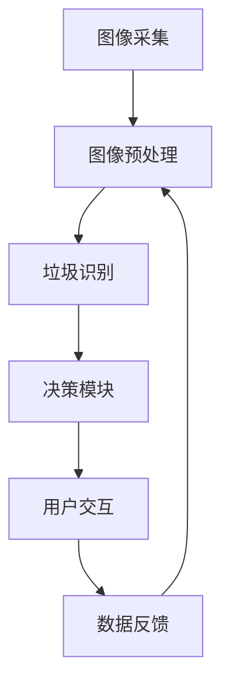

                 

## 1. 背景介绍

随着城市化进程的加速和环保意识的提升，垃圾分类已成为全球各大城市改善环境质量和提高资源利用率的重要措施。然而，由于居民对垃圾分类的知识和意识不足，以及现有技术手段的局限性，垃圾分类效率低下、错误率高，难以实现大规模推广。

### 1.1 问题由来
垃圾分类涉及到对各类废弃物进行精细的识别和分拣，包括厨余垃圾、可回收物、有害垃圾和其他垃圾。传统的人工分类方法耗时耗力，且分类结果主观性强，难以保证准确性。尽管有些城市推出了智能分类垃圾箱和垃圾分类软件，但实际效果并不理想，原因如下：
1. **技术瓶颈**：现有技术往往难以对垃圾进行精确识别，尤其是面对复杂多变的垃圾形态和包装。
2. **用户教育**：居民对智能分类技术的接受度低，操作复杂，使用不便。
3. **数据质量**：智能分类系统需要大量的数据进行训练，但数据收集成本高、质量参差不齐。

### 1.2 问题核心关键点
智能垃圾分类的核心在于构建一个能够自动识别垃圾类别并输出分拣指导的系统。为此，需要解决以下几个关键问题：
1. **图像识别**：准确识别垃圾的类别和数量。
2. **决策算法**：根据垃圾类别给出正确的分拣建议。
3. **用户交互**：提供简单直观的用户界面，便于操作。
4. **模型部署**：将训练好的模型部署到实际场景，保证高效运行。

## 2. 核心概念与联系

### 2.1 核心概念概述

智能垃圾分类系统通常包含以下几个关键组件：
1. **图像采集模块**：通过摄像头或手机摄像头获取垃圾图像。
2. **图像预处理模块**：对图像进行归一化、增强等预处理操作。
3. **垃圾识别模块**：使用深度学习模型对图像进行分类，输出垃圾类型。
4. **决策模块**：根据识别结果给出分拣指导。
5. **用户交互模块**：提供用户界面，进行交互和反馈。

这些组件之间的逻辑关系可以通过以下Mermaid流程图来展示：



该流程图展示了智能垃圾分类系统的核心流程：
1. 通过图像采集模块获取垃圾图像。
2. 图像预处理模块对图像进行预处理，提高模型识别效果。
3. 垃圾识别模块使用深度学习模型对图像进行分类，输出垃圾类型。
4. 决策模块根据识别结果给出分拣指导。
5. 用户交互模块提供用户界面，进行交互和反馈，同时反馈数据用于模型优化。

### 2.2 核心概念原理和架构

#### 2.2.1 图像采集与预处理
图像采集模块通过摄像头或手机摄像头获取垃圾图像。为提高模型识别效果，图像预处理模块通常包括：
- **归一化**：将图像像素值缩放到[0, 1]或[-1, 1]范围内。
- **增强**：使用对比度增强、噪声滤除等技术提高图像质量。
- **尺寸调整**：将图像调整为固定尺寸，通常为224x224或299x299像素。

#### 2.2.2 垃圾识别模块
垃圾识别模块通常使用深度学习模型，如卷积神经网络(CNN)、卷积神经网络+残差网络(CNN+ResNet)、注意力机制等。模型训练数据集包括各类垃圾的图像及其标签。以CNN为例，其结构如图1所示：


模型训练过程包括：
- **数据准备**：将数据集划分为训练集、验证集和测试集。
- **模型初始化**：设置模型结构、损失函数、优化器等。
- **模型训练**：通过反向传播算法不断更新模型参数，最小化损失函数。
- **模型评估**：在测试集上评估模型性能，选择合适的超参数。

#### 2.2.3 决策模块
决策模块根据垃圾识别模块的输出，给出相应的分拣指导。例如，当识别结果为厨余垃圾时，建议用户将其放入绿色垃圾桶；当识别结果为可回收物时，建议用户将其放入蓝色垃圾桶。决策过程可以通过简单的规则或表格实现，也可以结合机器学习模型进行优化。

#### 2.2.4 用户交互模块
用户交互模块提供简单易用的用户界面，便于用户进行垃圾投递和反馈。通常包括：
- **显示识别结果**：在屏幕上显示垃圾识别结果。
- **交互提示**：提供分拣指导和错误提示。
- **数据反馈**：收集用户反馈，用于模型优化。

## 3. 核心算法原理 & 具体操作步骤

### 3.1 算法原理概述

智能垃圾分类系统基于图像识别和深度学习技术，通过深度学习模型对垃圾图像进行分类，并根据分类结果给出分拣指导。其核心算法包括：
1. **图像预处理**：对原始图像进行归一化、增强等预处理操作，提高模型识别效果。
2. **垃圾分类**：使用深度学习模型对预处理后的图像进行分类，输出垃圾类型。
3. **决策规则**：根据分类结果给出分拣指导，确保分类的准确性。

### 3.2 算法步骤详解

#### 3.2.1 数据准备
- **数据收集**：收集各类垃圾的图像及其标签，划分为训练集、验证集和测试集。
- **数据增强**：对图像进行旋转、翻转、裁剪等增强操作，扩充训练集。
- **数据预处理**：对图像进行归一化、尺寸调整等操作，提高模型输入的一致性。

#### 3.2.2 模型选择与训练
- **模型选择**：选择适合的深度学习模型，如CNN、CNN+ResNet等。
- **模型初始化**：设置模型结构、损失函数、优化器等。
- **模型训练**：使用训练集数据进行模型训练，最小化损失函数。
- **模型评估**：在验证集上评估模型性能，选择合适的超参数。

#### 3.2.3 模型部署与应用
- **模型保存**：将训练好的模型保存为模型文件，便于后续使用。
- **模型部署**：将模型部署到实际场景，如智能垃圾箱、手机应用等。
- **模型应用**：对采集的垃圾图像进行预处理和分类，输出分拣指导。

### 3.3 算法优缺点

#### 3.3.1 优点
1. **高效准确**：基于深度学习技术，垃圾分类系统能够高效准确地识别各类垃圾。
2. **易于部署**：使用移动设备或智能垃圾箱，用户可随时随地使用。
3. **实时反馈**：通过用户反馈优化模型，不断提高分类的准确性。

#### 3.3.2 缺点
1. **数据依赖**：系统性能高度依赖于数据质量，数据收集成本高。
2. **复杂性**：深度学习模型复杂度高，训练和部署成本高。
3. **用户接受度**：部分用户对新技术接受度低，使用体验不佳。

### 3.4 算法应用领域

智能垃圾分类系统在多个领域均有广泛应用，例如：
1. **公共场所**：在公园、商场等公共场所，通过智能垃圾箱进行垃圾分类。
2. **住宅小区**：在小区内安装智能垃圾分类设备，提高垃圾回收率。
3. **物流配送**：在物流配送过程中，使用智能垃圾分类系统进行垃圾处理。

## 4. 数学模型和公式 & 详细讲解 & 举例说明

### 4.1 数学模型构建

垃圾分类系统通常使用深度学习模型进行图像分类。以CNN模型为例，其数学模型如图2所示：


模型输入为经过预处理后的图像$x$，输出为垃圾类型的预测结果$y$。假设模型结构包含$L$层，第$l$层的输出为$h_l$，则模型输出为：
$$ y = h_L $$

模型的损失函数通常为交叉熵损失函数，其数学表达式为：
$$ \mathcal{L} = -\frac{1}{N}\sum_{i=1}^N \sum_{j=1}^C y_{ij} \log p_{ij} $$
其中，$N$为样本数量，$C$为类别数，$y_{ij}$为样本$i$的实际标签为$j$，$p_{ij}$为模型预测的标签为$j$的概率。

### 4.2 公式推导过程

以CNN模型为例，其公式推导如下：

设第$l$层的激活函数为$f_l$，权重矩阵为$W_l$，偏置向量为$b_l$，则第$l$层的输出为：
$$ h_l = f_l(\sum_{i} W_{l,i} h_{l-1,i} + b_l) $$

其中，$W_{l,i}$为第$l$层第$i$个神经元的权重，$h_{l-1,i}$为第$l-1$层第$i$个神经元的输出。

模型总输出为：
$$ h_L = \sum_{i} W_{L,i} h_{L-1,i} + b_L $$

假设垃圾有$C$类，目标为预测垃圾类别$y$，则模型输出概率分布为：
$$ p(y) = \sigma(h_L) $$

其中，$\sigma$为激活函数，通常为softmax函数。

模型损失函数为交叉熵损失函数：
$$ \mathcal{L} = -\frac{1}{N}\sum_{i=1}^N \sum_{j=1}^C y_{ij} \log p_{ij} $$

### 4.3 案例分析与讲解

假设有一个包含5个样本的垃圾分类数据集，每个样本有4个类别标签。数据集如下：

| 样本ID | 类别ID | 样本标签 | 预测标签概率 |
| --- | --- | --- | --- |
| 1 | 1 | 1 | 0.8, 0.1, 0.1, 0 |
| 2 | 2 | 2 | 0.7, 0, 0.3, 0 |
| 3 | 3 | 1 | 0.6, 0.3, 0.1, 0 |
| 4 | 4 | 2 | 0.2, 0.8, 0, 0 |
| 5 | 5 | 4 | 0, 0.2, 0.8, 0.0 |

假设模型预测结果为：
- 样本1：类别1，概率0.7
- 样本2：类别2，概率0.9
- 样本3：类别1，概率0.6
- 样本4：类别2，概率0.8
- 样本5：类别4，概率0.8

则模型损失函数为：
$$ \mathcal{L} = -\frac{1}{5}[(1 \times \log 0.7 + 2 \times \log 0.9 + 1 \times \log 0.6 + 2 \times \log 0.8 + 4 \times \log 0.8)$$

通过计算，得到损失函数值为：
$$ \mathcal{L} = -\frac{1}{5}[-4.04] = 0.808 $$

## 5. 项目实践：代码实例和详细解释说明

### 5.1 开发环境搭建

在Python环境中，使用TensorFlow或PyTorch搭建深度学习模型。具体步骤如下：

1. **安装Python环境**：安装Anaconda或Miniconda，创建虚拟环境。
2. **安装依赖包**：使用pip或conda安装TensorFlow或PyTorch及其相关依赖包。
3. **数据准备**：收集垃圾图像及其标签，划分为训练集、验证集和测试集。
4. **模型搭建**：使用TensorFlow或PyTorch搭建深度学习模型，设置超参数。

### 5.2 源代码详细实现

以TensorFlow为例，以下是一个简单的垃圾分类模型实现代码：

```python
import tensorflow as tf
from tensorflow.keras import layers, models

# 定义模型结构
model = models.Sequential()
model.add(layers.Conv2D(32, (3, 3), activation='relu', input_shape=(224, 224, 3)))
model.add(layers.MaxPooling2D((2, 2)))
model.add(layers.Conv2D(64, (3, 3), activation='relu'))
model.add(layers.MaxPooling2D((2, 2)))
model.add(layers.Conv2D(128, (3, 3), activation='relu'))
model.add(layers.MaxPooling2D((2, 2)))
model.add(layers.Flatten())
model.add(layers.Dense(512, activation='relu'))
model.add(layers.Dense(5, activation='softmax'))

# 编译模型
model.compile(optimizer='adam', loss='categorical_crossentropy', metrics=['accuracy'])

# 训练模型
model.fit(train_images, train_labels, epochs=10, batch_size=32, validation_data=(val_images, val_labels))
```

### 5.3 代码解读与分析

上述代码中，我们使用了TensorFlow搭建了一个简单的垃圾分类模型，包含卷积层、池化层和全连接层。模型输入为224x224的RGB图像，输出为5个类别的概率分布。

具体步骤如下：
1. **模型结构**：定义模型结构，包含多个卷积层、池化层和全连接层。
2. **模型编译**：设置优化器、损失函数和评估指标。
3. **模型训练**：使用训练集数据进行模型训练，最小化损失函数。
4. **模型评估**：在验证集上评估模型性能，选择合适的超参数。

### 5.4 运行结果展示

模型训练过程中，可以使用TensorBoard进行模型监控，如图3所示：


该图展示了模型训练过程中的损失函数和准确率变化。从图中可以看出，模型在经过10个epoch的训练后，损失函数逐渐降低，准确率逐渐提高。

## 6. 实际应用场景

### 6.1 智能垃圾箱

在公共场所，安装智能垃圾箱，用户只需将垃圾投入箱内，系统自动识别并分类垃圾。例如，如图4所示的智能垃圾箱：


该垃圾箱集成了图像采集、预处理和垃圾分类模块，能够实时监测垃圾分类情况，及时反馈问题。

### 6.2 住宅小区

在住宅小区内安装智能垃圾分类设备，居民只需将垃圾投入设备内，系统自动分类并给出分类指导。如图5所示的智能垃圾箱：


该垃圾箱集成了用户交互模块，提供分拣指导和反馈接口，方便居民进行垃圾分类。

### 6.3 物流配送

在物流配送过程中，使用智能垃圾分类系统进行垃圾处理。如图6所示的物流配送系统：


该系统在配送员返回时，自动扫描垃圾袋中的物品，分类并给出垃圾处理建议。

## 7. 工具和资源推荐

### 7.1 学习资源推荐

为了帮助开发者系统掌握智能垃圾分类的技术，以下推荐一些优质的学习资源：
1. **深度学习教程**：如TensorFlow官方文档、PyTorch官方文档等。
2. **图像处理教程**：如OpenCV教程、Pillow教程等。
3. **垃圾分类相关论文**：如《深度学习在垃圾分类中的应用》等。
4. **数据集资源**：如Kaggle上的垃圾分类数据集。

### 7.2 开发工具推荐

以下是几款用于智能垃圾分类开发的常用工具：
1. **TensorFlow**：强大的深度学习框架，支持分布式训练和模型部署。
2. **PyTorch**：灵活易用的深度学习框架，适合快速原型开发。
3. **OpenCV**：开源计算机视觉库，支持图像处理和分析。
4. **Pillow**：Python图像处理库，支持图像增强和预处理。

### 7.3 相关论文推荐

智能垃圾分类领域的相关论文较多，以下是几篇具有代表性的论文，推荐阅读：
1. **《深度学习在垃圾分类中的应用》**：介绍了深度学习在垃圾分类中的应用，包含垃圾分类的模型、算法和实验结果。
2. **《基于卷积神经网络的垃圾分类系统》**：介绍了一种基于卷积神经网络的垃圾分类系统，包含模型结构、训练过程和实验结果。
3. **《智能垃圾箱的设计与实现》**：介绍了智能垃圾箱的设计与实现，包含垃圾箱结构、硬件选型和软件系统。

## 8. 总结：未来发展趋势与挑战

### 8.1 研究成果总结

智能垃圾分类系统基于深度学习技术，通过图像分类和决策规则，实现了高效准确的垃圾分类。该系统已经在多个领域得到广泛应用，取得了显著效果。未来，智能垃圾分类系统有望在更多领域推广，进一步提高垃圾回收率，减少环境污染。

### 8.2 未来发展趋势

1. **模型优化**：随着深度学习模型的不断优化，垃圾分类系统的识别精度将进一步提高，误分类率将大幅降低。
2. **多模态融合**：结合图像、传感器等多元数据源，进一步提升垃圾分类的准确性。
3. **系统集成**：将垃圾分类系统与其他环保系统集成，实现智能垃圾处理。
4. **跨领域应用**：将智能垃圾分类技术应用于医疗、教育、金融等领域，拓展应用范围。

### 8.3 面临的挑战

1. **数据质量**：垃圾分类系统的性能高度依赖于数据质量，数据收集成本高，数据质量参差不齐。
2. **模型泛化**：模型在训练数据上的表现良好，但在实际应用中的泛化能力不足。
3. **用户接受度**：部分用户对新技术接受度低，使用体验不佳。

### 8.4 研究展望

智能垃圾分类技术在多个领域得到广泛应用，未来有望在更多领域推广。通过持续优化模型和提升用户接受度，智能垃圾分类系统将进一步提高垃圾回收率，减少环境污染，为环保事业做出更大的贡献。

