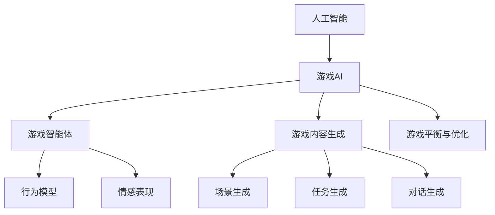

                 

## 1. 背景介绍

### 1.1 问题由来
随着人工智能(AI)技术的快速发展，其在电子游戏开发中的应用越来越广泛。AI技术不仅可以增强游戏体验，提高游戏可玩性，还能够实现游戏智能体，提供更加真实、沉浸的交互体验。然而，AI在电子游戏中的应用仍面临诸多挑战，包括高昂的开发成本、复杂的算法实现和难以预测的行为模型等。为了更好地应对这些挑战，本文将从背景、核心概念、算法原理、实际应用、未来趋势和常见问题等方面，对AI在游戏开发中的应用进行全面探讨。

### 1.2 问题核心关键点
AI在游戏开发中的应用，主要集中在以下几个关键点：

1. **沉浸式体验的创造**：通过AI算法和模型，实现玩家与游戏世界的互动，增强游戏沉浸感和可玩性。
2. **游戏智能体的生成**：通过AI技术生成游戏中的角色和敌人，实现复杂行为模型和情感表现。
3. **游戏内容自动生成**：利用生成对抗网络(GAN)、自然语言处理(NLP)等技术，自动生成游戏场景和任务。
4. **游戏平衡与优化**：通过AI算法优化游戏平衡，提升玩家体验。
5. **可扩展性和适应性**：AI技术可以应用于不同类型和规模的游戏，提升开发效率和降低成本。

本文将详细探讨这些关键点，并提供实际的案例和技术实现方法，以期为游戏开发者提供指导。

## 2. 核心概念与联系

### 2.1 核心概念概述

为更好地理解AI在游戏开发中的应用，本节将介绍几个密切相关的核心概念：

- **人工智能(AI)**：指使计算机系统能够模拟人类智能行为的科学与技术。包括机器学习、深度学习、自然语言处理等技术。
- **游戏AI**：指游戏中实现智能体行为和游戏内容自动生成的AI技术。通过游戏AI，玩家可以获得更加逼真和沉浸的体验。
- **游戏智能体**：指游戏中的角色、敌人和其他具有行为和情感表现的角色。游戏智能体通过AI技术实现复杂的行为模型。
- **游戏内容生成**：指使用AI技术自动生成游戏场景、任务和对话等游戏元素的过程。
- **游戏平衡与优化**：指通过AI算法对游戏机制和参数进行优化，提升游戏的可玩性和平衡性。

这些核心概念之间的逻辑关系可以通过以下Mermaid流程图来展示：



这个流程图展示了大语言模型的核心概念及其之间的关系：

1. 人工智能为游戏AI提供技术和算法支持。
2. 游戏AI实现游戏智能体的行为和情感表现。
3. 游戏内容生成自动创建游戏场景和任务。
4. 游戏智能体通过行为模型和情感表现，提升游戏体验。
5. 游戏平衡与优化通过AI算法实现游戏平衡和可玩性提升。

## 3. 核心算法原理 & 具体操作步骤

### 3.1 算法原理概述

AI在游戏开发中的应用，本质上是通过一系列算法和模型，实现游戏智能体的行为模拟和游戏内容的自动生成。以下是几种核心算法的简要介绍：

- **强化学习(Reinforcement Learning, RL)**：通过奖励机制训练智能体，使其在特定环境下学习最优策略。
- **生成对抗网络(Generative Adversarial Networks, GANs)**：通过两个神经网络互相博弈，生成逼真的游戏场景和角色。
- **自然语言处理(NLP)**：通过语言模型，实现游戏对话和任务生成。
- **模拟与仿真(Simulations and Simulations)**：通过物理模拟和仿真技术，创建逼真的游戏世界。

这些算法通过不同的方式，实现游戏内容的自动化和智能体的行为模拟，为游戏开发者提供了强大的工具。

### 3.2 算法步骤详解

以强化学习为例，介绍AI在游戏开发中的应用步骤：

**Step 1: 环境设计**
- 定义游戏环境，包括状态空间、动作空间和奖励机制。
- 根据游戏规则，设计状态转移函数和奖励函数。

**Step 2: 智能体训练**
- 使用强化学习算法，如Q-Learning、SARSA、深度Q网络(DQN)等，训练智能体的策略。
- 设定学习率、折扣因子、探索与利用策略等超参数。

**Step 3: 行为模拟**
- 将训练好的智能体应用到游戏环境中，进行行为模拟。
- 观察智能体的行为表现，调整策略参数以优化性能。

**Step 4: 游戏内容生成**
- 使用生成对抗网络或自然语言处理技术，自动生成游戏场景、任务和对话。
- 根据智能体的行为，动态生成游戏内容，提升游戏体验。

**Step 5: 游戏平衡与优化**
- 使用强化学习算法或统计方法，优化游戏机制和参数，确保游戏平衡和可玩性。
- 根据玩家反馈，不断调整游戏设置，提升游戏体验。

### 3.3 算法优缺点

AI在游戏开发中的应用，具有以下优点：

1. **提升游戏体验**：通过智能体和内容自动生成，实现更逼真和沉浸的游戏体验。
2. **降低开发成本**：利用AI技术，减少了手动编程和内容生成的工作量，提高了开发效率。
3. **可扩展性**：AI技术可以应用于不同类型的游戏，提升游戏开发和维护的可扩展性。

同时，这些算法也存在一定的局限性：

1. **复杂度高**：一些复杂的AI算法需要大量的计算资源和数据，开发成本较高。
2. **模型可解释性不足**：AI模型的行为和决策过程难以解释，增加了调试和优化难度。
3. **数据依赖**：AI模型的训练和优化依赖于高质量的数据集，数据不足可能导致性能下降。

尽管存在这些局限性，但AI在游戏开发中的应用，正逐渐成为游戏行业的重要趋势，为游戏开发者提供了新的思路和工具。

### 3.4 算法应用领域

AI在游戏开发中的应用，涵盖多个领域，具体如下：

- **实时策略游戏**：如《星际争霸》、《炉石传说》等，通过强化学习训练智能体，实现复杂策略对抗。
- **角色扮演游戏(RPG)**：如《巫师3》、《天际》等，通过自然语言处理生成对话和任务，实现更加沉浸的故事情节。
- **模拟类游戏**：如《模拟城市》、《模拟人生》等，通过仿真技术创建逼真的游戏世界，提升玩家的沉浸感。
- **体育游戏**：如《FIFA》、《NBA 2K》等，通过AI技术生成逼真的对手和比赛场景，提高游戏可玩性。
- **动作游戏**：如《塞尔达传说》、《刺客信条》等，通过生成对抗网络生成逼真的敌人和场景，提升游戏难度和趣味性。

## 4. 数学模型和公式 & 详细讲解 & 举例说明

### 4.1 数学模型构建

本节将使用数学语言对AI在游戏开发中的应用进行更加严格的刻画。

设游戏环境为$S$，智能体的行为为$a$，智能体在状态$s$下执行行为$a$后，状态转移到$s'$，并获得奖励$r$。则强化学习的目标是最小化期望累计奖励：

$$
J(\pi) = \mathop{\arg\min}_{\pi} \mathbb{E} \left[ \sum_{t=0}^{\infty} \gamma^t r_t \right]
$$

其中$\pi$为智能体的策略，$\gamma$为折扣因子。

强化学习的优化目标是找到最优策略$\pi^*$，使得期望累计奖励$J(\pi^*)$最小。常用的优化算法包括Q-Learning、SARSA、深度Q网络(DQN)等。

### 4.2 公式推导过程

以Q-Learning算法为例，推导其更新公式。

Q-Learning算法更新公式为：

$$
Q_{\theta}(s, a) = Q_{\theta}(s, a) + \alpha [r + \gamma \max_{a'} Q_{\theta}(s', a')] - Q_{\theta}(s, a)
$$

其中，$\theta$为Q函数的参数，$\alpha$为学习率，$r$为即时奖励，$s'$为状态转移后的新状态。

该公式可以解释为：

1. 当前状态$s$和行为$a$的Q值，加上当前即时奖励$r$和下一个状态$s'$的Q值的最大值。
2. 乘以折扣因子$\gamma$，以考虑未来奖励的重要性。
3. 减去当前状态$s$和行为$a$的Q值，以更新Q值。

### 4.3 案例分析与讲解

以《巫师3》中的自然语言处理应用为例，探讨AI在游戏对话生成中的应用：

《巫师3》中，使用了NLP技术，实现了自动生成对话和任务的功能。通过训练一个语言模型，可以自动生成角色之间的对话，提升游戏的沉浸感和互动性。

**Step 1: 数据准备**
- 收集游戏内的对话数据，包括角色之间的对话、任务和提示信息等。
- 进行数据清洗和标注，准备训练数据集。

**Step 2: 模型训练**
- 使用预训练的语言模型，如GPT、BERT等，进行微调训练。
- 设置合适的超参数，如学习率、批次大小、训练轮数等。

**Step 3: 对话生成**
- 将训练好的模型应用到游戏中，自动生成对话和任务。
- 根据游戏场景和玩家选择，动态生成对话内容，提升游戏互动性。

## 5. 项目实践：代码实例和详细解释说明

### 5.1 开发环境搭建

在进行AI在游戏开发中的应用实践前，我们需要准备好开发环境。以下是使用Python进行PyTorch开发的环境配置流程：

1. 安装Anaconda：从官网下载并安装Anaconda，用于创建独立的Python环境。

2. 创建并激活虚拟环境：
```bash
conda create -n pytorch-env python=3.8 
conda activate pytorch-env
```

3. 安装PyTorch：根据CUDA版本，从官网获取对应的安装命令。例如：
```bash
conda install pytorch torchvision torchaudio cudatoolkit=11.1 -c pytorch -c conda-forge
```

4. 安装TensorFlow：使用pip安装TensorFlow，支持游戏内容的生成和仿真。
```bash
pip install tensorflow
```

5. 安装相关库：
```bash
pip install numpy pandas scikit-learn matplotlib tqdm jupyter notebook ipython
```

完成上述步骤后，即可在`pytorch-env`环境中开始AI在游戏开发中的应用实践。

### 5.2 源代码详细实现

这里以强化学习在游戏开发中的应用为例，给出一个使用PyTorch进行Q-Learning的PyTorch代码实现。

```python
import torch
import torch.nn as nn
import torch.optim as optim
from torch.distributions import Categorical

class QNetwork(nn.Module):
    def __init__(self, state_size, action_size, seed):
        super(QNetwork, self).__init__()
        self.seed = torch.manual_seed(seed)
        self.fc1 = nn.Linear(state_size, 64)
        self.fc2 = nn.Linear(64, action_size)

    def forward(self, state):
        x = self.fc1(state)
        x = torch.relu(x)
        x = self.fc2(x)
        return x

class ReplayBuffer:
    def __init__(self, buffer_size):
        self.buffer_size = buffer_size
        self.buffer = []
        self.pos = 0

    def add(self, state, action, reward, next_state, done):
        if self.pos < self.buffer_size:
            self.buffer.append((state, action, reward, next_state, done))
            self.pos = (self.pos + 1) % self.buffer_size
        else:
            self.buffer[self.pos] = (state, action, reward, next_state, done)
            self.pos = (self.pos + 1) % self.buffer_size

    def sample(self, batch_size):
        return torch.tensor(random.sample(self.buffer, batch_size))

class DQN:
    def __init__(self, state_size, action_size, learning_rate, batch_size, gamma, epsilon, epsilon_decay, epsilon_min):
        self.state_size = state_size
        self.action_size = action_size
        self.learning_rate = learning_rate
        self.batch_size = batch_size
        self.gamma = gamma
        self.epsilon = epsilon
        self.epsilon_decay = epsilon_decay
        self.epsilon_min = epsilon_min
        self.qnetwork = QNetwork(state_size, action_size, self.seed)
        self.optimizer = optim.Adam(self.qnetwork.parameters(), lr=self.learning_rate)
        self.memory = ReplayBuffer(buffer_size=2000)
        self.t = 0

    def act(self, state, epsilon=None):
        if epsilon is None:
            epsilon = self.epsilon
        if random.random() <= epsilon:
            return random.randrange(self.action_size)
        q_values = self.qnetwork(torch.tensor(state, dtype=torch.float32))
        return torch.argmax(q_values).item()

    def train(self):
        if len(self.memory) < self.batch_size:
            return
        minibatch = self.memory.sample(self.batch_size)
        for (state, action, reward, next_state, done) in minibatch:
            self.optimizer.zero_grad()
            q_values = self.qnetwork(torch.tensor(state, dtype=torch.float32))
            q_values_next = self.qnetwork(torch.tensor(next_state, dtype=torch.float32))
            q_values[0][action] = reward + self.gamma * torch.max(q_values_next)
            loss = torch.mean(torch.square(q_values - q_values[0]))
            loss.backward()
            self.optimizer.step()
            self.t += 1
            if self.t % 100 == 0:
                self.epsilon = max(self.epsilon_min, self.epsilon * self.epsilon_decay)
```

### 5.3 代码解读与分析

让我们再详细解读一下关键代码的实现细节：

**QNetwork类**：
- `__init__`方法：初始化神经网络结构，包括全连接层和激活函数。
- `forward`方法：定义神经网络的计算过程，通过两个全连接层实现状态到动作的映射。

**ReplayBuffer类**：
- `__init__`方法：初始化经验回放缓冲区，定义最大容量和位置。
- `add`方法：向缓冲区添加新的经验样本。
- `sample`方法：从缓冲区中随机抽取样本，用于模型训练。

**DQN类**：
- `__init__`方法：初始化深度Q网络、优化器、经验回放缓冲区等关键组件。
- `act`方法：根据状态选择动作，采用epsilon-greedy策略平衡探索与利用。
- `train`方法：从经验回放缓冲区中抽取样本，使用Q-Learning算法更新Q值。

**训练流程**：
- 定义总的学习次数和批次大小。
- 循环迭代，从经验回放缓冲区中抽取样本进行训练。
- 更新Q网络参数，减小学习率，逐步减小探索策略的权重。

## 6. 实际应用场景

### 6.1 智能对话系统

智能对话系统在游戏中的应用，可以大幅提升游戏的互动性和沉浸感。通过AI算法，实现自然流畅的对话，提供更加真实的互动体验。

在实践中，可以收集游戏中的对话数据，使用自然语言处理技术，自动生成对话内容和任务提示。同时，结合强化学习算法，训练智能体学习最优的对话策略，实现更加智能的对话系统。

**应用实例**：
- **《巫师3》中的对话生成**：使用GPT模型，自动生成角色之间的对话，提升游戏的沉浸感。
- **《古墓丽影：崛起》中的任务提示**：使用LSTM模型，自动生成任务提示，指导玩家完成各种任务。

### 6.2 角色行为模拟

游戏中的角色行为模拟，是实现沉浸式体验的重要环节。通过AI算法，实现角色的智能行为，提升游戏的可玩性和挑战性。

在实践中，可以收集角色的行为数据，使用强化学习算法，训练智能体学习最优行为策略。同时，结合生成对抗网络等技术，生成逼真的敌人和道具，增强游戏的可玩性和沉浸感。

**应用实例**：
- **《生化危机》中的敌人AI**：使用强化学习算法，训练敌人学习最优的追逃策略。
- **《黑魂》中的道具生成**：使用GAN技术，生成逼真的道具和物品，提升游戏的可玩性和视觉体验。

### 6.3 游戏内容自动生成

游戏内容自动生成，可以大幅提升游戏开发的效率，降低开发成本。通过AI算法，实现游戏场景、任务和对话的自动生成，提升游戏的多样性和可玩性。

在实践中，可以使用生成对抗网络等技术，自动生成逼真的游戏场景和物品。同时，结合自然语言处理技术，自动生成对话和任务提示，提升游戏的互动性和沉浸感。

**应用实例**：
- **《我的世界》中的生物生成**：使用GAN技术，自动生成各种生物和物品，提升游戏的可玩性和多样性。
- **《看门狗》中的任务生成**：使用LSTM模型，自动生成各种任务和对话，提升游戏的互动性和可玩性。

### 6.4 游戏平衡与优化

游戏平衡与优化，是提升游戏体验的关键环节。通过AI算法，实现游戏机制和参数的优化，提升游戏的可玩性和平衡性。

在实践中，可以使用强化学习算法，优化游戏的平衡和可玩性。同时，结合统计方法，分析玩家行为和游戏数据，进行持续优化。

**应用实例**：
- **《DOTA 2》中的平衡调整**：使用强化学习算法，优化英雄的技能平衡和游戏机制，提升游戏的可玩性和公平性。
- **《炉石传说》中的卡包优化**：使用强化学习算法，优化游戏卡包和机制，提升游戏的可玩性和趣味性。

## 7. 工具和资源推荐

### 7.1 学习资源推荐

为了帮助开发者系统掌握AI在游戏开发中的应用，这里推荐一些优质的学习资源：

1. **《深度学习与强化学习：应用于游戏开发》**：一本详细介绍AI在游戏开发中的应用书籍，涵盖多个实际案例和技术细节。
2. **Udacity《深度学习与强化学习：应用于游戏开发》课程**：提供系统化的课程学习，涵盖多个实际案例和技术细节。
3. **Coursera《人工智能与游戏设计》课程**：提供AI在游戏设计中的基础应用和实践指导。
4. **GitHub《AI游戏开发》开源项目**：提供多个AI在游戏开发中的应用案例和技术实现，适合学习和参考。
5. **Arxiv《AI在游戏开发中的应用》论文集**：提供多份前沿论文，涵盖AI在游戏开发中的最新进展和应用。

通过对这些资源的学习实践，相信你一定能够快速掌握AI在游戏开发中的应用，并用于解决实际的游戏问题。

### 7.2 开发工具推荐

高效的开发离不开优秀的工具支持。以下是几款用于AI在游戏开发中的应用开发的常用工具：

1. **PyTorch**：基于Python的开源深度学习框架，灵活动态的计算图，适合快速迭代研究。大部分预训练语言模型都有PyTorch版本的实现。
2. **TensorFlow**：由Google主导开发的开源深度学习框架，生产部署方便，适合大规模工程应用。
3. **Unreal Engine**：流行的游戏引擎，支持AI算法的集成和应用，提供丰富的游戏开发工具和资源。
4. **Unity Engine**：流行的游戏引擎，支持AI算法的集成和应用，提供丰富的游戏开发工具和资源。
5. **Vulkan**：高性能图形API，支持AI算法的图形渲染和优化，提升游戏性能。

合理利用这些工具，可以显著提升AI在游戏开发中的应用开发效率，加快创新迭代的步伐。

### 7.3 相关论文推荐

AI在游戏开发中的应用研究源于学界的持续研究。以下是几篇奠基性的相关论文，推荐阅读：

1. **"Playing Atari with Transferable Deep Reinforcement Learning"**：提出基于深度强化学习的智能体训练方法，应用于《星际争霸》等游戏中。
2. **"Playing Willow in a Game of Atari Pong"**：提出基于强化学习的智能体训练方法，应用于《Pong》等游戏中。
3. **"Generative Adversarial Neural Networks for Game Design"**：提出基于生成对抗网络的自动游戏生成方法，应用于《Minecraft》等游戏中。
4. **"Natural Language Processing in Games"**：提出基于自然语言处理的游戏对话生成方法，应用于《巫师3》等游戏中。
5. **"AI Game Design and Development"**：介绍AI在游戏设计中的应用，涵盖多个实际案例和技术细节。

这些论文代表了大语言模型微调技术的发展脉络。通过学习这些前沿成果，可以帮助研究者把握学科前进方向，激发更多的创新灵感。

## 8. 总结：未来发展趋势与挑战

### 8.1 总结

本文对AI在游戏开发中的应用进行了全面系统的介绍。首先阐述了AI在游戏开发中的应用背景和意义，明确了AI技术在提升游戏体验、降低开发成本等方面的独特价值。其次，从原理到实践，详细讲解了AI在游戏开发中的应用步骤，提供了实际的案例和技术实现方法。同时，本文还探讨了AI在游戏开发中的实际应用场景，展示了AI技术在游戏中的广泛应用前景。

通过本文的系统梳理，可以看到，AI在游戏开发中的应用正在成为游戏行业的重要趋势，为游戏开发者提供了新的思路和工具。AI技术通过智能体行为模拟、对话生成、内容自动生成等手段，极大地提升了游戏的可玩性和沉浸感。未来，伴随AI技术的不断发展，游戏开发将更加智能化、自动化，为玩家带来更加逼真和沉浸的游戏体验。

### 8.2 未来发展趋势

展望未来，AI在游戏开发中的应用将呈现以下几个发展趋势：

1. **自动化与智能化**：AI算法将进一步自动化，提升游戏开发效率，降低开发成本。
2. **实时与交互**：AI算法将实现实时交互，提升玩家的游戏体验。
3. **多模态融合**：AI算法将结合视觉、语音等多模态数据，提升游戏互动性和沉浸感。
4. **跨平台与跨设备**：AI算法将在不同平台和设备上实现游戏内容的适配和优化。
5. **社交与协作**：AI算法将增强游戏中的社交和协作功能，提升玩家的游戏体验。

### 8.3 面临的挑战

尽管AI在游戏开发中的应用已经取得了显著进展，但在迈向更加智能化、普适化应用的过程中，仍面临诸多挑战：

1. **高昂的开发成本**：AI算法的开发和实现需要大量的计算资源和数据，开发成本较高。
2. **复杂的算法实现**：一些复杂的AI算法需要大量的编程和调试工作，增加了开发难度。
3. **可解释性不足**：AI算法的行为和决策过程难以解释，增加了调试和优化难度。
4. **数据依赖**：AI算法的训练和优化依赖于高质量的数据集，数据不足可能导致性能下降。
5. **伦理与安全性**：AI算法可能生成有害内容，影响游戏体验和玩家安全。

尽管存在这些挑战，但AI在游戏开发中的应用，正逐渐成为游戏行业的重要趋势，为游戏开发者提供了新的思路和工具。未来，伴随技术的不断进步，这些挑战终将一一被克服，AI技术必将在游戏开发中发挥更大的作用。

### 8.4 研究展望

面对AI在游戏开发中所面临的挑战，未来的研究需要在以下几个方面寻求新的突破：

1. **自动化与智能化**：研究如何自动化AI算法的开发和实现，提升开发效率和效果。
2. **实时与交互**：研究如何实现实时交互，提升玩家的游戏体验。
3. **多模态融合**：研究如何结合视觉、语音等多模态数据，提升游戏互动性和沉浸感。
4. **跨平台与跨设备**：研究如何在不同平台和设备上实现游戏内容的适配和优化。
5. **社交与协作**：研究如何增强游戏中的社交和协作功能，提升玩家的游戏体验。

这些研究方向的探索，必将引领AI在游戏开发中的应用走向更高的台阶，为游戏开发者提供新的思路和工具，为玩家带来更加逼真和沉浸的游戏体验。

## 9. 附录：常见问题与解答

**Q1：AI在游戏开发中的应用是否适用于所有类型的游戏？**

A: AI在游戏开发中的应用，广泛适用于各种类型的游戏，包括实时策略游戏、角色扮演游戏、模拟类游戏、体育游戏和动作游戏等。不同类型的游戏需要不同的AI算法和模型，但都可以在AI技术的基础上实现自动化和智能化。

**Q2：如何选择合适的AI算法和模型？**

A: 选择合适的AI算法和模型需要考虑以下几个方面：
1. 游戏的类型和特点：不同类型的游戏需要不同的AI算法和模型。例如，实时策略游戏适合使用强化学习算法，角色扮演游戏适合使用自然语言处理技术。
2. 数据的质量和数量：AI算法的训练和优化依赖于高质量的数据集。因此，需要根据游戏的数据量和数据质量，选择合适的算法和模型。
3. 计算资源和性能要求：一些复杂的AI算法需要大量的计算资源和性能支持，因此需要根据计算资源和性能要求，选择合适的算法和模型。

**Q3：AI在游戏开发中面临哪些资源瓶颈？**

A: AI在游戏开发中面临的资源瓶颈主要包括：
1. 计算资源：AI算法的训练和优化需要大量的计算资源，因此需要高性能的计算设备。
2. 数据资源：AI算法的训练和优化依赖于高质量的数据集，因此需要大量的数据资源。
3. 内存和存储：AI算法的训练和推理需要大量的内存和存储空间，因此需要优化内存和存储的利用率。
4. 带宽和延迟：AI算法的训练和推理需要大量的网络带宽和低延迟，因此需要优化网络带宽和延迟的利用率。

**Q4：如何优化AI在游戏开发中的应用？**

A: 优化AI在游戏开发中的应用可以从以下几个方面入手：
1. 数据增强：通过数据增强技术，提升数据集的多样性和质量，减少过拟合。
2. 模型压缩：通过模型压缩技术，减小模型大小和计算资源消耗，提升性能。
3. 模型融合：通过模型融合技术，结合多个模型，提升算法的准确性和鲁棒性。
4. 分布式训练：通过分布式训练技术，提高训练效率，减少训练时间。
5. 实时优化：通过实时优化技术，动态调整模型参数，提升游戏体验。

这些技术手段可以提升AI在游戏开发中的应用效果，提高游戏的可玩性和用户体验。

**Q5：AI在游戏开发中如何保障安全性和伦理性？**

A: 保障AI在游戏开发中的安全性和伦理性需要从以下几个方面入手：
1. 数据清洗：清洗数据集中的有害信息，防止有害内容的生成。
2. 模型监控：监控AI模型的行为和决策过程，防止有害行为的发生。
3. 人工干预：在AI算法中加入人工干预机制，防止有害行为的生成。
4. 伦理审查：进行伦理审查，确保AI算法符合伦理道德规范。

通过这些措施，可以保障AI在游戏开发中的安全性和伦理性，提升游戏的用户体验和可玩性。

