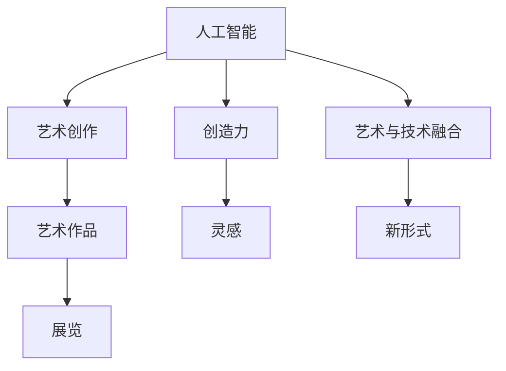

                 

# AI在艺术创作中的角色：工具还是合作者

## 1. 背景介绍

### 1.1 问题由来

随着人工智能技术的不断突破，越来越多的艺术创作开始融合AI元素。艺术家们利用AI生成图像、音乐、文本等内容，甚至借助AI进行创作灵感激发和风格迁移。AI在艺术创作中的角色已经不仅仅是“工具”，而是逐渐成为艺术家们的“合作者”。然而，关于AI在艺术创作中究竟是“工具”还是“合作者”的争论仍然存在。一方面，许多人认为AI只是辅助工具，真正的艺术创作离不开人的灵感和情感；另一方面，也有艺术家和研究人员认为，AI可以提供新的视角和创意，本身就是创作的一部分。

### 1.2 问题核心关键点

为了更好地理解AI在艺术创作中的角色，我们首先要明确以下几个核心问题：

- AI在艺术创作中扮演的角色是什么？是单纯的工具，还是具有自主创造能力的合作者？
- AI与人类艺术家的合作方式有哪些？
- AI在艺术创作中的优缺点是什么？
- AI在艺术创作中的应用场景有哪些？

## 2. 核心概念与联系

### 2.1 核心概念概述

为了清晰地理解AI在艺术创作中的角色，我们需要先介绍一些核心概念：

- 人工智能（Artificial Intelligence, AI）：一种模拟人类智能行为的技术，能够通过学习、推理、决策等过程，自动完成复杂任务。
- 艺术创作：包括绘画、雕塑、音乐、文学等多种形式，是艺术家表达自我、传递情感、传达思想的过程。
- 创造力（Creativity）：人类或机器在创作过程中产生新颖、独特、有价值的想法和作品的能力。
- 艺术与技术的融合：将人工智能技术应用于艺术创作中，提升创作效率和作品质量，探索新的艺术表现形式。

### 2.2 核心概念原理和架构的 Mermaid 流程图



这个流程图展示了AI在艺术创作中的核心概念和它们之间的联系：

1. AI作为技术手段，应用于艺术创作中。
2. AI可以激发创造力，提供新的灵感。
3. 艺术创作的结果是艺术作品。
4. 艺术与技术的融合产生了新的艺术表现形式。
5. 艺术作品通过展览等形式展现给公众。

## 3. 核心算法原理 & 具体操作步骤

### 3.1 算法原理概述

AI在艺术创作中的角色，主要取决于其在创作过程中的参与程度和影响方式。以下是一些常见的AI在艺术创作中的算法原理：

- 生成对抗网络（Generative Adversarial Networks, GANs）：通过两个神经网络（生成器和判别器）的对抗训练，生成高质量的艺术作品。
- 风格迁移（Style Transfer）：将一幅艺术作品的风格应用到另一幅作品上，创造出新的艺术形式。
- 音乐生成（Music Generation）：通过学习大量音乐作品，生成新的音乐旋律和节奏。
- 文本创作（Text Generation）：基于语言模型生成诗歌、小说等内容。
- 视觉艺术创作（Visual Arts Creation）：利用图像生成模型（如GANs）创作绘画、雕塑等作品。

### 3.2 算法步骤详解

以生成对抗网络（GANs）为例，详细讲解其算法步骤：

1. 准备数据集：收集艺术作品的高质量数据集，如绘画、照片等。
2. 定义生成器和判别器：设计生成器和判别器的网络结构，通常是卷积神经网络（Convolutional Neural Networks, CNNs）。
3. 初始化参数：随机初始化生成器和判别器的参数。
4. 对抗训练：通过不断更新生成器和判别器的参数，使得生成器生成的作品能够欺骗判别器，从而生成高质量的艺术作品。
5. 作品生成：训练完成后，使用生成器生成新的艺术作品。

### 3.3 算法优缺点

GANs在艺术创作中具有以下优点：

- 可以生成高质量的艺术作品，尤其是那些难以通过传统方式创作的艺术形式。
- 能够探索和发现新的艺术风格和表现形式。

然而，GANs也存在一些缺点：

- 训练过程不稳定，容易陷入模式崩溃。
- 生成作品的质量和多样性依赖于训练数据集的质量和数量。
- 生成的作品可能缺乏人类的情感和艺术家的个人风格。

### 3.4 算法应用领域

GANs和风格迁移等算法已经在艺术创作中得到了广泛应用，包括：

- 绘画和视觉艺术创作：通过GANs生成新的绘画作品，风格迁移技术可以将一种风格的艺术作品应用到另一种风格上。
- 音乐创作：利用GANs和音乐生成模型创作新的音乐作品，探索新的音乐风格。
- 文学创作：基于语言模型的文本生成技术，创作诗歌、小说等内容。
- 电影和视频制作：使用GANs和风格迁移技术，创作新的电影片段和视频效果。

## 4. 数学模型和公式 & 详细讲解

### 4.1 数学模型构建

GANs的数学模型主要包含两个部分：生成器（Generator, G）和判别器（Discriminator, D）。

生成器的目标是生成逼真的艺术作品，其数学模型可以表示为：

$$ G_{\theta_G}(x) = \mu_{z \sim p(z)} \rightarrow x $$

其中，$x$为生成的艺术作品，$z$为随机噪声向量，$\theta_G$为生成器的参数。

判别器的目标是区分真实作品和生成作品，其数学模型可以表示为：

$$ D_{\theta_D}(x) = p(x|real) - p(x|fake) $$

其中，$real$表示真实作品，$fake$表示生成作品，$p(x|real)$和$p(x|fake)$为判别器对真实作品和生成作品的概率预测。

GANs的训练目标是最大化生成器生成假艺术作品欺骗判别器的概率，即：

$$ \min_{G} \max_{D} \mathbb{E}_{x \sim p(x|real)}[D(x)] + \mathbb{E}_{z \sim p(z)}[D(G(z))] $$

### 4.2 公式推导过程

GANs的训练过程包含以下几个步骤：

1. 固定判别器，更新生成器：
   $$ \nabla_{\theta_G} \mathbb{E}_{z \sim p(z)}[D(G(z))] $$

2. 固定生成器，更新判别器：
   $$ \nabla_{\theta_D} \mathbb{E}_{x \sim p(x|real)}[D(x)] + \mathbb{E}_{z \sim p(z)}[D(G(z))] $$

3. 交替优化生成器和判别器，直到收敛。

### 4.3 案例分析与讲解

以GANs生成绘画作品为例，具体步骤如下：

1. 准备绘画数据集。
2. 设计生成器和判别器的神经网络结构，通常使用CNNs。
3. 初始化生成器和判别器的参数。
4. 对抗训练：固定判别器，优化生成器；固定生成器，优化判别器。
5. 生成新的绘画作品：使用训练好的生成器，生成高质量的绘画作品。

## 5. 项目实践：代码实例和详细解释说明

### 5.1 开发环境搭建

为了进行GANs的实践，我们需要搭建一个Python开发环境。以下是具体的步骤：

1. 安装Python和相关依赖包：使用Anaconda或Miniconda，安装Python 3.7及以上版本，以及TensorFlow、Keras等深度学习库。
2. 安装GANs相关的库：如TensorFlow-GAN、PyTorch-GAN等。
3. 搭建GPU环境：安装NVIDIA GPU驱动和CUDA工具包，确保GPU能够被程序使用。

### 5.2 源代码详细实现

以下是一个简单的GANs代码实现，用于生成绘画作品：

```python
import tensorflow as tf
from tensorflow.keras import layers, models

# 定义生成器
def build_generator():
    model = models.Sequential()
    model.add(layers.Dense(256, input_dim=100))
    model.add(layers.LeakyReLU(alpha=0.2))
    model.add(layers.Dense(512))
    model.add(layers.LeakyReLU(alpha=0.2))
    model.add(layers.Dense(784, activation='tanh'))
    model.add(layers.Reshape((28, 28, 1)))
    return model

# 定义判别器
def build_discriminator():
    model = models.Sequential()
    model.add(layers.Conv2D(64, (3, 3), strides=(2, 2), padding='same', input_shape=(28, 28, 1)))
    model.add(layers.LeakyReLU(alpha=0.2))
    model.add(layers.Dropout(0.3))
    model.add(layers.Conv2D(128, (3, 3), strides=(2, 2), padding='same'))
    model.add(layers.LeakyReLU(alpha=0.2))
    model.add(layers.Dropout(0.3))
    model.add(layers.Flatten())
    model.add(layers.Dense(1, activation='sigmoid'))
    return model

# 训练GANs
def train_gans(generator, discriminator, dataset):
    for epoch in range(100):
        for batch in dataset:
            # 生成假数据
            noise = tf.random.normal([batch_size, 100])
            generated_images = generator(noise)
            
            # 训练判别器
            real_images = batch
            real_labels = tf.ones((batch_size, 1))
            fake_labels = tf.zeros((batch_size, 1))
            d_loss_real = discriminator.train_on_batch(real_images, real_labels)
            d_loss_fake = discriminator.train_on_batch(generated_images, fake_labels)
            d_loss = 0.5 * (d_loss_real + d_loss_fake)
            
            # 训练生成器
            g_loss = discriminator.train_on_batch(generated_images, fake_labels)
            
        print('Epoch:', epoch+1, 'd_loss:', d_loss, 'g_loss:', g_loss)
```

### 5.3 代码解读与分析

**build_generator函数**：
- 定义生成器网络结构，包括全连接层、LeakyReLU激活函数、Dropout等。
- 最终生成28x28x1的图像。

**build_discriminator函数**：
- 定义判别器网络结构，包括卷积层、LeakyReLU激活函数、Dropout等。
- 最终输出1个sigmoid激活函数的预测结果。

**train_gans函数**：
- 训练GANs模型，包含生成器和判别器的对抗训练。
- 每次迭代生成假数据，训练判别器，更新生成器参数。

## 6. 实际应用场景

### 6.1 数字艺术创作

数字艺术创作是AI在艺术创作中应用最为广泛的场景之一。艺术家们可以利用GANs、风格迁移等技术，生成高质量的数字艺术作品，或者将传统艺术作品进行数字化处理，创作新的艺术形式。

### 6.2 艺术教育

AI在艺术教育中也有着广泛的应用。例如，使用GANs生成的艺术作品作为教学素材，帮助学生更好地理解艺术创作过程和技法。此外，AI还可以根据学生的创作风格，提供个性化的创作建议和指导。

### 6.3 虚拟现实（VR）和增强现实（AR）

虚拟现实和增强现实技术结合AI，可以提供更加沉浸式的艺术体验。例如，通过GANs生成逼真的艺术场景，或者将传统艺术作品进行虚拟展示，提升观众的艺术享受。

### 6.4 未来应用展望

未来，随着AI技术的发展，我们可以预见以下应用场景：

- 自适应艺术创作：AI能够根据艺术家的创作风格和偏好，自动生成建议，辅助艺术家创作。
- 跨文化艺术创作：利用多模态AI技术，将不同文化背景的艺术元素融合，创造出新的艺术形式。
- 交互式艺术作品：结合自然语言处理技术，创作出可以与观众互动的艺术作品。
- 个性化艺术推荐：利用推荐系统技术，根据观众的偏好推荐个性化的艺术作品。

## 7. 工具和资源推荐

### 7.1 学习资源推荐

为了深入理解AI在艺术创作中的角色，以下是一些推荐的学习资源：

1. 《深度学习》（Ian Goodfellow等）：全面介绍深度学习的基础知识和算法。
2. 《生成对抗网络》（Goodfellow等）：详细介绍GANs的原理和应用。
3. 《艺术与技术》（Sebastian Thrun等）：探讨艺术与技术融合的未来趋势。
4. Coursera《深度学习专项课程》：由斯坦福大学和DeepMind等机构提供，涵盖深度学习的多个主题。
5. Kaggle：提供大量数据集和竞赛平台，可以实践和验证AI在艺术创作中的应用。

### 7.2 开发工具推荐

以下是一些常用的开发工具和库，可以帮助进行AI在艺术创作中的应用开发：

1. TensorFlow：由Google开发的深度学习框架，支持分布式训练和多种模型。
2. Keras：基于TensorFlow的高级API，简单易用。
3. PyTorch：由Facebook开发的深度学习框架，支持动态图和静态图。
4. OpenAI GPT系列：开源的文本生成模型，可以用于创作诗歌、小说等。
5. Adobe Creative Cloud：包括Photoshop、Illustrator等软件，可以进行图像处理和创作。

### 7.3 相关论文推荐

以下是一些重要的相关论文，可以进一步深入理解AI在艺术创作中的角色：

1. Progressive Growing of GANs for Improved Quality, Stability, and Variation（Goodfellow等）：提出渐进式增长的GANs，提高生成作品的稳定性和多样性。
2. StyleGAN: Generative Adversarial Networks Make Style Transfer Accessible to All（Karras等）：提出StyleGAN，用于生成高质量的图像作品，并进行风格迁移。
3. CGAN: Conditional Generative Adversarial Nets（Mirza和Osindero）：提出条件生成对抗网络，生成具有特定属性的图像作品。
4. The Unreasonable Effectiveness of Transfer Learning in NLP（Gao等）：探讨迁移学习在自然语言处理中的应用，包括微调和少样本学习。
5. Creativity in Human-AI Collaboration: Cognition, Aesthetics, and Affective Design（Torralba和Bengio）：探讨人类与AI在艺术创作中的合作，以及情感在创作中的作用。

## 8. 总结：未来发展趋势与挑战

### 8.1 总结

本文详细介绍了AI在艺术创作中的角色，探讨了其作为“工具”和“合作者”的不同方式。通过系统讲解GANs等算法原理，提供了项目实践的代码实例，并展望了未来应用场景。本文还推荐了相关的学习资源、开发工具和论文，以供深入学习和实践。

### 8.2 未来发展趋势

未来，AI在艺术创作中的角色将更加深入和多样化。以下是一些未来趋势：

1. 自动化艺术创作：AI将能够自动创作出高质量的艺术作品，甚至在某些领域超越人类艺术家。
2. 跨模态艺术创作：结合图像、音乐、文字等多种模态，创作出更加多样化的艺术形式。
3. 个性化艺术创作：利用AI技术，根据观众的偏好和需求，创作个性化的艺术作品。
4. 情感驱动的艺术创作：结合情感计算技术，创作出具有情感共鸣的艺术作品。
5. 交互式艺术体验：利用虚拟现实和增强现实技术，创作出可交互的艺术作品。

### 8.3 面临的挑战

尽管AI在艺术创作中具有广阔的应用前景，但也面临一些挑战：

1. 艺术创作的主观性和情感表达：AI难以完全理解人类艺术家的创作意图和情感表达。
2. 数据多样性和质量：AI需要高质量的多样化数据集进行训练，才能生成高质量的艺术作品。
3. 技术的可解释性和透明性：AI创作的艺术作品难以解释其创作过程和原因，缺乏透明性。
4. 法律和伦理问题：AI创作的艺术作品可能涉及版权和伦理问题，需要制定相应的法律法规。

### 8.4 研究展望

未来，需要更多的研究来解决上述挑战，推动AI在艺术创作中的健康发展。以下是一些研究方向：

1. 情感计算与AI艺术创作：结合情感计算技术，创作出具有情感共鸣的艺术作品。
2. 跨模态艺术创作：结合图像、音乐、文字等多种模态，创作出更加多样化的艺术形式。
3. 交互式艺术体验：利用虚拟现实和增强现实技术，创作出可交互的艺术作品。
4. 自动化艺术创作：提高AI创作的艺术作品质量和多样性，甚至在某些领域超越人类艺术家。
5. 法律和伦理问题：制定相应的法律法规，保护AI创作的艺术作品的版权和伦理问题。

这些研究方向将有助于解决AI在艺术创作中面临的挑战，推动AI艺术创作的广泛应用和健康发展。

## 9. 附录：常见问题与解答

**Q1: AI在艺术创作中的角色是什么？**

A: AI在艺术创作中的角色可以从工具和合作者两个方面理解。作为工具，AI可以辅助艺术家进行创作，提供生成、设计、编辑等功能；作为合作者，AI能够与艺术家共同创作，产生新的艺术形式和风格。

**Q2: AI在艺术创作中面临哪些挑战？**

A: AI在艺术创作中面临的主要挑战包括数据多样性和质量、技术可解释性和透明性、艺术创作的主观性和情感表达等。这些挑战需要通过不断优化算法、提高数据质量、引入情感计算等技术手段来解决。

**Q3: AI在艺术创作中未来的发展方向是什么？**

A: AI在艺术创作中的未来发展方向包括自动化艺术创作、跨模态艺术创作、个性化艺术创作、情感驱动的艺术创作、交互式艺术体验等。这些方向将推动AI在艺术创作中的广泛应用和健康发展。

---

作者：禅与计算机程序设计艺术 / Zen and the Art of Computer Programming

