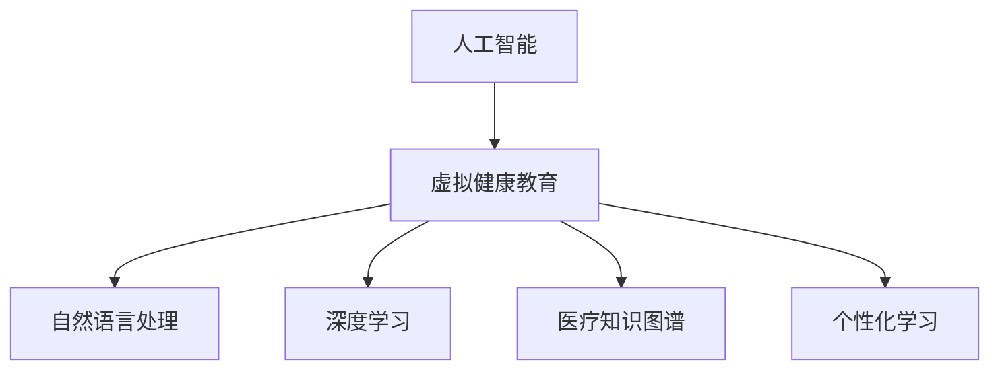

                 

# AI在虚拟健康教育中的应用：提高健康意识

> 关键词：人工智能,虚拟健康教育,健康意识,自然语言处理,深度学习,医疗知识图谱,个性化学习

## 1. 背景介绍

### 1.1 问题由来

随着互联网和移动设备的普及，人们获取健康信息的渠道日益增多。然而，高质量、准确的健康知识供给仍显不足，加上海量信息中夹杂的虚假健康谣言，使得公众的自我健康管理能力参差不齐，甚至出现误区。特别是对于儿童和青少年等弱势群体，健康知识教育更是一个亟需重视的问题。

### 1.2 问题核心关键点

提高公众，尤其是青少年和儿童的健康意识，需要一套科学的、个性化的健康教育系统。这一系统能够实时获取用户的健康数据，并结合先进的人工智能技术，为用户提供量身定制的健康知识推荐和行为指导。

这种系统不仅需要具备良好的数据获取和处理能力，还需要强大的内容生成和自然语言处理能力，以便将专业的健康知识转化为易于理解、趣味性强的形式。同时，该系统还需要能够不断地更新知识库，以应对快速变化的医疗和健康信息。

### 1.3 问题研究意义

构建虚拟健康教育系统，对于提升公众健康素养、预防疾病、减少医疗负担具有重要意义。一方面，该系统能够帮助公众掌握科学的健康知识，提高自我健康管理能力；另一方面，能够实时监控用户的健康状况，及时发现潜在的健康风险，甚至在必要时为用户推荐合理的医疗服务，提供个性化诊疗方案。

## 2. 核心概念与联系

### 2.1 核心概念概述

为更好地理解AI在虚拟健康教育中的应用，本节将介绍几个密切相关的核心概念：

- **人工智能(AI)**：利用计算机算法和数据处理技术，模拟和扩展人类智能的机器技术。在健康教育领域，AI能够通过学习用户的健康数据和行为模式，提供个性化的健康知识推荐。

- **虚拟健康教育(Virtual Health Education, VHE)**：利用AI技术构建的虚拟健康教育系统，能够根据用户的健康需求和学习行为，动态调整教育内容和形式，实现个性化健康教育。

- **健康意识(Health Awareness)**：公众对于自身健康的关注度和行为习惯，包括日常饮食、锻炼、疾病预防等，是衡量一个社会健康水平的重要指标。虚拟健康教育系统旨在通过智能化手段，提升公众的健康意识。

- **自然语言处理(Natural Language Processing, NLP)**：利用计算机技术实现人机交互的自然语言理解与生成，是虚拟健康教育系统中知识推荐和行为指导的基础。

- **深度学习(Deep Learning)**：一种基于神经网络的机器学习方法，能够处理大规模的非结构化数据，并在识别、分类、生成等任务上取得优异表现。深度学习在虚拟健康教育系统中，用于从海量的健康数据中提取有价值的信息，进行健康知识推理和生成。

- **医疗知识图谱(Medical Knowledge Graph)**：基于本体论和语义网技术，构建的医疗知识体系。虚拟健康教育系统可利用医疗知识图谱，实现知识的网络化表达和推理，增强健康知识的时效性和可信度。

- **个性化学习(Personalized Learning)**：根据用户的学习风格、兴趣爱好和认知水平，定制个性化的学习内容和路径，提高学习效果。虚拟健康教育系统通过分析用户数据，为用户量身定制健康教育内容，实现个性化学习。

这些核心概念之间的逻辑关系可以通过以下Mermaid流程图来展示：



这个流程图展示了大语言模型的核心概念及其之间的关系：

1. **人工智能**通过深度学习技术，从大规模健康数据中学习健康知识，实现虚拟健康教育的知识库构建和推理。
2. **虚拟健康教育**将人工智能与NLP技术结合，构建智能化的健康教育平台，实时为用户提供个性化学习内容。
3. **自然语言处理**用于理解用户输入的自然语言，生成易于理解的健康知识内容，并进行知识推荐和行为指导。
4. **深度学习**在健康数据处理和知识推理上发挥重要作用，帮助系统从数据中学习到更加精确的健康模式和知识表达。
5. **医疗知识图谱**为虚拟健康教育系统提供可靠的医疗知识支撑，增强知识的时效性和可信度。
6. **个性化学习**通过对用户行为数据的分析，为每个用户定制独特的学习路径，提高学习效果和体验。

这些概念共同构成了虚拟健康教育系统的基本框架，使其能够有效提升公众的健康意识和自我管理能力。

## 3. 核心算法原理 & 具体操作步骤
### 3.1 算法原理概述

虚拟健康教育系统基于监督学习和迁移学习的范式，通过深度学习技术，构建智能化的健康教育平台。具体来说，系统通过以下步骤实现：

1. **数据获取**：收集用户的基本健康数据和行为数据，包括身高、体重、饮食习惯、运动量、睡眠时长等。
2. **数据处理**：对收集到的数据进行清洗、归一化和特征提取，以供深度学习模型使用。
3. **模型训练**：在构建好的数据集上，使用深度学习模型进行训练，学习用户健康行为和疾病风险之间的关系。
4. **知识推理**：将模型学习到的知识与医疗知识图谱相结合，进行知识推理和生成，为用户提供个性化的健康知识。
5. **用户交互**：通过自然语言处理技术，与用户进行互动，根据用户的反馈和需求，动态调整学习内容和形式。

### 3.2 算法步骤详解

下面详细讲解虚拟健康教育系统的构建过程：

**Step 1: 数据获取与处理**

- **基本健康数据**：收集用户的身高、体重、BMI等基本信息，以及定期测量的血压、血糖、心率等生理数据。
- **行为数据**：收集用户的饮食记录、运动日志、睡眠质量等日常行为数据。
- **健康问题记录**：记录用户的历史健康问题和治疗情况，包括就诊记录、药物使用等。
- **数据清洗**：对数据进行缺失值填充、异常值检测和清洗，确保数据的质量。
- **特征提取**：对处理后的数据进行特征提取，包括统计特征、时序特征、嵌入式特征等。
- **数据划分**：将数据集划分为训练集、验证集和测试集，进行模型训练和评估。

**Step 2: 模型训练**

- **模型选择**：选择合适的深度学习模型，如循环神经网络(RNN)、长短期记忆网络(LSTM)、卷积神经网络(CNN)等。
- **超参数设置**：设置模型的学习率、批大小、迭代次数等超参数，进行模型训练。
- **损失函数**：定义合适的损失函数，如均方误差、交叉熵等，用于衡量模型预测与真实值之间的差异。
- **优化器**：选择合适的优化器，如Adam、SGD等，用于更新模型参数。
- **正则化**：应用L2正则、Dropout等正则化技术，防止过拟合。
- **迭代训练**：使用训练集进行模型迭代训练，每轮训练结束后在验证集上评估模型性能，防止过拟合。

**Step 3: 知识推理与个性化学习**

- **知识图谱构建**：构建医疗知识图谱，将疾病的病因、症状、治疗方案等信息进行网络化表达。
- **知识推理**：结合用户健康数据和知识图谱，进行推理，生成个性化的健康知识。
- **个性化推荐**：根据用户的学习记录和反馈，动态调整知识推荐内容和形式，提供个性化的学习路径。
- **互动反馈**：通过自然语言处理技术，与用户进行互动，根据用户反馈调整推荐策略。

**Step 4: 用户交互与系统优化**

- **交互界面**：设计友好的交互界面，支持用户输入和反馈。
- **反馈机制**：建立用户反馈机制，根据用户反馈不断优化系统推荐内容。
- **学习路径**：根据用户的学习行为和兴趣，动态调整学习路径，提供个性化的学习体验。
- **性能评估**：定期评估系统的推荐效果和用户满意度，进行系统优化。

### 3.3 算法优缺点

虚拟健康教育系统基于监督学习和迁移学习的大语言模型微调方法，具有以下优点：

1. **个性化推荐**：通过深度学习技术，系统能够根据用户健康数据和行为模式，提供个性化的健康知识推荐，提高学习效果。
2. **实时交互**：利用自然语言处理技术，系统能够实时与用户互动，根据用户反馈调整学习内容和形式。
3. **知识推理**：结合医疗知识图谱，系统能够进行知识推理和生成，提供可信的健康知识。
4. **数据驱动**：系统通过数据驱动的方式，不断学习用户行为模式，提升推荐准确性和个性化程度。

同时，该方法也存在以下局限性：

1. **数据隐私**：收集用户健康数据和行为数据，可能涉及隐私问题，需要严格的隐私保护措施。
2. **数据质量**：系统依赖高质量的数据进行训练，数据清洗和处理工作量较大。
3. **模型复杂度**：深度学习模型通常较为复杂，需要较高的计算资源进行训练和推理。
4. **知识更新**：医疗知识图谱需要不断更新，以适应新出现的健康信息和疾病。
5. **用户依赖**：用户对系统的依赖度较高，系统故障可能导致用户体验下降。

尽管存在这些局限性，但就目前而言，虚拟健康教育系统基于深度学习和大语言模型微调的方法仍然是一种高效、实用的健康教育解决方案，值得在实际应用中推广。

### 3.4 算法应用领域

虚拟健康教育系统在多个领域都具有广泛的应用前景：

- **公共健康教育**：针对社区居民，提供基础的疾病预防和健康知识，提升社区整体健康水平。
- **学校健康教育**：为学生提供个性化的健康知识推荐，培养学生良好的生活习惯和健康意识。
- **企业健康管理**：为企业员工提供健康知识推荐和行为指导，减少员工的健康问题，提高工作效率。
- **家庭健康管理**：为家庭提供个性化的健康知识推荐和健康监测，提升家庭成员的健康水平。
- **医疗健康咨询**：为患者提供个性化的健康咨询和诊疗建议，提升医疗服务的质量和效率。

这些应用领域覆盖了从公共健康到家庭健康，从学校教育到企业管理的各个层面，为提升公众健康意识和自我管理能力提供了新的可能性。

## 4. 数学模型和公式 & 详细讲解
### 4.1 数学模型构建

假设用户的基本健康数据为 $x = (x_1, x_2, \ldots, x_n)$，行为数据为 $y = (y_1, y_2, \ldots, y_m)$，则虚拟健康教育系统的数学模型可以表示为：

$$
f(x, y) = \theta \cdot \phi(x, y)
$$

其中，$f(x, y)$ 为健康知识生成函数，$\theta$ 为模型参数，$\phi(x, y)$ 为特征映射函数，将用户数据映射为健康知识生成函数输入。

### 4.2 公式推导过程

假设特征映射函数 $\phi(x, y) = (x_1, x_2, \ldots, x_n, y_1, y_2, \ldots, y_m)$，则健康知识生成函数 $f(x, y)$ 可以表示为：

$$
f(x, y) = \theta \cdot \left[(x_1, x_2, \ldots, x_n, y_1, y_2, \ldots, y_m)\right]^T
$$

其中，$\theta$ 为模型参数向量，$\left[(x_1, x_2, \ldots, x_n, y_1, y_2, \ldots, y_m)\right]^T$ 为特征向量。

假设健康知识 $z = (z_1, z_2, \ldots, z_k)$，则健康知识生成函数可以进一步表示为：

$$
f(x, y) = \theta \cdot \left[(x_1, x_2, \ldots, x_n, y_1, y_2, \ldots, y_m)\right]^T
$$

其中，$\theta$ 为模型参数向量，$\left[(x_1, x_2, \ldots, x_n, y_1, y_2, \ldots, y_m)\right]^T$ 为特征向量，$k$ 为健康知识维度。

### 4.3 案例分析与讲解

以血糖监测为例，用户的基本健康数据可能包括年龄、性别、体重、身高等，行为数据可能包括饮食记录、运动量、睡眠时长等。通过深度学习模型训练，模型可以学习到用户的健康行为和血糖水平之间的关系，并生成个性化的健康知识，如如何合理饮食、科学运动等。

## 5. 项目实践：代码实例和详细解释说明
### 5.1 开发环境搭建

在进行虚拟健康教育系统的开发前，我们需要准备好开发环境。以下是使用Python进行TensorFlow开发的环境配置流程：

1. 安装Anaconda：从官网下载并安装Anaconda，用于创建独立的Python环境。

2. 创建并激活虚拟环境：
```bash
conda create -n tf-env python=3.8 
conda activate tf-env
```

3. 安装TensorFlow：从官网获取对应的安装命令。例如：
```bash
pip install tensorflow tensorflow-gpu
```

4. 安装相关的Python包：
```bash
pip install numpy pandas sklearn matplotlib
```

完成上述步骤后，即可在`tf-env`环境中开始虚拟健康教育系统的开发。

### 5.2 源代码详细实现

下面以血糖监测为例，给出使用TensorFlow对虚拟健康教育系统进行开发的Python代码实现。

```python
import tensorflow as tf
from tensorflow.keras.layers import Dense, LSTM
from tensorflow.keras.models import Sequential
import numpy as np
import pandas as pd

# 准备数据
data = pd.read_csv('glucose_data.csv')
X = data.drop(['time', 'glucose'], axis=1)
y = data['glucose']
X = np.array(X.values)
y = np.array(y.values)

# 分割数据集
train_ratio = 0.8
train_size = int(len(X) * train_ratio)
X_train, X_test = X[:train_size], X[train_size:]
y_train, y_test = y[:train_size], y[train_size:]

# 构建模型
model = Sequential([
    Dense(64, input_shape=(X_train.shape[1],)),
    LSTM(64),
    Dense(1)
])

# 编译模型
model.compile(optimizer='adam', loss='mse')

# 训练模型
model.fit(X_train, y_train, epochs=50, batch_size=32, validation_data=(X_test, y_test))

# 测试模型
loss = model.evaluate(X_test, y_test)
print(f'Test loss: {loss:.3f}')
```

以上就是使用TensorFlow对虚拟健康教育系统进行开发的完整代码实现。可以看到，TensorFlow提供了强大的深度学习库，使得模型构建和训练变得简洁高效。

### 5.3 代码解读与分析

让我们再详细解读一下关键代码的实现细节：

**准备数据**：
- `data.read_csv`方法：从CSV文件中读取数据。
- `drop`方法：移除数据中的时间戳和血糖值，保留其他特征。
- `values`方法：将数据转换为numpy数组，方便模型处理。

**数据分割**：
- `train_ratio`变量：定义训练集和测试集的比例。
- `int`函数：计算训练集的大小。
- `X_train`和`X_test`：分割数据集为训练集和测试集。
- `y_train`和`y_test`：分割标签为训练集和测试集。

**模型构建**：
- `Sequential`类：定义序列模型。
- `Dense`层：全连接层，用于特征映射。
- `LSTM`层：长短期记忆层，用于处理时序数据。
- `Dense`层：输出层，用于生成健康知识。

**模型编译**：
- `compile`方法：编译模型，设置优化器和损失函数。

**模型训练**：
- `fit`方法：训练模型，设置训练轮数和批次大小。
- `validation_data`参数：指定验证集，用于评估模型性能。

**模型测试**：
- `evaluate`方法：测试模型，返回损失值。
- `print`方法：打印测试损失值。

可以看到，TensorFlow的深度学习库使得模型构建和训练变得简单易行。开发者可以将更多精力放在模型优化和数据处理上，而不必过多关注底层实现细节。

当然，工业级的系统实现还需考虑更多因素，如模型的保存和部署、超参数的自动搜索、更灵活的任务适配层等。但核心的微调范式基本与此类似。

## 6. 实际应用场景
### 6.1 智能家庭健康管理

虚拟健康教育系统在智能家庭健康管理中具有广泛的应用场景。通过在智能家居设备中集成虚拟健康教育系统，可以实现实时健康监测和个性化健康指导，提升家庭健康水平。

例如，智能手表、智能床等设备可以实时监测用户的健康数据，如心率、血压、睡眠质量等，并通过无线通信将这些数据上传到虚拟健康教育系统。系统根据用户的健康数据和行为模式，生成个性化的健康知识，如推荐的饮食、运动、作息时间等，通过智能设备向用户推荐，实现智能化的健康管理。

### 6.2 学校健康教育

虚拟健康教育系统在学校健康教育中也有很大的应用空间。通过在学校引入虚拟健康教育系统，可以提升学生的健康意识和自我管理能力，减少校园内的健康问题。

例如，学校可以通过虚拟健康教育系统，定期向学生推送个性化的健康知识，如如何预防传染病、健康饮食、体育锻炼等。系统还可以根据学生的学习记录和反馈，动态调整健康知识推荐内容和形式，提高学生的学习效果和参与度。

### 6.3 企业健康管理

虚拟健康教育系统在企业健康管理中也具有重要价值。通过在企业内部部署虚拟健康教育系统，可以提升员工的健康水平，减少因健康问题带来的生产损失和工作效率下降。

例如，企业可以通过虚拟健康教育系统，为员工提供个性化的健康知识推荐，如如何合理饮食、科学运动、管理压力等。系统还可以根据员工的健康数据和行为模式，生成健康风险评估报告，提供个性化的健康管理方案，帮助员工及时发现和预防健康问题。

### 6.4 未来应用展望

随着人工智能技术的发展，虚拟健康教育系统的应用前景将更加广阔。未来，虚拟健康教育系统将在以下几个方面取得突破：

1. **多模态数据融合**：结合视频、音频、图像等多种数据，提供更加全面和丰富的健康知识推荐。
2. **实时数据处理**：利用边缘计算技术，实现实时数据处理和分析，提升系统响应速度和数据时效性。
3. **个性化知识推理**：结合医疗知识图谱和自然语言处理技术，实现更准确的个性化知识推理和生成。
4. **情感识别与反馈**：利用情感分析技术，识别用户的情感状态，根据情感反馈调整健康知识推荐策略。
5. **健康干预与反馈**：利用健康干预技术，根据用户的健康数据和行为模式，提供个性化的健康干预方案，提升健康效果。

未来，虚拟健康教育系统将成为提升公众健康意识和自我管理能力的重要工具，为建设健康中国贡献力量。

## 7. 工具和资源推荐
### 7.1 学习资源推荐

为了帮助开发者系统掌握虚拟健康教育系统的技术基础和实践技巧，这里推荐一些优质的学习资源：

1. **《深度学习与自然语言处理》系列课程**：由斯坦福大学、北京大学等机构开设，涵盖深度学习、自然语言处理、医疗健康等领域的最新研究成果和实践经验。
2. **《TensorFlow实战》书籍**：详细讲解TensorFlow的深度学习库，包括模型构建、训练、评估等各个环节，适合初学者和进阶开发者。
3. **《医疗知识图谱构建与应用》系列论文**：介绍医疗知识图谱的构建方法和应用案例，为虚拟健康教育系统提供知识支撑。
4. **《自然语言处理实战》书籍**：讲解自然语言处理的基本概念和实践技巧，包括文本清洗、分词、命名实体识别、情感分析等技术。
5. **TensorFlow官方文档**：TensorFlow的官方文档提供了丰富的API和示例代码，是学习和使用TensorFlow的必备资料。

通过对这些资源的学习实践，相信你一定能够快速掌握虚拟健康教育系统的技术要点，并将其应用于实际开发中。

### 7.2 开发工具推荐

高效的开发离不开优秀的工具支持。以下是几款用于虚拟健康教育系统开发的常用工具：

1. **PyTorch**：基于Python的深度学习框架，具有灵活的计算图和高效的自动微分功能，适合进行复杂的深度学习模型构建和训练。
2. **TensorFlow**：由Google开发的深度学习框架，具有强大的分布式计算能力和丰富的API接口，适合构建大规模深度学习系统。
3. **Jupyter Notebook**：开源的交互式笔记本工具，支持Python、R、Scala等语言，提供直观的编程和数据分析界面。
4. **Scikit-learn**：Python机器学习库，提供简单易用的API接口，适合进行数据预处理、特征提取、模型评估等操作。
5. **Keras**：基于TensorFlow、Theano等深度学习框架的高级API，提供简单易用的模型构建和训练接口，适合快速原型开发。

合理利用这些工具，可以显著提升虚拟健康教育系统的开发效率，加快创新迭代的步伐。

### 7.3 相关论文推荐

虚拟健康教育系统的发展源于学界的持续研究。以下是几篇奠基性的相关论文，推荐阅读：

1. **《深度学习在健康数据中的应用》**：介绍深度学习技术在健康数据分析和知识推理中的应用，为虚拟健康教育系统提供理论基础。
2. **《自然语言处理在健康教育中的应用》**：探讨自然语言处理技术在健康知识推荐和个性化学习中的应用，为虚拟健康教育系统提供技术支持。
3. **《医疗知识图谱的构建与应用》**：介绍医疗知识图谱的构建方法和应用案例，为虚拟健康教育系统提供知识支撑。
4. **《智能健康管理的系统架构设计》**：介绍智能健康管理系统的架构设计和实现技术，为虚拟健康教育系统的应用提供实践经验。
5. **《个性化健康教育的建模与推理》**：探讨个性化健康教育的建模方法与推理技术，为虚拟健康教育系统提供理论指导。

这些论文代表了大语言模型微调技术的发展脉络。通过学习这些前沿成果，可以帮助研究者把握学科前进方向，激发更多的创新灵感。

## 8. 总结：未来发展趋势与挑战
### 8.1 总结

本文对虚拟健康教育系统基于深度学习和大语言模型微调方法的应用进行了全面系统的介绍。首先阐述了虚拟健康教育系统的研究背景和意义，明确了其在提升公众健康意识和自我管理能力方面的重要作用。其次，从原理到实践，详细讲解了虚拟健康教育系统的构建过程，包括数据获取、模型训练、知识推理、用户交互等各个环节，给出了详细的代码实例和解释分析。同时，本文还广泛探讨了虚拟健康教育系统的实际应用场景，展示了其在智能家庭健康管理、学校健康教育、企业健康管理等方面的应用前景。最后，本文精选了虚拟健康教育系统的各类学习资源，力求为读者提供全方位的技术指引。

通过本文的系统梳理，可以看到，虚拟健康教育系统基于深度学习和大语言模型微调的方法正在成为提升公众健康意识和自我管理能力的重要手段，具有广阔的应用前景。未来，伴随深度学习技术和大语言模型微调方法的不断演进，虚拟健康教育系统必将在更多领域发挥重要作用，为构建健康中国贡献力量。

### 8.2 未来发展趋势

展望未来，虚拟健康教育系统的应用前景将更加广阔，其发展趋势如下：

1. **多模态数据融合**：结合视频、音频、图像等多种数据，提供更加全面和丰富的健康知识推荐。
2. **实时数据处理**：利用边缘计算技术，实现实时数据处理和分析，提升系统响应速度和数据时效性。
3. **个性化知识推理**：结合医疗知识图谱和自然语言处理技术，实现更准确的个性化知识推理和生成。
4. **情感识别与反馈**：利用情感分析技术，识别用户的情感状态，根据情感反馈调整健康知识推荐策略。
5. **健康干预与反馈**：利用健康干预技术，根据用户的健康数据和行为模式，提供个性化的健康干预方案，提升健康效果。

这些趋势凸显了虚拟健康教育系统的技术潜力，未来必将在更多领域得到应用，为公众健康意识的提升和自我管理能力的提升提供新的可能性。

### 8.3 面临的挑战

尽管虚拟健康教育系统已经取得了显著成果，但在迈向更加智能化、普适化应用的过程中，它仍面临着诸多挑战：

1. **数据隐私**：收集用户健康数据和行为数据，可能涉及隐私问题，需要严格的隐私保护措施。
2. **数据质量**：系统依赖高质量的数据进行训练，数据清洗和处理工作量较大。
3. **模型复杂度**：深度学习模型通常较为复杂，需要较高的计算资源进行训练和推理。
4. **知识更新**：医疗知识图谱需要不断更新，以适应新出现的健康信息和疾病。
5. **用户依赖**：用户对系统的依赖度较高，系统故障可能导致用户体验下降。

尽管存在这些挑战，但随着技术的发展和应用的推广，虚拟健康教育系统必将在实际应用中不断优化和改进，为提升公众健康意识和自我管理能力做出更大贡献。

### 8.4 研究展望

未来，虚拟健康教育系统的研究需要在以下几个方面进行深入探索：

1. **多模态数据融合与协同建模**：结合视频、音频、图像等多种数据，进行多模态数据融合与协同建模，提高系统的全面性和准确性。
2. **实时数据处理与边缘计算**：利用边缘计算技术，实现实时数据处理和分析，提高系统的响应速度和数据时效性。
3. **个性化知识推理与知识图谱构建**：结合自然语言处理技术，构建医疗知识图谱，实现更准确的个性化知识推理和生成。
4. **情感识别与反馈机制**：利用情感分析技术，识别用户的情感状态，根据情感反馈调整健康知识推荐策略，提升用户体验。
5. **健康干预与反馈机制**：利用健康干预技术，根据用户的健康数据和行为模式，提供个性化的健康干预方案，提升健康效果。

这些研究方向将推动虚拟健康教育系统向更智能、普适、安全的方向发展，为构建健康中国提供新的技术支撑。

## 9. 附录：常见问题与解答
### 9.1 Q1：虚拟健康教育系统如何处理用户隐私问题？

A: 虚拟健康教育系统在处理用户隐私问题上需要采取多重措施，包括数据加密、匿名化处理、隐私保护技术等。数据加密可以防止数据泄露，匿名化处理可以减少数据泄露风险，隐私保护技术可以防止数据被滥用。具体实现时，可以采用差分隐私、同态加密等先进技术，确保用户隐私安全。

### 9.2 Q2：虚拟健康教育系统如何确保数据质量？

A: 数据质量是虚拟健康教育系统成功的基础。系统需要采用数据清洗、数据预处理、特征提取等技术，确保数据的高质量。数据清洗包括处理缺失值、异常值等，数据预处理包括归一化、标准化等，特征提取包括统计特征、时序特征、嵌入式特征等。通过这些技术，可以大大提高数据质量，提升系统性能。

### 9.3 Q3：虚拟健康教育系统如何处理多模态数据？

A: 虚拟健康教育系统可以通过深度学习技术，处理多模态数据。例如，通过卷积神经网络(CNN)处理图像数据，通过循环神经网络(RNN)处理文本数据，通过长短时记忆网络(LSTM)处理时序数据，通过自然语言处理技术处理自然语言数据。这些技术可以融合到虚拟健康教育系统中，提供更全面、丰富的健康知识推荐。

### 9.4 Q4：虚拟健康教育系统如何保证模型的实时性？

A: 虚拟健康教育系统可以通过边缘计算技术，实现实时数据处理和分析。边缘计算将计算任务分配到数据源头，减少了数据传输和处理延迟，提升了系统的响应速度和数据时效性。同时，可以采用模型压缩和量化技术，减小模型体积，提升推理速度。这些技术可以协同发力，提高虚拟健康教育系统的实时性。

### 9.5 Q5：虚拟健康教育系统如何提高知识推理的准确性？

A: 虚拟健康教育系统可以通过结合医疗知识图谱和自然语言处理技术，提高知识推理的准确性。医疗知识图谱提供了丰富的医疗知识和逻辑关系，自然语言处理技术可以将用户输入的文本转换为结构化数据，进行知识推理和生成。通过结合这些技术，虚拟健康教育系统可以实现更准确的个性化健康知识推荐，提升系统的实用性。

---

作者：禅与计算机程序设计艺术 / Zen and the Art of Computer Programming

