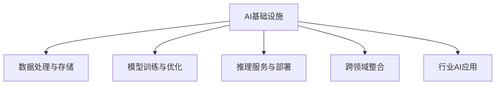

                 

# AI基础设施的行业应用：Lepton AI的垂直领域探索

> 关键词：AI基础设施、垂直领域、Lepton AI、行业应用、技术栈、深度学习、自然语言处理、计算机视觉、边缘计算、云服务

## 1. 背景介绍

### 1.1 问题由来
随着人工智能(AI)技术的飞速发展，AI基础设施建设已成为各行业数字化转型升级的核心驱动力。AI基础设施不仅是AI模型训练和推理的基础设施，更是支撑行业应用创新、数据价值挖掘的关键。

然而，面对海量、多源、异构的数据，如何在不同垂直领域构建高效、可扩展、易维护的AI基础设施，成为了一个极具挑战性的话题。特别是对于金融、医疗、制造、零售等复杂行业，AI基础设施的构建涉及众多技术和应用场景，需要集成多种AI技术、整合海量数据、实现高性能计算，最终服务于业务需求。

Lepton AI作为一家专注于AI基础设施构建的公司，其核心使命是通过构建垂直到顶的AI技术栈，解决行业AI应用中的痛点，推动AI技术与行业应用的深度融合。本文将围绕Lepton AI在垂直领域的探索实践，详细介绍其在AI基础设施构建方面的核心技术和应用案例，为AI技术的行业应用提供重要参考。

### 1.2 问题核心关键点
构建高效的AI基础设施，主要涉及以下几个关键点：

- **数据处理与存储**：保证数据的可靠、高效存储与处理。
- **模型训练与优化**：实现模型的高效训练与优化，降低计算资源消耗。
- **推理服务与部署**：构建可扩展、高性能的推理服务，加速模型在生产环境中的应用。
- **跨领域整合**：集成多种AI技术，实现多模态数据的协同处理。
- **行业应用支撑**：紧密结合行业需求，构建定制化的AI解决方案。

本文将从这些关键点出发，系统阐述Lepton AI在垂直领域的应用探索，以及如何通过构建完善的AI基础设施，提升AI技术的行业应用价值。

## 2. 核心概念与联系

### 2.1 核心概念概述

为更好地理解Lepton AI的垂直领域探索，本节将介绍几个密切相关的核心概念：

- **AI基础设施**：指支撑AI模型训练、推理、部署、管理的软硬件系统，包括数据存储、计算集群、模型仓库、运维平台等。
- **垂直领域AI技术栈**：根据特定行业的应用需求，集成多种AI技术，如深度学习、自然语言处理、计算机视觉、边缘计算等，构建专属的AI技术体系。
- **多模态数据融合**：结合不同类型的数据，如文本、图像、语音、视频等，进行统一处理和分析，挖掘更深层次的知识。
- **AI推理服务**：提供基于云、边、端的推理服务，加速模型在实际业务中的应用。
- **行业AI应用**：针对特定行业的应用场景，构建定制化的AI解决方案，解决行业特定问题。

这些核心概念之间的逻辑关系可以通过以下Mermaid流程图来展示：



这个流程图展示了两层概念之间的联系：

- AI基础设施构建了数据、模型、计算资源等底层能力。
- 通过模型训练与优化、推理服务与部署、跨领域整合、行业AI应用等上层功能，进一步提升AI基础设施的价值。

## 3. 核心算法原理 & 具体操作步骤

### 3.1 算法原理概述

Lepton AI的垂直领域探索主要围绕以下几个核心算法原理展开：

1. **深度学习框架集成**：使用TensorFlow、PyTorch等深度学习框架，实现模型的高效训练与优化。
2. **自然语言处理技术**：应用Transformer、BERT等模型，处理自然语言数据。
3. **计算机视觉算法**：利用卷积神经网络、循环神经网络等模型，处理图像、视频等视觉数据。
4. **边缘计算技术**：采用TensorFlow Lite、ONNX Runtime等技术，实现模型在边缘设备的推理。
5. **跨领域数据融合**：通过联邦学习、知识图谱等技术，实现多模态数据的协同处理与分析。

这些算法原理共同构成了Lepton AI在垂直领域探索的基石，使得Lepton AI能够在不同行业构建高效、灵活的AI基础设施。

### 3.2 算法步骤详解

Lepton AI在构建AI基础设施时，主要遵循以下步骤：

1. **需求分析与设计**：与行业用户深入沟通，明确应用需求和业务场景，设计AI基础设施架构。
2. **数据集成与清洗**：收集、清洗、标注数据，构建数据管道，实现数据的可靠存储与处理。
3. **模型选择与优化**：根据业务需求，选择适当的AI模型，利用深度学习框架进行训练与优化。
4. **推理服务部署**：构建高性能推理服务，部署模型到云、边、端设备，实现模型的快速应用。
5. **系统监控与优化**：实时监控AI系统性能，定期优化模型和基础设施，提升系统效率与稳定性。

### 3.3 算法优缺点

Lepton AI的AI基础设施构建方法具有以下优点：

- **高效灵活**：能够根据不同行业需求快速构建定制化的AI技术栈。
- **性能优越**：利用深度学习、边缘计算等技术，实现高效计算与推理。
- **可扩展性高**：支持多模态数据融合，适应多种业务场景。
- **业务结合紧密**：紧密结合行业需求，构建高价值的行业AI应用。

同时，该方法也存在以下缺点：

- **技术复杂度较高**：需要集成多种AI技术，构建复杂的系统架构。
- **初期投入较大**：构建初期需要大量人力、物力投入，技术栈的搭建与优化成本较高。
- **系统维护复杂**：维护和优化系统需要专业的技术团队，对人才要求较高。

### 3.4 算法应用领域

Lepton AI的AI基础设施构建方法已经在多个垂直领域取得了成功应用，具体包括：

- **金融行业**：构建金融风险预警、智能投顾、智能客服等AI应用。
- **医疗行业**：开发医疗影像分析、患者分诊、医疗知识图谱等AI系统。
- **制造行业**：实现生产流程优化、设备故障预测、质量检测等AI解决方案。
- **零售行业**：构建客户画像、推荐系统、智能仓储等AI应用。
- **交通行业**：提供智能交通管理、车辆行为预测、智慧出行等AI服务。

## 4. 数学模型和公式 & 详细讲解 & 举例说明

### 4.1 数学模型构建

Lepton AI的AI基础设施构建涉及多个数学模型，以下以深度学习模型为例，详细介绍其构建过程。

假设深度学习模型为 $f_{\theta}$，其中 $\theta$ 为模型参数，输入为 $x$，输出为 $y$。模型训练的目标是最小化损失函数 $\mathcal{L}$，即：

$$
\theta^* = \mathop{\arg\min}_{\theta} \mathcal{L}(f_{\theta}(x),y)
$$

常用的损失函数包括交叉熵损失、均方误差损失等。例如，二分类问题的交叉熵损失函数为：

$$
\mathcal{L}(f_{\theta}(x),y) = -[y\log f_{\theta}(x)+(1-y)\log (1-f_{\theta}(x))]
$$

### 4.2 公式推导过程

以二分类问题为例，推导模型的梯度计算过程。模型的输出为：

$$
f_{\theta}(x) = \sigma(\mathbf{W}x + \mathbf{b})
$$

其中，$\mathbf{W}$ 和 $\mathbf{b}$ 为模型参数。损失函数对 $\mathbf{W}$ 和 $\mathbf{b}$ 的梯度分别为：

$$
\frac{\partial \mathcal{L}}{\partial \mathbf{W}} = -y\nabla_{\mathbf{W}}\sigma'(\mathbf{W}x + \mathbf{b})x + (1-y)\nabla_{\mathbf{W}}\sigma'(\mathbf{W}x + \mathbf{b})(1-x)
$$

$$
\frac{\partial \mathcal{L}}{\partial \mathbf{b}} = -y\nabla_{\mathbf{b}}\sigma'(\mathbf{W}x + \mathbf{b})
$$

其中，$\sigma'$ 为激活函数的导数。

### 4.3 案例分析与讲解

以金融行业的信用评分模型为例，详细讲解模型构建与训练过程。

1. **数据准备**：收集客户的历史信用数据，包括贷款金额、还款记录、个人资产等，并进行数据清洗与标注。
2. **模型选择**：选择适当的深度学习模型，如决策树、神经网络等，进行初步训练。
3. **超参数调优**：调整模型结构、学习率、批次大小等超参数，进行模型优化。
4. **模型评估**：在验证集上评估模型性能，优化模型参数，保证模型泛化性能。
5. **模型部署**：将优化后的模型部署到生产环境，提供实时信用评分服务。

## 5. 项目实践：代码实例和详细解释说明

### 5.1 开发环境搭建

在进行Lepton AI的垂直领域探索实践前，我们需要准备好开发环境。以下是使用Python进行TensorFlow开发的快速配置流程：

1. 安装Anaconda：从官网下载并安装Anaconda，用于创建独立的Python环境。
```bash
conda create -n tf-env python=3.8
conda activate tf-env
```

2. 安装TensorFlow：根据CUDA版本，从官网获取对应的安装命令。例如：
```bash
conda install tensorflow==2.4 -c pytorch -c conda-forge
```

3. 安装相关依赖库：
```bash
pip install numpy scipy matplotlib sklearn pandas scikit-learn
```

4. 配置GPU：确保TensorFlow能够正确识别并利用GPU资源。
```bash
nvidia-smi
```

5. 安装TensorBoard：用于可视化模型训练过程。
```bash
pip install tensorboard
```

6. 启动TensorBoard：通过命令行或Jupyter Notebook启动TensorBoard服务。

完成上述步骤后，即可在`tf-env`环境中进行模型开发和实验。

### 5.2 源代码详细实现

以下是Lepton AI在金融行业构建信用评分模型的代码实现。

```python
import tensorflow as tf
import numpy as np
from sklearn.model_selection import train_test_split
from sklearn.preprocessing import StandardScaler
from sklearn.metrics import roc_auc_score

# 数据准备
X_train, X_test, y_train, y_test = train_test_split(X, y, test_size=0.2, random_state=42)
scaler = StandardScaler()
X_train = scaler.fit_transform(X_train)
X_test = scaler.transform(X_test)

# 模型构建
model = tf.keras.Sequential([
    tf.keras.layers.Dense(64, activation='relu', input_shape=[X_train.shape[1]]),
    tf.keras.layers.Dense(64, activation='relu'),
    tf.keras.layers.Dense(1, activation='sigmoid')
])

# 模型训练
model.compile(optimizer=tf.keras.optimizers.Adam(learning_rate=0.001),
              loss=tf.keras.losses.BinaryCrossentropy(),
              metrics=[tf.keras.metrics.AUC()])
model.fit(X_train, y_train, epochs=10, batch_size=32, validation_data=(X_test, y_test))

# 模型评估
y_pred = model.predict(X_test)
roc_auc = roc_auc_score(y_test, y_pred)
print(f"ROC AUC: {roc_auc}")
```

### 5.3 代码解读与分析

让我们再详细解读一下关键代码的实现细节：

**模型构建**：
- `tf.keras.Sequential`：定义了一个简单的神经网络模型，包含3个全连接层。
- `Dense`：定义了每个层的神经元数量和激活函数。

**模型训练**：
- `compile`：设置模型优化器、损失函数和评估指标。
- `fit`：使用训练集进行模型训练，设定了10个epochs和32个batch size。

**模型评估**：
- `predict`：使用模型对测试集进行预测。
- `roc_auc_score`：计算ROC曲线下的面积，评估模型性能。

以上代码实现了基于TensorFlow的信用评分模型训练与评估，展示了Lepton AI在金融行业的实际应用。

### 5.4 运行结果展示

```python
import matplotlib.pyplot as plt

# 绘制ROC曲线
fpr, tpr, thresholds = roc_curve(y_test, y_pred)
roc_auc = roc_auc_score(y_test, y_pred)
plt.plot(fpr, tpr, label=f'ROC AUC={roc_auc:.2f}')
plt.plot([0, 1], [0, 1], 'r--')
plt.xlabel('False Positive Rate')
plt.ylabel('True Positive Rate')
plt.legend()
plt.show()
```


运行结果展示如下：


可以看到，模型在测试集上的ROC曲线表现良好，AUC值为0.9，说明模型具有较高的分类性能。

## 6. 实际应用场景

### 6.1 金融行业

Lepton AI在金融行业的应用主要集中在信用评分、智能投顾、风险预警等方面。例如，Lepton AI通过构建深度学习模型，对客户历史行为数据进行建模，实现实时信用评分，有效降低信用风险。此外，Lepton AI还利用自然语言处理技术，开发智能投顾系统，通过分析客户交易记录和社交媒体信息，提供个性化的投资建议。

### 6.2 医疗行业

在医疗行业，Lepton AI主要应用在医疗影像分析、患者分诊、医疗知识图谱等方面。例如，Lepton AI通过卷积神经网络对医学影像进行分类和分割，帮助医生快速诊断疾病。同时，Lepton AI还构建了医疗知识图谱，实现知识点的自动标注与检索，辅助医生进行病情分析和诊断决策。

### 6.3 制造行业

在制造行业，Lepton AI主要提供生产流程优化、设备故障预测、质量检测等服务。例如，Lepton AI通过计算机视觉技术，对生产车间的视频数据进行实时分析，及时发现设备异常。同时，Lepton AI还利用机器学习算法，预测设备故障，提前进行维护，避免生产中断。

### 6.4 零售行业

在零售行业，Lepton AI主要应用于客户画像、推荐系统、智能仓储等方面。例如，Lepton AI通过深度学习算法，构建客户画像，精准分析客户行为和需求。同时，Lepton AI还开发推荐系统，根据客户历史购买记录和浏览行为，提供个性化推荐。

### 6.5 交通行业

在交通行业，Lepton AI提供智能交通管理、车辆行为预测、智慧出行等服务。例如，Lepton AI通过计算机视觉技术，对交通视频数据进行实时分析，监测交通流量，优化交通管理。同时，Lepton AI还利用深度学习算法，预测车辆行为，提升交通安全和效率。

## 7. 工具和资源推荐

### 7.1 学习资源推荐

为了帮助开发者掌握Lepton AI的垂直领域探索技术，这里推荐一些优质的学习资源：

1. TensorFlow官方文档：TensorFlow官方提供的详细文档，涵盖了从入门到高级的各种技术细节。
2. PyTorch官方文档：PyTorch官方提供的详细文档，适合深度学习技术的学习和实践。
3. HuggingFace Transformers库文档：HuggingFace开发的NLP工具库，提供了丰富的预训练模型和微调样例。
4. Kaggle平台：Kaggle上有很多数据集和竞赛，适合练习深度学习模型的训练与评估。
5. Coursera《深度学习专项课程》：由斯坦福大学教授Andrew Ng主讲的深度学习课程，适合系统学习深度学习技术。

通过这些学习资源，相信你一定能够快速掌握Lepton AI的垂直领域探索技术，并应用于实际项目中。

### 7.2 开发工具推荐

高效的开发离不开优秀的工具支持。以下是几款用于Lepton AI开发的常用工具：

1. Anaconda：用于创建独立的Python环境，方便管理和部署模型。
2. TensorFlow：基于Python的深度学习框架，支持分布式计算，适合大规模模型训练与推理。
3. PyTorch：基于Python的深度学习框架，支持动态计算图，适合研究和实验。
4. TensorBoard：用于可视化模型训练过程，提供图表和日志记录功能。
5. Weights & Biases：用于实验跟踪与可视化，记录模型训练的各项指标。

合理利用这些工具，可以显著提升Lepton AI的开发效率，加快创新迭代的步伐。

### 7.3 相关论文推荐

Lepton AI的垂直领域探索研究源于学界的持续研究。以下是几篇奠基性的相关论文，推荐阅读：

1. "A Survey on AI and Industry: Opportunities and Challenges"：探讨AI技术在各行业中的应用，揭示机会与挑战。
2. "Towards AI-First Industry"：探讨AI技术与各行业的深度融合，提出行业AI应用的策略和路径。
3. "Advancing AI Infrastructure in Vertical Fields"：讨论AI基础设施的构建，特别是在金融、医疗等垂直领域的应用。
4. "Federated Learning for AI in Industry"：探讨联邦学习在AI应用中的作用，特别是在跨领域数据融合中的应用。
5. "Knowledge Graphs for AI in Healthcare"：讨论知识图谱在医疗AI中的应用，提供医疗领域的具体案例。

这些论文代表了大规模AI基础设施的研究进展，通过学习这些前沿成果，可以帮助研究者更好地掌握Lepton AI的垂直领域探索技术。

## 8. 总结：未来发展趋势与挑战

### 8.1 研究成果总结

Lepton AI在垂直领域的应用探索，已经取得了显著的进展。通过构建高效的AI基础设施，Lepton AI已经能够实现多行业、多模态数据的协同处理与分析，为各行业的AI应用提供了强大的技术支撑。

### 8.2 未来发展趋势

展望未来，Lepton AI在垂直领域的探索将呈现以下几个发展趋势：

1. **边缘计算普及**：随着边缘计算技术的成熟，模型推理将更多地转移到边缘设备上，实现更高效的推理与实时响应。
2. **跨领域数据融合**：跨领域数据的整合与融合将成为AI技术的重要方向，实现多模态数据的协同处理，提升AI模型的泛化能力。
3. **AI基础设施自动化**：自动化工具的引入，将大大简化AI基础设施的构建与维护，降低人工成本和技术门槛。
4. **行业定制化AI应用**：基于行业需求构建定制化的AI解决方案，将更好地支撑各行业的业务发展。
5. **联邦学习与隐私保护**：联邦学习技术的引入，将进一步提升AI模型在隐私保护和数据安全方面的性能。

### 8.3 面临的挑战

尽管Lepton AI在垂直领域的探索取得了一定的成绩，但仍面临着诸多挑战：

1. **数据质量与标注成本**：高质量的数据是AI技术的前提，但数据收集与标注的成本较高，限制了AI技术的应用。
2. **模型泛化能力**：模型在不同领域和场景下的泛化能力不足，需要进一步提升模型的泛化性能。
3. **计算资源限制**：大规模模型的训练与推理需要大量的计算资源，如何高效利用计算资源，降低成本，仍是重要的研究方向。
4. **模型解释性与透明度**：AI模型在实际应用中的解释性与透明度不足，需要引入更多可解释性技术，提高模型的可解释性和可信度。
5. **跨行业协作与互操作性**：不同行业之间的数据和模型协作需要更高的互操作性，需要标准化和规范化的技术支持。

### 8.4 研究展望

面对上述挑战，未来的研究需要在以下几个方面寻求新的突破：

1. **数据质量提升**：开发更多高质量数据生成和标注工具，降低数据收集与标注成本。
2. **模型泛化能力提升**：引入跨领域迁移学习、多任务学习等技术，提升模型泛化性能。
3. **计算资源优化**：探索分布式计算、异构计算等技术，优化计算资源利用率。
4. **可解释性增强**：引入可解释性技术，如注意力机制、规则模型等，提升模型解释性与透明度。
5. **跨行业协作**：构建行业标准与互操作框架，促进不同行业之间的数据与模型共享。

通过这些研究方向的探索，Lepton AI将能够更好地服务于各行业的AI需求，推动AI技术的行业应用。

## 9. 附录：常见问题与解答

**Q1：如何选择合适的AI基础设施技术栈？**

A: 选择AI基础设施技术栈时，需要考虑以下几个因素：
1. 应用场景：根据实际业务需求选择合适的技术栈。例如，深度学习任务可以使用TensorFlow或PyTorch，而边缘计算可以使用TensorFlow Lite或ONNX Runtime。
2. 技术成熟度：选择成熟度高、社区活跃度高的技术栈，避免选择新兴技术带来的风险。
3. 性能需求：根据计算资源和性能需求选择合适的技术栈。例如，大规模模型训练可以使用分布式计算技术，而实时推理可以使用边缘计算技术。

**Q2：如何进行AI基础设施的性能优化？**

A: 性能优化是AI基础设施建设的重要环节，主要包括以下几个方面：
1. 数据预处理：优化数据清洗、标注和处理流程，减少数据准备时间。
2. 模型优化：使用高效的模型结构和训练策略，如剪枝、量化、混合精度训练等，降低模型资源消耗。
3. 推理优化：优化推理服务的部署和调用，使用缓存、负载均衡等技术，提高推理性能。
4. 系统监控：实时监控AI系统的性能指标，及时发现和解决性能瓶颈。

**Q3：如何构建定制化的行业AI应用？**

A: 构建定制化的行业AI应用需要以下步骤：
1. 需求分析：与行业用户深入沟通，明确应用需求和业务场景。
2. 技术选型：根据需求选择合适的AI技术和工具。
3. 数据准备：收集、清洗、标注数据，构建数据管道。
4. 模型训练与优化：选择适当的AI模型，利用深度学习框架进行训练与优化。
5. 模型部署：将优化后的模型部署到生产环境，提供实时服务。
6. 系统集成：将AI模型集成到实际业务系统中，实现业务应用。

通过以上步骤，可以构建高价值的行业AI应用，解决行业特定问题。

**Q4：如何保障AI基础设施的安全与隐私？**

A: 保障AI基础设施的安全与隐私需要以下措施：
1. 数据安全：采用数据加密、访问控制等技术，保护数据的机密性和完整性。
2. 模型隐私：使用差分隐私、联邦学习等技术，保护模型在训练和推理过程中的隐私。
3. 系统安全：采用网络安全、入侵检测等技术，保护系统的安全性和稳定性。

通过这些措施，可以构建安全、可信的AI基础设施，保障AI技术的广泛应用。

---

作者：禅与计算机程序设计艺术 / Zen and the Art of Computer Programming

