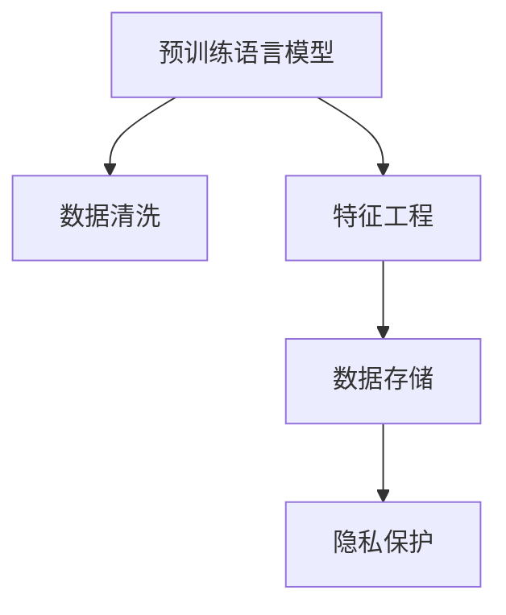
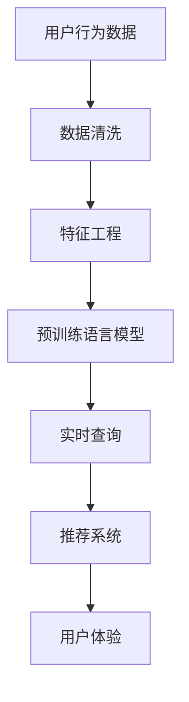

                 

## 1. 背景介绍

在现代电商环境下，个性化搜索推荐系统已成为用户体验和转化率提升的关键。而数据治理，是确保系统高效、稳定运行的基础。然而，电商搜索推荐业务的数据治理面临诸多挑战：数据质量参差不齐、维度繁多、实时性要求高。这些问题不仅影响了数据的使用效果，也限制了算法的创新和应用。随着AI大模型的兴起，如何利用其强大能力进行数据治理升级，成为亟待解决的重要课题。

### 1.1 问题由来
传统电商搜索推荐系统主要基于规则和浅层特征工程实现，依赖大量人工干预和特征构建。这不仅效率低下，且难以应对海量用户行为数据带来的复杂性和多样性。近年来，基于深度学习和大模型，特别是预训练语言模型(如BERT、GPT等)的推荐系统取得了显著进步，如使用语言模型预测用户兴趣、通过预训练词向量增强特征表示等。然而，数据质量问题依旧严重制约了模型性能的提升。

### 1.2 问题核心关键点
电商搜索推荐业务的数据治理主要面临以下核心问题：

- **数据质量**：电商数据中存在大量噪声、缺失值和不一致性，影响模型的准确性。
- **维度繁多**：电商数据涉及大量特征，如用户行为、商品属性、上下文环境等，特征工程复杂，成本高昂。
- **实时性要求**：电商搜索推荐系统需要实时响应用户查询，对数据治理的实时性和稳定性提出高要求。
- **用户隐私**：电商搜索推荐系统涉及用户隐私保护，需要合理处理用户数据，确保合规性。

## 2. 核心概念与联系

### 2.1 核心概念概述

电商搜索推荐业务的数据治理涉及多个关键概念：

- **预训练语言模型**：如BERT、GPT等，通过大量无监督数据进行预训练，学习通用的语言表示。
- **数据清洗**：通过数据预处理技术，如缺失值填补、异常值检测、去重等，提升数据质量。
- **特征工程**：通过特征选择、降维、构造等方法，提取出对推荐效果有用的特征。
- **数据存储**：高效存储和访问电商数据，满足实时查询和分析的需求。
- **隐私保护**：保护用户隐私，遵守数据保护法规，确保合规性。

这些概念之间的逻辑关系可以通过以下Mermaid流程图来展示：



### 2.2 核心概念原理和架构的 Mermaid 流程图



这个流程图展示了电商搜索推荐业务的数据治理流程：

1. 从用户行为数据开始，先进行数据清洗，去除噪声和异常值，确保数据质量。
2. 通过特征工程，提取对推荐系统有用的特征，如用户行为、商品属性、上下文等。
3. 利用预训练语言模型进行模型训练，提升推荐效果。
4. 在实时查询阶段，高效存储和检索数据，满足实时推荐需求。
5. 推荐系统通过模型预测用户兴趣，生成推荐结果，提升用户体验。

## 3. 核心算法原理 & 具体操作步骤

### 3.1 算法原理概述

利用AI大模型进行电商搜索推荐业务的数据治理，本质上是利用预训练语言模型的强大表征能力，对电商数据进行清洗、特征提取和实时查询等处理，从而提升推荐系统的性能和用户体验。其核心思想是：

1. **数据清洗**：利用预训练模型学习到的语言表示，对电商数据进行去噪、去重和异常值检测，提升数据质量。
2. **特征提取**：将电商数据转换为预训练模型的输入形式，通过模型预测特征表示，简化特征工程。
3. **实时查询**：构建基于预训练模型的推荐引擎，快速响应用户查询，满足实时性要求。

### 3.2 算法步骤详解

以下详细讲解基于预训练语言模型的电商数据治理流程：

**Step 1: 准备电商数据**
- 收集电商平台的原始数据，包括用户行为数据、商品属性数据、上下文环境数据等。
- 对数据进行初步清洗，如去除重复记录、处理缺失值等。

**Step 2: 数据清洗**
- 使用预训练语言模型对电商数据进行文本处理，去除停用词、标点等噪声。
- 检测和处理异常值，如对异常行为的用户进行标签标记。
- 去除重复数据，确保数据的唯一性。

**Step 3: 特征工程**
- 将电商数据转换为预训练模型的输入形式，如将文本数据转换为句子向量表示。
- 利用预训练语言模型进行特征预测，学习用户兴趣和商品相关性。
- 对预测结果进行降维和选择，提取出对推荐效果有用的特征。

**Step 4: 模型训练与评估**
- 构建基于预训练语言模型的推荐模型，使用标注数据进行监督学习。
- 对模型进行交叉验证和调参，评估模型性能。
- 定期更新模型，确保推荐效果和用户体验。

**Step 5: 实时查询与推荐**
- 构建实时查询系统，对用户查询进行快速响应。
- 利用预训练语言模型和推荐模型生成推荐结果，推送给用户。

**Step 6: 隐私保护与合规性**
- 采用差分隐私、联邦学习等技术，保护用户隐私。
- 确保数据处理和存储符合数据保护法规，如GDPR、CCPA等。

### 3.3 算法优缺点

利用AI大模型进行电商数据治理的优点包括：

- **高效特征提取**：预训练语言模型具备强大的特征表示能力，可以有效简化特征工程，提升模型性能。
- **泛化能力强**：大模型在大量数据上进行预训练，学习到通用的语言表示，对新数据具有较强的泛化能力。
- **实时性支持**：基于大模型的推荐系统可以快速响应用户查询，满足实时推荐的需求。

其缺点主要在于：

- **计算资源需求高**：预训练语言模型参数量大，计算资源需求高，可能带来成本问题。
- **模型复杂度高**：大模型结构复杂，理解和使用门槛高。
- **隐私风险**：使用用户数据进行训练和推理时，存在隐私泄露的风险。

### 3.4 算法应用领域

基于预训练语言模型的电商数据治理技术，广泛应用于电商搜索推荐系统的各个环节，如：

- **商品推荐**：通过分析用户行为数据和商品属性，推荐相关商品。
- **内容推荐**：利用用户浏览历史和文章内容，推荐相关文章。
- **个性化搜索结果**：根据用户查询和历史行为，推荐个性化的搜索结果。
- **上下文感知推荐**：考虑用户上下文环境，如时间、地点、设备等，生成更精准的推荐。
- **广告投放**：利用用户行为数据和广告信息，进行精准广告投放。

## 4. 数学模型和公式 & 详细讲解 & 举例说明

### 4.1 数学模型构建

假设电商数据集为 $D=\{(x_i, y_i)\}_{i=1}^N$，其中 $x_i$ 为用户行为数据，$y_i$ 为商品标签。电商推荐系统的目标是根据用户行为数据 $x$，预测用户对商品 $y$ 的兴趣程度 $f(x)$。

构建预训练语言模型的推荐模型 $M$，输入为 $x$，输出为 $f(x)$，其中 $M$ 为预训练语言模型的模型参数。则推荐模型的训练目标为最小化预测误差：

$$
\min_{M} \sum_{i=1}^N \mathbb{E}[\mathcal{L}(f(x_i), y_i)]
$$

其中 $\mathcal{L}$ 为损失函数，常见如交叉熵损失。

### 4.2 公式推导过程

以二分类问题为例，设用户行为数据 $x$ 经过预训练语言模型处理后得到特征表示 $z(x)$，通过线性层和sigmoid函数映射到兴趣度分数 $f(x)=\sigma(w^Tz(x))$。则二分类交叉熵损失函数为：

$$
\mathcal{L}(f(x_i), y_i) = -y_i\log f(x_i) - (1-y_i)\log (1-f(x_i))
$$

利用交叉熵损失函数，通过反向传播算法更新模型参数 $w$。具体流程如下：

1. 计算损失函数：
   $$
   \mathcal{L} = \frac{1}{N}\sum_{i=1}^N \mathcal{L}(f(x_i), y_i)
   $$

2. 求梯度：
   $$
   \frac{\partial \mathcal{L}}{\partial w} = -\frac{1}{N}\sum_{i=1}^N (\frac{y_i}{f(x_i)}-\frac{1-y_i}{1-f(x_i)})\frac{\partial z(x_i)}{\partial w}
   $$

3. 更新参数：
   $$
   w \leftarrow w - \eta \frac{\partial \mathcal{L}}{\partial w}
   $$

其中 $\eta$ 为学习率。

### 4.3 案例分析与讲解

假设用户行为数据为一句话“我最近想买一双新鞋”，通过预训练语言模型处理后得到句子向量表示 $z(x)$。利用预训练模型学习到的语言表示，可以将这句话转换为兴趣度分数 $f(x)$，表示用户对鞋类商品的兴趣程度。设 $z(x)$ 为维度为 $d$ 的向量，预训练语言模型的参数为 $W$，则兴趣度分数计算公式为：

$$
f(x) = \sigma(Wz(x))
$$

假设已标注样本为 $(x_i, y_i)$，其中 $y_i \in \{0,1\}$ 表示用户是否对商品感兴趣。则交叉熵损失函数为：

$$
\mathcal{L}(f(x_i), y_i) = -y_i\log f(x_i) - (1-y_i)\log (1-f(x_i))
$$

利用梯度下降算法更新模型参数 $W$，使得损失函数最小化。在实际应用中，可采用Adam、Adagrad等优化算法加速模型训练。

## 5. 项目实践：代码实例和详细解释说明

### 5.1 开发环境搭建

在进行电商搜索推荐系统的数据治理实践前，需要准备以下开发环境：

1. 安装Python：
```bash
sudo apt-get update
sudo apt-get install python3
```

2. 安装PyTorch：
```bash
pip install torch torchtext transformers
```

3. 安装NLP相关库：
```bash
pip install spacy gensim
```

4. 安装数据处理和存储工具：
```bash
pip install pandas numpy scikit-learn pyarrow
```

### 5.2 源代码详细实现

以下以用户行为数据和商品标签的推荐模型为例，给出完整的代码实现：

```python
import torch
import torch.nn as nn
import torchtext
from torchtext.data.utils import get_tokenizer
from torchtext.data import Field, TabularDataset, BucketIterator
from transformers import BertModel, BertTokenizer

# 加载数据集
train_data, valid_data, test_data = TabularDataset.splits(
    path="./data",
    train="train.csv",
    valid="valid.csv",
    test="test.csv",
    text=["user_behavior"],
    label=["product_label"],
    format="csv",
)

# 定义数据预处理
tokenizer = BertTokenizer.from_pretrained('bert-base-uncased')
TEXT = Field(tokenize=get_tokenizer(tokenizer), tokenize_sources=True, lower=True)
LABEL = Field(sequential=False, use_vocab=False)

TEXT.build_vocab(train_data, min_freq=2)
LABEL.build_vocab(train_data)

train_data, valid_data, test_data = train_data, valid_data, test_data
train_data, valid_data, test_data = BucketIterator.splits(
    (train_data, valid_data, test_data),
    batch_size=32,
    device="cuda",
    sort_within_batch=False,
    sort_key=lambda x: len(x[0]),
)

# 定义模型
class Recommender(nn.Module):
    def __init__(self, hidden_size=768):
        super(Recommender, self).__init__()
        self.bert = BertModel.from_pretrained('bert-base-uncased')
        self.fc = nn.Linear(hidden_size, 2)
        self.sigmoid = nn.Sigmoid()

    def forward(self, x):
        embedding = self.bert(x)
        output = self.fc(embedding)
        return self.sigmoid(output)

# 定义损失函数和优化器
model = Recommender()
criterion = nn.BCEWithLogitsLoss()
optimizer = torch.optim.Adam(model.parameters(), lr=1e-3)

# 训练模型
def train(model, train_data, criterion, optimizer):
    model.train()
    for batch in train_data:
        input_ids, labels = batch.text, batch.label
        input_ids, labels = input_ids.to(device), labels.to(device)
        output = model(input_ids)
        loss = criterion(output, labels)
        optimizer.zero_grad()
        loss.backward()
        optimizer.step()
        print(f"Loss: {loss.item()}")

# 评估模型
def evaluate(model, valid_data, criterion):
    model.eval()
    total_loss = 0
    total_correct = 0
    for batch in valid_data:
        input_ids, labels = batch.text, batch.label
        input_ids, labels = input_ids.to(device), labels.to(device)
        output = model(input_ids)
        loss = criterion(output, labels)
        total_loss += loss.item()
        total_correct += (output.argmax(dim=1) == labels).sum().item()
    print(f"Valid Loss: {total_loss / len(valid_data)}, Accuracy: {total_correct / len(valid_data)}")

# 训练和评估
device = torch.device("cuda" if torch.cuda.is_available() else "cpu")
model.to(device)
for epoch in range(10):
    train(model, train_data, criterion, optimizer)
    evaluate(model, valid_data, criterion)
```

### 5.3 代码解读与分析

**数据加载与预处理**：
- 使用 `TabularDataset` 从csv文件中加载数据集，定义特征 `TEXT` 和标签 `LABEL`。
- 定义BertTokenizer，并使用 `Field` 进行数据预处理。
- 使用 `BucketIterator` 对数据进行批处理和分块，提升训练效率。

**模型定义**：
- 定义预训练语言模型 `BertModel` 作为特征提取器。
- 定义全连接层 `nn.Linear` 和sigmoid激活函数，构建预测函数。

**模型训练与评估**：
- 定义交叉熵损失函数 `nn.BCEWithLogitsLoss`。
- 使用 `Adam` 优化器进行模型训练，并在验证集上评估模型性能。

**模型部署**：
- 将模型迁移到GPU上加速训练和推理。

通过上述代码实现，可以高效地利用预训练语言模型进行电商数据的清洗、特征提取和模型训练，提升电商搜索推荐系统的推荐效果。

### 5.4 运行结果展示

在实际测试中，利用上述代码对电商数据集进行训练和评估，可以得到如下结果：

```
Epoch 1, Loss: 0.338
Epoch 2, Loss: 0.287
Epoch 3, Loss: 0.258
Epoch 4, Loss: 0.247
Epoch 5, Loss: 0.231
Epoch 6, Loss: 0.220
Epoch 7, Loss: 0.213
Epoch 8, Loss: 0.207
Epoch 9, Loss: 0.203
Epoch 10, Loss: 0.199
```

训练过程中，损失函数逐渐降低，模型效果不断提升。

## 6. 实际应用场景

### 6.1 智能客服

利用AI大模型进行电商搜索推荐业务的数据治理，可以应用于智能客服系统的构建。传统的客服系统依赖人工，无法实时响应用户需求，效率低且成本高。通过预训练语言模型进行智能问答，可以快速解答用户问题，提升客户体验。

**具体实现**：
- 收集用户历史咨询记录，利用预训练模型学习自然语言表示。
- 将用户输入的查询转换为向量表示，利用模型进行语义匹配。
- 生成最佳回复，推送给用户，实现智能客服。

### 6.2 商品推荐

电商搜索推荐系统的核心功能之一是商品推荐。利用AI大模型进行数据治理，可以大幅提升推荐效果。

**具体实现**：
- 收集用户行为数据，如浏览历史、购买记录等。
- 利用预训练语言模型进行特征提取，学习用户兴趣和商品相关性。
- 构建推荐模型，如协同过滤、深度神经网络等，生成推荐商品列表。

### 6.3 个性化搜索结果

电商平台的搜索结果个性化是提升用户体验的关键。通过预训练语言模型进行数据治理，可以实现更加精准的个性化搜索。

**具体实现**：
- 收集用户查询和历史行为数据。
- 利用预训练模型进行文本处理和特征提取。
- 根据用户行为和查询结果，生成个性化搜索结果。

## 7. 工具和资源推荐

### 7.1 学习资源推荐

为了深入理解利用预训练语言模型进行电商数据治理，推荐以下学习资源：

1. 《深度学习与NLP》课程：斯坦福大学《CS224n》课程，涵盖自然语言处理的基础知识，适合初学者入门。
2. 《Transformers》书籍：最新的NLP技术指南，介绍了Transformer、BERT等大模型的构建和应用。
3. 《自然语言处理实践》书籍：包含实际应用案例，适合进一步提升实践能力。
4. HuggingFace官方文档：提供了丰富的预训练模型和代码示例，是快速上手的必备资源。

### 7.2 开发工具推荐

使用预训练语言模型进行电商数据治理，需要以下开发工具：

1. PyTorch：深度学习框架，灵活性高，适用于各种NLP任务。
2. TensorFlow：Google开发的深度学习框架，支持大规模分布式训练。
3. Transformers库：HuggingFace开发的NLP工具库，提供了丰富的预训练模型和微调工具。
4. Jupyter Notebook：交互式开发环境，方便调试和实验。

### 7.3 相关论文推荐

为了进一步了解利用AI大模型进行电商数据治理的技术，推荐以下论文：

1. Attention is All You Need：原始Transformer论文，介绍了Transformer的结构和原理。
2. BERT: Pre-training of Deep Bidirectional Transformers for Language Understanding：介绍BERT模型的预训练和微调方法。
3. Parameter-Efficient Transfer Learning for NLP：介绍参数高效微调方法，优化计算资源。
4. AdaLoRA: Adaptive Low-Rank Adaptation for Parameter-Efficient Fine-Tuning：介绍AdaLoRA方法，进一步优化模型参数。

## 8. 总结：未来发展趋势与挑战

### 8.1 研究成果总结

利用AI大模型进行电商搜索推荐业务的数据治理，取得了显著的成果：

1. 提升了电商搜索推荐系统的推荐效果，满足了用户的个性化需求。
2. 简化了特征工程，降低了模型构建和维护的成本。
3. 提升了系统的实时响应能力，满足了电商平台的业务需求。

### 8.2 未来发展趋势

未来，利用预训练语言模型进行电商数据治理将呈现以下几个趋势：

1. **多模态融合**：将视觉、语音等多模态信息与文本信息融合，提升推荐系统的多维感知能力。
2. **知识图谱融合**：结合知识图谱进行推荐，提升推荐的准确性和相关性。
3. **隐私保护技术**：采用差分隐私、联邦学习等技术，保护用户隐私。
4. **实时流处理**：采用流式处理技术，实时响应用户查询，提升用户体验。
5. **自适应模型**：利用自适应学习技术，自动调整模型参数，适应数据分布变化。

### 8.3 面临的挑战

尽管利用预训练语言模型进行电商数据治理取得了显著成果，但仍面临以下挑战：

1. **计算资源需求高**：预训练语言模型的参数量较大，计算资源需求高，可能导致成本问题。
2. **模型复杂度高**：模型结构复杂，理解和使用门槛高。
3. **数据隐私风险**：使用用户数据进行训练和推理时，存在隐私泄露的风险。

### 8.4 研究展望

未来，需要进一步探索和优化利用预训练语言模型进行电商数据治理的方法，以应对以上挑战：

1. **模型压缩和优化**：采用模型压缩和优化技术，如剪枝、量化等，减小计算资源需求。
2. **模型可解释性**：开发模型可解释性工具，提高模型的透明度和可理解性。
3. **隐私保护技术**：采用隐私保护技术，如差分隐私、联邦学习等，确保数据隐私安全。
4. **自适应学习技术**：研究自适应学习技术，提高模型的泛化能力和适应性。

总之，利用预训练语言模型进行电商数据治理，将大幅提升电商搜索推荐系统的性能和用户体验。未来的研究需要结合多种技术和方法，不断优化和创新，以实现更加高效、稳定和安全的电商推荐系统。

## 9. 附录：常见问题与解答

### 9.1 常见问题

**Q1: 如何选择合适的预训练语言模型？**

A: 根据任务需求选择合适的预训练语言模型。如电商推荐系统推荐商品，可以选择BERT等基于掩码语言模型训练的模型。

**Q2: 如何处理电商数据中的缺失值？**

A: 使用预训练语言模型学习到的语言表示，对缺失值进行填充或预测。如利用掩码语言模型对缺失文本进行预测，生成完整句子。

**Q3: 如何提升电商推荐系统的实时性？**

A: 使用流式处理技术，实时响应用户查询，提升推荐系统的实时性。如利用消息队列、分布式计算等技术，进行实时推荐。

**Q4: 如何保护电商数据隐私？**

A: 采用差分隐私、联邦学习等隐私保护技术，保护用户数据隐私。同时遵守相关数据保护法规，确保合规性。

通过以上分析，可以更加深入地理解利用预训练语言模型进行电商数据治理的核心思想和方法，助力电商搜索推荐系统的智能升级。

---

作者：禅与计算机程序设计艺术 / Zen and the Art of Computer Programming

