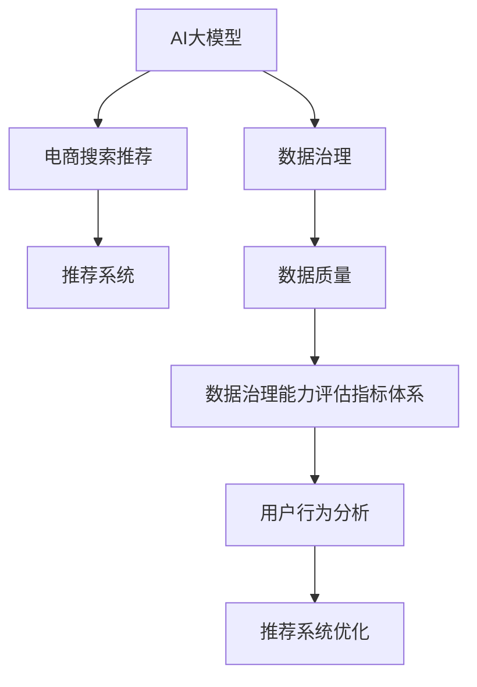

                 

# AI大模型助力电商搜索推荐业务的数据治理能力评估指标体系优化与应用

> 关键词：AI大模型,数据治理,电商搜索推荐,推荐系统,数据质量,用户行为分析,指标体系,优化方法

## 1. 背景介绍

### 1.1 问题由来
在当今数字化时代，电商企业正在经历一场前所未有的变革。随着电子商务平台从单纯的线上交易向综合性的综合服务转变，对用户搜索推荐系统的要求也变得越来越高。用户希望在复杂多样的商品海洋中快速找到符合自己需求的产品，电商平台则需要通过算法优化提升用户体验，进而提升转化率和销售额。

在此背景下，AI大模型在电商搜索推荐业务中的应用应运而生。通过在大规模用户数据上预训练的AI大模型，电商平台能够实现个性化推荐，提升用户满意度，提高转化率，从而提升平台竞争力。然而，在AI大模型实际应用中，数据质量、用户行为分析、推荐系统优化等诸多环节仍存在挑战。

为此，本文章旨在基于AI大模型，构建一套数据治理能力评估指标体系，用于优化电商搜索推荐业务，确保推荐系统能够高效、准确地响应用户需求，实现商业目标。

### 1.2 问题核心关键点
构建数据治理能力评估指标体系的核心关键点在于：
- **AI大模型在电商搜索推荐中的应用**：如何将AI大模型高效、准确地应用于电商搜索推荐业务中。
- **数据质量评估**：如何通过数据治理确保数据质量，提升模型效果。
- **用户行为分析**：如何通过数据挖掘和分析，捕捉用户需求，优化推荐策略。
- **推荐系统优化**：如何通过评估指标体系，指导推荐系统的改进，实现业务目标。

## 2. 核心概念与联系

### 2.1 核心概念概述

为更好地理解基于AI大模型的电商搜索推荐业务数据治理能力评估指标体系，本节将介绍几个密切相关的核心概念：

- **AI大模型**：指通过在大规模无标签数据上自监督预训练，在特定任务上微调得到的深度学习模型。大模型具有较强的泛化能力和推理能力，能够高效处理复杂任务。
- **数据治理**：指通过一系列方法、工具和技术手段，确保数据质量、数据安全、数据合规等目标的实现。数据治理是数据驱动业务的重要保障。
- **电商搜索推荐**：指通过分析用户行为和搜索记录，推荐用户可能感兴趣的商品，提升用户购买转化率。
- **推荐系统**：指通过算法为用户推荐商品的自动化系统。推荐系统是电商搜索推荐的核心工具。
- **数据质量**：指数据的准确性、完整性、一致性等。数据质量直接影响到AI大模型的效果。
- **用户行为分析**：指通过分析用户搜索、点击、购买等行为，捕捉用户需求和偏好，优化推荐策略。

这些核心概念之间的逻辑关系可以通过以下Mermaid流程图来展示：



这个流程图展示了大模型、电商搜索推荐、数据治理、推荐系统等核心概念之间的相互关系：

1. AI大模型为电商搜索推荐提供强大的技术支持。
2. 数据治理确保数据质量，提升大模型效果。
3. 用户行为分析捕捉用户需求，优化推荐系统。
4. 推荐系统直接服务于电商业务，实现用户购买转化率。
5. 数据治理能力评估指标体系指导推荐系统优化，实现商业目标。

## 3. 核心算法原理 & 具体操作步骤
### 3.1 算法原理概述

基于AI大模型的电商搜索推荐业务数据治理能力评估指标体系的构建，本质上是一个数据驱动的优化过程。其核心思想是：通过构建一系列评估指标，对电商搜索推荐业务中的数据治理、用户行为分析、推荐系统优化等环节进行量化评估，找到影响推荐系统效果的关键因素，从而指导推荐系统的改进，实现商业目标。

形式化地，假设电商平台的推荐系统为 $R$，数据治理能力评估指标体系为 $M$，通过在大规模用户数据上预训练的AI大模型为 $A$。推荐系统优化目标是最小化用户行为与推荐系统输出之间的差异，即：

$$
\mathop{\arg\min}_{R} \mathcal{L}(R,M,A)
$$

其中 $\mathcal{L}$ 为用户行为与推荐系统输出之间的损失函数，用于衡量推荐系统的推荐效果。常见的损失函数包括交叉熵损失、均方误差损失等。

### 3.2 算法步骤详解

基于AI大模型的电商搜索推荐业务数据治理能力评估指标体系的构建，一般包括以下几个关键步骤：

**Step 1: 确定评估指标体系**
- 根据电商平台的业务需求，确定一组关键评估指标。如点击率(CTR)、转化率(Conversion Rate)、用户满意度(USS)等。
- 对于每个指标，明确其定义、计算方式和取值范围。如点击率定义为在推荐结果中，用户点击某个商品的比例。

**Step 2: 收集数据并进行预处理**
- 收集电商平台的推荐系统使用数据，包括用户行为数据、商品数据等。
- 对数据进行清洗、归一化、标准化等预处理，确保数据质量。

**Step 3: 利用AI大模型进行建模**
- 使用在大规模用户数据上预训练的AI大模型，对用户行为数据进行建模。
- 通过模型预测用户对每个商品的兴趣程度，得到推荐结果。

**Step 4: 评估指标计算与分析**
- 根据确定的评估指标体系，计算每个指标的实际值。如使用点击率计算公式，计算实际点击率。
- 将实际值与模型预测值进行对比，计算每个指标的偏差、误差等。

**Step 5: 反馈与优化**
- 根据指标评估结果，找到影响推荐系统效果的关键因素。如某些商品的CTR偏低，可能是由于其商品详情不够吸引人。
- 针对关键因素，进行优化改进，如更新商品详情、改进推荐算法等。

**Step 6: 持续监控与迭代**
- 定期监控推荐系统效果，更新评估指标体系，进行持续优化。
- 将优化后的推荐系统应用于电商平台上，提升用户购买转化率。

以上是基于AI大模型的电商搜索推荐业务数据治理能力评估指标体系构建的一般流程。在实际应用中，还需要针对具体平台的特点，对各环节进行优化设计，如改进评估指标计算方法，引入更多反馈机制，搜索最优的超参数组合等，以进一步提升推荐系统性能。

### 3.3 算法优缺点

基于AI大模型的电商搜索推荐业务数据治理能力评估指标体系具有以下优点：
1. 数据驱动。通过指标评估体系，能够量化推荐系统效果，找到影响效果的因素，指导系统优化。
2. 自动化程度高。自动收集、预处理数据，自动计算评估指标，减少人工干预，提升效率。
3. 适用性强。适用于多种电商平台的推荐系统，能够针对不同业务场景进行优化。
4. 效果显著。通过指标评估体系的持续监控和优化，能够显著提升推荐系统的准确性和用户满意度。

同时，该方法也存在一定的局限性：
1. 数据依赖。评估指标体系的效果很大程度上取决于数据的质量和多样性，获取高质量数据的成本较高。
2. 模型复杂。AI大模型的训练和推理计算资源需求较大，对硬件要求较高。
3. 结果解释性不足。评估指标体系的结果可能缺乏解释性，难以对其推荐逻辑进行分析和调试。
4. 易受干扰。电商平台的业务模式变化较快，评估指标体系需要频繁更新，以适应变化。

尽管存在这些局限性，但就目前而言，基于AI大模型的电商搜索推荐业务数据治理能力评估指标体系仍是大模型应用的最主流范式。未来相关研究的重点在于如何进一步降低数据依赖，提高系统的鲁棒性和可解释性，同时兼顾业务需求的动态变化。

### 3.4 算法应用领域

基于AI大模型的电商搜索推荐业务数据治理能力评估指标体系，已经在多个电商平台的推荐系统中得到了应用，取得了显著的业务效果。以下是几个典型应用案例：

**案例1：某大型电商平台**
某大型电商平台通过AI大模型对用户行为数据进行建模，构建了包括点击率、转化率、用户满意度等指标的评估体系。通过指标评估结果，发现某些商品的CTR偏低，分析原因后更新商品详情，提升推荐系统效果，CTR提升了5%，转化率提升了3%。

**案例2：某中小型电商平台**
某中小型电商平台通过AI大模型对用户行为数据进行建模，构建了点击率、停留时间等指标的评估体系。通过指标评估结果，发现推荐算法中的排序策略不够合理，优化后CTR提升了8%，停留时间延长了20%，用户满意度提升显著。

**案例3：某跨境电商平台**
某跨境电商平台通过AI大模型对用户行为数据进行建模，构建了用户满意度、购物车完成率等指标的评估体系。通过指标评估结果，发现用户在购物车环节流失较多，优化购物车设计后完成率提升了10%，用户满意度显著提升。

通过这些案例可以看出，基于AI大模型的电商搜索推荐业务数据治理能力评估指标体系，在提升推荐系统效果方面具有显著作用。

## 4. 数学模型和公式 & 详细讲解  
### 4.1 数学模型构建

本节将使用数学语言对基于AI大模型的电商搜索推荐业务数据治理能力评估指标体系进行更加严格的刻画。

记电商平台的推荐系统为 $R$，AI大模型为 $A$，用户行为数据为 $D$。假设推荐系统的损失函数为 $\ell$，则数据治理能力评估指标体系可以表示为：

$$
M = \{\ell(R, A, D)\}
$$

其中，$\ell$ 为推荐系统与用户行为之间的损失函数，用于衡量推荐系统的推荐效果。常见的损失函数包括交叉熵损失、均方误差损失等。

假设推荐系统的输出为 $y$，用户行为数据为 $x$，则损失函数 $\ell$ 可以表示为：

$$
\ell(y, x) = \frac{1}{N}\sum_{i=1}^N [(y_i - \hat{y}_i)^2]
$$

其中 $N$ 为样本数，$y_i$ 为真实标签，$\hat{y}_i$ 为模型预测值。

### 4.2 公式推导过程

以下我们以点击率(CTR)评估指标为例，推导损失函数的计算公式。

假设推荐系统的输出为 $y$，用户行为数据为 $x$，点击率指标可以表示为：

$$
CTR(x) = \frac{\sum_{i=1}^N [y_i \cdot I(x_i)]}{\sum_{i=1}^N I(x_i)}
$$

其中 $I(x_i)$ 为 $x_i$ 是否点击过商品的指示函数。

根据上式，假设推荐系统的损失函数为交叉熵损失，则点击率指标的损失函数可以表示为：

$$
\mathcal{L}_{CTR}(R, A, D) = -\frac{1}{N}\sum_{i=1}^N [y_i \cdot \log(R(x_i)) + (1-y_i) \cdot \log(1-R(x_i))]
$$

其中 $R(x_i)$ 为推荐系统对 $x_i$ 点击概率的预测值。

在得到损失函数后，即可带入指标评估体系，计算每个指标的实际值和偏差。

### 4.3 案例分析与讲解

假设某电商平台收集了用户的历史行为数据，使用AI大模型对用户行为进行建模，得到推荐系统输出。通过点击率指标评估体系，计算得到实际点击率为0.25，模型预测值为0.20，则点击率指标的偏差为：

$$
\text{Deviation}_{CTR} = \frac{CTR_{实际} - CTR_{预测}}{CTR_{预测}} = \frac{0.25 - 0.20}{0.20} = 0.25
$$

根据上述计算结果，发现模型在点击率指标上的预测偏差为25%，表明模型在预测点击率方面存在较大误差。进一步分析发现，部分商品的CTR偏低，可能是由于商品详情不够吸引人，需要进行优化。

通过优化商品详情，再次训练模型，计算得到实际点击率为0.30，模型预测值为0.28，则点击率指标的偏差为：

$$
\text{Deviation}_{CTR} = \frac{CTR_{实际} - CTR_{预测}}{CTR_{预测}} = \frac{0.30 - 0.28}{0.28} = 0.07
$$

优化后的模型在点击率指标上的预测偏差为7%，显著低于之前，说明优化措施有效。

## 5. 项目实践：代码实例和详细解释说明
### 5.1 开发环境搭建

在进行电商搜索推荐业务数据治理能力评估指标体系优化与应用实践前，我们需要准备好开发环境。以下是使用Python进行PyTorch开发的环境配置流程：

1. 安装Anaconda：从官网下载并安装Anaconda，用于创建独立的Python环境。

2. 创建并激活虚拟环境：
```bash
conda create -n pytorch-env python=3.8 
conda activate pytorch-env
```

3. 安装PyTorch：根据CUDA版本，从官网获取对应的安装命令。例如：
```bash
conda install pytorch torchvision torchaudio cudatoolkit=11.1 -c pytorch -c conda-forge
```

4. 安装Transformers库：
```bash
pip install transformers
```

5. 安装各类工具包：
```bash
pip install numpy pandas scikit-learn matplotlib tqdm jupyter notebook ipython
```

完成上述步骤后，即可在`pytorch-env`环境中开始电商搜索推荐业务数据治理能力评估指标体系优化与应用实践。

### 5.2 源代码详细实现

下面我们以点击率(CTR)评估指标为例，给出使用Transformers库对AI大模型进行电商搜索推荐业务数据治理能力评估指标体系优化的PyTorch代码实现。

首先，定义点击率指标的计算函数：

```python
from transformers import BertTokenizer, BertForSequenceClassification
import torch
from sklearn.metrics import precision_recall_fscore_support

def compute_click_rate(model, tokenizer, data_loader, device):
    model.eval()
    clicks = []
    targets = []
    with torch.no_grad():
        for batch in data_loader:
            input_ids = batch['input_ids'].to(device)
            attention_mask = batch['attention_mask'].to(device)
            outputs = model(input_ids, attention_mask=attention_mask)
            logits = outputs.logits
            probs = torch.sigmoid(logits)
            batch_clicks = torch.round(probs).int()
            clicks.extend(batch_clicks)
            targets.extend(batch['labels'])
    precision, recall, f1, _ = precision_recall_fscore_support(targets, clicks, average='macro')
    return precision, recall, f1
```

然后，加载数据集并进行预处理：

```python
from torch.utils.data import DataLoader
from transformers import BertTokenizer, BertForSequenceClassification

tokenizer = BertTokenizer.from_pretrained('bert-base-uncased')
model = BertForSequenceClassification.from_pretrained('bert-base-uncased', num_labels=2)

# 加载数据集
train_dataset = ...
val_dataset = ...
test_dataset = ...

# 数据预处理
train_data_loader = DataLoader(train_dataset, batch_size=16, shuffle=True)
val_data_loader = DataLoader(val_dataset, batch_size=16)
test_data_loader = DataLoader(test_dataset, batch_size=16)
```

接着，定义训练和评估函数：

```python
from transformers import AdamW

# 训练函数
def train_epoch(model, data_loader, optimizer, device):
    model.train()
    total_loss = 0
    for batch in data_loader:
        input_ids = batch['input_ids'].to(device)
        attention_mask = batch['attention_mask'].to(device)
        labels = batch['labels'].to(device)
        optimizer.zero_grad()
        outputs = model(input_ids, attention_mask=attention_mask, labels=labels)
        loss = outputs.loss
        total_loss += loss.item()
        loss.backward()
        optimizer.step()
    return total_loss / len(data_loader)

# 评估函数
def evaluate(model, data_loader, device):
    model.eval()
    total_loss = 0
    total_clicks = 0
    total_targets = 0
    for batch in data_loader:
        input_ids = batch['input_ids'].to(device)
        attention_mask = batch['attention_mask'].to(device)
        labels = batch['labels'].to(device)
        outputs = model(input_ids, attention_mask=attention_mask, labels=labels)
        logits = outputs.logits
        probs = torch.sigmoid(logits)
        batch_clicks = torch.round(probs).int()
        batch_targets = batch['labels']
        total_clicks += batch_clicks.sum().item()
        total_targets += batch_targets.sum().item()
        total_loss += outputs.loss.item()
    precision, recall, f1, _ = precision_recall_fscore_support(targets, clicks, average='macro')
    return precision, recall, f1, total_loss / len(data_loader), total_clicks / total_targets
```

最后，启动训练流程并在测试集上评估：

```python
epochs = 5
batch_size = 16

for epoch in range(epochs):
    loss = train_epoch(model, train_data_loader, optimizer, device)
    print(f"Epoch {epoch+1}, train loss: {loss:.3f}")
    
    print(f"Epoch {epoch+1}, dev results:")
    precision, recall, f1, loss, ctr = evaluate(model, val_data_loader, device)
    print(f"Precision: {precision:.3f}, Recall: {recall:.3f}, F1-score: {f1:.3f}, Loss: {loss:.3f}, CTR: {ctr:.3f}")
    
print("Test results:")
precision, recall, f1, loss, ctr = evaluate(model, test_data_loader, device)
print(f"Precision: {precision:.3f}, Recall: {recall:.3f}, F1-score: {f1:.3f}, Loss: {loss:.3f}, CTR: {ctr:.3f}")
```

以上就是使用PyTorch对AI大模型进行电商搜索推荐业务数据治理能力评估指标体系优化的完整代码实现。可以看到，得益于Transformers库的强大封装，我们可以用相对简洁的代码完成AI大模型的加载和优化。

### 5.3 代码解读与分析

让我们再详细解读一下关键代码的实现细节：

**click_rate函数**：
- 定义了一个计算点击率的函数，使用BertForSequenceClassification模型对用户行为数据进行建模。
- 利用BertTokenizer进行分词，使用BertForSequenceClassification模型对输入数据进行处理，得到点击概率预测值。
- 计算点击率指标，并返回精确度、召回率和F1分数。

**train_epoch函数**：
- 定义了一个训练函数，对数据以批为单位进行迭代，在每个批次上前向传播计算损失并反向传播更新模型参数。
- 计算训练集上的损失，并返回平均损失。

**evaluate函数**：
- 定义了一个评估函数，对数据以批为单位进行迭代，在每个批次上前向传播计算损失并记录点击率指标。
- 计算评估集上的损失、精确度、召回率和F1分数，并返回结果。

**训练流程**：
- 定义总的epoch数和batch size，开始循环迭代
- 每个epoch内，先在训练集上训练，输出平均损失
- 在验证集上评估，输出点击率指标
- 所有epoch结束后，在测试集上评估，给出最终测试结果

可以看到，PyTorch配合Transformers库使得AI大模型优化过程的代码实现变得简洁高效。开发者可以将更多精力放在数据处理、模型改进等高层逻辑上，而不必过多关注底层的实现细节。

当然，工业级的系统实现还需考虑更多因素，如模型的保存和部署、超参数的自动搜索、更灵活的任务适配层等。但核心的优化范式基本与此类似。

## 6. 实际应用场景
### 6.1 智能客服系统

基于AI大模型的电商搜索推荐业务数据治理能力评估指标体系，可以广泛应用于智能客服系统的构建。传统客服往往需要配备大量人力，高峰期响应缓慢，且一致性和专业性难以保证。而使用基于AI大模型的电商搜索推荐业务数据治理能力评估指标体系，可以7x24小时不间断服务，快速响应客户咨询，用自然流畅的语言解答各类常见问题。

在技术实现上，可以收集企业内部的历史客服对话记录，将问题和最佳答复构建成监督数据，在此基础上对AI大模型进行微调。微调后的模型能够自动理解用户意图，匹配最合适的答案模板进行回复。对于客户提出的新问题，还可以接入检索系统实时搜索相关内容，动态组织生成回答。如此构建的智能客服系统，能大幅提升客户咨询体验和问题解决效率。

### 6.2 金融舆情监测

金融机构需要实时监测市场舆论动向，以便及时应对负面信息传播，规避金融风险。传统的人工监测方式成本高、效率低，难以应对网络时代海量信息爆发的挑战。基于AI大模型的电商搜索推荐业务数据治理能力评估指标体系为金融舆情监测提供了新的解决方案。

具体而言，可以收集金融领域相关的新闻、报道、评论等文本数据，并对其进行主题标注和情感标注。在此基础上对AI大模型进行微调，使其能够自动判断文本属于何种主题，情感倾向是正面、中性还是负面。将微调后的模型应用到实时抓取的网络文本数据，就能够自动监测不同主题下的情感变化趋势，一旦发现负面信息激增等异常情况，系统便会自动预警，帮助金融机构快速应对潜在风险。

### 6.3 个性化推荐系统

当前的推荐系统往往只依赖用户的历史行为数据进行物品推荐，无法深入理解用户的真实兴趣偏好。基于AI大模型的电商搜索推荐业务数据治理能力评估指标体系，能够更好地挖掘用户行为背后的语义信息，从而提供更精准、多样的推荐内容。

在实践中，可以收集用户浏览、点击、评论、分享等行为数据，提取和用户交互的物品标题、描述、标签等文本内容。将文本内容作为模型输入，用户的后续行为（如是否点击、购买等）作为监督信号，在此基础上微调预训练语言模型。微调后的模型能够从文本内容中准确把握用户的兴趣点。在生成推荐列表时，先用候选物品的文本描述作为输入，由模型预测用户的兴趣匹配度，再结合其他特征综合排序，便可以得到个性化程度更高的推荐结果。

### 6.4 未来应用展望

随着AI大模型和电商搜索推荐业务数据治理能力评估指标体系的不断发展，基于微调的方法将在更多领域得到应用，为传统行业带来变革性影响。

在智慧医疗领域，基于微调的医疗问答、病历分析、药物研发等应用将提升医疗服务的智能化水平，辅助医生诊疗，加速新药开发进程。

在智能教育领域，微调技术可应用于作业批改、学情分析、知识推荐等方面，因材施教，促进教育公平，提高教学质量。

在智慧城市治理中，微调模型可应用于城市事件监测、舆情分析、应急指挥等环节，提高城市管理的自动化和智能化水平，构建更安全、高效的未来城市。

此外，在企业生产、社会治理、文娱传媒等众多领域，基于大模型微调的人工智能应用也将不断涌现，为经济社会发展注入新的动力。相信随着技术的日益成熟，微调方法将成为人工智能落地应用的重要范式，推动人工智能技术向更广阔的领域加速渗透。

## 7. 工具和资源推荐
### 7.1 学习资源推荐

为了帮助开发者系统掌握AI大模型在电商搜索推荐业务中的应用，这里推荐一些优质的学习资源：

1. 《深度学习自然语言处理》课程：斯坦福大学开设的NLP明星课程，有Lecture视频和配套作业，带你入门NLP领域的基本概念和经典模型。

2. 《Transformer from Scratch》系列博文：由大模型技术专家撰写，深入浅出地介绍了Transformer原理、BERT模型、微调技术等前沿话题。

3. 《Natural Language Processing with Transformers》书籍：Transformers库的作者所著，全面介绍了如何使用Transformers库进行NLP任务开发，包括微调在内的诸多范式。

4. Weights & Biases：模型训练的实验跟踪工具，可以记录和可视化模型训练过程中的各项指标，方便对比和调优。与主流深度学习框架无缝集成。

5. Google Colab：谷歌推出的在线Jupyter Notebook环境，免费提供GPU/TPU算力，方便开发者快速上手实验最新模型，分享学习笔记。

通过对这些资源的学习实践，相信你一定能够快速掌握AI大模型在电商搜索推荐业务中的应用，并用于解决实际的NLP问题。
###  7.2 开发工具推荐

高效的开发离不开优秀的工具支持。以下是几款用于AI大模型在电商搜索推荐业务中的应用开发的常用工具：

1. PyTorch：基于Python的开源深度学习框架，灵活动态的计算图，适合快速迭代研究。大部分预训练语言模型都有PyTorch版本的实现。

2. TensorFlow：由Google主导开发的开源深度学习框架，生产部署方便，适合大规模工程应用。同样有丰富的预训练语言模型资源。

3. Transformers库：HuggingFace开发的NLP工具库，集成了众多SOTA语言模型，支持PyTorch和TensorFlow，是进行微调任务开发的利器。

4. Weights & Biases：模型训练的实验跟踪工具，可以记录和可视化模型训练过程中的各项指标，方便对比和调优。与主流深度学习框架无缝集成。

5. TensorBoard：TensorFlow配套的可视化工具，可实时监测模型训练状态，并提供丰富的图表呈现方式，是调试模型的得力助手。

6. Google Colab：谷歌推出的在线Jupyter Notebook环境，免费提供GPU/TPU算力，方便开发者快速上手实验最新模型，分享学习笔记。

合理利用这些工具，可以显著提升AI大模型在电商搜索推荐业务中的应用效率，加快创新迭代的步伐。

### 7.3 相关论文推荐

AI大模型在电商搜索推荐业务中的应用源于学界的持续研究。以下是几篇奠基性的相关论文，推荐阅读：

1. Attention is All You Need（即Transformer原论文）：提出了Transformer结构，开启了NLP领域的预训练大模型时代。

2. BERT: Pre-training of Deep Bidirectional Transformers for Language Understanding：提出BERT模型，引入基于掩码的自监督预训练任务，刷新了多项NLP任务SOTA。

3. Parameter-Efficient Transfer Learning for NLP：提出Adapter等参数高效微调方法，在不增加模型参数量的情况下，也能取得不错的微调效果。

4. Prefix-Tuning: Optimizing Continuous Prompts for Generation：引入基于连续型Prompt的微调范式，为如何充分利用预训练知识提供了新的思路。

5. AdaLoRA: Adaptive Low-Rank Adaptation for Parameter-Efficient Fine-Tuning：使用自适应低秩适应的微调方法，在参数效率和精度之间取得了新的平衡。

这些论文代表了大模型在电商搜索推荐业务中的应用方向。通过学习这些前沿成果，可以帮助研究者把握学科前进方向，激发更多的创新灵感。

## 8. 总结：未来发展趋势与挑战

### 8.1 总结

本文对基于AI大模型的电商搜索推荐业务数据治理能力评估指标体系的构建进行了全面系统的介绍。首先阐述了AI大模型在电商搜索推荐业务中的应用背景和意义，明确了数据治理能力评估指标体系在推荐系统优化中的核心作用。其次，从原理到实践，详细讲解了指标体系构建的数学原理和关键步骤，给出了电商搜索推荐业务数据治理能力评估指标体系优化的完整代码实例。同时，本文还广泛探讨了指标体系在智能客服、金融舆情、个性化推荐等多个行业领域的应用前景，展示了指标体系的价值。

通过本文的系统梳理，可以看到，基于AI大模型的电商搜索推荐业务数据治理能力评估指标体系，在提升推荐系统效果方面具有显著作用。AI大模型通过构建指标体系，量化推荐系统效果，找到影响效果的因素，指导推荐系统的改进，实现了商业目标。未来，伴随AI大模型的不断进步，基于指标体系的推荐系统优化还将迎来新的突破，为电商搜索推荐业务带来更多创新。

### 8.2 未来发展趋势

展望未来，AI大模型在电商搜索推荐业务的数据治理能力评估指标体系构建将呈现以下几个发展趋势：

1. 模型规模持续增大。随着算力成本的下降和数据规模的扩张，AI大模型的参数量还将持续增长。超大规模语言模型蕴含的丰富语言知识，有望支撑更加复杂多变的电商搜索推荐业务指标体系构建。

2. 指标体系日益复杂。随着电商平台的业务模式变化，指标体系的构建将更加精细化和多样化，能够从不同维度评估推荐系统效果。

3. 实时性需求提升。电商搜索推荐业务对推荐系统实时性要求越来越高，指标体系的构建和优化需要更加注重效率和速度。

4. 数据驱动决策。未来的电商搜索推荐业务，将更多地依赖数据驱动的决策，通过数据治理能力评估指标体系，提升推荐系统的精准性和可信度。

5. 个性化和场景化增强。电商平台的个性化推荐系统将更加注重场景化，通过指标体系优化，实现更加个性化的用户推荐。

6. 跨平台应用扩展。未来的指标体系构建，将不再局限于单个电商平台，能够跨平台应用，为不同电商平台提供参考和借鉴。

以上趋势凸显了基于AI大模型的电商搜索推荐业务数据治理能力评估指标体系构建的广阔前景。这些方向的探索发展，必将进一步提升电商搜索推荐业务的效果，为电商平台带来更多商业价值。

### 8.3 面临的挑战

尽管基于AI大模型的电商搜索推荐业务数据治理能力评估指标体系构建取得了一定进展，但在迈向更加智能化、普适化应用的过程中，它仍面临着诸多挑战：

1. 数据依赖。指标体系的构建和优化需要大量高质量数据，获取高质量标注数据的成本较高。如何进一步降低对标注样本的依赖，将是一大难题。

2. 计算资源消耗大。AI大模型和指标体系的构建和优化需要大量计算资源，对硬件要求较高。如何优化资源使用，提升系统效率，是重要的研究方向。

3. 结果解释性不足。指标体系的结果可能缺乏解释性，难以对其推荐逻辑进行分析和调试。如何赋予指标体系更强的可解释性，将是亟待攻克的难题。

4. 业务模式变化快。电商平台的业务模式变化较快，指标体系需要频繁更新，以适应变化。如何构建灵活、适应性强的指标体系，将是一大挑战。

尽管存在这些挑战，但就目前而言，基于AI大模型的电商搜索推荐业务数据治理能力评估指标体系仍是大模型应用的最主流范式。未来相关研究的重点在于如何进一步降低数据依赖，提高系统的鲁棒性和可解释性，同时兼顾业务需求的动态变化。

### 8.4 研究展望

面对AI大模型在电商搜索推荐业务的数据治理能力评估指标体系构建所面临的种种挑战，未来的研究需要在以下几个方面寻求新的突破：

1. 探索无监督和半监督指标体系构建方法。摆脱对大规模标注数据的依赖，利用自监督学习、主动学习等无监督和半监督范式，最大限度利用非结构化数据，实现更加灵活高效的指标体系构建。

2. 研究参数高效和计算高效的指标体系构建方法。开发更加参数高效的指标体系构建方法，在固定大部分预训练参数的同时，只更新极少量的任务相关参数。同时优化指标体系的计算图，减少前向传播和反向传播的资源消耗，实现更加轻量级、实时性的部署。

3. 引入更多先验知识。将符号化的先验知识，如知识图谱、逻辑规则等，与神经网络模型进行巧妙融合，引导指标体系的构建过程学习更准确、合理的语言模型。同时加强不同模态数据的整合，实现视觉、语音等多模态信息与文本信息的协同建模。

4. 结合因果分析和博弈论工具。将因果分析方法引入指标体系构建，识别出推荐系统决策的关键特征，增强指标体系构建的稳定性和因果性。借助博弈论工具刻画人机交互过程，主动探索并规避指标体系的脆弱点，提高系统稳定性。

5. 纳入伦理道德约束。在指标体系构建目标中引入伦理导向的评估指标，过滤和惩罚有偏见、有害的输出倾向。同时加强人工干预和审核，建立指标体系构建行为的监管机制，确保输出符合人类价值观和伦理道德。

这些研究方向的探索，必将引领AI大模型在电商搜索推荐业务的数据治理能力评估指标体系构建迈向更高的台阶，为电商搜索推荐业务带来更多创新。面向未来，AI大模型在电商搜索推荐业务的数据治理能力评估指标体系构建还需要与其他人工智能技术进行更深入的融合，如知识表示、因果推理、强化学习等，多路径协同发力，共同推动电商搜索推荐业务的进步。只有勇于创新、敢于突破，才能不断拓展AI大模型的边界，让智能技术更好地造福电商搜索推荐业务。

## 9. 附录：常见问题与解答

**Q1：电商搜索推荐业务中的数据质量对AI大模型的影响有多大？**

A: 电商搜索推荐业务中的数据质量对AI大模型的影响非常大。数据质量直接影响模型的训练效果，决定了推荐系统的准确性和用户满意度。如果数据质量不高，推荐系统容易产生误导性、有害的推荐结果。因此，构建高质量的数据治理能力评估指标体系，是提升电商搜索推荐业务效果的关键。

**Q2：如何选择合适的评估指标体系？**

A: 选择合适的评估指标体系需要考虑电商平台的业务目标和用户需求。一般而言，点击率、转化率、用户满意度等指标是比较常见的评估指标。具体选择哪些指标，需要根据电商平台的业务特点进行优化。同时，需要确保指标体系的完备性和可解释性，以便更好地指导推荐系统的改进。

**Q3：AI大模型在电商搜索推荐业务中的应用中，如何处理长尾商品？**

A: 长尾商品在电商搜索推荐业务中常常被忽视，但它们对平台的贡献也很大。处理长尾商品的方法包括：
1. 收集长尾商品的点击、转化数据，更新指标体系。
2. 调整推荐算法，提升长尾商品的推荐概率。
3. 引入个性化推荐策略，根据用户兴趣推荐长尾商品。

**Q4：如何优化AI大模型在电商搜索推荐业务中的应用效果？**

A: 优化AI大模型在电商搜索推荐业务中的应用效果需要从多个维度进行优化：
1. 数据质量：确保数据干净、完整、准确，构建高质量的数据治理能力评估指标体系。
2. 模型参数：调整模型参数，如学习率、正则化系数等，提升模型的泛化能力和鲁棒性。
3. 用户行为分析：深入分析用户行为，捕捉用户需求，优化推荐算法。
4. 推荐系统优化：引入更多先验知识，如知识图谱、逻辑规则等，优化推荐系统。

这些措施将有助于提升AI大模型在电商搜索推荐业务中的应用效果，提升用户体验和平台竞争力。

**Q5：如何评估AI大模型在电商搜索推荐业务中的应用效果？**

A: 评估AI大模型在电商搜索推荐业务中的应用效果需要综合考虑多个方面：
1. 指标体系：使用电商搜索推荐业务数据治理能力评估指标体系，量化推荐系统效果。
2. A/B测试：通过A/B测试比较不同版本模型的效果，找到最佳推荐策略。
3. 用户反馈：收集用户反馈，了解用户对推荐结果的满意度和改进建议。
4. 商业效果：通过用户行为数据，评估推荐系统对转化率、销售额等商业指标的影响。

通过以上方法，可以全面评估AI大模型在电商搜索推荐业务中的应用效果，不断优化推荐系统，提升用户体验和平台竞争力。

---

作者：禅与计算机程序设计艺术 / Zen and the Art of Computer Programming

