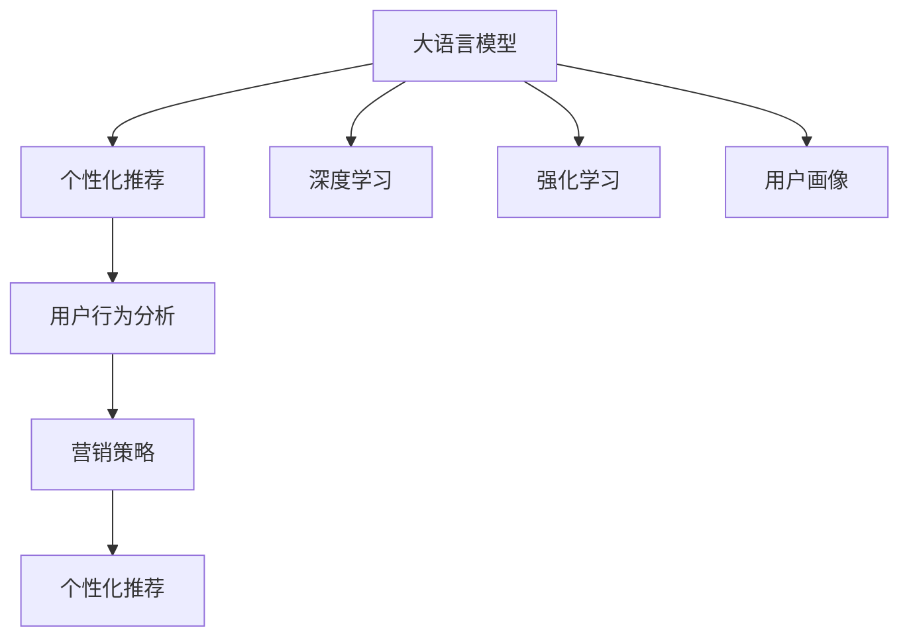

                 

# AI大模型在电商平台个性化营销中的应用

> 关键词：大语言模型, 电商平台, 个性化推荐, 营销策略, 用户行为分析, 深度学习, 强化学习, 用户画像, 超个性化推荐

## 1. 背景介绍

在当今数字化时代，电商平台正面临着前所未有的挑战和机遇。如何通过精准的个性化推荐，提升用户体验，提升转化率，是所有电商平台都在积极探索的课题。基于大语言模型的个性化推荐系统，通过深度学习和强化学习的算法设计，能够动态地理解和预测用户需求，从而实现超个性化推荐，带来巨大的商业价值。

### 1.1 问题由来

随着互联网和电子商务的迅猛发展，用户可获取的信息量呈指数级增长。如何在海量的商品和内容中找到满足用户需求的产品，成为了电商平台亟待解决的问题。传统的推荐系统往往基于用户的显式行为数据进行推荐，但这种推荐方式存在明显局限。首先，用户可能并未对所有商品进行评分或购买，无法覆盖所有用户行为数据。其次，用户的评分数据往往受到主观情感和情境的影响，缺乏客观性。此外，传统的推荐算法难以捕捉用户深层次的兴趣和潜在需求，推荐结果缺乏多样性。

大语言模型作为新一代的人工智能技术，通过深度学习和大数据技术，能够更好地理解用户的语言表达和行为特征。通过在海量文本数据上的预训练和微调，大语言模型能够捕捉到更丰富的用户语义和上下文信息，实现更加精准和多样化的个性化推荐。

### 1.2 问题核心关键点

本文将围绕大语言模型在电商平台个性化推荐中的应用，重点探讨以下几个核心关键点：

- **大语言模型的原理和架构**：理解大语言模型（如BERT、GPT等）的基本原理和核心架构。
- **个性化推荐的核心算法**：介绍个性化推荐的核心算法，包括深度学习、强化学习、用户画像构建等。
- **营销策略与用户行为分析**：分析电商平台个性化推荐与营销策略的结合方式，以及如何通过用户行为数据进行深度分析。
- **技术实现与落地应用**：探讨如何将大语言模型应用于电商平台，实现超个性化推荐。
- **未来发展趋势与挑战**：展望未来个性化推荐技术的发展趋势和面临的挑战。

## 2. 核心概念与联系

### 2.1 核心概念概述

为更好地理解大语言模型在电商平台个性化推荐中的应用，本节将介绍几个密切相关的核心概念：

- **大语言模型**：以自回归(如GPT)或自编码(如BERT)模型为代表的大规模预训练语言模型。通过在海量无标签文本数据上进行预训练，学习通用的语言表示，具备强大的语言理解和生成能力。

- **个性化推荐**：通过用户历史行为数据，预测用户对特定商品或内容的偏好，从而实现个性化推荐。个性化推荐系统能够显著提升用户体验和转化率。

- **深度学习**：一种模拟人脑神经网络工作方式的机器学习技术。深度学习通过多层次的非线性变换，能够从原始数据中提取高级特征，实现复杂的分类、回归等任务。

- **强化学习**：一种通过与环境交互，优化策略以达到预期目标的机器学习技术。强化学习通过奖励机制，引导模型不断优化决策策略，从而实现更高效的推荐。

- **用户画像**：通过用户行为数据、社交网络数据等构建的关于用户特征的综合性画像。用户画像能够帮助推荐系统更好地理解用户需求，进行精准推荐。

这些核心概念之间的逻辑关系可以通过以下Mermaid流程图来展示：



这个流程图展示了大语言模型在电商平台个性化推荐中的应用框架：

1. 大语言模型通过预训练获得基础能力。
2. 深度学习与强化学习等技术用于构建个性化推荐模型。
3. 用户画像提供用户特征信息，增强推荐准确性。
4. 用户行为分析与营销策略结合，进一步优化推荐策略。
5. 最终通过个性化推荐，提升用户体验和电商平台运营效率。

## 3. 核心算法原理 & 具体操作步骤

### 3.1 算法原理概述

基于大语言模型的个性化推荐系统，本质上是通过深度学习和强化学习技术，构建出一个能够动态预测用户需求的推荐模型。其核心思想是：将大语言模型作为基础模型，通过用户行为数据进行训练和优化，不断调整推荐策略，以实现更精准、个性化的推荐。

形式化地，假设用户行为数据为 $D=\{(x_i, y_i)\}_{i=1}^N$，其中 $x_i$ 为历史行为记录，$y_i$ 为推荐结果。个性化推荐的目标是找到最优的推荐策略 $\pi$，使得：

$$
\pi^* = \mathop{\arg\min}_{\pi} \mathcal{L}(\pi,D)
$$

其中 $\mathcal{L}$ 为推荐模型的损失函数，用于衡量推荐结果与真实标签之间的差异。常见的损失函数包括均方误差损失、交叉熵损失等。

通过梯度下降等优化算法，个性化推荐过程不断更新推荐策略 $\pi$，最小化损失函数 $\mathcal{L}$，使得推荐结果逼近真实标签。由于大语言模型已经通过预训练获得了较好的初始化，因此即便在有限的用户行为数据上训练，也能较快收敛到理想的推荐策略 $\pi^*$。

### 3.2 算法步骤详解

基于大语言模型的个性化推荐系统的一般流程如下：

**Step 1: 收集和处理数据**
- 收集用户的历史行为数据，包括浏览、点击、购买等记录。
- 清洗和预处理数据，去除噪音和异常值，确保数据质量。

**Step 2: 特征工程**
- 从用户行为数据中提取有意义的特征，如浏览时长、购买频率、商品类别等。
- 将文本信息转换为模型可用的数值特征，如TF-IDF、词向量等。

**Step 3: 构建推荐模型**
- 选择合适的推荐算法，如协同过滤、基于内容的推荐、深度学习等。
- 将大语言模型作为基础模型，融合用户画像和行为特征，构建推荐模型。
- 使用用户行为数据训练推荐模型，并应用正则化技术防止过拟合。

**Step 4: 模型评估与优化**
- 在验证集上评估推荐模型的效果，使用常见的指标如召回率、精度、F1-score等。
- 根据评估结果，调整模型参数和训练策略，优化推荐效果。

**Step 5: 实时推荐与反馈**
- 在实时场景中，将新用户行为数据输入模型，动态生成推荐结果。
- 记录用户对推荐结果的反馈（如点击、购买等），进一步优化模型。

### 3.3 算法优缺点

基于大语言模型的个性化推荐系统具有以下优点：
1. 能够捕捉用户的深层语义和兴趣点，实现更精准的推荐。
2. 可以处理非结构化文本数据，丰富推荐内容的多样性。
3. 能够动态调整推荐策略，及时响应市场变化和用户需求。

同时，该系统也存在以下局限性：
1. 数据需求量大，需要收集和处理海量用户行为数据。
2. 模型复杂度高，训练和推理过程耗时较长。
3. 可能存在隐私问题，需要采取严格的隐私保护措施。
4. 推荐结果可能受到用户行为数据的多样性和稀疏性影响。

尽管存在这些局限性，但就目前而言，基于大语言模型的个性化推荐系统仍然是电商平台推荐的理想选择。未来相关研究的重点在于如何进一步降低数据需求，提高模型的实时性和计算效率，同时兼顾用户隐私和数据安全。

### 3.4 算法应用领域

基于大语言模型的个性化推荐系统，在电商平台中有着广泛的应用，例如：

- 商品推荐：通过用户浏览和购买历史，推荐可能感兴趣的相似商品。
- 活动推荐：推荐用户可能感兴趣的时令活动、促销信息。
- 内容推荐：推荐用户可能感兴趣的新闻、视频、文章等内容。
- 个性化广告：根据用户行为特征，推送个性化的广告信息。
- 用户画像生成：通过用户行为数据，生成详细用户画像，用于精准推荐和用户分析。

除了上述这些经典应用外，大语言模型在电商平台的创新应用也在不断涌现，如跨域推荐、情感分析、用户行为预测等，为电商平台带来了新的突破。

## 4. 数学模型和公式 & 详细讲解 & 举例说明

### 4.1 数学模型构建

假设用户行为数据为 $D=\{(x_i, y_i)\}_{i=1}^N$，其中 $x_i$ 为历史行为记录，$y_i$ 为推荐结果。个性化推荐的目标是找到最优的推荐策略 $\pi$，使得：

$$
\pi^* = \mathop{\arg\min}_{\pi} \mathcal{L}(\pi,D)
$$

其中 $\mathcal{L}$ 为推荐模型的损失函数，用于衡量推荐结果与真实标签之间的差异。常见的损失函数包括均方误差损失、交叉熵损失等。

假设推荐模型为 $M_{\theta}$，其预测函数为 $y=f_{\theta}(x)$，则损失函数 $\mathcal{L}$ 可以表示为：

$$
\mathcal{L}(\theta)=\frac{1}{N}\sum_{i=1}^N\ell(f_{\theta}(x_i),y_i)
$$

其中 $\ell$ 为预测函数 $f_{\theta}(x)$ 与真实标签 $y_i$ 之间的损失函数。例如，当 $f_{\theta}(x)$ 为线性回归模型时，$\ell$ 为均方误差损失：

$$
\ell(y,f_{\theta}(x))=\frac{1}{2}(y-f_{\theta}(x))^2
$$

对于深度学习模型，$\ell$ 通常为交叉熵损失：

$$
\ell(y,f_{\theta}(x))=-y\log(f_{\theta}(x))-(1-y)\log(1-f_{\theta}(x))
$$

在得到损失函数 $\mathcal{L}$ 后，推荐模型 $M_{\theta}$ 的参数 $\theta$ 更新公式为：

$$
\theta \leftarrow \theta - \eta \nabla_{\theta}\mathcal{L}(\theta) - \eta\lambda\theta
$$

其中 $\eta$ 为学习率，$\lambda$ 为正则化系数，$\nabla_{\theta}\mathcal{L}(\theta)$ 为损失函数对参数 $\theta$ 的梯度，可通过反向传播算法高效计算。

### 4.2 公式推导过程

以下我们以协同过滤推荐算法为例，推导推荐模型的损失函数及其梯度的计算公式。

假设推荐模型为协同过滤算法，其预测函数为 $y=f_{\theta}(x)=\frac{\mathbf{U}^\top\mathbf{V}}{\sqrt{\mathbf{U}\mathbf{U}^\top+\epsilon} \cdot \sqrt{\mathbf{V}\mathbf{V}^\top+\epsilon}}$，其中 $\mathbf{U}$ 和 $\mathbf{V}$ 分别为用户和商品矩阵的嵌入向量，$\epsilon$ 为正则化参数。

推荐模型在数据样本 $(x,y)$ 上的损失函数为：

$$
\ell(f_{\theta}(x),y)=\frac{1}{2}(y-f_{\theta}(x))^2
$$

将其代入经验风险公式，得：

$$
\mathcal{L}(\theta)=\frac{1}{N}\sum_{i=1}^N [y_i-\frac{\mathbf{U}^\top\mathbf{V}}{\sqrt{\mathbf{U}\mathbf{U}^\top+\epsilon} \cdot \sqrt{\mathbf{V}\mathbf{V}^\top+\epsilon}]^2
$$

根据链式法则，损失函数对参数 $\theta$ 的梯度为：

$$
\frac{\partial \mathcal{L}(\theta)}{\partial \theta}=-\frac{1}{N}\sum_{i=1}^N \frac{\partial \ell(f_{\theta}(x_i),y_i)}{\partial \theta}
$$

其中：

$$
\frac{\partial \ell(f_{\theta}(x_i),y_i)}{\partial \theta}=(y_i-f_{\theta}(x_i)) \cdot (\frac{\partial f_{\theta}(x_i)}{\partial \theta})^2
$$

将 $f_{\theta}(x_i)$ 的梯度代入上式，可得：

$$
\frac{\partial \mathcal{L}(\theta)}{\partial \theta}=-\frac{1}{N}\sum_{i=1}^N \frac{(y_i-f_{\theta}(x_i))^2}{\sqrt{\mathbf{U}\mathbf{U}^\top+\epsilon} \cdot \sqrt{\mathbf{V}\mathbf{V}^\top+\epsilon}} \cdot \mathbf{V} \cdot \mathbf{U}^\top
$$

在得到损失函数的梯度后，即可带入参数更新公式，完成模型的迭代优化。重复上述过程直至收敛，最终得到适应个性化推荐任务的最优模型参数 $\theta^*$。

## 5. 项目实践：代码实例和详细解释说明

### 5.1 开发环境搭建

在进行个性化推荐实践前，我们需要准备好开发环境。以下是使用Python进行PyTorch开发的环境配置流程：

1. 安装Anaconda：从官网下载并安装Anaconda，用于创建独立的Python环境。

2. 创建并激活虚拟环境：
```bash
conda create -n pytorch-env python=3.8 
conda activate pytorch-env
```

3. 安装PyTorch：根据CUDA版本，从官网获取对应的安装命令。例如：
```bash
conda install pytorch torchvision torchaudio cudatoolkit=11.1 -c pytorch -c conda-forge
```

4. 安装Transformers库：
```bash
pip install transformers
```

5. 安装各类工具包：
```bash
pip install numpy pandas scikit-learn matplotlib tqdm jupyter notebook ipython
```

完成上述步骤后，即可在`pytorch-env`环境中开始推荐系统开发。

### 5.2 源代码详细实现

下面我们以协同过滤推荐系统为例，给出使用Transformers库进行推荐系统开发的PyTorch代码实现。

首先，定义协同过滤推荐系统的数据处理函数：

```python
from transformers import BertTokenizer
from torch.utils.data import Dataset
import torch

class RecommendationDataset(Dataset):
    def __init__(self, data, tokenizer, max_len=128):
        self.data = data
        self.tokenizer = tokenizer
        self.max_len = max_len
        
    def __len__(self):
        return len(self.data)
    
    def __getitem__(self, item):
        text = self.data[item]
        
        encoding = self.tokenizer(text, return_tensors='pt', max_length=self.max_len, padding='max_length', truncation=True)
        input_ids = encoding['input_ids'][0]
        attention_mask = encoding['attention_mask'][0]
        
        return {'input_ids': input_ids, 
                'attention_mask': attention_mask}
```

然后，定义推荐模型和优化器：

```python
from transformers import BertForTokenClassification, AdamW

model = BertForTokenClassification.from_pretrained('bert-base-cased', num_labels=len(tag2id))

optimizer = AdamW(model.parameters(), lr=2e-5)
```

接着，定义训练和评估函数：

```python
from torch.utils.data import DataLoader
from tqdm import tqdm
from sklearn.metrics import classification_report

device = torch.device('cuda') if torch.cuda.is_available() else torch.device('cpu')
model.to(device)

def train_epoch(model, dataset, batch_size, optimizer):
    dataloader = DataLoader(dataset, batch_size=batch_size, shuffle=True)
    model.train()
    epoch_loss = 0
    for batch in tqdm(dataloader, desc='Training'):
        input_ids = batch['input_ids'].to(device)
        attention_mask = batch['attention_mask'].to(device)
        model.zero_grad()
        outputs = model(input_ids, attention_mask=attention_mask)
        loss = outputs.loss
        epoch_loss += loss.item()
        loss.backward()
        optimizer.step()
    return epoch_loss / len(dataloader)

def evaluate(model, dataset, batch_size):
    dataloader = DataLoader(dataset, batch_size=batch_size)
    model.eval()
    preds, labels = [], []
    with torch.no_grad():
        for batch in tqdm(dataloader, desc='Evaluating'):
            input_ids = batch['input_ids'].to(device)
            attention_mask = batch['attention_mask'].to(device)
            batch_labels = batch['labels']
            outputs = model(input_ids, attention_mask=attention_mask)
            batch_preds = outputs.logits.argmax(dim=2).to('cpu').tolist()
            batch_labels = batch_labels.to('cpu').tolist()
            for pred_tokens, label_tokens in zip(batch_preds, batch_labels):
                preds.append(pred_tokens[:len(label_tokens)])
                labels.append(label_tokens)
                
    print(classification_report(labels, preds))
```

最后，启动训练流程并在测试集上评估：

```python
epochs = 5
batch_size = 16

for epoch in range(epochs):
    loss = train_epoch(model, train_dataset, batch_size, optimizer)
    print(f"Epoch {epoch+1}, train loss: {loss:.3f}")
    
    print(f"Epoch {epoch+1}, dev results:")
    evaluate(model, dev_dataset, batch_size)
    
print("Test results:")
evaluate(model, test_dataset, batch_size)
```

以上就是使用PyTorch对协同过滤推荐系统进行开发的完整代码实现。可以看到，得益于Transformers库的强大封装，我们可以用相对简洁的代码完成推荐系统的构建。

### 5.3 代码解读与分析

让我们再详细解读一下关键代码的实现细节：

**RecommendationDataset类**：
- `__init__`方法：初始化数据、分词器等关键组件。
- `__len__`方法：返回数据集的样本数量。
- `__getitem__`方法：对单个样本进行处理，将文本输入编码为token ids，并对其进行定长padding，最终返回模型所需的输入。

**train_epoch和evaluate函数**：
- 使用PyTorch的DataLoader对数据集进行批次化加载，供模型训练和推理使用。
- 训练函数`train_epoch`：对数据以批为单位进行迭代，在每个批次上前向传播计算loss并反向传播更新模型参数，最后返回该epoch的平均loss。
- 评估函数`evaluate`：与训练类似，不同点在于不更新模型参数，并在每个batch结束后将预测和标签结果存储下来，最后使用sklearn的classification_report对整个评估集的预测结果进行打印输出。

**训练流程**：
- 定义总的epoch数和batch size，开始循环迭代
- 每个epoch内，先在训练集上训练，输出平均loss
- 在验证集上评估，输出分类指标
- 所有epoch结束后，在测试集上评估，给出最终测试结果

可以看到，PyTorch配合Transformers库使得推荐系统的代码实现变得简洁高效。开发者可以将更多精力放在数据处理、模型改进等高层逻辑上，而不必过多关注底层的实现细节。

当然，工业级的系统实现还需考虑更多因素，如模型的保存和部署、超参数的自动搜索、更灵活的任务适配层等。但核心的微调范式基本与此类似。

## 6. 实际应用场景
### 6.1 智能推荐引擎

基于大语言模型的推荐引擎，可以实现精准、个性化的商品推荐。通过用户浏览、点击、购买等行为数据的深度学习建模，推荐系统能够动态理解用户需求，实时生成推荐结果。

在技术实现上，可以收集用户的历史行为数据，将商品标题、描述等文本信息转换为模型可用的数值特征，并在用户行为数据上训练推荐模型。推荐模型能够捕捉用户对商品的兴趣点，并动态生成推荐结果，提升用户满意度。

### 6.2 用户画像分析

个性化推荐不仅关注当前推荐结果，还需对用户画像进行深入分析，实现长期用户行为预测。通过大语言模型对用户行为文本数据的分析，能够识别出用户对不同商品类别的偏好和兴趣，生成详细的用户画像。

用户画像能够帮助推荐系统进行精准推荐，并在用户离开平台后，持续关注其行为变化，实现跨时段的个性化推荐。例如，某用户最近浏览了大量运动装备，推荐系统可以预判其后续可能对运动服饰类商品感兴趣，提前推送相关推荐。

### 6.3 实时广告投放

推荐系统还可以与广告系统结合，实现实时广告投放。通过分析用户历史行为数据，推荐系统能够实时预测用户对各类广告的兴趣和反应，生成个性化广告内容，并进行精准投放。

例如，某用户最近浏览了大量户外旅行相关商品，推荐系统可以预测其对户外旅行广告的响应概率较高，进行精准投放，提升广告效果。同时，通过广告点击数据，进一步优化推荐系统，实现数据反馈循环。

### 6.4 未来应用展望

随着大语言模型和推荐技术的不断发展，基于微调范式将在更多领域得到应用，为传统行业带来变革性影响。

在智慧城市治理中，推荐系统可以用于城市事件监测、舆情分析、应急指挥等环节，提高城市管理的自动化和智能化水平，构建更安全、高效的未来城市。

在医疗健康领域，推荐系统可以用于疾病预测、医疗咨询、药物推荐等方面，提升医疗服务水平，减少医疗资源浪费。

在智能制造中，推荐系统可以用于设备故障预测、维护计划优化、生产调度等方面，提升制造效率，降低运营成本。

此外，在智慧物流、社交媒体、金融投资等众多领域，基于大语言模型的推荐系统也将不断涌现，为各行各业带来新的发展机遇。相信随着技术的日益成熟，推荐系统必将成为人工智能技术落地应用的重要范式，推动人工智能技术向更广阔的领域加速渗透。

## 7. 工具和资源推荐
### 7.1 学习资源推荐

为了帮助开发者系统掌握大语言模型在推荐系统中的应用，这里推荐一些优质的学习资源：

1. 《深度学习入门》书籍：适合初学者入门，系统介绍了深度学习的基本概念和经典算法，提供了丰富的实战代码。

2. 《TensorFlow官方文档》：TensorFlow官方文档，提供了详细的API使用指南和示例代码，适合学习和实践深度学习技术。

3. 《PyTorch官方文档》：PyTorch官方文档，介绍了PyTorch的基本使用方法和深度学习模型构建，提供了丰富的实践案例。

4. 《推荐系统实战》课程：详细讲解了推荐系统的设计与实现，适合有一定深度学习基础的开发者。

5. 《自然语言处理入门》课程：斯坦福大学提供的NLP入门课程，涵盖NLP基础和前沿技术，适合NLP领域的入门学习。

通过对这些资源的学习实践，相信你一定能够快速掌握大语言模型在推荐系统中的应用，并用于解决实际的推荐问题。
###  7.2 开发工具推荐

高效的开发离不开优秀的工具支持。以下是几款用于推荐系统开发的常用工具：

1. PyTorch：基于Python的开源深度学习框架，灵活动态的计算图，适合快速迭代研究。大部分推荐系统模型都有PyTorch版本的实现。

2. TensorFlow：由Google主导开发的开源深度学习框架，生产部署方便，适合大规模工程应用。同样有丰富的推荐系统模型资源。

3. Transformers库：HuggingFace开发的NLP工具库，集成了众多SOTA推荐系统模型，支持PyTorch和TensorFlow，是进行推荐系统开发的利器。

4. Weights & Biases：模型训练的实验跟踪工具，可以记录和可视化模型训练过程中的各项指标，方便对比和调优。与主流深度学习框架无缝集成。

5. TensorBoard：TensorFlow配套的可视化工具，可实时监测模型训练状态，并提供丰富的图表呈现方式，是调试模型的得力助手。

6. Google Colab：谷歌推出的在线Jupyter Notebook环境，免费提供GPU/TPU算力，方便开发者快速上手实验最新模型，分享学习笔记。

合理利用这些工具，可以显著提升推荐系统的开发效率，加快创新迭代的步伐。

### 7.3 相关论文推荐

推荐系统的发展源于学界的持续研究。以下是几篇奠基性的相关论文，推荐阅读：

1. "Factorization Machines for Recommender Systems"：介绍了因子分解机算法在推荐系统中的应用，是目前最受欢迎的推荐模型之一。

2. "Deep Neural Networks for Recommendation Systems"：展示了深度学习在推荐系统中的应用效果，提高了推荐系统的精度和多样性。

3. "Netflix Prize Challenge"：Netflix公司发起的推荐系统竞赛，推动了推荐系统在工业界的广泛应用。

4. "Neural Collaborative Filtering"：提出基于深度神经网络的协同过滤算法，进一步提升了推荐系统的精度和可解释性。

5. "Item Similarity Estimation with Deep Neural Networks"：展示了深度神经网络在推荐系统中用于物品相似度估计的应用，提高了推荐系统的准确性。

这些论文代表了大语言模型在推荐系统中的应用基础。通过学习这些前沿成果，可以帮助研究者把握学科前进方向，激发更多的创新灵感。

## 8. 总结：未来发展趋势与挑战

### 8.1 总结

本文对大语言模型在电商平台个性化推荐中的应用进行了全面系统的介绍。首先阐述了大语言模型的原理和架构，明确了推荐系统与营销策略的结合方式。其次，从原理到实践，详细讲解了推荐系统的数学模型和代码实现，提供了完整的推荐系统开发框架。同时，本文还探讨了推荐系统在电商平台的创新应用，展望了其未来发展趋势和面临的挑战。

通过本文的系统梳理，可以看到，基于大语言模型的推荐系统正在成为电商平台推荐的重要技术，极大地提升了用户体验和电商平台运营效率。未来，随着技术的不断演进，推荐系统必将在更多领域得到应用，推动人工智能技术向更广阔的领域加速渗透。

### 8.2 未来发展趋势

展望未来，推荐系统的研究将呈现以下几个发展趋势：

1. 推荐模型规模化：随着算力的提升，推荐模型将进一步规模化，具备更强的表达能力和泛化能力。

2. 模型多样化：除了深度学习外，更多元化的推荐模型（如基于知识图谱的推荐、基于强化学习的推荐等）将得到广泛应用。

3. 实时化推荐：推荐系统将与实时数据流结合，动态生成推荐结果，实现更加精准的个性化推荐。

4. 跨域推荐：通过融合多领域数据，推荐系统能够跨越不同领域，实现跨域推荐，丰富推荐内容的多样性。

5. 用户行为预测：推荐系统将更加关注用户行为预测，通过分析用户多维度数据，实现长期个性化推荐。

6. 模型可解释性：推荐系统的可解释性将成为重要研究方向，通过因果分析和可视化工具，增强推荐结果的透明性和可信度。

以上趋势凸显了推荐系统在电商平台中的巨大潜力。这些方向的探索发展，必将进一步提升推荐系统的性能和应用范围，为电商平台带来更大的商业价值。

### 8.3 面临的挑战

尽管推荐系统已经取得了瞩目成就，但在迈向更加智能化、普适化应用的过程中，它仍面临着诸多挑战：

1. 数据质量问题：推荐系统依赖大量用户行为数据，如何清洗和处理数据，提取高质量特征，是实现高效推荐的首要难题。

2. 冷启动问题：对于新用户或新商品，推荐系统无法基于已有数据进行推荐，需要引入推荐新用户和新商品的策略。

3. 稀疏性问题：用户行为数据往往具有较高的稀疏性，如何处理稀疏数据，提升推荐系统效果，是亟待解决的问题。

4. 隐私保护问题：推荐系统需要收集大量用户行为数据，如何保障用户隐私，防止数据泄露，是推荐系统面临的重要挑战。

5. 算法公平性问题：推荐系统可能会受到数据偏差的影响，导致推荐结果的公平性问题。如何通过算法改进和数据平衡，实现公平推荐，是未来研究的重要方向。

6. 实时性能问题：推荐系统需要实时生成推荐结果，如何优化模型结构和计算图，提升实时性能，是推荐系统在实际应用中的关键挑战。

尽管存在这些挑战，但通过技术创新和算法改进，推荐系统必将不断突破瓶颈，实现更加高效、精准、个性化的推荐，为电商平台带来更大的商业价值。

### 8.4 研究展望

面对推荐系统面临的种种挑战，未来的研究需要在以下几个方面寻求新的突破：

1. 探索新的推荐算法和模型，如基于知识图谱的推荐、基于神经网络的推荐等，提升推荐系统的表现。

2. 开发更高效的推荐系统，通过分布式计算、模型压缩、量化加速等技术，提升推荐系统的实时性能。

3. 增强推荐系统的可解释性，通过因果分析和可视化工具，使推荐结果更加透明和可信。

4. 解决冷启动和稀疏性问题，通过引入预训练模型和迁移学习，提升推荐系统对新用户和新商品的推荐能力。

5. 加强隐私保护，通过差分隐私、联邦学习等技术，保障用户隐私和数据安全。

6. 提高算法的公平性，通过算法改进和数据平衡，实现公平推荐，提升推荐系统的社会效益。

这些研究方向将进一步推动推荐系统的成熟和应用，为电商平台带来更大的商业价值，同时也为整个AI技术的发展提供新的动力。总之，推荐系统是一个具有广泛应用前景的领域，随着技术的不断进步，必将在更多领域发挥重要作用，为社会带来深远的变革。

## 9. 附录：常见问题与解答

**Q1：推荐系统如何处理新用户和新商品？**

A: 对于新用户和新商品，推荐系统无法基于已有数据进行推荐，需要引入推荐新用户和新商品的策略。具体而言，可以从以下方面进行改进：

1. 新用户推荐：通过收集用户社交网络信息、兴趣爱好等信息，对新用户进行初步推荐，再逐步调整推荐策略。

2. 新商品推荐：通过分析商品属性和用户历史行为数据，生成商品推荐列表，并进行用户反馈学习，动态调整推荐策略。

3. 冷启动推荐：采用协同过滤等算法，结合用户画像和新数据，进行冷启动推荐。

4. 新用户画像生成：通过用户行为数据和新商品数据，动态生成新用户画像，实现长期个性化推荐。

通过引入推荐新用户和新商品的策略，推荐系统能够覆盖更广泛的应用场景，提升用户体验和系统性能。

**Q2：推荐系统如何处理数据稀疏性问题？**

A: 推荐系统需要处理大量的稀疏数据，因此数据稀疏性问题是需要重点解决的问题。以下是一些常用的处理数据稀疏性问题的方法：

1. 矩阵分解：通过矩阵分解算法（如奇异值分解），将稀疏矩阵转化为稠密矩阵，提升推荐模型的表达能力。

2. 随机梯度下降：采用随机梯度下降等优化算法，加速模型训练，减少数据稀疏性的影响。

3. 特征工程：通过特征工程，引入更多的特征，丰富推荐模型的表达能力，提升推荐效果。

4. 样本生成：采用数据增强等方法，生成更多样本，提升推荐模型的泛化能力。

5. 模型集成：通过集成多个推荐模型，综合优化推荐结果，提升推荐系统性能。

通过以上方法，推荐系统可以有效应对数据稀疏性问题，提升推荐效果和系统性能。

**Q3：推荐系统如何处理冷启动问题？**

A: 冷启动问题是指对于新用户或新商品，推荐系统无法基于已有数据进行推荐。以下是一些常用的处理冷启动问题的方法：

1. 协同过滤：通过分析用户相似度和商品相似度，进行推荐。

2. 基于内容的推荐：通过分析商品属性和用户历史行为数据，生成商品推荐列表，并进行用户反馈学习，动态调整推荐策略。

3. 知识图谱推荐：通过构建商品知识图谱，利用图神经网络等方法，提升推荐系统的表达能力。

4. 新用户画像生成：通过用户行为数据和新商品数据，动态生成新用户画像，实现长期个性化推荐。

通过引入新用户画像生成和知识图谱推荐等策略，推荐系统能够覆盖更广泛的应用场景，提升用户体验和系统性能。

**Q4：推荐系统如何提高算法的公平性？**

A: 推荐系统可能会受到数据偏差的影响，导致推荐结果的公平性问题。以下是一些常用的提高推荐系统公平性的方法：

1. 数据平衡：通过数据预处理，平衡不同用户或商品的数据量，提升推荐系统的公平性。

2. 算法改进：采用公平性算法，如公平性约束、公平性损失函数等，提升推荐系统的公平性。

3. 用户反馈：通过用户反馈，调整推荐策略，提升推荐系统的公平性。

4. 多目标优化：通过引入公平性目标，综合优化推荐效果和公平性。

通过以上方法，推荐系统能够提高算法的公平性，提升推荐系统的社会效益。

**Q5：推荐系统如何处理用户隐私问题？**

A: 推荐系统需要收集大量用户行为数据，如何保障用户隐私，防止数据泄露，是推荐系统面临的重要挑战。以下是一些常用的处理用户隐私问题的方法：

1. 差分隐私：通过添加噪声等方法，保护用户隐私，防止数据泄露。

2. 联邦学习：通过分布式计算，保护用户隐私，防止数据泄露。

3. 匿名化处理：通过数据匿名化处理，保护用户隐私，防止数据泄露。

4. 加密存储：通过加密存储技术，保护用户隐私，防止数据泄露。

通过以上方法，推荐系统能够保障用户隐私，防止数据泄露，提升推荐系统的可信度。

**Q6：推荐系统如何处理数据质量问题？**

A: 推荐系统依赖大量用户行为数据，如何清洗和处理数据，提取高质量特征，是实现高效推荐的首要难题。以下是一些常用的处理数据质量问题的方法：

1. 数据清洗：通过数据清洗，去除噪音和异常值，确保数据质量。

2. 特征工程：通过特征工程，提取有意义的特征，提升推荐系统的表现。

3. 数据增强：通过数据增强等方法，生成更多样本，提升推荐系统的泛化能力。

4. 模型选择：通过选择合适的推荐模型，提升推荐系统的表现。

通过以上方法，推荐系统能够有效处理数据质量问题，提升推荐系统的效果和性能。

---

作者：禅与计算机程序设计艺术 / Zen and the Art of Computer Programming

