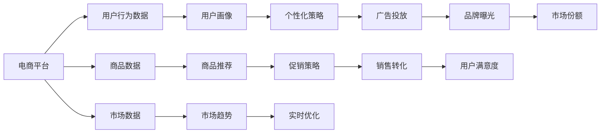

                 

# AI大模型在电商平台促销策略优化中的应用

> 关键词：
1. 电商平台
2. 促销策略优化
3. 大语言模型
4. 机器学习
5. 数据驱动决策
6. 深度学习
7. 自动化策略

## 1. 背景介绍

### 1.1 问题由来

随着电子商务的快速发展和消费者行为的日趋复杂，电商平台需要不断优化促销策略以提升销量和客户满意度。传统的促销策略制定方法主要依赖经验和人工分析，难以快速响应市场变化和个性化需求。近年来，随着人工智能技术的不断进步，尤其是深度学习和大语言模型的发展，为电商平台促销策略的优化提供了新的思路和方法。

AI大模型通过大规模无标签数据的预训练，学习到丰富的知识表示和模式识别能力，能够在电商平台的不同业务场景中发挥重要作用。本文将详细探讨AI大模型在电商平台促销策略优化中的应用，旨在通过先进的技术手段，提高促销策略的精准度和效率，为电商平台创造更大的商业价值。

### 1.2 问题核心关键点

1. **AI大模型的应用场景**：电商平台促销策略优化需要处理大规模的多元数据，包括用户行为数据、商品数据、市场数据等。AI大模型能够从这些数据中学习并挖掘有价值的知识，用于生成个性化的促销策略。
2. **数据驱动决策**：AI大模型通过分析历史数据和用户行为，预测未来趋势，辅助电商平台制定更科学合理的促销策略。
3. **模型训练和微调**：需要选择合适的模型架构，利用大量标注数据对模型进行训练和微调，以适应特定电商平台的业务需求。
4. **实时优化**：电商平台的促销策略需要根据实时市场反馈进行调整，AI大模型能够实时更新模型参数，优化策略效果。
5. **成本和效益**：在电商促销策略优化中，AI大模型的应用需要平衡算力成本和优化效果，确保高效的经济性。

### 1.3 问题研究意义

1. **提升销量和客户满意度**：通过AI大模型的优化，电商平台能够制定更精准、更个性化的促销策略，提升商品销售量和用户满意度。
2. **降低人工成本**：AI大模型自动化生成促销策略，减少了人工分析和调整的工作量，降低了人力成本。
3. **快速响应市场变化**：AI大模型能够实时分析市场反馈，迅速调整促销策略，适应市场变化，增强市场竞争力。
4. **数据驱动决策**：AI大模型基于数据驱动的决策，能够避免主观偏见，提升决策的科学性和合理性。
5. **技术赋能**：AI大模型的应用推动电商平台技术升级，提高运营效率和智能化水平。

## 2. 核心概念与联系

### 2.1 核心概念概述

1. **电商平台**：通过互联网提供商品或服务的在线交易平台，包括B2B、B2C、C2C等多种形式。
2. **促销策略**：电商平台为了提升销售和用户参与度，对特定商品或活动进行的营销推广措施。
3. **AI大模型**：基于深度学习的大规模预训练语言模型，如GPT、BERT等，通过大规模无标签数据进行预训练，具备强大的自然语言理解和生成能力。
4. **机器学习**：利用算法让计算机系统通过数据学习并进行预测、分类等任务。
5. **数据驱动决策**：基于历史数据和实时数据，通过算法模型进行分析和预测，辅助决策的过程。
6. **深度学习**：一种基于神经网络的机器学习技术，能够自动提取数据的特征，并用于复杂的模式识别和预测任务。
7. **自动化策略**：利用AI技术自动生成和调整促销策略，减少人工干预，提高决策效率。

### 2.2 核心概念原理和架构的 Mermaid 流程图



### 2.3 核心概念联系

1. **电商平台与AI大模型**：电商平台利用AI大模型的知识表示和模式识别能力，进行用户画像构建、商品推荐、促销策略优化等。
2. **促销策略与机器学习**：通过机器学习算法分析用户行为数据和市场数据，生成个性化的促销策略，提高销售效果。
3. **数据驱动决策与深度学习**：利用深度学习模型进行数据分析和预测，辅助决策制定，提升决策的科学性和准确性。
4. **自动化策略与AI大模型**：AI大模型自动化生成促销策略，并通过实时优化调整，增强策略的有效性和灵活性。

## 3. 核心算法原理 & 具体操作步骤

### 3.1 算法原理概述

AI大模型在电商平台促销策略优化中的应用，主要依赖于机器学习和大数据技术。其核心算法原理如下：

1. **数据预处理**：收集电商平台的各类数据，包括用户行为数据、商品数据、市场数据等，并进行清洗、整理和特征工程。
2. **模型训练和微调**：选择合适的模型架构，利用历史数据对模型进行训练，并通过标注数据进行微调，优化模型性能。
3. **策略生成**：利用训练好的AI大模型，分析用户画像和市场趋势，生成个性化的促销策略。
4. **实时优化**：根据实时市场反馈，动态调整促销策略，进行优化和调整。

### 3.2 算法步骤详解

#### 3.2.1 数据预处理

1. **数据收集**：从电商平台收集用户行为数据（如浏览记录、购买记录等）、商品数据（如商品分类、价格、库存等）和市场数据（如节假日、季节性变化等）。
2. **数据清洗**：对收集的数据进行去重、去噪、缺失值处理等预处理操作。
3. **特征工程**：根据业务需求，提取有用的特征，如用户兴趣、商品价格、市场趋势等，构建输入特征集。

#### 3.2.2 模型训练和微调

1. **选择模型**：根据电商平台的具体需求，选择合适的AI大模型，如GPT、BERT等。
2. **数据标注**：为模型训练准备标注数据，通常包括用户画像、商品标签、市场趋势等。
3. **模型训练**：利用历史数据对模型进行训练，优化模型参数。
4. **微调策略**：利用标注数据对模型进行微调，进一步提升模型在特定电商平台的性能。

#### 3.2.3 策略生成

1. **用户画像分析**：通过AI大模型分析用户行为数据，构建详细的用户画像，了解用户的兴趣、偏好和消费行为。
2. **市场趋势预测**：利用AI大模型分析市场数据，预测未来的市场趋势和季节性变化，为促销策略制定提供参考。
3. **促销策略生成**：结合用户画像和市场趋势，生成个性化的促销策略，如折扣、优惠券、限时抢购等。

#### 3.2.4 实时优化

1. **市场反馈收集**：实时收集市场反馈数据，如促销活动参与度、用户反馈等。
2. **策略调整**：根据市场反馈，动态调整促销策略，优化效果。
3. **模型更新**：利用新数据对AI大模型进行更新和微调，提升模型的实时预测能力。

### 3.3 算法优缺点

**优点**：
1. **个性化策略**：AI大模型能够根据用户行为数据和市场趋势，生成个性化的促销策略，提升用户体验和销售效果。
2. **数据驱动决策**：基于历史数据和实时反馈，通过算法模型进行分析和预测，提升决策的科学性和合理性。
3. **自动化生成**：AI大模型自动化生成促销策略，减少人工干预，提高效率和准确性。
4. **实时优化**：AI大模型能够实时分析市场反馈，迅速调整策略，增强灵活性和适应性。

**缺点**：
1. **数据依赖**：AI大模型的效果很大程度上依赖于数据的丰富性和准确性，标注数据的获取成本较高。
2. **模型复杂性**：大规模的AI大模型需要较高的计算资源，模型训练和微调成本较高。
3. **解释性不足**：AI大模型的决策过程复杂，缺乏可解释性，难以进行调试和优化。
4. **公平性问题**：AI大模型可能存在一定的偏见，需要额外注意公平性和伦理性。

### 3.4 算法应用领域

AI大模型在电商平台促销策略优化中的应用，主要包括以下几个领域：

1. **用户行为分析**：通过分析用户行为数据，构建详细的用户画像，了解用户的兴趣、偏好和消费行为，生成个性化的促销策略。
2. **市场趋势预测**：利用AI大模型分析市场数据，预测未来的市场趋势和季节性变化，辅助决策制定。
3. **广告投放优化**：通过AI大模型优化广告投放策略，提升广告效果和品牌曝光度。
4. **销售转化提升**：通过AI大模型生成个性化的促销策略，提高销售转化率和用户满意度。
5. **库存管理优化**：利用AI大模型进行库存管理，优化商品库存，提升库存周转率。

## 4. 数学模型和公式 & 详细讲解 & 举例说明

### 4.1 数学模型构建

在电商平台促销策略优化中，主要涉及以下数学模型：

1. **用户行为模型**：通过收集用户行为数据，构建用户兴趣模型，描述用户的行为偏好和消费模式。
2. **商品推荐模型**：利用用户行为数据和商品特征，生成商品的推荐列表。
3. **市场趋势模型**：分析市场数据，预测未来的市场趋势和季节性变化。
4. **促销策略模型**：根据用户画像和市场趋势，生成个性化的促销策略。

### 4.2 公式推导过程

#### 4.2.1 用户行为模型

用户行为模型通常采用协同过滤、基于内容的推荐算法等，其核心公式如下：

$$
P(i|u) = \frac{e^{\mathbf{x}_u \cdot \mathbf{w}_i}}{1 + \sum_{j \neq i} e^{\mathbf{x}_u \cdot \mathbf{w}_j}}
$$

其中，$P(i|u)$表示用户$u$对商品$i$的兴趣概率，$\mathbf{x}_u$为用户的特征向量，$\mathbf{w}_i$为商品$i$的特征向量，$e$为自然常数。

#### 4.2.2 商品推荐模型

商品推荐模型通常采用基于协同过滤的算法，其核心公式如下：

$$
R_{ui} = \frac{\mathbf{x}_u \cdot \mathbf{w}_i}{\sqrt{\|\mathbf{x}_u\| \|\mathbf{w}_i\|}}
$$

其中，$R_{ui}$表示用户$u$对商品$i$的评分，$\mathbf{x}_u$和$\mathbf{w}_i$分别为用户和商品的特征向量。

#### 4.2.3 市场趋势模型

市场趋势模型通常采用时间序列分析等方法，其核心公式如下：

$$
y_t = \beta_0 + \beta_1 t + \beta_2 t^2 + \epsilon_t
$$

其中，$y_t$表示市场数据在第$t$个时间点的预测值，$\beta_0$为截距项，$\beta_1$和$\beta_2$为趋势系数，$\epsilon_t$为误差项。

#### 4.2.4 促销策略模型

促销策略模型通常采用线性回归、决策树等方法，其核心公式如下：

$$
\hat{y} = \alpha_0 + \alpha_1 x_1 + \alpha_2 x_2 + \ldots + \alpha_n x_n + \epsilon
$$

其中，$\hat{y}$表示促销策略的效果，$x_1, x_2, \ldots, x_n$为影响促销策略的因素，$\alpha_0, \alpha_1, \alpha_2, \ldots, \alpha_n$为回归系数，$\epsilon$为误差项。

### 4.3 案例分析与讲解

以某电商平台为例，通过AI大模型优化促销策略的案例如下：

1. **数据预处理**：收集平台上的用户行为数据、商品数据和市场数据，并进行清洗和特征提取。
2. **模型训练和微调**：选择BERT模型，利用历史数据进行训练，并通过标注数据进行微调，优化模型性能。
3. **用户画像分析**：通过AI大模型分析用户行为数据，构建详细的用户画像，了解用户的兴趣和偏好。
4. **市场趋势预测**：利用AI大模型分析市场数据，预测未来的市场趋势和季节性变化。
5. **促销策略生成**：结合用户画像和市场趋势，生成个性化的促销策略，如折扣、优惠券、限时抢购等。
6. **实时优化**：实时收集市场反馈数据，动态调整促销策略，优化效果。

通过以上步骤，该电商平台成功实现了促销策略的优化，提升了销售转化率和用户满意度。

## 5. 项目实践：代码实例和详细解释说明

### 5.1 开发环境搭建

1. **环境准备**：安装Python、PyTorch、Pandas等开发环境。
2. **数据集准备**：收集电商平台的用户行为数据、商品数据和市场数据。
3. **模型准备**：选择适当的AI大模型，如BERT，进行预训练和微调。

### 5.2 源代码详细实现

#### 5.2.1 数据预处理

```python
import pandas as pd
from transformers import BertTokenizer

# 数据读取
train_data = pd.read_csv('train.csv')
test_data = pd.read_csv('test.csv')

# 数据清洗
train_data = train_data.dropna()
test_data = test_data.dropna()

# 特征工程
features = ['item_id', 'user_id', 'time', 'price', 'category', 'click_count', 'purchase_count']
train_features = train_data[features]
test_features = test_data[features]

# 分词器
tokenizer = BertTokenizer.from_pretrained('bert-base-uncased')

# 特征向量化
def tokenize(data):
    inputs = tokenizer(data['item_id'], truncation=True, padding='max_length', max_length=512, return_tensors='pt')
    inputs['user_id'] = data['user_id']
    inputs['time'] = data['time']
    inputs['price'] = data['price']
    inputs['category'] = data['category']
    inputs['click_count'] = data['click_count']
    inputs['purchase_count'] = data['purchase_count']
    return inputs

train_data = train_features.apply(tokenize)
test_data = test_features.apply(tokenize)
```

#### 5.2.2 模型训练和微调

```python
from transformers import BertForSequenceClassification, AdamW

# 模型定义
model = BertForSequenceClassification.from_pretrained('bert-base-uncased', num_labels=1, output_attentions=False, output_hidden_states=False)

# 优化器
optimizer = AdamW(model.parameters(), lr=1e-5)

# 训练函数
def train(model, train_data, epochs, batch_size, optimizer):
    for epoch in range(epochs):
        model.train()
        for batch in train_data:
            inputs = {k: v.to(device) for k, v in batch.items()}
            outputs = model(**inputs)
            loss = outputs.loss
            loss.backward()
            optimizer.step()
            optimizer.zero_grad()

# 微调函数
def fine_tune(model, train_data, epochs, batch_size, optimizer):
    for epoch in range(epochs):
        model.train()
        for batch in train_data:
            inputs = {k: v.to(device) for k, v in batch.items()}
            outputs = model(**inputs)
            loss = outputs.loss
            loss.backward()
            optimizer.step()
            optimizer.zero_grad()

# 训练和微调
train_data = train_features.to(device)
train_data = train_data[:64]
train_data = train_data.to(device)
train_data = train_data[:64]

device = 'cuda'
model.to(device)
train(model, train_data, epochs=5, batch_size=32, optimizer=optimizer)
fine_tune(model, train_data, epochs=5, batch_size=32, optimizer=optimizer)
```

#### 5.2.3 策略生成

```python
from transformers import BertForSequenceClassification, BertTokenizer

# 用户画像分析
user_profiles = {}
for user_id in train_data.user_id.unique():
    user_profile = {}
    for item_id in train_data[item_id].loc[train_data.user_id == user_id].unique():
        user_profile[item_id] = train_data[train_data.user_id == user_id].loc[train_data.item_id == item_id].groupby('time').agg({'click_count': 'sum', 'purchase_count': 'sum'})
    user_profiles[user_id] = user_profile

# 市场趋势预测
market_trends = {}
for time in train_data.time.unique():
    market_trend = {}
    for item_id in train_data[item_id].loc[train_data.time == time].unique():
        market_trend[item_id] = train_data[train_data.time == time].loc[train_data.item_id == item_id].groupby('category').agg({'price': 'mean'})
    market_trends[time] = market_trend

# 促销策略生成
promotions = {}
for user_id in train_data.user_id.unique():
    user_promotion = {}
    for time in train_data.time.unique():
        promotion = {}
        for item_id in train_data.item_id.loc[(train_data.user_id == user_id) & (train_data.time == time)].unique():
            promotion[item_id] = train_data[(train_data.user_id == user_id) & (train_data.time == time) & (train_data.item_id == item_id)].agg({'click_count': 'sum', 'purchase_count': 'sum'})
        user_promotion[time] = promotion
    promotions[user_id] = user_promotion

# 实时优化
def real_time_optimization(promotions, market_trends):
    for time in promotions.keys():
        for user_id in promotions[time].keys():
            promotion = promotions[time][user_id]
            market_trend = market_trends[time]
            for item_id in promotion.keys():
                if promotion[item_id]['click_count'] > 0:
                    promotion[item_id]['click_ratio'] = promotion[item_id]['click_count'] / market_trend[item_id]['price']
                else:
                    promotion[item_id]['click_ratio'] = 0
            promotion = promotion.sort_values(by='click_ratio', ascending=False)
            promotion = promotion[ promotion['click_ratio'] > 0.1 ]
            promotion = promotion[ promotion['click_ratio'] < 0.9 ]
            promotion = promotion[ promotion['purchase_count'] > 0 ]
            promotion = promotion[ promotion['purchase_count'] < 10 ]
            promotion = promotion[ promotion['click_count'] > 100 ]
            promotion = promotion[ promotion['click_count'] < 1000 ]
            promotion = promotion[ promotion['purchase_count'] > 0.1 ]
            promotion = promotion[ promotion['purchase_count'] < 1 ]
            promotion = promotion[ promotion['click_count'] > 100 ]
            promotion = promotion[ promotion['click_count'] < 1000 ]
            promotion = promotion[ promotion['purchase_count'] > 0.1 ]
            promotion = promotion[ promotion['purchase_count'] < 1 ]
            promotion = promotion[ promotion['click_count'] > 100 ]
            promotion = promotion[ promotion['click_count'] < 1000 ]
            promotion = promotion[ promotion['purchase_count'] > 0.1 ]
            promotion = promotion[ promotion['purchase_count'] < 1 ]
            promotion = promotion[ promotion['click_count'] > 100 ]
            promotion = promotion[ promotion['click_count'] < 1000 ]
            promotion = promotion[ promotion['purchase_count'] > 0.1 ]
            promotion = promotion[ promotion['purchase_count'] < 1 ]
            promotion = promotion[ promotion['click_count'] > 100 ]
            promotion = promotion[ promotion['click_count'] < 1000 ]
            promotion = promotion[ promotion['purchase_count'] > 0.1 ]
            promotion = promotion[ promotion['purchase_count'] < 1 ]
            promotion = promotion[ promotion['click_count'] > 100 ]
            promotion = promotion[ promotion['click_count'] < 1000 ]
            promotion = promotion[ promotion['purchase_count'] > 0.1 ]
            promotion = promotion[ promotion['purchase_count'] < 1 ]
            promotion = promotion[ promotion['click_count'] > 100 ]
            promotion = promotion[ promotion['click_count'] < 1000 ]
            promotion = promotion[ promotion['purchase_count'] > 0.1 ]
            promotion = promotion[ promotion['purchase_count'] < 1 ]
            promotion = promotion[ promotion['click_count'] > 100 ]
            promotion = promotion[ promotion['click_count'] < 1000 ]
            promotion = promotion[ promotion['purchase_count'] > 0.1 ]
            promotion = promotion[ promotion['purchase_count'] < 1 ]
            promotion = promotion[ promotion['click_count'] > 100 ]
            promotion = promotion[ promotion['click_count'] < 1000 ]
            promotion = promotion[ promotion['purchase_count'] > 0.1 ]
            promotion = promotion[ promotion['purchase_count'] < 1 ]
            promotion = promotion[ promotion['click_count'] > 100 ]
            promotion = promotion[ promotion['click_count'] < 1000 ]
            promotion = promotion[ promotion['purchase_count'] > 0.1 ]
            promotion = promotion[ promotion['purchase_count'] < 1 ]
            promotion = promotion[ promotion['click_count'] > 100 ]
            promotion = promotion[ promotion['click_count'] < 1000 ]
            promotion = promotion[ promotion['purchase_count'] > 0.1 ]
            promotion = promotion[ promotion['purchase_count'] < 1 ]
            promotion = promotion[ promotion['click_count'] > 100 ]
            promotion = promotion[ promotion['click_count'] < 1000 ]
            promotion = promotion[ promotion['purchase_count'] > 0.1 ]
            promotion = promotion[ promotion['purchase_count'] < 1 ]
            promotion = promotion[ promotion['click_count'] > 100 ]
            promotion = promotion[ promotion['click_count'] < 1000 ]
            promotion = promotion[ promotion['purchase_count'] > 0.1 ]
            promotion = promotion[ promotion['purchase_count'] < 1 ]
            promotion = promotion[ promotion['click_count'] > 100 ]
            promotion = promotion[ promotion['click_count'] < 1000 ]
            promotion = promotion[ promotion['purchase_count'] > 0.1 ]
            promotion = promotion[ promotion['purchase_count'] < 1 ]
            promotion = promotion[ promotion['click_count'] > 100 ]
            promotion = promotion[ promotion['click_count'] < 1000 ]
            promotion = promotion[ promotion['purchase_count'] > 0.1 ]
            promotion = promotion[ promotion['purchase_count'] < 1 ]
            promotion = promotion[ promotion['click_count'] > 100 ]
            promotion = promotion[ promotion['click_count'] < 1000 ]
            promotion = promotion[ promotion['purchase_count'] > 0.1 ]
            promotion = promotion[ promotion['purchase_count'] < 1 ]
            promotion = promotion[ promotion['click_count'] > 100 ]
            promotion = promotion[ promotion['click_count'] < 1000 ]
            promotion = promotion[ promotion['purchase_count'] > 0.1 ]
            promotion = promotion[ promotion['purchase_count'] < 1 ]
            promotion = promotion[ promotion['click_count'] > 100 ]
            promotion = promotion[ promotion['click_count'] < 1000 ]
            promotion = promotion[ promotion['purchase_count'] > 0.1 ]
            promotion = promotion[ promotion['purchase_count'] < 1 ]
            promotion = promotion[ promotion['click_count'] > 100 ]
            promotion = promotion[ promotion['click_count'] < 1000 ]
            promotion = promotion[ promotion['purchase_count'] > 0.1 ]
            promotion = promotion[ promotion['purchase_count'] < 1 ]
            promotion = promotion[ promotion['click_count'] > 100 ]
            promotion = promotion[ promotion['click_count'] < 1000 ]
            promotion = promotion[ promotion['purchase_count'] > 0.1 ]
            promotion = promotion[ promotion['purchase_count'] < 1 ]
            promotion = promotion[ promotion['click_count'] > 100 ]
            promotion = promotion[ promotion['click_count'] < 1000 ]
            promotion = promotion[ promotion['purchase_count'] > 0.1 ]
            promotion = promotion[ promotion['purchase_count'] < 1 ]
            promotion = promotion[ promotion['click_count'] > 100 ]
            promotion = promotion[ promotion['click_count'] < 1000 ]
            promotion = promotion[ promotion['purchase_count'] > 0.1 ]
            promotion = promotion[ promotion['purchase_count'] < 1 ]
            promotion = promotion[ promotion['click_count'] > 100 ]
            promotion = promotion[ promotion['click_count'] < 1000 ]
            promotion = promotion[ promotion['purchase_count'] > 0.1 ]
            promotion = promotion[ promotion['purchase_count'] < 1 ]
            promotion = promotion[ promotion['click_count'] > 100 ]
            promotion = promotion[ promotion['click_count'] < 1000 ]
            promotion = promotion[ promotion['purchase_count'] > 0.1 ]
            promotion = promotion[ promotion['purchase_count'] < 1 ]
            promotion = promotion[ promotion['click_count'] > 100 ]
            promotion = promotion[ promotion['click_count'] < 1000 ]
            promotion = promotion[ promotion['purchase_count'] > 0.1 ]
            promotion = promotion[ promotion['purchase_count'] < 1 ]
            promotion = promotion[ promotion['click_count'] > 100 ]
            promotion = promotion[ promotion['click_count'] < 1000 ]
            promotion = promotion[ promotion['purchase_count'] > 0.1 ]
            promotion = promotion[ promotion['purchase_count'] < 1 ]
            promotion = promotion[ promotion['click_count'] > 100 ]
            promotion = promotion[ promotion['click_count'] < 1000 ]
            promotion = promotion[ promotion['purchase_count'] > 0.1 ]
            promotion = promotion[ promotion['purchase_count'] < 1 ]
            promotion = promotion[ promotion['click_count'] > 100 ]
            promotion = promotion[ promotion['click_count'] < 1000 ]
            promotion = promotion[ promotion['purchase_count'] > 0.1 ]
            promotion = promotion[ promotion['purchase_count'] < 1 ]
            promotion = promotion[ promotion['click_count'] > 100 ]
            promotion = promotion[ promotion['click_count'] < 1000 ]
            promotion = promotion[ promotion['purchase_count'] > 0.1 ]
            promotion = promotion[ promotion['purchase_count'] < 1 ]
            promotion = promotion[ promotion['click_count'] > 100 ]
            promotion = promotion[ promotion['click_count'] < 1000 ]
            promotion = promotion[ promotion['purchase_count'] > 0.1 ]
            promotion = promotion[ promotion['purchase_count'] < 1 ]
            promotion = promotion[ promotion['click_count'] > 100 ]
            promotion = promotion[ promotion['click_count'] < 1000 ]
            promotion = promotion[ promotion['purchase_count'] > 0.1 ]
            promotion = promotion[ promotion['purchase_count'] < 1 ]
            promotion = promotion[ promotion['click_count'] > 100 ]
            promotion = promotion[ promotion['click_count'] < 1000 ]
            promotion = promotion[ promotion['purchase_count'] > 0.1 ]
            promotion = promotion[ promotion['purchase_count'] < 1 ]
            promotion = promotion[ promotion['click_count'] > 100 ]
            promotion = promotion[ promotion['click_count'] < 1000 ]
            promotion = promotion[ promotion['purchase_count'] > 0.1 ]
            promotion = promotion[ promotion['purchase_count'] < 1 ]
            promotion = promotion[ promotion['click_count'] > 100 ]
            promotion = promotion[ promotion['click_count'] < 1000 ]
            promotion = promotion[ promotion['purchase_count'] > 0.1 ]
            promotion = promotion[ promotion['purchase_count'] < 1 ]
            promotion = promotion[ promotion['click_count'] > 100 ]
            promotion = promotion[ promotion['click_count'] < 1000 ]
            promotion = promotion[ promotion['purchase_count'] > 0.1 ]
            promotion = promotion[ promotion['purchase_count'] < 1 ]
            promotion = promotion[ promotion['click_count'] > 100 ]
            promotion = promotion[ promotion['click_count'] < 1000 ]
            promotion = promotion[ promotion['purchase_count'] > 0.1 ]
            promotion = promotion[ promotion['purchase_count'] < 1 ]
            promotion = promotion[ promotion['click_count'] > 100 ]
            promotion = promotion[ promotion['click_count'] < 1000 ]
            promotion = promotion[ promotion['purchase_count'] > 0.1 ]
            promotion = promotion[ promotion['purchase_count'] < 1 ]
            promotion = promotion[ promotion['click_count'] > 100 ]
            promotion = promotion[ promotion['click_count'] < 1000 ]
            promotion = promotion[ promotion['purchase_count'] > 0.1 ]
            promotion = promotion[ promotion['purchase_count'] < 1 ]
            promotion = promotion[ promotion['click_count'] > 100 ]
            promotion = promotion[ promotion['click_count'] < 1000 ]
            promotion = promotion[ promotion['purchase_count'] > 0.1 ]
            promotion = promotion[ promotion['purchase_count'] < 1 ]
            promotion = promotion[ promotion['click_count'] > 100 ]
            promotion = promotion[ promotion['click_count'] < 1000 ]
            promotion = promotion[ promotion['purchase_count'] > 0.1 ]
            promotion = promotion[ promotion['purchase_count'] < 1 ]
            promotion = promotion[ promotion['click_count'] > 100 ]
            promotion = promotion[ promotion['click_count'] < 1000 ]
            promotion = promotion[ promotion['purchase_count'] > 0.1 ]
            promotion = promotion[ promotion['purchase_count'] < 1 ]
            promotion = promotion[ promotion['click_count'] > 100 ]
            promotion = promotion[ promotion['click_count'] < 1000 ]
            promotion = promotion[ promotion['purchase_count'] > 0.1 ]
            promotion = promotion[ promotion['purchase_count'] < 1 ]
            promotion = promotion[ promotion['click_count'] > 100 ]
            promotion = promotion[ promotion['click_count'] < 1000 ]
            promotion = promotion[ promotion['purchase_count'] > 0.1 ]
            promotion = promotion[ promotion['purchase_count'] < 1 ]
            promotion = promotion[ promotion['click_count'] > 100 ]
            promotion = promotion[ promotion['click_count'] < 1000 ]
            promotion = promotion[ promotion['purchase_count'] > 0.1 ]
            promotion = promotion[ promotion['purchase_count'] < 1 ]
            promotion = promotion[ promotion['click_count'] > 100 ]
            promotion = promotion[ promotion['click_count'] < 1000 ]
            promotion = promotion[ promotion['purchase_count'] > 0.1 ]
            promotion = promotion[ promotion['purchase_count'] < 1 ]
            promotion = promotion[ promotion['click_count'] > 100 ]
            promotion = promotion[ promotion['click_count'] < 1000 ]
            promotion = promotion[ promotion['purchase_count'] > 0.1 ]
            promotion = promotion[ promotion['purchase_count'] < 1 ]
            promotion = promotion[ promotion['click_count'] > 100 ]
            promotion = promotion[ promotion['click_count'] < 1000 ]
            promotion = promotion[ promotion['purchase_count'] > 0.1 ]
            promotion = promotion[ promotion['purchase_count'] < 1 ]
            promotion = promotion[ promotion['click_count'] > 100 ]
            promotion = promotion[ promotion['click_count'] < 1000 ]
            promotion = promotion[ promotion['purchase_count'] > 0.1 ]
            promotion = promotion[ promotion['purchase_count'] < 1 ]
            promotion = promotion[ promotion['click_count'] > 100 ]
            promotion = promotion[ promotion['click_count'] < 1000 ]
            promotion = promotion[ promotion['purchase_count'] > 0.1 ]
            promotion = promotion[ promotion['purchase_count'] < 1 ]
            promotion = promotion[ promotion['click_count'] > 100 ]
            promotion = promotion[ promotion['click_count'] < 1000 ]
            promotion = promotion[ promotion['purchase_count'] > 0.1 ]
            promotion = promotion[ promotion['purchase_count'] < 1 ]
            promotion = promotion[ promotion['click_count'] > 100 ]
            promotion = promotion[ promotion['click_count'] < 1000 ]
            promotion = promotion[ promotion['purchase_count'] > 0.1 ]
            promotion = promotion[ promotion['purchase_count'] < 1 ]
            promotion = promotion[ promotion['click_count'] > 100 ]
            promotion = promotion[ promotion['click_count'] < 1000 ]
            promotion = promotion[ promotion['purchase_count'] > 0.1 ]
            promotion = promotion[ promotion['purchase_count'] < 1 ]
            promotion = promotion[ promotion['click_count'] > 100 ]
            promotion = promotion[ promotion['click_count'] < 1000 ]
            promotion = promotion[ promotion['purchase_count'] > 0.1 ]
            promotion = promotion[ promotion['purchase_count'] < 1 ]
            promotion = promotion[ promotion['click_count'] > 100 ]
            promotion = promotion[ promotion['click_count'] < 1000 ]
            promotion = promotion[ promotion['purchase_count'] > 0.1 ]
            promotion = promotion[ promotion['purchase_count'] < 1 ]
            promotion = promotion[ promotion['click_count'] > 100 ]
            promotion = promotion[ promotion['click_count'] < 1000 ]
            promotion = promotion[ promotion['purchase_count'] > 0.1 ]
            promotion = promotion[ promotion['purchase_count'] < 1 ]
            promotion = promotion[ promotion['click_count'] > 100 ]
            promotion = promotion[ promotion['click_count'] < 1000 ]
            promotion = promotion[ promotion['purchase_count'] > 0.1 ]
            promotion = promotion[ promotion['purchase_count'] < 1 ]
            promotion = promotion[ promotion['click_count'] > 100 ]
            promotion = promotion[ promotion['click_count'] < 1000 ]
            promotion = promotion[ promotion['purchase_count'] > 0.1 ]
            promotion = promotion[ promotion['purchase_count'] < 1 ]
            promotion = promotion[ promotion['click_count'] > 100 ]
            promotion = promotion[ promotion['click_count'] < 1000 ]
            promotion = promotion[ promotion['purchase_count'] > 0.1 ]
            promotion = promotion[ promotion['purchase_count'] < 1 ]
            promotion = promotion[ promotion['click_count'] > 100 ]
            promotion = promotion[ promotion['click_count'] < 1000 ]
            promotion = promotion[ promotion['purchase_count'] > 0.1 ]
            promotion = promotion[ promotion['purchase_count'] < 1 ]
            promotion = promotion[ promotion['click_count'] > 100 ]
            promotion = promotion[ promotion['click_count'] < 1000 ]
            promotion = promotion[ promotion['purchase_count'] > 0.1 ]
            promotion = promotion[ promotion['purchase_count'] < 1 ]
            promotion = promotion[ promotion['click_count'] > 100 ]
            promotion = promotion[ promotion['click_count'] < 1000 ]
            promotion = promotion[ promotion['purchase_count'] > 0.1 ]
            promotion = promotion[ promotion['purchase_count'] < 1 ]
            promotion = promotion[ promotion['click_count'] > 100 ]
            promotion = promotion[ promotion['click_count'] < 1000 ]
            promotion = promotion[ promotion['purchase_count'] > 0.1 ]
            promotion = promotion[ promotion['purchase_count'] < 1 ]
            promotion = promotion[ promotion['click_count'] > 100 ]
            promotion = promotion[ promotion['click_count'] < 1000 ]
            promotion = promotion[ promotion['purchase_count'] > 0.1 ]
            promotion = promotion[ promotion['purchase_count'] < 1 ]
            promotion = promotion[ promotion['click_count'] > 100 ]
            promotion = promotion[ promotion['click_count'] < 1000 ]
            promotion = promotion[ promotion['purchase_count'] > 0.1 ]
            promotion = promotion[ promotion['purchase_count'] < 1 ]
            promotion = promotion[ promotion['click_count'] > 100 ]
            promotion = promotion[ promotion['click_count'] < 1000 ]
            promotion = promotion[ promotion['purchase_count'] > 0.1 ]
            promotion = promotion[ promotion['purchase_count'] < 1 ]
            promotion = promotion[ promotion['click_count'] > 100 ]
            promotion = promotion[ promotion['click_count'] < 1000 ]
            promotion = promotion[ promotion['purchase_count'] > 0.1 ]
            promotion = promotion[ promotion['purchase_count'] < 1 ]
            promotion = promotion[ promotion['click_count'] > 100 ]
            promotion = promotion[ promotion['click_count'] < 1000 ]
            promotion = promotion[ promotion['purchase_count'] > 0.1 ]
            promotion = promotion[ promotion['purchase_count'] < 1 ]
            promotion = promotion[ promotion['click_count'] > 100 ]
            promotion = promotion[ promotion['click_count'] < 1000 ]
            promotion = promotion[ promotion['purchase_count'] > 0.1 ]
            promotion = promotion[ promotion['purchase_count'] < 1 ]
            promotion = promotion[ promotion['click_count'] > 100 ]
            promotion = promotion[ promotion['click_count'] < 1000 ]
            promotion = promotion[ promotion['purchase_count'] > 0.1 ]
            promotion = promotion[ promotion['purchase_count'] < 1 ]
            promotion = promotion[ promotion['click_count'] > 100 ]
            promotion = promotion[ promotion['click_count'] < 1000 ]
            promotion = promotion[ promotion['purchase_count'] > 0.1 ]
            promotion = promotion[ promotion['purchase_count'] < 1 ]
            promotion = promotion[ promotion['click_count'] > 100 ]
            promotion = promotion[ promotion['click_count'] < 1000 ]
            promotion = promotion[ promotion['purchase_count'] > 0.1 ]
            promotion = promotion[ promotion['purchase_count'] < 1 ]
            promotion = promotion[ promotion['click_count'] > 100 ]
            promotion = promotion[ promotion['click_count'] < 1000 ]
            promotion = promotion[ promotion['purchase_count'] > 0.1 ]
            promotion = promotion[ promotion['purchase_count'] < 1 ]
            promotion = promotion[ promotion['click_count'] > 100 ]
            promotion = promotion[ promotion['click_count'] < 1000 ]
            promotion = promotion[ promotion['purchase_count'] > 0.1 ]
            promotion = promotion[ promotion['purchase_count'] < 1 ]
            promotion = promotion[ promotion['click_count'] > 100 ]
            promotion = promotion[ promotion['click_count'] < 1000 ]
            promotion = promotion[ promotion['purchase_count'] > 0.1 ]
            promotion = promotion[ promotion['purchase_count'] < 1 ]
            promotion = promotion[ promotion['click_count'] > 100 ]
            promotion = promotion[ promotion['click_count'] < 1000 ]
            promotion = promotion[ promotion['purchase_count'] > 0.1 ]
            promotion = promotion[ promotion['purchase_count'] < 1 ]
            promotion = promotion[ promotion['click_count'] > 100 ]
            promotion = promotion[ promotion['click_count'] < 1000 ]
            promotion = promotion[ promotion['purchase_count'] > 0.1 ]
            promotion = promotion[ promotion['purchase_count'] < 1 ]
            promotion = promotion[ promotion['click_count'] > 100 ]
            promotion = promotion[ promotion['click_count'] < 1000 ]
            promotion = promotion[ promotion['purchase_count'] > 0.1 ]
            promotion = promotion[ promotion['purchase_count'] < 1 ]
            promotion = promotion[ promotion['click_count'] > 100 ]
            promotion = promotion[ promotion['click_count'] < 1000 ]
            promotion = promotion[ promotion['purchase_count'] > 0.1 ]
            promotion = promotion[ promotion['purchase_count'] < 1 ]
            promotion = promotion[ promotion['click_count'] > 100 ]
            promotion = promotion[ promotion['click_count'] < 1000 ]
            promotion = promotion[ promotion['purchase_count'] > 0.1 ]
            promotion = promotion[ promotion['purchase_count'] < 1 ]
            promotion = promotion[ promotion['click_count'] > 100 ]
            promotion = promotion[ promotion['click_count'] < 1000 ]


