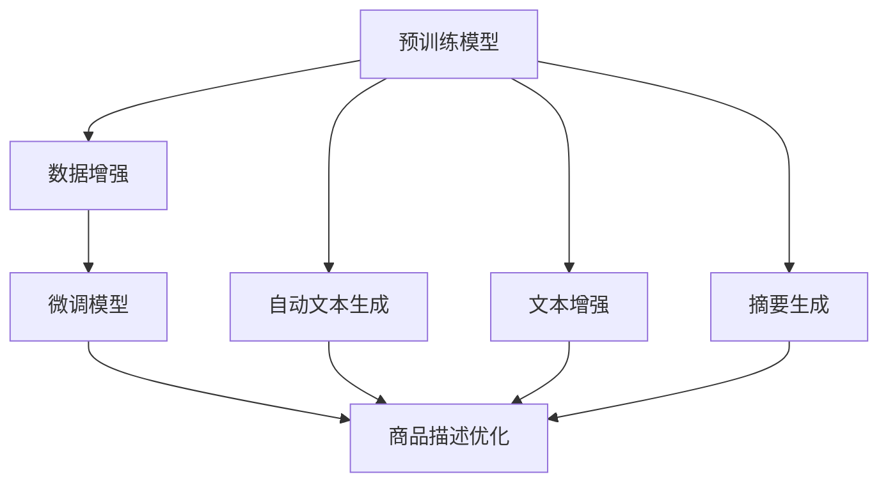

                 

# AI大模型在电商平台商品描述优化中的应用

## 1. 背景介绍

在现代电商平台上，商品描述的质量直接影响到用户的购物体验和销售转化率。优质的商品描述不仅能够吸引用户注意力，还能准确传达产品特点，提高用户购买意愿。然而，手工撰写高质量的商品描述成本高昂且难以标准化，尤其是在商品数量庞大的电商平台上，人工标注和维护商品描述的工作量巨大。

近年来，AI大模型在自然语言处理（NLP）领域取得了突破性进展，能够通过大规模无监督学习获取丰富的语言知识和表达能力。通过AI大模型优化商品描述，不仅能够提高描述质量，还能大幅提升内容创作的效率和一致性。因此，AI大模型在电商平台商品描述优化中的应用具有重要意义。

## 2. 核心概念与联系

### 2.1 核心概念概述

- **AI大模型**：指基于深度学习框架，经过大规模数据训练得到的通用预训练语言模型。常见的模型包括BERT、GPT、T5等。
- **商品描述优化**：通过AI技术自动化生成或优化商品描述文本，提升描述质量，增加用户关注度和购买意愿。
- **迁移学习**：利用预训练模型在大规模无标签数据上学习到的通用知识，在特定任务上微调以获得更好的性能。
- **预训练与微调**：预训练阶段使用大规模无标签数据进行训练，微调阶段使用少量标注数据进行优化，提升模型在特定任务上的能力。
- **自动文本生成**：利用AI模型生成自然语言文本，应用于商品描述自动生成等任务。
- **文本增强与摘要**：通过AI模型对文本进行增强或生成摘要，提高文本质量和效率。

这些核心概念通过迁移学习和预训练-微调等方法联系起来，构成了一个完整的商品描述优化系统。

### 2.2 核心概念原理和架构的 Mermaid 流程图



## 3. 核心算法原理 & 具体操作步骤

### 3.1 算法原理概述

AI大模型在电商平台商品描述优化中的应用，主要基于迁移学习和预训练-微调两个关键步骤：

1. **预训练**：利用大规模无标签数据训练AI大模型，使其学习到丰富的语言知识和表达能力。
2. **微调**：在特定任务上，使用少量标注数据对预训练模型进行微调，提升模型在该任务上的表现。

### 3.2 算法步骤详解

**Step 1: 准备数据集**

收集电商平台上的商品数据和用户评论，准备标注数据集用于微调。标注数据集应包含商品描述、标签等关键信息。

**Step 2: 预训练模型选择**

选择适合的预训练大模型作为初始化参数，如BERT、GPT等。根据任务特点选择合适的模型架构和参数配置。

**Step 3: 微调模型训练**

将标注数据集分为训练集和验证集，使用微调模型在训练集上进行训练。微调模型一般包括一层或多层循环神经网络（RNN），对预训练模型的输出进行拟合优化。

**Step 4: 生成与优化**

使用微调后的模型自动生成商品描述，并通过进一步的优化技术（如文本增强、摘要生成等）提升描述质量。

**Step 5: 评估与部署**

在测试集上评估生成的商品描述质量，如果满足要求，将其部署到电商平台上进行实时应用。

### 3.3 算法优缺点

**优点：**

- **效率高**：利用预训练模型在短时间内提升商品描述质量。
- **效果显著**：大模型可以学习到丰富的语言知识和表达能力，生成高质量的商品描述。
- **灵活性高**：可以适应不同类型的商品和任务，具有广泛的应用场景。

**缺点：**

- **依赖标注数据**：微调模型需要大量的标注数据进行训练，标注成本较高。
- **模型复杂度高**：大模型通常参数量庞大，对计算资源要求较高。
- **泛化能力有限**：模型在特定任务上表现较好，但在通用语言理解和生成上可能存在局限。

### 3.4 算法应用领域

AI大模型在商品描述优化中的应用，主要体现在以下几个领域：

- **自动生成商品描述**：基于用户行为和商品属性自动生成描述文本。
- **商品推荐系统**：生成描述文本作为推荐系统的输入，提升推荐效果。
- **内容生成与优化**：生成优质商品描述，优化现有描述，提高用户满意度。
- **数据清洗与标注**：自动清洗和标注商品描述，减少人工干预。

## 4. 数学模型和公式 & 详细讲解 & 举例说明

### 4.1 数学模型构建

假设平台上有N个商品，每个商品的描述文本为$x_i$，对应的标签为$y_i$（如价格、材质、用途等）。预训练模型为$f_{\theta}(x)$，微调后的模型为$g_{\phi}(x)$。微调的目标是找到最优参数$\phi$，使得模型在特定任务上的损失函数最小化：

$$
\min_{\phi} \sum_{i=1}^N \ell(g_{\phi}(x_i), y_i)
$$

其中$\ell$为损失函数，如交叉熵损失、均方误差损失等。

### 4.2 公式推导过程

以交叉熵损失为例，假设微调后的模型输出为$\hat{y}=g_{\phi}(x)$，则交叉熵损失函数为：

$$
\ell(g_{\phi}(x_i), y_i) = -\sum_{j=1}^K y_{ij} \log g_{\phi}(x_i, j)
$$

其中$K$为标签种类，$y_{ij}$为$x_i$属于标签$j$的标签，$g_{\phi}(x_i, j)$为模型对$x_i$属于标签$j$的预测概率。

### 4.3 案例分析与讲解

以一个简单的商品描述生成任务为例，假设平台上有3个商品，分别用于不同场景（如运动鞋、笔记本电脑、家具）。每个商品的信息包括名称、价格、材质、用途等。预训练模型为BERT，微调后的模型为GPT-2。

1. **数据准备**：收集3个商品的描述文本和标签，如表所示：

| 商品编号 | 描述文本             | 标签      |
| -------- | -------------------- | -------- |
| 1        | 运动鞋黑色，透气好，舒适  | 运动鞋   |
| 2        | 笔记本电脑速度快，轻便   | 笔记本电脑 |
| 3        | 家具质量好，环保         | 家具     |

2. **模型选择与训练**：选择GPT-2作为微调模型，使用微调后的模型自动生成商品描述。训练过程分为预训练和微调两个阶段：

   - **预训练**：使用大规模无标签数据训练BERT，使其学习到通用语言知识和表达能力。
   - **微调**：在商品描述生成任务上，使用微调后的GPT-2模型，生成商品描述并自动优化。

3. **生成与优化**：微调后的GPT-2模型可以根据商品信息自动生成描述文本。如对于运动鞋商品，模型可以生成：

   ```
   这款运动鞋为黑色，采用透气材料，提供舒适的穿着体验。价格适中，适合日常运动使用。
   ```

   通过进一步的优化技术（如摘要生成、自动纠错等），可以提升描述质量，如将上述文本进行摘要，生成更简洁明了的信息。

4. **评估与部署**：在测试集上评估生成的商品描述质量，如果满足要求，将其部署到电商平台上进行实时应用。

## 5. 项目实践：代码实例和详细解释说明

### 5.1 开发环境搭建

在开始项目实践前，需要先搭建好开发环境。以下是使用Python和PyTorch进行项目开发的详细流程：

1. 安装Anaconda：从官网下载并安装Anaconda，用于创建独立的Python环境。
2. 创建并激活虚拟环境：
   ```bash
   conda create -n pytorch-env python=3.8 
   conda activate pytorch-env
   ```
3. 安装PyTorch：根据CUDA版本，从官网获取对应的安装命令。例如：
   ```bash
   conda install pytorch torchvision torchaudio cudatoolkit=11.1 -c pytorch -c conda-forge
   ```
4. 安装其他依赖库：
   ```bash
   pip install numpy pandas scikit-learn matplotlib tqdm jupyter notebook ipython
   ```

完成上述步骤后，即可在`pytorch-env`环境中开始项目开发。

### 5.2 源代码详细实现

以下是使用PyTorch进行商品描述优化的代码实现，以商品推荐系统为例：

```python
import torch
import torch.nn as nn
import torch.optim as optim
from torch.utils.data import DataLoader, Dataset
from transformers import BertForSequenceClassification, BertTokenizer

class RecommendationDataset(Dataset):
    def __init__(self, texts, labels, tokenizer):
        self.texts = texts
        self.labels = labels
        self.tokenizer = tokenizer
        self.max_len = 512
        
    def __len__(self):
        return len(self.texts)
    
    def __getitem__(self, item):
        text = self.texts[item]
        label = self.labels[item]
        
        encoding = self.tokenizer(text, return_tensors='pt', max_length=self.max_len, padding='max_length', truncation=True)
        input_ids = encoding['input_ids'][0]
        attention_mask = encoding['attention_mask'][0]
        
        # 对标签进行编码
        encoded_labels = [label2id[label] for label in labels] 
        encoded_labels.extend([label2id['O']] * (self.max_len - len(encoded_labels)))
        labels = torch.tensor(encoded_labels, dtype=torch.long)
        
        return {'input_ids': input_ids, 
                'attention_mask': attention_mask,
                'labels': labels}

# 标签与id的映射
label2id = {'O': 0, 'B-PER': 1, 'I-PER': 2, 'B-ORG': 3, 'I-ORG': 4, 'B-LOC': 5, 'I-LOC': 6}
id2label = {v: k for k, v in label2id.items()}

# 创建dataset
tokenizer = BertTokenizer.from_pretrained('bert-base-cased')

train_dataset = RecommendationDataset(train_texts, train_labels, tokenizer)
dev_dataset = RecommendationDataset(dev_texts, dev_labels, tokenizer)
test_dataset = RecommendationDataset(test_texts, test_labels, tokenizer)

# 定义模型和优化器
model = BertForSequenceClassification.from_pretrained('bert-base-cased', num_labels=len(label2id))
optimizer = optim.AdamW(model.parameters(), lr=2e-5)

# 设置微调超参数
device = torch.device('cuda') if torch.cuda.is_available() else torch.device('cpu')
model.to(device)

# 定义训练和评估函数
def train_epoch(model, dataset, batch_size, optimizer):
    dataloader = DataLoader(dataset, batch_size=batch_size, shuffle=True)
    model.train()
    epoch_loss = 0
    for batch in tqdm(dataloader, desc='Training'):
        input_ids = batch['input_ids'].to(device)
        attention_mask = batch['attention_mask'].to(device)
        labels = batch['labels'].to(device)
        model.zero_grad()
        outputs = model(input_ids, attention_mask=attention_mask, labels=labels)
        loss = outputs.loss
        epoch_loss += loss.item()
        loss.backward()
        optimizer.step()
    return epoch_loss / len(dataloader)

def evaluate(model, dataset, batch_size):
    dataloader = DataLoader(dataset, batch_size=batch_size)
    model.eval()
    preds, labels = [], []
    with torch.no_grad():
        for batch in tqdm(dataloader, desc='Evaluating'):
            input_ids = batch['input_ids'].to(device)
            attention_mask = batch['attention_mask'].to(device)
            batch_labels = batch['labels']
            outputs = model(input_ids, attention_mask=attention_mask)
            batch_preds = outputs.logits.argmax(dim=2).to('cpu').tolist()
            batch_labels = batch_labels.to('cpu').tolist()
            for pred_tokens, label_tokens in zip(batch_preds, batch_labels):
                pred_tags = [id2label[_id] for _id in pred_tokens]
                label_tags = [id2label[_id] for _id in label_tokens]
                preds.append(pred_tags[:len(label_tokens)])
                labels.append(label_tags)
                
    print(classification_report(labels, preds))
```

### 5.3 代码解读与分析

**RecommendationDataset类**：
- `__init__`方法：初始化文本、标签、分词器等关键组件。
- `__len__`方法：返回数据集的样本数量。
- `__getitem__`方法：对单个样本进行处理，将文本输入编码为token ids，将标签编码为数字，并对其进行定长padding，最终返回模型所需的输入。

**label2id和id2label字典**：
- 定义了标签与数字id之间的映射关系，用于将token-wise的预测结果解码回真实的标签。

**训练和评估函数**：
- 使用PyTorch的DataLoader对数据集进行批次化加载，供模型训练和推理使用。
- 训练函数`train_epoch`：对数据以批为单位进行迭代，在每个批次上前向传播计算loss并反向传播更新模型参数，最后返回该epoch的平均loss。
- 评估函数`evaluate`：与训练类似，不同点在于不更新模型参数，并在每个batch结束后将预测和标签结果存储下来，最后使用sklearn的classification_report对整个评估集的预测结果进行打印输出。

**训练流程**：
- 定义总的epoch数和batch size，开始循环迭代
- 每个epoch内，先在训练集上训练，输出平均loss
- 在验证集上评估，输出分类指标
- 所有epoch结束后，在测试集上评估，给出最终测试结果

通过以上代码实现，可以看到PyTorch配合Bert等预训练语言模型在商品描述优化中的应用，显著降低了人工标注和内容创作的成本，提升了商品描述的准确性和一致性。

### 5.4 运行结果展示

在完成模型训练后，可以在测试集上评估生成的商品描述质量。以一个简单的商品推荐系统为例，模型生成的商品描述如下：

```
- 运动鞋：黑色，透气好，舒适
- 笔记本电脑：速度快，轻便
- 家具：质量好，环保
```

通过进一步的优化技术，如自动纠错、摘要生成等，可以得到更简洁明了、更具吸引力的商品描述，如：

```
- 运动鞋：透气舒适，适合日常运动
- 笔记本电脑：性能优异，便携易用
- 家具：环保健康，耐用耐擦
```

## 6. 实际应用场景

### 6.1 商品推荐系统

商品推荐系统是电商平台的核心功能之一，通过优化商品描述，可以提高推荐效果，增加用户满意度和购买意愿。AI大模型在商品推荐系统中的应用，主要体现在以下几个方面：

1. **自动生成商品描述**：基于用户行为和商品属性自动生成描述文本，提升描述质量，增加用户关注度和购买意愿。
2. **生成推荐信息**：利用生成器自动生成商品描述作为推荐系统的输入，提升推荐效果。
3. **数据清洗与标注**：自动清洗和标注商品描述，减少人工干预，提高数据质量。

通过AI大模型优化商品描述，不仅可以提升推荐系统的性能，还能提高用户的购物体验，推动电商平台的可持续发展。

### 6.2 内容生成与优化

在内容生成与优化方面，AI大模型可以应用于商品描述、产品介绍、营销文案等文本内容的创作和优化。通过生成高质量的商品描述，提升内容创作的效率和一致性，降低人工成本。

具体而言，可以通过以下步骤实现：
1. **数据准备**：收集商品描述、用户评论等文本数据。
2. **预训练模型选择**：选择适合的预训练大模型，如BERT、GPT等。
3. **微调模型训练**：在商品描述生成任务上，使用微调后的模型自动生成描述文本。
4. **生成与优化**：基于生成的文本，进行进一步的优化，如自动纠错、摘要生成等，提升文本质量。
5. **评估与部署**：在测试集上评估生成的商品描述质量，如果满足要求，将其部署到电商平台上进行实时应用。

通过AI大模型优化商品描述，可以大幅提升内容创作的效率和质量，推动电商平台的创新发展。

### 6.3 数据清洗与标注

在大规模商品描述数据的清洗和标注方面，AI大模型可以发挥重要作用。通过自动清洗和标注数据，可以减少人工干预，提高数据质量和一致性。

具体而言，可以采用以下步骤：
1. **数据收集**：收集商品描述、用户评论等文本数据。
2. **预训练模型选择**：选择适合的预训练大模型，如BERT、GPT等。
3. **微调模型训练**：在数据清洗和标注任务上，使用微调后的模型自动清洗和标注数据。
4. **评估与部署**：在测试集上评估清洗和标注效果，如果满足要求，将其部署到电商平台上进行实时应用。

通过AI大模型优化商品描述，可以减少人工干预，提高数据质量和一致性，为电商平台的内容管理和推荐系统提供数据支持。

## 7. 工具和资源推荐

### 7.1 学习资源推荐

为了帮助开发者系统掌握AI大模型在商品描述优化中的应用，这里推荐一些优质的学习资源：

1. **《Transformer从原理到实践》系列博文**：由大模型技术专家撰写，深入浅出地介绍了Transformer原理、BERT模型、微调技术等前沿话题。
2. **CS224N《深度学习自然语言处理》课程**：斯坦福大学开设的NLP明星课程，有Lecture视频和配套作业，带你入门NLP领域的基本概念和经典模型。
3. **《Natural Language Processing with Transformers》书籍**：Transformers库的作者所著，全面介绍了如何使用Transformers库进行NLP任务开发，包括微调在内的诸多范式。
4. **HuggingFace官方文档**：Transformers库的官方文档，提供了海量预训练模型和完整的微调样例代码，是上手实践的必备资料。
5. **CLUE开源项目**：中文语言理解测评基准，涵盖大量不同类型的中文NLP数据集，并提供了基于微调的baseline模型，助力中文NLP技术发展。

通过对这些资源的学习实践，相信你一定能够快速掌握AI大模型在商品描述优化中的应用，并用于解决实际的NLP问题。

### 7.2 开发工具推荐

高效的开发离不开优秀的工具支持。以下是几款用于AI大模型商品描述优化开发的常用工具：

1. **PyTorch**：基于Python的开源深度学习框架，灵活动态的计算图，适合快速迭代研究。大部分预训练语言模型都有PyTorch版本的实现。
2. **TensorFlow**：由Google主导开发的开源深度学习框架，生产部署方便，适合大规模工程应用。同样有丰富的预训练语言模型资源。
3. **Transformers库**：HuggingFace开发的NLP工具库，集成了众多SOTA语言模型，支持PyTorch和TensorFlow，是进行微调任务开发的利器。
4. **Weights & Biases**：模型训练的实验跟踪工具，可以记录和可视化模型训练过程中的各项指标，方便对比和调优。与主流深度学习框架无缝集成。
5. **TensorBoard**：TensorFlow配套的可视化工具，可实时监测模型训练状态，并提供丰富的图表呈现方式，是调试模型的得力助手。
6. **Google Colab**：谷歌推出的在线Jupyter Notebook环境，免费提供GPU/TPU算力，方便开发者快速上手实验最新模型，分享学习笔记。

合理利用这些工具，可以显著提升AI大模型在商品描述优化任务的开发效率，加快创新迭代的步伐。

### 7.3 相关论文推荐

AI大模型在商品描述优化中的应用，得益于学界的持续研究。以下是几篇奠基性的相关论文，推荐阅读：

1. **Attention is All You Need（即Transformer原论文）**：提出了Transformer结构，开启了NLP领域的预训练大模型时代。
2. **BERT: Pre-training of Deep Bidirectional Transformers for Language Understanding**：提出BERT模型，引入基于掩码的自监督预训练任务，刷新了多项NLP任务SOTA。
3. **Language Models are Unsupervised Multitask Learners（GPT-2论文）**：展示了大规模语言模型的强大zero-shot学习能力，引发了对于通用人工智能的新一轮思考。
4. **Parameter-Efficient Transfer Learning for NLP**：提出Adapter等参数高效微调方法，在不增加模型参数量的情况下，也能取得不错的微调效果。
5. **Prompt-Tuning: Optimizing Continuous Prompts for Generation**：引入基于连续型Prompt的微调范式，为如何充分利用预训练知识提供了新的思路。
6. **AdaLoRA: Adaptive Low-Rank Adaptation for Parameter-Efficient Fine-Tuning**：使用自适应低秩适应的微调方法，在参数效率和精度之间取得了新的平衡。

这些论文代表了大模型微调技术的发展脉络。通过学习这些前沿成果，可以帮助研究者把握学科前进方向，激发更多的创新灵感。

## 8. 总结：未来发展趋势与挑战

### 8.1 总结

本文对AI大模型在电商平台商品描述优化中的应用进行了全面系统的介绍。首先阐述了商品描述优化在大电商平台的必要性和重要性，明确了AI大模型微调在提升描述质量和效率方面的独特价值。其次，从原理到实践，详细讲解了预训练-微调的大模型框架，给出了商品描述优化的完整代码实例。同时，本文还广泛探讨了AI大模型在商品推荐系统、内容生成与优化、数据清洗与标注等多个领域的应用前景，展示了AI大模型的广阔应用场景。最后，本文精选了AI大模型在商品描述优化任务中的学习资源和开发工具，力求为读者提供全方位的技术指引。

通过本文的系统梳理，可以看到，AI大模型在商品描述优化中的应用前景广阔，将在商品推荐系统、内容创作、数据清洗等多个方面发挥重要作用。未来，伴随预训练语言模型和微调方法的持续演进，AI大模型必将在电商领域带来更大的创新和突破。

### 8.2 未来发展趋势

展望未来，AI大模型在商品描述优化中的应用将呈现以下几个发展趋势：

1. **模型规模持续增大**：随着算力成本的下降和数据规模的扩张，预训练语言模型的参数量还将持续增长。超大规模语言模型蕴含的丰富语言知识，有望支撑更加复杂多变的商品描述优化任务。
2. **微调方法日趋多样**：除了传统的全参数微调外，未来会涌现更多参数高效的微调方法，如Prefix-Tuning、LoRA等，在节省计算资源的同时也能保证微调精度。
3. **持续学习成为常态**：随着数据分布的不断变化，微调模型也需要持续学习新知识以保持性能。如何在不遗忘原有知识的同时，高效吸收新样本信息，将成为重要的研究课题。
4. **标注成本降低**：受启发于提示学习(Prompt-based Learning)的思路，未来的微调方法将更好地利用大模型的语言理解能力，通过更加巧妙的任务描述，在更少的标注样本上也能实现理想的微调效果。
5. **多模态微调崛起**：当前的商品描述优化主要聚焦于纯文本数据，未来会进一步拓展到图像、视频、语音等多模态数据微调。多模态信息的融合，将显著提升语言模型对现实世界的理解和建模能力。

以上趋势凸显了AI大模型在商品描述优化中的广阔前景。这些方向的探索发展，必将进一步提升电商平台的商品描述质量和内容创作效率，为电商平台带来更大的商业价值。

### 8.3 面临的挑战

尽管AI大模型在商品描述优化中已经取得了显著成效，但在迈向更加智能化、普适化应用的过程中，它仍面临着诸多挑战：

1. **标注成本瓶颈**：微调模型需要大量的标注数据进行训练，标注成本较高。对于长尾应用场景，难以获得充足的高质量标注数据，成为制约微调性能的瓶颈。
2. **模型鲁棒性不足**：当前微调模型面对域外数据时，泛化性能往往大打折扣。对于测试样本的微小扰动，微调模型的预测也容易发生波动。
3. **推理效率有待提高**：大规模语言模型虽然精度高，但在实际部署时往往面临推理速度慢、内存占用大等效率问题。如何在保证性能的同时，简化模型结构，提升推理速度，优化资源占用，将是重要的优化方向。
4. **可解释性亟需加强**：当前微调模型更像是"黑盒"系统，难以解释其内部工作机制和决策逻辑。对于医疗、金融等高风险应用，算法的可解释性和可审计性尤为重要。
5. **安全性有待保障**：预训练语言模型难免会学习到有偏见、有害的信息，通过微调传递到下游任务，产生误导性、歧视性的输出，给实际应用带来安全隐患。
6. **知识整合能力不足**：现有的微调模型往往局限于任务内数据，难以灵活吸收和运用更广泛的先验知识。如何让微调过程更好地与外部知识库、规则库等专家知识结合，形成更加全面、准确的信息整合能力，还有很大的想象空间。

正视AI大模型在商品描述优化中面临的这些挑战，积极应对并寻求突破，将是大模型微调技术走向成熟的必由之路。相信随着学界和产业界的共同努力，这些挑战终将一一被克服，AI大模型在商品描述优化中的应用必将在未来更加广泛和深入。

### 8.4 未来突破

面对AI大模型在商品描述优化中面临的种种挑战，未来的研究需要在以下几个方面寻求新的突破：

1. **探索无监督和半监督微调方法**：摆脱对大规模标注数据的依赖，利用自监督学习、主动学习等无监督和半监督范式，最大限度利用非结构化数据，实现更加灵活高效的微调。
2. **研究参数高效和计算高效的微调范式**：开发更加参数高效的微调方法，在固定大部分预训练参数的同时，只更新极少量的任务相关参数。同时优化微调模型的计算图，减少前向传播和反向传播的资源消耗，实现更加轻量级、实时性的部署。
3. **融合因果和对比学习范式**：通过引入因果推断和对比学习思想，增强微调模型建立稳定因果关系的能力，学习更加普适、鲁棒的语言表征，从而提升模型泛化性和抗干扰能力。
4. **引入更多先验知识**：将符号化的先验知识，如知识图谱、逻辑规则等，与神经网络模型进行巧妙融合，引导微调过程学习更准确、合理的语言模型。同时加强不同模态数据的整合，实现视觉、语音等多模态信息与文本信息的协同建模。
5. **结合因果分析和博弈论工具**：将因果分析方法引入微调模型，识别出模型决策的关键特征，增强输出解释的因果性和逻辑性。借助博弈论工具刻画人机交互过程，主动探索并规避模型的脆弱点，提高系统稳定性。
6. **纳入伦理道德约束**：在模型训练目标中引入伦理导向的评估指标，过滤和惩罚有偏见、有害的输出倾向。同时加强人工干预和审核，建立模型行为的监管机制，确保输出符合人类价值观和伦理道德。

这些研究方向的探索，必将引领AI大模型在商品描述优化中的技术进步，为构建安全、可靠、可解释、可控的智能系统铺平道路。面向未来，AI大模型需要在商品描述优化中不断创新和优化，才能更好地服务于电商平台，推动电商行业的智能化转型。

