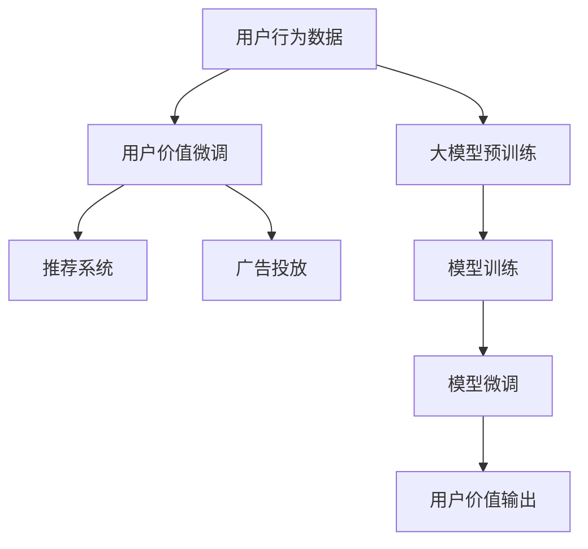

                 

# AI大模型在电商平台用户价值细分中的应用

## 1. 背景介绍

### 1.1 问题由来

随着电商平台的发展，数据量和用户行为日益复杂化。如何高效、精准地识别用户群体，进行价值细分，从而提供个性化推荐、广告投放等策略，成为平台运营中一个亟需解决的难题。传统的用户细分方法，如K-means聚类、RFM分析等，往往无法充分挖掘用户多样化的需求。而大模型通过海量的数据学习，具备强大的自适应能力，能够识别复杂的用户行为模式，从而更好地进行用户价值细分。

### 1.2 问题核心关键点

大模型在电商平台用户价值细分中的应用，主要关注以下几个核心关键点：

- **用户行为数据的收集与预处理**：收集电商平台上的点击、浏览、购买等行为数据，并对其进行预处理，形成适合模型训练的数据集。
- **大模型的选择与适配**：选择合适的大语言模型或图像模型，根据电商平台的具体需求进行微调，以提高其对电商数据的适应性。
- **模型训练与优化**：设计合适的训练流程，通过迭代优化模型参数，提高用户价值细分的准确性。
- **结果应用与反馈**：将模型输出的用户价值结果应用到推荐、广告等实际业务场景中，并根据反馈数据不断优化模型。

### 1.3 问题研究意义

通过对大模型应用于电商平台用户价值细分的深入研究，可以显著提升平台的个性化推荐效果，优化广告投放策略，从而提高用户满意度和平台收入。同时，对于电商行业来说，了解用户需求、提高用户体验具有重要意义，有助于构建更加精准、高效的智能推荐系统。

## 2. 核心概念与联系

### 2.1 核心概念概述

为更好地理解大模型在电商平台用户价值细分中的应用，本节将介绍几个密切相关的核心概念：

- **大模型**：以自回归（如GPT）或自编码（如BERT）模型为代表的大规模预训练模型。通过在大规模无标签数据上进行预训练，学习通用的语言表示，具备强大的自然语言理解和生成能力。
- **用户行为数据**：用户在电商平台上的所有行为记录，包括浏览历史、点击记录、购买记录、评论等。这些数据是用户价值细分的关键输入。
- **微调**：将预训练模型作为初始化参数，在特定任务上进行有监督的训练，优化模型参数以适应新任务。
- **推荐系统**：使用机器学习算法，根据用户历史行为和模型预测结果，为用户推荐商品或内容。
- **广告投放**：根据用户行为数据和模型预测结果，精准投放广告，提升广告效果和用户转化率。

### 2.2 核心概念原理和架构的 Mermaid 流程图



这个流程图展示了大模型在电商平台用户价值细分过程中的核心概念及其关系：

1. 用户行为数据通过大模型的预训练获得基础能力。
2. 微调对预训练模型进行特定任务适配，学习电商数据特征。
3. 微调后的模型用于构建推荐系统和投放广告，实现用户价值细分。

## 3. 核心算法原理 & 具体操作步骤

### 3.1 算法原理概述

大模型在电商平台用户价值细分中的应用，本质上是一个基于大模型微调的过程。其核心思想是：将大模型作为"特征提取器"，通过用户在电商平台上的行为数据进行有监督的训练，优化模型参数以适应新任务。

形式化地，假设预训练模型为 $M_{\theta}$，其中 $\theta$ 为预训练得到的模型参数。给定电商平台用户行为数据集 $D=\{(x_i, y_i)\}_{i=1}^N$，其中 $x_i$ 为用户行为数据，$y_i$ 为用户价值标签，$y_i \in [0,1]$ 表示用户是否对某商品感兴趣或是否会购买某商品。微调的目标是找到新的模型参数 $\hat{\theta}$，使得：

$$
\hat{\theta}=\mathop{\arg\min}_{\theta} \mathcal{L}(M_{\theta},D)
$$

其中 $\mathcal{L}$ 为针对电商任务设计的损失函数，用于衡量模型预测输出与真实标签之间的差异。常见的损失函数包括交叉熵损失、均方误差损失等。

### 3.2 算法步骤详解

基于大模型在电商平台用户价值细分中的应用，一般包括以下几个关键步骤：

**Step 1: 数据准备与预处理**
- 收集电商平台上的用户行为数据，包括点击、浏览、购买等行为记录。
- 对原始数据进行清洗、去重、归一化等预处理操作，形成适合模型训练的数据集。

**Step 2: 大模型选择与适配**
- 选择合适的大语言模型或图像模型，如BERT、GPT-3、ResNet等，作为初始化参数。
- 根据电商平台的具体需求，设计合适的任务适配层，如分类头、序列生成器等。

**Step 3: 微调模型训练**
- 将预训练模型作为初始化参数，在电商数据集上进行有监督的训练。
- 定义合适的损失函数，如交叉熵损失，计算模型预测输出与真实标签的差异。
- 使用合适的优化算法，如AdamW、SGD等，迭代更新模型参数。

**Step 4: 模型评估与优化**
- 在验证集上评估模型性能，使用准确率、召回率等指标进行评估。
- 根据评估结果调整模型参数，如增加训练轮次、调整学习率等。
- 重复上述步骤直至模型收敛。

**Step 5: 结果应用与反馈**
- 将微调后的模型应用于推荐系统和广告投放中，根据用户行为数据生成个性化推荐和广告。
- 收集用户反馈数据，如点击率、转化率等，用于进一步优化模型。

### 3.3 算法优缺点

大模型在电商平台用户价值细分中的应用具有以下优点：
1. 高效性。使用大模型进行微调，能够在较短的时间内处理大量用户行为数据，提供高效的用户价值细分方案。
2. 准确性。大模型通过预训练学习和微调，能够充分挖掘用户行为数据的特征，提供更为准确的用户价值预测。
3. 可扩展性。大模型具有强大的泛化能力，可以轻松应对电商平台用户行为数据的变化，保持其适应性。

同时，该方法也存在一定的局限性：
1. 数据依赖。微调效果依赖于电商平台的标注数据，标注数据质量直接影响模型效果。
2. 资源消耗。大模型和微调过程需要大量计算资源，对硬件设备要求较高。
3. 公平性问题。模型可能会因训练数据不平衡而产生偏见，影响不同用户群体的公平性。

尽管存在这些局限性，但就目前而言，大模型在电商平台用户价值细分中的应用仍然是高效、准确且可扩展的。未来相关研究将重点关注如何提升数据质量，降低资源消耗，以及增强模型的公平性。

### 3.4 算法应用领域

基于大模型的电商平台用户价值细分方法，在电商推荐、广告投放、用户画像等多个领域得到了广泛的应用，具体包括：

- **电商推荐系统**：通过分析用户行为数据，预测用户对商品的兴趣程度，生成个性化推荐。
- **广告投放系统**：根据用户行为数据和兴趣预测，精准投放广告，提高广告效果和用户转化率。
- **用户画像系统**：对用户行为数据进行深度分析，形成详细用户画像，用于营销、分析等环节。
- **个性化服务**：根据用户价值细分结果，提供更加个性化的服务和产品推荐。

除了上述这些应用外，大模型在电商平台上的应用还将不断扩展，如智能客服、库存管理、供应链优化等，为电商平台的智能化转型提供新动力。

## 4. 数学模型和公式 & 详细讲解 & 举例说明

### 4.1 数学模型构建

本节将使用数学语言对大模型在电商平台用户价值细分过程中的微调方法进行更加严格的刻画。

假设电商平台用户行为数据集为 $D=\{(x_i, y_i)\}_{i=1}^N$，其中 $x_i$ 为用户行为数据，$y_i$ 为用户价值标签，$y_i \in [0,1]$ 表示用户是否对某商品感兴趣或是否会购买某商品。

定义模型 $M_{\theta}$ 在输入 $x_i$ 上的输出为 $\hat{y}_i=M_{\theta}(x_i)$，表示模型对用户是否感兴趣或购买的预测概率。微调的目标是最小化经验风险，即找到最优参数：

$$
\hat{\theta}=\mathop{\arg\min}_{\theta} \mathcal{L}(\theta)
$$

其中经验风险 $\mathcal{L}(\theta)$ 定义为：

$$
\mathcal{L}(\theta)=\frac{1}{N}\sum_{i=1}^N \ell(\hat{y}_i, y_i)
$$

其中 $\ell(\hat{y}_i, y_i)$ 为损失函数，常见的有交叉熵损失：

$$
\ell(\hat{y}_i, y_i)=-y_i \log \hat{y}_i - (1-y_i) \log (1-\hat{y}_i)
$$

### 4.2 公式推导过程

以下我们以分类任务为例，推导交叉熵损失函数及其梯度的计算公式。

假设模型 $M_{\theta}$ 在输入 $x_i$ 上的输出为 $\hat{y}_i=M_{\theta}(x_i)$，表示模型对用户是否感兴趣或购买的预测概率。真实标签 $y_i \in \{0,1\}$。则二分类交叉熵损失函数定义为：

$$
\ell(\hat{y}_i, y_i) = -[y_i\log \hat{y}_i + (1-y_i)\log (1-\hat{y}_i)]
$$

将其代入经验风险公式，得：

$$
\mathcal{L}(\theta) = -\frac{1}{N}\sum_{i=1}^N [y_i\log M_{\theta}(x_i)+(1-y_i)\log(1-M_{\theta}(x_i))]
$$

根据链式法则，损失函数对参数 $\theta_k$ 的梯度为：

$$
\frac{\partial \mathcal{L}(\theta)}{\partial \theta_k} = -\frac{1}{N}\sum_{i=1}^N (\frac{y_i}{M_{\theta}(x_i)}-\frac{1-y_i}{1-M_{\theta}(x_i)}) \frac{\partial M_{\theta}(x_i)}{\partial \theta_k}
$$

其中 $\frac{\partial M_{\theta}(x_i)}{\partial \theta_k}$ 可进一步递归展开，利用自动微分技术完成计算。

在得到损失函数的梯度后，即可带入参数更新公式，完成模型的迭代优化。重复上述过程直至收敛，最终得到适应电商任务的最优模型参数 $\hat{\theta}$。

## 5. 项目实践：代码实例和详细解释说明

### 5.1 开发环境搭建

在进行大模型微调实践前，我们需要准备好开发环境。以下是使用Python进行PyTorch开发的环境配置流程：

1. 安装Anaconda：从官网下载并安装Anaconda，用于创建独立的Python环境。

2. 创建并激活虚拟环境：
```bash
conda create -n pytorch-env python=3.8 
conda activate pytorch-env
```

3. 安装PyTorch：根据CUDA版本，从官网获取对应的安装命令。例如：
```bash
conda install pytorch torchvision torchaudio cudatoolkit=11.1 -c pytorch -c conda-forge
```

4. 安装Transformers库：
```bash
pip install transformers
```

5. 安装各类工具包：
```bash
pip install numpy pandas scikit-learn matplotlib tqdm jupyter notebook ipython
```

完成上述步骤后，即可在`pytorch-env`环境中开始微调实践。

### 5.2 源代码详细实现

下面我们以电商平台用户行为数据集为例，给出使用Transformers库对BERT模型进行电商推荐微调的PyTorch代码实现。

首先，定义电商推荐任务的数据处理函数：

```python
from transformers import BertTokenizer
from torch.utils.data import Dataset
import torch

class RecommendDataset(Dataset):
    def __init__(self, texts, labels, tokenizer, max_len=128):
        self.texts = texts
        self.labels = labels
        self.tokenizer = tokenizer
        self.max_len = max_len
        
    def __len__(self):
        return len(self.texts)
    
    def __getitem__(self, item):
        text = self.texts[item]
        label = self.labels[item]
        
        encoding = self.tokenizer(text, return_tensors='pt', max_length=self.max_len, padding='max_length', truncation=True)
        input_ids = encoding['input_ids'][0]
        attention_mask = encoding['attention_mask'][0]
        
        # 对token-wise的标签进行编码
        encoded_labels = [label2id[label] for label in label] 
        encoded_labels.extend([label2id['O']] * (self.max_len - len(encoded_labels)))
        labels = torch.tensor(encoded_labels, dtype=torch.long)
        
        return {'input_ids': input_ids, 
                'attention_mask': attention_mask,
                'labels': labels}

# 标签与id的映射
label2id = {'O': 0, 'interest': 1, 'buy': 2}
id2label = {v: k for k, v in label2id.items()}

# 创建dataset
tokenizer = BertTokenizer.from_pretrained('bert-base-cased')

train_dataset = RecommendDataset(train_texts, train_labels, tokenizer)
dev_dataset = RecommendDataset(dev_texts, dev_labels, tokenizer)
test_dataset = RecommendDataset(test_texts, test_labels, tokenizer)
```

然后，定义模型和优化器：

```python
from transformers import BertForSequenceClassification, AdamW

model = BertForSequenceClassification.from_pretrained('bert-base-cased', num_labels=len(label2id))

optimizer = AdamW(model.parameters(), lr=2e-5)
```

接着，定义训练和评估函数：

```python
from torch.utils.data import DataLoader
from tqdm import tqdm
from sklearn.metrics import classification_report

device = torch.device('cuda') if torch.cuda.is_available() else torch.device('cpu')
model.to(device)

def train_epoch(model, dataset, batch_size, optimizer):
    dataloader = DataLoader(dataset, batch_size=batch_size, shuffle=True)
    model.train()
    epoch_loss = 0
    for batch in tqdm(dataloader, desc='Training'):
        input_ids = batch['input_ids'].to(device)
        attention_mask = batch['attention_mask'].to(device)
        labels = batch['labels'].to(device)
        model.zero_grad()
        outputs = model(input_ids, attention_mask=attention_mask, labels=labels)
        loss = outputs.loss
        epoch_loss += loss.item()
        loss.backward()
        optimizer.step()
    return epoch_loss / len(dataloader)

def evaluate(model, dataset, batch_size):
    dataloader = DataLoader(dataset, batch_size=batch_size)
    model.eval()
    preds, labels = [], []
    with torch.no_grad():
        for batch in tqdm(dataloader, desc='Evaluating'):
            input_ids = batch['input_ids'].to(device)
            attention_mask = batch['attention_mask'].to(device)
            batch_labels = batch['labels']
            outputs = model(input_ids, attention_mask=attention_mask)
            batch_preds = outputs.logits.argmax(dim=2).to('cpu').tolist()
            batch_labels = batch_labels.to('cpu').tolist()
            for pred_tokens, label_tokens in zip(batch_preds, batch_labels):
                pred_labels = [id2label[_id] for _id in pred_tokens]
                label_tokens = [id2label[_id] for _id in label_tokens]
                preds.append(pred_labels[:len(label_tokens)])
                labels.append(label_tokens)
                
    print(classification_report(labels, preds))
```

最后，启动训练流程并在测试集上评估：

```python
epochs = 5
batch_size = 16

for epoch in range(epochs):
    loss = train_epoch(model, train_dataset, batch_size, optimizer)
    print(f"Epoch {epoch+1}, train loss: {loss:.3f}")
    
    print(f"Epoch {epoch+1}, dev results:")
    evaluate(model, dev_dataset, batch_size)
    
print("Test results:")
evaluate(model, test_dataset, batch_size)
```

以上就是使用PyTorch对BERT进行电商平台推荐任务微调的完整代码实现。可以看到，得益于Transformers库的强大封装，我们可以用相对简洁的代码完成BERT模型的加载和微调。

### 5.3 代码解读与分析

让我们再详细解读一下关键代码的实现细节：

**RecommendDataset类**：
- `__init__`方法：初始化文本、标签、分词器等关键组件。
- `__len__`方法：返回数据集的样本数量。
- `__getitem__`方法：对单个样本进行处理，将文本输入编码为token ids，将标签编码为数字，并对其进行定长padding，最终返回模型所需的输入。

**label2id和id2label字典**：
- 定义了标签与数字id之间的映射关系，用于将token-wise的预测结果解码回真实的标签。

**训练和评估函数**：
- 使用PyTorch的DataLoader对数据集进行批次化加载，供模型训练和推理使用。
- 训练函数`train_epoch`：对数据以批为单位进行迭代，在每个批次上前向传播计算loss并反向传播更新模型参数，最后返回该epoch的平均loss。
- 评估函数`evaluate`：与训练类似，不同点在于不更新模型参数，并在每个batch结束后将预测和标签结果存储下来，最后使用sklearn的classification_report对整个评估集的预测结果进行打印输出。

**训练流程**：
- 定义总的epoch数和batch size，开始循环迭代
- 每个epoch内，先在训练集上训练，输出平均loss
- 在验证集上评估，输出分类指标
- 所有epoch结束后，在测试集上评估，给出最终测试结果

可以看到，PyTorch配合Transformers库使得BERT微调的代码实现变得简洁高效。开发者可以将更多精力放在数据处理、模型改进等高层逻辑上，而不必过多关注底层的实现细节。

当然，工业级的系统实现还需考虑更多因素，如模型的保存和部署、超参数的自动搜索、更灵活的任务适配层等。但核心的微调范式基本与此类似。

## 6. 实际应用场景

### 6.1 智能推荐系统

电商平台上的智能推荐系统，能够根据用户行为数据，生成个性化推荐结果，显著提升用户体验和销售额。使用大模型进行电商推荐微调，可以通过学习用户行为和产品特性，预测用户对商品的兴趣程度，从而提供更为精准的推荐。

在技术实现上，可以收集用户浏览、点击、购买等行为数据，并对其进行预处理，形成适合模型训练的数据集。将数据集输入预训练大模型，进行有监督的微调。微调后的模型能够根据用户行为数据生成推荐结果，显著提升推荐的个性化和准确性。

### 6.2 广告投放系统

广告投放系统是电商平台重要的收入来源之一。通过大模型对用户行为数据进行微调，可以精准预测用户对广告的响应，实现更高效、更精准的广告投放。

具体而言，可以收集用户点击、展示、停留等行为数据，构建广告投放数据集。将数据集输入大模型进行微调，学习用户对不同广告的响应模式。微调后的模型能够根据用户行为数据预测广告效果，优化广告投放策略，提高广告转化率。

### 6.3 用户画像系统

用户画像系统通过综合分析用户行为数据，形成详细的用户画像，用于个性化推荐、客户细分等环节。使用大模型对电商平台上的用户行为数据进行微调，可以更好地挖掘用户多样化的需求，构建详细、准确的用户画像。

在技术实现上，可以收集用户行为数据，包括浏览历史、购买记录、评分等，构建用户画像数据集。将数据集输入预训练大模型进行微调，学习用户行为模式。微调后的模型能够根据用户行为数据生成用户画像，为个性化推荐和客户细分提供支持。

### 6.4 未来应用展望

随着大模型和微调方法的不断发展，其在电商平台上的应用也将更加广泛，带来更多创新和突破。

- **跨领域迁移学习**：大模型能够从电商领域的数据中学习到通用的语言表示，通过迁移学习，应用于其他领域，如金融、医疗等，实现知识复用。
- **模型集成与融合**：将多个大模型进行集成和融合，构建更加强大的推荐系统，提升推荐效果和系统鲁棒性。
- **实时动态更新**：使用在线学习技术，实时更新大模型参数，使其能够不断适应新的用户行为和市场变化，提升推荐系统的时效性。
- **多模态融合**：将用户行为数据与图片、视频等多模态数据进行融合，提升推荐的准确性和个性化程度。
- **用户隐私保护**：在大模型微调过程中，引入差分隐私等技术，保护用户隐私，避免数据泄露风险。

以上趋势凸显了大模型在电商平台上的广阔应用前景。这些方向的探索发展，必将进一步提升电商平台的智能化水平，为电商行业带来新的增长点。

## 7. 工具和资源推荐

### 7.1 学习资源推荐

为了帮助开发者系统掌握大模型在电商平台用户价值细分中的应用，这里推荐一些优质的学习资源：

1. 《深度学习实战》系列博文：由大模型技术专家撰写，深入浅出地介绍了深度学习模型的构建、微调等实践细节。

2. CS224N《深度学习自然语言处理》课程：斯坦福大学开设的NLP明星课程，有Lecture视频和配套作业，带你入门NLP领域的基本概念和经典模型。

3. 《Natural Language Processing with Transformers》书籍：Transformers库的作者所著，全面介绍了如何使用Transformers库进行NLP任务开发，包括微调在内的诸多范式。

4. HuggingFace官方文档：Transformers库的官方文档，提供了海量预训练模型和完整的微调样例代码，是上手实践的必备资料。

5. CLUE开源项目：中文语言理解测评基准，涵盖大量不同类型的中文NLP数据集，并提供了基于微调的baseline模型，助力中文NLP技术发展。

通过对这些资源的学习实践，相信你一定能够快速掌握大模型在电商平台用户价值细分中的应用精髓，并用于解决实际的NLP问题。

### 7.2 开发工具推荐

高效的开发离不开优秀的工具支持。以下是几款用于大模型微调开发的常用工具：

1. PyTorch：基于Python的开源深度学习框架，灵活动态的计算图，适合快速迭代研究。大部分预训练语言模型都有PyTorch版本的实现。

2. TensorFlow：由Google主导开发的开源深度学习框架，生产部署方便，适合大规模工程应用。同样有丰富的预训练语言模型资源。

3. Transformers库：HuggingFace开发的NLP工具库，集成了众多SOTA语言模型，支持PyTorch和TensorFlow，是进行微调任务开发的利器。

4. Weights & Biases：模型训练的实验跟踪工具，可以记录和可视化模型训练过程中的各项指标，方便对比和调优。与主流深度学习框架无缝集成。

5. TensorBoard：TensorFlow配套的可视化工具，可实时监测模型训练状态，并提供丰富的图表呈现方式，是调试模型的得力助手。

6. Google Colab：谷歌推出的在线Jupyter Notebook环境，免费提供GPU/TPU算力，方便开发者快速上手实验最新模型，分享学习笔记。

合理利用这些工具，可以显著提升大模型在电商平台用户价值细分任务的开发效率，加快创新迭代的步伐。

### 7.3 相关论文推荐

大模型在电商平台用户价值细分技术的发展源于学界的持续研究。以下是几篇奠基性的相关论文，推荐阅读：

1. Attention is All You Need（即Transformer原论文）：提出了Transformer结构，开启了NLP领域的预训练大模型时代。

2. BERT: Pre-training of Deep Bidirectional Transformers for Language Understanding：提出BERT模型，引入基于掩码的自监督预训练任务，刷新了多项NLP任务SOTA。

3. Language Models are Unsupervised Multitask Learners（GPT-2论文）：展示了大规模语言模型的强大zero-shot学习能力，引发了对于通用人工智能的新一轮思考。

4. Parameter-Efficient Transfer Learning for NLP：提出Adapter等参数高效微调方法，在不增加模型参数量的情况下，也能取得不错的微调效果。

5. Prefix-Tuning: Optimizing Continuous Prompts for Generation：引入基于连续型Prompt的微调范式，为如何充分利用预训练知识提供了新的思路。

6. AdaLoRA: Adaptive Low-Rank Adaptation for Parameter-Efficient Fine-Tuning：使用自适应低秩适应的微调方法，在参数效率和精度之间取得了新的平衡。

这些论文代表了大模型在电商平台用户价值细分技术的发展脉络。通过学习这些前沿成果，可以帮助研究者把握学科前进方向，激发更多的创新灵感。

## 8. 总结：未来发展趋势与挑战

### 8.1 总结

本文对大模型在电商平台用户价值细分中的应用进行了全面系统的介绍。首先阐述了大模型和微调技术的研究背景和意义，明确了大模型在电商平台上的应用价值。其次，从原理到实践，详细讲解了大模型微调的数学原理和关键步骤，给出了电商推荐任务的完整代码实现。同时，本文还探讨了大模型在电商平台上的实际应用场景，展示了其广泛的适用性。

通过本文的系统梳理，可以看到，大模型在电商平台用户价值细分中的应用具有高效、精准、可扩展等优点，能够显著提升电商平台的推荐和广告效果。未来，伴随大模型和微调方法的不断演进，其在电商平台上的应用也将更加丰富和深入，为电商行业带来新的突破。

### 8.2 未来发展趋势

展望未来，大模型在电商平台用户价值细分技术将呈现以下几个发展趋势：

1. **更高效的多模态融合**：将文本、图片、视频等多模态数据进行融合，提升推荐的准确性和个性化程度。
2. **更灵活的跨领域迁移**：通过迁移学习，将电商领域的数据应用到其他领域，实现知识复用。
3. **更精准的个性化推荐**：使用深度学习模型，结合用户行为数据和商品特性，构建更为精准的推荐系统。
4. **更智能的实时推荐**：使用在线学习技术，实时更新模型参数，提升推荐系统的时效性。
5. **更安全的用户隐私保护**：在大模型微调过程中，引入差分隐私等技术，保护用户隐私，避免数据泄露风险。

这些趋势将进一步提升电商平台上的用户体验和平台收入，推动电商行业向智能化、个性化、安全化的方向发展。

### 8.3 面临的挑战

尽管大模型在电商平台用户价值细分上取得了显著成效，但在应用过程中仍面临以下挑战：

1. **数据质量依赖**：微调效果依赖于电商平台的标注数据，标注数据质量直接影响模型效果。如何提升标注数据质量，获取更多高质量标注数据，是一个重要的研究方向。
2. **模型复杂度与计算资源消耗**：大模型和微调过程需要大量计算资源，对硬件设备要求较高。如何降低计算资源消耗，提高模型训练和推理效率，是未来技术发展的关键。
3. **公平性问题**：模型可能会因训练数据不平衡而产生偏见，影响不同用户群体的公平性。如何消除模型偏见，增强模型的公平性，是一个重要的研究方向。
4. **用户隐私保护**：在电商平台上，用户行为数据涉及隐私保护问题。如何在大模型微调过程中，保护用户隐私，避免数据泄露风险，是一个重要的研究方向。

尽管存在这些挑战，但随着大模型和微调技术的不断演进，未来这些挑战都将逐步被克服，大模型在电商平台上的应用将更加广泛和深入。

### 8.4 研究展望

未来，大模型在电商平台用户价值细分领域的研究将更加注重以下几个方面：

1. **数据增强与模型融合**：通过数据增强和模型融合技术，提升模型泛化能力和鲁棒性。
2. **跨模态深度学习**：将深度学习技术应用于跨模态数据融合，提升推荐的准确性和个性化程度。
3. **模型解释性与可解释性**：在大模型微调过程中，引入可解释性技术，提升模型的可解释性和透明性。
4. **用户行为预测与模拟**：使用深度学习模型，预测用户行为和需求，为电商平台的决策提供支持。
5. **个性化推荐系统的集成与优化**：将大模型与个性化推荐系统进行集成，提升系统的整体性能和效果。

这些研究方向的探索，必将推动大模型在电商平台上的应用进入新的阶段，为电商行业带来更多的创新和发展机遇。

## 9. 附录：常见问题与解答

**Q1：电商平台上的用户行为数据如何收集与预处理？**

A: 电商平台上的用户行为数据主要来自用户的浏览、点击、购买、评分等行为记录。数据收集可以通过用户在平台上的行为日志、交易记录等数据来源，构建行为数据集。数据预处理包括数据清洗、去重、归一化等操作，去除无效数据和异常值，确保数据的准确性和完整性。具体而言，可以将用户行为数据按照行为类型和用户ID进行分类，形成适合模型训练的数据集。

**Q2：电商平台上的大模型微调过程中，如何避免过拟合？**

A: 电商平台上的大模型微调过程中，避免过拟合是关键。以下是一些常见的避免过拟合的方法：

1. 数据增强：通过回译、近义替换等方式扩充训练集。
2. 正则化：使用L2正则、Dropout等技术，防止模型过度适应训练数据。
3. 早停机制：根据验证集上的模型性能，设置早停条件，避免过拟合。
4. 批大小调整：调整批大小，平衡模型训练的稳定性和效率。
5. 参数冻结：部分层不参与微调，减少需优化参数的数量。

**Q3：电商平台上的推荐系统如何设计任务适配层？**

A: 电商平台上的推荐系统任务适配层设计，需要考虑推荐任务的特点和目标。常见的适配层设计包括：

1. 分类头设计：针对推荐任务，设计适当的分类头，用于输出商品或内容的兴趣度评分。
2. 序列生成器设计：对于推荐排序任务，设计序列生成器，输出商品或内容的排列顺序。
3. 多任务学习：在适配层中引入多任务学习，同时学习推荐排序和广告点击率预测等任务。
4. 加权求和：将多个分类头的输出进行加权求和，得到最终推荐结果。

**Q4：电商平台上的广告投放系统如何精准预测用户行为？**

A: 电商平台上的广告投放系统，需要精准预测用户对广告的响应。以下是一些精准预测用户行为的方法：

1. 构建广告投放数据集：收集用户点击、展示、停留等行为数据，构建广告投放数据集。
2. 大模型微调：将广告投放数据集输入大模型进行微调，学习用户对不同广告的响应模式。
3. 特征工程：提取用户行为特征和广告特征，设计合适的特征向量。
4. 预测模型设计：设计合适的预测模型，如线性回归、逻辑回归等，根据特征向量预测用户行为。
5. 模型评估与优化：使用评估指标如AUC、ROC等评估模型性能，不断优化模型参数和特征选择。

**Q5：电商平台上的用户画像系统如何构建详细用户画像？**

A: 电商平台上的用户画像系统，需要综合分析用户行为数据，形成详细的用户画像。以下是一些构建用户画像的方法：

1. 数据收集：收集用户浏览历史、购买记录、评分等行为数据，构建用户画像数据集。
2. 大模型微调：将用户画像数据集输入大模型进行微调，学习用户行为模式。
3. 特征提取：提取用户行为特征，如浏览时间、购买频率等，形成用户画像。
4. 画像融合：将用户画像与商品特征、市场趋势等数据进行融合，形成综合画像。
5. 画像评估：使用评估指标如召回率、精确率等评估用户画像质量，不断优化画像模型。

**Q6：电商平台上的推荐系统如何优化模型参数？**

A: 电商平台上的推荐系统，可以通过以下方法优化模型参数：

1. 学习率调整：根据模型训练情况，调整学习率，避免过拟合或欠拟合。
2. 批大小调整：调整批大小，平衡模型训练的稳定性和效率。
3. 正则化：使用L2正则、Dropout等技术，防止模型过度适应训练数据。
4. 早停机制：根据验证集上的模型性能，设置早停条件，避免过拟合。
5. 特征选择：选择对推荐效果有显著影响的特征，避免过拟合。

这些方法需要根据具体任务和数据特点进行灵活组合，以得到理想的推荐效果。

---

作者：禅与计算机程序设计艺术 / Zen and the Art of Computer Programming

