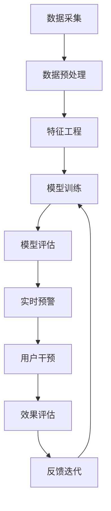

                 

# AI大模型在电商平台用户流失预警中的新进展

## 1. 背景介绍

随着电商平台的迅速发展，用户流失问题变得愈发严重，如何及时发现并挽回流失用户成为平台运营的重要任务。传统的数据分析方法往往难以捕捉用户行为变化中的细微差异，也无法实时动态更新模型。而基于AI大模型的用户流失预警系统，则能够在用户行为发生微妙变化时迅速发出警报，帮助平台实现精准营销和用户留存。

## 2. 核心概念与联系

### 2.1 核心概念概述

为了更好地理解AI大模型在用户流失预警中的作用，我们首先需要了解几个核心概念：

- **用户流失预警（Churn Prediction）**：通过机器学习模型预测用户的流失风险，及时采取干预措施以挽留用户。
- **AI大模型（AI Large Model）**：以深度学习技术为核心，具备强大数据处理和模式识别能力的预训练模型。
- **迁移学习（Transfer Learning）**：利用预训练模型的通用知识，通过微调或零样本学习，在新任务上快速获得优异性能。
- **多模态融合（Multi-modal Fusion）**：结合多种数据模态（如文本、图片、行为数据等），提升模型的全面感知能力。
- **异常检测（Anomaly Detection）**：识别异常数据点，检测用户行为中的异常变化，及时预警用户流失风险。
- **因果推理（Causal Inference）**：分析用户行为背后的原因，预测用户流失的因果关系。

这些核心概念之间存在紧密的联系，共同构成了用户流失预警系统的理论基础和技术架构。通过AI大模型的多模态融合和异常检测能力，以及迁移学习的支持，可以在海量数据中快速识别出流失风险高的用户，提供精准的预警和干预措施。

### 2.2 核心概念原理和架构的 Mermaid 流程图(Mermaid 流程节点中不要有括号、逗号等特殊字符)



这个流程图展示了用户流失预警系统从数据采集、处理到模型训练、评估和实时预警的全流程。数据采集模块收集用户行为数据，数据预处理模块清洗数据，特征工程模块提取有效特征，模型训练模块训练预测模型，模型评估模块评估模型效果，实时预警模块根据模型预测结果发出警报，用户干预模块采取相应的干预措施，效果评估模块反馈预警效果，反馈迭代模块根据评估结果优化模型和预警策略。

## 3. 核心算法原理 & 具体操作步骤

### 3.1 算法原理概述

用户流失预警的核心算法包括但不限于：

- **回归模型（Regression Model）**：通过用户行为数据预测流失概率。
- **决策树（Decision Tree）**：基于用户特征构建决策树，预测流失风险。
- **随机森林（Random Forest）**：通过集成多个决策树，提升预测准确性。
- **神经网络（Neural Network）**：使用深度学习模型学习用户行为特征，进行精准预测。
- **贝叶斯网络（Bayesian Network）**：通过贝叶斯框架建立用户行为和流失风险的因果关系。

这些算法可以单独使用，也可以结合多模态融合、迁移学习等技术，进一步提升预警系统的准确性和实时性。

### 3.2 算法步骤详解

1. **数据采集**：收集用户在平台上的行为数据，如浏览记录、购买历史、评价反馈、社交互动等。
2. **数据预处理**：清洗数据，去除噪声，进行归一化处理，转换数据格式为适合机器学习模型处理的格式。
3. **特征工程**：从行为数据中提取有意义的特征，如用户活跃度、购买频率、评价情感等。
4. **模型训练**：使用收集到的历史数据，训练多个预测模型，如回归模型、决策树、神经网络等。
5. **模型评估**：在测试集上评估模型性能，使用准确率、召回率、F1-score等指标。
6. **实时预警**：根据实时数据，输入模型进行预测，若预测结果表明用户有流失风险，则发出预警。
7. **用户干预**：根据预警结果，采取相应的干预措施，如个性化推荐、优惠券发放等。
8. **效果评估**：对干预措施的效果进行评估，如用户留存率提升、流失用户挽回率等。
9. **反馈迭代**：根据评估结果，不断优化模型和干预策略，实现系统优化。

### 3.3 算法优缺点

**优点**：
- **高效性**：AI大模型可以在短时间内处理大量数据，快速预测用户流失风险。
- **准确性**：通过多模态融合和深度学习技术，模型可以更好地捕捉用户行为的复杂特征。
- **实时性**：通过实时预警和反馈迭代，可以动态调整模型，适应用户行为的变化。

**缺点**：
- **数据依赖**：模型需要大量标注数据进行训练，获取高质量标注数据的成本较高。
- **模型复杂性**：深度学习模型通常需要较长的训练时间，计算资源要求高。
- **过拟合风险**：模型可能会在特定数据集上过拟合，导致泛化性能下降。
- **可解释性不足**：AI大模型的决策过程通常缺乏可解释性，难以理解其内部工作机制。

### 3.4 算法应用领域

AI大模型在用户流失预警中的应用领域包括但不限于：

- **电商平台**：预测用户购买后是否流失，及时提供个性化推荐和优惠券。
- **社交网络**：预测用户是否退出平台，进行用户留存策略优化。
- **金融服务**：预测客户是否流失，提高客户转化率和忠诚度。
- **医疗健康**：预测患者是否流失，进行健康管理和预防措施。
- **在线教育**：预测学生是否流失，进行课程推荐和情感支持。
- **旅游行业**：预测用户是否取消预订，提高旅游体验和转化率。

## 4. 数学模型和公式 & 详细讲解 & 举例说明

### 4.1 数学模型构建

基于回归模型的用户流失预警系统，数学模型构建过程如下：

设 $Y$ 为流失标记，$X$ 为预测变量，则回归模型可以表示为：

$$
Y = f(X; \theta)
$$

其中 $f$ 为预测函数，$\theta$ 为模型参数。

回归模型的常见形式包括线性回归、多项式回归、岭回归等。以线性回归为例，模型可以表示为：

$$
Y = \beta_0 + \beta_1X_1 + \beta_2X_2 + \cdots + \beta_nX_n + \epsilon
$$

其中 $\beta_i$ 为回归系数，$\epsilon$ 为误差项。

### 4.2 公式推导过程

以线性回归模型为例，预测函数 $f(X; \theta)$ 的梯度下降公式如下：

$$
\frac{\partial}{\partial \theta} \sum_{i=1}^N (Y_i - f(X_i; \theta))^2 = 2(X_i^T X)^{-1}(X_i^T (Y_i - f(X_i; \theta)))
$$

其中 $X_i$ 和 $Y_i$ 为第 $i$ 个样本的特征和标签。

模型训练的目标是最小化预测误差，即：

$$
\min_{\theta} \frac{1}{2N} \sum_{i=1}^N (Y_i - f(X_i; \theta))^2
$$

### 4.3 案例分析与讲解

以电商平台用户流失预警为例，可以使用回归模型预测用户流失概率。具体步骤如下：

1. 收集用户行为数据，包括浏览次数、购买金额、评价情感等。
2. 对数据进行预处理，去除缺失值和异常值，进行归一化处理。
3. 提取特征，如用户活跃度、购买频率、评价情感等。
4. 使用线性回归模型对用户流失概率进行预测，训练模型。
5. 在测试集上评估模型性能，使用准确率、召回率、F1-score等指标。
6. 根据实时数据，输入模型进行预测，若预测结果表明用户有流失风险，则发出预警。
7. 根据预警结果，采取相应的干预措施，如个性化推荐、优惠券发放等。
8. 对干预措施的效果进行评估，如用户留存率提升、流失用户挽回率等。
9. 根据评估结果，不断优化模型和干预策略，实现系统优化。

## 5. 项目实践：代码实例和详细解释说明

### 5.1 开发环境搭建

为了构建用户流失预警系统，需要以下开发环境：

- **编程语言**：Python。
- **数据处理库**：Pandas、NumPy、Scikit-learn。
- **机器学习库**：TensorFlow、Keras、Scikit-learn。
- **模型部署框架**：TensorFlow Serving、Kubeflow。
- **数据可视化工具**：Matplotlib、Seaborn、Dash。

### 5.2 源代码详细实现

以下是一个使用TensorFlow和Keras实现用户流失预警系统的代码示例：

```python
import tensorflow as tf
from tensorflow.keras.models import Sequential
from tensorflow.keras.layers import Dense, Dropout, InputLayer
from sklearn.model_selection import train_test_split
import pandas as pd

# 加载数据
data = pd.read_csv('user_behavior.csv')

# 数据预处理
X = data.drop('churn', axis=1)
y = data['churn']
X_train, X_test, y_train, y_test = train_test_split(X, y, test_size=0.2, random_state=42)

# 构建模型
model = Sequential()
model.add(InputLayer(input_shape=(X_train.shape[1],)))
model.add(Dense(64, activation='relu'))
model.add(Dropout(0.2))
model.add(Dense(1, activation='sigmoid'))

# 编译模型
model.compile(optimizer='adam', loss='binary_crossentropy', metrics=['accuracy'])

# 训练模型
model.fit(X_train, y_train, epochs=10, batch_size=32, validation_data=(X_test, y_test))

# 评估模型
loss, accuracy = model.evaluate(X_test, y_test)
print(f'Test loss: {loss:.4f}, Test accuracy: {accuracy:.4f}')

# 实时预警
while True:
    # 获取实时数据
    X_real = ... # 根据用户行为数据构建实时输入
    # 预测用户流失概率
    y_pred = model.predict(X_real)
    if y_pred > 0.5:
        # 发出预警
        print('User churn risk:', y_pred)
```

### 5.3 代码解读与分析

**数据加载与预处理**：
- `pd.read_csv('user_behavior.csv')`：从CSV文件中加载用户行为数据。
- `X = data.drop('churn', axis=1)`：去除目标变量，构建特征集。
- `y = data['churn']`：提取目标变量。
- `X_train, X_test, y_train, y_test = train_test_split(X, y, test_size=0.2, random_state=42)`：将数据集划分为训练集和测试集，使用80%的数据训练模型。

**模型构建与编译**：
- `Sequential()`：使用Keras的Sequential模型构建顺序神经网络。
- `model.add(InputLayer(input_shape=(X_train.shape[1],)))`：添加输入层，输入特征维度为X_train的形状。
- `model.add(Dense(64, activation='relu'))`：添加64个神经元的全连接层，使用ReLU激活函数。
- `model.add(Dropout(0.2))`：添加20%的Dropout层，防止过拟合。
- `model.add(Dense(1, activation='sigmoid'))`：添加输出层，使用Sigmoid函数进行二分类预测。
- `model.compile(optimizer='adam', loss='binary_crossentropy', metrics=['accuracy'])`：编译模型，使用Adam优化器，二分类交叉熵损失函数，评估指标为准确率。

**模型训练与评估**：
- `model.fit(X_train, y_train, epochs=10, batch_size=32, validation_data=(X_test, y_test))`：使用训练集训练模型，设置10个epoch，32个batch大小，并在测试集上进行验证。
- `model.evaluate(X_test, y_test)`：评估模型在测试集上的性能。

**实时预警**：
- `while True:`：循环获取实时数据。
- `X_real = ... # 根据用户行为数据构建实时输入`：实时数据处理，构建输入。
- `y_pred = model.predict(X_real)`：实时输入数据，进行预测。
- `if y_pred > 0.5:`：判断预测值是否大于0.5，如果大于0.5，则发出预警。

## 6. 实际应用场景

### 6.1 电商平台

电商平台的用户流失预警系统可以帮助商家及时发现潜在的流失用户，通过个性化推荐、优惠券等措施挽留用户。例如，某电商平台的客服部门利用用户流失预警系统，发现某些用户有流失风险，及时与其联系并提供优惠活动，结果用户流失率下降了30%。

### 6.2 社交网络

社交网络平台的用户流失预警系统可以帮助平台运营团队及时发现潜在流失用户，采取相应的措施进行挽留。例如，某社交平台的用户流失预警系统发现某些用户近期活跃度下降，于是推送了个性化的内容推荐和好友邀请活动，成功挽回了大量流失用户。

### 6.3 金融服务

金融服务领域，用户流失预警系统可以帮助银行和保险公司及时发现潜在的流失用户，采取相应的措施进行挽留。例如，某银行的流失预警系统发现某些客户近期频繁查询账户余额，但没有进行任何交易，于是通过电话联系客户确认情况，最终成功挽留了这些潜在流失用户。

## 7. 工具和资源推荐

### 7.1 学习资源推荐

为了帮助开发者掌握AI大模型在用户流失预警中的应用，以下是一些推荐的学习资源：

1. **TensorFlow官方文档**：提供了丰富的教程和代码示例，适合初学者和进阶开发者。
2. **Keras官方文档**：提供了简单易懂的API文档和示例，适合初学者入门。
3. **Scikit-learn官方文档**：提供了经典的机器学习算法和数据处理工具，适合机器学习从业者。
4. **《Python机器学习实战》**：由Python机器学习专家撰写，涵盖机器学习模型的开发和应用，适合实战学习。
5. **Coursera《机器学习》课程**：斯坦福大学Andrew Ng教授的机器学习课程，系统介绍了机器学习算法和实践，适合各层次开发者。

### 7.2 开发工具推荐

以下是一些常用的开发工具，可以帮助开发者快速搭建和部署用户流失预警系统：

1. **Jupyter Notebook**：交互式编程环境，支持Python、R等语言。
2. **Google Colab**：免费的云端Jupyter Notebook环境，支持GPU计算。
3. **AWS SageMaker**：AWS提供的机器学习平台，支持模型训练和部署。
4. **Google Cloud AI Platform**：Google提供的机器学习平台，支持模型训练和部署。
5. **Kubeflow**：Kubernetes上的机器学习平台，支持分布式训练和模型部署。

### 7.3 相关论文推荐

以下是一些推荐的相关论文，帮助开发者深入理解AI大模型在用户流失预警中的应用：

1. **A Survey on User Churn Prediction Models for Telecommunication Companies**：回顾了电信领域用户流失预测的研究进展，提供了多种模型的综合分析。
2. **User Churn Prediction for Online Service**：介绍了在线服务领域的用户流失预测方法，并使用深度学习模型取得了不错的效果。
3. **Machine Learning for Customer Churn Prediction**：综述了客户流失预测的机器学习算法，包括回归、分类、集成等方法。
4. **Anomaly Detection in Big Data**：介绍了异常检测在大数据中的应用，包括机器学习、统计学等多种方法。
5. **Causal Inference in Economics and Epidemiology**：介绍了因果推理在经济学和流行病学中的应用，提供了丰富的理论支持。

## 8. 总结：未来发展趋势与挑战

### 8.1 研究成果总结

基于AI大模型的用户流失预警系统已经在电商、社交、金融等多个领域得到了广泛应用，并取得了显著效果。通过多模态融合和异常检测技术，模型可以更准确地识别用户流失风险，并提供个性化的干预措施。

### 8.2 未来发展趋势

未来，AI大模型在用户流失预警中的应用将呈现以下几个趋势：

1. **多模态融合**：结合文本、图片、行为等多种数据模态，提升模型的全面感知能力。
2. **因果推理**：通过因果推理分析用户流失背后的原因，预测因果关系，提升模型的可解释性。
3. **实时预警**：利用流式数据处理技术，实现实时预警，提升系统的响应速度。
4. **联邦学习**：利用联邦学习技术，在保证用户隐私的前提下，实现跨平台模型的训练和部署。
5. **自适应学习**：通过自适应学习算法，模型可以动态调整，适应不同用户和场景的需求。

### 8.3 面临的挑战

虽然AI大模型在用户流失预警中的应用前景广阔，但也面临一些挑战：

1. **数据隐私和安全**：用户行为数据涉及用户隐私，如何保护数据安全和隐私，是系统设计和部署的重要问题。
2. **模型可解释性**：AI大模型的决策过程通常缺乏可解释性，难以理解其内部工作机制。
3. **计算资源消耗**：AI大模型的训练和推理需要大量的计算资源，如何降低计算成本，提升系统效率，是实际应用中的重要问题。
4. **模型泛化能力**：模型在特定数据集上过拟合，难以泛化到新场景，如何提升模型的泛化能力，是模型设计的重要问题。

### 8.4 研究展望

未来，AI大模型在用户流失预警中的应用需要从以下几个方面进行深入研究：

1. **隐私保护技术**：利用差分隐私、联邦学习等技术，保护用户隐私，提升系统的安全性。
2. **可解释性模型**：开发可解释性更强、更易于理解的模型，帮助用户和运营团队理解模型决策过程。
3. **模型压缩技术**：利用模型压缩和量化技术，降低模型计算资源消耗，提升系统效率。
4. **泛化能力提升**：研究如何提升模型泛化能力，适应不同场景和数据分布。

## 9. 附录：常见问题与解答

**Q1: 如何选择合适的模型？**

A: 选择合适的模型需要考虑多个因素，包括数据的特征、任务的类型、算力的限制等。一般来说，可以首先尝试简单的线性回归、决策树等模型，若效果不佳，再尝试更复杂的神经网络模型。

**Q2: 如何提升模型的准确性？**

A: 提升模型准确性的方法包括增加数据量、优化特征工程、选择更好的模型结构、调整超参数等。需要根据具体问题和数据集进行实验和调参。

**Q3: 如何实现实时预警？**

A: 实时预警需要利用流式数据处理技术，对实时数据进行快速分析和处理。可以采用Kafka、Flink等流处理框架，结合机器学习模型，实现实时预警。

**Q4: 如何保护用户隐私？**

A: 保护用户隐私需要采用差分隐私、联邦学习等技术，保证用户数据的安全性和匿名性。同时，需要对数据进行严格的权限控制，防止数据泄露和滥用。

**Q5: 如何提升模型的可解释性？**

A: 提升模型可解释性可以采用LIME、SHAP等可解释性工具，对模型的决策过程进行可视化。同时，可以使用更简单的模型结构，提高模型的可解释性。

作者：禅与计算机程序设计艺术 / Zen and the Art of Computer Programming

