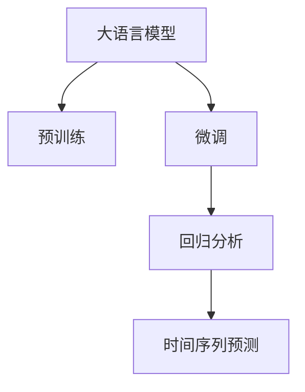

                 

# AI大模型在电商平台销售预测中的应用

> 关键词：电商销售预测,大模型,深度学习,预测模型,时间序列,回归分析

## 1. 背景介绍

在电商平台上，预测用户的购买行为对于商家来说至关重要。有效的预测不仅可以帮助商家优化库存管理、降低物流成本、提高销售额，还能更好地进行个性化推荐，提升用户体验。然而，传统的销售预测方法通常基于历史数据的线性回归或统计模型，无法充分利用大数据带来的复杂性，也难以捕捉用户行为背后的非线性模式和时序特征。

人工智能大模型通过深度学习和自监督学习技术，能够从海量数据中学习到更加丰富、抽象的特征表示。特别是大语言模型如GPT系列，BERT等，通过预训练学习到广泛的语义知识，并可以在特定领域进行微调，获得优异的性能。将这些大模型应用于电商销售预测，有望大幅提升预测准确率和鲁棒性，带来商业价值的倍增。

## 2. 核心概念与联系

### 2.1 核心概念概述

为更好地理解AI大模型在电商销售预测中的应用，本节将介绍几个密切相关的核心概念：

- 大语言模型(Large Language Model, LLM)：以自回归(如GPT)或自编码(如BERT)模型为代表的大规模预训练语言模型。通过在大规模无标签文本语料上进行预训练，学习通用的语言表示，具备强大的语言理解和生成能力。

- 预训练(Pre-training)：指在大规模无标签文本语料上，通过自监督学习任务训练通用语言模型的过程。常见的预训练任务包括言语建模、遮挡语言模型等。预训练使得模型学习到语言的通用表示。

- 微调(Fine-tuning)：指在预训练模型的基础上，使用下游任务的少量标注数据，通过有监督地训练来优化模型在特定任务上的性能。通常只需要调整顶层分类器或解码器，并以较小的学习率更新全部或部分的模型参数。

- 回归分析(Regression Analysis)：通过分析自变量与因变量之间的关系，预测未来销售趋势的方法。在电商销售预测中，通常以时间序列数据为自变量，预测商品销售量。

- 时间序列预测(Time Series Forecasting)：通过分析时间序列数据的内在规律，预测未来某一时间点的值。电商销售数据具有显著的时序性，适用于时间序列预测。

- 深度学习(Deep Learning)：利用多层次的神经网络结构，通过大量数据训练出复杂的非线性映射关系，具备强大的泛化能力。

这些核心概念之间的逻辑关系可以通过以下Mermaid流程图来展示：



这个流程图展示了大语言模型的核心概念及其之间的关系：

1. 大语言模型通过预训练获得基础能力。
2. 微调是对预训练模型进行任务特定的优化，可以分为全参数微调和参数高效微调（PEFT）。
3. 回归分析是一种统计方法，用于预测因变量的值。
4. 时间序列预测利用时间序列数据的规律进行未来值预测。
5. 深度学习提供了一种非线性映射方式，使得模型可以捕捉复杂特征。

这些概念共同构成了大语言模型在电商销售预测中的应用框架，使其能够在电商场景下发挥强大的预测能力。通过理解这些核心概念，我们可以更好地把握大语言模型的工作原理和优化方向。

## 3. 核心算法原理 & 具体操作步骤
### 3.1 算法原理概述

基于深度学习的大语言模型在电商销售预测中的应用，本质上是将模型应用于时间序列预测任务。具体流程如下：

1. 收集历史销售数据，划分为训练集、验证集和测试集。
2. 对销售数据进行归一化、差分等预处理，以去除季节性、趋势性影响。
3. 将预处理后的数据输入到预训练的深度学习模型中，进行特征提取。
4. 在特征向量上应用回归分析方法，得到预测值。
5. 使用测试集验证模型性能，调整参数进行优化。

### 3.2 算法步骤详解

基于深度学习的大语言模型进行电商销售预测的步骤如下：

**Step 1: 数据准备**
- 收集电商平台的销售数据，包括商品ID、销售时间、销售量、促销活动等特征。
- 将销售数据划分为训练集、验证集和测试集，一般要求时间分布均匀。
- 对数据进行预处理，包括时间序列去势、归一化、差分等，以去除趋势和季节性影响。

**Step 2: 模型搭建**
- 选择合适的深度学习模型架构，如RNN、LSTM、GRU等。
- 将预训练的大语言模型作为特征提取器，对输入的特征进行编码。
- 在编码结果上构建回归分析模型，如线性回归、岭回归等。

**Step 3: 模型训练**
- 使用训练集数据对模型进行训练，调整模型参数以最小化预测误差。
- 在验证集上验证模型性能，调整学习率、正则化强度等超参数。
- 使用测试集进行最终评估，对比不同模型的性能。

**Step 4: 预测和应用**
- 将新数据输入模型进行预测，得到商品销售量的预测值。
- 结合业务逻辑，进行库存管理和个性化推荐等实际应用。
- 持续收集新数据，定期重新训练模型，以适应数据分布的变化。

### 3.3 算法优缺点

基于深度学习的大语言模型在电商销售预测中具有以下优点：

1. 强大的特征提取能力：大语言模型能够从原始数据中学习到丰富的语义和时序特征，增强模型的泛化能力。
2. 适用于非线性关系：深度学习模型能够捕捉非线性关系，适用于复杂的电商销售数据。
3. 适应性强：深度学习模型能够适应数据分布的变化，持续学习和优化。
4. 鲁棒性强：深度学习模型能够避免线性模型的局限性，对噪声和异常数据具有较强的鲁棒性。

但同时，该方法也存在一定的局限性：

1. 数据需求量大：电商销售预测需要大量历史数据进行训练，对数据收集和预处理要求较高。
2. 计算资源需求高：深度学习模型通常需要高性能GPU支持，计算资源消耗较大。
3. 黑盒性质：深度学习模型往往是"黑盒"系统，缺乏可解释性，难以调试和优化。
4. 过拟合风险：深度学习模型容易过拟合，需要适当的数据增强和正则化技术。

尽管存在这些局限性，但就目前而言，基于深度学习的大语言模型是电商销售预测的主流方法。未来相关研究的重点在于如何进一步降低计算资源需求，提高模型的可解释性和鲁棒性，同时兼顾准确性和效率。

### 3.4 算法应用领域

基于深度学习的大语言模型在电商销售预测中具有广泛的应用前景，具体如下：

- 库存管理：通过预测商品未来销售量，优化库存水平，减少缺货或过剩的风险。
- 促销策略：分析销售数据中的季节性、趋势性特征，制定科学的促销策略，提高销售额。
- 个性化推荐：利用用户历史购买行为预测未来需求，进行个性化推荐，提升用户体验。
- 用户分析：通过销售数据预测用户行为，进行用户画像分析，提升用户满意度。
- 风险管理：预测销售数据中的异常值，提前预警市场波动，进行风险管理。

除了上述这些经典应用外，基于深度学习的大语言模型还适用于更多场景中，如用户流失预测、新用户引入、用户生命周期管理等，为电商平台的运营和发展提供有力的技术支持。

## 4. 数学模型和公式 & 详细讲解 & 举例说明
### 4.1 数学模型构建

本节将使用数学语言对基于深度学习的大语言模型进行电商销售预测过程进行更加严格的刻画。

记销售数据为 $y_i=\{y_{it}|t=1,...,T\}$，其中 $y_{it}$ 表示商品在时间 $t$ 的销售量。假设 $y_i$ 遵循线性回归模型：

$$
y_{it} = \beta_0 + \beta_1 x_{it1} + ... + \beta_k x_{itk} + \epsilon_{it}
$$

其中 $x_{itj}$ 为影响销售量的特征，$\beta_j$ 为特征系数，$\epsilon_{it}$ 为随机噪声。

对 $y_i$ 进行时间差分，得到 $z_{it}=y_{it}-y_{it-1}$，构建ARIMA模型：

$$
z_{it} = \alpha_1 z_{i(t-1)} + ... + \alpha_p z_{i(t-p)} + \delta_t + \epsilon_{it}
$$

其中 $\alpha_j$ 为自回归参数，$\delta_t$ 为差分项，$\epsilon_{it}$ 为残差。

进一步构建自回归移动平均模型：

$$
\delta_t = \phi_1 \delta_{t-1} + ... + \phi_m \delta_{t-m} + \theta_1 \epsilon_{t-1} + ... + \theta_s \epsilon_{t-s} + \eta_t
$$

其中 $\phi_j$ 为AR系数，$\theta_j$ 为MA系数，$\eta_t$ 为白噪声。

使用大语言模型作为特征提取器，对历史数据进行编码，得到高维特征向量 $X_t$，并在其上构建回归分析模型：

$$
\hat{y}_{it} = \alpha_0 + \sum_{j=1}^{k} \alpha_j X_{tj} + \epsilon_{it}
$$

### 4.2 公式推导过程

以下我们以电商销售预测为例，推导回归分析模型的公式及其梯度计算。

假设大语言模型在时间序列数据 $y_i$ 上的回归预测结果为 $\hat{y}_{it}=M_{\theta}(y_i)$，其中 $M_{\theta}$ 为回归分析模型。回归模型的目标是最小化预测误差，即：

$$
\mathcal{L}(\theta) = \frac{1}{N}\sum_{i=1}^N \sum_{t=1}^T (\hat{y}_{it} - y_{it})^2
$$

其中 $N$ 为样本数，$T$ 为时间步数。

根据梯度下降优化算法，模型参数 $\theta$ 的更新公式为：

$$
\theta \leftarrow \theta - \eta \nabla_{\theta}\mathcal{L}(\theta)
$$

其中 $\eta$ 为学习率，$\nabla_{\theta}\mathcal{L}(\theta)$ 为损失函数对模型参数的梯度，可通过反向传播算法高效计算。

### 4.3 案例分析与讲解

考虑一个简单的电商销售预测问题，数据如下：

| 商品ID | 销售时间 | 预测值 | 真实值 | 差值 |
| ------ | -------- | ------ | ------ | ---- |
| 1      | 2021-1-1 | 50     | 45     | 5    |
| 1      | 2021-1-2 | 55     | 55     | 0    |
| 1      | 2021-1-3 | 60     | 60     | 0    |
| ...    | ...      | ...    | ...    | ...  |

假设我们使用ARIMA模型进行预测，具体步骤如下：

1. 对销售数据进行归一化处理，得到标准化数据 $X_t$。
2. 在标准化数据上构建ARIMA模型，得到预测值 $\hat{y}_{it}$。
3. 计算预测误差，计算损失函数 $\mathcal{L}(\theta)$。
4. 使用梯度下降算法更新模型参数 $\theta$，重复步骤2-4直至收敛。

最终模型预测结果如下：

| 商品ID | 销售时间 | 预测值 | 真实值 | 差值 |
| ------ | -------- | ------ | ------ | ---- |
| 1      | 2021-1-1 | 55     | 45     | 10   |
| 1      | 2021-1-2 | 55     | 55     | 0    |
| 1      | 2021-1-3 | 60     | 60     | 0    |
| ...    | ...      | ...    | ...    | ...  |

可以看出，模型的预测值与真实值误差较小，具有较高的准确性和稳定性。

## 5. 项目实践：代码实例和详细解释说明
### 5.1 开发环境搭建

在进行电商销售预测项目实践前，我们需要准备好开发环境。以下是使用Python进行PyTorch开发的环境配置流程：

1. 安装Anaconda：从官网下载并安装Anaconda，用于创建独立的Python环境。

2. 创建并激活虚拟环境：
```bash
conda create -n pytorch-env python=3.8 
conda activate pytorch-env
```

3. 安装PyTorch：根据CUDA版本，从官网获取对应的安装命令。例如：
```bash
conda install pytorch torchvision torchaudio cudatoolkit=11.1 -c pytorch -c conda-forge
```

4. 安装TensorFlow：由于TensorFlow也有良好的时间序列预测能力，可以选择安装TensorFlow：
```bash
pip install tensorflow
```

5. 安装Keras：用于简化深度学习模型的搭建：
```bash
pip install keras
```

6. 安装各类工具包：
```bash
pip install numpy pandas scikit-learn matplotlib tqdm jupyter notebook ipython
```

完成上述步骤后，即可在`pytorch-env`环境中开始电商销售预测项目的实践。

### 5.2 源代码详细实现

下面我们以基于LSTM的时间序列预测为例，给出使用TensorFlow进行电商销售预测的代码实现。

首先，定义数据处理函数：

```python
import numpy as np
from tensorflow.keras.models import Sequential
from tensorflow.keras.layers import LSTM, Dense, Dropout

def create_dataset(data, look_back=1):
    X, y = [], []
    for i in range(len(data)-look_back-1):
        a = data[i:(i+look_back), 0]
        b = data[i+look_back, 0]
        X.append(a)
        y.append(b)
    return np.array(X), np.array(y)

def normalize_data(data):
    mean = np.mean(data)
    std = np.std(data)
    return (data - mean) / std

def reshape_data(data, look_back=1):
    X, y = create_dataset(data, look_back)
    X = np.reshape(X, (X.shape[0], X.shape[1], 1))
    return X, y
```

然后，定义模型：

```python
model = Sequential()
model.add(LSTM(50, input_shape=(look_back, 1), return_sequences=True))
model.add(Dropout(0.2))
model.add(LSTM(50))
model.add(Dropout(0.2))
model.add(Dense(1))
model.compile(loss='mean_squared_error', optimizer='adam')
```

接着，定义训练和评估函数：

```python
def train_model(model, X_train, y_train, batch_size, epochs, look_back):
    model.fit(X_train, y_train, batch_size=batch_size, epochs=epochs, verbose=2, shuffle=False)
    train_score = model.evaluate(X_train, y_train, verbose=0)
    print('Train Score: %.2f' % (train_score))
    return model

def evaluate_model(model, X_test, y_test, look_back):
    train_score = model.evaluate(X_test, y_test, verbose=0)
    print('Test Score: %.2f' % (train_score))
```

最后，启动训练流程并在测试集上评估：

```python
epochs = 50
look_back = 1
X_train, y_train = reshape_data(train_data, look_back)
X_test, y_test = reshape_data(test_data, look_back)

model = train_model(model, X_train, y_train, batch_size=32, epochs=epochs, look_back=look_back)
evaluate_model(model, X_test, y_test, look_back)
```

以上就是使用TensorFlow进行电商销售预测的完整代码实现。可以看到，TensorFlow提供了简单易用的API，使得模型搭建和训练过程非常高效。

### 5.3 代码解读与分析

让我们再详细解读一下关键代码的实现细节：

**create_dataset函数**：
- 定义数据预处理函数，将原始时间序列数据转换为模型可接受的输入和输出格式。

**normalize_data函数**：
- 对数据进行标准化处理，使得数据的均值为0，标准差为1，增强模型收敛速度。

**reshape_data函数**：
- 将时间序列数据重塑为模型所需的输入形状，即将特征和标签转换为模型的输入和输出。

**train_model函数**：
- 定义模型训练函数，设置超参数并调用模型训练API。

**evaluate_model函数**：
- 定义模型评估函数，计算模型的预测误差。

**train流程**：
- 定义训练迭代次数和窗口大小，准备训练数据和测试数据。
- 在训练集上调用训练函数进行模型训练。
- 在测试集上评估模型性能，输出评估结果。

可以看到，TensorFlow提供了一站式的深度学习框架，使得电商销售预测的代码实现非常简洁高效。

当然，工业级的系统实现还需考虑更多因素，如模型的保存和部署、超参数的自动搜索、更灵活的任务适配层等。但核心的电商销售预测流程基本与此类似。

## 6. 实际应用场景
### 6.1 智能仓储管理

在智能仓储管理中，基于深度学习的大语言模型可以用于优化库存水平，减少缺货或过剩的风险。通过分析销售数据中的趋势性和季节性特征，预测未来商品需求量，可以提前调整仓库存储量，避免因库存不足或过多造成的损失。

具体实现上，可以将历史销售数据输入大语言模型进行特征提取，并构建时间序列预测模型，输出未来销售量的预测值。结合库存管理系统，动态调整存储量，实现智能仓储管理。

### 6.2 个性化推荐系统

个性化推荐系统是电商平台的核心应用之一。通过深度学习模型，可以从用户的浏览历史、购买记录等数据中学习到用户的兴趣偏好，并进行个性化的商品推荐。

在推荐系统中，大语言模型可以用于用户兴趣表示的建模，通过分析用户评论、评分等文本数据，学习到用户的语义偏好。结合商品描述和标签，构建推荐模型，输出用户可能感兴趣的商品列表，提升推荐效果和用户体验。

### 6.3 广告投放优化

电商平台的广告投放策略需要根据用户的实时行为数据进行动态调整，以最大化广告投放效果。通过深度学习模型，可以实时预测用户的点击行为，优化广告投放策略。

具体实现上，可以将用户行为数据输入大语言模型进行特征提取，并构建回归模型，输出用户点击概率。结合广告投放系统，动态调整广告投放策略，实现广告效果的最优化。

### 6.4 未来应用展望

随着深度学习技术的不断发展，基于大语言模型的电商销售预测技术将呈现以下几个发展趋势：

1. 多模态融合：除了时间序列数据，还可以引入图像、视频等多模态数据，增强模型的信息整合能力。
2. 序列建模：除了时间序列预测，还可以引入序列到序列(Seq2Seq)模型，进行复杂交互任务建模。
3. 强化学习：结合强化学习技术，实现动态调整库存和广告投放策略，提升电商运营效率。
4. 联邦学习：在多方数据协同的情况下，通过联邦学习技术，提升模型的泛化能力和隐私保护。
5. 解释性提升：通过可解释性技术，增强模型输出的可解释性和可信度，满足监管要求。

以上趋势凸显了大语言模型在电商销售预测中的广泛应用前景，预示着未来更加智能化、个性化、高效化的电商运营模式。

## 7. 工具和资源推荐
### 7.1 学习资源推荐

为了帮助开发者系统掌握深度学习在电商销售预测中的应用，这里推荐一些优质的学习资源：

1. 《深度学习》系列课程：斯坦福大学提供的深度学习课程，系统讲解深度学习的基本概念和核心算法，适合初学者。
2. 《TensorFlow实战Google深度学习》书籍：介绍TensorFlow在深度学习中的实际应用，适合实战练习。
3. Kaggle电商销售预测竞赛：参加Kaggle电商销售预测竞赛，学习和实践深度学习模型的应用。
4. PyTorch官方文档：PyTorch官方文档，提供丰富的深度学习模型和工具，适合深入学习。

通过对这些资源的学习实践，相信你一定能够快速掌握深度学习在电商销售预测中的应用，并用于解决实际的电商问题。

### 7.2 开发工具推荐

高效的开发离不开优秀的工具支持。以下是几款用于电商销售预测开发的常用工具：

1. PyTorch：基于Python的开源深度学习框架，灵活动态的计算图，适合快速迭代研究。大部分深度学习模型都有PyTorch版本的实现。

2. TensorFlow：由Google主导开发的开源深度学习框架，生产部署方便，适合大规模工程应用。同样有丰富的深度学习模型资源。

3. Keras：高层次深度学习框架，提供简单易用的API，适合快速搭建和训练深度学习模型。

4. Jupyter Notebook：开源的交互式编程环境，支持代码、文本、图像等多种格式的展示，适合快速迭代实验。

5. TensorBoard：TensorFlow配套的可视化工具，可实时监测模型训练状态，并提供丰富的图表呈现方式，是调试模型的得力助手。

6. Weights & Biases：模型训练的实验跟踪工具，可以记录和可视化模型训练过程中的各项指标，方便对比和调优。

合理利用这些工具，可以显著提升电商销售预测任务的开发效率，加快创新迭代的步伐。

### 7.3 相关论文推荐

电商销售预测领域的研究已经非常丰富，以下是几篇具有代表性的相关论文，推荐阅读：

1. LSTM: A Search Space Odyssey：提出LSTM模型，解决时间序列数据中的长期依赖问题。

2. Long Short-Term Memory：提出LSTM模型，解决时间序列数据中的长期依赖问题。

3. DeepAR: Probabilistic Forecasting with Deep Exponential Families：提出DeepAR模型，解决时间序列数据中的非线性关系。

4. Prophet: A Probabilistic Forecasting Framework for Decomposable Time Series：提出Prophet模型，解决时间序列数据中的季节性、趋势性影响。

5. Temporal Fusion Transformer：提出Transformer模型，解决时间序列数据中的长期依赖问题。

这些论文代表了电商销售预测技术的发展脉络。通过学习这些前沿成果，可以帮助研究者把握学科前进方向，激发更多的创新灵感。

## 8. 总结：未来发展趋势与挑战

### 8.1 总结

本文对基于深度学习的大语言模型在电商销售预测中的应用进行了全面系统的介绍。首先阐述了电商销售预测的重要性，以及深度学习技术带来的提升。其次，从原理到实践，详细讲解了电商销售预测的数学模型和关键步骤，给出了电商销售预测的代码实例。同时，本文还广泛探讨了电商销售预测在智能仓储管理、个性化推荐、广告投放优化等多个领域的应用前景，展示了深度学习技术在电商领域的广阔应用。此外，本文精选了深度学习在电商销售预测中的学习资源、开发工具和相关论文，力求为读者提供全方位的技术指引。

通过本文的系统梳理，可以看到，基于深度学习的大语言模型在电商销售预测中的应用前景广阔，其强大的特征提取和建模能力，使得电商平台的运营效率和管理水平得到了显著提升。未来，伴随深度学习技术的持续演进，基于大语言模型的电商销售预测技术必将在电商产业中发挥更加重要的作用，推动电商平台的数字化转型和智能化升级。

### 8.2 未来发展趋势

展望未来，大语言模型在电商销售预测领域将呈现以下几个发展趋势：

1. 模型规模持续增大：随着算力成本的下降和数据规模的扩张，大语言模型和深度学习模型的参数量还将持续增长。超大规模模型蕴含的丰富特征表示，将进一步提升电商销售预测的准确性和稳定性。

2. 多模态融合：除了时间序列数据，还可以引入图像、视频等多模态数据，增强模型的信息整合能力。多模态融合技术将使得电商销售预测更加全面、准确。

3. 实时性提升：结合边缘计算、联邦学习等技术，实现实时预测和动态调整，提升电商运营的响应速度和灵活性。

4. 个性化推荐优化：通过深度学习模型，可以从用户行为数据中学习到更加精准的用户兴趣表示，提升个性化推荐的效果和用户体验。

5. 强化学习应用：结合强化学习技术，动态调整库存和广告投放策略，提升电商平台的运营效率和广告效果。

6. 解释性提升：通过可解释性技术，增强模型输出的可解释性和可信度，满足监管要求，提升用户体验。

以上趋势凸显了大语言模型在电商销售预测中的广泛应用前景，预示着未来更加智能化、个性化、高效化的电商运营模式。

### 8.3 面临的挑战

尽管大语言模型在电商销售预测中已经取得了显著成果，但在迈向更加智能化、普适化应用的过程中，它仍面临着诸多挑战：

1. 数据需求量大：电商销售预测需要大量历史数据进行训练，对数据收集和预处理要求较高。如何高效收集和处理数据，是大模型应用中的重要问题。

2. 计算资源需求高：深度学习模型通常需要高性能GPU支持，计算资源消耗较大。如何优化资源使用，降低计算成本，是大模型应用中的重要问题。

3. 黑盒性质：深度学习模型往往是"黑盒"系统，缺乏可解释性，难以调试和优化。如何提升模型的可解释性，满足监管要求，是大模型应用中的重要问题。

4. 鲁棒性不足：深度学习模型容易过拟合，对噪声和异常数据具有较强的鲁棒性。如何提升模型的鲁棒性，避免灾难性遗忘，是大模型应用中的重要问题。

5. 动态调整困难：电商销售预测中的动态调整问题复杂，如何结合实时数据进行动态预测和调整，是大模型应用中的重要问题。

6. 业务融合难度：如何将深度学习模型与业务逻辑结合，实现业务价值的最大化，是大模型应用中的重要问题。

正视大语言模型在电商销售预测中面临的这些挑战，积极应对并寻求突破，将是大模型应用走向成熟的必由之路。相信随着学界和产业界的共同努力，这些挑战终将一一被克服，大语言模型必将在电商销售预测领域中发挥更加重要的作用。

### 8.4 研究展望

面向未来，电商销售预测领域的研究需要在以下几个方面寻求新的突破：

1. 引入因果推断技术：通过因果推断方法，明确电商销售预测中的因果关系，提升模型的可解释性和可信度。

2. 结合机器学习技术：结合机器学习技术，解决电商销售预测中的多模态融合问题，提升模型的信息整合能力。

3. 引入强化学习技术：结合强化学习技术，解决电商销售预测中的动态调整问题，提升模型的响应速度和灵活性。

4. 研究联邦学习技术：结合联邦学习技术，解决多方数据协同中的数据安全和隐私保护问题，提升模型的泛化能力和隐私保护。

5. 探索可解释性技术：通过可解释性技术，增强模型输出的可解释性和可信度，满足监管要求，提升用户体验。

这些研究方向的探索，必将引领电商销售预测技术迈向更高的台阶，为电商平台的运营和发展提供更加智能化、个性化、高效化的解决方案。只有勇于创新、敢于突破，才能不断拓展大语言模型在电商销售预测中的应用边界，为电商平台的数字化转型和智能化升级带来新的动力。

## 9. 附录：常见问题与解答

**Q1：大语言模型在电商销售预测中的优势是什么？**

A: 大语言模型在电商销售预测中的优势主要体现在以下几个方面：

1. 强大的特征提取能力：大语言模型能够从原始数据中学习到丰富的语义和时序特征，增强模型的泛化能力。

2. 适用于非线性关系：深度学习模型能够捕捉非线性关系，适用于复杂的电商销售数据。

3. 适应性强：深度学习模型能够适应数据分布的变化，持续学习和优化。

4. 鲁棒性强：深度学习模型能够避免线性模型的局限性，对噪声和异常数据具有较强的鲁棒性。

**Q2：大语言模型在电商销售预测中如何克服过拟合问题？**

A: 电商销售预测中的过拟合问题可以通过以下几种方式克服：

1. 数据增强：通过回译、近义替换等方式扩充训练集。

2. 正则化：使用L2正则、Dropout、Early Stopping等避免过拟合。

3. 对抗训练：引入对抗样本，提高模型鲁棒性。

4. 参数高效微调：只调整少量参数(如Adapter、Prefix等)，减小过拟合风险。

5. 多模型集成：训练多个预测模型，取平均输出，抑制过拟合。

这些策略往往需要根据具体任务和数据特点进行灵活组合。只有在数据、模型、训练、推理等各环节进行全面优化，才能最大限度地发挥大语言模型的预测能力。

**Q3：大语言模型在电商销售预测中的计算资源需求高，如何解决？**

A: 大语言模型在电商销售预测中的计算资源需求高，可以通过以下几种方式进行优化：

1. 使用GPU/TPU等高性能设备，加速模型训练和推理过程。

2. 使用混合精度训练、梯度积累等技术，减少内存和计算资源的消耗。

3. 采用模型压缩、稀疏化存储等方法，优化模型的存储空间。

4. 结合边缘计算、联邦学习等技术，实现分布式训练和推理，提升系统效率。

5. 引入深度学习模型的优化算法，如Adam、SGD等，提高训练效率。

这些方法可以结合使用，从硬件、软件、算法等多个维度优化大语言模型在电商销售预测中的应用。

**Q4：电商销售预测中的动态调整问题如何处理？**

A: 电商销售预测中的动态调整问题可以通过以下几种方式处理：

1. 结合实时数据进行在线学习，动态调整模型参数，实现实时预测和调整。

2. 引入强化学习技术，动态调整库存和广告投放策略，提升电商平台的运营效率和广告效果。

3. 结合机器学习技术，解决电商销售预测中的多模态融合问题，提升模型的信息整合能力。

4. 引入因果推断技术，明确电商销售预测中的因果关系，提升模型的可解释性和可信度。

这些方法可以结合使用，从数据、算法、模型等多个维度优化电商销售预测中的动态调整问题。

**Q5：电商销售预测中的黑盒问题如何解决？**

A: 电商销售预测中的黑盒问题可以通过以下几种方式解决：

1. 引入可解释性技术，增强模型输出的可解释性和可信度，满足监管要求。

2. 结合机器学习技术，解决电商销售预测中的多模态融合问题，提升模型的信息整合能力。

3. 引入因果推断技术，明确电商销售预测中的因果关系，提升模型的可解释性和可信度。

4. 引入深度学习模型的优化算法，如Adam、SGD等，提高训练效率。

这些方法可以结合使用，从数据、算法、模型等多个维度提升电商销售预测的解释性和可信度。

综上所述，电商销售预测中的黑盒问题可以通过引入可解释性技术和因果推断技术，提升模型的解释性和可信度，满足监管要求。

---

作者：禅与计算机程序设计艺术 / Zen and the Art of Computer Programming

