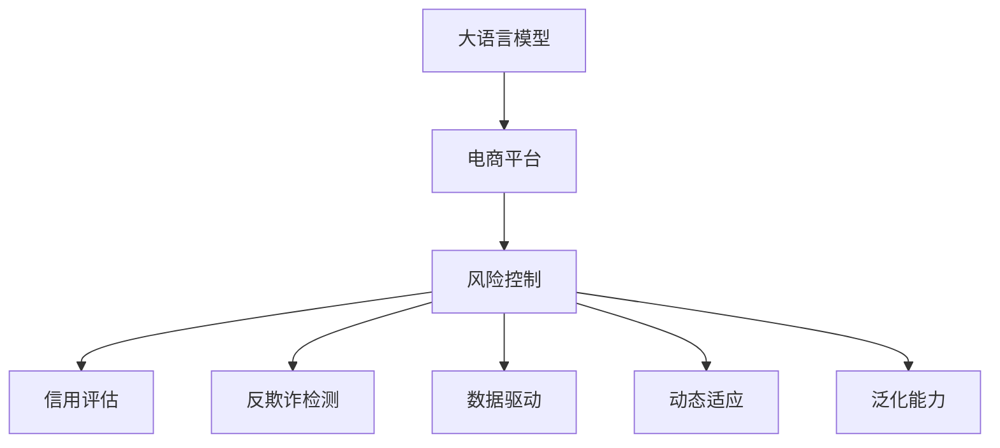

                 

# AI大模型在电商平台风险控制中的应用

> 关键词：大语言模型,风险控制,电商平台,信用评估,反欺诈检测,数据驱动,机器学习,深度学习

## 1. 背景介绍

### 1.1 问题由来
随着电商行业的快速发展，网络交易量和交易金额大幅增长，平台的交易风险也日益凸显。传统的基于规则的风险控制方法，往往难以适应复杂多变的市场环境。例如，一些假冒伪劣商品、恶意刷单行为、洗钱交易等，仅凭规则引擎难以识别和防范。而利用AI大模型进行风险控制，可以有效弥补传统方法的短板，提高风险检测的准确性和效率。

在AI大模型中，自然语言处理(Natural Language Processing, NLP)技术以其强大的语义理解和生成能力，特别适用于电商平台中的用户评论、产品描述、交易记录等文本数据的分析和处理。本文将详细介绍利用大语言模型进行电商平台风险控制的方法，涵盖信用评估、反欺诈检测等多个场景，探讨其在实际应用中的策略和优化。

### 1.2 问题核心关键点
大语言模型在电商平台风险控制中的应用，主要集中在以下几个关键点：

1. **信用评估**：利用大模型预测用户信用评分，评估其违约概率，防范用户恶意行为。
2. **反欺诈检测**：检测异常交易行为，识别疑似欺诈样本，避免平台经济损失。
3. **数据驱动决策**：基于海量数据训练模型，实现自动化的风险决策，提升风险控制效率。
4. **动态适应性**：模型可实时更新，适应市场变化，防止过时规则的失效。
5. **泛化能力强**：大模型具备较强的泛化能力，能在多个场景和数据集上表现稳定。

本文将从以上几个方面系统介绍大模型在电商平台风险控制中的应用，包括技术原理、算法实现、项目实践、应用案例及未来展望。

## 2. 核心概念与联系

### 2.1 核心概念概述

为更好地理解大语言模型在电商平台风险控制中的应用，本节将介绍几个密切相关的核心概念：

- **大语言模型(Large Language Model, LLM)**：以自回归(如GPT)或自编码(如BERT)模型为代表的大规模预训练语言模型。通过在海量无标签文本语料上进行预训练，学习通用的语言表示，具备强大的语言理解和生成能力。

- **电商平台(E-commerce Platform)**：指线上销售商品或服务的虚拟平台，如淘宝、京东、亚马逊等。电商平台通过AI技术优化用户体验、降低运营成本、提升安全性和信任度。

- **风险控制(Risk Control)**：指电商平台对交易行为进行监控和评估，识别和防范潜在的欺诈、恶意行为等风险，保障平台和用户权益。

- **信用评估(Credit Scoring)**：利用模型预测用户信用评分，评估其还款能力和还款意愿，辅助信贷决策。

- **反欺诈检测(Fraud Detection)**：识别和拦截欺诈行为，避免平台损失。

- **数据驱动(Datadriven)**：基于大数据和机器学习模型进行决策，提高风险控制效率和精准度。

- **动态适应(Dynamic Adaptation)**：模型能够实时更新，适应市场变化，避免过时规则的失效。

- **泛化能力(Generalization)**：模型能在不同场景和数据集上稳定表现，具备较强的适应性。

这些核心概念之间的逻辑关系可以通过以下Mermaid流程图来展示：



这个流程图展示了大语言模型在电商平台中的核心概念及其之间的关系：

1. 大语言模型通过预训练获得基础能力。
2. 风险控制是对电商平台的交易行为进行监控和评估，其中信用评估和反欺诈检测是其重要组成部分。
3. 数据驱动和动态适应使得模型能够高效、精准地进行风险决策。
4. 泛化能力保证了模型在不同场景和数据集上的稳定表现。

这些概念共同构成了大语言模型在电商平台中的风险控制框架，使其能够实现自动化的风险决策和实时监控。

## 3. 核心算法原理 & 具体操作步骤
### 3.1 算法原理概述

基于大语言模型在电商平台的风险控制，主要通过以下两个核心算法来实现：

1. **信用评估模型**：利用大模型预测用户信用评分，评估其违约概率。
2. **反欺诈检测模型**：利用大模型识别异常交易行为，检测疑似欺诈样本。

以信用评估为例，其核心算法原理如下：

- 数据预处理：将电商平台的历史交易数据、用户行为数据等进行清洗和特征工程，提取对信用评分有影响的特征。
- 模型训练：使用预训练的大语言模型作为初始化参数，在标注的信用数据集上，通过有监督学习进行微调。
- 评分预测：利用微调后的模型，输入用户的历史交易数据，输出用户信用评分。

以反欺诈检测为例，其核心算法原理如下：

- 数据预处理：将平台交易数据、用户行为数据等进行清洗和特征工程，提取对欺诈行为有影响的特征。
- 模型训练：使用预训练的大语言模型作为初始化参数，在标注的欺诈数据集上，通过有监督学习进行微调。
- 行为检测：利用微调后的模型，输入交易数据，判断是否存在欺诈行为。

### 3.2 算法步骤详解

**信用评估模型的算法步骤**：

1. **数据预处理**：
   - 收集电商平台的交易数据、用户行为数据等。
   - 清洗数据，去除噪声和异常值。
   - 特征工程：提取用户特征、交易特征、行为特征等。

2. **模型选择与训练**：
   - 选择合适的预训练大语言模型，如BERT、GPT等。
   - 数据集划分：划分为训练集、验证集和测试集。
   - 模型微调：在训练集上微调模型，使用交叉熵损失函数。

3. **评分预测**：
   - 输入用户的历史交易数据。
   - 使用微调后的模型，输出用户信用评分。
   - 对评分进行标准化处理。

4. **模型评估与优化**：
   - 在验证集上评估模型性能。
   - 根据评估结果调整模型参数。
   - 在测试集上最终评估模型效果。

**反欺诈检测模型的算法步骤**：

1. **数据预处理**：
   - 收集电商平台的交易数据、用户行为数据等。
   - 清洗数据，去除噪声和异常值。
   - 特征工程：提取交易特征、行为特征、用户特征等。

2. **模型选择与训练**：
   - 选择合适的预训练大语言模型，如BERT、GPT等。
   - 数据集划分：划分为训练集、验证集和测试集。
   - 模型微调：在训练集上微调模型，使用交叉熵损失函数。

3. **行为检测**：
   - 输入交易数据。
   - 使用微调后的模型，输出行为异常得分。
   - 设定阈值，判断是否存在欺诈行为。

4. **模型评估与优化**：
   - 在验证集上评估模型性能。
   - 根据评估结果调整模型参数。
   - 在测试集上最终评估模型效果。

### 3.3 算法优缺点

基于大语言模型在电商平台的风险控制方法，具有以下优点：

1. **模型泛化能力强**：预训练的大模型具备强大的泛化能力，能够适应多种场景和数据集。
2. **数据驱动决策**：利用大数据和机器学习，实现自动化的风险决策，提高决策效率。
3. **动态适应性**：模型能够实时更新，适应市场变化，避免过时规则的失效。
4. **自动化程度高**：自动化处理交易行为，降低人工干预和成本。

同时，该方法也存在一定的局限性：

1. **数据依赖性强**：模型的效果依赖于标注数据的质量和数量，获取高质量标注数据的成本较高。
2. **解释性不足**：大模型的决策过程缺乏可解释性，难以对其推理逻辑进行分析和调试。
3. **模型复杂度高**：大模型的参数量较大，训练和推理效率较低，需要高性能计算资源。

尽管存在这些局限性，但就目前而言，基于大语言模型的风险控制方法仍是目前电商平台的最佳选择。未来相关研究的重点在于如何进一步降低对标注数据的依赖，提高模型的少样本学习和跨领域迁移能力，同时兼顾可解释性和效率等因素。

### 3.4 算法应用领域

基于大语言模型在电商平台的风险控制方法，已经广泛应用于以下领域：

- **信用评估**：评估用户信用评分，辅助贷款审批决策。
- **反欺诈检测**：检测欺诈交易行为，防范金融风险。
- **客户行为分析**：分析用户行为，识别潜在高风险用户。
- **物流监控**：监控物流交易，防范盗刷、恶意退换货等行为。
- **营销策略优化**：利用用户行为数据，优化广告投放策略。

除了上述这些经典应用外，大语言模型在电商平台的风险控制中，还被创新性地应用于更多场景中，如智能客服、风控预警、个性化推荐等，为电商平台带来了全新的安全保障和用户体验。

## 4. 数学模型和公式 & 详细讲解  
### 4.1 数学模型构建

本节将使用数学语言对基于大语言模型的电商平台风险控制过程进行更加严格的刻画。

记电商平台的风险控制任务为 $T$，假设大语言模型为 $M_{\theta}$，其中 $\theta$ 为模型参数。假设有 $N$ 个标注样本 $(x_i, y_i)$，$x_i$ 为输入特征向量，$y_i$ 为对应的标签（信用评分或欺诈标记）。

定义模型 $M_{\theta}$ 在输入 $x_i$ 上的损失函数为 $\ell(M_{\theta}(x_i),y_i)$，则在数据集 $D$ 上的经验风险为：

$$
\mathcal{L}(\theta) = \frac{1}{N}\sum_{i=1}^N \ell(M_{\theta}(x_i),y_i)
$$

微调的优化目标是最小化经验风险，即找到最优参数：

$$
\theta^* = \mathop{\arg\min}_{\theta} \mathcal{L}(\theta)
$$

在实践中，我们通常使用基于梯度的优化算法（如SGD、Adam等）来近似求解上述最优化问题。设 $\eta$ 为学习率，$\lambda$ 为正则化系数，则参数的更新公式为：

$$
\theta \leftarrow \theta - \eta \nabla_{\theta}\mathcal{L}(\theta) - \eta\lambda\theta
$$

其中 $\nabla_{\theta}\mathcal{L}(\theta)$ 为损失函数对参数 $\theta$ 的梯度，可通过反向传播算法高效计算。

### 4.2 公式推导过程

以下我们以信用评估任务为例，推导交叉熵损失函数及其梯度的计算公式。

假设模型 $M_{\theta}$ 在输入 $x$ 上的输出为 $\hat{y}=M_{\theta}(x) \in [0,1]$，表示样本为违约用户的概率。真实标签 $y \in \{0,1\}$。则二分类交叉熵损失函数定义为：

$$
\ell(M_{\theta}(x),y) = -[y\log \hat{y} + (1-y)\log (1-\hat{y})]
$$

将其代入经验风险公式，得：

$$
\mathcal{L}(\theta) = -\frac{1}{N}\sum_{i=1}^N [y_i\log M_{\theta}(x_i)+(1-y_i)\log(1-M_{\theta}(x_i))]
$$

根据链式法则，损失函数对参数 $\theta_k$ 的梯度为：

$$
\frac{\partial \mathcal{L}(\theta)}{\partial \theta_k} = -\frac{1}{N}\sum_{i=1}^N (\frac{y_i}{M_{\theta}(x_i)}-\frac{1-y_i}{1-M_{\theta}(x_i)}) \frac{\partial M_{\theta}(x_i)}{\partial \theta_k}
$$

其中 $\frac{\partial M_{\theta}(x_i)}{\partial \theta_k}$ 可进一步递归展开，利用自动微分技术完成计算。

在得到损失函数的梯度后，即可带入参数更新公式，完成模型的迭代优化。重复上述过程直至收敛，最终得到适应电商平台任务的最优模型参数 $\theta^*$。

## 5. 项目实践：代码实例和详细解释说明
### 5.1 开发环境搭建

在进行风险控制项目实践前，我们需要准备好开发环境。以下是使用Python进行PyTorch开发的环境配置流程：

1. 安装Anaconda：从官网下载并安装Anaconda，用于创建独立的Python环境。

2. 创建并激活虚拟环境：
```bash
conda create -n pytorch-env python=3.8 
conda activate pytorch-env
```

3. 安装PyTorch：根据CUDA版本，从官网获取对应的安装命令。例如：
```bash
conda install pytorch torchvision torchaudio cudatoolkit=11.1 -c pytorch -c conda-forge
```

4. 安装Transformers库：
```bash
pip install transformers
```

5. 安装各类工具包：
```bash
pip install numpy pandas scikit-learn matplotlib tqdm jupyter notebook ipython
```

完成上述步骤后，即可在`pytorch-env`环境中开始项目实践。

### 5.2 源代码详细实现

这里我们以信用评估任务为例，给出使用Transformers库对BERT模型进行风险控制模型的PyTorch代码实现。

首先，定义信用评估任务的数据处理函数：

```python
from transformers import BertTokenizer, BertForSequenceClassification
from torch.utils.data import Dataset
import torch

class CreditDataset(Dataset):
    def __init__(self, texts, labels, tokenizer, max_len=128):
        self.texts = texts
        self.labels = labels
        self.tokenizer = tokenizer
        self.max_len = max_len
        
    def __len__(self):
        return len(self.texts)
    
    def __getitem__(self, item):
        text = self.texts[item]
        label = self.labels[item]
        
        encoding = self.tokenizer(text, return_tensors='pt', max_length=self.max_len, padding='max_length', truncation=True)
        input_ids = encoding['input_ids'][0]
        attention_mask = encoding['attention_mask'][0]
        
        # 对标签进行one-hot编码
        encoded_label = torch.tensor([[label]], dtype=torch.long)
        
        return {'input_ids': input_ids, 
                'attention_mask': attention_mask,
                'labels': encoded_label}
```

然后，定义模型和优化器：

```python
from transformers import AdamW

model = BertForSequenceClassification.from_pretrained('bert-base-cased', num_labels=2)

optimizer = AdamW(model.parameters(), lr=2e-5)
```

接着，定义训练和评估函数：

```python
from torch.utils.data import DataLoader
from tqdm import tqdm
from sklearn.metrics import accuracy_score

device = torch.device('cuda') if torch.cuda.is_available() else torch.device('cpu')
model.to(device)

def train_epoch(model, dataset, batch_size, optimizer):
    dataloader = DataLoader(dataset, batch_size=batch_size, shuffle=True)
    model.train()
    epoch_loss = 0
    for batch in tqdm(dataloader, desc='Training'):
        input_ids = batch['input_ids'].to(device)
        attention_mask = batch['attention_mask'].to(device)
        labels = batch['labels'].to(device)
        model.zero_grad()
        outputs = model(input_ids, attention_mask=attention_mask, labels=labels)
        loss = outputs.loss
        epoch_loss += loss.item()
        loss.backward()
        optimizer.step()
    return epoch_loss / len(dataloader)

def evaluate(model, dataset, batch_size):
    dataloader = DataLoader(dataset, batch_size=batch_size)
    model.eval()
    preds, labels = [], []
    with torch.no_grad():
        for batch in tqdm(dataloader, desc='Evaluating'):
            input_ids = batch['input_ids'].to(device)
            attention_mask = batch['attention_mask'].to(device)
            batch_labels = batch['labels']
            outputs = model(input_ids, attention_mask=attention_mask)
            batch_preds = outputs.logits.argmax(dim=1).to('cpu').tolist()
            batch_labels = batch_labels.to('cpu').tolist()
            for pred, label in zip(batch_preds, batch_labels):
                preds.append(pred.item())
                labels.append(label.item())
                
    return accuracy_score(labels, preds)
```

最后，启动训练流程并在测试集上评估：

```python
epochs = 5
batch_size = 16

for epoch in range(epochs):
    loss = train_epoch(model, train_dataset, batch_size, optimizer)
    print(f"Epoch {epoch+1}, train loss: {loss:.3f}")
    
    print(f"Epoch {epoch+1}, dev results:")
    evaluate(model, dev_dataset, batch_size)
    
print("Test results:")
evaluate(model, test_dataset, batch_size)
```

以上就是使用PyTorch对BERT进行信用评估任务的风险控制模型的完整代码实现。可以看到，得益于Transformers库的强大封装，我们可以用相对简洁的代码完成BERT模型的加载和微调。

### 5.3 代码解读与分析

让我们再详细解读一下关键代码的实现细节：

**CreditDataset类**：
- `__init__`方法：初始化文本、标签、分词器等关键组件。
- `__len__`方法：返回数据集的样本数量。
- `__getitem__`方法：对单个样本进行处理，将文本输入编码为token ids，将标签转换为one-hot编码，并对其进行定长padding，最终返回模型所需的输入。

**模型选择与训练**：
- 使用预训练的BERT模型作为初始化参数。
- 定义模型和优化器，设置学习率。
- 定义训练和评估函数，计算损失函数并更新模型参数。

**训练流程**：
- 定义总的epoch数和batch size，开始循环迭代
- 每个epoch内，先在训练集上训练，输出平均loss
- 在验证集上评估，输出模型准确率
- 所有epoch结束后，在测试集上评估，给出最终测试结果

可以看到，PyTorch配合Transformers库使得BERT风险控制模型的代码实现变得简洁高效。开发者可以将更多精力放在数据处理、模型改进等高层逻辑上，而不必过多关注底层的实现细节。

当然，工业级的系统实现还需考虑更多因素，如模型的保存和部署、超参数的自动搜索、更灵活的任务适配层等。但核心的微调范式基本与此类似。

## 6. 实际应用场景
### 6.1 智能客服系统

利用大语言模型进行电商平台的风险控制，可以在智能客服系统中得到广泛应用。传统的客服系统往往依赖人工客服，存在响应慢、效率低、成本高的问题。而基于大语言模型的智能客服，可以通过实时监测用户行为，识别高风险用户，主动提供解决方案，提升客服效率和用户体验。

在技术实现上，可以收集用户的在线聊天记录、浏览行为、交易记录等，使用大语言模型进行风险评估，对高风险用户进行预警和干预。例如，通过分析聊天记录中的情绪变化，识别用户的不满情绪，主动提供安抚服务，避免用户投诉。通过预测用户的交易行为，及时发现恶意刷单、恶意退货等行为，提高交易安全性。

### 6.2 金融风险管理

在金融领域，电商平台的风险控制也发挥了重要作用。利用大语言模型进行信用评估和反欺诈检测，可以有效降低贷款违约率，防范金融风险。

具体而言，可以收集用户的个人信息、交易记录、社交网络数据等，使用大语言模型进行风险评估，预测用户的还款能力和还款意愿。对于高风险用户，可以及时采取措施，如提高贷款利率、限制额度等，避免金融风险。同时，利用大语言模型进行反欺诈检测，实时监控交易行为，及时发现和拦截欺诈行为，保护用户资金安全。

### 6.3 个性化推荐系统

基于大语言模型的风险控制，还可以应用于个性化推荐系统中，提高推荐系统的精准度和安全性。推荐系统通常依赖用户历史行为数据进行推荐，但难以防范恶意用户通过虚假行为进行干扰。而利用大语言模型进行风险控制，可以在推荐系统中加入风险评估，降低恶意用户对推荐结果的影响。

具体而言，可以收集用户对推荐商品的浏览、点击、购买等行为数据，使用大语言模型进行风险评估，识别潜在的恶意用户。对于高风险用户，可以限制其对推荐商品的操作权限，避免其对推荐系统的干扰。同时，利用大语言模型进行反欺诈检测，实时监控交易行为，及时发现和拦截欺诈行为，保护用户利益。

### 6.4 未来应用展望

随着大语言模型的不断发展，其在电商平台风险控制中的应用也将不断拓展。

在智慧城市治理中，基于大语言模型的智能客服、金融风险管理、个性化推荐等应用，将提升城市管理的智能化水平，构建更安全、高效的城市治理体系。

在医疗健康领域，基于大语言模型的风险控制，可以辅助医生进行诊断和治疗决策，提升医疗服务的质量和效率。

在教育领域，基于大语言模型的风险控制，可以辅助学校进行学生行为分析，识别高风险学生，提供个性化辅导，促进学生全面发展。

总之，大语言模型在电商平台风险控制中的应用，将为各行各业带来新的变革，推动人工智能技术的广泛应用和发展。

## 7. 工具和资源推荐
### 7.1 学习资源推荐

为了帮助开发者系统掌握大语言模型在电商平台风险控制中的应用，这里推荐一些优质的学习资源：

1. 《深度学习与自然语言处理》课程：斯坦福大学开设的NLP经典课程，涵盖自然语言处理的基本概念和前沿技术，是入门NLP领域的重要资源。

2. 《自然语言处理专项课程》：从浅入深讲解自然语言处理的核心技术，包括大语言模型的原理和应用，适合深度学习从业者学习。

3. 《Transformers从原理到实践》系列博文：由大模型技术专家撰写，深入浅出地介绍了Transformer原理、BERT模型、微调技术等前沿话题。

4. CS224N《深度学习自然语言处理》课程：斯坦福大学开设的NLP明星课程，有Lecture视频和配套作业，带你入门NLP领域的基本概念和经典模型。

5. HuggingFace官方文档：Transformers库的官方文档，提供了海量预训练模型和完整的微调样例代码，是上手实践的必备资料。

通过对这些资源的学习实践，相信你一定能够快速掌握大语言模型在电商平台风险控制中的应用，并用于解决实际的NLP问题。
###  7.2 开发工具推荐

高效的开发离不开优秀的工具支持。以下是几款用于大语言模型在电商平台风险控制开发的常用工具：

1. PyTorch：基于Python的开源深度学习框架，灵活动态的计算图，适合快速迭代研究。大部分预训练语言模型都有PyTorch版本的实现。

2. TensorFlow：由Google主导开发的开源深度学习框架，生产部署方便，适合大规模工程应用。同样有丰富的预训练语言模型资源。

3. Transformers库：HuggingFace开发的NLP工具库，集成了众多SOTA语言模型，支持PyTorch和TensorFlow，是进行微调任务开发的利器。

4. Weights & Biases：模型训练的实验跟踪工具，可以记录和可视化模型训练过程中的各项指标，方便对比和调优。与主流深度学习框架无缝集成。

5. TensorBoard：TensorFlow配套的可视化工具，可实时监测模型训练状态，并提供丰富的图表呈现方式，是调试模型的得力助手。

6. Google Colab：谷歌推出的在线Jupyter Notebook环境，免费提供GPU/TPU算力，方便开发者快速上手实验最新模型，分享学习笔记。

合理利用这些工具，可以显著提升大语言模型在电商平台风险控制任务的开发效率，加快创新迭代的步伐。

### 7.3 相关论文推荐

大语言模型在电商平台风险控制的研究源于学界的持续研究。以下是几篇奠基性的相关论文，推荐阅读：

1. Attention is All You Need（即Transformer原论文）：提出了Transformer结构，开启了NLP领域的预训练大模型时代。

2. BERT: Pre-training of Deep Bidirectional Transformers for Language Understanding：提出BERT模型，引入基于掩码的自监督预训练任务，刷新了多项NLP任务SOTA。

3. Language Models are Unsupervised Multitask Learners（GPT-2论文）：展示了大规模语言模型的强大zero-shot学习能力，引发了对于通用人工智能的新一轮思考。

4. Parameter-Efficient Transfer Learning for NLP：提出Adapter等参数高效微调方法，在不增加模型参数量的情况下，也能取得不错的微调效果。

5. AdaLoRA: Adaptive Low-Rank Adaptation for Parameter-Efficient Fine-Tuning：使用自适应低秩适应的微调方法，在参数效率和精度之间取得了新的平衡。

这些论文代表了大语言模型在电商平台风险控制的发展脉络。通过学习这些前沿成果，可以帮助研究者把握学科前进方向，激发更多的创新灵感。

## 8. 总结：未来发展趋势与挑战
### 8.1 总结

本文对基于大语言模型的电商平台风险控制进行了全面系统的介绍。首先阐述了电商平台的交易风险问题，明确了基于大语言模型的风险控制方法的核心关键点，包括信用评估、反欺诈检测等。其次，从原理到实践，详细讲解了模型的构建、训练和评估步骤，给出了具体的代码实例。同时，本文还广泛探讨了基于大语言模型的风险控制在实际应用中的策略和优化，包括智能客服、金融风险管理、个性化推荐等场景。

通过本文的系统梳理，可以看到，基于大语言模型的电商平台风险控制方法在多个领域展现出强大的应用潜力，能有效提升平台的智能化水平和安全性。未来，伴随大语言模型和风险控制技术的不断发展，大模型在电商平台的广泛应用必将带来新的变革和突破。

### 8.2 未来发展趋势

展望未来，大语言模型在电商平台的风险控制技术将呈现以下几个发展趋势：

1. **模型规模持续增大**：随着算力成本的下降和数据规模的扩张，预训练语言模型的参数量还将持续增长。超大规模语言模型蕴含的丰富语言知识，有望支撑更加复杂多变的风险控制决策。

2. **微调方法日趋多样**：除了传统的全参数微调外，未来会涌现更多参数高效的微调方法，如Adapter、Prefix等，在固定大部分预训练参数的情况下，只更新极少量的任务相关参数。

3. **动态适应性增强**：随着市场环境的变化，模型能够实时更新，适应新的市场规则和用户行为。

4. **多模态融合**：引入更多模态信息，如语音、图像、视频等，提高模型对复杂场景的识别能力。

5. **跨领域迁移能力**：在大规模数据和任务的支撑下，模型具备更强的跨领域迁移能力，可以在不同电商平台间进行迁移和微调。

6. **用户反馈优化**：利用用户反馈数据，不断优化模型，提升风险控制效果。

以上趋势凸显了大语言模型在电商平台风险控制技术的前景。这些方向的探索发展，必将进一步提升电商平台的风险控制能力，保障平台和用户的权益。

### 8.3 面临的挑战

尽管大语言模型在电商平台风险控制技术已经取得了瞩目成就，但在迈向更加智能化、普适化应用的过程中，它仍面临着诸多挑战：

1. **数据依赖性强**：模型的效果依赖于标注数据的质量和数量，获取高质量标注数据的成本较高。

2. **解释性不足**：大模型的决策过程缺乏可解释性，难以对其推理逻辑进行分析和调试。

3. **模型复杂度高**：大模型的参数量较大，训练和推理效率较低，需要高性能计算资源。

4. **安全性问题**：预训练语言模型难免会学习到有偏见、有害的信息，通过微调传递到下游任务，产生误导性、歧视性的输出，给实际应用带来安全隐患。

5. **动态更新困难**：随着市场环境的变化，模型需要动态更新以适应新的风险规则，但模型的更新和部署成本较高。

6. **伦理道德问题**：大模型的训练和应用需要考虑伦理道德问题，避免对用户隐私的侵害。

正视大语言模型在电商平台风险控制中面临的挑战，积极应对并寻求突破，将是大语言模型风险控制技术迈向成熟的必由之路。

### 8.4 研究展望

面对大语言模型在电商平台风险控制中面临的挑战，未来的研究需要在以下几个方面寻求新的突破：

1. **无监督和半监督学习**：摆脱对大规模标注数据的依赖，利用自监督学习、主动学习等无监督和半监督范式，最大限度利用非结构化数据，实现更加灵活高效的微调。

2. **参数高效和计算高效**：开发更加参数高效的微调方法，在固定大部分预训练参数的同时，只更新极少量的任务相关参数。同时优化微调模型的计算图，减少前向传播和反向传播的资源消耗，实现更加轻量级、实时性的部署。

3. **因果分析和博弈论工具**：将因果分析方法引入微调模型，识别出模型决策的关键特征，增强输出解释的因果性和逻辑性。借助博弈论工具刻画人机交互过程，主动探索并规避模型的脆弱点，提高系统稳定性。

4. **融合专家知识**：将符号化的先验知识，如知识图谱、逻辑规则等，与神经网络模型进行巧妙融合，引导微调过程学习更准确、合理的语言模型。

5. **多模态融合**：引入更多模态信息，如语音、图像、视频等，提高模型对复杂场景的识别能力。

6. **用户隐私保护**：在大模型的训练和应用中，充分考虑用户隐私保护问题，采用差分隐私、联邦学习等技术，确保用户数据安全。

这些研究方向的探索，必将引领大语言模型在电商平台风险控制技术迈向更高的台阶，为构建安全、可靠、可解释、可控的智能系统铺平道路。

## 9. 附录：常见问题与解答

**Q1：电商平台的数据隐私问题如何解决？**

A: 电商平台的交易数据涉及用户隐私，需要采用多种隐私保护技术来确保数据安全。常见的隐私保护技术包括：

1. **差分隐私**：在模型训练和微调过程中，加入噪声扰动，确保模型训练的隐私性。

2. **联邦学习**：分布式训练模型，各节点仅上传本地数据梯度，避免数据的集中存储和泄露。

3. **安全多方计算**：在多方共同参与的情况下，确保各方的数据隐私和安全。

4. **匿名化处理**：对敏感数据进行匿名化处理，防止数据识别。

5. **加密存储**：对敏感数据进行加密存储，防止数据泄露。

通过以上技术手段，可以在保障数据隐私的前提下，进行电商平台的风险控制。

**Q2：电商平台的风险控制模型如何应对市场变化？**

A: 电商平台的风险控制模型需要具备动态适应性，能够实时更新，适应市场变化。常见的动态更新方法包括：

1. **增量学习**：在已有模型基础上，新增数据进行微调，避免重头训练。

2. **在线学习**：利用流式数据实时更新模型，适应市场动态变化。

3. **在线微调**：在在线交易过程中，对模型进行实时微调，及时应对新规则和用户行为变化。

4. **自动化更新**：通过自动化系统，定时触发模型更新，确保模型始终处于最优状态。

通过以上方法，可以在市场环境变化时，及时更新电商平台的风险控制模型，保障平台和用户的权益。

**Q3：如何提高电商平台风险控制模型的鲁棒性？**

A: 提高电商平台风险控制模型的鲁棒性，可以从以下几个方面进行优化：

1. **数据增强**：通过数据增强技术，扩充训练集，提高模型的泛化能力。

2. **对抗训练**：引入对抗样本，训练鲁棒模型，提高模型对噪声和攻击的抵抗能力。

3. **多模型融合**：利用多个模型的预测结果进行融合，降低单一模型的风险。

4. **正则化技术**：使用L2正则、Dropout等正则化技术，防止模型过拟合。

5. **模型压缩**：对大模型进行压缩，减少参数量，提高计算效率。

6. **多任务学习**：在多个任务上训练模型，提高模型的鲁棒性。

通过以上方法，可以提升电商平台的风险控制模型的鲁棒性，确保其在高风险场景下的稳定性和安全性。

**Q4：电商平台的风险控制模型如何优化解释性？**

A: 电商平台的风险控制模型需要具备良好的解释性，以便于调试和优化。常见的优化方法包括：

1. **可解释性模型**：使用可解释性强的模型，如决策树、线性模型等，降低模型的复杂度，提高解释性。

2. **模型可视化**：通过可视化工具，展示模型的决策过程和关键特征，帮助理解模型的行为。

3. **特征重要性分析**：对模型的特征进行重要性分析，找出影响决策的关键特征。

4. **规则抽取**：从模型中抽取规则，降低模型的复杂度，提高可解释性。

5. **模型压缩**：对大模型进行压缩，降低模型的复杂度，提高解释性。

通过以上方法，可以提升电商平台的风险控制模型的解释性，帮助理解模型的决策过程，优化模型性能。

---

作者：禅与计算机程序设计艺术 / Zen and the Art of Computer Programming

