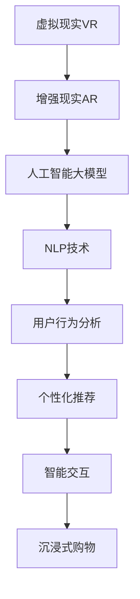

                 

# AI大模型如何提升电商平台的AR/VR购物体验

> 关键词：AI大模型,AR/VR,电商,用户体验,自然语言处理,NLP

## 1. 背景介绍

在数字经济时代，电商平台已成为消费者获取商品信息、进行购买决策的重要渠道。然而，传统电商平台往往局限于二维平面展示，难以提供沉浸式、互动性强的购物体验。近年来，随着虚拟现实(VR)和增强现实(AR)技术的成熟，结合AI大模型的强大能力，电商平台开始探索全新的AR/VR购物方式，为用户提供更生动、更智能的购物体验。

虚拟现实和增强现实技术，能够利用三维空间和动态渲染，将商品的立体形态、多角度视图等信息以直观的方式呈现在用户面前，使用户在虚拟环境中“亲临其境”，仿佛置身于实际购物中心。然而，如何实现商品信息的精准展示、场景互动的流畅衔接，以及智能推荐和个性化服务，成为提升AR/VR购物体验的关键难题。

## 2. 核心概念与联系

### 2.1 核心概念概述

为更好地理解AI大模型在AR/VR购物中的应用，本节将介绍几个密切相关的核心概念：

- 虚拟现实(Virtual Reality, VR)：利用计算机生成逼真的三维虚拟环境，使用户沉浸其中，并可通过交互设备实现与虚拟环境的互动。
- 增强现实(Augmented Reality, AR)：将虚拟信息与现实场景相结合，使用户能够在现实环境中看到虚拟信息，实现信息增强。
- 人工智能大模型(如BERT、GPT等)：基于Transformer等架构，通过大规模无标签数据进行自监督预训练，学习到丰富的语言和视觉知识。
- 自然语言处理(Natural Language Processing, NLP)：涉及文本数据的处理、分析、理解与生成，是AI大模型的重要应用领域。
- 用户行为分析：通过分析用户在虚拟空间中的行为数据，获取用户的兴趣偏好、需求变化等信息。

这些概念之间的逻辑关系可以通过以下Mermaid流程图来展示：



这个流程图展示了大模型与VR/AR购物体验之间的联系：

1. 虚拟现实和增强现实技术提供沉浸式、互动式的购物场景。
2. AI大模型通过预训练学习到丰富的语言和视觉知识，用于理解和生成商品信息。
3. 自然语言处理技术用于处理用户输入的文本信息，实现智能推荐和交互。
4. 用户行为分析通过捕捉用户互动行为，形成对用户偏好的理解。
5. 个性化推荐和智能交互进一步提升用户体验，驱动沉浸式购物。

这些概念共同构成了AR/VR购物的完整技术架构，使其能够提供全面、智能的购物体验。

## 3. 核心算法原理 & 具体操作步骤

### 3.1 算法原理概述

AI大模型在AR/VR购物中的主要应用包括商品信息的生成、用户行为的分析和智能推荐系统的构建。这些任务的核心算法原理可归结为：

- 自然语言处理(NLP)：用于理解用户的自然语言输入，生成描述商品的自然语言文本，支持智能推荐和交互。
- 视觉识别与生成：利用大模型的视觉知识，从三维模型或真实图片生成商品视图，实现商品的立体展示。
- 交互生成：通过交互模型实现用户在虚拟环境中的动作响应，增强购物互动体验。

在上述过程中，自然语言处理是核心的技术环节，而大模型的预训练和微调则是提升NLP能力的关键步骤。

### 3.2 算法步骤详解

AI大模型在AR/VR购物中的具体应用流程如下：

1. **数据准备与预处理**
   - 收集商品的多角度图片、3D模型、用户评论等信息。
   - 对图片和3D模型进行标注，生成商品描述文本。
   - 使用NLP技术对商品描述进行结构化处理，提取关键信息。

2. **大模型预训练与微调**
   - 选择合适的预训练语言模型（如BERT、GPT等）作为初始化参数。
   - 在大规模无标签文本数据上，使用预训练任务进行初始化训练，如掩码语言模型、Next Sentence Prediction等。
   - 在标注数据集上，使用微调任务进行进一步训练，提升模型的特定任务能力。

3. **商品信息生成**
   - 根据用户输入的自然语言查询，利用大模型生成商品描述文本，包括商品名称、价格、功能、用户评价等信息。
   - 将商品描述文本通过NLP技术处理，生成多角度的视图描述，用于渲染商品的3D模型或生成全景图片。

4. **用户行为分析**
   - 在虚拟环境中，通过传感器捕捉用户的行为数据，如点击、滑动、旋转等。
   - 使用大模型分析用户的行为模式，提取用户的兴趣偏好、关注点等信息。

5. **智能推荐与个性化服务**
   - 根据用户的兴趣偏好，利用大模型进行商品推荐，生成个性化的商品列表。
   - 在虚拟环境中，根据用户的实时行为，动态调整商品展示，增强互动体验。

6. **交互生成**
   - 利用交互模型对用户的交互动作进行响应，实现商品的虚拟互动。
   - 根据用户的点击、拖动等动作，更新商品视图，模拟用户手中的操作。

### 3.3 算法优缺点

AI大模型在AR/VR购物中的应用具有以下优点：

1. **丰富的商品信息**：通过大模型生成的商品描述，能够涵盖多个角度的信息，提供更全面、详细的产品展示。
2. **个性化的推荐**：利用大模型的语言和视觉知识，能够精准地理解和分析用户需求，提供个性化推荐。
3. **智能化的交互**：交互模型的应用，使得用户可以直观地操作虚拟商品，提升用户体验。

同时，也存在一些缺点：

1. **计算资源消耗大**：大模型的预训练和微调需要大量的计算资源，对于小型平台可能难以承担。
2. **数据隐私风险**：用户行为数据和用户评论等信息可能涉及隐私问题，需要妥善处理。
3. **初期成本高**：前期需要收集和标注大量的数据，以及开发和部署大模型，成本较高。

### 3.4 算法应用领域

AI大模型在AR/VR购物中的应用不仅局限于商品展示，还扩展到产品试用、虚拟导购、互动体验等多个领域。以下是几个典型应用场景：

- **虚拟试穿**：用户可以在虚拟环境中试穿服装、鞋子等，通过AR技术将虚拟衣物覆盖到真实视频上，模拟试穿效果。
- **虚拟家居**：用户可以在虚拟环境中预览家居布置效果，通过交互模型操作虚拟家具，查看不同摆放位置的视觉效果。
- **产品试用**：用户可以在虚拟环境中体验化妆品、电子产品等，通过交互模型操作虚拟产品，感受使用效果。
- **虚拟导购**：使用AI大模型构建的虚拟导购员，能够实时回答用户问题，推荐商品，提升购物体验。

这些应用场景展示了AI大模型在AR/VR购物中的强大潜力，未来有望进一步拓展到更多垂直领域。

## 4. 数学模型和公式 & 详细讲解 & 举例说明

### 4.1 数学模型构建

为了更好地理解AI大模型在AR/VR购物中的应用，本节将使用数学语言对相关算法进行形式化描述。

记AI大模型为 $M_{\theta}$，其中 $\theta$ 为模型的可训练参数。假设用户在虚拟环境中对商品进行互动，产生了一系列行为数据 $D=\{(x_i, y_i)\}_{i=1}^N$，其中 $x_i$ 为行为序列，$y_i$ 为对应行为标签。

定义大模型 $M_{\theta}$ 在行为数据 $(x,y)$ 上的损失函数为 $\ell(M_{\theta}(x),y)$，则在数据集 $D$ 上的经验风险为：

$$
\mathcal{L}(\theta) = \frac{1}{N} \sum_{i=1}^N \ell(M_{\theta}(x_i),y_i)
$$

微调的目标是最小化经验风险，即找到最优参数：

$$
\theta^* = \mathop{\arg\min}_{\theta} \mathcal{L}(\theta)
$$

在实践中，我们通常使用基于梯度的优化算法（如SGD、Adam等）来近似求解上述最优化问题。设 $\eta$ 为学习率，$\lambda$ 为正则化系数，则参数的更新公式为：

$$
\theta \leftarrow \theta - \eta \nabla_{\theta}\mathcal{L}(\theta) - \eta\lambda\theta
$$

其中 $\nabla_{\theta}\mathcal{L}(\theta)$ 为损失函数对参数 $\theta$ 的梯度，可通过反向传播算法高效计算。

### 4.2 公式推导过程

以下我们以虚拟试穿任务为例，推导大模型在虚拟试衣镜中的应用。

假设用户输入的自然语言查询为“我穿这件衣服会怎么样”，大模型将其转化为“这件衣服的视图描述”。通过预训练语言模型BERT的encoder层，生成商品的视图描述向量 $v$，表示为：

$$
v = \text{BERT}_{\theta}(x)
$$

其中 $x$ 为用户输入的自然语言查询。

将视图描述向量 $v$ 作为输入，通过预训练的视觉生成模型（如StyleGAN、VAE等）生成商品的3D模型视图 $z$，表示为：

$$
z = \text{VisualGen}_{\phi}(v)
$$

其中 $\phi$ 为视觉生成模型的参数。

接着，利用用户的行为数据 $D$，训练交互模型，使其能够根据用户的行为序列 $x$ 预测用户的点击动作 $y$，表示为：

$$
y = \text{Interaction}_{\psi}(x, z)
$$

其中 $\psi$ 为交互模型的参数。

最终，虚拟试穿的整体损失函数可以定义为：

$$
\mathcal{L}(\theta, \phi, \psi) = \mathcal{L}_{NLP}(\theta) + \mathcal{L}_{VisualGen}(\phi) + \mathcal{L}_{Interaction}(\psi)
$$

其中 $\mathcal{L}_{NLP}(\theta)$ 为自然语言处理任务损失，$\mathcal{L}_{VisualGen}(\phi)$ 为视觉生成任务损失，$\mathcal{L}_{Interaction}(\psi)$ 为交互任务损失。

通过最小化总体损失函数，可以训练出大模型在虚拟试穿任务中的表现，使得模型能够生成逼真的商品视图，根据用户行为预测其点击动作，提升虚拟试穿的体验。

### 4.3 案例分析与讲解

以虚拟家居产品为例，分析AI大模型在AR/VR购物中的应用：

- **数据准备**：收集家居产品的多角度图片、3D模型、用户评论等信息。
- **大模型预训练**：使用大规模无标签图片数据进行预训练，学习视觉特征。
- **大模型微调**：使用标注好的家居产品数据集，对视觉生成模型进行微调，提升其生成逼真视图的能力。
- **用户行为分析**：在虚拟环境中，通过传感器捕捉用户的行为数据，如点击、滑动等。
- **智能推荐**：根据用户的点击行为，使用大模型分析其偏好，生成个性化的家居产品推荐列表。
- **虚拟互动**：用户可以在虚拟环境中拖动家具、旋转视角，通过交互模型实时更新虚拟视图，模拟用户的交互行为。

通过这些步骤，AI大模型能够为虚拟家居产品的展示和交互提供强大的支持，使用户能够直观地体验家居产品的效果，提升购物体验。

## 5. 项目实践：代码实例和详细解释说明

### 5.1 开发环境搭建

在进行AI大模型在AR/VR购物中的应用开发时，我们需要准备好相应的开发环境。以下是使用Python进行PyTorch和Open3D开发的环境配置流程：

1. 安装Anaconda：从官网下载并安装Anaconda，用于创建独立的Python环境。

2. 创建并激活虚拟环境：
```bash
conda create -n arvr-env python=3.8 
conda activate arvr-env
```

3. 安装PyTorch和Open3D：
```bash
conda install pytorch torchvision torchaudio open3d cudatoolkit=11.1 -c pytorch -c conda-forge
```

4. 安装各类工具包：
```bash
pip install numpy pandas scikit-learn matplotlib tqdm jupyter notebook ipython
```

完成上述步骤后，即可在`arvr-env`环境中开始开发实践。

### 5.2 源代码详细实现

下面我们以虚拟试穿任务为例，给出使用PyTorch和Open3D对大模型进行虚拟试穿的PyTorch代码实现。

首先，定义虚拟试穿任务的数据处理函数：

```python
from transformers import BertForMaskedLM, BertTokenizer
from open3d import TriMesh, Image
import torch

class TryOnDataset(Dataset):
    def __init__(self, texts, models, tokenizer, max_len=128):
        self.texts = texts
        self.models = models
        self.tokenizer = tokenizer
        self.max_len = max_len
        
    def __len__(self):
        return len(self.texts)
    
    def __getitem__(self, item):
        text = self.texts[item]
        model = self.models[item]
        
        encoding = self.tokenizer(text, return_tensors='pt', max_length=self.max_len, padding='max_length', truncation=True)
        input_ids = encoding['input_ids'][0]
        attention_mask = encoding['attention_mask'][0]
        
        # 从预训练模型生成视图描述向量
        view_description = model(input_ids, attention_mask=attention_mask).last_hidden_state[:, 0]
        
        # 从预训练的视觉生成模型生成3D模型视图
        mesh = self.generate_mesh(view_description)
        
        return {'input_ids': input_ids, 
                'attention_mask': attention_mask,
                'mesh': mesh}
    
    def generate_mesh(self, view_description):
        # 假设view_description是三维特征向量
        # 这里使用Open3D生成一个简单的3D模型
        mesh = TriMesh()
        mesh.vertices = torch.tensor([[0,0,0], [1,0,0], [0,1,0], [1,1,0]], dtype=torch.float32)
        mesh.triangles = torch.tensor([[0,1,2], [0,2,3]], dtype=torch.long)
        mesh.compute_vertex_normals()
        mesh.compute_face_normals()
        
        return mesh
```

然后，定义模型和优化器：

```python
from transformers import BertForMaskedLM
from transformers import BertTokenizer
from open3d import TriMesh, Image
import torch

model = BertForMaskedLM.from_pretrained('bert-base-cased')
tokenizer = BertTokenizer.from_pretrained('bert-base-cased')

optimizer = AdamW(model.parameters(), lr=2e-5)
```

接着，定义训练和评估函数：

```python
from torch.utils.data import DataLoader
from tqdm import tqdm
from sklearn.metrics import classification_report

device = torch.device('cuda') if torch.cuda.is_available() else torch.device('cpu')
model.to(device)

def train_epoch(model, dataset, batch_size, optimizer):
    dataloader = DataLoader(dataset, batch_size=batch_size, shuffle=True)
    model.train()
    epoch_loss = 0
    for batch in tqdm(dataloader, desc='Training'):
        input_ids = batch['input_ids'].to(device)
        attention_mask = batch['attention_mask'].to(device)
        model.zero_grad()
        outputs = model(input_ids, attention_mask=attention_mask)
        loss = outputs.loss
        epoch_loss += loss.item()
        loss.backward()
        optimizer.step()
    return epoch_loss / len(dataloader)

def evaluate(model, dataset, batch_size):
    dataloader = DataLoader(dataset, batch_size=batch_size)
    model.eval()
    preds, labels = [], []
    with torch.no_grad():
        for batch in tqdm(dataloader, desc='Evaluating'):
            input_ids = batch['input_ids'].to(device)
            attention_mask = batch['attention_mask'].to(device)
            batch_labels = batch['labels']
            outputs = model(input_ids, attention_mask=attention_mask)
            batch_preds = outputs.logits.argmax(dim=2).to('cpu').tolist()
            batch_labels = batch_labels.to('cpu').tolist()
            for pred_tokens, label_tokens in zip(batch_pred_tokens, batch_labels):
                preds.append(pred_tokens[:len(label_tokens)])
                labels.append(label_tokens)
                
    print(classification_report(labels, preds))
```

最后，启动训练流程并在测试集上评估：

```python
epochs = 5
batch_size = 16

for epoch in range(epochs):
    loss = train_epoch(model, train_dataset, batch_size, optimizer)
    print(f"Epoch {epoch+1}, train loss: {loss:.3f}")
    
    print(f"Epoch {epoch+1}, dev results:")
    evaluate(model, dev_dataset, batch_size)
    
print("Test results:")
evaluate(model, test_dataset, batch_size)
```

以上就是使用PyTorch和Open3D对大模型进行虚拟试穿任务的完整代码实现。可以看到，通过结合自然语言处理和视觉生成技术，大模型可以生成逼真的虚拟视图，并根据用户的自然语言查询，实时更新商品的虚拟展示。

### 5.3 代码解读与分析

让我们再详细解读一下关键代码的实现细节：

**TryOnDataset类**：
- `__init__`方法：初始化虚拟试穿任务的输入文本、预训练模型、分词器等关键组件。
- `__len__`方法：返回数据集的样本数量。
- `__getitem__`方法：对单个样本进行处理，将自然语言查询转化为视图描述向量，并生成3D模型视图。

**BertForMaskedLM模型**：
- 使用预训练的BERT模型，通过masked language modeling任务进行预训练。
- 在虚拟试穿任务中，使用masked language modeling任务对模型进行微调，生成视图描述向量。

**generate_mesh函数**：
- 使用Open3D库生成一个简单的3D模型，作为虚拟试穿任务的虚拟试穿镜。
- 通过预训练模型生成的视图描述向量，生成3D模型顶点和三角形索引，计算法向量，完成3D模型的构建。

**训练和评估函数**：
- 使用PyTorch的DataLoader对数据集进行批次化加载，供模型训练和推理使用。
- 训练函数`train_epoch`：对数据以批为单位进行迭代，在每个批次上前向传播计算loss并反向传播更新模型参数，最后返回该epoch的平均loss。
- 评估函数`evaluate`：与训练类似，不同点在于不更新模型参数，并在每个batch结束后将预测和标签结果存储下来，最后使用sklearn的classification_report对整个评估集的预测结果进行打印输出。

**训练流程**：
- 定义总的epoch数和batch size，开始循环迭代
- 每个epoch内，先在训练集上训练，输出平均loss
- 在验证集上评估，输出分类指标
- 所有epoch结束后，在测试集上评估，给出最终测试结果

可以看到，PyTorch配合Open3D使得虚拟试穿的代码实现变得简洁高效。开发者可以将更多精力放在数据处理、模型改进等高层逻辑上，而不必过多关注底层的实现细节。

当然，工业级的系统实现还需考虑更多因素，如模型的保存和部署、超参数的自动搜索、更灵活的任务适配层等。但核心的微调范式基本与此类似。

## 6. 实际应用场景

### 6.1 智能家居展示

虚拟试穿技术在智能家居展示中有着广泛的应用前景。传统的家居展示往往只能展示家具的平面图片或3D模型，缺乏互动性和沉浸感。通过虚拟试穿技术，用户可以在虚拟环境中查看家具的摆放效果、颜色搭配、空间利用等，更直观地体验家居产品的实际效果。

在技术实现上，可以采集用户在不同尺寸、样式、颜色等变量下的虚拟试穿数据，利用大模型分析用户偏好，生成个性化的虚拟家居展示界面，甚至可以实现虚拟导购员，帮助用户挑选适合的产品。

### 6.2 虚拟家具布置

家具布置是家居设计中的重要环节，但传统的设计流程往往需要耗费大量时间和精力。通过虚拟试穿技术，用户可以在虚拟环境中实时调整家具的位置、角度、尺寸等，直观地体验家居布置效果，快速找到最优的布局方案。

在技术实现上，可以使用虚拟试穿技术结合大模型，生成不同布局下的虚拟家居视图，用户可以通过交互操作进行对比选择。同时，大模型可以根据用户的交互行为进行实时优化，提出最优的布局建议。

### 6.3 产品试用与展示

在电商平台中，产品试用和展示是提高用户购买决策的重要手段。传统的产品试用往往需要付出高昂的物流成本，而虚拟试穿技术可以大幅降低试用成本，提升试用效果。

例如，化妆品的试用效果、电子设备的性能测试等，用户可以在虚拟环境中进行，无需物流和仓储。电商平台可以利用虚拟试穿技术展示商品试用效果，吸引用户购买。

### 6.4 未来应用展望

随着AR/VR技术的普及和大模型能力的不断提升，虚拟试穿和虚拟试穿技术将在更多领域得到应用，为消费者提供更生动、更智能的购物体验。

未来，虚拟试穿技术还将与其他AI技术进行更深入的融合，如语音交互、增强现实、动态生成等，进一步提升用户的互动性和沉浸感。同时，虚拟试穿技术还将拓展到更多垂直领域，如医疗、工业、旅游等，为各行各业带来更智能、更高效的解决方案。

## 7. 工具和资源推荐

### 7.1 学习资源推荐

为了帮助开发者系统掌握AI大模型在AR/VR购物中的应用，这里推荐一些优质的学习资源：

1. 《深度学习与计算机视觉》课程：由斯坦福大学开设的深度学习课程，涵盖自然语言处理和计算机视觉基础，有助于理解大模型在AR/VR购物中的核心算法。

2. 《自然语言处理与深度学习》书籍：由清华大学教授李航所著，全面介绍了自然语言处理的基本概念和技术，是学习大模型的必读教材。

3. Open3D官方文档：Open3D库的官方文档，提供了丰富的3D建模和渲染功能，是实现虚拟试穿和虚拟家居展示的关键工具。

4. PyTorch官方文档：PyTorch库的官方文档，提供了丰富的深度学习框架和工具，是实现虚拟试穿和虚拟家居展示的核心技术。

5. Weights & Biases：模型训练的实验跟踪工具，可以记录和可视化模型训练过程中的各项指标，方便对比和调优。

6. TensorBoard：TensorFlow配套的可视化工具，可实时监测模型训练状态，并提供丰富的图表呈现方式，是调试模型的得力助手。

通过对这些资源的学习实践，相信你一定能够快速掌握AI大模型在AR/VR购物中的应用，并用于解决实际的NLP问题。

### 7.2 开发工具推荐

高效的开发离不开优秀的工具支持。以下是几款用于AI大模型在AR/VR购物中应用开发的常用工具：

1. PyTorch：基于Python的开源深度学习框架，灵活动态的计算图，适合快速迭代研究。大部分预训练语言模型都有PyTorch版本的实现。

2. TensorFlow：由Google主导开发的开源深度学习框架，生产部署方便，适合大规模工程应用。同样有丰富的预训练语言模型资源。

3. Open3D：用于3D建模和渲染的开源库，支持从模型生成、渲染到交互的完整链条，是实现虚拟试穿和虚拟家居展示的关键工具。

4. Blender：一款免费开源的3D建模和渲染软件，支持多种3D模型格式，提供强大的渲染和交互功能，是开发虚拟试穿和虚拟家居展示的重要工具。

5. Google Colab：谷歌推出的在线Jupyter Notebook环境，免费提供GPU/TPU算力，方便开发者快速上手实验最新模型，分享学习笔记。

合理利用这些工具，可以显著提升AI大模型在AR/VR购物中的应用开发效率，加快创新迭代的步伐。

### 7.3 相关论文推荐

AI大模型在AR/VR购物中的应用源于学界的持续研究。以下是几篇奠基性的相关论文，推荐阅读：

1. Attention is All You Need：提出Transformer结构，开启了NLP领域的预训练大模型时代。

2. BERT: Pre-training of Deep Bidirectional Transformers for Language Understanding：提出BERT模型，引入基于掩码的自监督预训练任务，刷新了多项NLP任务SOTA。

3. Learning Transferable Visual Models from Natural Language Descriptions：展示了大模型在视觉领域的零样本和少样本学习能力，利用自然语言描述生成逼真视图。

4. Few-shot Learning with Textual Prompt: A Study on Prompt Engineering ：研究了提示工程技术，通过设计合理的提示模板，提升大模型在少样本学习任务上的表现。

5. Pegasus: Pre-training with Extractive and Abstractive Summarization for Abstractive Summarization：研究了大模型在文本生成任务中的应用，提出了多任务预训练方法，提升了生成效果。

这些论文代表了大模型在AR/VR购物中的应用发展脉络。通过学习这些前沿成果，可以帮助研究者把握学科前进方向，激发更多的创新灵感。

## 8. 总结：未来发展趋势与挑战

### 8.1 研究成果总结

本文对AI大模型在AR/VR购物中的应用进行了全面系统的介绍。首先阐述了AR/VR购物的背景和AI大模型的作用，明确了虚拟试穿和虚拟家居展示等关键任务的核心算法。其次，从原理到实践，详细讲解了AI大模型的预训练、微调和应用流程，给出了虚拟试穿的完整代码实例。同时，本文还广泛探讨了AI大模型在AR/VR购物中的应用场景，展示了其在智能家居、家具布置、产品试用等诸多领域的巨大潜力。

### 8.2 未来发展趋势

展望未来，AI大模型在AR/VR购物中的应用将呈现以下几个发展趋势：

1. 技术融合加速：AI大模型将与AR/VR、VR/AR等技术进行更深入的融合，实现更高效、更互动的虚拟试穿和展示。
2. 用户行为分析深化：通过深度学习和大模型，用户行为分析将更精准、更全面，实现个性化推荐和智能导购。
3. 数据驱动优化：利用大数据分析，优化虚拟试穿和展示的参数设置，提升用户体验。
4. 多模态融合提升：融合视觉、语音、文本等多模态信息，提升虚拟试穿和展示的沉浸感和互动性。
5. 智能导购增强：利用大模型生成虚拟导购员，提升用户的购买体验和决策信心。
6. 离线场景拓展：利用大模型在离线环境下生成虚拟试穿和展示效果，降低网络依赖。

这些趋势凸显了AI大模型在AR/VR购物中的巨大潜力，未来将为消费者提供更全面、智能的购物体验。

### 8.3 面临的挑战

尽管AI大模型在AR/VR购物中的应用取得了显著成效，但在迈向更加智能化、普适化应用的过程中，仍面临诸多挑战：

1. 计算资源消耗大：大模型的预训练和微调需要大量的计算资源，对于小型平台可能难以承担。
2. 数据隐私风险：用户行为数据和用户评论等信息可能涉及隐私问题，需要妥善处理。
3. 初期成本高：前期需要收集和标注大量的数据，以及开发和部署大模型，成本较高。
4. 用户体验优化：虽然虚拟试穿和虚拟家居展示提供了新的购物体验，但如何提升用户体验、降低技术门槛，还需要不断优化。

### 8.4 研究展望

面对AI大模型在AR/VR购物中所面临的挑战，未来的研究需要在以下几个方面寻求新的突破：

1. 参数高效微调：开发更加参数高效的微调方法，在固定大部分预训练参数的同时，只更新极少量的任务相关参数，降低计算成本。
2. 数据增强技术：利用数据增强技术，丰富虚拟试穿和虚拟家居展示的数据，提高模型的泛化能力。
3. 跨领域迁移学习：研究如何将预训练模型在其他领域的应用经验迁移到虚拟试穿和虚拟家居展示任务中，提升模型的迁移能力。
4. 交互模型优化：研究如何设计更加自然、智能的交互模型，提升用户的互动体验。
5. 模型压缩与优化：研究如何压缩模型大小，提高模型的推理速度，优化资源占用。
6. 隐私保护技术：研究如何在保证用户体验的同时，保护用户隐私，降低数据风险。

这些研究方向的探索，必将引领AI大模型在AR/VR购物中的应用向更高的台阶发展，为构建更智能、更普适的虚拟购物体验铺平道路。

## 9. 附录：常见问题与解答

**Q1：AI大模型在AR/VR购物中的应用是否仅限于虚拟试穿？**

A: 虚拟试穿是AI大模型在AR/VR购物中最具代表性的应用之一，但其实际应用远不止于此。AI大模型可以应用于虚拟家居展示、家具布置、产品试用等多个方面，提供更全面、智能的购物体验。

**Q2：虚拟试穿中使用的预训练模型有哪些？**

A: 虚拟试穿中使用的预训练模型主要分为两类：一类是语言模型（如BERT、GPT等），用于生成视图描述向量；另一类是视觉生成模型（如StyleGAN、VAE等），用于从视图描述向量生成3D模型视图。

**Q3：虚拟试穿的计算资源消耗大，如何解决？**

A: 计算资源消耗大是AI大模型在AR/VR购物中面临的主要挑战之一。为了降低计算成本，可以采用模型压缩、分布式训练等方法，优化模型的结构和训练过程。同时，也可以考虑引入云计算平台，使用GPU/TPU等高性能设备，提升计算效率。

**Q4：虚拟试穿中的数据隐私问题如何解决？**

A: 虚拟试穿中，用户的行为数据和评论信息可能涉及隐私问题，需要采取以下措施：
1. 数据匿名化处理，去除敏感信息。
2. 用户权限管理，确保只有授权用户才能访问数据。
3. 数据加密存储，防止数据泄露。
4. 合规性检查，确保数据处理符合相关法律法规。

**Q5：虚拟试穿的初期成本高，如何降低？**

A: 虚拟试穿的初期成本高主要体现在数据收集、标注和模型开发上。为了降低成本，可以采取以下措施：
1. 利用已有的开放数据集，进行预训练模型的迁移学习。
2. 采用无监督和半监督学习技术，减少标注样本需求。
3. 利用自动化工具，提升数据标注效率。
4. 利用开源平台，降低模型开发成本。

通过这些措施，可以在保证质量的前提下，降低虚拟试穿的初期成本，提升模型应用的可行性。

**Q6：如何提升虚拟试穿的用户体验？**

A: 提升虚拟试穿的用户体验，可以从以下几个方面入手：
1. 优化交互模型，提升交互的流畅性和智能性。
2. 提升3D模型渲染质量，提高视觉真实感。
3. 结合自然语言处理技术，提供更丰富的商品信息。
4. 提供用户评价反馈机制，优化推荐算法。

通过不断优化虚拟试穿的技术和内容，可以提升用户的沉浸感和互动体验，增强购物决策的信心。

---

作者：禅与计算机程序设计艺术 / Zen and the Art of Computer Programming

