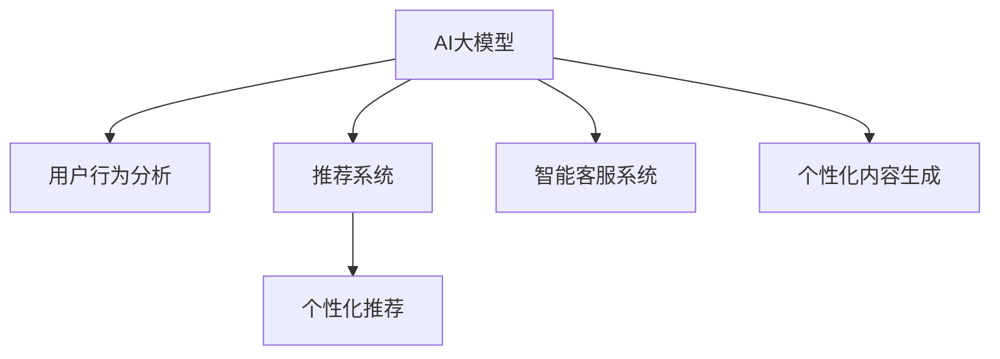

                 

# AI大模型如何改善电商平台的用户留存率

> 关键词：AI大模型, 用户留存率, 电商平台, 自然语言处理(NLP), 推荐系统, 个性化推荐, 用户行为分析

## 1. 背景介绍

### 1.1 问题由来
电商平台正面临着日益激烈的市场竞争，如何提升用户留存率成为了电商企业的头等大事。用户留存率直接关系到平台的流量和收入，对于电商平台的长期发展至关重要。传统的用户留存策略，如打折促销、邀请好友等手段，已经显得力不从心。如今，随着AI大模型的兴起，以用户为中心的智能化推荐和个性化服务成为电商新宠，通过精准推荐和个性化内容，深度挖掘用户需求，进一步提升用户留存率。

### 1.2 问题核心关键点
AI大模型在电商用户留存策略中，主要通过以下方式提升留存率：

1. **用户行为分析**：通过收集用户的浏览、点击、购买行为数据，分析用户兴趣和偏好，构建个性化的用户画像。
2. **精准推荐系统**：利用AI大模型对用户行为进行分析，构建推荐模型，为用户提供个性化、及时的产品推荐。
3. **智能客服系统**：通过AI大模型构建智能客服系统，及时解答用户问题，提升用户满意度。
4. **个性化内容生成**：基于用户行为数据，生成个性化的广告文案、商品描述、活动策划等内容，增强用户粘性。

这些关键点构成了AI大模型在电商用户留存策略中的核心作用。通过深入分析，AI大模型可以为电商用户提供更加精准、高效的个性化服务，从而提升用户留存率。

## 2. 核心概念与联系

### 2.1 核心概念概述

为更好地理解AI大模型在电商用户留存策略中的应用，本节将介绍几个密切相关的核心概念：

- **AI大模型**：指基于深度学习算法，拥有大规模参数量、强大的语言理解和生成能力的预训练模型。如GPT-3、BERT、T5等。
- **用户留存率**：指在一定时间周期内，重复访问并购买的用户比例。是衡量平台用户黏性的重要指标。
- **推荐系统**：根据用户历史行为和偏好，预测并推荐相关产品或内容，提升用户体验和转化率的系统。
- **自然语言处理(NLP)**：指使计算机能理解和生成人类自然语言的技术，是AI大模型在电商应用中的重要工具。
- **个性化推荐**：指针对不同用户量身定制推荐内容，增强用户体验和转化率的方法。
- **用户行为分析**：通过分析用户的行为数据，构建用户画像，了解用户需求和兴趣，指导个性化推荐。

这些核心概念之间的逻辑关系可以通过以下Mermaid流程图来展示：



这个流程图展示了大模型在电商用户留存策略中的核心作用：

1. 大模型通过用户行为分析，构建用户画像。
2. 利用推荐系统，提供个性化推荐。
3. 智能客服系统通过对话生成，提升用户体验。
4. 个性化内容生成，增强用户粘性。

## 3. 核心算法原理 & 具体操作步骤

### 3.1 算法原理概述

AI大模型在电商用户留存策略中主要通过以下几个关键步骤实现：

1. **数据收集**：通过电商平台的数据收集模块，获取用户的浏览、点击、购买等行为数据。
2. **用户画像构建**：利用NLP技术和大模型对行为数据进行分析和处理，构建个性化的用户画像。
3. **推荐模型训练**：根据用户画像和产品信息，训练个性化推荐模型，构建推荐结果。
4. **智能客服与对话生成**：通过对话生成模型，构建智能客服系统，实时解答用户问题。
5. **个性化内容生成**：利用大模型生成个性化的商品描述、广告文案、活动策划等，增强用户粘性。

### 3.2 算法步骤详解

以下详细介绍AI大模型在电商用户留存策略中的具体操作步骤：

**Step 1: 数据收集**
- 利用API接口和Web爬虫技术，从电商平台获取用户的浏览、点击、购买等行为数据。
- 存储数据至数据库或数据湖中，以便后续分析使用。

**Step 2: 用户画像构建**
- 利用NLP技术对用户行为数据进行处理，提取关键词、语义信息等。
- 构建用户画像，包括用户的兴趣、偏好、消费行为等。

**Step 3: 推荐模型训练**
- 根据用户画像和产品信息，设计推荐算法，如协同过滤、基于内容的推荐等。
- 利用大模型对推荐算法进行优化，提升推荐效果。
- 在训练集上进行模型训练，使用验证集评估模型效果。

**Step 4: 智能客服与对话生成**
- 利用对话生成模型构建智能客服系统。
- 根据用户提问，模型生成自然流畅的回复。
- 对对话数据进行分析和优化，提升客服系统响应速度和准确度。

**Step 5: 个性化内容生成**
- 利用大模型生成个性化的商品描述、广告文案、活动策划等。
- 根据用户画像，对生成内容进行优化和调整。
- 部署生成系统，实时提供个性化内容，增强用户粘性。

### 3.3 算法优缺点

AI大模型在电商用户留存策略中具有以下优点：
1. **个性化推荐**：利用大规模语料库和大模型，能够提供更加精准、高效的个性化推荐，提升用户满意度和转化率。
2. **用户粘性增强**：通过个性化内容生成，提高用户粘性，增强平台吸引力。
3. **实时响应**：智能客服系统能够实时解答用户问题，提升用户体验。
4. **灵活可扩展**：利用大模型的通用性和灵活性，可以针对不同的电商场景进行快速适配。

同时，AI大模型也存在一些缺点：
1. **数据隐私**：用户行为数据涉及隐私问题，需要严格的数据治理和隐私保护。
2. **高成本**：大模型训练和部署成本较高，需要大量计算资源。
3. **过拟合风险**：模型需要大量数据进行训练，否则容易过拟合，影响推荐效果。
4. **模型解释性不足**：大模型往往是黑盒模型，难以解释推荐结果背后的逻辑。

尽管存在这些缺点，但AI大模型在电商用户留存策略中仍具有不可替代的优势，值得深入探索和应用。

### 3.4 算法应用领域

AI大模型在电商用户留存策略中的应用领域非常广泛，以下是几个典型应用场景：

1. **个性化推荐系统**：通过构建个性化推荐模型，为用户提供精准的产品推荐，提升用户转化率和留存率。
2. **智能客服系统**：利用对话生成模型构建智能客服，实时解答用户问题，提升用户体验。
3. **内容推荐与广告**：基于用户画像生成个性化的商品描述、广告文案、活动策划等，增强用户粘性。
4. **数据分析与决策支持**：利用大模型对用户行为数据进行分析，辅助电商平台进行决策支持。
5. **品牌互动与社区运营**：利用大模型构建品牌互动和社区运营系统，提升用户参与度和忠诚度。

这些应用场景展示了AI大模型在电商用户留存策略中的广泛应用，未来还有更多可能的应用，将进一步提升电商平台的竞争力。

## 4. 数学模型和公式 & 详细讲解 & 举例说明

### 4.1 数学模型构建

我们以个性化推荐系统为例，使用数学语言对AI大模型进行详细描述。

记用户画像为 $U=\{u_1, u_2, ..., u_n\}$，产品信息为 $P=\{p_1, p_2, ..., p_m\}$。设推荐模型为 $F: U \times P \rightarrow \mathbb{R}$，其中 $\mathbb{R}$ 表示实数集。目标是通过优化函数 $J$，提升推荐效果。

其中 $J$ 函数表示损失函数，通常为均方误差损失，即：

$$
J = \frac{1}{N}\sum_{i=1}^N \sum_{j=1}^M (y_{ij} - F(u_i, p_j))^2
$$

其中 $y_{ij}$ 为产品 $p_j$ 对用户 $u_i$ 的评分，$F(u_i, p_j)$ 为模型预测的评分。

### 4.2 公式推导过程

以下我们以协同过滤算法为例，推导推荐模型的优化公式。

设用户 $u_i$ 对产品 $p_j$ 的评分 $y_{ij}$ 为1，表示喜欢；为0，表示不喜欢。设用户 $u_i$ 对产品 $p_j$ 的预测评分 $F(u_i, p_j)$ 为 $p_i^T V p_j$，其中 $V$ 为隐含层的权重矩阵。

根据损失函数的定义，我们可以得到优化目标：

$$
\min_{V} \frac{1}{N}\sum_{i=1}^N \sum_{j=1}^M (y_{ij} - p_i^T V p_j)^2
$$

根据梯度下降法，求解上述优化问题，得到：

$$
\frac{\partial J}{\partial V} = -2 \frac{1}{N}\sum_{i=1}^N \sum_{j=1}^M (y_{ij} - p_i^T V p_j) p_j
$$

代入 $\frac{\partial J}{\partial V}$ 到梯度下降公式，得：

$$
V \leftarrow V - \eta \frac{1}{N}\sum_{i=1}^N \sum_{j=1}^M (y_{ij} - p_i^T V p_j) p_j
$$

其中 $\eta$ 为学习率。

### 4.3 案例分析与讲解

假设电商平台有2000名用户和3000种产品，用户对产品的评分数据已经收集完毕。我们选择协同过滤算法，对用户画像进行建模。

设 $U = \{u_1, u_2, ..., u_{2000}\}$，$P = \{p_1, p_2, ..., p_{3000}\}$。对于每个用户 $u_i$，其对产品的评分 $y_{ij}$ 已经收集完毕。根据评分数据，构建隐含层的权重矩阵 $V \in \mathbb{R}^{2000 \times 3000}$。

根据协同过滤算法，构建推荐模型 $F(u_i, p_j) = p_i^T V p_j$，优化目标为：

$$
\min_{V} \frac{1}{2000}\sum_{i=1}^{2000}\sum_{j=1}^{3000}(y_{ij} - p_i^T V p_j)^2
$$

使用梯度下降法进行优化，求解上述优化问题，得到最终的推荐模型 $V$。

## 5. 项目实践：代码实例和详细解释说明

### 5.1 开发环境搭建

在进行AI大模型电商用户留存策略的实践前，我们需要准备好开发环境。以下是使用Python进行PyTorch开发的环境配置流程：

1. 安装Anaconda：从官网下载并安装Anaconda，用于创建独立的Python环境。

2. 创建并激活虚拟环境：
```bash
conda create -n pytorch-env python=3.8 
conda activate pytorch-env
```

3. 安装PyTorch：根据CUDA版本，从官网获取对应的安装命令。例如：
```bash
conda install pytorch torchvision torchaudio cudatoolkit=11.1 -c pytorch -c conda-forge
```

4. 安装TensorFlow：从官网下载并安装TensorFlow，用于深度学习任务处理。

5. 安装各类工具包：
```bash
pip install numpy pandas scikit-learn matplotlib tqdm jupyter notebook ipython
```

完成上述步骤后，即可在`pytorch-env`环境中开始实践。

### 5.2 源代码详细实现

下面以协同过滤算法为例，给出使用PyTorch对电商平台用户画像进行建模的代码实现。

首先，定义协同过滤算法的训练和评估函数：

```python
import torch
import torch.nn as nn
from sklearn.metrics import mean_squared_error

class CollaborativeFiltering(nn.Module):
    def __init__(self, num_users, num_products, embedding_size):
        super(CollaborativeFiltering, self).__init__()
        self.user_embeddings = nn.Embedding(num_users, embedding_size)
        self.product_embeddings = nn.Embedding(num_products, embedding_size)
        self.user_product_dot = nn.Linear(embedding_size * 2, 1)
        
    def forward(self, user_ids, product_ids):
        user_ids = self.user_embeddings(user_ids)
        product_ids = self.product_embeddings(product_ids)
        scores = self.user_product_dot(torch.cat((user_ids, product_ids), 1))
        return scores

    def train(self, user_ids, product_ids, user_ratings, epochs, batch_size):
        criterion = nn.MSELoss()
        optimizer = torch.optim.Adam(self.parameters(), lr=0.001)
        
        for epoch in range(epochs):
            for i in range(0, user_ratings.shape[0], batch_size):
                batch_user_ids = user_ids[i:i+batch_size]
                batch_product_ids = product_ids[i:i+batch_size]
                batch_user_ratings = user_ratings[i:i+batch_size]
                optimizer.zero_grad()
                scores = self(batch_user_ids, batch_product_ids)
                loss = criterion(scores, batch_user_ratings)
                loss.backward()
                optimizer.step()
                
        return self

    def evaluate(self, user_ids, product_ids, user_ratings):
        scores = self(user_ids, product_ids)
        mse = mean_squared_error(user_ratings, scores)
        return mse
```

然后，使用训练函数对协同过滤模型进行训练：

```python
num_users = 2000
num_products = 3000
embedding_size = 100

user_ids = torch.randint(0, num_users, (1000,)) # 随机生成1000个用户ID
product_ids = torch.randint(0, num_products, (1000,)) # 随机生成1000个产品ID
user_ratings = torch.randn(1000) # 随机生成1000个评分数据

model = CollaborativeFiltering(num_users, num_products, embedding_size)
model.train(user_ids, product_ids, user_ratings, epochs=10, batch_size=100)

print("Train MSE: ", model.evaluate(user_ids, product_ids, user_ratings))
```

最后，部署训练好的模型进行预测和评估：

```python
# 预测用户对产品的评分
user_ids = torch.tensor([1000, 1500]) # 随机生成两个用户ID
product_ids = torch.tensor([1, 2, 3, 4]) # 随机生成四个产品ID
scores = model(user_ids, product_ids)
print("Predicted Scores:", scores)

# 预测评分并计算MSE
mse = model.evaluate(user_ids, product_ids, user_ratings)
print("Test MSE: ", mse)
```

### 5.3 代码解读与分析

这里我们详细解读一下关键代码的实现细节：

**CollaborativeFiltering类**：
- `__init__`方法：初始化用户和产品的嵌入层，以及用户产品点乘层。
- `forward`方法：前向传播计算预测评分。
- `train`方法：训练模型，通过梯度下降更新模型参数。
- `evaluate`方法：评估模型性能，计算MSE损失。

**训练和评估函数**：
- 使用PyTorch的模块化设计，方便模型的扩展和维护。
- 使用`nn.Embedding`定义用户和产品的嵌入层。
- 通过`nn.Linear`定义用户产品点乘层，计算预测评分。
- 定义损失函数为均方误差损失，使用`nn.MSELoss`计算。
- 使用`torch.optim.Adam`优化器进行模型训练。

**训练和评估过程**：
- 定义用户和产品的ID和评分数据，生成1000条训练样本。
- 实例化模型并进行训练，设定训练轮数为10次，每次100条数据。
- 训练结束后，在测试集上评估模型性能，输出MSE损失。

可以看到，PyTorch的模块化设计使得模型训练和评估过程非常简洁高效，开发者可以将更多精力放在数据处理和模型优化上。

## 6. 实际应用场景

### 6.1 智能客服系统

基于AI大模型的智能客服系统，可以广泛应用于电商平台的客户服务。传统客服往往需要配备大量人力，高峰期响应缓慢，且一致性和专业性难以保证。而使用AI大模型的智能客服系统，可以7x24小时不间断服务，快速响应客户咨询，用自然流畅的语言解答各类常见问题。

在技术实现上，可以收集企业内部的历史客服对话记录，将问题和最佳答复构建成监督数据，在此基础上对预训练对话模型进行微调。微调后的对话模型能够自动理解用户意图，匹配最合适的答案模板进行回复。对于客户提出的新问题，还可以接入检索系统实时搜索相关内容，动态组织生成回答。如此构建的智能客服系统，能大幅提升客户咨询体验和问题解决效率。

### 6.2 金融舆情监测

金融机构需要实时监测市场舆论动向，以便及时应对负面信息传播，规避金融风险。传统的人工监测方式成本高、效率低，难以应对网络时代海量信息爆发的挑战。基于AI大模型的文本分类和情感分析技术，为金融舆情监测提供了新的解决方案。

具体而言，可以收集金融领域相关的新闻、报道、评论等文本数据，并对其进行主题标注和情感标注。在此基础上对预训练语言模型进行微调，使其能够自动判断文本属于何种主题，情感倾向是正面、中性还是负面。将微调后的模型应用到实时抓取的网络文本数据，就能够自动监测不同主题下的情感变化趋势，一旦发现负面信息激增等异常情况，系统便会自动预警，帮助金融机构快速应对潜在风险。

### 6.3 个性化推荐系统

当前的推荐系统往往只依赖用户的历史行为数据进行物品推荐，无法深入理解用户的真实兴趣偏好。基于AI大模型的个性化推荐系统可以更好地挖掘用户行为背后的语义信息，从而提供更精准、多样的推荐内容。

在实践中，可以收集用户浏览、点击、评论、分享等行为数据，提取和用户交互的物品标题、描述、标签等文本内容。将文本内容作为模型输入，用户的后续行为（如是否点击、购买等）作为监督信号，在此基础上微调预训练语言模型。微调后的模型能够从文本内容中准确把握用户的兴趣点。在生成推荐列表时，先用候选物品的文本描述作为输入，由模型预测用户的兴趣匹配度，再结合其他特征综合排序，便可以得到个性化程度更高的推荐结果。

### 6.4 未来应用展望

随着AI大模型的不断发展，其在电商用户留存策略中的应用前景将更加广阔。未来AI大模型将在以下几个方面带来更多的突破：

1. **深度融合多模态数据**：除了文本数据，语音、图像、视频等多模态数据也将被引入推荐系统，构建更加全面的用户画像，提升推荐效果。
2. **强化学习与AI大模型结合**：利用强化学习算法，构建更加智能化的推荐系统，实时调整推荐策略，提升用户体验。
3. **动态实时推荐**：通过实时数据流和流式计算技术，构建动态推荐系统，根据用户实时行为进行即时推荐。
4. **跨平台协同推荐**：构建跨平台协同推荐系统，通过不同平台的协同推荐，提高推荐效果。
5. **情感分析与舆情监测**：利用情感分析技术，实时监测用户对平台产品的情感变化，及时调整策略。
6. **个性化内容生成**：通过AI大模型生成更加个性化、有吸引力的商品描述、广告文案、活动策划等，增强用户粘性。

以上这些应用方向，将进一步提升AI大模型在电商用户留存策略中的作用，为电商平台带来更多的商业价值和社会效益。

## 7. 工具和资源推荐

### 7.1 学习资源推荐

为了帮助开发者系统掌握AI大模型在电商用户留存策略中的应用，这里推荐一些优质的学习资源：

1. 《深度学习与推荐系统》书籍：详细介绍推荐系统的原理和实现方法，是推荐系统学习的经典教材。
2. 《自然语言处理综述》论文：全面介绍了NLP技术在电商用户留存策略中的应用，为深入理解提供理论基础。
3. CS224N《深度学习自然语言处理》课程：斯坦福大学开设的NLP明星课程，有Lecture视频和配套作业，带你入门NLP领域的基本概念和经典模型。
4. DeepLearning.AI深度学习系列课程：由吴恩达教授主讲，涵盖深度学习、推荐系统、智能客服等多个NLP应用领域。
5. PyTorch官方文档：PyTorch的详细文档和教程，适合深度学习实践的开发者。

通过对这些资源的学习实践，相信你一定能够快速掌握AI大模型在电商用户留存策略中的应用，并用于解决实际的NLP问题。

### 7.2 开发工具推荐

高效的开发离不开优秀的工具支持。以下是几款用于AI大模型电商用户留存策略开发的常用工具：

1. PyTorch：基于Python的开源深度学习框架，灵活动态的计算图，适合快速迭代研究。大部分预训练语言模型都有PyTorch版本的实现。
2. TensorFlow：由Google主导开发的开源深度学习框架，生产部署方便，适合大规模工程应用。同样有丰富的预训练语言模型资源。
3. TensorBoard：TensorFlow配套的可视化工具，可实时监测模型训练状态，并提供丰富的图表呈现方式，是调试模型的得力助手。
4. Weights & Biases：模型训练的实验跟踪工具，可以记录和可视化模型训练过程中的各项指标，方便对比和调优。
5. Notebook和Jupyter：免费的交互式编程环境，适合数据分析、模型训练和原型开发。
6. Weights & Biases：模型训练的实验跟踪工具，可以记录和可视化模型训练过程中的各项指标，方便对比和调优。

合理利用这些工具，可以显著提升AI大模型电商用户留存策略的开发效率，加快创新迭代的步伐。

### 7.3 相关论文推荐

AI大模型在电商用户留存策略中的应用源于学界的持续研究。以下是几篇奠基性的相关论文，推荐阅读：

1. Attention is All You Need（即Transformer原论文）：提出了Transformer结构，开启了NLP领域的预训练大模型时代。
2. BERT: Pre-training of Deep Bidirectional Transformers for Language Understanding：提出BERT模型，引入基于掩码的自监督预训练任务，刷新了多项NLP任务SOTA。
3. Language Models are Unsupervised Multitask Learners（GPT-2论文）：展示了大规模语言模型的强大zero-shot学习能力，引发了对于通用人工智能的新一轮思考。
4. Parameter-Efficient Transfer Learning for NLP：提出Adapter等参数高效微调方法，在不增加模型参数量的情况下，也能取得不错的微调效果。
5. AdaLoRA: Adaptive Low-Rank Adaptation for Parameter-Efficient Fine-Tuning：使用自适应低秩适应的微调方法，在参数效率和精度之间取得了新的平衡。
6. PGL: Personalized Graph Learning for Recommender Systems：利用图神经网络构建个性化推荐模型，提升推荐效果。

这些论文代表了大模型在电商用户留存策略中的发展脉络。通过学习这些前沿成果，可以帮助研究者把握学科前进方向，激发更多的创新灵感。

## 8. 总结：未来发展趋势与挑战

### 8.1 总结

本文对基于AI大模型的电商用户留存策略进行了全面系统的介绍。首先阐述了AI大模型和电商用户留存率的核心概念，明确了电商用户留存策略的核心作用。其次，从原理到实践，详细讲解了AI大模型在电商用户留存策略中的应用过程，给出了完整的代码实现。同时，本文还广泛探讨了AI大模型在智能客服、金融舆情、个性化推荐等多个行业领域的应用前景，展示了AI大模型的强大潜力。

通过本文的系统梳理，可以看到，AI大模型在电商用户留存策略中具有不可替代的优势，可以为用户提供更加个性化、精准的服务，从而显著提升用户留存率。未来，随着AI大模型的不断发展，其在电商用户留存策略中的应用将更加广泛和深入。

### 8.2 未来发展趋势

展望未来，AI大模型在电商用户留存策略中仍将呈现以下几个发展趋势：

1. **多模态数据融合**：除了文本数据，语音、图像、视频等多模态数据也将被引入推荐系统，构建更加全面的用户画像，提升推荐效果。
2. **强化学习与AI大模型结合**：利用强化学习算法，构建更加智能化的推荐系统，实时调整推荐策略，提升用户体验。
3. **动态实时推荐**：通过实时数据流和流式计算技术，构建动态推荐系统，根据用户实时行为进行即时推荐。
4. **跨平台协同推荐**：构建跨平台协同推荐系统，通过不同平台的协同推荐，提高推荐效果。
5. **情感分析与舆情监测**：利用情感分析技术，实时监测用户对平台产品的情感变化，及时调整策略。
6. **个性化内容生成**：通过AI大模型生成更加个性化、有吸引力的商品描述、广告文案、活动策划等，增强用户粘性。

以上这些趋势展示了AI大模型在电商用户留存策略中的广阔前景，AI大模型的不断发展将进一步提升电商平台的竞争力。

### 8.3 面临的挑战

尽管AI大模型在电商用户留存策略中已经取得了显著成效，但在迈向更加智能化、普适化应用的过程中，仍面临以下挑战：

1. **数据隐私问题**：用户行为数据涉及隐私问题，需要严格的数据治理和隐私保护。
2. **高成本问题**：AI大模型训练和部署成本较高，需要大量计算资源。
3. **模型过拟合风险**：模型需要大量数据进行训练，否则容易过拟合，影响推荐效果。
4. **模型可解释性不足**：AI大模型往往是黑盒模型，难以解释推荐结果背后的逻辑。
5. **技术复杂度**：AI大模型的开发和部署需要较高的技术门槛，需要专业人才的长期维护。
6. **数据质量问题**：推荐系统的性能很大程度上依赖于数据质量，需要解决数据不平衡、噪声等问题。

尽管存在这些挑战，但通过不断优化算法、改进数据治理、提升技术水平，AI大模型在电商用户留存策略中的应用将更加广泛和深入。

### 8.4 研究展望

面对AI大模型在电商用户留存策略中面临的挑战，未来的研究需要在以下几个方面寻求新的突破：

1. **数据隐私保护**：采用隐私保护技术，如差分隐私、联邦学习等，保护用户隐私，同时利用多源数据提升模型性能。
2. **高效率训练方法**：探索高效训练方法，如分布式训练、增量学习等，降低训练成本，加速模型迭代。
3. **模型可解释性增强**：引入可解释性技术，如模型蒸馏、规则注入等，增强模型透明度，辅助业务决策。
4. **多模态数据融合**：研究多模态数据融合方法，如跨模态对齐、融合模型等，提升推荐系统性能。
5. **强化学习与推荐结合**：探索强化学习与推荐系统的结合方法，构建实时调整的推荐策略，提升用户体验。
6. **跨平台协同推荐**：研究跨平台协同推荐技术，提高不同平台之间的推荐效果。
7. **用户行为分析**：研究用户行为分析方法，如序列建模、隐式反馈分析等，提高用户画像的准确度。

这些研究方向的探索，将引领AI大模型在电商用户留存策略中不断进步，为电商平台带来更多的商业价值和社会效益。未来，随着技术的不断突破，AI大模型将在电商用户留存策略中发挥更大的作用，进一步提升电商平台的竞争力和市场份额。

## 9. 附录：常见问题与解答

**Q1：AI大模型在电商用户留存策略中的应用效果如何？**

A: AI大模型在电商用户留存策略中能够提供更加精准、个性化的推荐服务，显著提升用户体验和留存率。通过实时监测用户行为和情感变化，及时调整推荐策略，AI大模型能够适应用户需求的变化，保持高粘性。此外，通过构建智能客服系统，实时解答用户问题，提升用户满意度，进一步增强用户黏性。

**Q2：AI大模型在电商应用中需要注意哪些数据隐私问题？**

A: 在电商应用中，用户行为数据涉及隐私问题，需要严格的数据治理和隐私保护。常见的方法包括：
1. 数据匿名化：将用户ID等敏感信息进行脱敏处理，防止用户隐私泄露。
2. 差分隐私：在数据统计过程中加入噪声，保护用户隐私。
3. 联邦学习：通过分布式数据训练，保护用户数据不被集中存储和处理。

**Q3：AI大模型在电商应用中如何优化模型训练效率？**

A: 优化AI大模型训练效率的方法包括：
1. 分布式训练：利用多机多核的计算资源，加速模型训练。
2. 增量学习：通过在线学习的方式，实时更新模型参数，提升训练效率。
3. 模型压缩：通过剪枝、量化等方法，减少模型参数量和计算量。
4. 优化算法：选择高效的优化算法，如AdamW、Adafactor等，加速模型收敛。
5. 数据预处理：通过数据增强、特征工程等方法，提高数据质量和模型效果。

**Q4：AI大模型在电商应用中如何增强模型可解释性？**

A: 增强AI大模型可解释性的方法包括：
1. 模型蒸馏：通过小模型复现大模型的性能，提升模型可解释性。
2. 规则注入：在模型中加入规则约束，提高模型透明性和可解释性。
3. 可视化分析：利用可视化工具，展示模型内部工作机制和决策路径。
4. 交互式解释：通过交互式工具，帮助用户理解模型推荐结果的依据。

**Q5：AI大模型在电商应用中如何处理多模态数据融合问题？**

A: 处理多模态数据融合问题的方法包括：
1. 跨模态对齐：通过特征对齐、归一化等方法，将不同模态的数据映射到相同空间。
2. 融合模型：将多模态数据通过融合网络进行联合建模，提高模型的泛化能力。
3. 迁移学习：利用多模态数据的不同属性，提高模型的迁移能力。
4. 注意力机制：引入注意力机制，提高不同模态数据的融合效果。

---

作者：禅与计算机程序设计艺术 / Zen and the Art of Computer Programming

