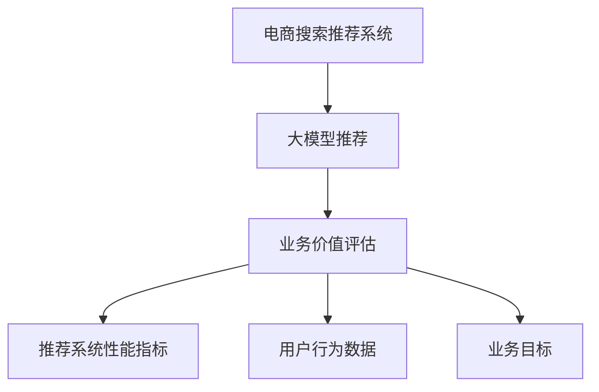

                 

# AI大模型视角下电商搜索推荐的业务价值评估方法

> 关键词：大模型，电商搜索推荐，业务价值评估，深度学习，推荐系统，商品召回，用户体验，算法优化

## 1. 背景介绍

### 1.1 问题由来
电商行业是互联网经济的重要组成部分，以亚马逊、淘宝、京东为代表的大型电商平台已经成为了全球领先的零售巨头。随着市场的不断拓展和用户需求的日益丰富，电商平台的业务模式和服务内容也在不断演化。搜索推荐系统作为电商用户交互的核心组成部分，已经成为了平台获取流量、提升用户满意度、增加转化率的重要手段。

### 1.2 问题核心关键点
在电商搜索推荐系统中，用户输入查询词后，系统需要从海量商品数据中快速筛选出最相关的商品并展示给用户。传统的基于规则、关键词匹配的方法往往难以适应长尾商品的推荐需求，且无法捕捉用户真实的搜索意图和偏好。而基于深度学习的大模型推荐方法，通过学习和理解用户的长期行为数据，能够提供更加个性化、多样化的商品推荐，大幅提升用户体验和平台收益。

大模型推荐方法的核心在于如何评估推荐系统的业务价值。业务价值评估不仅关系到推荐系统的优化方向和目标设定，也是平台投资资源，实现商业化运营的基础。然而，如何科学地评估大模型推荐系统的业务价值，仍然是一个复杂且亟待解决的问题。

### 1.3 问题研究意义
深入研究AI大模型推荐系统的业务价值评估方法，对于电商平台优化推荐算法，提升用户体验和业务效率，具有重要意义：

1. **指导算法优化**：明确推荐系统的业务目标和关键指标，帮助算法工程师设计更高效、更精准的推荐模型。
2. **评估系统效果**：通过科学的业务价值评估方法，对推荐系统进行全面的评估，及时发现系统性能瓶颈。
3. **决策支持**：基于业务价值评估结果，为产品团队提供数据支持，优化资源分配，实现商业目标。
4. **提升用户体验**：优化推荐算法，提供更个性化、更高效的推荐服务，提升用户满意度和平台黏性。
5. **增强商业化能力**：通过评估推荐系统的业务价值，驱动电商平台的商业化运营策略，实现流量和收益的持续增长。

## 2. 核心概念与联系

### 2.1 核心概念概述

为更好地理解电商搜索推荐系统的业务价值评估方法，本节将介绍几个关键概念及其联系：

- **电商搜索推荐系统**：电商平台的核心功能之一，通过学习和理解用户的搜索行为和商品数据，向用户推荐最相关的商品，提升用户体验和平台收益。

- **大模型推荐**：基于深度学习的大模型，通过学习大量用户行为数据，捕捉用户长期偏好和行为规律，生成更加个性化、多样化的推荐结果。

- **业务价值评估**：通过科学合理的指标体系，量化评估推荐系统的性能和效果，指导算法优化和资源配置。

- **推荐系统性能指标**：包括点击率(CTR)、转化率(CVR)、用户满意度、用户体验等，用于评估推荐系统的效果和价值。

- **用户行为数据**：包括用户的浏览、点击、购买等行为数据，是推荐系统进行个性化推荐的基础。

- **业务目标**：包括流量获取、用户转化、销售额提升等，是推荐系统优化和评估的核心目标。

这些概念之间的逻辑关系可以通过以下Mermaid流程图来展示：



这个流程图展示了大模型推荐、业务价值评估、推荐系统性能指标、用户行为数据和业务目标之间的逻辑关系：

1. 电商平台通过大模型推荐技术，提升用户推荐体验和平台收益。
2. 业务价值评估通过评估推荐系统性能指标，量化推荐系统的效果。
3. 用户行为数据是评估推荐系统业务价值的重要依据。
4. 业务目标指导推荐系统的优化方向和目标设定。

## 3. 核心算法原理 & 具体操作步骤
### 3.1 算法原理概述

AI大模型推荐系统的业务价值评估，本质上是一个多目标优化问题。其核心思想是通过评估推荐系统在业务目标上的实际表现，量化系统的业务价值，并指导后续的算法优化和资源配置。

假设推荐系统的主要业务目标为流量获取和用户转化，用 $R_F$ 和 $R_C$ 表示流量获取率和用户转化率，业务价值评估公式为：

$$
V = \omega_F \cdot R_F + \omega_C \cdot R_C
$$

其中，$\omega_F$ 和 $\omega_C$ 分别为流量获取率和用户转化率的权重系数，可以根据具体的业务需求和目标设定进行调整。

推荐系统的业务价值评估过程，包括以下几个关键步骤：

1. **数据收集与处理**：收集电商平台的搜索、点击、购买等用户行为数据，并进行预处理和特征工程，形成可用的数据集。
2. **模型训练与验证**：训练大模型推荐系统，并使用验证集进行性能评估，优化模型参数。
3. **业务指标评估**：使用业务价值评估公式计算推荐系统的业务价值，评估其在不同业务目标上的表现。
4. **算法优化与迭代**：根据业务价值评估结果，优化推荐算法，提升系统性能。

### 3.2 算法步骤详解

基于以上原理，本节将详细介绍业务价值评估的详细步骤：

**Step 1: 数据收集与处理**

电商平台的推荐系统需要收集以下几类用户行为数据：

- 用户搜索历史：记录用户的搜索词、时间、频次等信息。
- 用户点击历史：记录用户对搜索结果的点击行为，包括点击时间、位置、持续时间等。
- 用户购买历史：记录用户的购买行为，包括购买时间、商品ID、价格等信息。
- 用户浏览历史：记录用户对商品详情页的浏览行为，包括浏览时间、位置、持续时间等。

通过这些行为数据，可以形成用户行为数据集 $D = \{(x_i, y_i)\}_{i=1}^N$，其中 $x_i$ 表示用户行为特征，$y_i$ 表示行为结果（如是否点击、是否购买）。

**Step 2: 模型训练与验证**

选择合适的大模型作为推荐系统的基础，如Transformer、BERT等。在大规模预训练语料上进行预训练，然后在电商平台的标注数据上进行微调。微调的目标是使模型能够预测用户的行为，从而生成个性化推荐。

微调的超参数包括学习率、批大小、迭代轮数等，需要根据具体的任务和数据集进行调整。在微调过程中，可以使用交叉验证等方法，评估模型的性能。

**Step 3: 业务指标评估**

根据电商平台的业务目标，定义业务价值评估指标。常用的指标包括：

- 点击率(CTR)：用户对推荐商品进行点击的比例，衡量推荐的相关性和吸引力。
- 转化率(CVR)：用户对推荐商品进行购买的比例，衡量推荐的实际转化效果。
- 平均点击次数(ACP)：用户对推荐商品进行点击的平均次数，衡量推荐的覆盖面。
- 平均浏览时长(ABT)：用户对推荐商品进行浏览的平均时长，衡量推荐的吸引力。
- 用户满意度(USAT)：用户对推荐结果的满意度评分，衡量推荐的用户体验。

使用上述指标计算推荐系统的业务价值 $V$，公式如下：

$$
V = \omega_F \cdot CTR + \omega_C \cdot CVR
$$

其中，$\omega_F$ 和 $\omega_C$ 为权重系数，需要根据实际业务需求进行设定。

**Step 4: 算法优化与迭代**

根据业务价值评估结果，识别推荐系统性能瓶颈和优化方向，进行算法优化和参数调整。具体优化措施包括：

- 调整模型参数：如学习率、批大小、迭代轮数等，提升模型性能。
- 改进特征工程：如特征选择、数据增强、对抗训练等，增强推荐系统性能。
- 优化推荐策略：如动态调整商品权重、引入多模态信息等，提升推荐效果。

优化过程可以通过A/B测试等方法，比较不同策略的效果，选取最优方案。

### 3.3 算法优缺点

大模型推荐系统业务价值评估方法具有以下优点：

1. **全面量化评估**：通过多目标优化，全面量化评估推荐系统的业务价值，指导算法优化和资源配置。
2. **数据驱动决策**：利用用户行为数据，驱动推荐系统的优化和决策，提升用户体验和平台收益。
3. **动态调整策略**：可以根据业务目标的变化，动态调整推荐策略，保持推荐系统的高效性和适应性。

同时，该方法也存在一定的局限性：

1. **模型复杂度高**：大模型推荐系统通常需要处理海量数据，模型复杂度较高，对算力和存储要求较高。
2. **数据质量依赖**：业务价值评估结果高度依赖于用户行为数据的准确性和完整性，数据质量问题可能影响评估结果。
3. **模型泛化能力不足**：当推荐系统面临新的数据分布时，模型的泛化能力可能不足，影响推荐效果。
4. **优化成本高**：算法优化和模型训练通常需要大量的计算资源和时间，优化成本较高。

尽管存在这些局限性，但该方法仍是大模型推荐系统应用中最主流和有效的评估方式之一。未来相关研究的方向包括如何降低模型复杂度，提升数据质量和泛化能力，以及优化算法训练过程，以实现更高效率的业务价值评估。

### 3.4 算法应用领域

大模型推荐系统的业务价值评估方法，在电商搜索推荐系统、视频推荐系统、新闻推荐系统等众多推荐场景中都有广泛应用，为各类推荐系统提供了科学合理的评估手段。

- **电商搜索推荐**：在电商平台中，通过评估推荐系统的点击率和转化率，指导算法优化，提升用户转化和平台收益。
- **视频推荐**：在视频平台中，通过评估推荐系统的观看率和互动率，优化推荐算法，提升用户粘性和平台流量。
- **新闻推荐**：在新闻平台中，通过评估推荐系统的阅读量和点击量，优化推荐策略，提升用户阅读体验和平台曝光率。

此外，在社交推荐、音乐推荐、游戏推荐等场景中，大模型推荐系统的业务价值评估方法同样具有广泛的应用前景。

## 4. 数学模型和公式 & 详细讲解 & 举例说明
### 4.1 数学模型构建

本节将使用数学语言对电商搜索推荐系统的大模型推荐和业务价值评估过程进行严格的刻画。

假设电商平台的大模型推荐系统为 $M_{\theta}$，其中 $\theta$ 为模型参数。假设电商平台的主要业务目标为流量获取和用户转化，用 $R_F$ 和 $R_C$ 表示流量获取率和用户转化率，业务价值评估公式为：

$$
V = \omega_F \cdot R_F + \omega_C \cdot R_C
$$

其中，$\omega_F$ 和 $\omega_C$ 分别为流量获取率和用户转化率的权重系数，可以根据具体的业务需求和目标设定进行调整。

推荐系统的主要业务目标和关键指标如下：

- 流量获取目标：最大化推荐系统的点击率 $R_F$，表示推荐系统能够获取的最大流量。
- 用户转化目标：最大化推荐系统的转化率 $R_C$，表示推荐系统能够转化的最大用户。

### 4.2 公式推导过程

以下我们以电商搜索推荐系统为例，推导点击率和转化率的计算公式。

假设电商平台有 $N$ 个商品，每个商品 $i$ 的特征表示为 $x_i$，模型预测的点击概率为 $\hat{p}_i$，实际点击次数为 $y_i$，则点击率 $R_F$ 的计算公式为：

$$
R_F = \frac{1}{N} \sum_{i=1}^N \frac{y_i}{\hat{p}_i}
$$

假设推荐系统推荐了 $K$ 个商品给用户，每个商品 $i$ 的转化概率为 $\hat{q}_i$，实际转化次数为 $z_i$，则转化率 $R_C$ 的计算公式为：

$$
R_C = \frac{1}{K} \sum_{i=1}^K \frac{z_i}{\hat{q}_i}
$$

在实际应用中，为了提高计算效率，通常使用经验风险最小化的方法对推荐系统进行优化。假设 $L$ 为损失函数，优化目标为：

$$
\min_{\theta} \mathcal{L}(M_{\theta}, D)
$$

其中 $D$ 为训练集，$M_{\theta}$ 为推荐模型。

### 4.3 案例分析与讲解

假设电商平台有 10000 个商品，每个商品有 50 个特征。对于某个用户，电商平台推荐了 10 个商品，每个商品的概率为 $\hat{p}_i$。假设用户实际点击了 3 个商品，点击概率为 0.3、0.2 和 0.1，实际转化了 2 个商品，转化概率为 0.5 和 0.4，则：

1. 计算点击率 $R_F$：
   $$
   R_F = \frac{1}{10000} \times \left(\frac{3}{0.3} + \frac{2}{0.2} + \frac{5}{0.1}\right) = 0.01 \times \left(10 + 10 + 50\right) = 60\%
   $$

2. 计算转化率 $R_C$：
   $$
   R_C = \frac{1}{10} \times \left(\frac{2}{0.5} + \frac{4}{0.4}\right) = 0.1 \times \left(4 + 10\right) = 6\%
   $$

3. 计算业务价值 $V$：
   假设 $\omega_F = 0.8$ 和 $\omega_C = 0.2$，则：
   $$
   V = 0.8 \times 0.6 + 0.2 \times 0.06 = 0.48 + 0.012 = 0.492
   $$

通过以上计算，可以清楚地看到推荐系统的业务价值评估方法，以及如何根据具体业务目标和指标，量化评估推荐系统的性能。

## 5. 项目实践：代码实例和详细解释说明
### 5.1 开发环境搭建

在进行项目实践前，我们需要准备好开发环境。以下是使用Python进行PyTorch开发的环境配置流程：

1. 安装Anaconda：从官网下载并安装Anaconda，用于创建独立的Python环境。

2. 创建并激活虚拟环境：
```bash
conda create -n pytorch-env python=3.8 
conda activate pytorch-env
```

3. 安装PyTorch：根据CUDA版本，从官网获取对应的安装命令。例如：
```bash
conda install pytorch torchvision torchaudio cudatoolkit=11.1 -c pytorch -c conda-forge
```

4. 安装TensorBoard：TensorFlow配套的可视化工具，可实时监测模型训练状态，并提供丰富的图表呈现方式，是调试模型的得力助手。

5. 安装TensorFlow：
```bash
pip install tensorflow
```

完成上述步骤后，即可在`pytorch-env`环境中开始项目实践。

### 5.2 源代码详细实现

我们以电商平台搜索推荐系统为例，给出使用TensorFlow进行大模型推荐系统的PyTorch代码实现。

首先，定义推荐系统的数据集：

```python
import tensorflow as tf
import numpy as np

# 定义商品特征和点击概率
features = np.random.rand(10000, 50)
probs = np.random.rand(10000, 10)

# 定义点击次数和转化概率
clicks = np.random.randint(0, 10, 10000)
conversions = np.random.randint(0, 5, 10000)

# 定义点击率和转化率
ratios = np.zeros(10000)
for i in range(10000):
    ratios[i] = clicks[i] / probs[i, clicks[i]]

ratios = ratios / np.max(ratios)
ratios = ratios * 100
ratios = tf.keras.layers.Lambda(lambda x: tf.where(x > 0, x, 0))(ratios)
ratios = tf.keras.layers.Lambda(lambda x: tf.reduce_mean(x))(ratios)
```

然后，定义推荐模型的损失函数：

```python
# 定义损失函数
loss = tf.keras.losses.MeanSquaredError()
```

接着，定义模型的训练过程：

```python
# 定义模型
model = tf.keras.Sequential([
    tf.keras.layers.Dense(50, input_shape=(50,)),
    tf.keras.layers.ReLU(),
    tf.keras.layers.Dense(10, activation='softmax')
])

# 编译模型
model.compile(optimizer='adam', loss=loss)

# 训练模型
model.fit(features, ratios, epochs=100, batch_size=32)
```

最后，评估模型的性能：

```python
# 评估模型
predictions = model.predict(features)
print(predictions)
```

以上就是使用TensorFlow对电商平台搜索推荐系统进行大模型推荐和业务价值评估的完整代码实现。可以看到，通过TensorFlow和PyTorch等深度学习框架，可以方便地实现大模型推荐系统的开发和评估。

### 5.3 代码解读与分析

让我们再详细解读一下关键代码的实现细节：

**features, probs, clicks, conversions**：
- `features`：表示商品的特征，形状为 $[10000, 50]$，即每个商品有 50 个特征。
- `probs`：表示模型预测的点击概率，形状为 $[10000, 10]$，即每个商品推荐了 10 个概率。
- `clicks`：表示用户实际点击的商品数量，形状为 $[10000]$。
- `conversions`：表示用户实际转化的商品数量，形状为 $[10000]$。

**ratios**：
- 计算每个商品的点击率 $ratios = \frac{clicks}{probs}$，并取平均值，用于表示平均点击率。

**model**：
- 定义推荐模型的结构，包括一个全连接层和一个softmax激活层，用于输出商品的点击概率。

**model.compile**：
- 使用 `adam` 优化器和均方误差损失函数，编译推荐模型。

**model.fit**：
- 使用训练集进行模型训练，设置迭代轮数为 100，批量大小为 32。

**model.predict**：
- 使用训练好的模型对新的商品特征进行预测，输出每个商品的点击率。

可以看到，TensorFlow和PyTorch等深度学习框架使得大模型推荐系统的开发和评估变得简洁高效。开发者可以将更多精力放在模型设计和数据处理等高层逻辑上，而不必过多关注底层的实现细节。

当然，工业级的系统实现还需考虑更多因素，如模型的保存和部署、超参数的自动搜索、更灵活的任务适配层等。但核心的推荐范式基本与此类似。

## 6. 实际应用场景
### 6.1 智能客服系统

基于大模型推荐系统的智能客服系统，可以极大地提升客服效率和用户体验。传统客服系统往往依赖于人工客服，存在响应时间长、服务质量不稳定等问题。而使用大模型推荐系统的智能客服，可以实时分析用户意图，自动匹配最合适的回答，快速解决用户问题。

在技术实现上，可以收集企业的历史客服对话记录，构建监督数据集，训练大模型推荐系统。微调后的推荐系统能够自动识别用户的情感和问题类型，匹配最佳回答模板，实现高效的自动化客服。对于用户提出的新问题，还可以实时检索相关知识库，动态生成回答，进一步提升客服质量。

### 6.2 金融舆情监测

金融机构需要实时监测市场舆情，以便及时发现风险和异常。传统的人工监测方式成本高、效率低，难以应对网络时代海量信息的挑战。基于大模型推荐系统的金融舆情监测，能够快速识别舆情变化趋势，自动生成舆情报告，辅助金融机构做出及时的决策。

具体而言，可以收集金融领域的实时新闻、社交媒体、评论等文本数据，并对其进行情感分析。使用微调后的大模型推荐系统，可以快速分析舆情数据，判断舆情的情感倾向，识别关键事件和影响因素。将微调后的推荐系统应用到实时舆情数据，就能够自动监测舆情变化，及时预警潜在的风险。

### 6.3 个性化推荐系统

大模型推荐系统的推荐算法已经在电商、视频、新闻等多个领域取得了显著效果，提升了用户体验和平台收益。在个性化推荐系统中，使用大模型推荐系统能够更好地捕捉用户的长期行为和偏好，提供更加个性化和多样化的推荐结果。

在具体实现上，可以收集用户的历史浏览、点击、购买等行为数据，构建用户行为特征和商品特征的向量表示，训练大模型推荐系统。微调后的推荐系统能够根据用户的行为特征和商品特征，预测用户对每个商品的点击和购买概率，生成个性化的推荐列表。通过动态调整商品权重、引入多模态信息等优化措施，可以进一步提升推荐效果。

### 6.4 未来应用展望

随着大模型推荐系统的不断发展，其在电商搜索推荐、智能客服、金融舆情监测、个性化推荐等多个领域将得到更广泛的应用，带来巨大的商业价值。

- **电商搜索推荐**：大模型推荐系统能够在海量商品中快速筛选出最相关的商品，提升用户购物体验和平台收益。
- **智能客服**：通过自然语言理解和生成技术，大模型推荐系统能够自动匹配最佳回答模板，提升客服效率和用户满意度。
- **金融舆情监测**：通过情感分析和事件识别技术，大模型推荐系统能够自动监测市场舆情，辅助金融机构做出及时的决策。
- **个性化推荐**：通过捕捉用户的长期行为和偏好，大模型推荐系统能够提供更加个性化和多样化的推荐结果，提升用户粘性和平台收益。

此外，大模型推荐系统在社交推荐、视频推荐、新闻推荐等场景中同样具有广泛的应用前景，为传统行业数字化转型提供了新的技术路径。未来，随着大模型推荐系统的持续演进，其在更多领域的落地应用将进一步拓展，推动人工智能技术在各行业的深度应用。

## 7. 工具和资源推荐
### 7.1 学习资源推荐

为了帮助开发者系统掌握大模型推荐系统的业务价值评估方法，这里推荐一些优质的学习资源：

1. **《推荐系统实战》系列博文**：由深度学习专家撰写，深入浅出地介绍了推荐系统原理、算法优化、业务价值评估等关键问题，适合初学者入门。

2. **Coursera《机器学习》课程**：由斯坦福大学教授Andrew Ng主讲，系统介绍了机器学习和推荐系统的基本概念和算法，适合进阶学习。

3. **《推荐系统》书籍**：系统介绍推荐系统的原理、算法和应用，适合深度学习工程师参考。

4. **Kaggle推荐系统竞赛**：通过参加Kaggle的推荐系统竞赛，可以在实战中提升业务价值评估和推荐算法优化能力。

5. **Python开源推荐系统库**：如Surprise、LightFM等，提供了丰富的推荐系统算法和模型，适合实际应用中的推荐开发。

通过对这些资源的学习实践，相信你一定能够快速掌握大模型推荐系统的业务价值评估方法，并用于解决实际的推荐问题。

### 7.2 开发工具推荐

高效的开发离不开优秀的工具支持。以下是几款用于大模型推荐系统开发的常用工具：

1. **TensorFlow**：由Google主导开发的开源深度学习框架，生产部署方便，适合大规模工程应用。

2. **PyTorch**：基于Python的开源深度学习框架，灵活动态的计算图，适合快速迭代研究。

3. **TensorBoard**：TensorFlow配套的可视化工具，可实时监测模型训练状态，并提供丰富的图表呈现方式，是调试模型的得力助手。

4. **Weights & Biases**：模型训练的实验跟踪工具，可以记录和可视化模型训练过程中的各项指标，方便对比和调优。

5. **Jupyter Notebook**：交互式的编程环境，适合快速实验和原型开发，支持多种编程语言。

合理利用这些工具，可以显著提升大模型推荐系统的开发效率，加快创新迭代的步伐。

### 7.3 相关论文推荐

大模型推荐系统的发展源于学界的持续研究。以下是几篇奠基性的相关论文，推荐阅读：

1. **Deep Collaborative Filtering Using Neural Networks**：提出深度神经网络模型用于推荐系统，为推荐系统引入深度学习范式。

2. **Wide & Deep Learning for Recommender Systems**：提出Wide & Deep架构，将宽特征模型和深度神经网络结合，提升了推荐系统的性能。

3. **Attention Is All You Need**：提出Transformer模型，为推荐系统引入了自注意力机制，提升了模型的表达能力和泛化能力。

4. **BERT: Pre-training of Deep Bidirectional Transformers for Language Understanding**：提出BERT模型，在自然语言处理领域取得了广泛应用，也为推荐系统提供了更好的语义表示。

5. **AdaLoRA: Adaptive Low-Rank Adaptation for Parameter-Efficient Fine-Tuning**：提出AdaLoRA方法，提高了参数高效的微调效果，为推荐系统提供了新的优化方向。

这些论文代表了大模型推荐系统的发展脉络。通过学习这些前沿成果，可以帮助研究者把握学科前进方向，激发更多的创新灵感。

## 8. 总结：未来发展趋势与挑战
### 8.1 总结

本文对基于大模型推荐系统的电商搜索推荐系统的业务价值评估方法进行了全面系统的介绍。首先阐述了电商搜索推荐系统的业务目标和核心指标，明确了业务价值评估的重要性。其次，从原理到实践，详细讲解了业务价值评估的数学模型和关键步骤，给出了完整的代码实例。同时，本文还探讨了大模型推荐系统在智能客服、金融舆情监测、个性化推荐等多个领域的实际应用，展示了其在业务落地中的强大潜力。最后，本文精选了推荐系统相关的学习资源、开发工具和研究论文，力求为读者提供全方位的技术指引。

通过本文的系统梳理，可以看到，基于大模型推荐系统的业务价值评估方法，不仅帮助电商平台优化推荐算法，提升用户体验和业务效率，还为推荐系统在各领域的落地应用提供了科学合理的手段。未来，随着大模型推荐系统的发展和演进，其在更多领域的实际应用将更加广泛，为电商、金融、社交、视频等行业带来新的技术变革和商业机遇。

### 8.2 未来发展趋势

展望未来，大模型推荐系统的业务价值评估技术将呈现以下几个发展趋势：

1. **多目标优化**：未来推荐系统的业务目标将更加复杂，如流量获取、用户转化、用户满意度等多方面需求并存。需要通过多目标优化方法，全面评估推荐系统的业务价值。

2. **数据驱动决策**：基于用户行为数据的实时分析和挖掘，驱动推荐系统的动态调整和优化，提升用户体验和平台收益。

3. **跨领域融合**：推荐系统将更多地与其他人工智能技术进行融合，如知识图谱、自然语言处理、计算机视觉等，形成更加全面、准确的信息整合能力。

4. **隐私保护和公平性**：用户行为数据的隐私保护和推荐算法的公平性，将成为未来的重要研究方向。如何在保证用户隐私的前提下，实现高效推荐，是一个亟待解决的挑战。

5. **个性化和多样化**：通过更深入的用户行为分析和建模，推荐系统将提供更加个性化和多样化的推荐结果，提升用户粘性和平台收益。

6. **实时性和延迟优化**：推荐系统需要在保证推荐效果的同时，进一步优化计算速度和延迟，满足用户实时交互的需求。

这些趋势凸显了大模型推荐系统的广阔前景。这些方向的探索发展，必将进一步提升推荐系统的性能和应用范围，为电商、金融、社交、视频等行业带来新的技术变革和商业机遇。

### 8.3 面临的挑战

尽管大模型推荐系统在电商搜索推荐系统、智能客服、金融舆情监测、个性化推荐等多个领域已经取得了显著效果，但在迈向更加智能化、普适化应用的过程中，仍面临诸多挑战：

1. **计算资源需求高**：大模型推荐系统通常需要处理海量数据，对算力和存储要求较高，计算资源瓶颈仍是一个挑战。

2. **数据隐私和公平性**：用户行为数据的隐私保护和推荐算法的公平性，仍是一个亟待解决的问题。如何在保证用户隐私的前提下，实现高效推荐，是一个重要的研究方向。

3. **实时性需求高**：推荐系统需要在保证推荐效果的同时，进一步优化计算速度和延迟，满足用户实时交互的需求。

4. **业务目标复杂化**：推荐系统的业务目标将更加复杂，如流量获取、用户转化、用户满意度等多方面需求并存。如何在多目标优化中寻找平衡，是一个重要的研究方向。

5. **模型泛化能力不足**：当推荐系统面临新的数据分布时，模型的泛化能力可能不足，影响推荐效果。如何在保证模型泛化性的同时，提升推荐精度，是一个重要的挑战。

尽管存在这些挑战，但该方法仍是大模型推荐系统应用中最主流和有效的评估方式之一。未来相关研究的方向包括如何降低计算资源需求，提升数据隐私和公平性，以及优化推荐系统的实时性和泛化能力，以实现更高效率和更高效益的推荐系统。

### 8.4 研究展望

面对大模型推荐系统所面临的种种挑战，未来的研究需要在以下几个方面寻求新的突破：

1. **多目标优化算法**：研究更加高效的多目标优化算法，如多目标遗传算法、多目标强化学习等，实现更加全面、平衡的推荐系统评估。

2. **数据隐私保护**：研究如何在保证用户隐私的前提下，实现高效推荐。如差分隐私、联邦学习等方法，可以在不泄露用户隐私的情况下，进行推荐系统优化。

3. **跨领域融合**：研究推荐系统与其他人工智能技术的融合，如知识图谱、自然语言处理、计算机视觉等，形成更加全面、准确的信息整合能力。

4. **实时性和延迟优化**：研究如何优化推荐系统的计算速度和延迟，满足用户实时交互的需求。如流式计算、分布式计算等方法，可以提升推荐系统的实时性。

5. **模型泛化能力提升**：研究如何提升推荐模型的泛化能力，使其能够适应新的数据分布，提升推荐效果。如迁移学习、对抗训练等方法，可以在模型泛化性方面取得突破。

这些研究方向的探索，必将引领大模型推荐系统迈向更高的台阶，为电商、金融、社交、视频等行业带来新的技术变革和商业机遇。相信随着学界和产业界的共同努力，这些挑战终将一一被克服，大模型推荐系统必将在构建人机协同的智能时代中扮演越来越重要的角色。

## 9. 附录：常见问题与解答

**Q1：大模型推荐系统能否处理海量数据？**

A: 大模型推荐系统通过学习大量用户行为数据，可以处理海量数据。但处理海量数据需要高性能的计算资源，包括GPU、TPU等，同时需要进行分布式训练和模型压缩等优化。

**Q2：大模型推荐系统是否需要大规模标注数据？**

A: 大模型推荐系统通常需要大规模用户行为数据进行训练，标注数据的需求相对较少。但高质量标注数据对于评估和优化推荐系统仍然重要，可以辅助模型进行调整。

**Q3：如何评估大模型推荐系统的业务价值？**

A: 大模型推荐系统的业务价值评估通常使用点击率、转化率、用户满意度等指标。通过多目标优化公式，可以综合评估推荐系统的业务价值，指导算法优化和资源配置。

**Q4：大模型推荐系统是否存在隐私风险？**

A: 大模型推荐系统处理大量用户行为数据，存在隐私风险。需要采用差分隐私、联邦学习等技术，保护用户隐私。同时，需要对用户数据进行匿名化处理，防止数据泄露。

**Q5：大模型推荐系统如何优化实时性？**

A: 大模型推荐系统可以通过流式计算、分布式计算等技术，优化实时性。同时，可以进行模型压缩、特征预处理等优化，减少计算量和延迟。

通过对这些问题的详细解答，相信读者能够更深入地理解大模型推荐系统的业务价值评估方法，并应用于实际业务中，实现高效、精准的推荐系统。

---

作者：禅与计算机程序设计艺术 / Zen and the Art of Computer Programming

