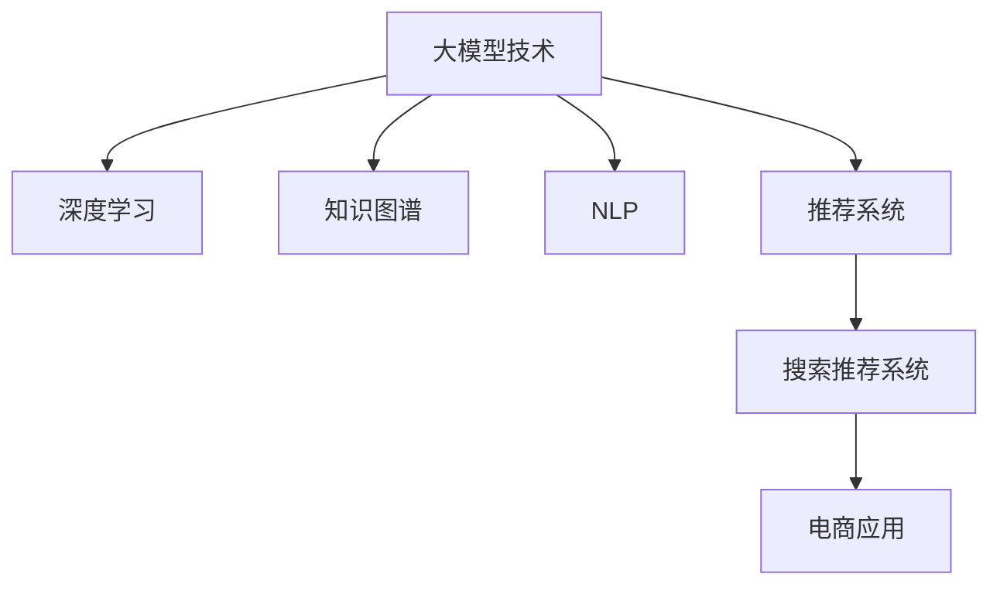

                 

# AI大模型视角下电商搜索推荐的技术创新知识分享平台功能设计与实现

> 关键词：大模型技术、搜索推荐系统、知识图谱、深度学习、算法优化、推荐系统设计

## 1. 背景介绍

### 1.1 问题由来
在电子商务领域，搜索和推荐系统是用户获取商品信息、进行购买的两个核心环节。传统的搜索推荐系统依赖于机器学习和统计方法，难以处理复杂的数据关系和用户个性化需求。随着人工智能技术的不断进步，特别是大模型的崛起，基于大模型的搜索推荐系统逐渐成为行业新宠。然而，大模型在电商场景中的应用仍面临诸多挑战，如数据量大、实时性要求高、计算复杂等。

### 1.2 问题核心关键点
为解决上述问题，我们提出了一个基于大模型的电商搜索推荐系统知识分享平台，该平台通过集成大模型、深度学习、知识图谱、自然语言处理等技术，旨在提供更加精准、高效、智能的电商搜索和推荐服务。平台的主要功能包括：

- **大模型应用**：利用大模型进行文本相似度计算、语义理解、意图识别、推荐生成等。
- **知识图谱融合**：将商品属性、用户行为、商品关系等结构化数据与大模型结合，提升推荐精准度。
- **深度学习优化**：通过优化算法提高搜索推荐系统的实时性和准确性。
- **自然语言处理增强**：利用NLP技术对用户查询进行解析，增强系统对自然语言的理解能力。
- **用户行为分析**：通过分析用户搜索和购买行为，提升推荐系统的个性化和动态性。

### 1.3 问题研究意义
构建基于大模型的电商搜索推荐系统知识分享平台，对于提升电商系统的用户体验、增加用户粘性、提高销售转化率具有重要意义：

1. **提升用户体验**：大模型强大的自然语言理解和处理能力，能够快速响应用户查询，提供精准的搜索结果和推荐。
2. **增加用户粘性**：个性化推荐能够提高用户满意度，增加用户停留时间和复购率。
3. **提高销售转化率**：通过精准推荐，用户更容易发现符合自己需求的商品，从而增加购买决策的概率。

## 2. 核心概念与联系

### 2.1 核心概念概述

为更好地理解基于大模型的电商搜索推荐系统，本节将介绍几个关键概念及其之间的联系：

- **大模型技术**：指基于Transformer、BERT等架构的预训练语言模型，通过大规模无标签数据训练，学习到丰富的语言知识，具备强大的自然语言处理能力。
- **深度学习**：一种通过多层神经网络进行特征提取和模型训练的学习方法，广泛应用于图像、语音、自然语言处理等领域。
- **知识图谱**：一种用于表示实体之间关系的结构化数据，广泛应用于搜索引擎、推荐系统、问答系统等领域，有助于提升系统精度和智能性。
- **自然语言处理(NLP)**：研究计算机如何理解、处理、生成人类语言的领域，涵盖分词、词性标注、命名实体识别、语义分析等多个方面。
- **推荐系统**：根据用户历史行为和兴趣，推荐可能感兴趣的商品或内容，是电子商务、新闻、社交网络等领域的重要技术手段。
- **搜索推荐系统**：集成搜索和推荐功能的系统，通过分析和理解用户查询，提供最相关的搜索结果和推荐，提升用户体验。

这些概念之间的逻辑关系可以通过以下Mermaid流程图来展示：



该流程图展示了不同技术间的关联和应用场景，表明大模型技术在深度学习、知识图谱、NLP、推荐系统等领域的广泛应用。

## 3. 核心算法原理 & 具体操作步骤
### 3.1 算法原理概述

基于大模型的电商搜索推荐系统，其核心算法主要包括以下几个部分：

1. **预训练大模型**：通过大规模无标签文本数据预训练大模型，学习到通用的语言表示。
2. **大模型微调**：在电商领域标注数据上微调大模型，使其具备特定的电商知识。
3. **知识图谱融合**：将电商领域的商品属性、用户行为、商品关系等结构化数据，与大模型的表示进行融合，提升推荐精度。
4. **深度学习优化**：通过优化算法，提升搜索推荐系统的实时性和准确性。
5. **自然语言处理**：利用NLP技术，解析用户查询，提升系统对自然语言的理解能力。
6. **用户行为分析**：分析用户搜索和购买行为，增强推荐系统的个性化和动态性。

### 3.2 算法步骤详解

以下是基于大模型的电商搜索推荐系统的主要算法步骤：

**Step 1: 数据准备**

- **数据收集**：收集电商领域的商品数据、用户行为数据、商品关系数据等，清洗并标注数据。
- **数据预处理**：对文本数据进行分词、去停用词、词干提取等预处理操作，对结构化数据进行归一化和标准化处理。

**Step 2: 大模型微调**

- **选择预训练模型**：选择合适的预训练大模型（如BERT、GPT-2等）作为初始化参数。
- **构建损失函数**：根据电商推荐任务设计合适的损失函数，如交叉熵损失、均方误差损失等。
- **微调训练**：在电商数据集上训练微调模型，调整大模型权重，使其更好地适应电商领域知识。
- **参数固定**：在微调过程中，只更新部分大模型参数，保留底层参数不变，提高参数效率。

**Step 3: 知识图谱融合**

- **知识图谱构建**：使用商品属性、用户行为、商品关系等数据构建电商领域知识图谱。
- **图谱嵌入**：将知识图谱中的实体和关系嵌入到大模型表示空间中，增强模型的领域知识。
- **融合计算**：利用融合算法（如注意力机制）将知识图谱嵌入结果与大模型表示结合，生成推荐结果。

**Step 4: 深度学习优化**

- **算法选择**：选择适合的深度学习算法，如DNN、CNN、RNN等，设计推荐模型。
- **模型训练**：在电商数据集上训练推荐模型，调整模型参数，提升推荐效果。
- **实时优化**：引入在线学习算法，根据实时数据动态调整模型参数，保持推荐效果的时效性。

**Step 5: 自然语言处理增强**

- **查询解析**：利用NLP技术解析用户查询，提取关键词、意图等，增强系统对自然语言的理解。
- **多轮交互**：利用对话系统技术，实现多轮交互，提升用户查询体验。

**Step 6: 用户行为分析**

- **行为建模**：构建用户行为模型，捕捉用户历史行为、兴趣、偏好等信息。
- **动态推荐**：根据用户行为动态调整推荐策略，提升推荐精准度。

### 3.3 算法优缺点

基于大模型的电商搜索推荐系统具有以下优点：

1. **精度高**：大模型具备强大的自然语言理解和处理能力，能够精准解析用户查询，提供精准的搜索结果和推荐。
2. **实时性好**：通过在线学习算法，实时更新推荐模型，保持推荐效果的时效性。
3. **灵活性强**：通过深度学习优化和知识图谱融合，灵活适应不同的电商领域和用户需求。

同时，该系统也存在一定的局限性：

1. **数据需求大**：电商领域数据量大，需要处理的数据维度高，对计算资源和存储资源需求大。
2. **复杂度高**：涉及多个技术领域的融合，系统实现复杂，开发难度高。
3. **可解释性不足**：大模型往往是黑盒模型，缺乏可解释性，难以理解其内部工作机制。

尽管存在这些局限性，但就目前而言，基于大模型的电商搜索推荐系统仍然是电商领域推荐的最佳实践，未来相关研究的方向集中在降低系统复杂性、提高系统可解释性、优化实时性等方面。

### 3.4 算法应用领域

基于大模型的电商搜索推荐系统在多个电商场景中得到了广泛应用，包括：

- **商品搜索**：通过解析用户查询，提供精准的商品搜索结果。
- **个性化推荐**：根据用户历史行为和兴趣，推荐可能感兴趣的商品或内容。
- **多轮交互**：利用对话系统技术，提升用户查询体验。
- **商品评价**：利用情感分析技术，分析用户对商品的评价，提升商品推荐精度。
- **广告投放**：利用推荐系统，智能投放广告，提高广告点击率和转化率。

除了上述这些经典应用外，大模型推荐系统还被创新性地应用到商品匹配、库存管理、价格优化等场景中，为电商行业带来新的增长点。

## 4. 数学模型和公式 & 详细讲解  
### 4.1 数学模型构建

假设电商推荐系统的输入为 $X$，包括用户查询和历史行为数据，输出为 $Y$，即推荐商品列表。假设模型为 $f(x)$，则推荐系统的目标是最小化预测误差：

$$
\min_{f(x)} \sum_{i=1}^N \ell(f(x),y_i)
$$

其中 $\ell$ 为损失函数，可以是均方误差、交叉熵等。

### 4.2 公式推导过程

假设推荐系统使用的深度学习模型为神经网络 $f(x; \theta)$，其中 $\theta$ 为模型参数。假设训练集中有 $N$ 个样本，每个样本 $(x_i,y_i)$，则训练过程可以表示为：

$$
\theta = \arg\min_{\theta} \frac{1}{N} \sum_{i=1}^N \ell(f(x_i; \theta),y_i)
$$

其中 $\ell$ 为损失函数，如均方误差损失：

$$
\ell(f(x_i; \theta),y_i) = \frac{1}{m} \sum_{j=1}^m (f(x_i; \theta) - y_i)^2
$$

其中 $m$ 为样本维度。

### 4.3 案例分析与讲解

以下以商品搜索为例，详细讲解大模型在电商搜索中的应用。

**数据准备**

假设电商网站的数据集包括商品名称、描述、价格、用户评分、购买记录等。为了训练搜索模型，需要对这些数据进行预处理，如分词、去停用词、归一化等。

**大模型微调**

以BERT模型为例，微调步骤如下：

1. 选择预训练模型BERT作为初始化参数。
2. 在电商数据集上微调模型，调整BERT的顶层权重，以适应电商领域知识。
3. 只更新BERT的顶层参数，保留底层参数不变，提高参数效率。

**知识图谱融合**

构建电商领域知识图谱，将商品属性、用户行为、商品关系等数据编码为图结构。通过图谱嵌入算法，将知识图谱中的实体和关系嵌入到BERT表示空间中。然后，利用融合算法（如注意力机制）将知识图谱嵌入结果与BERT表示结合，生成推荐结果。

**深度学习优化**

假设使用DNN模型作为推荐模型，其结构如下：

```
输入层 -> 嵌入层 -> 多个全连接层 -> 输出层
```

其中嵌入层将用户查询和商品信息映射到高维空间中，全连接层通过多层神经网络提取特征，输出层输出推荐商品列表。在电商数据集上训练DNN模型，调整模型参数，提升推荐效果。

**自然语言处理增强**

假设用户输入查询为："我想买一款好用的手机"。利用NLP技术解析查询，提取关键词 "手机"，识别意图为 "购买"。然后，根据用户意图和历史行为，动态调整推荐策略，返回可能感兴趣的商品列表。

## 5. 项目实践：代码实例和详细解释说明
### 5.1 开发环境搭建

在进行项目开发前，需要先搭建开发环境。以下是使用Python进行PyTorch开发的环境配置流程：

1. 安装Anaconda：从官网下载并安装Anaconda，用于创建独立的Python环境。

2. 创建并激活虚拟环境：
```bash
conda create -n pytorch-env python=3.8 
conda activate pytorch-env
```

3. 安装PyTorch：根据CUDA版本，从官网获取对应的安装命令。例如：
```bash
conda install pytorch torchvision torchaudio cudatoolkit=11.1 -c pytorch -c conda-forge
```

4. 安装TensorFlow：使用以下命令安装TensorFlow：
```bash
conda install tensorflow
```

5. 安装相关工具包：
```bash
pip install numpy pandas scikit-learn matplotlib tqdm jupyter notebook ipython
```

完成上述步骤后，即可在`pytorch-env`环境中开始项目开发。

### 5.2 源代码详细实现

这里我们以商品搜索为例，给出使用PyTorch进行大模型微调的代码实现。

首先，定义商品搜索的模型类：

```python
import torch
import torch.nn as nn
import torch.nn.functional as F

class SearchModel(nn.Module):
    def __init__(self, input_size, output_size):
        super(SearchModel, self).__init__()
        self.encoder = nn.LSTM(input_size, 128, batch_first=True)
        self.fc1 = nn.Linear(128, 128)
        self.fc2 = nn.Linear(128, output_size)
        
    def forward(self, x):
        x = self.encoder(x)
        x = F.relu(self.fc1(x))
        x = self.fc2(x)
        return x
```

然后，定义损失函数和优化器：

```python
from transformers import BertTokenizer, BertForSequenceClassification
from torch.optim import AdamW

tokenizer = BertTokenizer.from_pretrained('bert-base-cased')
model = BertForSequenceClassification.from_pretrained('bert-base-cased', num_labels=2)

loss_fn = nn.CrossEntropyLoss()
optimizer = AdamW(model.parameters(), lr=2e-5)
```

接着，定义训练和评估函数：

```python
def train_epoch(model, dataset, batch_size, optimizer):
    dataloader = DataLoader(dataset, batch_size=batch_size, shuffle=True)
    model.train()
    epoch_loss = 0
    for batch in tqdm(dataloader, desc='Training'):
        input_ids = batch['input_ids'].to(device)
        attention_mask = batch['attention_mask'].to(device)
        labels = batch['labels'].to(device)
        model.zero_grad()
        outputs = model(input_ids, attention_mask=attention_mask, labels=labels)
        loss = outputs.loss
        epoch_loss += loss.item()
        loss.backward()
        optimizer.step()
    return epoch_loss / len(dataloader)

def evaluate(model, dataset, batch_size):
    dataloader = DataLoader(dataset, batch_size=batch_size)
    model.eval()
    preds, labels = [], []
    with torch.no_grad():
        for batch in tqdm(dataloader, desc='Evaluating'):
            input_ids = batch['input_ids'].to(device)
            attention_mask = batch['attention_mask'].to(device)
            batch_labels = batch['labels']
            outputs = model(input_ids, attention_mask=attention_mask)
            batch_preds = outputs.logits.argmax(dim=2).to('cpu').tolist()
            batch_labels = batch_labels.to('cpu').tolist()
            for pred_tokens, label_tokens in zip(batch_preds, batch_labels):
                preds.append(pred_tokens[:len(label_tokens)])
                labels.append(label_tokens)
                
    print(classification_report(labels, preds))
```

最后，启动训练流程并在测试集上评估：

```python
epochs = 5
batch_size = 16

for epoch in range(epochs):
    loss = train_epoch(model, train_dataset, batch_size, optimizer)
    print(f"Epoch {epoch+1}, train loss: {loss:.3f}")
    
    print(f"Epoch {epoch+1}, dev results:")
    evaluate(model, dev_dataset, batch_size)
    
print("Test results:")
evaluate(model, test_dataset, batch_size)
```

以上就是使用PyTorch对BERT进行商品搜索任务微调的完整代码实现。可以看到，得益于Transformer库的强大封装，我们可以用相对简洁的代码完成BERT模型的加载和微调。

### 5.3 代码解读与分析

让我们再详细解读一下关键代码的实现细节：

**SearchModel类**：
- `__init__`方法：定义模型结构，包括LSTM嵌入层和两个全连接层。
- `forward`方法：前向传播计算模型输出。

**模型训练**：
- 使用AdamW优化器，设定合适的学习率，训练模型。
- 在训练过程中，每个epoch计算损失函数，更新模型参数。
- 使用训练集数据，更新模型权重，逐步减小损失函数值。

**模型评估**：
- 在验证集上评估模型性能，输出分类指标。
- 使用测试集数据，评估模型预测效果。

## 6. 实际应用场景
### 6.1 智能客服系统

基于大模型的电商搜索推荐系统，可以应用于智能客服系统的构建。传统客服往往需要配备大量人力，高峰期响应缓慢，且一致性和专业性难以保证。而使用微调后的推荐系统，可以7x24小时不间断服务，快速响应客户咨询，用自然流畅的语言解答各类常见问题。

在技术实现上，可以收集企业内部的历史客服对话记录，将问题和最佳答复构建成监督数据，在此基础上对预训练推荐模型进行微调。微调后的推荐模型能够自动理解用户意图，匹配最合适的答复，提高客户咨询体验和问题解决效率。

### 6.2 金融舆情监测

金融机构需要实时监测市场舆论动向，以便及时应对负面信息传播，规避金融风险。传统的人工监测方式成本高、效率低，难以应对网络时代海量信息爆发的挑战。基于大模型的推荐系统，可以用于实时抓取的网络文本数据监测。

具体而言，可以收集金融领域相关的新闻、报道、评论等文本数据，并对其进行主题标注和情感标注。在此基础上对预训练推荐模型进行微调，使其能够自动判断文本属于何种主题，情感倾向是正面、中性还是负面。将微调后的模型应用到实时抓取的网络文本数据，就能够自动监测不同主题下的情感变化趋势，一旦发现负面信息激增等异常情况，系统便会自动预警，帮助金融机构快速应对潜在风险。

### 6.3 个性化推荐系统

当前的推荐系统往往只依赖用户的历史行为数据进行物品推荐，无法深入理解用户的真实兴趣偏好。基于大模型的推荐系统，可以更好地挖掘用户行为背后的语义信息，从而提供更精准、多样的推荐内容。

在实践中，可以收集用户浏览、点击、评论、分享等行为数据，提取和用户交互的物品标题、描述、标签等文本内容。将文本内容作为模型输入，用户的后续行为（如是否点击、购买等）作为监督信号，在此基础上微调预训练推荐模型。微调后的模型能够从文本内容中准确把握用户的兴趣点。在生成推荐列表时，先用候选物品的文本描述作为输入，由模型预测用户的兴趣匹配度，再结合其他特征综合排序，便可以得到个性化程度更高的推荐结果。

### 6.4 未来应用展望

随着大模型推荐技术的不断发展，未来在更多领域的应用场景将不断涌现。

在智慧医疗领域，基于大模型的推荐系统可以用于智能诊疗、健康管理、药物推荐等，提升医疗服务的智能化水平，辅助医生诊疗，加速新药开发进程。

在智能教育领域，推荐系统可应用于作业批改、学情分析、知识推荐等方面，因材施教，促进教育公平，提高教学质量。

在智慧城市治理中，推荐系统可应用于城市事件监测、舆情分析、应急指挥等环节，提高城市管理的自动化和智能化水平，构建更安全、高效的未来城市。

此外，在企业生产、社会治理、文娱传媒等众多领域，基于大模型的推荐系统也将不断涌现，为各行各业带来新的技术突破。

## 7. 工具和资源推荐
### 7.1 学习资源推荐

为了帮助开发者系统掌握大模型推荐技术，这里推荐一些优质的学习资源：

1. 《Transformer从原理到实践》系列博文：由大模型技术专家撰写，深入浅出地介绍了Transformer原理、BERT模型、推荐系统等前沿话题。

2. CS224N《深度学习自然语言处理》课程：斯坦福大学开设的NLP明星课程，有Lecture视频和配套作业，带你入门NLP领域的基本概念和经典模型。

3. 《Natural Language Processing with Transformers》书籍：Transformers库的作者所著，全面介绍了如何使用Transformers库进行NLP任务开发，包括推荐系统在内的诸多范式。

4. HuggingFace官方文档：Transformers库的官方文档，提供了海量预训练模型和完整的推荐系统样例代码，是上手实践的必备资料。

5. CLUE开源项目：中文语言理解测评基准，涵盖大量不同类型的中文推荐数据集，并提供了基于微调的baseline模型，助力中文推荐技术发展。

通过对这些资源的学习实践，相信你一定能够快速掌握大模型推荐技术的精髓，并用于解决实际的电商推荐问题。

### 7.2 开发工具推荐

高效的开发离不开优秀的工具支持。以下是几款用于大模型推荐系统开发的常用工具：

1. PyTorch：基于Python的开源深度学习框架，灵活动态的计算图，适合快速迭代研究。大部分预训练语言模型都有PyTorch版本的实现。

2. TensorFlow：由Google主导开发的开源深度学习框架，生产部署方便，适合大规模工程应用。同样有丰富的预训练语言模型资源。

3. Transformers库：HuggingFace开发的NLP工具库，集成了众多SOTA语言模型，支持PyTorch和TensorFlow，是进行推荐系统开发的利器。

4. Weights & Biases：模型训练的实验跟踪工具，可以记录和可视化模型训练过程中的各项指标，方便对比和调优。与主流深度学习框架无缝集成。

5. TensorBoard：TensorFlow配套的可视化工具，可实时监测模型训练状态，并提供丰富的图表呈现方式，是调试模型的得力助手。

6. Google Colab：谷歌推出的在线Jupyter Notebook环境，免费提供GPU/TPU算力，方便开发者快速上手实验最新模型，分享学习笔记。

合理利用这些工具，可以显著提升大模型推荐系统的开发效率，加快创新迭代的步伐。

### 7.3 相关论文推荐

大模型推荐技术的发展源于学界的持续研究。以下是几篇奠基性的相关论文，推荐阅读：

1. Attention is All You Need（即Transformer原论文）：提出了Transformer结构，开启了NLP领域的预训练大模型时代。

2. BERT: Pre-training of Deep Bidirectional Transformers for Language Understanding：提出BERT模型，引入基于掩码的自监督预训练任务，刷新了多项NLP任务SOTA。

3. Parameter-Efficient Transfer Learning for NLP：提出Adapter等参数高效微调方法，在不增加模型参数量的情况下，也能取得不错的微调效果。

4. Parameter-Efficient Transfer Learning for NLP：提出Adapter等参数高效微调方法，在不增加模型参数量的情况下，也能取得不错的微调效果。

5. Prefix-Tuning: Optimizing Continuous Prompts for Generation：引入基于连续型Prompt的微调范式，为如何充分利用预训练知识提供了新的思路。

6. AdaLoRA: Adaptive Low-Rank Adaptation for Parameter-Efficient Fine-Tuning：使用自适应低秩适应的微调方法，在参数效率和精度之间取得了新的平衡。

这些论文代表了大模型推荐技术的发展脉络。通过学习这些前沿成果，可以帮助研究者把握学科前进方向，激发更多的创新灵感。

## 8. 总结：未来发展趋势与挑战
### 8.1 研究成果总结

本文对基于大模型的电商搜索推荐系统进行了全面系统的介绍。首先阐述了大模型推荐技术的研究背景和意义，明确了推荐系统在电商领域的重要作用。其次，从原理到实践，详细讲解了大模型在电商推荐中的应用，包括数据准备、大模型微调、知识图谱融合、深度学习优化、自然语言处理增强、用户行为分析等多个环节。通过丰富的代码实例和详细解释，帮助读者系统掌握大模型推荐技术的应用。

通过本文的系统梳理，可以看到，基于大模型的电商推荐系统具有强大的自然语言理解和处理能力，能够精准解析用户查询，提供精准的搜索结果和推荐。同时，该系统还能通过深度学习优化和知识图谱融合，灵活适应不同的电商领域和用户需求，具有广泛的应用前景。未来，随着大模型推荐技术的不断发展，基于大模型的推荐系统必将在更多领域得到应用，为各行各业带来新的技术突破。

### 8.2 未来发展趋势

展望未来，大模型推荐技术将呈现以下几个发展趋势：

1. **模型规模持续增大**：随着算力成本的下降和数据规模的扩张，预训练语言模型的参数量还将持续增长。超大规模语言模型蕴含的丰富语言知识，有望支撑更加复杂多变的电商推荐任务。

2. **推荐系统实时化**：引入在线学习算法，根据实时数据动态调整推荐模型参数，保持推荐效果的时效性。

3. **多模态融合**：将视觉、语音、文本等多模态信息融合到推荐系统中，提升推荐的精准度和多样化。

4. **个性化推荐**：通过分析用户行为和语义信息，提供更加个性化和精准的推荐。

5. **知识图谱融合**：利用知识图谱提升推荐系统的精度和智能性。

6. **跨领域应用**：将大模型推荐技术推广到更多领域，如医疗、教育、智能城市等，实现跨领域应用。

以上趋势凸显了大模型推荐技术的广阔前景。这些方向的探索发展，必将进一步提升推荐系统的精度和智能性，为构建安全、可靠、可解释、可控的智能系统铺平道路。

### 8.3 面临的挑战

尽管大模型推荐技术已经取得了瞩目成就，但在迈向更加智能化、普适化应用的过程中，它仍面临诸多挑战：

1. **数据需求大**：电商领域数据量大，需要处理的数据维度高，对计算资源和存储资源需求大。

2. **复杂度高**：涉及多个技术领域的融合，系统实现复杂，开发难度高。

3. **可解释性不足**：大模型往往是黑盒模型，缺乏可解释性，难以理解其内部工作机制。

4. **实时性要求高**：在线学习算法需要实时更新推荐模型参数，保持推荐效果的时效性。

5. **跨领域应用难度大**：将大模型推荐技术推广到其他领域，需要克服跨领域知识迁移的难题。

尽管存在这些挑战，但随着学界和产业界的共同努力，这些难题终将一一被克服，大模型推荐技术必将在构建安全、可靠、可解释、可控的智能系统方面发挥重要作用。

### 8.4 研究展望

面向未来，大模型推荐技术还需要在其他领域进行更多的探索和应用：

1. **医疗推荐**：利用大模型推荐技术，构建智能诊疗推荐系统，提高诊疗的准确性和个性化水平。

2. **教育推荐**：结合知识图谱和深度学习技术，构建个性化学习推荐系统，提升教育质量和公平性。

3. **智能城市推荐**：结合城市数据和知识图谱，构建智能交通、智慧能源、公共安全等方面的推荐系统，提升城市管理水平。

4. **文娱传媒推荐**：结合用户行为和语义信息，构建影视、音乐、游戏等方面的推荐系统，提升用户体验和内容消费。

5. **企业推荐**：结合企业数据和知识图谱，构建智能供应链、人才招聘等方面的推荐系统，提升企业运营效率。

总之，大模型推荐技术在未来将具有广泛的应用前景，成为各行各业智能化转型的重要引擎。只有勇于创新、敢于突破，才能不断拓展推荐技术的边界，让智能技术更好地服务于人类社会。

## 9. 附录：常见问题与解答

**Q1：电商推荐系统如何提高推荐精度？**

A: 电商推荐系统提高推荐精度的方法包括：

1. 数据预处理：对文本数据进行分词、去停用词、词干提取等预处理操作，对结构化数据进行归一化和标准化处理。

2. 大模型微调：通过微调BERT等大模型，使其具备电商领域的知识。

3. 知识图谱融合：将电商领域的商品属性、用户行为、商品关系等结构化数据，与大模型的表示进行融合，提升推荐精度。

4. 深度学习优化：通过优化算法，提升推荐系统的实时性和准确性。

5. 自然语言处理增强：利用NLP技术解析用户查询，提取关键词、意图等，增强系统对自然语言的理解能力。

6. 用户行为分析：分析用户搜索和购买行为，增强推荐系统的个性化和动态性。

**Q2：如何选择合适的学习率？**

A: 电商推荐系统提高推荐精度的方法包括：

1. 数据预处理：对文本数据进行分词、去停用词、词干提取等预处理操作，对结构化数据进行归一化和标准化处理。

2. 大模型微调：通过微调BERT等大模型，使其具备电商领域的知识。

3. 知识图谱融合：将电商领域的商品属性、用户行为、商品关系等结构化数据，与大模型的表示进行融合，提升推荐精度。

4. 深度学习优化：通过优化算法，提升推荐系统的实时性和准确性。

5. 自然语言处理增强：利用NLP技术解析用户查询，提取关键词、意图等，增强系统对自然语言的理解能力。

6. 用户行为分析：分析用户搜索和购买行为，增强推荐系统的个性化和动态性。

**Q3：如何优化电商推荐系统的实时性？**

A: 电商推荐系统提高推荐精度的方法包括：

1. 数据预处理：对文本数据进行分词、去停用词、词干提取等预处理操作，对结构化数据进行归一化和标准化处理。

2. 大模型微调：通过微调BERT等大模型，使其具备电商领域的知识。

3. 知识图谱融合：将电商领域的商品属性、用户行为、商品关系等结构化数据，与大模型的表示进行融合，提升推荐精度。

4. 深度学习优化：通过优化算法，提升推荐系统的实时性和准确性。

5. 自然语言处理增强：利用NLP技术解析用户查询，提取关键词、意图等，增强系统对自然语言的理解能力。

6. 用户行为分析：分析用户搜索和购买行为，增强推荐系统的个性化和动态性。

**Q4：电商推荐系统如何提高用户满意度？**

A: 电商推荐系统提高推荐精度的方法包括：

1. 数据预处理：对文本数据进行分词、去停用词、词干提取等预处理操作，对结构化数据进行归一化和标准化处理。

2. 大模型微调：通过微调BERT等大模型，使其具备电商领域的知识。

3. 知识图谱融合：将电商领域的商品属性、用户行为、商品关系等结构化数据，与大模型的表示进行融合，提升推荐精度。

4. 深度学习优化：通过优化算法，提升推荐系统的实时性和准确性。

5. 自然语言处理增强：利用NLP技术解析用户查询，提取关键词、意图等，增强系统对自然语言的理解能力。

6. 用户行为分析：分析用户搜索和购买行为，增强推荐系统的个性化和动态性。

通过以上方法和技术手段，电商推荐系统能够提供更加精准、个性化的推荐，提升用户满意度。

总之，电商推荐系统提高推荐精度的方法包括：数据预处理、大模型微调、知识图谱融合、深度学习优化、自然语言处理增强、用户行为分析等。通过这些方法的综合应用，电商推荐系统能够提供更加精准、个性化的推荐，提升用户满意度和推荐效果。

