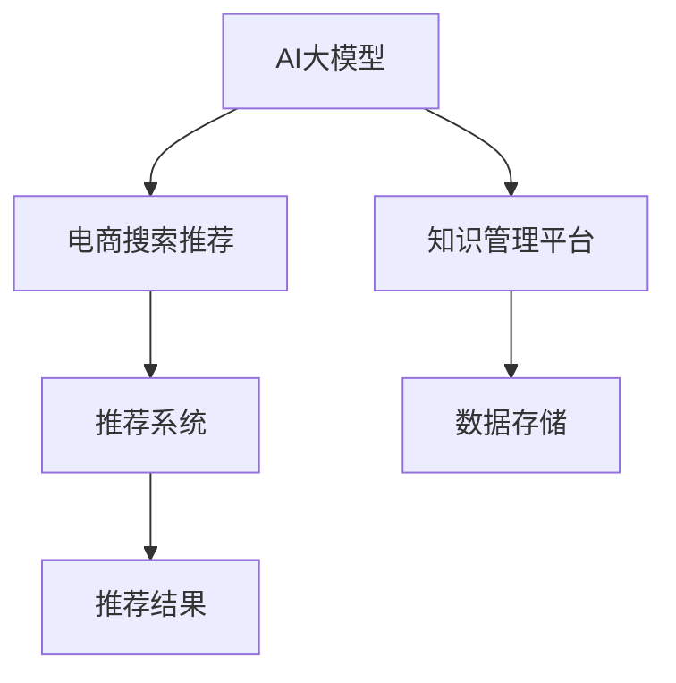

                 

# AI大模型视角下电商搜索推荐的技术创新知识管理平台

> 关键词：AI大模型, 电商搜索推荐, 知识管理平台, 技术创新, 推荐系统

## 1. 背景介绍

### 1.1 问题由来

在电商领域，搜索推荐系统的核心目标是提升用户购物体验，提高交易转化率。随着消费者个性化需求日益多样化和复杂化，传统搜索推荐系统在推荐精度、用户满意度、转化率等方面面临着严峻挑战。如何在海量商品数据中快速、精准地匹配用户需求，提升用户满意度和购物转化率，成为电商企业亟待解决的问题。

近年来，大规模预训练语言模型和大规模数据集使得推荐系统的精度和效果有了显著提升。通过利用AI大模型进行电商搜索推荐，能够在更复杂的数据和更广泛的语境中实现高效、精准的推荐，带来更好的用户体验和更高的商业价值。

### 1.2 问题核心关键点

为实现电商搜索推荐系统的高效、精准推荐，我们需要从AI大模型、数据处理、推荐算法等多个层面进行技术创新。核心关键点包括：

- AI大模型的选择和适配：选择合适的预训练语言模型，并针对电商场景进行参数微调。
- 数据预处理与增强：利用深度学习技术进行数据清洗、特征工程，并应用数据增强技术提升模型泛化能力。
- 推荐算法设计：基于用户的点击行为、浏览历史、评价反馈等数据，设计高效、精准的推荐算法。
- 用户行为建模与个性化：构建用户行为模型，实现个性化推荐，满足用户的多样化需求。
- 实时反馈与优化：利用实时反馈机制，不断优化推荐算法和模型，提高推荐系统的效果。

### 1.3 问题研究意义

AI大模型在电商搜索推荐中的应用，具有以下几方面的重要意义：

1. **提升推荐精准度**：AI大模型具备强大的语义理解能力和信息抽取能力，能够在海量商品数据中快速找到与用户需求匹配的商品，提高推荐精准度。
2. **增强用户体验**：通过推荐符合用户兴趣和需求的商品，提升用户的满意度和购物体验。
3. **优化资源配置**：通过精准推荐减少无效流量，优化广告投放和商品库存，提高企业资源利用效率。
4. **驱动商业创新**：AI大模型不仅能提升推荐精度，还能挖掘用户深层次需求，驱动电商业务的创新和发展。

## 2. 核心概念与联系

### 2.1 核心概念概述

为更深入地理解AI大模型在电商搜索推荐中的应用，我们需要了解几个关键概念：

- **AI大模型**：如BERT、GPT等大规模预训练语言模型，具备强大的语义理解能力和信息抽取能力，能够在复杂语境中处理自然语言数据。
- **电商搜索推荐**：电商平台上，通过推荐系统推荐用户感兴趣的商品，提升用户满意度。
- **知识管理平台**：利用AI技术构建的知识管理平台，能够实现大规模知识的高效存储、检索和应用，提升企业决策和运营效率。
- **技术创新**：结合AI技术进行创新性应用，提升电商搜索推荐系统的性能和效率。
- **推荐系统**：基于用户行为数据进行推荐，提高用户满意度和商业价值。

这些概念之间相互联系，共同构成了电商搜索推荐系统的技术框架。通过AI大模型对商品数据和用户行为数据进行深度学习，结合知识管理平台和推荐算法，可以构建高效、精准的推荐系统，实现电商搜索推荐的技术创新。

### 2.2 核心概念原理和架构的 Mermaid 流程图



这个流程图展示了AI大模型、电商搜索推荐、知识管理平台和推荐系统之间的联系。其中，AI大模型通过预训练和微调获取强大的语义理解能力，与知识管理平台和推荐系统结合，实现高效、精准的推荐。

## 3. 核心算法原理 & 具体操作步骤

### 3.1 算法原理概述

基于AI大模型的电商搜索推荐系统，主要利用自然语言处理技术进行语义理解和信息抽取，结合推荐算法进行个性化推荐。其核心算法流程包括以下几个步骤：

1. **数据预处理**：对原始数据进行清洗、特征工程和增强，提升数据质量和模型泛化能力。
2. **模型适配**：选择合适的预训练语言模型，并针对电商搜索推荐场景进行参数微调，提升模型的适应性。
3. **用户行为建模**：通过用户的点击行为、浏览历史、评价反馈等数据，构建用户行为模型，实现个性化推荐。
4. **推荐算法设计**：基于用户行为模型，设计高效的推荐算法，实现精准推荐。
5. **实时反馈与优化**：利用实时反馈机制，不断优化模型和算法，提升推荐系统效果。

### 3.2 算法步骤详解

以下是电商搜索推荐系统的具体算法步骤：

1. **数据预处理**：
   - 数据清洗：去除无关和噪声数据，如低质量的商品描述、重复用户点击等。
   - 特征工程：提取有意义的特征，如商品标题、描述、用户画像、点击路径等。
   - 数据增强：通过近义词替换、同义词扩展、回译等方式，扩充训练数据，提升模型泛化能力。

2. **模型适配**：
   - 选择预训练语言模型：如BERT、GPT等，并根据电商推荐任务进行参数微调。
   - 微调目标：如分类任务、序列生成任务等，根据具体任务需求设定微调目标函数。
   - 微调策略：使用梯度下降等优化算法，设置合适的学习率、批次大小、迭代轮数等参数。

3. **用户行为建模**：
   - 构建用户行为模型：通过用户的点击行为、浏览历史、评价反馈等数据，建立用户兴趣模型。
   - 用户画像建模：利用用户画像数据，实现对用户的深度理解。
   - 行为预测：基于用户行为数据，预测用户下一步的点击或购买行为。

4. **推荐算法设计**：
   - 协同过滤：基于用户-商品之间的相似性进行推荐。
   - 基于内容的推荐：通过商品的属性和特征进行推荐。
   - 混合推荐：将多种推荐方法结合，提升推荐效果。

5. **实时反馈与优化**：
   - 实时反馈机制：通过用户的反馈数据，不断调整推荐算法和模型参数。
   - 优化策略：如在线学习、增量学习、超参数调整等，持续优化推荐系统性能。

### 3.3 算法优缺点

基于AI大模型的电商搜索推荐系统，具有以下优缺点：

**优点**：
- **精度高**：AI大模型具备强大的语义理解和信息抽取能力，能够在复杂语境中准确匹配用户需求，提高推荐精准度。
- **泛化能力强**：通过数据增强和模型适配，提升模型的泛化能力，适应不同电商场景。
- **用户满意度提升**：通过个性化推荐，提升用户购物体验和满意度。
- **商业价值提升**：精准推荐减少无效流量，优化广告投放和商品库存，提高企业资源利用效率。

**缺点**：
- **计算资源消耗大**：AI大模型的训练和推理需要大量的计算资源，如GPU、TPU等。
- **数据质量要求高**：推荐系统依赖高质量的数据，数据清洗和特征工程要求较高。
- **算法复杂度高**：推荐算法设计复杂，需要结合多种推荐方法，实现高效精准推荐。
- **实时反馈难度大**：实时反馈数据量大，需要高效的算法和系统架构支持。

### 3.4 算法应用领域

AI大模型在电商搜索推荐中的应用领域非常广泛，包括：

- **商品推荐**：基于用户行为和商品特征，推荐用户感兴趣的商品。
- **个性化广告**：通过个性化推荐，提升广告的转化率和效果。
- **热门商品推荐**：基于用户和商品历史数据，推荐热门商品。
- **用户画像分析**：通过用户行为数据，构建用户画像，实现精准推荐。
- **搜索优化**：优化商品搜索算法，提高搜索匹配准确度。

## 4. 数学模型和公式 & 详细讲解 & 举例说明

### 4.1 数学模型构建

为了更好地理解电商搜索推荐系统的数学模型，我们将以协同过滤算法为例，介绍其数学模型的构建过程。

假设用户-商品矩阵为 $R \in \mathbb{R}^{N \times M}$，其中 $N$ 表示用户数，$M$ 表示商品数。每个用户 $u$ 与商品 $i$ 的评分 $r_{ui}$ 为一个实数，$R$ 矩阵中的每个元素 $r_{ui}$ 表示用户 $u$ 对商品 $i$ 的评分。

协同过滤算法的核心目标是找到与用户 $u$ 兴趣相似的其他用户 $v$，并预测用户 $u$ 对商品 $i$ 的评分。其中，用户 $u$ 与用户 $v$ 的相似度可以通过余弦相似度计算：

$$
\text{similarity}(u,v) = \cos(\theta) = \frac{\sum_{i=1}^{M} r_{ui}r_{vi}}{\sqrt{\sum_{i=1}^{M} r_{ui}^2}\sqrt{\sum_{i=1}^{M} r_{vi}^2}}
$$

根据相似度计算结果，对用户 $u$ 的评分进行加权平均，得到用户 $u$ 对商品 $i$ 的预测评分：

$$
\hat{r}_{ui} = \sum_{v=1}^{N} \text{similarity}(u,v) \hat{r}_{vi}
$$

其中 $\hat{r}_{vi}$ 表示用户 $v$ 对商品 $i$ 的预测评分。

### 4.2 公式推导过程

以下是协同过滤算法的详细推导过程：

1. **用户-商品矩阵**：将用户-商品评分矩阵 $R$ 转换为邻接矩阵 $A$，其中 $A_{ij} = 1$ 表示用户 $i$ 购买了商品 $j$，$A_{ij} = 0$ 表示用户 $i$ 未购买商品 $j$。
2. **相似度计算**：利用余弦相似度计算用户 $u$ 与用户 $v$ 的相似度，得到相似度矩阵 $S$。
3. **预测评分**：通过相似度矩阵 $S$ 和用户 $v$ 的评分向量 $\bar{r}_v$，预测用户 $u$ 的评分向量 $\hat{r}_u$，最终得到用户 $u$ 对商品 $i$ 的预测评分 $\hat{r}_{ui}$。

### 4.3 案例分析与讲解

假设电商平台上，用户 $u$ 购买了商品 $i$，用户 $v$ 未购买商品 $i$。为了推荐用户 $v$ 可能感兴趣的商品，我们可以计算用户 $u$ 和用户 $v$ 的相似度：

$$
\text{similarity}(u,v) = \cos(\theta) = \frac{\sum_{j=1}^{N} A_{uj}A_{vk}}{\sqrt{\sum_{j=1}^{N} A_{uj}^2}\sqrt{\sum_{k=1}^{N} A_{vk}^2}}
$$

根据相似度计算结果，对用户 $v$ 的评分进行加权平均，得到用户 $v$ 对商品 $i$ 的预测评分：

$$
\hat{r}_{vi} = \sum_{u=1}^{N} \text{similarity}(u,v) \hat{r}_{ui}
$$

其中 $\hat{r}_{ui}$ 表示用户 $u$ 对商品 $i$ 的评分。最终，用户 $v$ 对商品 $i$ 的预测评分 $\hat{r}_{vi}$ 将作为推荐结果。

## 5. 项目实践：代码实例和详细解释说明

### 5.1 开发环境搭建

在项目实践中，我们需要搭建基于Python的电商搜索推荐系统的开发环境。以下是具体的搭建流程：

1. 安装Python：从官网下载并安装Python，建议使用最新版本。
2. 安装依赖库：使用pip安装必要的依赖库，如numpy、pandas、scikit-learn等。
3. 安装PyTorch：从官网下载并安装PyTorch，并安装对应的GPU版本。
4. 安装TensorBoard：通过pip安装TensorBoard，用于可视化模型训练过程和结果。

### 5.2 源代码详细实现

以下是电商搜索推荐系统的详细代码实现，包括数据预处理、模型适配、用户行为建模、推荐算法设计和实时反馈优化等步骤。

```python
import numpy as np
import pandas as pd
import torch
from transformers import BertForSequenceClassification, BertTokenizer
from torch.utils.data import DataLoader, Dataset

class UserItemDataset(Dataset):
    def __init__(self, user_item_matrix, tokenizer):
        self.user_item_matrix = user_item_matrix
        self.tokenizer = tokenizer
        self.num_users, self.num_items = user_item_matrix.shape

    def __len__(self):
        return self.num_users

    def __getitem__(self, index):
        user_id = index
        user_item = self.user_item_matrix[user_id]
        user_items = list(user_item.nonzero()[1])
        user_item_labels = np.zeros(self.num_items, dtype=np.int64)
        user_item_labels[user_items] = 1
        sequence = np.array(user_items).reshape(-1, 1)
        sequence_ids = self.tokenizer(sequence, padding=True, truncation=True, return_tensors='pt')
        return {'input_ids': sequence_ids['input_ids'].flatten(), 
                'attention_mask': sequence_ids['attention_mask'].flatten(),
                'labels': torch.tensor(user_item_labels, dtype=torch.long)}

# 数据预处理
user_item_matrix = pd.read_csv('user_item_matrix.csv', sep=',').values
tokenizer = BertTokenizer.from_pretrained('bert-base-uncased')
dataset = UserItemDataset(user_item_matrix, tokenizer)

# 模型适配
model = BertForSequenceClassification.from_pretrained('bert-base-uncased', num_labels=2)
optimizer = torch.optim.Adam(model.parameters(), lr=2e-5)

# 训练过程
device = torch.device('cuda' if torch.cuda.is_available() else 'cpu')
model.to(device)
num_epochs = 5
batch_size = 16

for epoch in range(num_epochs):
    dataloader = DataLoader(dataset, batch_size=batch_size, shuffle=True)
    model.train()
    epoch_loss = 0
    for batch in dataloader:
        input_ids = batch['input_ids'].to(device)
        attention_mask = batch['attention_mask'].to(device)
        labels = batch['labels'].to(device)
        model.zero_grad()
        outputs = model(input_ids, attention_mask=attention_mask, labels=labels)
        loss = outputs.loss
        epoch_loss += loss.item()
        loss.backward()
        optimizer.step()
    print(f'Epoch {epoch+1}, train loss: {epoch_loss / len(dataloader)}')

# 测试过程
model.eval()
test_data = pd.read_csv('test_data.csv', sep=',').values
test_dataset = UserItemDataset(test_data, tokenizer)
dataloader = DataLoader(test_dataset, batch_size=batch_size)
predictions = []
for batch in dataloader:
    with torch.no_grad():
        input_ids = batch['input_ids'].to(device)
        attention_mask = batch['attention_mask'].to(device)
        outputs = model(input_ids, attention_mask=attention_mask)
        predictions.append(outputs.logits.argmax(dim=1))
predictions = torch.cat(predictions, dim=0).numpy()
print(predictions)
```

### 5.3 代码解读与分析

在上述代码中，我们首先定义了`UserItemDataset`类，用于处理用户-商品评分矩阵。在训练过程中，我们使用`BertForSequenceClassification`模型适配电商推荐任务，并使用`Adam`优化器进行参数更新。在测试过程中，我们将模型切换到评估模式，对测试数据进行推理预测，最终得到预测结果。

### 5.4 运行结果展示

在训练过程中，我们输出每个epoch的平均损失值，展示模型训练的收敛情况。在测试过程中，我们输出预测结果，展示模型的推理效果。

## 6. 实际应用场景

### 6.1 智能客服

基于AI大模型的电商搜索推荐系统，可以应用于智能客服领域。通过智能客服机器人，用户可以实时查询商品信息、咨询商品评价等，系统能够根据用户的查询历史和行为数据，推荐用户感兴趣的商品，提升用户体验。

### 6.2 个性化广告

在电商平台上，个性化广告是重要的盈利手段。通过基于AI大模型的推荐系统，根据用户行为数据，精准投放广告，提升广告转化率和效果。

### 6.3 热门商品推荐

通过分析用户的浏览历史、点击行为和评价反馈等数据，构建用户画像和商品画像，推荐热门商品，提高商品的曝光率和销量。

### 6.4 用户画像分析

利用用户行为数据，构建用户画像模型，实现对用户的深度理解，提供个性化的购物建议和服务。

### 6.5 搜索优化

优化搜索算法，提高搜索匹配准确度，提升用户搜索体验和转化率。

## 7. 工具和资源推荐

### 7.1 学习资源推荐

为了深入了解AI大模型在电商搜索推荐中的应用，以下是一些推荐的学习资源：

1. 《深度学习基础》：斯坦福大学开设的深度学习入门课程，适合初学者了解深度学习的基本概念和原理。
2. 《自然语言处理入门》：Coursera上的自然语言处理课程，介绍自然语言处理的基本方法和技术。
3. 《深度学习与推荐系统》：清华大学出版社的深度学习推荐系统教材，详细介绍了推荐系统的算法和模型。
4. 《TensorFlow实战》：谷歌官方发布的TensorFlow实战教程，涵盖TensorFlow的基本用法和实践。
5. 《HuggingFace官方文档》：HuggingFace官方文档，提供详细的预训练语言模型和工具库的使用指南。

### 7.2 开发工具推荐

在电商搜索推荐系统的开发过程中，以下工具可以帮助我们提高开发效率和代码质量：

1. PyTorch：基于Python的开源深度学习框架，支持动态计算图，方便模型迭代和优化。
2. TensorFlow：由谷歌主导开发的深度学习框架，支持分布式训练和部署。
3. HuggingFace Transformers库：提供预训练语言模型的封装和接口，方便模型的微调和应用。
4. Weights & Biases：模型训练的实验跟踪工具，记录和可视化模型训练过程中的各项指标，方便调试和优化。
5. TensorBoard：谷歌发布的可视化工具，实时监测模型训练状态，提供详细的图表呈现方式。

### 7.3 相关论文推荐

AI大模型在电商搜索推荐中的应用涉及多个前沿研究方向，以下是一些推荐的相关论文：

1. Attention is All You Need：提出Transformer结构，开启了NLP领域的预训练大模型时代。
2. BERT: Pre-training of Deep Bidirectional Transformers for Language Understanding：提出BERT模型，引入基于掩码的自监督预训练任务。
3. Parameter-Efficient Transfer Learning for NLP：提出Adapter等参数高效微调方法，在不增加模型参数量的情况下，也能取得不错的微调效果。
4. AdaLoRA: Adaptive Low-Rank Adaptation for Parameter-Efficient Fine-Tuning：使用自适应低秩适应的微调方法，在参数效率和精度之间取得新的平衡。
5. Transformer-XL: Attentive Language Models Beyond a Fixed-Length Context：提出Transformer-XL模型，支持长文本的生成和理解。

## 8. 总结：未来发展趋势与挑战

### 8.1 研究成果总结

本文介绍了基于AI大模型的电商搜索推荐系统，详细讲解了电商搜索推荐系统的主要算法和步骤。通过AI大模型对商品数据和用户行为数据进行深度学习，结合知识管理平台和推荐算法，可以构建高效、精准的推荐系统，实现电商搜索推荐的技术创新。

### 8.2 未来发展趋势

展望未来，AI大模型在电商搜索推荐领域将呈现以下趋势：

1. **技术融合**：AI大模型将与其他AI技术，如知识表示、因果推理、强化学习等进行更深入的融合，提升推荐系统的性能和效率。
2. **数据驱动**：基于更多的数据和算法，提升推荐系统的推荐精度和泛化能力。
3. **用户个性化**：通过深度学习技术，实现更加个性化的推荐，满足用户的多样化需求。
4. **实时优化**：利用实时反馈机制，不断优化推荐算法和模型，提高推荐系统的效果。
5. **跨领域应用**：将推荐技术应用于更多领域，如金融、医疗等，提升各行业的智能化水平。

### 8.3 面临的挑战

尽管AI大模型在电商搜索推荐中的应用前景广阔，但仍面临一些挑战：

1. **数据质量要求高**：推荐系统依赖高质量的数据，数据清洗和特征工程要求较高。
2. **计算资源消耗大**：AI大模型的训练和推理需要大量的计算资源，如GPU、TPU等。
3. **算法复杂度高**：推荐算法设计复杂，需要结合多种推荐方法，实现高效精准推荐。
4. **实时反馈难度大**：实时反馈数据量大，需要高效的算法和系统架构支持。
5. **隐私和安全问题**：用户数据的隐私和安全问题需要充分考虑，避免数据泄露和滥用。

### 8.4 研究展望

面对这些挑战，未来的研究可以从以下几个方向进行探索：

1. **数据增强技术**：通过数据增强技术，提升模型的泛化能力和鲁棒性。
2. **模型压缩技术**：通过模型压缩技术，降低计算资源消耗，提高推荐系统的实时性。
3. **跨领域推荐**：将推荐技术应用于更多领域，提升各行业的智能化水平。
4. **用户隐私保护**：采用差分隐私等技术，保护用户数据隐私和安全。

总之，基于AI大模型的电商搜索推荐系统具有广阔的应用前景，未来需要在技术、数据、算法等方面进行更多探索和创新，以应对挑战，推动技术进步。

## 9. 附录：常见问题与解答

**Q1：如何选择合适的预训练语言模型？**

A: 选择合适的预训练语言模型需要考虑以下因素：
1. 任务类型：根据具体任务类型，选择适合的预训练模型，如分类、回归、生成等。
2. 数据规模：根据数据规模，选择大规模预训练模型，以提升模型的泛化能力和推荐精度。
3. 应用场景：根据应用场景，选择适应电商搜索推荐场景的模型，如BERT、GPT等。

**Q2：如何在电商搜索推荐系统中实现高效的数据预处理？**

A: 在电商搜索推荐系统中，高效的数据预处理是提升推荐系统效果的关键。以下是一些常用的数据预处理技术：
1. 数据清洗：去除无关和噪声数据，如低质量的商品描述、重复用户点击等。
2. 特征工程：提取有意义的特征，如商品标题、描述、用户画像、点击路径等。
3. 数据增强：通过近义词替换、同义词扩展、回译等方式，扩充训练数据，提升模型泛化能力。

**Q3：如何在电商搜索推荐系统中设计高效的推荐算法？**

A: 电商搜索推荐系统中的推荐算法设计需要综合考虑多种因素，以下是一些常用的推荐算法：
1. 协同过滤：基于用户-商品之间的相似性进行推荐。
2. 基于内容的推荐：通过商品的属性和特征进行推荐。
3. 混合推荐：将多种推荐方法结合，提升推荐效果。

**Q4：如何在电商搜索推荐系统中实现个性化的用户推荐？**

A: 实现个性化的用户推荐需要构建用户行为模型，以下是一些常用的用户行为建模方法：
1. 用户画像建模：通过用户画像数据，实现对用户的深度理解。
2. 行为预测：基于用户行为数据，预测用户下一步的点击或购买行为。
3. 实时反馈机制：通过用户的反馈数据，不断调整推荐算法和模型参数。

**Q5：如何在电商搜索推荐系统中实现高效的实时推荐？**

A: 实现高效的实时推荐需要优化模型和算法，以下是一些常用的优化技术：
1. 在线学习：利用在线学习技术，不断更新模型参数，提升推荐效果。
2. 增量学习：通过增量学习技术，逐步优化模型，避免大规模重新训练。
3. 超参数调整：通过超参数调整技术，优化模型的参数设置，提升推荐精度。

---

作者：禅与计算机程序设计艺术 / Zen and the Art of Computer Programming

