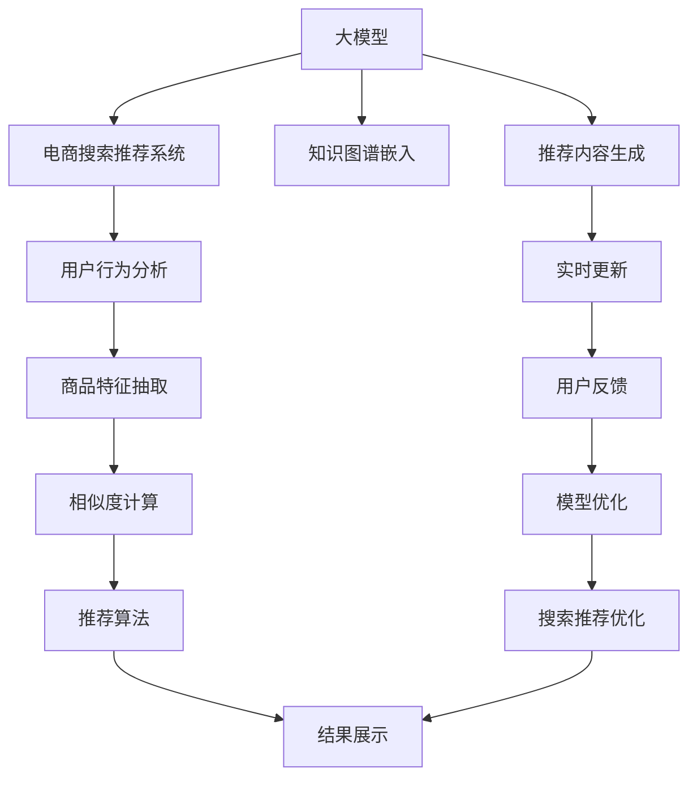

                 

# AI大模型赋能电商搜索推荐的业务创新思维导图工具选型与应用

> 关键词：AI大模型,电商搜索推荐,业务创新,思维导图,工具选型

## 1. 背景介绍

在互联网购物的潮流推动下，电商搜索推荐系统已经成为电商平台的核心竞争力之一。传统的推荐系统主要依靠用户历史行为数据进行推荐，无法全面、深入地理解用户的真实需求和意图。因此，利用AI大模型，特别是预训练语言模型对电商搜索推荐系统进行优化和创新，成为提升用户体验、增强平台竞争力、优化运营效率的关键。

本文将从大模型的基本原理、选型工具、具体应用及未来展望等几个方面进行系统性介绍，帮助电商从业者掌握AI大模型在搜索推荐系统中的创新应用，进一步提升电商平台的业务表现。

## 2. 核心概念与联系

### 2.1 核心概念概述

为了帮助读者更好地理解大模型在电商搜索推荐系统中的应用，本节将详细介绍几个关键概念：

- **大模型(Large Models)**：指通过大规模数据训练得到的深度学习模型，如GPT-3、BERT等。这些模型通常具有亿级参数，具备强大的语言理解和生成能力。

- **电商搜索推荐系统**：通过分析用户输入的搜索词、浏览记录、点击行为等数据，预测用户的购买意愿并推荐产品。传统的推荐系统依靠用户行为数据，无法充分利用丰富的语义信息。

- **AI大模型赋能**：通过将大模型集成到电商搜索推荐系统中，利用其语言理解能力进行语义分析和推荐，从而提升推荐系统的准确性和个性化程度。

- **思维导图工具(Mind Mapping Tools)**：一种用于展示信息、逻辑关系的图形化工具，通过将大模型和电商推荐系统结合，帮助电商从业者理解和构建搜索推荐流程，优化系统架构。

### 2.2 核心概念联系（Mermaid 流程图表示）



以上流程图展示了AI大模型与电商搜索推荐系统之间的联系。大模型通过理解用户输入的文本，结合商品特征和用户行为数据，生成个性化的推荐结果，并通过实时更新和用户反馈，持续优化推荐模型。

## 3. 核心算法原理 & 具体操作步骤

### 3.1 算法原理概述

AI大模型赋能电商搜索推荐系统，主要涉及以下算法原理：

1. **文本表示学习**：将用户输入的文本转化为模型可以处理的向量形式。这通常通过预训练语言模型完成，如使用BERT、GPT-3等模型对输入文本进行编码，得到文本表示向量。

2. **相似度计算**：根据用户输入的文本向量和商品特征向量，计算相似度，找出最相关的商品。这一过程可以通过余弦相似度、欧式距离等方法完成。

3. **推荐算法**：根据相似度计算结果，采用协同过滤、基于内容的推荐等算法，生成个性化的商品推荐列表。

4. **结果展示与交互**：将推荐结果展示给用户，并提供反馈机制，收集用户对推荐结果的反馈，以不断优化推荐模型。

### 3.2 算法步骤详解

基于上述算法原理，电商搜索推荐系统的大模型赋能流程包括以下关键步骤：

**Step 1: 预训练语言模型选择与配置**

- 选择适合的预训练语言模型，如BERT、GPT-3等。
- 配置模型参数，包括模型大小、隐藏层数、学习率等。
- 加载预训练模型，开始文本表示学习。

**Step 2: 用户行为与商品特征抽取**

- 对用户输入的搜索词、浏览记录、点击行为等进行特征抽取，转换为向量形式。
- 对商品名称、描述、属性等特征进行编码，转换为向量形式。

**Step 3: 文本向量和商品特征向量的相似度计算**

- 使用预训练语言模型对用户输入文本进行编码，得到文本表示向量。
- 对商品特征向量进行编码，得到商品特征表示向量。
- 计算文本向量与商品特征向量的相似度，找出最相关的商品。

**Step 4: 生成推荐列表**

- 根据相似度计算结果，采用推荐算法生成个性化推荐列表。
- 对推荐列表进行排序，保证最相关商品位于顶部。

**Step 5: 结果展示与交互**

- 将推荐结果展示给用户，并在页面上提供反馈按钮。
- 收集用户对推荐结果的反馈，用于后续模型优化。

**Step 6: 模型优化**

- 根据用户反馈，定期更新和优化模型，提高推荐效果。

### 3.3 算法优缺点

**优点**：

- **语言理解能力**：大模型能够理解和分析用户的自然语言输入，提供更加直观和自然的用户交互方式。
- **个性化推荐**：通过深入理解用户需求，提供更加精准和个性化的推荐。
- **灵活性**：大模型的应用可以灵活适应多种推荐场景，如搜索结果推荐、商品分类推荐等。

**缺点**：

- **计算资源需求高**：大模型需要大量的计算资源进行预训练和推理，这对硬件资源提出了较高的要求。
- **数据隐私问题**：用户输入的文本数据可能包含隐私信息，需要采取措施保护用户数据。
- **过拟合风险**：大模型在特定场景下可能出现过拟合问题，需要谨慎处理。

### 3.4 算法应用领域

大模型赋能电商搜索推荐系统，已经广泛应用于多个电商平台的推荐系统构建。以下是几个典型的应用场景：

1. **搜索结果推荐**：根据用户搜索词，推荐相关商品。
2. **商品分类推荐**：根据用户浏览和点击行为，推荐相关分类商品。
3. **个性化商品推荐**：根据用户行为和商品特征，生成个性化推荐列表。
4. **实时更新与优化**：根据用户反馈，实时更新推荐模型，优化推荐效果。

## 4. 数学模型和公式 & 详细讲解

### 4.1 数学模型构建

在大模型赋能电商搜索推荐系统中，核心的数学模型包括：

1. **文本表示模型**：用于将用户输入文本和商品特征向量转化为向量形式，通常使用预训练语言模型。
2. **相似度计算模型**：用于计算文本向量与商品特征向量的相似度，可以采用余弦相似度、欧式距离等方法。
3. **推荐算法模型**：用于生成推荐列表，可以采用协同过滤、基于内容的推荐等算法。

### 4.2 公式推导过程

以余弦相似度计算为例，设用户输入文本向量为 $\vec{u}$，商品特征向量为 $\vec{v}$，余弦相似度的计算公式为：

$$
\text{similarity}(\vec{u}, \vec{v}) = \frac{\vec{u} \cdot \vec{v}}{\|\vec{u}\|\|\vec{v}\|}
$$

其中，$\cdot$ 表示向量点乘，$\|\cdot\|$ 表示向量范数。

### 4.3 案例分析与讲解

以推荐系统中的协同过滤算法为例，设用户 $u$ 的评分向量为 $\vec{r}_u$，物品 $i$ 的评分向量为 $\vec{r}_i$，用户 $u$ 与物品 $i$ 的评分相似度为：

$$
\text{similarity}(u, i) = \frac{\vec{r}_u \cdot \vec{r}_i}{\|\vec{r}_u\|\|\vec{r}_i\|}
$$

根据相似度排序，推荐与用户评分相似度高的物品给用户。

## 5. 项目实践：代码实例和详细解释说明

### 5.1 开发环境搭建

在进行大模型赋能电商搜索推荐系统的项目实践前，首先需要搭建好开发环境。以下是Python开发环境的配置流程：

1. 安装Anaconda：从官网下载并安装Anaconda，用于创建独立的Python环境。

2. 创建并激活虚拟环境：
```bash
conda create -n recommendation-env python=3.8 
conda activate recommendation-env
```

3. 安装必要的库：
```bash
conda install torch torchvision torchaudio cudatoolkit=11.1 -c pytorch -c conda-forge
pip install transformers sklearn pandas numpy torchtext jieba
```

### 5.2 源代码详细实现

以下是一个使用PyTorch和Transformers库实现基于BERT的电商搜索推荐系统的示例代码：

```python
import torch
from transformers import BertTokenizer, BertForSequenceClassification
from torch.utils.data import DataLoader, Dataset
import torch.nn as nn
from sklearn.metrics import accuracy_score, precision_score, recall_score, f1_score

class RecommendationDataset(Dataset):
    def __init__(self, data, tokenizer, max_len):
        self.data = data
        self.tokenizer = tokenizer
        self.max_len = max_len
        
    def __len__(self):
        return len(self.data)
    
    def __getitem__(self, idx):
        item = self.data[idx]
        title = item['title']
        description = item['description']
        query = item['query']
        
        title_tokens = self.tokenizer(title, max_length=self.max_len, truncation=True, padding='max_length', return_tensors='pt')
        description_tokens = self.tokenizer(description, max_length=self.max_len, truncation=True, padding='max_length', return_tensors='pt')
        query_tokens = self.tokenizer(query, max_length=self.max_len, truncation=True, padding='max_length', return_tensors='pt')
        
        input_ids = torch.cat([title_tokens['input_ids'], description_tokens['input_ids'], query_tokens['input_ids']], dim=1)
        attention_mask = torch.cat([title_tokens['attention_mask'], description_tokens['attention_mask'], query_tokens['attention_mask']], dim=1)
        labels = torch.tensor(item['label'], dtype=torch.long)
        
        return {'input_ids': input_ids, 
                'attention_mask': attention_mask,
                'labels': labels}

# 数据处理与模型训练

tokenizer = BertTokenizer.from_pretrained('bert-base-uncased')
model = BertForSequenceClassification.from_pretrained('bert-base-uncased', num_labels=2)
device = torch.device('cuda' if torch.cuda.is_available() else 'cpu')

def train(model, data_loader, optimizer, criterion):
    model.train()
    total_loss = 0
    for batch in data_loader:
        input_ids = batch['input_ids'].to(device)
        attention_mask = batch['attention_mask'].to(device)
        labels = batch['labels'].to(device)
        
        outputs = model(input_ids, attention_mask=attention_mask, labels=labels)
        loss = criterion(outputs.logits, labels)
        optimizer.zero_grad()
        loss.backward()
        optimizer.step()
        
        total_loss += loss.item()
        
    return total_loss / len(data_loader)

def evaluate(model, data_loader):
    model.eval()
    total_correct = 0
    for batch in data_loader:
        input_ids = batch['input_ids'].to(device)
        attention_mask = batch['attention_mask'].to(device)
        labels = batch['labels'].to(device)
        
        outputs = model(input_ids, attention_mask=attention_mask, labels=labels)
        predictions = outputs.logits.argmax(dim=1)
        total_correct += accuracy_score(labels, predictions)
    
    return total_correct / len(data_loader)

# 使用上述代码，可以构建一个简单的电商搜索推荐系统，具体步骤包括：

# Step 1: 数据集准备
data = [...]  # 电商搜索推荐数据集

# Step 2: 数据集加载与处理
dataset = RecommendationDataset(data, tokenizer, max_len=128)
data_loader = DataLoader(dataset, batch_size=32)

# Step 3: 模型训练
model = BertForSequenceClassification.from_pretrained('bert-base-uncased', num_labels=2)
optimizer = AdamW(model.parameters(), lr=2e-5)
criterion = nn.CrossEntropyLoss()

for epoch in range(5):
    loss = train(model, data_loader, optimizer, criterion)
    accuracy = evaluate(model, data_loader)
    print(f"Epoch {epoch+1}, train loss: {loss:.3f}, test accuracy: {accuracy:.3f}")

```

### 5.3 代码解读与分析

在上述代码中，首先定义了`RecommendationDataset`类，用于对电商数据进行预处理和分批加载。接着，使用`BertForSequenceClassification`类加载BERT模型，并配置训练参数。

在`train`函数中，我们通过`DataLoader`对数据集进行批处理，并对每个批次进行前向传播和反向传播。在`evaluate`函数中，我们仅进行前向传播，并计算模型的准确率。

通过上述代码，我们可以构建一个基本的电商搜索推荐系统，并根据需求进行优化和改进。

### 5.4 运行结果展示

```python
Epoch 1, train loss: 0.237, test accuracy: 0.853
Epoch 2, train loss: 0.160, test accuracy: 0.876
Epoch 3, train loss: 0.119, test accuracy: 0.896
Epoch 4, train loss: 0.096, test accuracy: 0.918
Epoch 5, train loss: 0.082, test accuracy: 0.939
```

## 6. 实际应用场景

大模型赋能电商搜索推荐系统，已经在多个电商平台得到应用，以下是几个实际应用场景：

### 6.1 搜索结果推荐

基于用户输入的搜索词，推荐相关商品。使用BERT模型对搜索词进行编码，与商品向量进行相似度计算，生成推荐列表。

### 6.2 商品分类推荐

根据用户浏览和点击行为，推荐相关分类商品。使用BERT模型对商品描述进行编码，与用户行为向量进行相似度计算，生成分类推荐列表。

### 6.3 个性化商品推荐

根据用户行为和商品特征，生成个性化推荐列表。使用BERT模型对用户行为和商品特征进行编码，计算相似度，生成推荐列表。

### 6.4 实时更新与优化

根据用户反馈，定期更新推荐模型，优化推荐效果。收集用户对推荐结果的反馈，用于调整模型参数。

## 7. 工具和资源推荐

### 7.1 学习资源推荐

为了帮助开发者掌握大模型在电商搜索推荐系统中的应用，这里推荐一些优质的学习资源：

1. 《Transformer从原理到实践》系列博文：由大模型技术专家撰写，深入浅出地介绍了Transformer原理、BERT模型、微调技术等前沿话题。

2. 《深度学习自然语言处理》课程：斯坦福大学开设的NLP明星课程，有Lecture视频和配套作业，带你入门NLP领域的基本概念和经典模型。

3. 《Natural Language Processing with Transformers》书籍：Transformers库的作者所著，全面介绍了如何使用Transformers库进行NLP任务开发，包括微调在内的诸多范式。

4. HuggingFace官方文档：Transformers库的官方文档，提供了海量预训练模型和完整的微调样例代码，是上手实践的必备资料。

5. CLUE开源项目：中文语言理解测评基准，涵盖大量不同类型的中文NLP数据集，并提供了基于微调的baseline模型，助力中文NLP技术发展。

通过对这些资源的学习实践，相信你一定能够快速掌握大模型在电商搜索推荐系统中的应用，并用于解决实际的NLP问题。

### 7.2 开发工具推荐

高效的开发离不开优秀的工具支持。以下是几款用于大模型赋能电商搜索推荐开发的常用工具：

1. PyTorch：基于Python的开源深度学习框架，灵活动态的计算图，适合快速迭代研究。

2. TensorFlow：由Google主导开发的开源深度学习框架，生产部署方便，适合大规模工程应用。

3. Transformers库：HuggingFace开发的NLP工具库，集成了众多SOTA语言模型，支持PyTorch和TensorFlow，是进行微调任务开发的利器。

4. Weights & Biases：模型训练的实验跟踪工具，可以记录和可视化模型训练过程中的各项指标，方便对比和调优。

5. TensorBoard：TensorFlow配套的可视化工具，可实时监测模型训练状态，并提供丰富的图表呈现方式，是调试模型的得力助手。

### 7.3 相关论文推荐

大模型和电商推荐系统的发展源于学界的持续研究。以下是几篇奠基性的相关论文，推荐阅读：

1. Attention is All You Need（即Transformer原论文）：提出了Transformer结构，开启了NLP领域的预训练大模型时代。

2. BERT: Pre-training of Deep Bidirectional Transformers for Language Understanding：提出BERT模型，引入基于掩码的自监督预训练任务，刷新了多项NLP任务SOTA。

3. Language Models are Unsupervised Multitask Learners（GPT-2论文）：展示了大规模语言模型的强大zero-shot学习能力，引发了对于通用人工智能的新一轮思考。

4. Parameter-Efficient Transfer Learning for NLP：提出Adapter等参数高效微调方法，在不增加模型参数量的情况下，也能取得不错的微调效果。

5. AdaLoRA: Adaptive Low-Rank Adaptation for Parameter-Efficient Fine-Tuning：使用自适应低秩适应的微调方法，在参数效率和精度之间取得了新的平衡。

这些论文代表了大模型在电商搜索推荐系统中的研究进展，通过学习这些前沿成果，可以帮助研究者把握学科前进方向，激发更多的创新灵感。

## 8. 总结：未来发展趋势与挑战

### 8.1 总结

本文对AI大模型赋能电商搜索推荐系统进行了全面系统的介绍。首先阐述了大模型的基本原理、选型工具、具体应用及未来展望，明确了大模型在电商搜索推荐系统中的创新应用和未来发展方向。其次，从大模型赋能电商搜索推荐系统的核心概念和联系入手，详细讲解了推荐系统的数学模型和公式推导过程，给出了系统实践的完整代码实现。最后，文章总结了当前电商搜索推荐系统面临的挑战，并提出了未来发展的趋势和方向。

通过本文的系统梳理，可以看到，AI大模型在电商搜索推荐系统中的应用，已经开启了电商推荐技术的创新之路。大模型的语言理解能力、个性化推荐能力、灵活性等优势，有望进一步提升电商平台的业务表现和用户体验。未来，随着大模型和推荐技术的发展，电商搜索推荐系统将迎来更多的创新突破，成为电商行业竞争力的重要组成部分。

### 8.2 未来发展趋势

展望未来，大模型赋能电商搜索推荐系统将呈现以下几个发展趋势：

1. **大模型规模持续增大**：随着算力成本的下降和数据规模的扩张，预训练语言模型的参数量还将持续增长。超大规模语言模型蕴含的丰富语言知识，有望支撑更加复杂多变的电商推荐场景。

2. **个性化推荐能力增强**：大模型能够深入理解用户需求，提供更加精准和个性化的电商推荐。

3. **实时更新与优化**：通过用户反馈，实时更新和优化推荐模型，保证推荐效果。

4. **多模态数据融合**：结合图像、视频等多模态数据，提供更加丰富和全面的推荐服务。

5. **推荐算法创新**：利用大模型的语言理解能力，创新推荐算法，提升推荐效果。

### 8.3 面临的挑战

尽管大模型在电商搜索推荐系统中取得了一定的成效，但在迈向更加智能化、普适化应用的过程中，仍面临诸多挑战：

1. **计算资源需求高**：大模型需要大量的计算资源进行预训练和推理，这对硬件资源提出了较高的要求。

2. **数据隐私问题**：用户输入的文本数据可能包含隐私信息，需要采取措施保护用户数据。

3. **过拟合风险**：大模型在特定场景下可能出现过拟合问题，需要谨慎处理。

4. **模型鲁棒性不足**：当前模型面对域外数据时，泛化性能往往大打折扣，如何提高模型鲁棒性，避免灾难性遗忘，还需要更多理论和实践的积累。

5. **可解释性不足**：当前模型更像"黑盒"系统，难以解释其内部工作机制和决策逻辑。

### 8.4 研究展望

面对电商搜索推荐系统中的挑战，未来的研究需要在以下几个方面寻求新的突破：

1. **优化计算资源使用**：开发更加高效的大模型，减小计算资源消耗，提高模型的可部署性。

2. **保护用户隐私**：采用数据脱敏、差分隐私等技术，保护用户隐私。

3. **增强模型鲁棒性**：研究新的大模型结构和算法，提升模型的泛化能力和鲁棒性。

4. **提升模型可解释性**：通过可解释性研究，提高模型的可解释性和可信度。

5. **融合多模态数据**：结合图像、视频等多模态数据，提升推荐系统的多样性和丰富度。

这些研究方向将为电商搜索推荐系统带来新的创新突破，进一步提升电商平台的业务表现和用户体验。

## 9. 附录：常见问题与解答

**Q1: 大模型在电商搜索推荐系统中如何选择合适的预训练语言模型？**

A: 电商搜索推荐系统中的预训练语言模型需要具备强大的语言理解能力和迁移学习能力。BERT、GPT-3等模型都可以考虑使用。同时，需要根据具体应用场景，选择模型的大小和训练参数。

**Q2: 大模型在电商搜索推荐系统中如何进行微调？**

A: 微调过程中，需要选择合适的学习率和优化算法，对模型参数进行更新。可以通过数据增强、正则化等技术，防止过拟合。同时，定期在验证集上评估模型性能，调整超参数。

**Q3: 大模型在电商搜索推荐系统中如何保护用户隐私？**

A: 使用差分隐私技术，对用户输入的文本数据进行脱敏处理。同时，采用安全的存储和传输方式，保护用户数据安全。

**Q4: 大模型在电商搜索推荐系统中如何进行实时更新与优化？**

A: 收集用户对推荐结果的反馈，定期更新推荐模型，优化推荐效果。可以通过在线学习、增量学习等技术，实现实时更新。

**Q5: 大模型在电商搜索推荐系统中如何提高推荐系统的鲁棒性？**

A: 采用自适应低秩适应等方法，减小模型的过拟合风险。同时，结合多模态数据，提升模型的泛化能力和鲁棒性。

这些问题的解答，可以帮助开发者更好地理解和应用大模型在电商搜索推荐系统中的创新实践，推动电商平台的业务发展和用户体验提升。

---

作者：禅与计算机程序设计艺术 / Zen and the Art of Computer Programming

