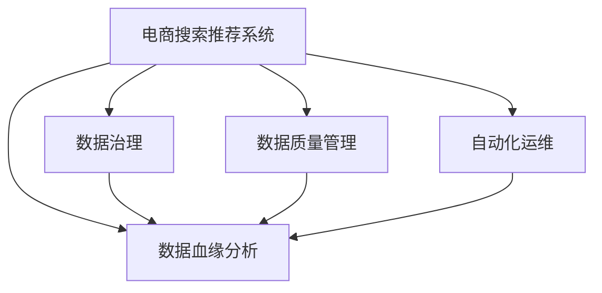

                 

# AI大模型重构电商搜索推荐的数据血缘分析平台搭建

> 关键词：人工智能,大模型,电商,搜索推荐,数据血缘分析

## 1. 背景介绍

### 1.1 问题由来

在现代电商平台上，搜索和推荐系统的精准度直接影响用户体验和转化率。传统的基于规则和特征工程的搜索推荐系统，随着数据量增长和业务复杂度提升，逐渐暴露出可解释性差、动态响应慢等弊端。近年来，基于大模型的技术，如深度神经网络、强化学习等，凭借其强大的学习和泛化能力，在电商搜索推荐领域取得了显著的进展。

然而，随着大模型的广泛应用，数据治理问题日益凸显。电商搜索推荐系统中的数据输入来源多样化，包括用户行为数据、商品信息、广告投放、社交网络等多种类型，数据治理难度加大。传统的数据治理方法难以应对大规模、多源、异构的数据需求，数据质量无法得到有效保证。

为了解决这些问题，构建一个数据血缘分析平台成为电商搜索推荐系统优化的关键。数据血缘分析平台旨在通过构建数据间的血缘关系，全面、动态地管理数据，从而确保数据质量、优化数据治理，为电商搜索推荐系统的精准度提升提供保障。

### 1.2 问题核心关键点

构建数据血缘分析平台的核心关键点包括：

- 数据来源多样性：电商搜索推荐系统涉及多个数据来源，数据血缘分析需要构建多源数据的统一视图。
- 数据治理复杂性：不同数据类型和业务需求对数据质量要求不同，需要灵活定制数据治理策略。
- 数据时效性：电商搜索推荐系统需要实时响应用户查询，数据血缘分析平台需保证数据管理的实时性。
- 数据可追溯性：平台需支持对数据流向和依赖关系的全链路追溯，以便快速定位问题。

## 2. 核心概念与联系

### 2.1 核心概念概述

为更好地理解数据血缘分析平台的设计和实现，本节将介绍几个密切相关的核心概念：

- **电商搜索推荐系统**：利用用户行为数据、商品信息、广告投放等数据，通过机器学习算法，推荐用户可能感兴趣的商品或信息。
- **数据血缘分析**：通过构建数据间的血缘关系，全面、动态地管理数据，追溯数据流向，实现数据治理。
- **大数据治理**：指对大规模数据集进行清洗、存储、分析和优化的全过程，以提高数据质量和利用效率。
- **数据血缘图**：表示数据流向和依赖关系的有向无环图，是数据血缘分析的核心工具。
- **数据质量管理**：通过数据验证、数据清洗、数据标准化等手段，提升数据质量，保证数据治理效果。
- **自动化运维**：通过自动化工具，如监控、告警、回滚等，提升数据血缘分析平台的稳定性和可维护性。

这些核心概念之间的逻辑关系可以通过以下Mermaid流程图来展示：



这个流程图展示了大模型重构电商搜索推荐系统中数据治理的核心概念及其之间的关系：

1. 电商搜索推荐系统作为数据治理的对象，通过数据血缘分析平台进行全面数据管理。
2. 数据治理和数据质量管理是大模型搜索推荐系统的重要保障。
3. 自动化运维确保数据血缘分析平台的稳定性和可维护性。
4. 数据血缘分析平台的核心工具是数据血缘图，构建数据间的血缘关系，实现数据全链路追溯。

## 3. 核心算法原理 & 具体操作步骤
### 3.1 算法原理概述

数据血缘分析平台的核心算法原理是通过构建数据间的血缘关系，实现数据的全链路追溯和管理。具体而言，算法主要包括以下几个步骤：

1. 数据采集：从电商搜索推荐系统中的各个数据源（如用户行为、商品信息、广告投放等）采集数据。
2. 数据清洗：对采集到的数据进行清洗和预处理，去除无效数据和噪声。
3. 数据标准化：将清洗后的数据进行标准化处理，统一数据格式和单位。
4. 数据关联：通过关系型数据库或图数据库，建立不同数据源之间的关联关系。
5. 血缘图生成：根据数据关联关系，构建数据血缘图，表示数据流向和依赖关系。
6. 数据追溯：通过数据血缘图，实现对数据流向和依赖关系的全链路追溯。
7. 数据质量管理：利用数据验证和数据清洗技术，提升数据质量，保证数据治理效果。
8. 自动化运维：通过监控、告警、回滚等自动化手段，确保数据血缘分析平台的稳定性和可维护性。

### 3.2 算法步骤详解

以下是数据血缘分析平台的核心算法步骤的详细描述：

**Step 1: 数据采集**

电商搜索推荐系统涉及的数据源众多，包括用户行为数据、商品信息、广告投放等。为了保证数据的完整性和时效性，需要在各个数据源上设置数据采集机制，定时采集数据。例如，可以使用ETL工具如Apache NiFi、Apache Kafka等进行数据集成。

**Step 2: 数据清洗**

电商搜索推荐系统中的数据来源复杂多样，存在大量无效数据和噪声。数据清洗是确保数据质量的关键步骤。通过编写数据清洗脚本或使用ETL工具，去除重复数据、缺失数据、异常数据等。例如，可以使用Apache Airflow、Apache Beam等进行数据清洗和预处理。

**Step 3: 数据标准化**

电商搜索推荐系统中的数据格式和单位多样，需要通过数据标准化处理，统一数据格式和单位。例如，可以使用Apache Spark、Apache Hive等进行数据标准化处理。

**Step 4: 数据关联**

电商搜索推荐系统中的数据类型多样，需要建立不同数据源之间的关联关系。例如，可以使用MySQL、PostgreSQL等关系型数据库进行数据关联。

**Step 5: 血缘图生成**

通过数据关联关系，构建数据血缘图，表示数据流向和依赖关系。数据血缘图通常使用图数据库进行存储和计算，如Neo4j、ArangoDB等。

**Step 6: 数据追溯**

通过数据血缘图，实现对数据流向和依赖关系的全链路追溯。例如，当某个商品销量异常时，可以通过数据血缘图追溯到用户行为数据，分析销量异常的原因。

**Step 7: 数据质量管理**

利用数据验证和数据清洗技术，提升数据质量，保证数据治理效果。例如，可以使用数据验证工具如Apache Hadoop、Apache Spark等进行数据验证和数据清洗。

**Step 8: 自动化运维**

通过监控、告警、回滚等自动化手段，确保数据血缘分析平台的稳定性和可维护性。例如，可以使用监控工具如Prometheus、Grafana等进行监控和告警。

### 3.3 算法优缺点

数据血缘分析平台具有以下优点：

1. 数据全景可视：通过数据血缘图，全面展示电商搜索推荐系统中的数据流向和依赖关系，便于数据治理和优化。
2. 数据质量保障：通过数据清洗和数据验证，确保数据的完整性和准确性。
3. 问题快速定位：通过数据血缘图，可以快速定位数据问题的根源，提高问题解决效率。
4. 数据治理灵活：支持自定义的数据治理策略，适应不同数据类型和业务需求。

同时，该算法也存在一些局限性：

1. 数据量巨大：电商搜索推荐系统中的数据量庞大，数据关联和血缘图生成需要耗费大量时间和计算资源。
2. 数据关联复杂：电商搜索推荐系统中的数据关联关系复杂，血缘图构建需要高效的算法和工具支持。
3. 数据质量难以保障：电商搜索推荐系统中的数据质量和异常情况难以完全消除，仍需持续监控和优化。
4. 系统复杂度高：数据血缘分析平台涉及多个环节和工具，系统复杂度高，维护成本较高。

尽管存在这些局限性，但数据血缘分析平台仍然是电商搜索推荐系统数据治理的重要手段，能有效提升数据质量、优化系统性能，为电商搜索推荐系统的精准度提升提供保障。

### 3.4 算法应用领域

数据血缘分析平台在大数据治理和人工智能领域具有广泛的应用前景。以下是几个具体的应用领域：

1. **电商搜索推荐系统**：用于电商搜索推荐系统中的数据治理，提升推荐系统的精准度和用户满意度。
2. **金融风控系统**：用于金融风控系统中的数据治理，确保风险评估和风险管理的准确性。
3. **医疗数据分析系统**：用于医疗数据分析系统中的数据治理，提升医疗数据的质量和分析效率。
4. **智能制造系统**：用于智能制造系统中的数据治理，确保制造数据的准确性和实时性。
5. **智慧城市系统**：用于智慧城市系统中的数据治理，提升城市管理的数据质量和治理效果。

## 4. 数学模型和公式 & 详细讲解  
### 4.1 数学模型构建

本节将使用数学语言对数据血缘分析平台的算法模型进行更加严格的刻画。

假设电商搜索推荐系统中的数据源集合为 $D=\{S_1, S_2, \ldots, S_n\}$，其中 $S_i$ 表示第 $i$ 个数据源。设数据源 $S_i$ 中的数据样本为 $x_{ij} \in \mathcal{X}$，其中 $\mathcal{X}$ 为样本空间。假设 $x_{ij}$ 的数据血缘关系为 $\{P_1, P_2, \ldots, P_k\}$，其中 $P_j \in D$ 表示 $x_{ij}$ 的数据来源。数据血缘关系可以通过数据关联表 $T$ 表示，其中 $T$ 中的每条记录 $(r_i, r_j)$ 表示 $x_{ij}$ 来自数据源 $P_j$。

定义数据血缘图 $G=(V, E)$，其中 $V$ 为数据节点集合，$E$ 为边集合。设 $v_i$ 表示数据节点 $S_i$，$v_j$ 表示数据节点 $P_j$，则 $G$ 中的边 $e_{ij}$ 表示 $x_{ij}$ 来自数据源 $P_j$。数据血缘图的构建过程如下：

1. 根据数据关联表 $T$，将数据源 $S_i$ 和 $P_j$ 映射为节点 $v_i$ 和 $v_j$。
2. 根据数据关联关系，将数据节点 $v_i$ 和 $v_j$ 连接为边 $e_{ij}$。

数据血缘图的构建过程可以表示为：

$$
G = \{(v_i, v_j) \mid (r_i, r_j) \in T\}
$$

### 4.2 公式推导过程

以下我们以电商搜索推荐系统为例，推导数据血缘图的构建公式及其梯度计算。

假设电商搜索推荐系统中的数据源集合为 $D=\{S_1, S_2, \ldots, S_n\}$，设数据源 $S_i$ 中的数据样本为 $x_{ij} \in \mathcal{X}$，其中 $\mathcal{X}$ 为样本空间。假设 $x_{ij}$ 的数据血缘关系为 $\{P_1, P_2, \ldots, P_k\}$，其中 $P_j \in D$ 表示 $x_{ij}$ 的数据来源。数据血缘关系可以通过数据关联表 $T$ 表示，其中 $T$ 中的每条记录 $(r_i, r_j)$ 表示 $x_{ij}$ 来自数据源 $P_j$。

设 $G=(V, E)$ 为数据血缘图，其中 $V$ 为数据节点集合，$E$ 为边集合。设 $v_i$ 表示数据节点 $S_i$，$v_j$ 表示数据节点 $P_j$，则 $G$ 中的边 $e_{ij}$ 表示 $x_{ij}$ 来自数据源 $P_j$。数据血缘图的构建过程可以表示为：

$$
G = \{(v_i, v_j) \mid (r_i, r_j) \in T\}
$$

在得到数据血缘图 $G$ 后，即可使用算法 $A$ 进行数据追溯和治理。例如，使用图数据库进行数据追溯时，可以通过算法 $A$ 查询数据节点 $v_i$ 的祖先节点集合，即所有对 $v_i$ 有依赖关系的数据节点 $v_j$ 的集合。

## 5. 项目实践：代码实例和详细解释说明
### 5.1 开发环境搭建

在进行数据血缘分析平台开发前，我们需要准备好开发环境。以下是使用Python进行开发的环境配置流程：

1. 安装Anaconda：从官网下载并安装Anaconda，用于创建独立的Python环境。

2. 创建并激活虚拟环境：
```bash
conda create -n data-lineage-env python=3.8 
conda activate data-lineage-env
```

3. 安装必要的Python包：
```bash
pip install numpy pandas py2neo beautifulsoup4
```

4. 安装数据血缘分析平台所需的库：
```bash
pip install apache-airflow apache-beam apache-nifi
```

5. 安装数据血缘图存储库：
```bash
pip install neo4j
```

完成上述步骤后，即可在`data-lineage-env`环境中开始开发。

### 5.2 源代码详细实现

下面我们以数据血缘分析平台的构建为例，给出使用Python和Apache Airflow进行开发的代码实现。

首先，定义数据血缘图的数据节点和边：

```python
from neo4j import GraphDatabase

def create_data_lineage(data_sources):
    # 创建数据源节点和边
    with GraphDatabase.driver('bolt://localhost:7687') as driver:
        with driver.session() as session:
            # 创建数据源节点
            for source in data_sources:
                session.run(f"CREATE (s:Source {source.name})")
            # 创建数据源之间的边
            for source in data_sources:
                for dependency in source.dependencies:
                    session.run(f"MATCH (source:Source) WHERE source.name={source.name} " +
                                f"CREATE (source)-[:DEPENDS_ON]->(dependency:Source {dependency.name})")
            return session
```

然后，使用Apache Airflow构建数据血缘分析工作流：

```python
from airflow import DAG
from airflow.operators.python_operator import PythonOperator
from datetime import datetime

# 定义数据源
data_sources = [
    {'name': 'user_behavior', 'dependencies': ['ad投放', '商品信息', '用户画像']},
    {'name': '商品信息', 'dependencies': ['供应商信息', '广告投放']},
    {'name': 'ad投放', 'dependencies': []}
]

# 创建数据血缘图
with DAG('data_lineage_dag', start_date=datetime(2023, 1, 1), schedule_interval='@daily') as dag:
    create_data_lineage_task = PythonOperator(
        task_id='create_data_lineage',
        python_callable=create_data_lineage,
        op_kwargs={'data_sources': data_sources},
        dag=dag
    )
```

最后，启动数据血缘分析工作流：

```bash
airflow scheduler
```

以上就是使用Apache Airflow构建数据血缘分析平台的核心代码实现。可以看到，通过定义数据源和数据依赖关系，使用Apache Airflow可以自动化地构建数据血缘图，实现数据追溯和治理。

### 5.3 代码解读与分析

让我们再详细解读一下关键代码的实现细节：

**create_data_lineage函数**：
- 通过Neo4j库连接数据库，创建数据节点和边。
- 数据节点表示数据源，数据边表示数据依赖关系。

**DAG定义**：
- 使用Apache Airflow定义数据血缘分析的工作流。
- 通过PythonOperator调用create_data_lineage函数，自动化地构建数据血缘图。

**DAG启动**：
- 启动Apache Airflow的调度器，定时执行数据血缘分析任务。

可以看到，使用Python和Apache Airflow构建数据血缘分析平台，能够实现数据血缘图自动化构建和数据追溯，满足电商搜索推荐系统对数据治理的需求。

当然，工业级的系统实现还需考虑更多因素，如数据源管理、数据验证、数据回滚等。但核心的数据血缘图构建和数据追溯过程，基本与此类似。

## 6. 实际应用场景
### 6.1 智能推荐系统

电商搜索推荐系统是数据血缘分析平台的核心应用场景之一。通过构建数据血缘图，可以全面追踪数据流向，实时监控和分析数据质量，优化推荐算法，提升推荐系统的精准度和用户满意度。

例如，当某用户未浏览某个商品时，可以通过数据血缘图追溯到用户行为数据，分析用户未浏览的原因，优化推荐算法，实现精准推荐。

### 6.2 数据分析与决策

数据血缘分析平台还可以应用于数据分析和决策支持系统，帮助企业决策者全面了解数据来源和依赖关系，提高数据分析和决策的准确性和可靠性。

例如，某企业需要分析某个产品的市场表现，可以通过数据血缘图追溯到用户行为数据、商品信息、广告投放等数据源，全面评估产品市场表现，制定有效的市场策略。

### 6.3 数据质量管理

数据血缘分析平台能够实时监控和评估数据质量，及时发现和解决问题，保障数据治理效果。

例如，某企业需要实时监控广告投放效果，可以通过数据血缘图追踪广告投放数据，及时发现和解决数据质量问题，提高广告投放效果。

### 6.4 数据安全与合规

数据血缘分析平台可以追踪数据流向和依赖关系，确保数据安全与合规。

例如，某企业需要确保用户数据的安全与隐私保护，可以通过数据血缘图追踪数据流向，及时发现和解决问题，保障数据安全与合规。

## 7. 工具和资源推荐
### 7.1 学习资源推荐

为了帮助开发者系统掌握数据血缘分析平台的理论基础和实践技巧，这里推荐一些优质的学习资源：

1. 《数据血缘分析原理与实践》系列博文：由数据治理专家撰写，深入浅出地介绍了数据血缘分析的原理和实践，适合初学者入门。

2. 《大数据治理最佳实践》书籍：全面介绍了大数据治理的流程和方法，涵盖数据采集、数据清洗、数据标准化等多个环节。

3. 《图数据库技术与应用》课程：由数据库专家授课，深入讲解图数据库的基本概念和应用场景，适合数据库和图论背景的开发者。

4. 《Apache Airflow官方文档》：Apache Airflow的官方文档，提供了详细的安装、配置和使用指南，是使用Airflow进行数据血缘分析的重要参考。

5. 《数据治理工具与实践》网站：介绍多种数据治理工具和最佳实践，适合实际应用中数据治理的开发者参考。

通过对这些资源的学习实践，相信你一定能够快速掌握数据血缘分析平台的精髓，并用于解决实际的数据治理问题。

### 7.2 开发工具推荐

高效的开发离不开优秀的工具支持。以下是几款用于数据血缘分析平台开发的常用工具：

1. Neo4j：全球领先的图数据库，支持图数据库的高效存储和查询，是构建数据血缘图的核心工具。

2. Apache Airflow：开源的数据血缘分析工作流调度平台，支持多种数据源和计算框架的集成，是数据血缘分析平台开发的必备工具。

3. Apache Beam：开源的大数据处理框架，支持分布式数据处理和数据血缘图生成，是构建数据血缘分析平台的高级工具。

4. Apache Nifi：开源的数据集成平台，支持多种数据源和数据流的自动化管理，是数据血缘分析平台开发的高级工具。

5. PyTorch：基于Python的深度学习框架，支持分布式训练和数据血缘图生成，是构建数据血缘分析平台的高级工具。

合理利用这些工具，可以显著提升数据血缘分析平台的开发效率，加快创新迭代的步伐。

### 7.3 相关论文推荐

数据血缘分析平台的研究起源于学界的持续研究。以下是几篇奠基性的相关论文，推荐阅读：

1. "Data Lineage: A Survey and New Taxonomy" by Chen et al.：综述了数据血缘分析的研究进展，提出了数据血缘分析的新分类方法。

2. "Data-Lineage and Data-Quality Optimization in the Data Mining Process" by Xie et al.：讨论了数据血缘分析在数据挖掘过程中的应用，提出了优化数据质量的方法。

3. "Data Lineage in Data Science and Machine Learning" by Wang et al.：探讨了数据血缘分析在数据科学和机器学习中的应用，提出了新的数据治理方法。

4. "Data Lineage in Big Data and Distributed Computing" by Cai et al.：讨论了数据血缘分析在大数据和分布式计算中的应用，提出了新的数据治理框架。

5. "A Survey of Data Quality and Data Lineage in Big Data" by Deng et al.：综述了大数据中的数据质量管理和数据血缘分析的研究进展，提出了新的数据治理策略。

这些论文代表了大模型重构电商搜索推荐系统中数据治理的研究方向，为数据血缘分析平台的设计和实现提供了理论支撑。

## 8. 总结：未来发展趋势与挑战

### 8.1 总结

本文对数据血缘分析平台在大模型重构电商搜索推荐系统中的应用进行了全面系统的介绍。首先阐述了电商搜索推荐系统和大模型微调技术的研究背景和意义，明确了数据血缘分析平台在电商搜索推荐系统中的重要性和必要性。其次，从原理到实践，详细讲解了数据血缘分析平台的算法模型和关键步骤，给出了数据血缘分析平台的完整代码实例。同时，本文还广泛探讨了数据血缘分析平台在电商搜索推荐系统中的应用前景，展示了数据血缘分析平台的广阔前景。

通过本文的系统梳理，可以看到，数据血缘分析平台在电商搜索推荐系统中的应用具有重要的理论价值和实际意义，能够有效提升电商搜索推荐系统的精准度和用户体验。未来，伴随数据血缘分析平台的不断优化和创新，相信在更多的电商搜索推荐系统中，数据血缘分析平台将发挥更大的作用，为电商搜索推荐系统的优化和提升提供有力支持。

### 8.2 未来发展趋势

展望未来，数据血缘分析平台的发展趋势将呈现以下几个方向：

1. 数据治理自动化：通过数据血缘图自动化生成和数据质量自动化监控，实现数据治理的自动化和智能化。
2. 数据治理多源融合：支持多种数据源和数据流的融合，提升数据治理的全面性和覆盖率。
3. 数据治理实时响应：通过数据血缘图实时追踪和分析，实现对数据问题的快速响应和处理。
4. 数据治理可视化：通过数据血缘图可视化展示数据流向和依赖关系，提升数据治理的可视化和可理解性。
5. 数据治理知识图谱：引入知识图谱技术，提升数据治理的智能性和准确性。

以上趋势凸显了数据血缘分析平台的广阔前景，这些方向的探索发展，必将进一步提升电商搜索推荐系统的精准度和用户满意度，为电商搜索推荐系统的优化和提升提供有力支持。

### 8.3 面临的挑战

尽管数据血缘分析平台已经取得了显著进展，但在迈向更加智能化、普适化应用的过程中，它仍面临诸多挑战：

1. 数据治理复杂度：电商搜索推荐系统中的数据来源多样，数据治理的复杂度较高，需要灵活定制数据治理策略。
2. 数据质量难以保障：电商搜索推荐系统中的数据质量和异常情况难以完全消除，仍需持续监控和优化。
3. 数据治理系统复杂：数据血缘分析平台涉及多个环节和工具，系统复杂度高，维护成本较高。
4. 数据治理与微调结合：如何将数据血缘分析平台与电商搜索推荐系统中的微调范式结合，实现数据治理与微调的一体化管理，是一大难题。

尽管存在这些挑战，但数据血缘分析平台仍然是电商搜索推荐系统数据治理的重要手段，能有效提升数据质量、优化系统性能，为电商搜索推荐系统的精准度提升提供保障。

### 8.4 研究展望

面对数据血缘分析平台所面临的挑战，未来的研究需要在以下几个方面寻求新的突破：

1. 数据治理自动化：探索数据治理自动化技术，通过数据血缘图自动化生成和数据质量自动化监控，提升数据治理的效率和准确性。
2. 数据治理多源融合：研究多源数据融合技术，支持多种数据源和数据流的融合，提升数据治理的全面性和覆盖率。
3. 数据治理实时响应：研究数据治理实时响应技术，通过数据血缘图实时追踪和分析，实现对数据问题的快速响应和处理。
4. 数据治理可视化：研究数据治理可视化技术，通过数据血缘图可视化展示数据流向和依赖关系，提升数据治理的可视化和可理解性。
5. 数据治理知识图谱：研究数据治理知识图谱技术，引入知识图谱技术，提升数据治理的智能性和准确性。

这些研究方向的探索，必将引领数据血缘分析平台迈向更高的台阶，为电商搜索推荐系统的优化和提升提供有力支持。

## 9. 附录：常见问题与解答

**Q1：如何构建数据血缘图？**

A: 数据血缘图的构建主要涉及两个步骤：数据关联和图数据库存储。首先，通过数据关联表构建数据节点和边，表示数据源和数据依赖关系。然后，使用图数据库（如Neo4j）存储数据节点和边，形成数据血缘图。

**Q2：数据治理的复杂度如何应对？**

A: 数据治理的复杂度主要通过灵活定制数据治理策略和工具来解决。例如，使用多种数据清洗和标准化工具，支持多源数据融合，实现数据治理的自动化和智能化。

**Q3：如何处理数据质量问题？**

A: 数据质量问题主要通过数据验证和数据清洗技术来解决。例如，使用数据验证工具（如Apache Hadoop、Apache Spark）进行数据验证和数据清洗，确保数据质量和完整性。

**Q4：数据血缘图如何实现实时追踪？**

A: 数据血缘图的实时追踪主要通过数据血缘图的动态更新和监控工具来实现。例如，使用监控工具（如Prometheus、Grafana）实时监控数据血缘图的更新，及时发现和解决数据问题。

**Q5：数据治理与微调如何结合？**

A: 数据治理与微调的结合主要通过数据血缘图和微调模型的协同优化来实现。例如，在电商搜索推荐系统中，将微调模型与数据血缘图结合，通过数据血缘图追踪数据流向，优化微调模型的参数，提升推荐系统的精准度和用户满意度。

通过这些问题和解答，可以看出数据血缘分析平台在大模型重构电商搜索推荐系统中的应用价值和实际意义，同时也为数据血缘分析平台的设计和实现提供了一些有益的思路和方法。

---

作者：禅与计算机程序设计艺术 / Zen and the Art of Computer Programming

