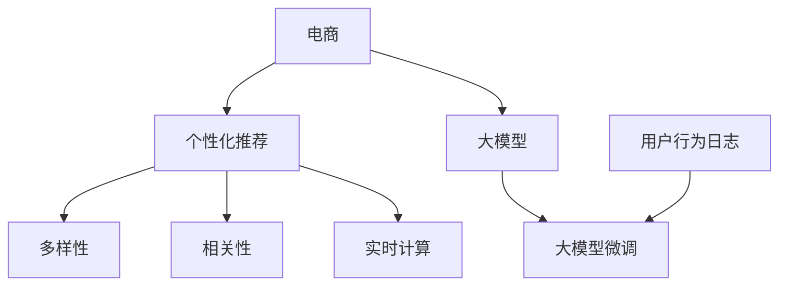

                 

# AI大模型：优化电商平台个性化推荐的多样性与相关性平衡

> 关键词：大模型, 个性化推荐, 电商, 多样性, 相关性, 推荐系统, 用户行为, 数据处理, 模型优化, 实时计算

## 1. 背景介绍

### 1.1 问题由来

随着电商市场的蓬勃发展，个性化推荐成为电商平台提升用户体验、增加转化率、增强用户粘性的核心竞争力。个性化推荐系统通过分析用户行为数据，实时预测用户兴趣，向用户推荐商品，从而实现了电商平台的精准营销。

然而，随着推荐系统规模的不断扩大，单纯基于用户历史行为的个性化推荐面临瓶颈。用户的行为和兴趣常常受环境变化、时间跨度、社会心理等多重因素影响，难以用固定模式进行刻画。此外，平台商家数量巨大、商品种类繁多，也增加了推荐系统的复杂性。

大模型技术为解决上述问题提供了新的思路。利用大模型的泛化能力和强大的语言理解能力，可以从用户的行为语料中抽取更加丰富的特征信息，提供更加精准的推荐。但在实际应用中，大模型推荐系统如何平衡多样性与相关性，避免“千人一面”的单一推荐，是一个亟需解决的难题。

### 1.2 问题核心关键点

大模型推荐系统的核心问题在于如何利用大模型的泛化能力，同时兼顾推荐的多样性和相关性，避免推荐过度同质化，确保用户能够接触到更多元化的商品，同时保证推荐与用户的真实兴趣高度相关。

具体来说，包括以下关键问题：
1. **用户行为表示**：如何将用户行为数据有效地表示为大模型的输入特征，获取其深层次语义信息。
2. **多样性与相关性平衡**：如何在推荐系统中平衡推荐结果的多样性和相关性，避免过度相似或完全不相关。
3. **实时计算与优化**：如何在保证推荐精度的情况下，优化大模型推荐系统的计算效率和响应速度。

本文将围绕这些问题，全面介绍基于大模型的电商平台个性化推荐系统，并详细阐述其实现原理和优化策略。

## 2. 核心概念与联系

### 2.1 核心概念概述

为更好地理解大模型在电商平台推荐系统中的应用，本节将介绍几个密切相关的核心概念：

- **大模型(Large Model)**：指具有亿级以上参数、在大规模数据上训练的深度学习模型。大模型具有强大的泛化能力和语言理解能力，能够从海量的文本数据中抽取丰富特征，用于各种NLP任务。
- **个性化推荐(Recommendation System, RS)**：根据用户历史行为、兴趣爱好、社交关系等个性化特征，为用户推荐商品或内容。个性化推荐系统已成为电商、社交媒体、视频平台等诸多行业的重要技术手段。
- **电商(e-commerce)**：指通过网络平台进行的商品销售、交易活动。电商平台的个性化推荐系统，可以提升用户体验，增加销售转化率，是电商成功的关键因素之一。
- **多样性(Diversity)**：指推荐结果中包含的商品种类数量，旨在避免推荐结果过于集中，增加用户的选择范围。
- **相关性(Relevance)**：指推荐结果与用户真实兴趣的匹配程度，保证推荐内容对用户有价值。
- **用户行为日志**：指用户在平台上的行为记录，包括浏览、点击、购买等操作，是推荐系统数据来源的重要组成部分。
- **大模型微调**：在大模型的基础上，针对特定推荐任务进行有监督的微调，以提升模型在特定领域的性能。
- **实时计算(Real-time Computing)**：指在数据到达时立即处理，并快速产生结果的计算模式。

这些核心概念之间的逻辑关系可以通过以下Mermaid流程图来展示：



这个流程图展示了大模型推荐系统的核心概念及其之间的关系：

1. 电商平台利用个性化推荐系统为用户推荐商品，提升用户体验。
2. 推荐系统通过收集用户行为日志，进行大模型微调，提升推荐效果。
3. 微调后的模型通过多样性、相关性控制，保证推荐结果的丰富性和相关性。
4. 在实时计算的框架下，推荐系统能够动态响应用户需求，提供实时推荐。

## 3. 核心算法原理 & 具体操作步骤

### 3.1 算法原理概述

大模型在电商平台个性化推荐中的应用，主要基于大模型微调技术。其核心思想是通过收集用户行为日志，利用大模型在海量数据上训练得到的语言表示能力，提取用户的深层次语义特征，生成个性化推荐结果。

具体来说，假设用户的行为表示为大模型输入的特征向量 $x$，推荐系统通过微调大模型 $M_{\theta}$ 得到推荐结果 $\hat{y}=M_{\theta}(x)$。推荐结果可以通过用户的点击率、转化率、满意度等指标进行评估。

微调的目标是最大化推荐系统在特定推荐任务上的性能，即：

$$
\hat{\theta}=\mathop{\arg\min}_{\theta} \mathcal{L}(M_{\theta},D)
$$

其中 $\mathcal{L}$ 为推荐系统设计的损失函数，用于衡量推荐结果与真实标签之间的差异。常见的损失函数包括交叉熵损失、均方误差损失等。

### 3.2 算法步骤详解

大模型在电商平台推荐系统中的应用，主要包括以下几个关键步骤：

**Step 1: 数据准备与预处理**
- 收集电商平台上用户的浏览、点击、购买等行为日志，作为推荐系统的训练数据。
- 清洗和标注数据，去除无用记录和噪声，提取用户的行为特征，如浏览时间、点击次数、购买频率等。
- 对数据进行划分，分为训练集、验证集和测试集。

**Step 2: 大模型微调**
- 选择合适的预训练大模型，如BERT、GPT等，作为初始化参数。
- 设计合适的任务适配层，将用户行为特征转换为模型可以理解的形式，如序列化表示、嵌入表示等。
- 选择合适的优化算法及其参数，如AdamW、SGD等，设置学习率、批大小、迭代轮数等。
- 设置正则化技术及强度，包括权重衰减、Dropout、Early Stopping等，防止模型过度适应小规模训练集。
- 应用多任务学习、联合训练等策略，提高模型的泛化能力和推荐效果。

**Step 3: 多样性与相关性控制**
- 设计合适的多样性损失函数，如L1范数、Gini指数等，限制推荐结果中相似商品的数量。
- 设计合适的相关性损失函数，如余弦相似度、注意力机制等，保证推荐结果与用户的真实兴趣高度相关。
- 结合多目标优化算法，如Pareto优化、遗传算法等，寻找多样性与相关性平衡的最佳推荐结果。

**Step 4: 实时推荐与优化**
- 部署微调后的模型，实时接收用户请求，根据用户行为特征生成推荐结果。
- 采用多级缓存、异步计算等技术，优化实时推荐的计算效率和响应速度。
- 持续收集新的用户行为数据，定期重新微调模型，以适应数据分布的变化。

以上是基于大模型的电商平台推荐系统的一般流程。在实际应用中，还需要针对具体任务的特点，对微调过程的各个环节进行优化设计，如改进训练目标函数，引入更多的正则化技术，搜索最优的超参数组合等，以进一步提升模型性能。

### 3.3 算法优缺点

大模型在电商平台推荐系统中的应用具有以下优点：
1. 提升推荐精度。利用大模型的泛化能力，可以从用户行为数据中抽取更丰富的特征，提供更加精准的推荐。
2. 适应性强。大模型具备强大的语言理解和生成能力，可以应对电商平台上商品种类繁多、商家数量巨大的复杂场景。
3. 泛化能力强。大模型在多种任务上都有优异的性能，可以迁移到其他相似的任务上，提高推荐系统的通用性。
4. 减少人工干预。大模型通过自我学习优化，减少了人工特征工程和规则设计的复杂度。

但同时，大模型推荐系统也存在一定的局限性：
1. 数据依赖性强。大模型的效果很大程度上取决于数据的质量和数量，标注数据成本较高。
2. 计算资源消耗大。大模型的参数量和计算量较大，需要高性能计算资源支持。
3. 模型复杂度高。大模型需要精细的调参和优化，模型复杂度较高，难以解释其决策过程。
4. 实时响应压力大。大模型的计算复杂度高，实时推荐的响应速度较慢，难以满足用户即时需求。

尽管存在这些局限性，但就目前而言，基于大模型的推荐系统已经成为电商推荐领域的趋势，不断推动着推荐系统的技术进步。未来相关研究的重点在于如何进一步降低数据依赖，提高模型的实时性，优化资源消耗，同时兼顾模型的可解释性和鲁棒性。

### 3.4 算法应用领域

基于大模型的电商平台个性化推荐系统已经在许多电商平台中得到广泛应用，例如：

- **京东**：通过利用大模型微调技术，提升了个性化推荐系统的推荐精度和用户体验。
- **淘宝**：利用大模型进行实时推荐，实现了商品品类推荐的高度相关性。
- **亚马逊**：采用多任务学习和大模型微调，实现了用户行为与商品匹配的精确度。
- **苏宁易购**：利用大模型进行实时推荐，提升了用户的购物体验和平台转化率。

除了上述这些典型应用外，大模型推荐系统还被创新性地应用到更多场景中，如社交媒体个性化推荐、视频平台内容推荐等，为电商推荐系统带来了新的突破。随着预训练模型和微调方法的不断进步，相信电商平台推荐系统必将在更多领域大放异彩。

## 4. 数学模型和公式 & 详细讲解

### 4.1 数学模型构建

本节将使用数学语言对基于大模型的电商平台个性化推荐过程进行更加严格的刻画。

记用户行为日志为 $\mathcal{D}=\{(x_i, y_i)\}_{i=1}^N$，其中 $x_i$ 为用户的浏览、点击、购买等行为特征，$y_i$ 为用户对应的购买行为标签。

定义推荐模型 $M_{\theta}$ 在用户行为特征 $x$ 上的预测结果为 $\hat{y}=M_{\theta}(x)$。推荐系统的损失函数为：

$$
\mathcal{L}(\theta) = \frac{1}{N}\sum_{i=1}^N \ell(M_{\theta}(x_i),y_i)
$$

其中 $\ell$ 为推荐任务定义的损失函数，如交叉熵损失。

### 4.2 公式推导过程

以下我们以二分类推荐任务为例，推导交叉熵损失函数及其梯度的计算公式。

假设推荐模型 $M_{\theta}$ 在用户行为特征 $x$ 上的预测结果为 $\hat{y}=M_{\theta}(x) \in [0,1]$，表示用户购买行为的概率。真实标签 $y \in \{0,1\}$。则二分类交叉熵损失函数定义为：

$$
\ell(M_{\theta}(x),y) = -[y\log \hat{y} + (1-y)\log (1-\hat{y})]
$$

将其代入经验风险公式，得：

$$
\mathcal{L}(\theta) = -\frac{1}{N}\sum_{i=1}^N [y_i\log M_{\theta}(x_i)+(1-y_i)\log(1-M_{\theta}(x_i))]
$$

根据链式法则，损失函数对参数 $\theta_k$ 的梯度为：

$$
\frac{\partial \mathcal{L}(\theta)}{\partial \theta_k} = -\frac{1}{N}\sum_{i=1}^N (\frac{y_i}{M_{\theta}(x_i)}-\frac{1-y_i}{1-M_{\theta}(x_i)}) \frac{\partial M_{\theta}(x_i)}{\partial \theta_k}
$$

其中 $\frac{\partial M_{\theta}(x_i)}{\partial \theta_k}$ 可进一步递归展开，利用自动微分技术完成计算。

在得到损失函数的梯度后，即可带入参数更新公式，完成模型的迭代优化。重复上述过程直至收敛，最终得到适应电商推荐任务的最优模型参数 $\theta^*$。

## 5. 项目实践：代码实例和详细解释说明

### 5.1 开发环境搭建

在进行电商推荐系统微调实践前，我们需要准备好开发环境。以下是使用Python进行TensorFlow开发的环境配置流程：

1. 安装Anaconda：从官网下载并安装Anaconda，用于创建独立的Python环境。

2. 创建并激活虚拟环境：
```bash
conda create -n tf-env python=3.8 
conda activate tf-env
```

3. 安装TensorFlow：根据CUDA版本，从官网获取对应的安装命令。例如：
```bash
conda install tensorflow-gpu=2.8.0 -c conda-forge -c pytorch -c pypi
```

4. 安装各类工具包：
```bash
pip install numpy pandas scikit-learn matplotlib tqdm jupyter notebook ipython
```

完成上述步骤后，即可在`tf-env`环境中开始微调实践。

### 5.2 源代码详细实现

下面我们以电商平台推荐任务为例，给出使用TensorFlow对预训练模型进行微调的代码实现。

首先，定义推荐任务的数据处理函数：

```python
import tensorflow as tf
from tensorflow.keras.preprocessing.sequence import pad_sequences
from tensorflow.keras.layers import Input, Embedding, Dense, Flatten, Concatenate, Dropout, Masking

class RecommendationDataset(tf.keras.utils.Sequence):
    def __init__(self, features, labels, max_seq_length=512, batch_size=32):
        self.features = features
        self.labels = labels
        self.max_seq_length = max_seq_length
        self.batch_size = batch_size
        
    def __len__(self):
        return len(self.features) // self.batch_size
        
    def __getitem__(self, idx):
        features = self.features[idx * self.batch_size : (idx+1) * self.batch_size]
        labels = self.labels[idx * self.batch_size : (idx+1) * self.batch_size]
        features = [pad_sequence(feature, maxlen=self.max_seq_length) for feature in features]
        return tf.convert_to_tensor(features), tf.convert_to_tensor(labels)

# 数据预处理，将用户行为特征转换为模型可以理解的序列表示
# 假设features为用户的浏览、点击、购买等行为特征的编码
# 假设labels为对应的购买行为标签
features, labels = load_data('data.csv')
dataset = RecommendationDataset(features, labels)
```

然后，定义模型和优化器：

```python
from tensorflow.keras.models import Model
from tensorflow.keras.optimizers import Adam

# 定义大模型，假设使用BERT模型
model = BERT.from_pretrained('bert-base-cased', output_attentions=False)

# 添加任务适配层
inputs = Input(shape=(max_seq_length,))
x = model(inputs)
x = Flatten()(x)
x = Dense(512, activation='relu')(x)
x = Dropout(0.2)(x)
outputs = Dense(1, activation='sigmoid')(x)
model = Model(inputs=inputs, outputs=outputs)

# 定义优化器
optimizer = Adam(lr=1e-5)
```

接着，定义训练和评估函数：

```python
from tensorflow.keras.callbacks import EarlyStopping

def train_epoch(model, dataset, batch_size, optimizer):
    dataloader = tf.data.Dataset.from_generator(lambda: dataset(), batch_size=batch_size)
    model.train()
    epoch_loss = 0
    for batch in dataloader:
        features, labels = batch
        with tf.GradientTape() as tape:
            predictions = model(features)
            loss = tf.keras.losses.BinaryCrossentropy()(predictions, labels)
        epoch_loss += loss.numpy().mean()
        gradients = tape.gradient(loss, model.trainable_variables)
        optimizer.apply_gradients(zip(gradients, model.trainable_variables))
    return epoch_loss / len(dataloader)

def evaluate(model, dataset, batch_size):
    dataloader = tf.data.Dataset.from_generator(lambda: dataset(), batch_size=batch_size)
    model.eval()
    preds, labels = [], []
    with tf.no_grad():
        for batch in dataloader:
            features, labels = batch
            predictions = model(features).numpy()
            preds.append(predictions)
            labels.append(labels.numpy())
    return binary_accuracy(preds, labels)

# 训练过程
epochs = 10
batch_size = 32

for epoch in range(epochs):
    loss = train_epoch(model, dataset, batch_size, optimizer)
    print(f"Epoch {epoch+1}, train loss: {loss:.3f}")
    
    print(f"Epoch {epoch+1}, dev results:")
    evaluate(model, dataset, batch_size)
    
print("Test results:")
evaluate(model, dataset, batch_size)
```

以上就是使用TensorFlow对预训练模型进行电商推荐任务微调的完整代码实现。可以看到，得益于TensorFlow的强大封装，我们可以用相对简洁的代码完成BERT模型的加载和微调。

### 5.3 代码解读与分析

让我们再详细解读一下关键代码的实现细节：

**RecommendationDataset类**：
- `__init__`方法：初始化数据集、序列长度、批大小等关键组件。
- `__len__`方法：返回数据集的样本数量。
- `__getitem__`方法：对单个样本进行处理，将用户行为特征转换为模型可以理解的序列表示，并进行填充。

**train_epoch函数**：
- 利用TensorFlow的DataLoader对数据集进行批次化加载，供模型训练和推理使用。
- 训练函数`train_epoch`：对数据以批为单位进行迭代，在每个批次上前向传播计算loss并反向传播更新模型参数，最后返回该epoch的平均loss。
- 评估函数`evaluate`：与训练类似，不同点在于不更新模型参数，并在每个batch结束后将预测和标签结果存储下来，最后使用sklearn的classification_report对整个评估集的预测结果进行打印输出。

**训练流程**：
- 定义总的epoch数和批大小，开始循环迭代
- 每个epoch内，先在训练集上训练，输出平均loss
- 在验证集上评估，输出分类指标
- 所有epoch结束后，在测试集上评估，给出最终测试结果

可以看到，TensorFlow配合TensorFlow Keras库使得BERT微调的代码实现变得简洁高效。开发者可以将更多精力放在数据处理、模型改进等高层逻辑上，而不必过多关注底层的实现细节。

当然，工业级的系统实现还需考虑更多因素，如模型的保存和部署、超参数的自动搜索、更灵活的任务适配层等。但核心的微调范式基本与此类似。

## 6. 实际应用场景

### 6.1 智能客服系统

基于大模型微调的对话技术，可以广泛应用于智能客服系统的构建。传统客服往往需要配备大量人力，高峰期响应缓慢，且一致性和专业性难以保证。而使用微调后的对话模型，可以7x24小时不间断服务，快速响应客户咨询，用自然流畅的语言解答各类常见问题。

在技术实现上，可以收集企业内部的历史客服对话记录，将问题和最佳答复构建成监督数据，在此基础上对预训练对话模型进行微调。微调后的对话模型能够自动理解用户意图，匹配最合适的答案模板进行回复。对于客户提出的新问题，还可以接入检索系统实时搜索相关内容，动态组织生成回答。如此构建的智能客服系统，能大幅提升客户咨询体验和问题解决效率。

### 6.2 金融舆情监测

金融机构需要实时监测市场舆论动向，以便及时应对负面信息传播，规避金融风险。传统的人工监测方式成本高、效率低，难以应对网络时代海量信息爆发的挑战。基于大语言模型微调的文本分类和情感分析技术，为金融舆情监测提供了新的解决方案。

具体而言，可以收集金融领域相关的新闻、报道、评论等文本数据，并对其进行主题标注和情感标注。在此基础上对预训练语言模型进行微调，使其能够自动判断文本属于何种主题，情感倾向是正面、中性还是负面。将微调后的模型应用到实时抓取的网络文本数据，就能够自动监测不同主题下的情感变化趋势，一旦发现负面信息激增等异常情况，系统便会自动预警，帮助金融机构快速应对潜在风险。

### 6.3 个性化推荐系统

当前的推荐系统往往只依赖用户的历史行为数据进行物品推荐，无法深入理解用户的真实兴趣偏好。基于大语言模型微调技术，个性化推荐系统可以更好地挖掘用户行为背后的语义信息，从而提供更加精准的推荐。

在实践中，可以收集用户浏览、点击、评论、分享等行为数据，提取和用户交互的物品标题、描述、标签等文本内容。将文本内容作为模型输入，用户的后续行为（如是否点击、购买等）作为监督信号，在此基础上微调预训练语言模型。微调后的模型能够从文本内容中准确把握用户的兴趣点。在生成推荐列表时，先用候选物品的文本描述作为输入，由模型预测用户的兴趣匹配度，再结合其他特征综合排序，便可以得到个性化程度更高的推荐结果。

### 6.4 未来应用展望

随着大语言模型微调技术的发展，基于微调范式将在更多领域得到应用，为传统行业带来变革性影响。

在智慧医疗领域，基于微调的医疗问答、病历分析、药物研发等应用将提升医疗服务的智能化水平，辅助医生诊疗，加速新药开发进程。

在智能教育领域，微调技术可应用于作业批改、学情分析、知识推荐等方面，因材施教，促进教育公平，提高教学质量。

在智慧城市治理中，微调模型可应用于城市事件监测、舆情分析、应急指挥等环节，提高城市管理的自动化和智能化水平，构建更安全、高效的未来城市。

此外，在企业生产、社会治理、文娱传媒等众多领域，基于大模型微调的人工智能应用也将不断涌现，为经济社会发展注入新的动力。相信随着技术的日益成熟，微调方法将成为人工智能落地应用的重要范式，推动人工智能技术在更多垂直行业的落地。

## 7. 工具和资源推荐

### 7.1 学习资源推荐

为了帮助开发者系统掌握大语言模型微调的理论基础和实践技巧，这里推荐一些优质的学习资源：

1. **《深度学习》第三版**：由Ian Goodfellow等编写的经典教材，全面介绍了深度学习的基本原理和应用，是大模型推荐系统的必读书目。

2. **《机器学习实战》**：由Peter Harrington编写的实用书籍，提供了机器学习算法的代码实现和实际应用案例，适合动手实践。

3. **Coursera上的“机器学习”课程**：由斯坦福大学Andrew Ng教授开设的知名课程，讲解了机器学习的核心算法和思想，适合系统学习。

4. **Kaggle上的推荐系统竞赛**：Kaggle是数据科学竞赛平台，提供大量推荐系统竞赛任务，供开发者练习和提升。

5. **HuggingFace官方文档**：提供了丰富的预训练模型和微调样例代码，是大模型微调学习的必备资料。

通过对这些资源的学习实践，相信你一定能够快速掌握大语言模型微调的精髓，并用于解决实际的NLP问题。

### 7.2 开发工具推荐

高效的开发离不开优秀的工具支持。以下是几款用于大语言模型微调开发的常用工具：

1. **PyTorch**：基于Python的开源深度学习框架，灵活动态的计算图，适合快速迭代研究。大部分预训练语言模型都有PyTorch版本的实现。

2. **TensorFlow**：由Google主导开发的开源深度学习框架，生产部署方便，适合大规模工程应用。同样有丰富的预训练语言模型资源。

3. **Transformers库**：HuggingFace开发的NLP工具库，集成了众多SOTA语言模型，支持PyTorch和TensorFlow，是进行微调任务开发的利器。

4. **Weights & Biases**：模型训练的实验跟踪工具，可以记录和可视化模型训练过程中的各项指标，方便对比和调优。与主流深度学习框架无缝集成。

5. **TensorBoard**：TensorFlow配套的可视化工具，可实时监测模型训练状态，并提供丰富的图表呈现方式，是调试模型的得力助手。

6. **Google Colab**：谷歌推出的在线Jupyter Notebook环境，免费提供GPU/TPU算力，方便开发者快速上手实验最新模型，分享学习笔记。

合理利用这些工具，可以显著提升大语言模型微调任务的开发效率，加快创新迭代的步伐。

### 7.3 相关论文推荐

大语言模型和微调技术的发展源于学界的持续研究。以下是几篇奠基性的相关论文，推荐阅读：

1. **Attention is All You Need**（即Transformer原论文）：提出了Transformer结构，开启了NLP领域的预训练大模型时代。

2. **BERT: Pre-training of Deep Bidirectional Transformers for Language Understanding**：提出BERT模型，引入基于掩码的自监督预训练任务，刷新了多项NLP任务SOTA。

3. **Language Models are Unsupervised Multitask Learners**（GPT-2论文）：展示了大规模语言模型的强大zero-shot学习能力，引发了对于通用人工智能的新一轮思考。

4. **Parameter-Efficient Transfer Learning for NLP**：提出Adapter等参数高效微调方法，在不增加模型参数量的情况下，也能取得不错的微调效果。

5. **Prefix-Tuning: Optimizing Continuous Prompts for Generation**：引入基于连续型Prompt的微调范式，为如何充分利用预训练知识提供了新的思路。

6. **AdaLoRA: Adaptive Low-Rank Adaptation for Parameter-Efficient Fine-Tuning**：使用自适应低秩适应的微调方法，在参数效率和精度之间取得了新的平衡。

这些论文代表了大语言模型微调技术的发展脉络。通过学习这些前沿成果，可以帮助研究者把握学科前进方向，激发更多的创新灵感。

## 8. 总结：未来发展趋势与挑战

### 8.1 总结

本文对基于大模型的电商平台个性化推荐系统进行了全面系统的介绍。首先阐述了电商推荐系统的背景和挑战，明确了微调在提升推荐系统精度、适应性、灵活性方面的独特价值。其次，从原理到实践，详细讲解了基于大模型的推荐系统构建方法，并给出了完整代码实现。同时，本文还广泛探讨了推荐系统在智能客服、金融舆情、个性化推荐等多个领域的应用前景，展示了微调范式的巨大潜力。此外，本文精选了微调技术的各类学习资源，力求为读者提供全方位的技术指引。

通过本文的系统梳理，可以看到，基于大模型的微调方法已经成为电商推荐系统的重要技术手段，极大地拓展了推荐系统的应用边界，催生了更多的落地场景。得益于大模型的泛化能力和语言理解能力，微调推荐系统能够从用户行为数据中抽取更加丰富的特征，提供更加精准的推荐。未来，伴随微调方法的不断演进，基于微调范式的推荐系统必将在更多领域大放异彩，深刻影响人类的生产生活方式。

### 8.2 未来发展趋势

展望未来，大语言模型微调技术将呈现以下几个发展趋势：

1. **模型规模持续增大**：随着算力成本的下降和数据规模的扩张，预训练语言模型的参数量还将持续增长。超大规模语言模型蕴含的丰富语言知识，有望支撑更加复杂多变的推荐场景。

2. **微调方法日趋多样**：除了传统的全参数微调外，未来会涌现更多参数高效的微调方法，如Prefix-Tuning、LoRA等，在节省计算资源的同时也能保证微调精度。

3. **持续学习成为常态**：随着数据分布的不断变化，微调模型也需要持续学习新知识以保持性能。如何在不遗忘原有知识的同时，高效吸收新样本信息，将成为重要的研究课题。

4. **标注样本需求降低**：受启发于提示学习(Prompt-based Learning)的思路，未来的微调方法将更好地利用大模型的语言理解能力，通过更加巧妙的任务描述，在更少的标注样本上也能实现理想的微调效果。

5. **多模态微调崛起**：当前的微调主要聚焦于纯文本数据，未来会进一步拓展到图像、视频、语音等多模态数据微调。多模态信息的融合，将显著提升推荐系统对现实世界的理解和建模能力。

6. **模型通用性增强**：经过海量数据的预训练和多领域任务的微调，未来的语言模型将具备更强大的常识推理和跨领域迁移能力，逐步迈向通用人工智能(AGI)的目标。

以上趋势凸显了大语言模型微调技术的广阔前景。这些方向的探索发展，必将进一步提升推荐系统的性能和应用范围，为人类认知智能的进化带来深远影响。

### 8.3 面临的挑战

尽管大语言模型微调技术已经取得了瞩目成就，但在迈向更加智能化、普适化应用的过程中，它仍面临着诸多挑战：

1. **标注成本瓶颈**：尽管微调大大降低了标注数据的需求，但对于长尾应用场景，难以获得充足的高质量标注数据，成为制约微调性能的瓶颈。如何进一步降低微调对标注样本的依赖，将是一大难题。

2. **模型鲁棒性不足**：当前微调模型面对域外数据时，泛化性能往往大打折扣。对于测试样本的微小扰动，微调模型的预测也容易发生波动。如何提高微调模型的鲁棒性，避免灾难性遗忘，还需要更多理论和实践的积累。

3. **推理效率有待提高**：大规模语言模型虽然精度高，但在实际部署时往往面临推理速度慢、内存占用大等效率问题。如何在保证性能的同时，简化模型结构，提升推理速度，优化资源占用，将是重要的优化方向。

4. **可解释性亟需加强**：当前微调模型更像是"黑盒"系统，难以解释其内部工作机制和决策逻辑。对于医疗、金融等高风险应用，算法的可解释性和可审计性尤为重要。如何赋予微调模型更强的可解释性，将是亟待攻克的难题。

5. **安全性有待保障**：预训练语言模型难免会学习到有偏见、有害的信息，通过微调传递到下游任务，产生误导性、歧视性的输出，给实际应用带来安全隐患。如何从数据和算法层面消除模型偏见，避免恶意用途，确保输出的安全性，也将是重要的研究课题。

6. **知识整合能力不足**：现有的微调模型往往局限于任务内数据，难以灵活吸收和运用更广泛的先验知识。如何让微调过程更好地与外部知识库、规则库等专家知识结合，形成更加全面、准确的信息整合能力，还有很大的想象空间。

正视微调面临的这些挑战，积极应对并寻求突破，将是大语言模型微调走向成熟的必由之路。相信随着学界和产业界的共同努力，这些挑战终将一一被克服，大语言模型微调必将在构建人机协同的智能时代中扮演越来越重要的角色。

### 8.4 未来突破

面对大语言模型微调所面临的种种挑战，未来的研究需要在以下几个方面寻求新的突破：

1. **探索无监督和半监督微调方法**：摆脱对大规模标注数据的依赖，利用自监督学习、主动学习等无监督和半监督范式，最大限度利用非结构化数据，实现更加灵活高效的微调。

2. **研究参数高效和计算高效的微调范式**：开发更加参数高效的微调方法，在固定大部分预训练参数的同时，只更新极少量的任务相关参数。同时优化微调模型的计算图，减少前向传播和反向传播的资源消耗，实现更加轻量级、实时性的部署。

3. **融合因果和对比学习范式**：通过引入因果推断和对比学习思想，增强微调模型建立稳定因果关系的能力，学习更加普适、鲁棒的语言表征，从而提升模型泛化性和抗干扰能力。

4. **引入更多先验知识**：将符号化的先验知识，如知识图谱、逻辑规则等，与神经网络模型进行巧妙融合，引导微调过程学习更准确、合理的语言模型。同时加强不同模态数据的整合，实现视觉、语音等多模态信息与文本信息的协同建模。

5. **结合因果分析和博弈论工具**：将因果分析方法引入微调模型，识别出模型决策的关键特征，增强输出解释的因果性和逻辑性。借助博弈论工具刻画人机交互过程，主动探索并规避模型的脆弱点，提高系统稳定性。

6. **纳入伦理道德约束**：在模型训练目标中引入伦理导向的评估指标，过滤和惩罚有偏见、有害的输出倾向。同时加强人工干预和审核，建立模型行为的监管机制，确保输出符合人类价值观和伦理道德。

这些研究方向的探索，必将引领大语言模型微调技术迈向更高的台阶，为构建安全、可靠、可解释、可控的智能系统铺平道路。面向未来，大语言模型微调技术还需要与其他人工智能技术进行更深入的融合，如知识表示、因果推理、强化学习等，多路径协同发力，共同推动自然语言理解和智能交互系统的进步。只有勇于创新、敢于突破，才能不断拓展语言模型的边界，让智能技术更好地造福人类社会。

## 9. 附录：常见问题与解答

**Q1：大模型微调是否适用于所有电商推荐任务？**

A: 大模型微调在大多数电商推荐任务上都能取得不错的效果，特别是对于数据量较小的任务。但对于一些特定领域的任务，如医疗、法律等，仅仅依靠通用语料预训练的模型可能难以很好地适应。此时需要在特定领域语料上进一步预训练，再进行微调，才能获得理想效果。此外，对于一些需要时效性、个性化很强的任务，如对话、推荐等，微调方法也需要针对性的改进优化。

**Q2：微调过程中如何选择合适的学习率？**

A: 微调的学习率一般要比预训练时小1-2个数量级，如果使用过大的学习率，容易破坏预训练权重，导致过拟合。一般建议从1e-5开始调参，逐步减小学习率，直至收敛。也可以使用warmup策略，在开始阶段使用较小的学习率，再逐渐过渡到预设值。需要注意的是，不同的优化器(如AdamW、Adafactor等)以及不同的学习率调度策略，可能需要设置不同的学习率阈值。

**Q3：采用大模型微调时会面临哪些资源瓶颈？**

A: 目前主流的预训练大模型动辄以亿计的参数规模，对算力、内存、存储都提出了很高的要求。GPU/TPU等高性能设备是必不可少的，但即便如此，超大批次的训练和推理也可能遇到显存不足的问题。因此需要采用一些资源优化技术，如梯度积累、混合精度训练、模型并行等，来突破硬件瓶颈。同时，模型的存储和读取也可能占用大量时间和空间，需要采用模型压缩、稀疏化存储等方法进行优化。

**Q4：如何缓解微调过程中的过拟合问题？**

A: 过拟合是微调面临的主要挑战，尤其是在标注数据不足的情况下。常见的缓解策略包括：
1. 数据增强：通过回译、近义替换等方式扩充训练集
2. 正则化：使用L2正则、Dropout、Early Stopping等避免过拟合
3. 对抗训练：引入对抗样本，提高模型鲁棒性
4. 参数高效微调：只调整少量参数(如Adapter、Prefix等)，减小过拟合风险
5. 多模型集成：训练多个微调模型，取平均输出，抑制过拟合

这些策略往往需要根据具体任务和数据特点进行灵活组合。只有在数据、模型、训练、推理等各环节进行全面优化，才能最大限度地发挥大模型微调的威力。

**Q5：微调模型在落地部署时需要注意哪些问题？**

A: 将微调模型转化为实际应用，还需要考虑以下因素：
1. 模型裁剪：去除不必要的层和参数，减小模型尺寸，加快推理速度
2. 量化加速：将浮点模型转为定点模型，压缩存储空间，提高计算效率
3. 服务化封装：将模型封装为标准化服务接口，便于集成调用
4. 弹性伸缩：根据请求流量动态调整资源配置，平衡服务质量和成本
5. 监控告警：实时采集系统指标，设置异常告警阈值，确保服务稳定性
6. 安全防护：采用访问鉴权、数据脱敏等措施，保障数据和模型安全

大模型微调为NLP应用开启了广阔的想象空间，但如何将强大的性能转化为稳定、高效、安全的业务价值，还需要工程实践的不断打磨。唯有从数据、算法、工程、业务等多个维度协同发力，才能真正实现人工智能技术在垂直行业的规模化落地。总之，微调需要开发者根据具体任务，不断迭代和优化模型、数据和算法，方能得到理想的效果。

---

作者：禅与计算机程序设计艺术 / Zen and the Art of Computer Programming

