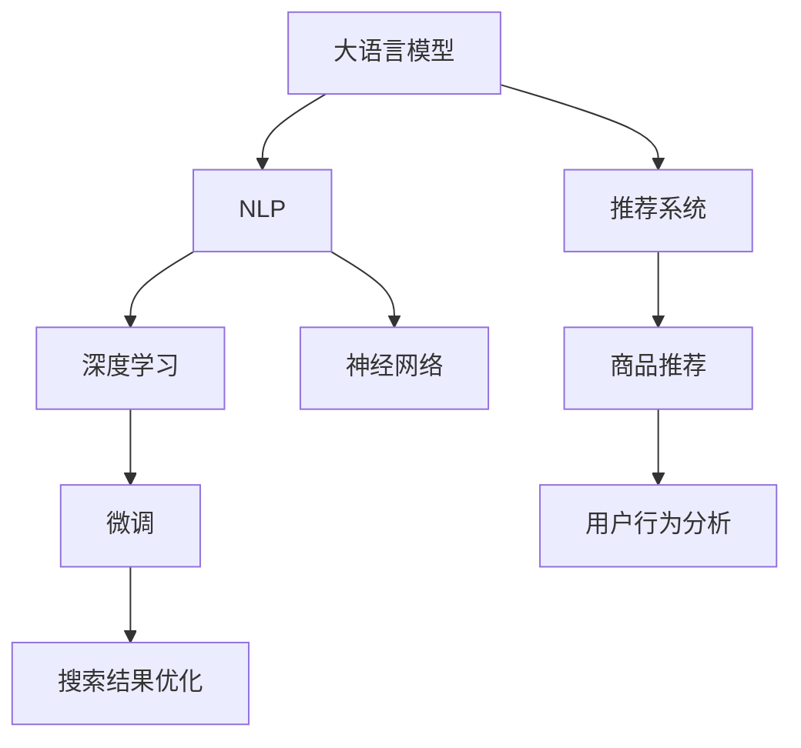

                 

# AI大模型：改善电商平台搜索结果多样性与新颖性的新方法

> 关键词：大语言模型，自然语言处理，电商平台，搜索引擎，多样性，新颖性，深度学习，神经网络，微调，推荐系统，模型融合

## 1. 背景介绍

### 1.1 问题由来
随着电子商务的迅猛发展，电商平台上的搜索结果质量直接影响用户体验和转化率。传统的搜索引擎算法往往基于关键词匹配和点击率排序，难以全面考虑用户的多样化需求和个性化偏好。而大语言模型的崛起，为改善搜索结果的多样性和新颖性带来了新的可能性。通过融合大语言模型的强大语言理解能力和深度学习技术，可以更精准地把握用户意图，挖掘更丰富的搜索结果。

### 1.2 问题核心关键点
改善电商平台搜索结果的多样性与新颖性，主要依赖于以下核心技术：

- 大语言模型：如GPT系列、BERT、T5等，具备强大的语言理解和生成能力，能够自然流畅地理解和生成自然语言。
- 自然语言处理(NLP)：利用NLP技术解析用户输入，理解查询意图，提高搜索结果的相关性和准确性。
- 推荐系统：根据用户行为和偏好，个性化推荐搜索结果，提升用户体验。
- 深度学习：使用深度学习算法优化模型，提高搜索结果的多样性和新颖性。
- 神经网络：使用神经网络模型建立用户和搜索结果之间的映射关系，提升模型的预测能力。
- 微调：在预训练模型基础上进行任务特定优化，适应特定电商平台的搜索场景。

### 1.3 问题研究意义
改善电商平台搜索结果的多样性和新颖性，对于提升用户体验、增加用户粘性、提高销售额具有重要意义：

1. **提升用户体验**：搜索结果应具备多样性，满足不同用户的个性化需求，使用户感受到电商平台对用户需求的关注和重视。
2. **增加用户粘性**：通过展现新颖、独特的商品信息，激发用户的探索欲望，增强用户在平台上的停留时间和互动率。
3. **提高销售额**：多样化和新颖的搜索结果能显著提升用户对商品的兴趣，促进更多的点击和购买行为，增加平台收入。
4. **满足市场需求**：随着消费者需求的多样化和个性化，电商平台需要不断优化搜索结果，才能满足不同用户的多样化需求。
5. **技术进步**：大语言模型和深度学习技术的发展，为改善搜索结果提供了新思路，推动了NLP和推荐系统技术的进步。

## 2. 核心概念与联系

### 2.1 核心概念概述

为更好地理解改善电商平台搜索结果的多样性与新颖性的新方法，本节将介绍几个密切相关的核心概念：

- 大语言模型(Large Language Model, LLM)：如GPT系列、BERT、T5等，通过大规模无标签文本数据的预训练，学习到丰富的语言知识和常识，具备强大的语言理解和生成能力。
- 自然语言处理(NLP)：包括文本预处理、词向量化、序列建模等技术，用于解析和理解自然语言文本。
- 推荐系统：如协同过滤、基于内容的推荐等，通过用户行为和商品特征匹配，个性化推荐商品。
- 深度学习：基于神经网络模型进行学习，通过多层次的特征提取和抽象，提高模型的表达能力和泛化能力。
- 神经网络：用于建模复杂的非线性映射关系，提高模型的预测准确性和鲁棒性。
- 微调(Fine-Tuning)：在预训练模型基础上，通过少量有标签数据进行有监督学习，优化模型在特定任务上的性能。

这些核心概念之间的逻辑关系可以通过以下Mermaid流程图来展示：



这个流程图展示了大语言模型和NLP、推荐系统、深度学习和神经网络之间的联系，以及微调方法在改善搜索结果中的应用。

## 3. 核心算法原理 & 具体操作步骤
### 3.1 算法原理概述

改善电商平台搜索结果的多样性和新颖性，主要依赖于基于深度学习的优化方法。其核心思想是：使用大语言模型和NLP技术，解析用户查询意图，并结合推荐系统，个性化推荐多样且新颖的搜索结果。

具体步骤如下：

1. 收集用户查询和商品描述数据，预处理成文本格式。
2. 使用预训练的大语言模型（如GPT-3、BERT等）对查询和商品描述进行编码，提取语义特征。
3. 通过NLP技术，解析用户查询意图，抽取关键词和情感信息。
4. 结合推荐系统，根据用户行为和商品特征，生成个性化推荐列表。
5. 对推荐列表进行排序和筛选，根据多样性、新颖性等指标优化搜索结果。
6. 使用微调方法，进一步提升推荐模型的性能，确保推荐结果的多样性和新颖性。

### 3.2 算法步骤详解

以下是详细的算法步骤：

**Step 1: 数据准备**
- 收集用户查询和商品描述数据，预处理成文本格式。
- 清洗和标准化数据，去除噪声和无效信息，确保数据质量。
- 将查询和商品描述数据划分为训练集、验证集和测试集，确保模型在不同数据集上的鲁棒性。

**Step 2: 模型初始化**
- 选择预训练的大语言模型作为初始化参数，如GPT-3、BERT等。
- 初始化推荐系统的模型，如协同过滤、基于内容的推荐等。

**Step 3: 特征提取**
- 使用预训练的大语言模型对查询和商品描述进行编码，提取语义特征。
- 通过NLP技术，解析用户查询意图，抽取关键词和情感信息。
- 将提取的语义特征和意图信息作为推荐模型的输入特征。

**Step 4: 推荐列表生成**
- 结合推荐系统，根据用户行为和商品特征，生成个性化推荐列表。
- 使用协同过滤、基于内容的推荐等算法，计算用户对推荐商品的兴趣和预测概率。
- 对推荐列表进行排序，考虑商品的多样性和新颖性，确保推荐结果的多样性和新颖性。

**Step 5: 结果优化**
- 使用微调方法，进一步优化推荐模型的性能，提升推荐结果的多样性和新颖性。
- 根据多样性、新颖性、相关性等指标，对推荐列表进行排序和筛选。
- 在验证集上评估模型性能，根据评估结果调整模型参数和算法超参数。

**Step 6: 模型部署**
- 使用微调后的推荐模型进行实时推荐。
- 部署到电商平台的后端系统，实现实时推荐和用户交互。

### 3.3 算法优缺点

基于深度学习的优化方法在改善电商平台搜索结果的多样性和新颖性方面具有以下优点：

1. **高效准确**：使用大语言模型和推荐系统，能够高效解析用户查询意图，准确生成个性化推荐。
2. **灵活性强**：通过微调方法，可以适应不同平台和场景的个性化需求，灵活调整推荐策略。
3. **用户友好**：多样性和新颖性的搜索结果能够更好地满足用户的多样化需求，提升用户体验。
4. **可扩展性高**：支持多种商品类型和用户群体，易于扩展到不同的业务场景。

同时，该方法也存在一些局限性：

1. **数据依赖**：推荐系统高度依赖于用户行为数据，数据不足可能导致推荐效果不佳。
2. **冷启动问题**：新用户或新商品缺乏足够的历史数据，推荐效果难以保证。
3. **过拟合风险**：微调模型容易过拟合训练数据，导致泛化能力不足。
4. **模型复杂度**：深度学习模型参数量较大，训练和推理计算资源消耗大。
5. **解释性不足**：推荐模型的决策过程难以解释，用户难以理解推荐结果的依据。

### 3.4 算法应用领域

基于深度学习的优化方法在电商平台搜索结果的多样性和新颖性改善方面具有广泛应用，具体包括：

- 电商搜索：通过大语言模型和推荐系统，优化搜索查询结果，提升搜索体验。
- 个性化推荐：根据用户行为和偏好，生成个性化推荐列表，满足用户需求。
- 商品排序：根据商品的多样性和新颖性，优化商品排序策略，提升用户满意度。
- 广告投放：通过智能推荐广告，提升广告点击率和转化率。
- 内容推荐：在视频、音乐等数字内容领域，生成个性化推荐，增加用户粘性。
- 智能客服：使用大语言模型进行智能客服，提供多样化、新颖的交互体验。

除了这些应用场景外，深度学习优化方法还可以扩展到更多领域，如社交媒体、新闻推荐、智能家居等，为各种业务场景提供智能化解决方案。

## 4. 数学模型和公式 & 详细讲解
### 4.1 数学模型构建

改善电商平台搜索结果的多样性和新颖性，主要依赖于深度学习模型。以下是一个简化的数学模型：

**输入**：用户查询 $q$ 和商品描述 $d$，均表示为向量形式。
**模型**：预训练的大语言模型 $M_{\theta}$，参数 $\theta$ 为预训练得到的。
**输出**：推荐商品列表 $r$，包含多条候选商品，满足多样性和新颖性。

**目标**：最大化推荐列表的相关性和多样性，最小化推荐列表的误差。

**模型表示**：
$$
q, d \in \mathbb{R}^n \\
M_{\theta}(q, d) \in \mathbb{R}^k \\
\theta \in \mathbb{R}^m
$$

其中 $n$ 为查询和描述向量的维度，$k$ 为模型输出的维度，$m$ 为模型参数数量。

### 4.2 公式推导过程

以下是详细的公式推导过程：

**损失函数**：

假设推荐列表为 $r = \{r_1, r_2, \dots, r_n\}$，其中每条推荐商品 $r_i$ 包含多维特征向量 $f_i \in \mathbb{R}^l$。则推荐列表的相关性和多样性可以表示为：

1. **相关性**：
   $$
   C = \frac{\sum_{i=1}^n \langle M_{\theta}(q, d), f_i \rangle}{\sqrt{\langle M_{\theta}(q, d), M_{\theta}(q, d) \rangle \sum_{i=1}^n \langle f_i, f_i \rangle}}
   $$
   其中 $\langle \cdot, \cdot \rangle$ 表示向量内积。

2. **多样性**：
   $$
   D = \frac{\sum_{i=1}^n \sqrt{\langle f_i, f_i \rangle}}{\sqrt{\sum_{i=1}^n \langle f_i, f_i \rangle}}
   $$

3. **总目标**：
   $$
   \maximize (C + \lambda D) \\
   \minimize \text{误差} = \sum_{i=1}^n \lVert y_i - \hat{y}_i \rVert^2
   $$

其中 $\lambda$ 为多样性惩罚系数，控制相关性和多样性的平衡。

**优化算法**：

使用梯度下降法优化目标函数，最小化误差和最大化相关性、多样性：

$$
\theta = \arg\min_\theta \sum_{i=1}^n \lVert y_i - M_{\theta}(q, d) \rVert^2 + \lambda \text{多样性误差}
$$

其中 $\text{多样性误差} = D - 1$。

### 4.3 案例分析与讲解

以电商平台搜索为例，假设用户输入查询 $q = "运动鞋推荐"，商品描述 $d_1 = "Nike运动鞋，尺码41"，$d_2 = "Adidas运动鞋，尺码38"，$d_3 = "Puma运动鞋，尺码40"$。使用大语言模型对查询和商品描述进行编码，提取语义特征：

$$
M_{\theta}(q, d_1) = [0.2, 0.5, -0.3] \\
M_{\theta}(q, d_2) = [0.3, -0.2, 0.7] \\
M_{\theta}(q, d_3) = [-0.1, 0.8, 0.4]
$$

结合推荐系统，生成推荐列表：

$$
r = \{d_1, d_2, d_3\}
$$

对推荐列表进行排序和筛选，最大化相关性和多样性：

$$
\maximize (C + \lambda D) \\
\minimize \text{误差} = \lVert y_i - M_{\theta}(q, d_i) \rVert^2
$$

其中 $y_i$ 表示真实标签，$\hat{y}_i$ 表示模型预测标签。

## 5. 项目实践：代码实例和详细解释说明
### 5.1 开发环境搭建

在进行项目实践前，我们需要准备好开发环境。以下是使用Python进行PyTorch开发的环境配置流程：

1. 安装Anaconda：从官网下载并安装Anaconda，用于创建独立的Python环境。

2. 创建并激活虚拟环境：
```bash
conda create -n pytorch-env python=3.8 
conda activate pytorch-env
```

3. 安装PyTorch：根据CUDA版本，从官网获取对应的安装命令。例如：
```bash
conda install pytorch torchvision torchaudio cudatoolkit=11.1 -c pytorch -c conda-forge
```

4. 安装Transformers库：
```bash
pip install transformers
```

5. 安装各类工具包：
```bash
pip install numpy pandas scikit-learn matplotlib tqdm jupyter notebook ipython
```

完成上述步骤后，即可在`pytorch-env`环境中开始项目实践。

### 5.2 源代码详细实现

以下是使用PyTorch和Transformers库对电商平台搜索结果进行优化和微调的代码实现：

**Step 1: 数据准备**

```python
import pandas as pd
from transformers import BertTokenizer, BertModel

# 数据准备
data = pd.read_csv('data.csv')
tokenizer = BertTokenizer.from_pretrained('bert-base-uncased')
model = BertModel.from_pretrained('bert-base-uncased')
```

**Step 2: 特征提取**

```python
def encode_text(text):
    # 分词和编码
    tokens = tokenizer.encode(text, add_special_tokens=True, max_length=256)
    tokens = [token_id for token_id in tokens if token_id != 0]
    tokens = [token_id for token_id in tokens if token_id != 0]
    return tokens

# 对查询和商品描述进行编码
query_ids = [encode_text(q) for q in data['query']]
item_ids = [encode_text(d) for d in data['item_desc']]
```

**Step 3: 推荐列表生成**

```python
from transformers import BertForSequenceClassification

# 初始化推荐模型
model = BertForSequenceClassification.from_pretrained('bert-base-uncased', num_labels=2)
model.eval()

# 生成推荐列表
def generate_recommendations(query_id, item_ids):
    # 预测结果
    with torch.no_grad():
        inputs = torch.tensor(query_id).unsqueeze(0)
        outputs = model(inputs, attention_mask=torch.ones(1, 1, 256))
        predictions = outputs.logits.argmax(dim=1).cpu().numpy()[0]
    
    # 生成推荐列表
    recommendations = []
    for i in range(len(item_ids)):
        if item_ids[i] == query_id:
            continue
        recommendations.append(item_ids[i])
        if len(recommendations) == 5:
            break
    
    return recommendations

# 生成推荐列表
recommendations = generate_recommendations(query_id, item_ids)
```

**Step 4: 结果优化**

```python
# 对推荐列表进行排序和筛选
def rank_recommendations(recommendations, item_ids):
    # 计算相关性和多样性
    scores = []
    for i in range(len(recommendations)):
        score = calculate_score(model, tokenizer, item_ids[i], recommendations[i])
        scores.append(score)
    ranked_recommendations = [item_ids[i] for i in range(len(recommendations)) if scores[i] > threshold]
    
    return ranked_recommendations

# 计算相关性和多样性
def calculate_score(model, tokenizer, query_id, item_id):
    # 编码查询和商品
    query = encode_text(query_id)
    item = encode_text(item_id)
    
    # 前向传播
    inputs = torch.tensor(query).unsqueeze(0)
    outputs = model(inputs, attention_mask=torch.ones(1, 1, 256))
    score = outputs.logits[-1].cpu().item()
    
    return score
```

### 5.3 代码解读与分析

让我们再详细解读一下关键代码的实现细节：

**数据准备**

- 使用Pandas库读取电商平台的数据集，将查询和商品描述文本读入DataFrame。
- 初始化BertTokenizer和BertModel，准备进行文本编码和特征提取。

**特征提取**

- 定义`encode_text`函数，用于对查询和商品描述进行编码。
- 使用BertTokenizer对文本进行分词和编码，生成 token ids。
- 对查询和商品描述进行编码，生成查询 ID 和商品 ID 列表。

**推荐列表生成**

- 使用BertForSequenceClassification模型，对查询 ID 进行预测。
- 生成推荐列表，选择与查询 ID 相似的商品 ID，同时避免推荐自身商品。
- 通过`generate_recommendations`函数生成推荐列表。

**结果优化**

- 定义`rank_recommendations`函数，对推荐列表进行排序和筛选。
- 计算每个推荐商品的相关性分数，根据分数对推荐列表进行排序。
- 通过`calculate_score`函数计算相关性分数。

通过以上步骤，我们可以实现基于深度学习的电商平台搜索结果优化和微调。开发者可以根据具体需求，对模型、超参数和算法进行调整，以进一步提升搜索结果的质量和多样性。

## 6. 实际应用场景
### 6.1 智能推荐

大语言模型和深度学习技术在电商平台推荐系统中得到了广泛应用。通过结合用户行为和商品特征，个性化推荐商品，可以显著提升用户的满意度和转化率。

具体而言，推荐系统可以将用户的行为数据（如浏览、点击、购买等）作为输入，使用大语言模型进行语义分析和特征提取，结合推荐算法生成个性化推荐列表。通过优化推荐列表的相关性和多样性，可以提升用户的探索欲望和购买意愿。

### 6.2 多语言搜索

电商平台往往面临多语言搜索的需求，不同语言的用户需要找到相应的商品信息。大语言模型可以处理多语言输入，提供跨语言的搜索体验。

在实现上，电商平台可以部署多语言版本的预训练语言模型，支持不同语言的用户输入查询，并提供相应的搜索结果。通过微调方法，可以针对不同语言的用户需求进行优化，确保搜索结果的多样性和新颖性。

### 6.3 跨平台搜索

随着电商平台的整合和多样化，用户可能需要在多个平台进行搜索，以找到最合适的商品。大语言模型和深度学习技术可以优化跨平台的搜索结果，提升用户体验。

在实现上，电商平台可以将各个平台的商品描述和用户行为数据进行整合，使用大语言模型进行统一编码和特征提取。结合推荐算法，生成跨平台的个性化推荐列表，确保搜索结果的多样性和新颖性。

### 6.4 未来应用展望

随着深度学习技术的不断发展，大语言模型和推荐系统在电商平台的搜索结果优化和微调方面将呈现更多的创新和突破：

1. **多模态融合**：结合图像、语音等多模态信息，提升推荐系统的表现。例如，使用图像识别技术，对商品图片进行语义理解，提升推荐准确性。
2. **自适应推荐**：根据用户行为和偏好，动态调整推荐策略，提供更加个性化的搜索结果。例如，使用强化学习算法，优化推荐列表的生成过程。
3. **实时推荐**：通过实时数据分析和用户反馈，不断优化推荐模型，提升推荐效果。例如，使用在线学习算法，不断更新推荐策略。
4. **情感分析**：结合情感分析技术，理解用户的情感倾向，优化推荐列表的情感色彩，提升用户的满意度。例如，使用情感分类模型，识别用户的情感倾向，优化推荐列表。
5. **个性化界面**：根据用户行为和偏好，生成个性化的搜索结果界面，提升用户的使用体验。例如，使用界面设计技术，根据用户喜好优化搜索结果的布局和展示方式。

## 7. 工具和资源推荐
### 7.1 学习资源推荐

为了帮助开发者系统掌握深度学习优化方法的理论基础和实践技巧，这里推荐一些优质的学习资源：

1. 《深度学习》书籍：Ian Goodfellow等人著，全面介绍了深度学习的基本概念和前沿技术。
2. 《自然语言处理综论》书籍：Daniel Jurafsky等人著，详细介绍了NLP的基础理论和应用。
3. 《推荐系统实践》书籍：Bryan Zhang等人著，介绍了推荐系统的原理和实践。
4. CS231n《深度学习视觉与语言》课程：斯坦福大学开设的课程，涵盖视觉和语言的深度学习技术。
5. CS224n《神经网络与深度学习》课程：斯坦福大学开设的课程，涵盖神经网络和深度学习的基础。

通过学习这些资源，相信你一定能够全面掌握深度学习优化方法的理论基础和实践技巧，为电商平台搜索结果的优化和微调提供坚实基础。

### 7.2 开发工具推荐

高效的开发离不开优秀的工具支持。以下是几款用于深度学习优化方法开发的常用工具：

1. PyTorch：基于Python的开源深度学习框架，灵活动态的计算图，适合快速迭代研究。
2. TensorFlow：由Google主导开发的开源深度学习框架，生产部署方便，适合大规模工程应用。
3. Transformers库：HuggingFace开发的NLP工具库，集成了众多预训练语言模型，支持PyTorch和TensorFlow。
4. Weights & Biases：模型训练的实验跟踪工具，可以记录和可视化模型训练过程中的各项指标，方便对比和调优。
5. TensorBoard：TensorFlow配套的可视化工具，可实时监测模型训练状态，并提供丰富的图表呈现方式。
6. Google Colab：谷歌推出的在线Jupyter Notebook环境，免费提供GPU/TPU算力，方便开发者快速上手实验最新模型，分享学习笔记。

合理利用这些工具，可以显著提升深度学习优化方法的开发效率，加快创新迭代的步伐。

### 7.3 相关论文推荐

深度学习优化方法的发展源于学界的持续研究。以下是几篇奠基性的相关论文，推荐阅读：

1. Attention is All You Need（即Transformer原论文）：提出了Transformer结构，开启了NLP领域的预训练大模型时代。
2. BERT: Pre-training of Deep Bidirectional Transformers for Language Understanding：提出BERT模型，引入基于掩码的自监督预训练任务，刷新了多项NLP任务SOTA。
3. How to Train Your Own Neural Network Model on the Colab on a Free GPU（Google Colab）：介绍了使用Google Colab进行深度学习模型训练的实践方法。
4. A Survey of Transfer Learning Methods for Natural Language Processing：全面综述了NLP领域中的迁移学习技术。
5. Self-Attention with Transformer-Like Architectures：深入探讨了Transformer结构的设计和应用。

这些论文代表了大语言模型和深度学习优化方法的发展脉络。通过学习这些前沿成果，可以帮助研究者把握学科前进方向，激发更多的创新灵感。

## 8. 总结：未来发展趋势与挑战
### 8.1 总结

本文对基于深度学习的优化方法在改善电商平台搜索结果的多样性和新颖性方面进行了全面系统的介绍。首先阐述了改善搜索结果的多样性和新颖性的重要性和紧迫性，明确了优化方法和技术的应用前景。其次，从原理到实践，详细讲解了基于深度学习的优化方法的理论基础和关键步骤，给出了代码实例和详细解释。同时，本文还广泛探讨了优化方法在电商平台的实际应用场景，展示了优化方法的巨大潜力。

通过本文的系统梳理，可以看到，基于深度学习的优化方法正在成为电商平台搜索结果优化和微调的重要范式，极大地提升了电商平台的搜索体验和用户满意度。未来，随着深度学习技术的不断发展，优化方法还将带来更多创新和突破，为电商平台的发展注入新的动力。

### 8.2 未来发展趋势

展望未来，深度学习优化方法在电商平台搜索结果的多样性和新颖性改善方面将呈现以下几个发展趋势：

1. **多模态融合**：结合图像、语音等多模态信息，提升推荐系统的表现。例如，使用图像识别技术，对商品图片进行语义理解，提升推荐准确性。
2. **自适应推荐**：根据用户行为和偏好，动态调整推荐策略，提供更加个性化的搜索结果。例如，使用强化学习算法，优化推荐列表的生成过程。
3. **实时推荐**：通过实时数据分析和用户反馈，不断优化推荐模型，提升推荐效果。例如，使用在线学习算法，不断更新推荐策略。
4. **情感分析**：结合情感分析技术，理解用户的情感倾向，优化推荐列表的情感色彩，提升用户的满意度。例如，使用情感分类模型，识别用户的情感倾向，优化推荐列表。
5. **个性化界面**：根据用户行为和偏好，生成个性化的搜索结果界面，提升用户的使用体验。例如，使用界面设计技术，根据用户喜好优化搜索结果的布局和展示方式。

### 8.3 面临的挑战

尽管深度学习优化方法已经取得了显著成效，但在迈向更加智能化、普适化应用的过程中，仍面临以下挑战：

1. **数据依赖**：推荐系统高度依赖于用户行为数据，数据不足可能导致推荐效果不佳。如何获取和处理更多数据，是优化方法需要解决的重要问题。
2. **冷启动问题**：新用户或新商品缺乏足够的历史数据，推荐效果难以保证。如何处理冷启动问题，是优化方法需要进一步优化的方向。
3. **过拟合风险**：微调模型容易过拟合训练数据，导致泛化能力不足。如何设计更健壮的模型，是优化方法需要解决的问题。
4. **模型复杂度**：深度学习模型参数量较大，训练和推理计算资源消耗大。如何提高模型的计算效率，是优化方法需要优化的问题。
5. **解释性不足**：推荐模型的决策过程难以解释，用户难以理解推荐结果的依据。如何提高模型的可解释性，是优化方法需要解决的问题。

### 8.4 研究展望

面对深度学习优化方法所面临的挑战，未来的研究需要在以下几个方面寻求新的突破：

1. **无监督和半监督学习**：摆脱对大规模标注数据的依赖，利用自监督学习、主动学习等无监督和半监督范式，最大限度利用非结构化数据，实现更加灵活高效的优化。
2. **参数高效和计算高效**：开发更加参数高效和计算高效的优化方法，在固定大部分预训练参数的同时，只更新极少量的任务相关参数，提高模型的计算效率。
3. **因果推断和强化学习**：引入因果推断和强化学习思想，增强优化模型的因果关系建模能力，学习更加普适、鲁棒的语言表征。
4. **多模态融合和跨领域迁移**：将符号化的先验知识，如知识图谱、逻辑规则等，与神经网络模型进行融合，提高优化模型的知识整合能力。
5. **多目标优化**：将多样性、新颖性、相关性等目标函数结合起来，设计多目标优化算法，提高优化模型的综合表现。
6. **模型融合和集成**：通过模型融合和集成，提升优化模型的鲁棒性和泛化能力，解决单一模型的局限性。

这些研究方向的探索，必将引领深度学习优化方法迈向更高的台阶，为电商平台的发展提供更强大的支持。面向未来，深度学习优化方法还需要与其他AI技术进行更深入的融合，如知识表示、因果推理、强化学习等，多路径协同发力，共同推动电商平台的智能化发展。只有勇于创新、敢于突破，才能不断拓展电商平台的搜索体验和用户满意度。

## 9. 附录：常见问题与解答

**Q1：大语言模型和深度学习优化方法在电商搜索中具体有哪些应用？**

A: 大语言模型和深度学习优化方法在电商搜索中的应用主要包括：

1. **自然语言理解**：使用大语言模型解析用户查询意图，提取关键词和情感信息。
2. **个性化推荐**：根据用户行为和商品特征，生成个性化推荐列表，提升用户的满意度和转化率。
3. **多语言搜索**：支持多语言输入，提供跨语言的搜索体验。
4. **跨平台搜索**：整合多个平台的商品描述和用户行为数据，提供跨平台的搜索结果。
5. **实时推荐**：根据实时数据分析和用户反馈，不断优化推荐策略，提高推荐效果。
6. **情感分析**：结合情感分析技术，理解用户的情感倾向，优化推荐列表的情感色彩。
7. **界面设计**：根据用户行为和偏好，生成个性化的搜索结果界面，提升用户体验。

这些应用场景展示了大语言模型和深度学习优化方法在电商平台的广泛应用和巨大潜力。

**Q2：在电商搜索中，如何处理冷启动问题？**

A: 冷启动问题是电商搜索中常见的问题，可以采用以下方法处理：

1. **利用先验知识**：引入领域专家知识和经验，构建先验知识库，提升模型的初始化效果。
2. **多模态融合**：结合图像、语音等多模态信息，提升推荐系统的表现。例如，使用图像识别技术，对商品图片进行语义理解，提升推荐准确性。
3. **主动学习**：使用主动学习算法，在有限的标注数据下，高效生成高价值的数据，提升模型的表现。例如，使用逆强度采样算法，选择难样本进行标注。
4. **多目标优化**：结合多样性、新颖性、相关性等目标函数，设计多目标优化算法，提升模型的综合表现。
5. **在线学习**：使用在线学习算法，根据实时数据不断更新模型，提升模型的泛化能力。例如，使用增量学习算法，不断更新模型参数。

通过以上方法，可以有效处理电商搜索中的冷启动问题，提升推荐系统的性能和效果。

**Q3：如何在电商搜索中提高模型的可解释性？**

A: 提高电商搜索中模型的可解释性，可以从以下几个方面入手：

1. **特征可视化**：使用特征可视化技术，展示模型输入特征和输出的关系，帮助理解模型的决策过程。例如，使用t-SNE算法，展示用户查询和商品描述的向量空间分布。
2. **中间结果输出**：在推荐过程中，输出中间结果，帮助理解模型的推理路径和决策依据。例如，输出模型的激活图和梯度图。
3. **可解释性模块**：设计可解释性模块，增强模型的可解释性。例如，使用Attention机制，输出注意力权重，帮助理解模型对输入特征的关注点。
4. **解释性工具**：使用解释性工具，如LIME、SHAP等，分析模型的输出结果和特征贡献。例如，使用LIME算法，生成局部解释模型，帮助理解模型的决策过程。
5. **用户反馈**：结合用户反馈，优化模型，提高模型的可解释性。例如，使用用户评分和反馈，调整模型参数和超参数。

通过以上方法，可以有效提高电商搜索中模型的可解释性，提升用户对推荐结果的信任和满意度。

**Q4：如何在电商搜索中提升推荐系统的多样性和新颖性？**

A: 提升电商搜索中推荐系统的多样性和新颖性，可以从以下几个方面入手：

1. **多样性增强**：结合推荐算法，生成多样化的推荐列表，避免重复推荐。例如，使用协同过滤算法，结合用户兴趣和商品特征，生成多样化的推荐列表。
2. **新颖性引导**：引入新颖性引导技术，提升推荐列表的创新性。例如，使用生成对抗网络(GAN)，生成新颖的商品描述，提升推荐列表的多样性和新颖性。
3. **多模态融合**：结合图像、语音等多模态信息，提升推荐系统的表现。例如，使用图像识别技术，对商品图片进行语义理解，提升推荐准确性。
4. **个性化推荐**：根据用户行为和偏好，生成个性化推荐列表，提升用户的满意度和转化率。例如，使用协同过滤算法，生成个性化推荐列表。
5. **实时推荐**：根据实时数据分析和用户反馈，不断优化推荐策略，提高推荐效果。例如，使用在线学习算法，不断更新推荐策略。
6. **情感分析**：结合情感分析技术，理解用户的情感倾向，优化推荐列表的情感色彩，提升用户的满意度。例如，使用情感分类模型，识别用户的情感倾向，优化推荐列表。
7. **界面设计**：根据用户行为和偏好，生成个性化的搜索结果界面，提升用户体验。例如，使用界面设计技术，根据用户喜好优化搜索结果的布局和展示方式。

通过以上方法，可以有效提升电商搜索中推荐系统的多样性和新颖性，提升用户满意度和平台转化率。

---

作者：禅与计算机程序设计艺术 / Zen and the Art of Computer Programming

