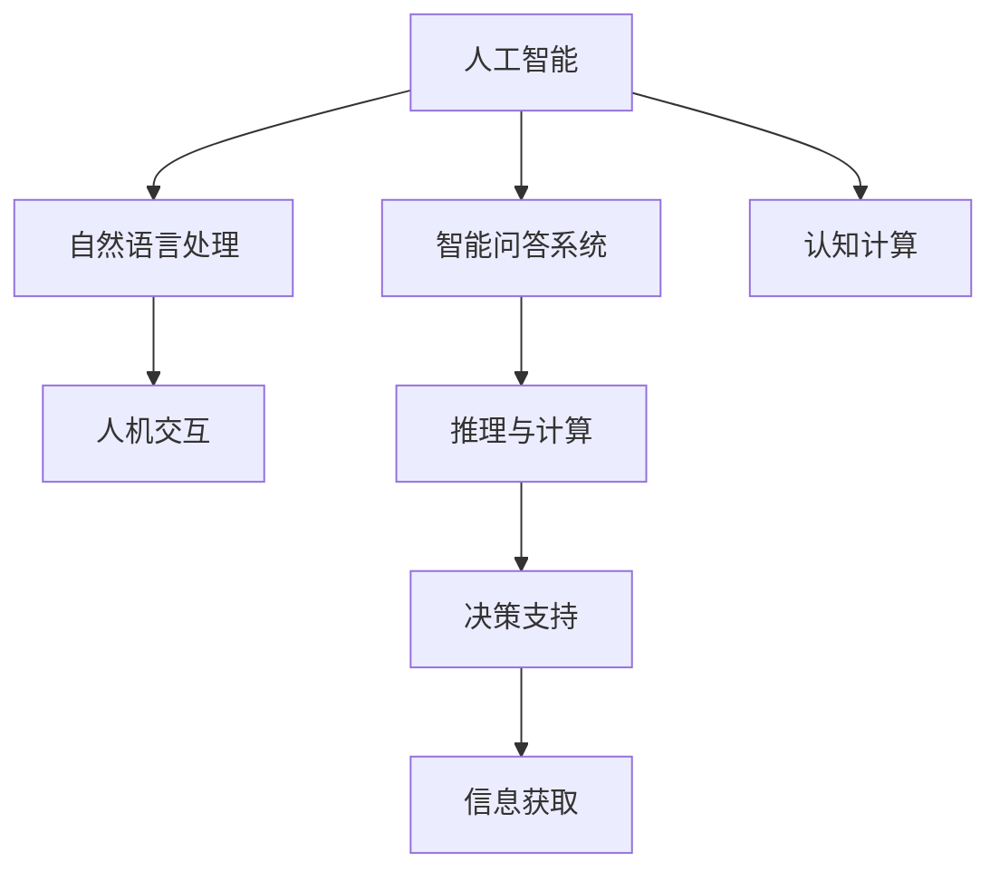

                 

# AI如何改变我们提问和思考的方式

> 关键词：人工智能, 自然语言处理, 智能问答, 认知计算, 人机交互, 推理与计算

## 1. 背景介绍

### 1.1 问题由来

人工智能(AI)技术的迅猛发展，特别是自然语言处理(NLP)领域的突破，正在深刻改变人们提问和思考的方式。从简单的信息检索到复杂的智能问答，从日常的聊天机器人到高级的认知计算，AI在各个领域展现出了强大的潜力和应用前景。然而，AI改变我们提问和思考的方式，并不仅仅是在技术层面上的进步，更是一种思维模式和认知方式的革命。

### 1.2 问题核心关键点

AI技术特别是自然语言处理技术的飞速发展，使得机器不仅能够理解和处理自然语言，还能够通过智能问答、认知计算等方式，辅助人类进行决策、推理和计算。这种能力，使AI从传统的信息处理工具，转变为思考和决策的伙伴，从根本上改变了人类的认知和思维模式。

AI如何改变我们提问和思考的方式？

1. **信息获取和检索的变革**：传统的搜索引擎只能提供静态的信息检索，而智能问答系统能够理解自然语言查询，提供动态、个性化的信息。
2. **认知计算和推理**：AI能够进行高级的推理和计算，辅助人类解决复杂问题，如医疗诊断、金融分析等。
3. **交互式学习**：通过交互式对话，AI能够帮助用户更好地理解和掌握知识，提供个性化学习体验。
4. **决策支持**：AI可以处理海量数据，提供决策支持，帮助人类做出更准确、更快速的决策。

### 1.3 问题研究意义

AI技术在改变我们提问和思考方式方面的研究，不仅具有重要的学术价值，更具有广泛的社会和经济意义：

1. **提高信息获取效率**：通过智能问答和认知计算，AI能够帮助人们快速获取所需信息，提高决策效率。
2. **辅助决策与推理**：AI可以处理复杂数据，辅助人类进行深入的分析和推理，提升决策质量。
3. **推动认知科学研究**：AI与认知科学的结合，有望揭示人类认知过程的深层机制，推动认知科学的发展。
4. **促进人机交互的进化**：AI能够实现更加自然、流畅的人机交互，改善用户体验。

## 2. 核心概念与联系

### 2.1 核心概念概述

为了更好地理解AI如何改变我们提问和思考的方式，我们首先需要了解几个核心概念及其相互联系：

- **人工智能(AI)**：通过模拟人类智能行为，使机器能够完成感知、推理、学习等任务的技术。
- **自然语言处理(NLP)**：使机器能够理解和处理自然语言的技术，包括语言理解、文本分析、情感分析等。
- **智能问答系统(QA)**：利用NLP和AI技术，提供智能的问答服务，辅助用户获取信息。
- **认知计算**：结合AI和认知科学，模拟人类认知过程，解决复杂问题。
- **人机交互(HCI)**：通过交互式界面，使机器能够更好地理解和响应用户需求的技术。
- **推理与计算**：AI能够进行高级推理和计算，辅助人类进行决策和问题解决。

这些概念之间的逻辑关系可以通过以下Mermaid流程图来展示：



这个流程图展示了几大核心概念之间的逻辑关系：

1. **AI**：作为基础，提供感知、推理和学习的能力。
2. **NLP**：使AI能够理解和处理自然语言，为其他应用提供数据基础。
3. **QA**：利用NLP和AI技术，实现智能问答，辅助用户获取信息。
4. **认知计算**：结合AI和认知科学，模拟人类认知过程，解决复杂问题。
5. **HCI**：通过交互式界面，改善人机交互体验。
6. **推理与计算**：利用AI能力进行高级推理和计算，辅助决策和问题解决。
7. **决策支持**：结合推理与计算能力，提供信息获取和决策支持。

## 3. 核心算法原理 & 具体操作步骤

### 3.1 算法原理概述

AI技术特别是自然语言处理技术的核心在于理解自然语言，并在此基础上进行信息检索、问答、推理和计算。这种能力的实现，依赖于以下几个核心算法：

1. **语言理解**：通过词向量、神经网络等技术，将自然语言转化为机器可理解的形式。
2. **信息检索**：利用索引、倒排索引等技术，快速检索相关信息。
3. **智能问答**：通过自然语言处理和逻辑推理，实现智能问答。
4. **认知计算**：结合知识图谱、逻辑推理等技术，进行高级推理和计算。
5. **人机交互**：通过交互式界面，实现自然、流畅的人机交互。

这些算法相互配合，共同构成了AI技术在提问和思考方面的核心能力。

### 3.2 算法步骤详解

以智能问答系统为例，我们可以将其主要步骤分为以下几个部分：

1. **问题理解**：利用NLP技术，理解自然语言查询。
2. **信息检索**：从知识库或互联网中检索相关信息。
3. **知识推理**：结合领域知识和逻辑推理，生成最终答案。
4. **答案生成**：利用模板或生成式方法，生成自然语言的回答。
5. **用户交互**：通过交互式界面，展示答案并获取用户反馈。

以医疗问答系统为例，其流程如下：

1. **问题理解**：理解自然语言查询，如“我头疼应该怎么办？”
2. **信息检索**：检索医学数据库和相关文献，获取与“头疼”相关的症状、诊断和治疗方法。
3. **知识推理**：结合医生的知识和逻辑推理，生成可能的诊断和治疗方法。
4. **答案生成**：生成自然语言的回答，如“建议去医院检查，可能是头痛，需要休息和服用止痛药。”
5. **用户交互**：通过界面展示答案，获取用户反馈和进一步提问。

### 3.3 算法优缺点

AI技术在改变我们提问和思考方式方面具有以下优点：

1. **高效信息获取**：AI可以快速获取和处理海量信息，辅助人类做出决策。
2. **辅助决策和推理**：AI能够进行高级推理和计算，辅助人类解决复杂问题。
3. **个性化学习**：通过智能问答和认知计算，AI能够提供个性化的学习体验。
4. **人机交互改善**：AI可以提供自然、流畅的人机交互，改善用户体验。

然而，这些技术也存在以下缺点：

1. **数据依赖**：AI需要大量标注数据进行训练，缺乏数据的系统可能表现不佳。
2. **理解局限**：当前的AI技术在理解复杂语境和隐含含义方面仍然存在局限。
3. **知识偏见**：AI可能继承训练数据中的偏见，输出结果可能存在偏差。
4. **安全性和隐私**：AI处理大量数据，存在数据安全和隐私泄露的风险。

### 3.4 算法应用领域

AI技术在改变我们提问和思考方式方面，已经在多个领域得到了广泛应用，例如：

1. **医疗健康**：利用AI辅助诊断和治疗，提供个性化的医疗建议。
2. **金融分析**：利用AI进行金融分析和风险评估，提供投资建议。
3. **教育学习**：通过智能问答和认知计算，提供个性化的学习资源和辅导。
4. **客户服务**：利用AI进行客户咨询和投诉处理，提升客户满意度。
5. **交通出行**：利用AI进行路径规划和智能调度，提升出行效率。

## 4. 数学模型和公式 & 详细讲解 & 举例说明

### 4.1 数学模型构建

为了更好地理解AI在提问和思考方面的技术原理，我们可以使用数学语言进行更加严格的刻画。

假设有一个智能问答系统，其输入为自然语言查询 $q$，输出为回答 $a$。模型的输入为文本 $x$，输出为文本 $y$，模型参数为 $\theta$。我们可以定义一个条件概率模型 $P(y|x;\theta)$ 表示给定输入 $x$ 和参数 $\theta$，输出 $y$ 的条件概率。模型的训练目标是最小化预测结果和真实结果之间的差异，即：

$$
\mathop{\arg\min}_{\theta} \sum_{i=1}^n \log P(a_i|x_i;\theta)
$$

其中 $n$ 为训练样本数量，$x_i$ 和 $a_i$ 分别为第 $i$ 个训练样本的输入和输出。

### 4.2 公式推导过程

以问答系统为例，我们可以推导一个简单的条件概率模型。假设查询和回答的词向量表示分别为 $q=(v_{q_1}, v_{q_2}, ..., v_{q_n})$ 和 $a=(v_{a_1}, v_{a_2}, ..., v_{a_n})$，其中 $n$ 为单词数量。假设查询和回答的上下文向量分别为 $c_q$ 和 $c_a$，则模型的输出可以表示为：

$$
P(a|q;\theta) = \frac{e^{\sum_{i=1}^n c_a^T W a_i v_{a_i} + c_q^T W q_i v_{q_i}}}{\sum_{j=1}^m e^{\sum_{i=1}^n c_a^T W a_j v_{a_j} + c_q^T W q_i v_{q_i}}}
$$

其中 $W$ 为可学习的权重矩阵，$c_q$ 和 $c_a$ 分别为查询和回答的上下文向量。该模型通过计算查询和回答的词向量表示，结合上下文向量，预测回答的概率。

### 4.3 案例分析与讲解

以一个简单的问答系统为例，我们可以分析模型的训练过程。假设训练集包含多个查询-回答对，每个查询-回答对的上下文向量、词向量表示和真实答案已知。模型的训练目标是最小化预测结果和真实结果之间的交叉熵损失：

$$
L(\theta) = -\frac{1}{N} \sum_{i=1}^N \log P(a_i|q_i;\theta)
$$

通过反向传播算法，我们可以计算模型的梯度，更新模型参数 $\theta$，使模型逐渐学习到查询和回答之间的映射关系。随着训练的进行，模型能够更准确地预测给定查询的回答，从而实现智能问答的功能。

## 5. 项目实践：代码实例和详细解释说明

### 5.1 开发环境搭建

在进行AI项目实践前，我们需要准备好开发环境。以下是使用Python进行PyTorch开发的环境配置流程：

1. 安装Anaconda：从官网下载并安装Anaconda，用于创建独立的Python环境。

2. 创建并激活虚拟环境：
```bash
conda create -n ai-env python=3.8 
conda activate ai-env
```

3. 安装PyTorch：根据CUDA版本，从官网获取对应的安装命令。例如：
```bash
conda install pytorch torchvision torchaudio cudatoolkit=11.1 -c pytorch -c conda-forge
```

4. 安装各类工具包：
```bash
pip install numpy pandas scikit-learn matplotlib tqdm jupyter notebook ipython
```

完成上述步骤后，即可在`ai-env`环境中开始AI实践。

### 5.2 源代码详细实现

这里我们以一个简单的医疗问答系统为例，给出使用Transformers库进行NLP任务开发的PyTorch代码实现。

首先，定义问答系统的数据处理函数：

```python
from transformers import BertTokenizer
from torch.utils.data import Dataset
import torch

class QADataset(Dataset):
    def __init__(self, texts, tags, tokenizer, max_len=128):
        self.texts = texts
        self.tags = tags
        self.tokenizer = tokenizer
        self.max_len = max_len
        
    def __len__(self):
        return len(self.texts)
    
    def __getitem__(self, item):
        text = self.texts[item]
        tags = self.tags[item]
        
        encoding = self.tokenizer(text, return_tensors='pt', max_length=self.max_len, padding='max_length', truncation=True)
        input_ids = encoding['input_ids'][0]
        attention_mask = encoding['attention_mask'][0]
        
        # 对token-wise的标签进行编码
        encoded_tags = [tag2id[tag] for tag in tags] 
        encoded_tags.extend([tag2id['O']] * (self.max_len - len(encoded_tags)))
        labels = torch.tensor(encoded_tags, dtype=torch.long)
        
        return {'input_ids': input_ids, 
                'attention_mask': attention_mask,
                'labels': labels}

# 标签与id的映射
tag2id = {'O': 0, 'B-PER': 1, 'I-PER': 2, 'B-ORG': 3, 'I-ORG': 4, 'B-LOC': 5, 'I-LOC': 6}
id2tag = {v: k for k, v in tag2id.items()}

# 创建dataset
tokenizer = BertTokenizer.from_pretrained('bert-base-cased')

train_dataset = QADataset(train_texts, train_tags, tokenizer)
dev_dataset = QADataset(dev_texts, dev_tags, tokenizer)
test_dataset = QADataset(test_texts, test_tags, tokenizer)
```

然后，定义模型和优化器：

```python
from transformers import BertForTokenClassification, AdamW

model = BertForTokenClassification.from_pretrained('bert-base-cased', num_labels=len(tag2id))

optimizer = AdamW(model.parameters(), lr=2e-5)
```

接着，定义训练和评估函数：

```python
from torch.utils.data import DataLoader
from tqdm import tqdm
from sklearn.metrics import classification_report

device = torch.device('cuda') if torch.cuda.is_available() else torch.device('cpu')
model.to(device)

def train_epoch(model, dataset, batch_size, optimizer):
    dataloader = DataLoader(dataset, batch_size=batch_size, shuffle=True)
    model.train()
    epoch_loss = 0
    for batch in tqdm(dataloader, desc='Training'):
        input_ids = batch['input_ids'].to(device)
        attention_mask = batch['attention_mask'].to(device)
        labels = batch['labels'].to(device)
        model.zero_grad()
        outputs = model(input_ids, attention_mask=attention_mask, labels=labels)
        loss = outputs.loss
        epoch_loss += loss.item()
        loss.backward()
        optimizer.step()
    return epoch_loss / len(dataloader)

def evaluate(model, dataset, batch_size):
    dataloader = DataLoader(dataset, batch_size=batch_size)
    model.eval()
    preds, labels = [], []
    with torch.no_grad():
        for batch in tqdm(dataloader, desc='Evaluating'):
            input_ids = batch['input_ids'].to(device)
            attention_mask = batch['attention_mask'].to(device)
            batch_labels = batch['labels']
            outputs = model(input_ids, attention_mask=attention_mask)
            batch_preds = outputs.logits.argmax(dim=2).to('cpu').tolist()
            batch_labels = batch_labels.to('cpu').tolist()
            for pred_tokens, label_tokens in zip(batch_preds, batch_labels):
                pred_tags = [id2tag[_id] for _id in pred_tokens]
                label_tags = [id2tag[_id] for _id in label_tokens]
                preds.append(pred_tags[:len(label_tags)])
                labels.append(label_tags)
                
    print(classification_report(labels, preds))
```

最后，启动训练流程并在测试集上评估：

```python
epochs = 5
batch_size = 16

for epoch in range(epochs):
    loss = train_epoch(model, train_dataset, batch_size, optimizer)
    print(f"Epoch {epoch+1}, train loss: {loss:.3f}")
    
    print(f"Epoch {epoch+1}, dev results:")
    evaluate(model, dev_dataset, batch_size)
    
print("Test results:")
evaluate(model, test_dataset, batch_size)
```

以上就是使用PyTorch对BERT进行医疗问答系统微调的完整代码实现。可以看到，得益于Transformers库的强大封装，我们可以用相对简洁的代码完成BERT模型的加载和微调。

### 5.3 代码解读与分析

让我们再详细解读一下关键代码的实现细节：

**QADataset类**：
- `__init__`方法：初始化文本、标签、分词器等关键组件。
- `__len__`方法：返回数据集的样本数量。
- `__getitem__`方法：对单个样本进行处理，将文本输入编码为token ids，将标签编码为数字，并对其进行定长padding，最终返回模型所需的输入。

**tag2id和id2tag字典**：
- 定义了标签与数字id之间的映射关系，用于将token-wise的预测结果解码回真实的标签。

**训练和评估函数**：
- 使用PyTorch的DataLoader对数据集进行批次化加载，供模型训练和推理使用。
- 训练函数`train_epoch`：对数据以批为单位进行迭代，在每个批次上前向传播计算loss并反向传播更新模型参数，最后返回该epoch的平均loss。
- 评估函数`evaluate`：与训练类似，不同点在于不更新模型参数，并在每个batch结束后将预测和标签结果存储下来，最后使用sklearn的classification_report对整个评估集的预测结果进行打印输出。

**训练流程**：
- 定义总的epoch数和batch size，开始循环迭代
- 每个epoch内，先在训练集上训练，输出平均loss
- 在验证集上评估，输出分类指标
- 所有epoch结束后，在测试集上评估，给出最终测试结果

可以看到，PyTorch配合Transformers库使得BERT微调的代码实现变得简洁高效。开发者可以将更多精力放在数据处理、模型改进等高层逻辑上，而不必过多关注底层的实现细节。

当然，工业级的系统实现还需考虑更多因素，如模型的保存和部署、超参数的自动搜索、更灵活的任务适配层等。但核心的微调范式基本与此类似。

## 6. 实际应用场景

### 6.1 智能客服系统

基于AI技术特别是自然语言处理技术的智能客服系统，已经广泛应用于各个行业。传统客服往往需要配备大量人力，高峰期响应缓慢，且一致性和专业性难以保证。而使用智能客服系统，可以7x24小时不间断服务，快速响应客户咨询，用自然流畅的语言解答各类常见问题。

在技术实现上，可以收集企业内部的历史客服对话记录，将问题和最佳答复构建成监督数据，在此基础上对预训练语言模型进行微调。微调后的语言模型能够自动理解用户意图，匹配最合适的答复模板进行回复。对于客户提出的新问题，还可以接入检索系统实时搜索相关内容，动态组织生成回答。如此构建的智能客服系统，能大幅提升客户咨询体验和问题解决效率。

### 6.2 金融舆情监测

金融机构需要实时监测市场舆论动向，以便及时应对负面信息传播，规避金融风险。传统的人工监测方式成本高、效率低，难以应对网络时代海量信息爆发的挑战。基于AI技术的文本分类和情感分析技术，为金融舆情监测提供了新的解决方案。

具体而言，可以收集金融领域相关的新闻、报道、评论等文本数据，并对其进行主题标注和情感标注。在此基础上对预训练语言模型进行微调，使其能够自动判断文本属于何种主题，情感倾向是正面、中性还是负面。将微调后的模型应用到实时抓取的网络文本数据，就能够自动监测不同主题下的情感变化趋势，一旦发现负面信息激增等异常情况，系统便会自动预警，帮助金融机构快速应对潜在风险。

### 6.3 个性化推荐系统

当前的推荐系统往往只依赖用户的历史行为数据进行物品推荐，无法深入理解用户的真实兴趣偏好。基于AI技术的个性化推荐系统，可以更好地挖掘用户行为背后的语义信息，从而提供更精准、多样的推荐内容。

在实践中，可以收集用户浏览、点击、评论、分享等行为数据，提取和用户交互的物品标题、描述、标签等文本内容。将文本内容作为模型输入，用户的后续行为（如是否点击、购买等）作为监督信号，在此基础上微调预训练语言模型。微调后的模型能够从文本内容中准确把握用户的兴趣点。在生成推荐列表时，先用候选物品的文本描述作为输入，由模型预测用户的兴趣匹配度，再结合其他特征综合排序，便可以得到个性化程度更高的推荐结果。

### 6.4 未来应用展望

随着AI技术特别是自然语言处理技术的不断发展，基于AI技术的提问和思考方式将在更多领域得到应用，为传统行业带来变革性影响。

在智慧医疗领域，基于AI的辅助诊断和治疗，提供个性化的医疗建议。在金融领域，利用AI进行金融分析和风险评估，提供投资建议。在教育领域，通过智能问答和认知计算，提供个性化的学习资源和辅导。在客户服务领域，利用AI进行客户咨询和投诉处理，提升客户满意度。在交通出行领域，利用AI进行路径规划和智能调度，提升出行效率。

此外，在企业生产、社会治理、文娱传媒等众多领域，基于AI技术的提问和思考方式也将不断涌现，为各行各业带来新的创新和变革。相信随着技术的日益成熟，AI技术必将在更多领域得到广泛应用，深刻影响人类的生产生活方式。

## 7. 工具和资源推荐

### 7.1 学习资源推荐

为了帮助开发者系统掌握AI技术在提问和思考方面的理论基础和实践技巧，这里推荐一些优质的学习资源：

1. 《深度学习》课程：斯坦福大学李飞飞教授主讲的深度学习课程，涵盖了深度学习的基本概念和经典模型。
2. 《自然语言处理入门》系列博文：由大模型技术专家撰写，深入浅出地介绍了NLP技术的基础知识。
3. 《自然语言处理与深度学习》书籍：涵盖了NLP领域的基本概念和前沿技术，是系统学习NLP的佳作。
4. 《Transformers》书籍：Transformer模型的理论基础和实践应用，是深度学习领域的重要参考书。
5. 《Python自然语言处理》书籍：介绍了Python在NLP应用中的实践技巧，是实用主义者的首选。

通过对这些资源的学习实践，相信你一定能够快速掌握AI技术在提问和思考方面的精髓，并用于解决实际的NLP问题。

### 7.2 开发工具推荐

高效的开发离不开优秀的工具支持。以下是几款用于AI项目开发的常用工具：

1. PyTorch：基于Python的开源深度学习框架，灵活动态的计算图，适合快速迭代研究。
2. TensorFlow：由Google主导开发的开源深度学习框架，生产部署方便，适合大规模工程应用。
3. Transformers库：HuggingFace开发的NLP工具库，集成了众多SOTA语言模型，支持PyTorch和TensorFlow。
4. Weights & Biases：模型训练的实验跟踪工具，可以记录和可视化模型训练过程中的各项指标。
5. TensorBoard：TensorFlow配套的可视化工具，可实时监测模型训练状态，并提供丰富的图表呈现方式。

合理利用这些工具，可以显著提升AI项目开发的效率，加快创新迭代的步伐。

### 7.3 相关论文推荐

AI技术在改变我们提问和思考方式方面的研究，源于学界的持续研究。以下是几篇奠基性的相关论文，推荐阅读：

1. Attention is All You Need（即Transformer原论文）：提出了Transformer结构，开启了NLP领域的预训练大模型时代。
2. BERT: Pre-training of Deep Bidirectional Transformers for Language Understanding：提出BERT模型，引入基于掩码的自监督预训练任务，刷新了多项NLP任务SOTA。
3. Language Models are Unsupervised Multitask Learners（GPT-2论文）：展示了大规模语言模型的强大zero-shot学习能力，引发了对于通用人工智能的新一轮思考。
4. Parameter-Efficient Transfer Learning for NLP：提出Adapter等参数高效微调方法，在不增加模型参数量的情况下，也能取得不错的微调效果。
5. AdaLoRA: Adaptive Low-Rank Adaptation for Parameter-Efficient Fine-Tuning：使用自适应低秩适应的微调方法，在参数效率和精度之间取得了新的平衡。

这些论文代表了大模型技术的发展脉络。通过学习这些前沿成果，可以帮助研究者把握学科前进方向，激发更多的创新灵感。

## 8. 总结：未来发展趋势与挑战

### 8.1 总结

本文对AI技术特别是自然语言处理技术在改变我们提问和思考方式方面的研究进行了全面系统的介绍。首先阐述了AI技术在提问和思考方面的研究背景和意义，明确了AI技术在提升信息获取效率、辅助决策和推理、个性化学习和人机交互方面的独特价值。其次，从原理到实践，详细讲解了AI技术的核心算法和具体操作步骤，给出了AI项目开发的完整代码实例。同时，本文还广泛探讨了AI技术在智能客服、金融舆情、个性化推荐等多个领域的应用前景，展示了AI技术的巨大潜力。此外，本文精选了AI技术的学习资源、开发工具和相关论文，力求为读者提供全方位的技术指引。

通过本文的系统梳理，可以看到，AI技术在改变我们提问和思考方式方面具有广泛的应用前景，正在深刻改变人类的认知和交互方式。未来，随着技术的不断进步，AI技术必将在更多领域得到应用，为人类带来新的创新和变革。

### 8.2 未来发展趋势

展望未来，AI技术特别是自然语言处理技术在改变我们提问和思考方式方面将呈现以下几个发展趋势：

1. **模型的规模和能力持续增强**：随着算力成本的下降和数据规模的扩张，预训练语言模型的参数量还将持续增长，模型能力将进一步提升。
2. **技术的多样性和泛化能力增强**：未来的AI技术将更加多样化，涵盖更多领域和任务，具有更强的泛化能力。
3. **人机交互的智能性提升**：AI技术将更加注重自然、流畅的人机交互，提供更加智能化的服务。
4. **数据驱动的决策支持**：AI技术将更好地处理海量数据，提供更加精准的决策支持。
5. **隐私保护和伦理合规**：随着数据规模的扩大，AI技术的隐私保护和伦理合规问题将更加重要。

这些趋势凸显了AI技术在改变我们提问和思考方式方面的巨大潜力和发展方向。未来的研究将进一步推动AI技术的成熟和应用，为人类认知和交互方式带来新的变革。

### 8.3 面临的挑战

尽管AI技术在改变我们提问和思考方式方面已经取得了显著进展，但在迈向更加智能化、普适化应用的过程中，仍面临诸多挑战：

1. **数据依赖和数据质量**：AI技术需要大量高质量的标注数据进行训练，缺乏数据的系统可能表现不佳。
2. **模型的理解能力和泛化能力**：当前的AI技术在理解复杂语境和隐含含义方面仍然存在局限。
3. **模型的偏见和伦理问题**：AI模型可能继承训练数据中的偏见，输出结果可能存在偏差。
4. **系统的安全性和隐私保护**：AI系统处理大量数据，存在数据安全和隐私泄露的风险。

这些挑战需要我们在技术、伦理和社会等多个层面进行综合考虑，积极应对并寻求突破。唯有如此，AI技术才能真正实现其改变我们提问和思考方式的潜力，推动人类认知和交互方式的进步。

### 8.4 研究展望

面对AI技术在改变我们提问和思考方式方面所面临的挑战，未来的研究需要在以下几个方面寻求新的突破：

1. **无监督和半监督学习**：摆脱对大规模标注数据的依赖，利用自监督学习、主动学习等无监督和半监督范式，最大限度利用非结构化数据，实现更加灵活高效的AI系统。
2. **多模态融合**：将视觉、语音、文本等多种模态的信息进行融合，提升AI系统的感知和推理能力。
3. **认知计算与深度学习结合**：结合认知科学和深度学习，实现更加高级的推理和计算，提升AI系统的决策能力。
4. **交互式学习和个性化定制**：通过交互式学习，实现更加个性化的AI系统，提高用户满意度。
5. **伦理与隐私保护**：在AI系统的设计和实现中，引入伦理和隐私保护机制，确保AI系统的公平性和安全性。

这些研究方向的探索，必将引领AI技术在改变我们提问和思考方式方面迈向更高的台阶，为构建安全、可靠、可解释、可控的智能系统铺平道路。面向未来，AI技术还需要与其他人工智能技术进行更深入的融合，如知识表示、因果推理、强化学习等，多路径协同发力，共同推动人工智能技术的发展。只有勇于创新、敢于突破，才能不断拓展AI技术在提问和思考方式方面的边界，让人工智能更好地造福人类社会。

## 9. 附录：常见问题与解答

**Q1：AI技术如何实现自然语言理解？**

A: AI技术通过词向量、神经网络等技术，将自然语言转化为机器可理解的形式。具体步骤如下：
1. **分词和词向量化**：将自然语言文本分词，使用词向量将每个单词映射到一个低维空间中的向量。
2. **上下文向量**：结合上下文信息，使用神经网络生成每个单词的上下文向量。
3. **嵌入矩阵**：将上下文向量通过嵌入矩阵投影到更高维的空间，保留上下文信息。
4. **神经网络**：使用多层神经网络，对输入的嵌入向量进行转换和处理，最终输出结果。

**Q2：AI技术在提问和思考方面的优缺点？**

A: AI技术在提问和思考方面具有以下优点：
1. **高效信息获取**：AI可以快速获取和处理海量信息，辅助人类做出决策。
2. **辅助决策和推理**：AI能够进行高级推理和计算，辅助人类解决复杂问题。
3. **个性化学习**：通过智能问答和认知计算，AI能够提供个性化的学习体验。
4. **人机交互改善**：AI可以提供自然、流畅的人机交互，改善用户体验。

然而，这些技术也存在以下缺点：
1. **数据依赖**：AI需要大量标注数据进行训练，缺乏数据的系统可能表现不佳。
2. **理解局限**：当前的AI技术在理解复杂语境和隐含含义方面仍然存在局限。
3. **知识偏见**：AI可能继承训练数据中的偏见，输出结果可能存在偏差。
4. **安全性和隐私**：AI处理大量数据，存在数据安全和隐私泄露的风险。

**Q3：AI技术在实际应用中需要注意哪些问题？**

A: 将AI技术应用于实际问题中，还需要考虑以下因素：
1. **数据获取和处理**：获取高质量的数据并进行预处理，是AI系统成功的关键。
2. **模型选择和优化**：选择合适的模型架构和优化策略，根据具体问题进行调整。
3. **人机交互设计**：设计自然、流畅的人机交互界面，提高用户使用体验。
4. **隐私保护和伦理合规**：在系统的设计和实现中，引入隐私保护和伦理合规机制。

**Q4：未来AI技术将如何进一步发展？**

A: 未来AI技术将朝以下方向发展：
1. **模型的规模和能力持续增强**：随着算力成本的下降和数据规模的扩张，预训练语言模型的参数量还将持续增长，模型能力将进一步提升。
2. **技术的多样性和泛化能力增强**：未来的AI技术将更加多样化，涵盖更多领域和任务，具有更强的泛化能力。
3. **人机交互的智能性提升**：AI技术将更加注重自然、流畅的人机交互，提供更加智能化的服务。
4. **数据驱动的决策支持**：AI技术将更好地处理海量数据，提供更加精准的决策支持。
5. **隐私保护和伦理合规**：随着数据规模的扩大，AI技术的隐私保护和伦理合规问题将更加重要。

这些趋势凸显了AI技术在改变我们提问和思考方式方面的巨大潜力和发展方向。未来的研究将进一步推动AI技术的成熟和应用，为人类认知和交互方式带来新的变革。

---

作者：禅与计算机程序设计艺术 / Zen and the Art of Computer Programming

