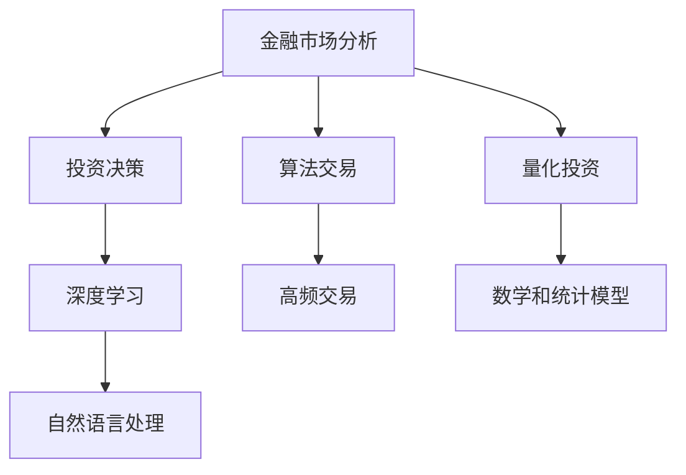

                 

# AI如何改变金融市场分析和投资决策

> 关键词：金融分析, 投资决策, 算法交易, 量化投资, 机器学习, 深度学习, 金融数据, 实时分析

## 1. 背景介绍

### 1.1 问题由来
金融市场的复杂性和多变性，使其成为了一门高度依赖专业知识的领域。传统的金融分析主要依靠专业人士通过定性分析和经验积累来完成，其效率和准确性受限于人的认知限制和市场数据的变化。而随着人工智能和大数据技术的发展，AI正在逐渐改变这一局面，通过算法的力量实现更高效、更精准的市场分析与投资决策。

### 1.2 问题核心关键点
AI在金融市场分析和投资决策中的应用主要体现在以下几个方面：

- **数据处理能力**：AI可以从海量、多样化的金融数据中提取出有价值的信息，为分析提供更准确、更全面的支持。
- **模型预测能力**：基于深度学习和统计学习模型，AI能够构建出更精确的市场预测模型，识别市场趋势和机会。
- **自动化交易**：通过算法交易策略，AI能够实时捕捉市场机会，进行高频交易，提高交易效率。
- **风险控制**：AI通过模拟市场行为和分析历史数据，能够构建更有效的风险控制模型，降低投资风险。
- **个性化投资**：AI能够根据投资者行为和偏好，提供定制化的投资建议，提升投资体验。

### 1.3 问题研究意义
AI在金融市场分析和投资决策中的应用，能够显著提升分析效率和决策准确性，帮助投资者更好地把握市场机会，同时降低投资风险。它不仅能提高个人和机构投资者在金融市场的竞争力，还能推动整个金融行业的数字化转型，提高金融服务的普惠性。

## 2. 核心概念与联系

### 2.1 核心概念概述

为更好地理解AI在金融市场分析和投资决策中的应用，本节将介绍几个密切相关的核心概念：

- **金融市场分析**：通过对市场数据和相关信息进行分析，识别出市场趋势、价格波动等规律，为投资决策提供依据。
- **投资决策**：基于分析结果，制定买入、卖出或持有等投资策略，以实现资金增值。
- **算法交易**：通过自动化的交易策略，捕捉市场机会，进行高频交易，以提高交易效率和收益。
- **量化投资**：利用数学和统计模型对市场进行量化分析，构建自动化投资策略。
- **深度学习**：一种基于神经网络的机器学习方法，能够处理复杂的非线性关系。
- **自然语言处理**：一种AI技术，能够处理文本数据，进行情感分析、舆情监控等任务。

这些核心概念之间的逻辑关系可以通过以下Mermaid流程图来展示：



这个流程图展示了几者之间的关系：

1. 金融市场分析通过多种技术手段（如深度学习、自然语言处理等）对市场数据进行分析。
2. 投资决策基于分析结果，制定投资策略。
3. 算法交易利用自动化策略，捕捉市场机会。
4. 量化投资构建基于数学模型的投资策略。
5. 深度学习用于处理复杂的市场数据和关系。
6. 自然语言处理用于处理文本数据，进行舆情分析等。

这些概念共同构成了AI在金融市场分析和投资决策中的应用框架，使其能够高效地进行市场分析和投资策略制定。

## 3. 核心算法原理 & 具体操作步骤
### 3.1 算法原理概述

AI在金融市场分析和投资决策中的应用，主要依赖于机器学习和深度学习模型。其核心思想是通过对历史数据和市场信息的学习，构建出能够预测市场变化、识别投资机会的模型。

形式化地，假设市场数据为 $D=\{(x_i,y_i)\}_{i=1}^N$，其中 $x_i$ 为市场特征向量，$y_i$ 为市场价格或其他相关指标。训练集的目的是找到一个映射函数 $f(x)$，使得 $f(x_i)$ 能够预测 $y_i$。常用的算法包括线性回归、决策树、随机森林、支持向量机、深度神经网络等。

金融市场分析和投资决策的AI算法流程如下：

1. **数据预处理**：清洗、归一化、标准化市场数据。
2. **特征选择**：根据历史数据和市场特征，选择最具预测能力的特征。
3. **模型构建**：选择合适的模型（如LSTM、GRU、CNN等），进行参数初始化和模型训练。
4. **模型评估**：在测试集上评估模型性能，选择最优模型。
5. **投资决策**：基于模型预测结果，制定投资策略。

### 3.2 算法步骤详解

以深度学习模型在股票市场中的预测为例，以下是具体的算法步骤：

**Step 1: 数据准备**
- 收集历史股票价格、交易量、市值、财务报表等市场数据，进行清洗和预处理。
- 选取最具预测能力的特征，构建特征向量 $x$。

**Step 2: 模型构建**
- 选择合适的深度学习模型，如LSTM、GRU等，构建预测模型。
- 定义模型输入、输出和损失函数，选择合适的优化器和超参数。
- 将数据集划分训练集、验证集和测试集，进行模型训练。

**Step 3: 模型评估**
- 在测试集上评估模型性能，计算准确率、召回率、F1分数等指标。
- 根据评估结果调整模型参数，优化模型性能。

**Step 4: 投资决策**
- 根据模型预测结果，制定买入、卖出或持有等投资策略。
- 根据市场情况，进行动态调整，实时优化投资组合。

### 3.3 算法优缺点

AI在金融市场分析和投资决策中的应用具有以下优点：

1. **高效性**：AI能够快速处理海量数据，提供实时分析，提高决策效率。
2. **客观性**：AI模型基于历史数据和市场信息，避免人为情绪和偏见的影响，决策更加客观。
3. **可扩展性**：AI模型能够处理多种金融数据，适用于多种市场和策略。
4. **准确性**：基于深度学习等先进算法，AI模型能够捕捉复杂的非线性关系，预测精度较高。

同时，AI也存在一些局限性：

1. **数据质量依赖**：AI模型的效果依赖于数据质量和特征选择，数据质量差或不充分可能导致模型失效。
2. **模型复杂度**：深度学习模型参数众多，训练复杂，需要大量的计算资源。
3. **市场变化**：市场环境和投资者行为的变化可能超出模型预期，导致模型失效。
4. **透明度不足**：AI模型的决策过程较为复杂，难以解释和理解。
5. **过拟合风险**：模型对训练数据过度拟合，可能无法泛化到新数据。

### 3.4 算法应用领域

AI在金融市场分析和投资决策中的应用广泛，涵盖了股票、债券、商品、外汇等多种市场和策略。以下是一些具体的应用场景：

- **股票投资**：通过分析历史股票价格和交易数据，构建股票价格预测模型，制定股票买入和卖出策略。
- **债券交易**：分析债券市场利率、信用评级等信息，构建债券价格预测模型，进行债券套利和投资。
- **外汇交易**：利用AI模型分析外汇汇率变化趋势，进行外汇交易和套利。
- **量化投资**：通过数学和统计模型分析市场数据，构建自动化投资策略，进行高频交易。
- **风险管理**：构建风险评估模型，实时监控投资组合风险，进行动态调整。
- **舆情分析**：利用自然语言处理技术，分析新闻、社交媒体等文本数据，进行市场情绪监控和舆情分析。

## 4. 数学模型和公式 & 详细讲解  
### 4.1 数学模型构建

以下是金融市场分析和投资决策中的常见数学模型及其构建方法：

**线性回归模型**
- 假设 $y_i = \beta_0 + \beta_1x_{i1} + \ldots + \beta_px_{ip} + \epsilon_i$，其中 $\epsilon_i \sim N(0, \sigma^2)$。
- 最小二乘法求解参数 $\beta$。

**LSTM模型**
- 利用长短期记忆网络处理时间序列数据，捕捉市场变化趋势。
- 定义LSTM模型结构，进行前向传播和反向传播，更新模型参数。

**多因子模型**
- 通过多因子模型（如Fama-French模型）分析市场数据，构建投资策略。
- 假设 $r_i = \alpha + \beta_fF_f + \beta_mM_m + \beta_hH_h + \epsilon_i$。

**随机森林模型**
- 利用随机森林处理高维数据，识别市场特征。
- 定义随机森林模型结构，进行训练和预测。

**深度神经网络**
- 利用深度神经网络处理复杂非线性关系，构建预测模型。
- 定义神经网络结构，进行前向传播和反向传播，更新模型参数。

### 4.2 公式推导过程

以线性回归模型为例，推导最小二乘法的求解过程：

- **假设**：$y_i = \beta_0 + \beta_1x_{i1} + \ldots + \beta_px_{ip} + \epsilon_i$，其中 $\epsilon_i \sim N(0, \sigma^2)$。
- **目标**：最小化预测误差 $\epsilon_i = y_i - \hat{y}_i = y_i - \beta_0 - \beta_1x_{i1} - \ldots - \beta_px_{ip}$。
- **求解**：最小化平方误差和 $\sum_{i=1}^N(y_i - \hat{y}_i)^2$，对 $\beta$ 求偏导，得 $\frac{\partial}{\partial \beta}\sum_{i=1}^N(y_i - \hat{y}_i)^2 = 2\sum_{i=1}^N(y_i - \hat{y}_i)x_{ij}$，其中 $j$ 表示第 $j$ 个特征。
- **解方程**：$\sum_{i=1}^N(x_{ij}(y_i - \hat{y}_i)) = 0$，解得 $\beta_j = \frac{\sum_{i=1}^N(x_{ij}y_i)}{\sum_{i=1}^N(x_{ij}^2)}$。

### 4.3 案例分析与讲解

以深度学习模型在股票市场中的预测为例，讲解模型的构建和应用：

**案例背景**
- 公司收集了某股票的历史价格、交易量、市值、财务报表等数据。
- 选择时间跨度为一年，分为训练集和测试集，各占80%和20%。

**模型构建**
- 定义LSTM模型结构，包含输入层、LSTM层、全连接层和输出层。
- 输入层：输入时间序列数据，维度为 $(t-1, D)$，其中 $t$ 为时间步数，$D$ 为输入维度。
- LSTM层：使用LSTM网络捕捉时间序列的非线性关系。
- 全连接层：将LSTM层的输出映射到输出层。
- 输出层：定义预测模型，输出股票价格预测值。

**训练和评估**
- 使用Adam优化器，设定学习率为 $0.001$，训练1000个epoch。
- 在测试集上评估模型性能，计算均方误差、平均绝对误差等指标。
- 根据评估结果调整模型参数，优化模型性能。

**投资决策**
- 根据模型预测结果，制定股票买入和卖出策略。
- 实时监控股票价格变化，动态调整投资组合，实现收益最大化。

## 5. 项目实践：代码实例和详细解释说明
### 5.1 开发环境搭建

在进行AI在金融市场分析和投资决策的实践前，我们需要准备好开发环境。以下是使用Python进行TensorFlow开发的典型环境配置流程：

1. 安装Anaconda：从官网下载并安装Anaconda，用于创建独立的Python环境。

2. 创建并激活虚拟环境：
```bash
conda create -n tf-env python=3.7 
conda activate tf-env
```

3. 安装TensorFlow：根据CUDA版本，从官网获取对应的安装命令。例如：
```bash
conda install tensorflow -c tf -c conda-forge
```

4. 安装其他相关库：
```bash
pip install pandas numpy scipy matplotlib scikit-learn
```

完成上述步骤后，即可在`tf-env`环境中开始项目实践。

### 5.2 源代码详细实现

这里我们以LSTM模型在股票市场中的预测为例，给出使用TensorFlow和Keras进行股票价格预测的Python代码实现。

```python
import tensorflow as tf
from tensorflow.keras.layers import LSTM, Dense, Dropout
from tensorflow.keras.models import Sequential
from tensorflow.keras.optimizers import Adam
from tensorflow.keras.metrics import MeanSquaredError, MeanAbsoluteError
from tensorflow.keras.callbacks import EarlyStopping

# 数据预处理
# ...

# 模型构建
model = Sequential()
model.add(LSTM(64, input_shape=(t-1, D), return_sequences=True))
model.add(Dropout(0.2))
model.add(LSTM(32))
model.add(Dropout(0.2))
model.add(Dense(1))
model.compile(optimizer=Adam(lr=0.001), loss=MeanSquaredError(), metrics=[MeanSquaredError(), MeanAbsoluteError()])

# 训练和评估
early_stopping = EarlyStopping(monitor='val_loss', patience=10)
model.fit(X_train, y_train, batch_size=64, epochs=1000, validation_data=(X_val, y_val), callbacks=[early_stopping])
test_loss, test_mse, test_mae = model.evaluate(X_test, y_test)

# 投资决策
predictions = model.predict(X_test)
# ...

```

以上代码实现了LSTM模型的构建、训练和预测。在实际应用中，还需要结合业务逻辑进行模型优化和投资决策的实现。

### 5.3 代码解读与分析

让我们再详细解读一下关键代码的实现细节：

**数据预处理**
- 使用Pandas库进行数据清洗、归一化、标准化等预处理操作。
- 构建特征向量 $x$，并将其转化为LSTM模型的输入格式。

**模型构建**
- 使用Keras框架构建LSTM模型，包含LSTM层、Dropout层和全连接层。
- 定义模型结构，编译模型，设置优化器、损失函数和评估指标。

**训练和评估**
- 使用EarlyStopping回调函数，避免模型在训练过程中过拟合。
- 在训练集上训练模型，并实时在验证集上评估模型性能。
- 根据评估结果调整模型参数，优化模型性能。

**投资决策**
- 使用模型预测结果，制定买入、卖出或持有等投资策略。
- 实时监控市场变化，动态调整投资组合，实现收益最大化。

## 6. 实际应用场景
### 6.1 智能投顾平台
智能投顾平台利用AI算法对用户数据进行分析，提供个性化的投资建议。具体实现过程如下：

1. 收集用户历史交易记录、偏好、风险承受能力等数据。
2. 利用机器学习模型分析用户行为和市场数据，构建投资组合。
3. 根据市场变化和用户反馈，动态调整投资组合，优化投资策略。
4. 提供实时投资建议，辅助用户进行投资决策。

### 6.2 高频交易系统
高频交易系统利用AI算法进行高频交易，捕捉市场机会。具体实现过程如下：

1. 实时收集市场数据，包括股票价格、交易量、订单簿等。
2. 利用AI模型分析市场数据，识别交易机会。
3. 根据市场变化，动态调整交易策略，进行高频交易。
4. 实时监控交易结果，优化交易模型，提高交易效率。

### 6.3 风险管理系统
风险管理系统利用AI算法进行风险评估和监控，具体实现过程如下：

1. 收集投资组合的历史数据和市场数据。
2. 利用AI模型分析市场变化和投资组合风险。
3. 实时监控投资组合风险，动态调整投资策略。
4. 提供风险报告，辅助投资者进行风险管理。

## 7. 工具和资源推荐
### 7.1 学习资源推荐

为了帮助开发者系统掌握AI在金融市场分析和投资决策的理论基础和实践技巧，这里推荐一些优质的学习资源：

1. 《深度学习在金融中的应用》：由深度学习专家撰写，深入浅出地介绍了深度学习在金融分析中的应用。

2. 《金融数据分析与预测》：讲解了金融数据分析的常见方法和技术，提供了大量的实际案例。

3. 《量化投资入门》：介绍了量化投资的原理和策略，提供了基于Python的实战代码。

4. 《机器学习在金融中的应用》：讲解了机器学习在金融领域的应用，涵盖了分类、回归、聚类等多种模型。

5. TensorFlow官方文档：提供了TensorFlow的详细使用指南，涵盖模型的构建、训练和部署等各个环节。

6. Keras官方文档：提供了Keras的详细使用指南，涵盖模型的构建和训练等各个环节。

通过对这些资源的学习实践，相信你一定能够快速掌握AI在金融市场分析和投资决策的精髓，并用于解决实际的金融问题。

### 7.2 开发工具推荐

高效的开发离不开优秀的工具支持。以下是几款用于AI在金融市场分析和投资决策开发的常用工具：

1. TensorFlow：由Google主导开发的开源深度学习框架，生产部署方便，适合大规模工程应用。

2. Keras：基于TensorFlow的高级API，提供了简单易用的接口，适合快速迭代研究。

3. Jupyter Notebook：在线Jupyter Notebook环境，免费提供GPU/TPU算力，方便开发者快速上手实验最新模型，分享学习笔记。

4. Weights & Biases：模型训练的实验跟踪工具，可以记录和可视化模型训练过程中的各项指标，方便对比和调优。

5. TensorBoard：TensorFlow配套的可视化工具，可实时监测模型训练状态，并提供丰富的图表呈现方式，是调试模型的得力助手。

合理利用这些工具，可以显著提升AI在金融市场分析和投资决策任务的开发效率，加快创新迭代的步伐。

### 7.3 相关论文推荐

AI在金融市场分析和投资决策中的应用源于学界的持续研究。以下是几篇奠基性的相关论文，推荐阅读：

1. "Financial Time Series Prediction Using Recurrent Neural Networks"：利用RNN模型进行金融时间序列预测。

2. "Quantitative Trading: How to Build Your Own Algorithmic Trading Business"：讲解了量化交易的原理和策略，提供了基于Python的实战代码。

3. "Machine Learning in Finance"：介绍了机器学习在金融领域的应用，涵盖了分类、回归、聚类等多种模型。

4. "Deep Learning in Financial Analysis"：介绍了深度学习在金融分析中的应用，提供了大量的实际案例。

5. "Algorithmic Trading: Winning Strategies and Their Rationale"：讲解了算法交易的原理和策略，提供了基于Python的实战代码。

这些论文代表了大数据和深度学习技术在金融分析中的应用脉络。通过学习这些前沿成果，可以帮助研究者把握学科前进方向，激发更多的创新灵感。

## 8. 总结：未来发展趋势与挑战

### 8.1 总结

本文对AI在金融市场分析和投资决策中的应用进行了全面系统的介绍。首先阐述了AI技术在金融领域的应用背景和意义，明确了AI在市场分析和投资决策中的核心作用。其次，从原理到实践，详细讲解了AI算法在金融分析中的构建和应用，给出了具体的代码实例。同时，本文还广泛探讨了AI在金融市场分析和投资决策中的实际应用场景，展示了AI技术的巨大潜力。

通过本文的系统梳理，可以看到，AI在金融市场分析和投资决策中的应用正在改变传统的金融分析模式，提高分析效率和决策准确性，帮助投资者更好地把握市场机会，降低投资风险。未来，伴随AI技术的持续演进，AI在金融领域的应用将更加广泛和深入。

### 8.2 未来发展趋势

展望未来，AI在金融市场分析和投资决策中的应用将呈现以下几个发展趋势：

1. **自动化交易**：随着深度学习模型的不断优化，AI在交易策略中的应用将更加广泛和深入。

2. **个性化投资**：AI能够根据用户行为和偏好，提供更加个性化和定制化的投资建议，提升用户体验。

3. **多模态融合**：AI将结合文本、图像、语音等多种数据源，进行更加全面的市场分析。

4. **实时分析**：AI能够实时分析市场数据，提供动态的投资建议和交易策略。

5. **强化学习**：通过强化学习技术，AI能够不断优化交易策略，适应市场变化。

6. **模型透明化**：AI模型的可解释性和透明性将不断提升，投资者能够更好地理解模型的决策过程。

### 8.3 面临的挑战

尽管AI在金融市场分析和投资决策中的应用已经取得了显著成果，但在迈向更加智能化、普适化应用的过程中，它仍面临诸多挑战：

1. **数据质量**：AI模型的效果依赖于数据质量，数据缺失、噪声、偏差等问题可能影响模型的准确性。

2. **模型复杂度**：深度学习模型参数众多，训练复杂，需要大量的计算资源。

3. **市场变化**：市场环境和投资者行为的变化可能超出模型预期，导致模型失效。

4. **模型透明性**：AI模型的决策过程较为复杂，难以解释和理解。

5. **过拟合风险**：模型对训练数据过度拟合，可能无法泛化到新数据。

6. **安全性**：AI模型可能受到恶意攻击，导致数据泄露或模型被篡改。

7. **法律合规**：金融领域有严格的法律和合规要求，AI模型的使用需要符合相关规定。

### 8.4 研究展望

面对AI在金融市场分析和投资决策中面临的挑战，未来的研究需要在以下几个方面寻求新的突破：

1. **数据预处理技术**：开发更加高效、可靠的数据预处理技术，提升数据质量。

2. **模型简化技术**：开发更加参数高效和计算高效的模型，提高模型训练效率。

3. **模型透明化技术**：开发模型可解释性技术，提升模型的透明性和可理解性。

4. **强化学习技术**：结合强化学习技术，优化交易策略，适应市场变化。

5. **多模态融合技术**：结合多种数据源，进行多模态融合，提升模型的全面性和准确性。

6. **安全性保障**：开发模型安全性技术，保障模型的安全性和可靠性。

这些研究方向的研究进展，将推动AI在金融市场分析和投资决策中的应用向更加智能化、普适化和安全的方向发展。

## 9. 附录：常见问题与解答

**Q1：AI在金融市场分析中的应用有哪些？**

A: AI在金融市场分析中的应用包括股票价格预测、债券价格预测、外汇交易、量化投资、风险管理、舆情分析等多个方面。AI能够通过历史数据和市场信息，构建出能够预测市场变化、识别投资机会的模型。

**Q2：AI在金融市场分析中需要注意哪些问题？**

A: AI在金融市场分析中需要注意以下问题：

1. **数据质量**：数据缺失、噪声、偏差等问题可能影响模型的准确性。

2. **模型复杂度**：深度学习模型参数众多，训练复杂，需要大量的计算资源。

3. **市场变化**：市场环境和投资者行为的变化可能超出模型预期，导致模型失效。

4. **模型透明性**：AI模型的决策过程较为复杂，难以解释和理解。

5. **过拟合风险**：模型对训练数据过度拟合，可能无法泛化到新数据。

**Q3：AI在金融市场分析中的优势是什么？**

A: AI在金融市场分析中的优势包括：

1. **高效性**：AI能够快速处理海量数据，提供实时分析，提高决策效率。

2. **客观性**：AI模型基于历史数据和市场信息，避免人为情绪和偏见的影响，决策更加客观。

3. **可扩展性**：AI模型能够处理多种金融数据，适用于多种市场和策略。

4. **准确性**：基于深度学习等先进算法，AI模型能够捕捉复杂的非线性关系，预测精度较高。

**Q4：AI在金融市场分析中如何防止过拟合？**

A: 防止AI模型过拟合的方法包括：

1. **数据增强**：通过数据增强技术，扩充训练集，提升模型泛化能力。

2. **正则化**：使用L2正则化、Dropout等技术，避免模型对训练数据的过度拟合。

3. **模型简化**：使用模型简化技术，如参数共享、蒸馏等，降低模型复杂度。

4. **交叉验证**：通过交叉验证技术，评估模型性能，避免模型在特定数据上过度拟合。

**Q5：AI在金融市场分析中如何提高模型的透明性？**

A: 提高AI模型透明性的方法包括：

1. **可解释模型**：使用可解释模型，如线性回归、决策树等，提升模型的透明性。

2. **特征重要性分析**：通过特征重要性分析技术，识别出模型预测的关键特征，提升模型的可理解性。

3. **可视化技术**：使用可视化技术，如梯度图、热力图等，展示模型的决策过程，提升模型的透明性。

这些方法能够帮助投资者更好地理解模型的决策过程，提高模型的可信度和可靠性。

---

作者：禅与计算机程序设计艺术 / Zen and the Art of Computer Programming

