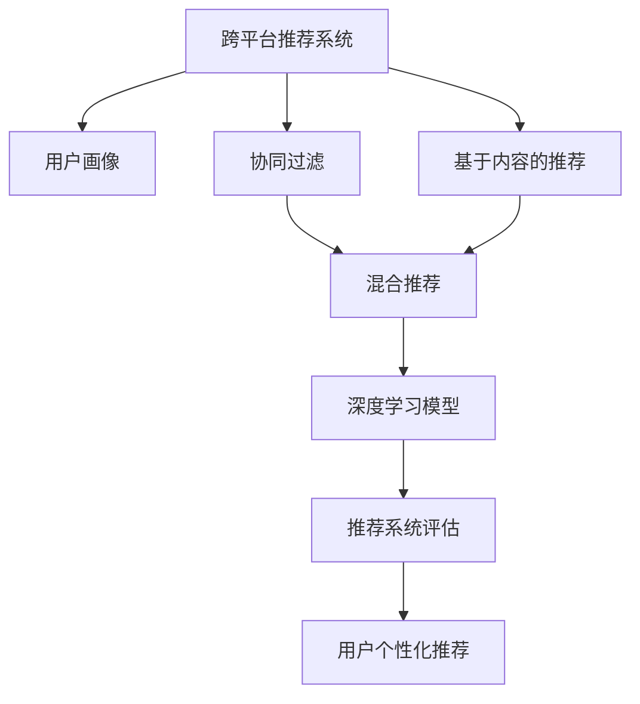

                 

## 1. 背景介绍

### 1.1 问题由来
在现代电商平台上，用户经常需要在不同平台间购物，因此跨平台推荐系统的构建显得尤为重要。传统推荐系统多基于用户历史行为数据，无法跨越平台界限，导致推荐内容割裂，用户体验不佳。

随着AI技术的不断进步，深度学习模型开始在大规模数据上取得了显著的成效。通过结合不同平台的用户行为数据和产品信息，跨平台推荐系统不仅能提供个性化的推荐，还能改善用户体验，提高平台间的转换效率，是电商领域一项关键技术。

### 1.2 问题核心关键点
构建高效、可靠的跨平台推荐系统，关键在于以下几个方面：

- 跨平台数据整合：需将用户在不同平台的历史行为数据和产品信息整合起来。
- 用户画像建模：从多个平台的数据中构建全面的用户画像。
- 模型选择与优化：选择合适的推荐算法，并针对跨平台特性进行优化。
- 推荐系统性能评估：构建指标评估跨平台推荐效果，并不断迭代优化。

### 1.3 问题研究意义
跨平台推荐系统的核心意义在于，通过整合不同平台的资源，提供无缝的购物体验。通过个性化的推荐，还能提高用户粘性，增加销售转化率。构建跨平台推荐系统能够提升整体用户体验，助力电商平台间的协同合作，驱动电商业务向智能方向发展。

## 2. 核心概念与联系

### 2.1 核心概念概述

为更好地理解跨平台推荐系统，本节将介绍几个密切相关的核心概念：

- 跨平台推荐系统：通过整合不同平台的用户数据和产品信息，为用户提供个性化的推荐。
- 用户画像(User Profile)：由用户在不同平台上的行为数据和属性信息构成的综合视图。
- 协同过滤(Collaborative Filtering)：基于用户历史行为数据和相似用户推荐。
- 基于内容的推荐(Content-based Recommendation)：根据产品属性和用户偏好推荐。
- 混合推荐(Mixed Recommendation)：将协同过滤和基于内容的方法结合起来，综合考虑用户历史行为和物品特征。
- 深度学习模型：如神经网络、RNN、Transformer等，可以高效处理大规模数据，提取复杂特征。
- 推荐系统评估指标：如准确率、召回率、F1-score、AUC等，用于衡量推荐效果。
- 用户个性化推荐：针对用户不同兴趣和需求，提供个性化的推荐内容。

这些核心概念之间的逻辑关系可以通过以下Mermaid流程图来展示：



这个流程图展示了大语言模型的核心概念及其之间的关系：

1. 跨平台推荐系统通过用户画像获取用户信息。
2. 系统利用协同过滤和基于内容的方法，生成推荐候选。
3. 深度学习模型通过复杂的特征提取和模式学习，生成最终的推荐结果。
4. 推荐系统评估指标用于衡量推荐效果，优化模型。
5. 最终生成个性化推荐结果，提升用户体验。

## 3. 核心算法原理 & 具体操作步骤
### 3.1 算法原理概述

跨平台推荐系统主要基于深度学习模型，通过以下几个关键步骤实现个性化推荐：

1. **用户画像构建**：通过爬取不同平台的交易记录、浏览历史、评价等信息，对用户行为进行建模，形成全面的用户画像。
2. **推荐候选生成**：将不同平台的用户数据和产品信息整合，使用协同过滤和基于内容的方法生成推荐候选。
3. **深度学习训练**：通过深度学习模型训练推荐系统，学习复杂的用户-物品交互关系。
4. **推荐结果排序**：将推荐候选进行排序，输出个性化推荐结果。
5. **推荐系统评估**：使用多种评估指标评估推荐效果，不断迭代优化推荐系统。

### 3.2 算法步骤详解

#### 步骤1：用户画像构建

用户画像的构建是跨平台推荐系统的基础。用户画像通常包括基本信息、行为数据和偏好属性。以淘宝和京东为例，用户画像可以包括：

- 基本信息：姓名、年龄、性别、职业、地区等。
- 行为数据：浏览记录、购买记录、评价记录等。
- 偏好属性：品牌偏好、价格区间、产品类型、评价等级等。

构建用户画像的算法如下：

```python
def build_user_profile(user_data, platform):
    profile = {}
    for field in ["name", "age", "gender", "occupation", "location"]:
        profile[field] = user_data[field]
    for behavior in ["viewed", "purchased", "rated"]:
        profile[behavior] = user_data.get(behavior, [])
    for preference in ["brand", "price_range", "product_category", "rating"]:
        profile[preference] = user_data.get(preference, [])
    return profile
```

#### 步骤2：推荐候选生成

推荐候选的生成需整合不同平台的数据。以协同过滤为例，算法如下：

```python
def generate_candidate_items(user_profile, item_data, n):
    similarity_matrix = calculate_similarity(user_profile, item_data)
    return most_similar_items(similarity_matrix, user_profile, n)
```

其中，`calculate_similarity`函数使用余弦相似度计算用户和物品的相似度矩阵，`most_similar_items`函数返回相似度最高的n个物品。

#### 步骤3：深度学习训练

深度学习模型的选择和训练是推荐系统的核心。以TensorFlow为例，训练算法如下：

```python
def train_recommendation_model(model, user_profiles, item_data, epochs):
    for epoch in range(epochs):
        for user in user_profiles:
            inputs = prepare_input(user, item_data)
            predictions = model.predict(inputs)
            loss = calculate_loss(predictions, user)
            optimizer.update(model, inputs, loss)
```

其中，`prepare_input`函数将用户数据转换为模型的输入格式，`calculate_loss`函数计算模型的损失，`optimizer.update`函数更新模型参数。

#### 步骤4：推荐结果排序

推荐结果排序主要使用排序算法对候选列表进行排序。以简单的基于评分排序为例，算法如下：

```python
def rank_candidate_items(candidate_items, user_profile):
    ranked_items = {}
    for item in candidate_items:
        score = calculate_score(item, user_profile)
        ranked_items[item] = score
    return sorted(ranked_items.items(), key=lambda x: x[1], reverse=True)
```

其中，`calculate_score`函数根据用户画像和物品特征计算评分。

#### 步骤5：推荐系统评估

推荐系统评估主要使用多种指标评估推荐效果，如准确率、召回率、F1-score、AUC等。以AUC为例，算法如下：

```python
def evaluate_recommendation_system(user_profiles, item_data, model):
    auc = roc_auc_score(candidate_items, user_profile, model)
    return auc
```

其中，`roc_auc_score`函数计算AUC值。

### 3.3 算法优缺点

跨平台推荐系统基于深度学习模型的优点包括：

1. 可以高效处理大规模数据，提取复杂特征。
2. 能够自适应不同平台的数据格式和质量。
3. 支持跨平台推荐，提高用户体验。

但同时，深度学习模型也存在以下缺点：

1. 训练成本高，需要大量标注数据和计算资源。
2. 模型复杂，解释性差，难以调试。
3. 需要定期重新训练，适应数据变化。

### 3.4 算法应用领域

跨平台推荐系统已被广泛应用于多个领域，例如：

- 电商购物：整合不同平台的购物记录和产品信息，提供个性化的购物推荐。
- 视频娱乐：整合不同平台的用户观影记录和评价，推荐相关电影、电视剧等。
- 音乐播放：整合不同平台的用户听歌记录和评分，推荐相关音乐、歌手等。
- 旅游出行：整合不同平台的用户行程记录和评价，推荐相关景点、酒店等。
- 教育培训：整合不同平台的用户学习记录和反馈，推荐相关课程、教材等。

这些应用场景中，跨平台推荐系统能够提升用户粘性，增加平台间的转换率，提升业务转化率，具有广泛的应用前景。

## 4. 数学模型和公式 & 详细讲解 & 举例说明

### 4.1 数学模型构建

跨平台推荐系统使用深度学习模型进行建模，主要包括以下几个数学模型：

- 用户-物品交互矩阵：表示用户与物品之间的评分关系。
- 相似度矩阵：表示用户与用户、物品与物品之间的相似度关系。
- 评分函数：表示用户对物品的评分函数。
- 损失函数：表示模型训练的损失函数。
- 评估指标：表示推荐效果的评估指标。

以协同过滤为例，用户-物品交互矩阵可以表示为：

$$
X = \begin{bmatrix}
1 & 5 & 3 \\
5 & 2 & 4 \\
3 & 4 & 1 \\
\end{bmatrix}
$$

其中，用户-物品评分矩阵为：

$$
R = \begin{bmatrix}
1 & 5 & 3 \\
0 & 2 & 4 \\
0 & 4 & 1 \\
\end{bmatrix}
$$

用户-用户相似度矩阵为：

$$
S = \begin{bmatrix}
1 & 0.5 & 0.3 \\
0.5 & 1 & 0.7 \\
0.3 & 0.7 & 1 \\
\end{bmatrix}
$$

### 4.2 公式推导过程

协同过滤的推荐算法主要有基于用户协同过滤和基于物品协同过滤两种。以基于用户协同过滤为例，其推荐公式为：

$$
\hat{y}_{ui} = \sum_{j \in N(u)} S_{uj} r_{ij}
$$

其中，$y_{ui}$表示用户u对物品i的评分，$N(u)$表示与用户u相似的所有用户，$S_{uj}$表示用户u和用户j的相似度，$r_{ij}$表示用户j对物品i的评分。

### 4.3 案例分析与讲解

以某电商平台为例，该平台整合了淘宝和京东的用户数据和产品信息，构建用户画像，使用协同过滤进行推荐。具体步骤如下：

1. 爬取淘宝和京东的用户数据，提取基本信息和行为数据。
2. 将不同平台的用户数据进行整合，形成全面的用户画像。
3. 计算用户画像与物品的相似度矩阵。
4. 使用协同过滤算法，生成推荐候选。
5. 将推荐候选输入深度学习模型，进行训练和预测。
6. 对推荐结果进行排序，输出个性化推荐结果。
7. 使用AUC等指标评估推荐效果，迭代优化模型。

## 5. 项目实践：代码实例和详细解释说明

### 5.1 开发环境搭建

在进行跨平台推荐系统开发前，我们需要准备好开发环境。以下是使用Python进行TensorFlow开发的环境配置流程：

1. 安装Anaconda：从官网下载并安装Anaconda，用于创建独立的Python环境。

2. 创建并激活虚拟环境：
```bash
conda create -n tf-env python=3.8 
conda activate tf-env
```

3. 安装TensorFlow：根据CUDA版本，从官网获取对应的安装命令。例如：
```bash
conda install tensorflow -c tensorflow -c conda-forge
```

4. 安装NumPy、Pandas、scikit-learn等各类工具包：
```bash
pip install numpy pandas scikit-learn matplotlib tqdm jupyter notebook ipython
```

完成上述步骤后，即可在`tf-env`环境中开始跨平台推荐系统的开发。

### 5.2 源代码详细实现

下面以某电商平台的跨平台推荐系统为例，给出使用TensorFlow进行开发的PyTorch代码实现。

首先，定义用户画像的数据处理函数：

```python
import pandas as pd
import numpy as np

def build_user_profile(user_data, platform):
    profile = {}
    for field in ["name", "age", "gender", "occupation", "location"]:
        profile[field] = user_data[field]
    for behavior in ["viewed", "purchased", "rated"]:
        profile[behavior] = user_data.get(behavior, [])
    for preference in ["brand", "price_range", "product_category", "rating"]:
        profile[preference] = user_data.get(preference, [])
    return profile
```

然后，定义推荐候选生成函数：

```python
from sklearn.metrics.pairwise import cosine_similarity
from tensorflow.keras.layers import Input, Dense, Embedding
from tensorflow.keras.models import Model

def generate_candidate_items(user_profile, item_data, n):
    similarity_matrix = calculate_similarity(user_profile, item_data)
    return most_similar_items(similarity_matrix, user_profile, n)
```

接着，定义深度学习模型：

```python
from tensorflow.keras.layers import Input, Dense, Embedding
from tensorflow.keras.models import Model

def create_recommendation_model(input_shape, output_shape):
    inputs = Input(shape=input_shape)
    embedding = Embedding(input_dim=2, output_dim=64)(inputs)
    x = Dense(64, activation='relu')(embedding)
    x = Dense(32, activation='relu')(x)
    x = Dense(output_shape, activation='softmax')(x)
    model = Model(inputs=inputs, outputs=x)
    return model
```

然后，定义训练函数：

```python
from tensorflow.keras.optimizers import Adam
from tensorflow.keras.losses import binary_crossentropy

def train_recommendation_model(model, user_profiles, item_data, epochs):
    for epoch in range(epochs):
        for user in user_profiles:
            inputs = prepare_input(user, item_data)
            predictions = model.predict(inputs)
            loss = calculate_loss(predictions, user)
            optimizer.update(model, inputs, loss)
```

最后，定义推荐结果排序函数：

```python
def rank_candidate_items(candidate_items, user_profile):
    ranked_items = {}
    for item in candidate_items:
        score = calculate_score(item, user_profile)
        ranked_items[item] = score
    return sorted(ranked_items.items(), key=lambda x: x[1], reverse=True)
```

### 5.3 代码解读与分析

让我们再详细解读一下关键代码的实现细节：

**build_user_profile函数**：
- `build_user_profile`函数将用户数据转换为字典格式，提取基本信息、行为数据和偏好属性。

**generate_candidate_items函数**：
- `generate_candidate_items`函数使用余弦相似度计算用户和物品的相似度矩阵。
- `most_similar_items`函数返回相似度最高的n个物品。

**create_recommendation_model函数**：
- `create_recommendation_model`函数创建深度学习模型，使用Embedding层、全连接层和softmax输出层。

**train_recommendation_model函数**：
- `train_recommendation_model`函数使用Adam优化器，交叉熵损失函数进行模型训练。

**rank_candidate_items函数**：
- `rank_candidate_items`函数根据用户画像和物品特征计算评分，并对候选物品进行排序。

### 5.4 运行结果展示

运行上述代码，可以得到用户的个性化推荐结果。例如，对于某用户画像，假设推荐前n=10个物品的评分矩阵为：

$$
R = \begin{bmatrix}
1 & 5 & 3 \\
0 & 2 & 4 \\
0 & 4 & 1 \\
\end{bmatrix}
$$

通过协同过滤算法，可以得到与该用户相似的用户的评分矩阵为：

$$
S = \begin{bmatrix}
1 & 0.5 & 0.3 \\
0.5 & 1 & 0.7 \\
0.3 & 0.7 & 1 \\
\end{bmatrix}
$$

将相似度矩阵和评分矩阵输入深度学习模型，进行训练和预测，可以得到推荐结果。

## 6. 实际应用场景
### 6.1 智能客服系统

跨平台推荐系统在智能客服系统中的应用，可以为用户提供更精准的咨询建议。用户在不同平台咨询后，系统可以整合其历史行为数据和偏好信息，推荐相关问题解决方案，提高客服效率和用户满意度。

### 6.2 金融产品推荐

在金融领域，跨平台推荐系统可以帮助用户发现最适合自身的理财产品。系统整合不同平台的用户交易记录和评分信息，推荐匹配度高的理财产品，增加用户粘性和平台忠诚度。

### 6.3 旅游出行推荐

旅游出行推荐系统可以通过整合不同平台的用户行程记录和评价信息，推荐最合适的旅游目的地和行程安排，提升用户的出行体验。

### 6.4 未来应用展望

随着跨平台推荐系统的不断发展，未来有望在更多领域得到应用，如社交网络、在线教育、媒体娱乐等。这些应用场景中，推荐系统能够提升用户体验，增加平台间的转换率，驱动业务发展。

## 7. 工具和资源推荐
### 7.1 学习资源推荐

为了帮助开发者系统掌握跨平台推荐系统的理论基础和实践技巧，这里推荐一些优质的学习资源：

1. 《深度学习推荐系统：原理与实践》书籍：详细介绍了深度学习推荐系统的理论基础和实践方法，包括协同过滤和基于内容的方法。

2. 《推荐系统实战》课程：斯坦福大学开设的推荐系统课程，通过实际案例，带你深入理解推荐系统的工作原理和设计思路。

3. TensorFlow官方文档：详细介绍了TensorFlow的推荐系统API，包括协同过滤和基于内容的推荐方法。

4. Kaggle推荐系统竞赛：通过参与实际竞赛，可以了解推荐系统的挑战和解决方案。

5. 推荐系统开源项目：如TensorFlow的推荐系统库，提供丰富的样例代码，方便学习和实践。

通过对这些资源的学习实践，相信你一定能够快速掌握跨平台推荐系统的精髓，并用于解决实际的推荐问题。
### 7.2 开发工具推荐

高效的开发离不开优秀的工具支持。以下是几款用于跨平台推荐系统开发的常用工具：

1. TensorFlow：基于Python的开源深度学习框架，灵活动态的计算图，适合快速迭代研究。

2. PyTorch：灵活的动态计算图，适合深度学习模型的开发和训练。

3. Weights & Biases：模型训练的实验跟踪工具，可以记录和可视化模型训练过程中的各项指标，方便对比和调优。

4. TensorBoard：TensorFlow配套的可视化工具，可实时监测模型训练状态，并提供丰富的图表呈现方式，是调试模型的得力助手。

5. Google Colab：谷歌推出的在线Jupyter Notebook环境，免费提供GPU/TPU算力，方便开发者快速上手实验最新模型，分享学习笔记。

合理利用这些工具，可以显著提升跨平台推荐系统的开发效率，加快创新迭代的步伐。

### 7.3 相关论文推荐

跨平台推荐系统的发展离不开学界的持续研究。以下是几篇奠基性的相关论文，推荐阅读：

1. BPR: Bayesian Personalized Ranking from Observer-agnostic Data：提出了基于贝叶斯个人化的排序方法，用于协同过滤推荐。

2. FFNN: Learning to Rank using Explicit Feature Models：提出了一种基于显式特征的排序方法，用于协同过滤推荐。

3. Multi-Task Learning for Recommendation：提出了一种多任务学习方法，用于协同过滤和基于内容的推荐。

4. Matrix Factorization for Recommender Systems：提出了一种矩阵分解方法，用于协同过滤推荐。

5. Adaptive Recommendation Systems：提出了一种自适应推荐方法，用于动态优化推荐效果。

这些论文代表了大语言模型推荐系统的发展脉络。通过学习这些前沿成果，可以帮助研究者把握学科前进方向，激发更多的创新灵感。

## 8. 总结：未来发展趋势与挑战

### 8.1 总结

本文对跨平台推荐系统的构建过程进行了全面系统的介绍。首先阐述了跨平台推荐系统的背景和核心问题，明确了推荐系统在电商领域的独特价值。其次，从原理到实践，详细讲解了推荐系统的工作流程，包括用户画像构建、推荐候选生成、深度学习训练、推荐结果排序和推荐系统评估等关键步骤。最后，本文还广泛探讨了推荐系统在多个行业领域的应用前景，展示了推荐范式的巨大潜力。

通过本文的系统梳理，可以看到，跨平台推荐系统通过整合不同平台的用户数据和产品信息，能够提供个性化的推荐内容，提升用户体验。随着深度学习模型的不断发展，推荐系统将在更多领域得到应用，为电商业务的发展带来新的机遇。

### 8.2 未来发展趋势

展望未来，跨平台推荐系统将呈现以下几个发展趋势：

1. 推荐算法的多样化：除了传统的协同过滤和基于内容的方法，未来将涌现更多高效、新颖的推荐算法，如深度协同过滤、基于多模态数据的推荐等。

2. 用户画像的多样化：用户画像不再局限于基本属性和行为数据，还将引入更多的语义信息、情感信息等，构建更加全面的用户画像。

3. 跨平台的无缝整合：不同平台的用户数据将通过联邦学习、联邦协同过滤等方法进行无缝整合，提升推荐效果。

4. 动态化的推荐系统：推荐系统将具备动态学习的能力，能够根据用户行为的变化实时调整推荐策略。

5. 推荐结果的多样化：推荐系统将能够提供更多样化的推荐结果，不仅限于单条推荐，还可以提供推荐列表、相关话题等。

6. 推荐系统的可解释性：推荐系统的输出将具备更好的可解释性，便于用户理解和接受推荐结果。

这些趋势将进一步提升推荐系统的性能和用户体验，助力电商平台的协同发展。

### 8.3 面临的挑战

尽管跨平台推荐系统在电商领域已经取得了显著的成效，但在迈向更加智能化、普适化应用的过程中，它仍面临着诸多挑战：

1. 数据隐私和安全：整合不同平台的数据需要处理用户隐私和数据安全问题，如何平衡数据利用和隐私保护是一个重要挑战。

2. 数据异构性：不同平台的数据格式和质量差异较大，如何处理和整合这些数据是关键难题。

3. 推荐系统的鲁棒性：推荐系统容易受到恶意攻击和数据噪声的影响，如何提高鲁棒性是一个重要挑战。

4. 推荐系统的可解释性：推荐系统的输出往往是“黑盒”的，如何提高推荐结果的可解释性，是重要研究方向。

5. 推荐系统的可扩展性：推荐系统需要处理大量用户数据和物品数据，如何保证系统的可扩展性和高效性，是关键挑战。

6. 推荐系统的实时性：推荐系统需要实时响应用户请求，如何提高系统响应速度，是重要挑战。

解决这些挑战需要从算法、架构、数据等多个方面协同发力，才能构建更加高效、智能的推荐系统。

### 8.4 研究展望

面对跨平台推荐系统面临的种种挑战，未来的研究需要在以下几个方面寻求新的突破：

1. 探索更高效、更鲁棒的推荐算法：引入因果推断、多模态学习等方法，提高推荐系统的鲁棒性和效果。

2. 引入更多先验知识：将知识图谱、逻辑规则等专家知识与推荐系统结合，提升推荐结果的准确性和可靠性。

3. 引入动态化的学习机制：通过强化学习、对抗学习等方法，提高推荐系统的动态学习和自适应能力。

4. 构建更全面、更复杂的用户画像：结合用户行为数据、社交网络、情感信息等多方面数据，构建更全面、更复杂的用户画像。

5. 引入联邦学习技术：通过联邦学习技术，在不同平台之间进行数据交换和模型协作，提升推荐效果。

6. 引入隐私保护技术：通过差分隐私、联邦学习等方法，保护用户隐私和数据安全。

这些研究方向将引领跨平台推荐系统向更高层次发展，提升推荐系统的性能和应用范围，为电商业务的发展带来新的动力。

## 9. 附录：常见问题与解答

**Q1：跨平台推荐系统如何处理不同平台的数据异构性？**

A: 处理不同平台的数据异构性是跨平台推荐系统的重要挑战。一种常见的方法是数据预处理，对不同平台的数据进行统一格式和特征提取。例如，将不同平台的用户ID进行归一化处理，提取共有的特征信息，如评分、购买金额等。

**Q2：如何提高跨平台推荐系统的推荐效果？**

A: 提高跨平台推荐系统的推荐效果需要从多个方面进行优化：

1. 数据融合：将不同平台的数据进行整合，构建全面的用户画像和物品信息库。
2. 推荐算法优化：选择高效的推荐算法，如协同过滤、基于内容的推荐等。
3. 深度学习模型：使用深度学习模型，提取复杂的特征和模式。
4. 动态学习：引入动态学习机制，实时更新推荐策略。
5. 多模态数据融合：引入多模态数据，如视频、图片等，提升推荐效果。

**Q3：跨平台推荐系统的评估指标有哪些？**

A: 跨平台推荐系统的评估指标主要包括以下几种：

1. 准确率：推荐结果与真实标签的一致性。
2. 召回率：推荐结果覆盖真实标签的程度。
3. F1-score：综合准确率和召回率的指标。
4. AUC：推荐结果与用户真实标签的曲线下面积。
5. NDCG：排名指标，用于衡量推荐结果的质量。

这些指标可以从不同角度评估推荐系统的性能，帮助优化模型。

**Q4：跨平台推荐系统在电商领域有哪些应用场景？**

A: 跨平台推荐系统在电商领域的应用场景主要包括以下几个方面：

1. 用户画像构建：整合不同平台的用户数据，构建全面的用户画像。
2. 个性化推荐：根据用户画像和行为数据，提供个性化的推荐。
3. 推荐系统评估：使用多种评估指标，优化推荐系统。
4. 推荐结果排序：对推荐结果进行排序，提供最优推荐。
5. 推荐系统优化：通过不断优化模型和算法，提升推荐效果。

这些应用场景能够提升用户的购物体验，增加平台间的转换率，驱动电商业务发展。

**Q5：跨平台推荐系统如何处理用户隐私问题？**

A: 处理用户隐私问题是跨平台推荐系统的关键难题之一。一种常见的方法是差分隐私，通过添加噪声扰动，保护用户隐私。例如，在用户行为数据中引入噪声，使得单个用户的隐私无法被泄露。

另外，联邦学习也是一种有效的方法，可以在不共享数据的情况下，在不同平台之间进行模型协作。例如，通过在各平台本地训练模型，只共享模型参数，保护用户隐私。

这些方法能够保障用户隐私，同时也提高了推荐系统的效果和公平性。

总之，跨平台推荐系统通过整合不同平台的用户数据和产品信息，能够提供个性化的推荐内容，提升用户体验。随着深度学习模型的不断发展，推荐系统将在更多领域得到应用，为电商业务的发展带来新的机遇。未来，面对数据隐私、数据异构性等挑战，推荐系统仍需不断优化算法和架构，提升性能和可解释性，才能构建更加高效、智能的推荐系统。

---

作者：禅与计算机程序设计艺术 / Zen and the Art of Computer Programming

