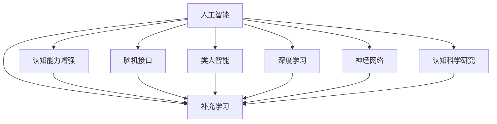

                 

# AI对人类认知能力的补充和增强

> 关键词：人工智能(AI),认知能力增强,补充学习,脑机接口(BMI),类人智能,深度学习,神经网络,认知科学研究

## 1. 背景介绍

### 1.1 问题由来

近年来，人工智能(AI)技术取得了飞速发展，逐步深入到人类生活的方方面面。人工智能不仅在自动化、计算效率等方面表现出卓越的性能，更开始向更深层次的认知能力迈进。这种趋势引发了关于AI是否能够补充或增强人类认知能力的广泛讨论。

人类认知能力，包括记忆、推理、决策、感知等，一直是心理学的核心研究领域。但随着AI技术的进步，特别是深度学习、神经网络的突破，AI在认知能力模拟方面展现出巨大潜力。脑机接口(BMI)等技术更是将AI与人类大脑直接连接，带来了新的研究热点。

### 1.2 问题核心关键点

AI对人类认知能力的补充和增强，核心在于如何通过人工智能技术和认知科学研究的融合，实现对人类认知过程的模拟、增强或辅助。这涉及到以下几个关键点：

- AI技术如何模拟人类的认知过程？
- 脑机接口技术如何将AI与人类大脑直接连接？
- AI技术在辅助人类认知过程中的优势和局限？
- AI技术在未来可能带来的认知能力突破？

## 2. 核心概念与联系

### 2.1 核心概念概述

为更好地理解AI对人类认知能力的补充和增强，本节将介绍几个关键概念：

- 人工智能(AI)：基于计算机科学和数学模型，模拟人类智能能力的系统。AI包括符号主义、连接主义和进化算法等多种方法。

- 认知能力增强：利用AI技术提高人类感知、记忆、推理等认知能力的方法。主要通过增强学习、辅助工具、脑机接口等技术实现。

- 补充学习(Enhanced Learning)：指AI技术辅助人类学习新知识，加速学习进程，提升学习效率。

- 脑机接口(BMI)：一种将AI与人类大脑直接连接的技术，通过解码人类大脑信号实现与计算机的交互。

- 类人智能(Human-AI Collaboration)：指AI与人类协作，共同完成复杂任务的技术，如驾驶、医疗诊断等。

- 深度学习(Deep Learning)：一种利用多层神经网络进行复杂模式识别和预测的AI方法。

- 神经网络(Neural Network)：模拟人类神经系统结构的计算模型，包括感知器、多层感知器、卷积神经网络、循环神经网络等。

- 认知科学研究：研究人类认知过程，包括感知、记忆、语言、决策等，为AI技术的开发提供理论基础。

这些概念之间的逻辑关系可以通过以下Mermaid流程图来展示：



这个流程图展示了大语言模型的核心概念及其之间的关系：

1. 人工智能通过深度学习、神经网络等方法模拟人类智能能力。
2. 认知能力增强利用AI技术提高人类认知能力，如增强学习、脑机接口等。
3. 补充学习通过AI辅助人类学习新知识，提高学习效率。
4. 脑机接口将AI与人类大脑直接连接，实现深度交互。
5. 类人智能指AI与人类协作完成复杂任务，提高效率和效果。
6. 深度学习是AI实现复杂认知模拟的重要手段。
7. 神经网络模拟人类神经系统结构，用于认知模拟和预测。
8. 认知科学研究为AI技术开发提供理论支撑。

这些概念共同构成了AI技术在认知领域的应用框架，使得AI不仅能提升技术能力，还能更好地服务于人类认知能力的提升。

## 3. 核心算法原理 & 具体操作步骤

### 3.1 算法原理概述

AI对人类认知能力的补充和增强，主要通过以下几个步骤实现：

1. **认知模拟**：利用深度学习等AI技术，模拟人类感知、记忆、推理等认知过程。例如，通过卷积神经网络(CNN)模拟视觉感知，通过循环神经网络(RNN)模拟语言理解。

2. **脑机接口(BMI)**：通过EEG、fMRI等技术获取人类大脑活动信号，并利用AI算法将其解码为计算机可理解的信息。例如，使用时间序列模型或深度学习模型对脑电信号进行分类或预测。

3. **认知辅助**：将AI技术与人类认知过程相结合，提供辅助工具，增强人类认知能力。例如，使用AI生成知识图谱，帮助人类进行复杂问题的推理；使用增强学习算法优化决策过程。

4. **类人智能**：将AI与人类协作，共同完成复杂任务。例如，驾驶中的自动驾驶辅助系统、医疗中的智能诊断系统等。

### 3.2 算法步骤详解

下面详细介绍AI对人类认知能力补充和增强的具体操作步骤：

**Step 1: 认知模拟**

1. 数据准备：收集和标注大量人类认知数据，如视频、音频、脑电信号等。
2. 模型选择：根据任务类型，选择合适的神经网络模型。例如，使用CNN处理图像数据，RNN处理序列数据。
3. 模型训练：使用标注数据对模型进行训练，调整超参数，优化模型性能。
4. 模型评估：在验证集和测试集上评估模型性能，选择最优模型进行下一步操作。

**Step 2: 脑机接口(BMI)**

1. 数据采集：使用EEG、fMRI等技术获取人类大脑活动信号。
2. 信号预处理：对信号进行滤波、归一化等预处理，减少噪声干扰。
3. 特征提取：提取信号中的重要特征，如时间序列、频率谱等。
4. 模型训练：使用标注数据对特征提取模型进行训练，学习特征与认知任务的关联。
5. 解码输出：将提取的特征输入解码模型，得到计算机可理解的信息。

**Step 3: 认知辅助**

1. 工具设计：根据认知任务需求，设计辅助工具。例如，设计智能问答系统、知识图谱等。
2. 模型集成：将认知模拟和BMI的模型结果集成到辅助工具中。
3. 用户交互：通过UI界面或语音交互等方式，让用户与辅助工具进行交互。
4. 结果反馈：根据用户反馈，不断调整和优化辅助工具。

**Step 4: 类人智能**

1. 任务定义：明确任务需求，设计任务规则和目标。
2. 模型选择：根据任务需求，选择适合的AI模型。例如，使用强化学习模型进行决策，使用RNN模型进行自然语言处理。
3. 模型训练：使用标注数据对模型进行训练，优化模型参数。
4. 协同操作：将AI模型与人类协作，共同完成复杂任务。
5. 评估与改进：在实际应用中评估AI系统表现，根据反馈不断改进。

### 3.3 算法优缺点

AI对人类认知能力的补充和增强，具有以下优点：

- **提高效率**：AI可以快速处理大量数据，提升人类认知过程的效率。
- **降低风险**：AI可以模拟复杂环境，降低人类面临的风险。
- **扩大认知边界**：AI可以探索人类难以直接观察的认知过程。
- **辅助决策**：AI可以提供基于数据的决策建议，辅助人类进行决策。

同时，也存在一些局限：

- **依赖数据**：AI模型需要大量标注数据进行训练，数据的获取和标注成本较高。
- **可解释性**：AI模型往往是"黑盒"，难以解释其决策过程。
- **安全性**：AI系统可能出现故障或恶意行为，影响人类安全。
- **技术瓶颈**：AI模型需要高度专业的知识和技能，开发和维护成本高。

## 4. 数学模型和公式 & 详细讲解

### 4.1 数学模型构建

在AI对人类认知能力的补充和增强过程中，常用的数学模型包括深度学习模型、时间序列模型等。以深度学习模型为例，我们以图像分类任务为例，构建一个简单的卷积神经网络(CNN)模型。

卷积神经网络主要由卷积层、池化层、全连接层组成。假设输入图像大小为 $28\times28$，输出为10类，模型结构如下：

$$
\begin{aligned}
  &\text{输入层}(28\times28) \\
  &\text{卷积层}_1(3\times3, 6) \\
  &\text{ReLU层}_1 \\
  &\text{池化层}_1(2\times2) \\
  &\text{卷积层}_2(3\times3, 16) \\
  &\text{ReLU层}_2 \\
  &\text{池化层}_2(2\times2) \\
  &\text{全连接层}_1(400) \\
  &\text{ReLU层}_3 \\
  &\text{全连接层}_2(10) \\
  &\text{softmax层}
\end{aligned}
$$

其中，输入层接收 $28\times28$ 的二维图像，卷积层使用 $3\times3$ 的卷积核，池化层使用 $2\times2$ 的池化窗口，全连接层使用 ReLU 激活函数和 softmax 输出层。

### 4.2 公式推导过程

以卷积神经网络中常用的前向传播为例，推导模型输出的公式。

假设输入图像大小为 $28\times28$，卷积核大小为 $3\times3$，步幅为 $1$，填充为 $1$，第一个卷积层的输出大小为 $14\times14\times6$。

卷积层的输出计算公式为：

$$
\begin{aligned}
  &\text{输出} = \text{输入} * \text{卷积核} + \text{偏置} \\
  &\text{输出} = \text{输入} * \text{卷积核} + \text{偏置}
\end{aligned}
$$

其中，$*$ 表示卷积操作，$\text{卷积核}$ 的维度为 $3\times3\times6\times6$，$\text{偏置}$ 的维度为 $6\times6$。

池化层的输出计算公式为：

$$
\begin{aligned}
  &\text{输出} = \text{输入} * \text{池化核} \\
  &\text{输出} = \text{输入} * \text{池化核}
\end{aligned}
$$

其中，$\text{池化核}$ 的维度为 $2\times2$。

全连接层的输出计算公式为：

$$
\begin{aligned}
  &\text{输出} = \text{输入} * \text{权重矩阵} + \text{偏置向量} \\
  &\text{输出} = \text{输入} * \text{权重矩阵} + \text{偏置向量}
\end{aligned}
$$

其中，$\text{权重矩阵}$ 的维度为 $400\times6\times6$，$\text{偏置向量}$ 的维度为 $400$。

最后，输出层通过 softmax 函数计算各个类别的概率：

$$
\begin{aligned}
  &\text{输出} = \text{softmax}(\text{全连接层输出}) \\
  &\text{输出} = \frac{\text{全连接层输出}}{\sum_i \text{全连接层输出}_i}
\end{aligned}
$$

### 4.3 案例分析与讲解

以图像分类任务为例，假设训练集为 $M$ 张图像，每张图像大小为 $28\times28$，标签为 $[0,9]$。使用上述卷积神经网络模型进行训练，目标是最小化交叉熵损失函数：

$$
\begin{aligned}
  &\text{交叉熵损失} = -\frac{1}{M}\sum_{i=1}^M \sum_{j=1}^{10} y_j \log p_j \\
  &\text{损失} = -\frac{1}{M}\sum_{i=1}^M \sum_{j=1}^{10} y_j \log p_j
\end{aligned}
$$

其中，$y_j$ 为第 $j$ 个标签的概率分布，$p_j$ 为模型输出的概率分布。

在训练过程中，使用梯度下降算法更新模型参数：

$$
\begin{aligned}
  &\text{参数更新} = \theta - \eta \nabla_{\theta}\text{损失} \\
  &\theta = \theta - \eta \frac{1}{M}\sum_{i=1}^M \nabla_{\theta} \text{损失}
\end{aligned}
$$

其中，$\theta$ 为模型参数，$\eta$ 为学习率。

在测试阶段，使用测试集对模型进行评估，计算准确率、召回率等指标：

$$
\begin{aligned}
  &\text{准确率} = \frac{\text{正确分类的样本数}}{M} \\
  &\text{召回率} = \frac{\text{正确分类的正样本数}}{\text{所有正样本数}}
\end{aligned}
$$

## 5. 项目实践：代码实例和详细解释说明

### 5.1 开发环境搭建

在进行认知能力增强的实践前，我们需要准备好开发环境。以下是使用Python进行TensorFlow开发的开发环境配置流程：

1. 安装Anaconda：从官网下载并安装Anaconda，用于创建独立的Python环境。

2. 创建并激活虚拟环境：
```bash
conda create -n tf-env python=3.8 
conda activate tf-env
```

3. 安装TensorFlow：根据CUDA版本，从官网获取对应的安装命令。例如：
```bash
conda install tensorflow=2.7 -c pytorch -c conda-forge
```

4. 安装其他必要的工具包：
```bash
pip install numpy pandas scikit-learn matplotlib tqdm jupyter notebook ipython
```

完成上述步骤后，即可在`tf-env`环境中开始认知能力增强的实践。

### 5.2 源代码详细实现

下面我们以图像分类任务为例，给出使用TensorFlow实现卷积神经网络(CNN)的代码实现。

首先，定义CNN模型的结构和超参数：

```python
import tensorflow as tf
from tensorflow.keras import layers

# 定义卷积神经网络模型
model = tf.keras.Sequential([
  layers.Conv2D(6, (3,3), activation='relu', input_shape=(28,28,1)),
  layers.MaxPooling2D((2,2)),
  layers.Conv2D(16, (3,3), activation='relu'),
  layers.MaxPooling2D((2,2)),
  layers.Flatten(),
  layers.Dense(400, activation='relu'),
  layers.Dense(10, activation='softmax')
])
```

接着，定义训练集和测试集，并进行数据预处理：

```python
# 准备数据集
mnist = tf.keras.datasets.mnist
(train_images, train_labels), (test_images, test_labels) = mnist.load_data()

# 数据预处理
train_images = train_images.reshape((60000, 28, 28, 1))
train_images = train_images / 255.0
test_images = test_images.reshape((10000, 28, 28, 1))
test_images = test_images / 255.0

# 将标签转化为one-hot编码
train_labels = tf.keras.utils.to_categorical(train_labels, 10)
test_labels = tf.keras.utils.to_categorical(test_labels, 10)
```

然后，定义损失函数和优化器，并进行训练：

```python
# 定义损失函数和优化器
loss_fn = tf.keras.losses.CategoricalCrossentropy()
optimizer = tf.keras.optimizers.Adam()

# 定义评估指标
metrics = [tf.keras.metrics.CategoricalAccuracy('accuracy')]

# 训练模型
model.compile(optimizer=optimizer, loss=loss_fn, metrics=metrics)
model.fit(train_images, train_labels, epochs=5, validation_data=(test_images, test_labels))
```

最后，评估模型性能并在测试集上进行预测：

```python
# 评估模型
model.evaluate(test_images, test_labels, verbose=2)

# 预测测试集
predictions = model.predict(test_images)
```

以上就是使用TensorFlow对CNN模型进行图像分类任务认知能力增强的完整代码实现。可以看到，得益于TensorFlow的强大封装，我们可以用相对简洁的代码完成模型的构建、训练和评估。

### 5.3 代码解读与分析

让我们再详细解读一下关键代码的实现细节：

**定义CNN模型**：
- `Sequential`类：创建序列模型，自动管理层顺序。
- `Conv2D`层：卷积层，用于提取图像特征。
- `MaxPooling2D`层：池化层，用于降维和提取关键特征。
- `Flatten`层：展平层，将多维数据转化为一维向量。
- `Dense`层：全连接层，用于分类。

**数据预处理**：
- `load_data`方法：从数据集中加载数据。
- `reshape`方法：调整数据维度，适应模型的输入格式。
- `to_categorical`方法：将标签转化为one-hot编码，方便模型处理。

**训练模型**：
- `compile`方法：配置模型训练参数。
- `fit`方法：进行模型训练，并返回训练过程中的评估指标。
- `evaluate`方法：在测试集上评估模型性能。
- `predict`方法：进行模型预测，得到分类结果。

**评估模型**：
- `CategoricalCrossentropy`损失函数：适用于多分类问题，计算交叉熵损失。
- `Adam`优化器：自适应学习率的优化算法，用于更新模型参数。
- `CategoricalAccuracy`评估指标：计算分类准确率。

通过这些关键代码的解读，我们可以清晰地理解TensorFlow在认知能力增强中的具体实现方法。

当然，认知能力增强的实践涉及更多的复杂性和挑战，如模型选择、超参数调优、数据增强等。开发者需要不断迭代和优化，才能得到满意的认知能力增强效果。

## 6. 实际应用场景

### 6.1 医疗影像分析

AI在医疗影像分析中展示了强大的应用前景。通过AI模型对CT、MRI等影像数据进行自动分析，能够快速识别病变区域，辅助医生进行诊断。例如，使用卷积神经网络对X光片进行自动分类，识别肺结节、乳腺癌等疾病。

在技术实现上，可以收集大量的医疗影像数据，标注出病变区域，在此基础上对模型进行微调，使其能够自动提取影像特征并进行分类。微调后的模型在实际应用中，可以快速处理大量的医疗影像数据，提高诊断效率和准确性。

### 6.2 金融风险评估

AI在金融风险评估中也具有重要应用。通过AI模型对金融数据进行分析和预测，能够识别潜在的金融风险，提供有效的风险预警和控制建议。例如，使用深度学习模型对金融市场数据进行分析，预测股票价格波动，辅助投资者进行决策。

在技术实现上，可以收集金融市场的历史数据，标注出正负样本，在此基础上对模型进行微调，使其能够识别金融风险信号。微调后的模型在实际应用中，能够实时监控金融市场变化，及时发出风险预警，帮助投资者规避风险。

### 6.3 智能制造

AI在智能制造中也有广泛应用。通过AI模型对生产数据进行分析和预测，能够优化生产过程，提高生产效率和产品质量。例如，使用深度学习模型对生产数据进行分类，识别生产过程中的异常情况，辅助进行故障诊断和维护。

在技术实现上，可以收集生产过程中的各类数据，标注出正常和异常数据，在此基础上对模型进行微调，使其能够识别生产中的异常情况。微调后的模型在实际应用中，能够实时监控生产过程，及时发现异常情况，提供有效的维护建议，提高生产效率和产品质量。

### 6.4 未来应用展望

随着AI技术的不断发展，认知能力增强在未来的应用场景将更加广阔。以下是几个可能的方向：

1. **虚拟助手**：基于AI的虚拟助手能够通过自然语言交互，提供智能服务，如客户咨询、虚拟助教等。

2. **教育辅助**：AI能够辅助学生进行学习，提供个性化的学习路径和资源推荐，提升学习效果。

3. **自动驾驶**：AI能够辅助人类进行自动驾驶，提高驾驶安全和效率。

4. **智能家居**：AI能够辅助家居系统进行智能管理，提高家居智能化水平。

5. **远程医疗**：AI能够辅助进行远程医疗，提高医疗资源的可及性和可获取性。

6. **智能监控**：AI能够辅助进行智能监控，提高安全性和效率。

## 7. 工具和资源推荐

### 7.1 学习资源推荐

为了帮助开发者系统掌握认知能力增强的理论基础和实践技巧，这里推荐一些优质的学习资源：

1. **《深度学习》书籍**：Ian Goodfellow、Yoshua Bengio和Aaron Courville合著的经典教材，详细介绍了深度学习的基本原理和应用。

2. **CS231n《卷积神经网络》课程**：斯坦福大学开设的计算机视觉课程，系统讲解卷积神经网络及其应用。

3. **《自然语言处理综述》论文**：Thomas Mikolov、Kyunghyun Cho和Columbia University等机构发表的综述性论文，涵盖了自然语言处理的基本概念和技术。

4. **OpenAI博客**：OpenAI的研究团队在博客上分享了大量的深度学习研究进展和应用案例，非常值得学习参考。

5. **Kaggle竞赛**：Kaggle是一个著名的数据科学竞赛平台，提供了大量的真实数据集和挑战题目，是实践认知能力增强的重要平台。

通过对这些资源的学习实践，相信你一定能够快速掌握认知能力增强的精髓，并用于解决实际的认知问题。

### 7.2 开发工具推荐

高效的开发离不开优秀的工具支持。以下是几款用于认知能力增强开发的常用工具：

1. **TensorFlow**：由Google主导开发的深度学习框架，灵活的计算图和高效的训练算法，适合大规模模型开发。

2. **PyTorch**：由Facebook主导开发的深度学习框架，动态计算图和易用的API，适合研究和原型开发。

3. **Keras**：高层深度学习框架，易于上手，适合快速迭代原型开发。

4. **TensorBoard**：TensorFlow配套的可视化工具，可实时监测模型训练状态，提供丰富的图表呈现方式。

5. **Jupyter Notebook**：交互式开发环境，支持多语言代码编写和实时运行，方便实验开发。

合理利用这些工具，可以显著提升认知能力增强的开发效率，加快创新迭代的步伐。

### 7.3 相关论文推荐

认知能力增强的研究源于学界的持续研究。以下是几篇奠基性的相关论文，推荐阅读：

1. **《深度学习》书籍**：Ian Goodfellow、Yoshua Bengio和Aaron Courville合著的经典教材，详细介绍了深度学习的基本原理和应用。

2. **《自然语言处理综述》论文**：Thomas Mikolov、Kyunghyun Cho和Columbia University等机构发表的综述性论文，涵盖了自然语言处理的基本概念和技术。

3. **《深度学习与认知科学》论文**：Andrew Ng、Vladimir Weston、Francisco A. Ayala-Rincón等机构发表的跨学科研究论文，探讨深度学习在认知科学中的应用。

这些论文代表了大语言模型微调技术的发展脉络。通过学习这些前沿成果，可以帮助研究者把握学科前进方向，激发更多的创新灵感。

## 8. 总结：未来发展趋势与挑战

### 8.1 总结

本文对AI对人类认知能力的补充和增强进行了全面系统的介绍。首先阐述了认知能力增强的研究背景和意义，明确了AI技术在提高人类认知过程中的潜在价值。其次，从原理到实践，详细讲解了认知能力增强的数学模型和操作步骤，给出了认知能力增强的代码实例和详细解释。同时，本文还广泛探讨了认知能力增强在医疗影像分析、金融风险评估、智能制造等多个行业领域的应用前景，展示了认知能力增强的广阔前景。

通过本文的系统梳理，可以看到，认知能力增强技术在提升人类认知能力方面的巨大潜力。AI技术不仅能够模拟人类认知过程，还能在实际应用中辅助人类进行复杂任务，提升效率和效果。未来，伴随AI技术的不断进步，认知能力增强必将在更广阔的领域大放异彩，深刻影响人类的认知智能的进步。

### 8.2 未来发展趋势

展望未来，认知能力增强技术将呈现以下几个发展趋势：

1. **模型规模持续增大**：随着算力成本的下降和数据规模的扩张，AI模型的参数量还将持续增长。超大批次的训练和推理也将成为可能。

2. **技术融合更加深入**：AI与认知科学的融合将更加深入，产生更多的跨学科研究成果。例如，通过脑机接口，AI能够更好地模拟人类认知过程。

3. **应用场景更加广泛**：AI将在更多领域得到应用，如自动驾驶、智能家居、医疗等，提升人类生活质量。

4. **伦理道德更加重视**：在AI技术不断深入人类生活的过程中，伦理道德问题也将成为关注的焦点。例如，数据隐私、算法透明性、公平性等将成为重要的研究课题。

5. **人机协作更加智能**：AI将更好地辅助人类进行复杂任务，提升任务完成的效率和效果。例如，在医疗诊断中，AI能够提供专业的辅助诊断，提高医生的诊断效率和准确性。

6. **认知辅助更加个性化**：AI将根据用户需求提供个性化的认知辅助，提升用户体验。例如，在智能客服中，AI能够根据用户的历史行为数据，提供个性化的服务。

### 8.3 面临的挑战

尽管认知能力增强技术已经取得了显著成就，但在迈向更加智能化、普适化应用的过程中，它仍面临诸多挑战：

1. **数据获取和标注成本高**：高质量标注数据的获取和标注成本较高，尤其是对于小样本任务。如何降低数据获取和标注成本，将是重要的研究方向。

2. **模型可解释性不足**：AI模型往往是"黑盒"，难以解释其决策过程。如何提高模型的可解释性，将是重要的研究课题。

3. **技术复杂性高**：AI模型的开发和维护需要高度专业的知识和技能，开发和维护成本高。如何降低技术复杂性，提高开发效率，将是重要的研究方向。

4. **伦理道德问题**：AI技术在应用过程中可能带来伦理道德问题，如数据隐私、算法透明性等。如何规范AI技术的应用，保护用户权益，将是重要的研究课题。

5. **技术安全问题**：AI系统可能出现故障或恶意行为，影响人类安全。如何保障AI系统的安全性和稳定性，将是重要的研究方向。

6. **应用场景的多样性**：AI技术在不同应用场景中面临不同的挑战，如医疗、金融、制造等。如何在不同应用场景中高效应用AI技术，将是重要的研究方向。

### 8.4 研究展望

面对认知能力增强所面临的种种挑战，未来的研究需要在以下几个方面寻求新的突破：

1. **无监督学习和半监督学习**：摆脱对大量标注数据的依赖，利用自监督学习、主动学习等无监督和半监督范式，最大限度利用非结构化数据，实现更加灵活高效的认知能力增强。

2. **参数高效和计算高效的方法**：开发更加参数高效的认知能力增强方法，在固定大部分预训练参数的同时，只更新极少量的任务相关参数。同时优化认知能力增强模型的计算图，减少前向传播和反向传播的资源消耗，实现更加轻量级、实时性的部署。

3. **融合因果和对比学习**：通过引入因果推断和对比学习思想，增强认知能力增强模型建立稳定因果关系的能力，学习更加普适、鲁棒的语言表征，从而提升模型泛化性和抗干扰能力。

4. **引入更多先验知识**：将符号化的先验知识，如知识图谱、逻辑规则等，与神经网络模型进行巧妙融合，引导认知能力增强过程学习更准确、合理的语言模型。同时加强不同模态数据的整合，实现视觉、语音等多模态信息与文本信息的协同建模。

5. **结合因果分析和博弈论工具**：将因果分析方法引入认知能力增强模型，识别出模型决策的关键特征，增强输出解释的因果性和逻辑性。借助博弈论工具刻画人机交互过程，主动探索并规避模型的脆弱点，提高系统稳定性。

6. **纳入伦理道德约束**：在模型训练目标中引入伦理导向的评估指标，过滤和惩罚有偏见、有害的输出倾向。同时加强人工干预和审核，建立模型行为的监管机制，确保输出符合人类价值观和伦理道德。

这些研究方向的探索，必将引领认知能力增强技术迈向更高的台阶，为构建安全、可靠、可解释、可控的智能系统铺平道路。面向未来，认知能力增强技术还需要与其他人工智能技术进行更深入的融合，如知识表示、因果推理、强化学习等，多路径协同发力，共同推动自然语言理解和智能交互系统的进步。只有勇于创新、敢于突破，才能不断拓展AI技术的应用边界，让人工智能更好地造福人类社会。

## 9. 附录：常见问题与解答

**Q1：认知能力增强技术是否适用于所有NLP任务？**

A: 认知能力增强技术在大多数NLP任务上都能取得不错的效果，特别是对于数据量较小的任务。但对于一些特定领域的任务，如医学、法律等，仅仅依靠通用语料预训练的模型可能难以很好地适应。此时需要在特定领域语料上进一步预训练，再进行微调，才能获得理想效果。此外，对于一些需要时效性、个性化很强的任务，如对话、推荐等，认知能力增强方法也需要针对性的改进优化。

**Q2：如何选择合适的学习率？**

A: 认知能力增强的学习率一般要比预训练时小1-2个数量级，如果使用过大的学习率，容易破坏预训练权重，导致过拟合。一般建议从1e-5开始调参，逐步减小学习率，直至收敛。也可以使用warmup策略，在开始阶段使用较小的学习率，再逐渐过渡到预设值。需要注意的是，不同的优化器(如AdamW、Adafactor等)以及不同的学习率调度策略，可能需要设置不同的学习率阈值。

**Q3：在认知能力增强过程中如何缓解过拟合问题？**

A: 过拟合是认知能力增强面临的主要挑战，尤其是在标注数据不足的情况下。常见的缓解策略包括：

1. 数据增强：通过回译、近义替换等方式扩充训练集。
2. 正则化：使用L2正则、Dropout、Early Stopping等避免过拟合。
3. 对抗训练：引入对抗样本，提高模型鲁棒性。
4. 参数高效微调：只调整少量参数(如Adapter、Prefix等)，减小过拟合风险。
5. 多模型集成：训练多个认知能力增强模型，取平均输出，抑制过拟合。

这些策略往往需要根据具体任务和数据特点进行灵活组合。只有在数据、模型、训练、推理等各环节进行全面优化，才能最大限度地发挥认知能力增强的威力。

**Q4：在认知能力增强应用中需要注意哪些问题？**

A: 将认知能力增强模型转化为实际应用，还需要考虑以下因素：

1. 模型裁剪：去除不必要的层和参数，减小模型尺寸，加快推理速度。
2. 量化加速：将浮点模型转为定点模型，压缩存储空间，提高计算效率。
3. 服务化封装：将模型封装为标准化服务接口，便于集成调用。
4. 弹性伸缩：根据请求流量动态调整资源配置，平衡服务质量和成本。
5. 监控告警：实时采集系统指标，设置异常告警阈值，确保服务稳定性。
6. 安全防护：采用访问鉴权、数据脱敏等措施，保障数据和模型安全。

认知能力增强技术为NLP应用开启了广阔的想象空间，但如何将强大的性能转化为稳定、高效、安全的业务价值，还需要工程实践的不断打磨。唯有从数据、算法、工程、业务等多个维度协同发力，才能真正实现人工智能技术在垂直行业的规模化落地。总之，认知能力增强需要开发者根据具体任务，不断迭代和优化模型、数据和算法，方能得到理想的增强效果。

---

作者：禅与计算机程序设计艺术 / Zen and the Art of Computer Programming

