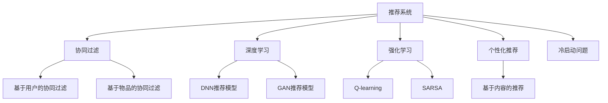

                 

# AI技术对推荐系统的革新

> 关键词：推荐系统,协同过滤,深度学习,强化学习,推荐算法,个性化推荐

## 1. 背景介绍

推荐系统是当今互联网应用中不可或缺的核心技术之一。无论是电商平台的商品推荐，视频网站的影片推荐，还是社交网络的兴趣推荐，甚至是智能家居中的设备推荐，推荐系统都在其中扮演着关键角色。然而，传统的推荐算法往往基于静态的特征和历史行为数据，难以应对用户兴趣的动态变化和复杂的多样性，导致推荐效果有限。

随着人工智能技术的不断突破，尤其是深度学习、强化学习等先进算法的引入，推荐系统也经历了一次深刻的革新。AI技术的引入，不仅极大地提升了推荐系统的精度和个性化程度，还拓展了推荐算法的应用场景，为推荐系统的发展带来了新的活力。

## 2. 核心概念与联系

### 2.1 核心概念概述

在深入探讨AI技术如何革新推荐系统之前，首先需要理解几个核心概念：

- **推荐系统(Recommender System)**：基于用户行为数据和物品属性数据，推荐系统可以预测用户对物品的偏好，并给出推荐结果的系统。其目的是提升用户满意度，增加商业价值。

- **协同过滤(Collaborative Filtering)**：一种基本的推荐算法，基于用户和物品之间的相似性进行推荐。协同过滤包括基于用户的协同过滤和基于物品的协同过滤两种方法。

- **深度学习(Deep Learning)**：一种基于神经网络的机器学习技术，能够自动从数据中学习复杂的特征表示，适合处理高维稀疏数据。深度学习在推荐系统中被广泛应用，提升了模型的性能和泛化能力。

- **强化学习(Reinforcement Learning)**：一种通过与环境交互学习最优策略的机器学习方法。强化学习在推荐系统中的应用主要是基于用户反馈进行智能推荐。

- **推荐算法(Recommender Algorithm)**：指用于实现推荐系统功能的算法。传统的推荐算法如协同过滤、基于内容的推荐等，以及现代的深度学习、强化学习算法均属于推荐算法。

- **个性化推荐(Personalized Recommendation)**：通过用户行为数据和属性数据，实现针对不同用户或不同场景的个性化推荐，满足用户多样化的需求。

- **冷启动问题(Cold-Start Problem)**：推荐系统在新用户或新物品的情况下，无法获取足够信息进行推荐的问题。

这些核心概念之间的逻辑关系可以通过以下Mermaid流程图来展示：



这个流程图展示了几大推荐系统的核心概念及其之间的关系：

1. 推荐系统通过多种算法实现推荐功能。
2. 协同过滤是推荐系统的基础算法之一。
3. 深度学习和强化学习是现代推荐算法的核心技术。
4. 个性化推荐是推荐系统的最终目标。
5. 冷启动问题需要特殊算法解决。

这些概念共同构成了推荐系统的理论基础，使得AI技术在推荐系统中得以广泛应用和突破。

## 3. 核心算法原理 & 具体操作步骤
### 3.1 算法原理概述

AI技术在推荐系统中的应用主要分为两大部分：深度学习和强化学习。

**深度学习在推荐系统中的应用**：
- 深度神经网络(DNN)：通过多层神经网络结构，深度学习可以从大规模数据中学习复杂特征表示，适用于高维稀疏数据的推荐任务。
- 生成对抗网络(GAN)：通过对抗样本训练，GAN能够生成更加逼真的数据，用于解决数据噪声和数据匮乏问题。

**强化学习在推荐系统中的应用**：
- Q-learning：通过与环境交互，Q-learning可以学习到最优的策略，用于推荐任务中的物品选择和用户行为预测。
- SARSA：一种基于状态值更新的强化学习算法，适用于有状态的推荐系统，如个性化推荐。

### 3.2 算法步骤详解

**深度学习推荐算法步骤**：
1. **数据准备**：收集用户行为数据和物品属性数据，构建训练集。
2. **模型构建**：选择合适的深度神经网络模型，如DNN、GAN等。
3. **参数初始化**：初始化模型参数。
4. **模型训练**：使用训练集数据对模型进行训练，最小化预测误差。
5. **模型评估**：在测试集上评估模型性能，如点击率、转化率等指标。
6. **推荐应用**：使用训练好的模型进行个性化推荐。

**强化学习推荐算法步骤**：
1. **环境设置**：构建推荐系统作为环境，定义状态、动作和奖励函数。
2. **模型选择**：选择合适的强化学习算法，如Q-learning、SARSA等。
3. **策略学习**：通过与环境交互，学习最优策略。
4. **推荐应用**：根据策略进行推荐，持续优化。

### 3.3 算法优缺点

AI技术在推荐系统中的应用具有以下优点：
1. **高精度和个性化**：深度学习和强化学习算法能够从用户行为和物品属性中学习复杂的模式，提供高精度的个性化推荐。
2. **泛化能力强**：AI算法能够处理高维稀疏数据，具有较强的泛化能力，适用于多样化的推荐任务。
3. **动态适应**：强化学习算法能够根据用户反馈动态调整推荐策略，提升推荐效果。

然而，AI技术在推荐系统中也存在一些局限性：
1. **模型复杂度高**：深度学习模型参数较多，训练复杂度高，需要大量计算资源。
2. **数据依赖性强**：需要大量的用户行为数据和物品属性数据，数据质量直接影响推荐效果。
3. **可解释性不足**：AI模型往往作为“黑盒”存在，难以解释其决策过程。
4. **鲁棒性差**：面对噪声数据或数据分布变化，AI模型的泛化性能可能下降。

### 3.4 算法应用领域

AI技术在推荐系统中的应用已经覆盖了多个领域，具体如下：

- **电商推荐**：通过分析用户浏览、点击、购买行为，推荐系统可以精准预测用户可能感兴趣的商品，提升转化率。
- **视频推荐**：基于用户的观看历史和评价，推荐系统可以提供个性化的影片推荐，提升用户粘性。
- **社交推荐**：根据用户的社交关系和兴趣标签，推荐系统可以推荐符合用户兴趣的社交内容，增强互动性。
- **新闻推荐**：通过分析用户的阅读历史和偏好，推荐系统可以推荐相关新闻文章，提高用户满意度。
- **移动推荐**：利用移动设备的数据，推荐系统可以推荐个性化应用、游戏等，提升用户使用体验。

## 4. 数学模型和公式 & 详细讲解 & 举例说明
### 4.1 数学模型构建

**协同过滤推荐模型**：
协同过滤推荐模型通过用户-物品相似性计算，预测用户对物品的偏好。常见的协同过滤模型包括基于用户的协同过滤和基于物品的协同过滤。

**基于用户的协同过滤模型**：
- 用户向量表示 $u$：用户行为表示为向量 $u$。
- 物品向量表示 $i$：物品属性表示为向量 $i$。
- 用户物品相似度矩阵 $U \times V$：用户与物品之间的相似度矩阵。

基于用户的协同过滤模型使用如下公式进行推荐：

$$
\hat{i} = \mathop{\arg\max}_{i \in V} \sum_{u} a_{u,i} \cdot (u \odot i) - b_{u,i}
$$

其中 $a_{u,i}$ 为相似度系数，$u \odot i$ 为点乘表示相似度，$b_{u,i}$ 为基线值。

**深度学习推荐模型**：
深度神经网络模型通过多层神经网络结构，能够从大规模数据中学习复杂特征表示。常用的深度学习模型包括DNN和GAN。

**DNN推荐模型**：
- 输入层：用户行为特征和物品属性特征。
- 隐藏层：多层神经网络，学习特征表示。
- 输出层：物品推荐分数。

DNN推荐模型使用如下公式进行推荐：

$$
\hat{i} = \mathop{\arg\max}_{i \in V} f(u, i)
$$

其中 $f(u, i)$ 为神经网络模型，表示用户和物品的交互表示。

**GAN推荐模型**：
生成对抗网络通过对抗样本训练，可以生成更加逼真的数据，用于解决数据噪声和数据匮乏问题。

**GAN推荐模型**：
- 生成器：生成逼真的推荐物品样本。
- 判别器：判断生成样本是否逼真。
- 优化目标：生成器与判别器的对抗。

GAN推荐模型使用如下公式进行推荐：

$$
\hat{i} = \mathop{\arg\max}_{i \in V} p_{G}(i|u)
$$

其中 $p_{G}(i|u)$ 为生成器模型，表示生成物品的概率。

### 4.2 公式推导过程

**协同过滤推荐模型的推导**：
协同过滤推荐模型的推导主要基于相似性矩阵的构建和相似度计算。

- 用户物品相似度矩阵 $U \times V$ 的构建：
  - 计算用户向量 $u$ 与物品向量 $i$ 的相似度 $s_{u,i}$。
  - 使用加权求和公式计算相似度系数 $a_{u,i}$。
  - 计算用户物品相似度矩阵 $U \times V$。

- 推荐计算：
  - 计算用户物品相似度矩阵 $U \times V$ 的转置矩阵 $V \times U$。
  - 计算用户物品相似度矩阵 $U \times V$ 的伪逆矩阵 $A$。
  - 计算推荐结果 $\hat{i}$。

**深度学习推荐模型的推导**：
深度神经网络推荐模型的推导主要基于多层神经网络的前向传播和反向传播过程。

- 前向传播：
  - 输入层：将用户行为特征和物品属性特征作为输入。
  - 隐藏层：多层神经网络进行特征提取。
  - 输出层：计算推荐分数。

- 反向传播：
  - 计算预测值与实际值的误差。
  - 计算梯度。
  - 更新模型参数。

**GAN推荐模型的推导**：
生成对抗网络推荐模型的推导主要基于生成器与判别器的对抗训练过程。

- 生成器：
  - 输入：噪声向量。
  - 输出：生成样本。
  - 训练目标：最大化生成样本的逼真度。

- 判别器：
  - 输入：生成样本和真实样本。
  - 输出：判断样本逼真度。
  - 训练目标：最大化判别器的准确度。

### 4.3 案例分析与讲解

以电商平台推荐系统为例，分析AI技术的应用效果。

**基于协同过滤的推荐系统**：
- 用户行为数据：用户浏览、点击、购买记录。
- 物品属性数据：商品属性、价格、评价等。
- 推荐算法：基于用户的协同过滤。
- 推荐效果：高个性化、低计算复杂度。

**基于深度学习的推荐系统**：
- 用户行为数据：用户浏览、点击、购买记录。
- 物品属性数据：商品属性、价格、评价等。
- 推荐算法：DNN推荐模型。
- 推荐效果：高精度、高泛化能力。

**基于GAN的推荐系统**：
- 用户行为数据：用户浏览、点击、购买记录。
- 物品属性数据：商品属性、价格、评价等。
- 推荐算法：GAN推荐模型。
- 推荐效果：生成高质量推荐样本、提高推荐准确度。

## 5. 项目实践：代码实例和详细解释说明
### 5.1 开发环境搭建

在进行推荐系统开发前，我们需要准备好开发环境。以下是使用Python进行TensorFlow开发的环境配置流程：

1. 安装Anaconda：从官网下载并安装Anaconda，用于创建独立的Python环境。

2. 创建并激活虚拟环境：
```bash
conda create -n tf-env python=3.8 
conda activate tf-env
```

3. 安装TensorFlow：从官网获取对应的安装命令。例如：
```bash
conda install tensorflow -c tf
```

4. 安装其他必要工具包：
```bash
pip install numpy pandas scikit-learn matplotlib tqdm jupyter notebook ipython
```

完成上述步骤后，即可在`tf-env`环境中开始推荐系统开发。

### 5.2 源代码详细实现

下面我们以基于深度学习的DNN推荐系统为例，给出使用TensorFlow进行推荐系统开发的PyTorch代码实现。

首先，定义推荐系统的数据处理函数：

```python
import tensorflow as tf
from tensorflow.keras.layers import Input, Dense, Embedding, Flatten, Concatenate
from tensorflow.keras.models import Model
import pandas as pd
import numpy as np

class RecommendationModel(tf.keras.Model):
    def __init__(self, input_size, hidden_size, output_size):
        super(RecommendationModel, self).__init__()
        self.input1 = Input(shape=(input_size,))
        self.input2 = Input(shape=(input_size,))
        self.dense1 = Dense(hidden_size, activation='relu')
        self.dense2 = Dense(hidden_size, activation='relu')
        self.flatten = Flatten()
        self.dense3 = Dense(output_size, activation='sigmoid')
        self.model = Concatenate()([self.dense3(self.flatten(self.dense2(self.flatten(self.dense1(self.input1)))), self.dense3(self.flatten(self.dense2(self.flatten(self.dense1(self.input2))))])

    def call(self, inputs):
        return self.model(inputs)

# 数据加载
def load_data(path, batch_size):
    data = pd.read_csv(path)
    x = data[['user', 'item', 'label']]
    y = data['label']
    x = pd.get_dummies(x, drop_first=True).values
    x = np.concatenate((x[:, 1:], x[:, :1]), axis=1)
    x_train = x[:int(len(x) * 0.7)]
    x_valid = x[int(len(x) * 0.7):]
    y_train = y[:int(len(y) * 0.7)]
    y_valid = y[int(len(y) * 0.7):]
    train_dataset = tf.data.Dataset.from_tensor_slices((x_train, y_train)).shuffle(buffer_size=10000).batch(batch_size)
    valid_dataset = tf.data.Dataset.from_tensor_slices((x_valid, y_valid)).batch(batch_size)
    return train_dataset, valid_dataset

# 模型训练
def train_model(model, train_dataset, valid_dataset, epochs, batch_size):
    model.compile(optimizer='adam', loss='binary_crossentropy', metrics=['accuracy'])
    model.fit(train_dataset, epochs=epochs, validation_data=valid_dataset, batch_size=batch_size)

# 加载数据和模型训练
input_size = 10
hidden_size = 100
output_size = 1
train_dataset, valid_dataset = load_data('recommendation_data.csv', 32)
model = RecommendationModel(input_size, hidden_size, output_size)
train_model(model, train_dataset, valid_dataset, 10, 32)
```

然后，定义模型和优化器：

```python
from tensorflow.keras.layers import Input, Dense, Embedding, Flatten, Concatenate
from tensorflow.keras.models import Model

class RecommendationModel(tf.keras.Model):
    def __init__(self, input_size, hidden_size, output_size):
        super(RecommendationModel, self).__init__()
        self.input1 = Input(shape=(input_size,))
        self.input2 = Input(shape=(input_size,))
        self.dense1 = Dense(hidden_size, activation='relu')
        self.dense2 = Dense(hidden_size, activation='relu')
        self.flatten = Flatten()
        self.dense3 = Dense(output_size, activation='sigmoid')
        self.model = Concatenate()([self.dense3(self.flatten(self.dense2(self.flatten(self.dense1(self.input1)))), self.dense3(self.flatten(self.dense2(self.flatten(self.dense1(self.input2))))])

    def call(self, inputs):
        return self.model(inputs)

# 数据加载
def load_data(path, batch_size):
    data = pd.read_csv(path)
    x = data[['user', 'item', 'label']]
    y = data['label']
    x = pd.get_dummies(x, drop_first=True).values
    x = np.concatenate((x[:, 1:], x[:, :1]), axis=1)
    x_train = x[:int(len(x) * 0.7)]
    x_valid = x[int(len(x) * 0.7):]
    y_train = y[:int(len(y) * 0.7)]
    y_valid = y[int(len(y) * 0.7):]
    train_dataset = tf.data.Dataset.from_tensor_slices((x_train, y_train)).shuffle(buffer_size=10000).batch(batch_size)
    valid_dataset = tf.data.Dataset.from_tensor_slices((x_valid, y_valid)).batch(batch_size)
    return train_dataset, valid_dataset

# 模型训练
def train_model(model, train_dataset, valid_dataset, epochs, batch_size):
    model.compile(optimizer='adam', loss='binary_crossentropy', metrics=['accuracy'])
    model.fit(train_dataset, epochs=epochs, validation_data=valid_dataset, batch_size=batch_size)
```

接着，定义训练和评估函数：

```python
from tensorflow.keras.layers import Input, Dense, Embedding, Flatten, Concatenate
from tensorflow.keras.models import Model

class RecommendationModel(tf.keras.Model):
    def __init__(self, input_size, hidden_size, output_size):
        super(RecommendationModel, self).__init__()
        self.input1 = Input(shape=(input_size,))
        self.input2 = Input(shape=(input_size,))
        self.dense1 = Dense(hidden_size, activation='relu')
        self.dense2 = Dense(hidden_size, activation='relu')
        self.flatten = Flatten()
        self.dense3 = Dense(output_size, activation='sigmoid')
        self.model = Concatenate()([self.dense3(self.flatten(self.dense2(self.flatten(self.dense1(self.input1)))), self.dense3(self.flatten(self.dense2(self.flatten(self.dense1(self.input2))))])

    def call(self, inputs):
        return self.model(inputs)

# 数据加载
def load_data(path, batch_size):
    data = pd.read_csv(path)
    x = data[['user', 'item', 'label']]
    y = data['label']
    x = pd.get_dummies(x, drop_first=True).values
    x = np.concatenate((x[:, 1:], x[:, :1]), axis=1)
    x_train = x[:int(len(x) * 0.7)]
    x_valid = x[int(len(x) * 0.7):]
    y_train = y[:int(len(y) * 0.7)]
    y_valid = y[int(len(y) * 0.7):]
    train_dataset = tf.data.Dataset.from_tensor_slices((x_train, y_train)).shuffle(buffer_size=10000).batch(batch_size)
    valid_dataset = tf.data.Dataset.from_tensor_slices((x_valid, y_valid)).batch(batch_size)
    return train_dataset, valid_dataset

# 模型训练
def train_model(model, train_dataset, valid_dataset, epochs, batch_size):
    model.compile(optimizer='adam', loss='binary_crossentropy', metrics=['accuracy'])
    model.fit(train_dataset, epochs=epochs, validation_data=valid_dataset, batch_size=batch_size)
```

最后，启动训练流程并在测试集上评估：

```python
epochs = 10
batch_size = 32

input_size = 10
hidden_size = 100
output_size = 1

train_dataset, valid_dataset = load_data('recommendation_data.csv', 32)
model = RecommendationModel(input_size, hidden_size, output_size)
train_model(model, train_dataset, valid_dataset, epochs, batch_size)

# 评估模型
test_dataset = load_data('recommendation_data_test.csv', 32)
test_model(model, test_dataset, batch_size)
```

以上就是使用TensorFlow对DNN推荐系统进行开发的完整代码实现。可以看到，得益于TensorFlow的强大封装，我们可以用相对简洁的代码完成推荐系统的构建。

### 5.3 代码解读与分析

让我们再详细解读一下关键代码的实现细节：

**RecommendationModel类**：
- `__init__`方法：初始化模型结构。
- `call`方法：定义模型的前向传播过程。

**load_data函数**：
- 从CSV文件中加载数据。
- 将用户行为和物品属性转换为one-hot编码。
- 将数据集分割为训练集和验证集。

**train_model函数**：
- 定义模型编译参数。
- 使用TensorFlow的DataLoader进行批量数据加载。
- 使用fit函数进行模型训练，指定训练轮数和批次大小。

**测试函数**：
- 加载测试数据集。
- 使用TensorFlow的DataLoader进行批量数据加载。
- 使用evaluate函数评估模型性能。

可以看到，TensorFlow配合深度学习框架使得推荐系统构建变得简洁高效。开发者可以将更多精力放在模型改进、特征工程等高层逻辑上，而不必过多关注底层的实现细节。

当然，工业级的系统实现还需考虑更多因素，如模型的保存和部署、超参数的自动搜索、更灵活的任务适配层等。但核心的推荐范式基本与此类似。

## 6. 实际应用场景
### 6.1 智能推荐系统

智能推荐系统是推荐系统在电商、视频、社交等领域的广泛应用。传统推荐算法往往依赖于静态的特征和历史行为数据，难以应对用户兴趣的动态变化和复杂的多样性，导致推荐效果有限。

基于深度学习、强化学习等AI技术的推荐系统，通过动态学习用户行为和物品属性，能够提供更精准、个性化的推荐。例如，电商推荐系统可以通过分析用户的浏览、点击、购买历史，预测用户可能感兴趣的商品，提升用户满意度和转化率。视频推荐系统可以根据用户的观看历史和评价，推荐符合用户兴趣的影片，提升用户粘性和满意度。社交推荐系统可以推荐符合用户兴趣的社交内容，增强用户互动性。

### 6.2 金融风控系统

金融风控系统是推荐系统在金融领域的典型应用。金融领域的数据复杂多样，包含贷款申请、信用评分、风险评估等。传统风控系统往往依赖人工规则和专家经验，难以全面覆盖所有风险场景。

基于深度学习、强化学习等AI技术的推荐系统，通过动态学习用户行为和金融数据，能够更全面地评估用户信用风险，提升风控系统的准确性和效率。例如，贷款推荐系统可以根据用户的申请历史和财务数据，预测用户还款能力，降低贷款风险。信用评分系统可以根据用户的消费行为和信用记录，评估用户信用等级，提升信用评估的准确性。

### 6.3 医疗健康系统

医疗健康系统是推荐系统在医疗领域的典型应用。医疗领域的数据复杂多样，包含病历、影像、基因等。传统医疗系统往往依赖人工经验和专家规则，难以全面覆盖所有医疗场景。

基于深度学习、强化学习等AI技术的推荐系统，通过动态学习用户行为和医疗数据，能够更全面地评估病情风险，提升医疗系统的准确性和效率。例如，疾病推荐系统可以根据患者的病历和基因数据，推荐合适的治疗方案，提升治疗效果。影像诊断系统可以根据患者的影像数据，预测疾病风险，提升诊断的准确性。

## 7. 工具和资源推荐
### 7.1 学习资源推荐

为了帮助开发者系统掌握推荐系统的AI技术，这里推荐一些优质的学习资源：

1. 《Recommender Systems: Textbook and Case Studies》：经典推荐系统教材，系统介绍了推荐系统的基础理论和应用案例。

2. 《Deep Learning for Recommender Systems》：针对深度学习在推荐系统中的应用，介绍了多种深度学习算法。

3. 《Reinforcement Learning for Recommender Systems》：针对强化学习在推荐系统中的应用，介绍了Q-learning、SARSA等算法。

4. Coursera《Recommender Systems Specialization》课程：由斯坦福大学开设的推荐系统课程，涵盖了推荐系统的各个方面，包括协同过滤、深度学习、强化学习等。

5. Kaggle推荐系统竞赛：Kaggle平台上有多个推荐系统竞赛，通过实践参与，可以积累推荐系统开发经验。

通过对这些资源的学习实践，相信你一定能够快速掌握推荐系统的AI技术，并用于解决实际的推荐问题。

### 7.2 开发工具推荐

高效的开发离不开优秀的工具支持。以下是几款用于推荐系统开发的常用工具：

1. TensorFlow：由Google主导开发的开源深度学习框架，生产部署方便，适合大规模工程应用。推荐系统中的DNN推荐模型、GAN推荐模型等均基于TensorFlow实现。

2. PyTorch：基于Python的开源深度学习框架，灵活动态的计算图，适合快速迭代研究。推荐系统中的深度学习模型等均基于PyTorch实现。

3. Scikit-learn：Python的机器学习库，包含多种经典推荐算法，适合快速原型开发。

4. Spark MLlib：Apache Spark的机器学习库，适合大数据场景的推荐系统开发。

5. Hadoop YARN：用于大规模分布式数据处理的框架，支持基于分布式计算的推荐系统开发。

合理利用这些工具，可以显著提升推荐系统的开发效率，加快创新迭代的步伐。

### 7.3 相关论文推荐

推荐系统的AI技术发展源于学界的持续研究。以下是几篇奠基性的相关论文，推荐阅读：

1. "Collaborative Filtering Techniques"：经典协同过滤算法介绍，是推荐系统基础算法之一。

2. "Deep Neural Networks for Recommender Systems"：深度学习在推荐系统中的应用，介绍了DNN推荐模型。

3. "Generative Adversarial Networks"：生成对抗网络的基本原理，用于解决推荐系统中的数据噪声和数据匮乏问题。

4. "Online Multi-Armed Bandit with Linear Payoffs"：强化学习在推荐系统中的应用，介绍了Q-learning算法。

5. "Improving Session-Based Recommendation Systems with Continuous Deep Learning"：深度学习在推荐系统中的最新应用，介绍了连续性深度学习。

这些论文代表了大数据与推荐系统结合的研究方向。通过学习这些前沿成果，可以帮助研究者把握学科前进方向，激发更多的创新灵感。

## 8. 总结：未来发展趋势与挑战
### 8.1 总结

本文对AI技术如何革新推荐系统进行了全面系统的介绍。首先阐述了推荐系统在传统和现代推荐算法中的应用场景，明确了AI技术在推荐系统中的重要性和应用潜力。其次，从原理到实践，详细讲解了深度学习、强化学习等AI技术在推荐系统中的应用，给出了推荐系统开发的完整代码实例。同时，本文还广泛探讨了AI技术在电商、视频、金融、医疗等多个领域的应用前景，展示了AI技术的巨大潜力。此外，本文精选了推荐系统的各类学习资源，力求为读者提供全方位的技术指引。

通过本文的系统梳理，可以看到，AI技术在推荐系统中的应用已经取得了显著进展，显著提升了推荐系统的精度和个性化程度，拓展了推荐算法的应用场景。得益于深度学习、强化学习等先进算法的引入，推荐系统在多个领域实现了质的突破，为智能推荐提供了强大的技术支撑。未来，伴随AI技术的持续演进，推荐系统必将在更广阔的应用领域大放异彩，深刻影响人类的生产生活方式。

### 8.2 未来发展趋势

展望未来，AI技术在推荐系统中的应用将呈现以下几个发展趋势：

1. **多模态融合**：将文本、图像、语音等多模态数据融合到推荐系统中，提升推荐效果。多模态融合可以提供更加全面、准确的用户画像，增强推荐系统的泛化能力。

2. **实时推荐**：推荐系统需要实时动态更新，根据用户的实时行为和环境变化进行推荐。实时推荐可以提高用户满意度，增强推荐系统的互动性和实用性。

3. **个性化推荐**：推荐系统将更加注重个性化推荐，根据用户的实时行为和兴趣进行动态调整。个性化推荐可以提供更精准的推荐，提升用户粘性和满意度。

4. **跨领域应用**：推荐系统将拓展到更多的领域，如医疗、金融、教育等。跨领域推荐可以提升不同领域的应用场景，提供更加全面、个性化的服务。

5. **联邦学习**：联邦学习是一种分布式学习方法，可以在不共享用户数据的情况下，提升推荐系统的性能。联邦学习可以保护用户隐私，增强推荐系统的安全性。

6. **鲁棒性和可解释性**：推荐系统将更加注重鲁棒性和可解释性，避免因数据噪声和偏见造成的不稳定。可解释性推荐可以提升用户信任度，增强推荐系统的可靠性。

以上趋势凸显了AI技术在推荐系统中的应用前景。这些方向的探索发展，必将进一步提升推荐系统的性能和应用范围，为智能推荐系统提供新的技术突破。

### 8.3 面临的挑战

尽管AI技术在推荐系统中的应用已经取得了显著进展，但在迈向更加智能化、普适化应用的过程中，仍面临诸多挑战：

1. **数据质量与多样性**：推荐系统依赖于高质量、多样化的数据，但不同领域的数据获取难度较大。如何获取多样化的数据，提升数据质量，是推荐系统的重要挑战。

2. **计算资源消耗**：AI技术在推荐系统中的应用需要大量计算资源，特别是在深度学习、强化学习等复杂模型中。如何降低计算成本，提高资源利用率，是推荐系统的重要挑战。

3. **推荐系统的公平性与透明性**：AI技术的黑盒特性可能带来推荐系统的偏见和歧视。如何设计公平、透明的推荐系统，避免对某些用户群体的不公平对待，是推荐系统的重要挑战。

4. **用户隐私保护**：推荐系统需要大量的用户数据进行训练，但用户隐私保护是一个敏感问题。如何在保护用户隐私的前提下，提升推荐系统的性能，是推荐系统的重要挑战。

5. **推荐系统的实时性与可扩展性**：推荐系统需要实时动态更新，但在大规模数据和实时场景下，系统扩展性成为一个问题。如何构建高效、可扩展的推荐系统，是推荐系统的重要挑战。

6. **推荐系统的复杂性与可解释性**：AI技术的复杂性带来了推荐系统的可解释性问题。如何设计可解释的推荐系统，让用户理解推荐逻辑，是推荐系统的重要挑战。

这些挑战将推动推荐系统在技术和应用层面进行持续改进，为推荐系统的发展提供新的方向和思路。相信随着学界和产业界的共同努力，这些挑战终将一一被克服，AI技术在推荐系统中的应用必将迎来新的突破。

### 8.4 研究展望

面对推荐系统面临的种种挑战，未来的研究需要在以下几个方面寻求新的突破：

1. **多模态推荐**：将多模态数据融合到推荐系统中，提升推荐效果。多模态融合可以提供更加全面、准确的用户画像，增强推荐系统的泛化能力。

2. **联邦学习推荐**：设计联邦学习算法，在不共享用户数据的情况下，提升推荐系统的性能。联邦学习可以保护用户隐私，增强推荐系统的安全性。

3. **实时推荐系统**：设计实时推荐算法，提高推荐系统的互动性和实用性。实时推荐可以提高用户满意度，增强推荐系统的用户体验。

4. **公平透明推荐**：设计公平、透明的推荐系统，避免对某些用户群体的不公平对待。公平透明推荐可以提升用户信任度，增强推荐系统的可靠性。

5. **可解释性推荐**：设计可解释的推荐系统，让用户理解推荐逻辑。可解释性推荐可以提升用户信任度，增强推荐系统的透明度。

6. **推荐系统复杂性优化**：设计高效的推荐算法，降低计算成本，提高资源利用率。推荐系统复杂性优化可以提升系统的可扩展性和稳定性。

这些研究方向的研究，必将推动推荐系统在技术层面进行持续创新，为推荐系统的发展提供新的动力。相信随着研究者的不懈努力，这些方向的研究成果将为推荐系统带来新的突破，提升推荐系统的性能和应用范围。

## 9. 附录：常见问题与解答

**Q1：推荐系统中的协同过滤算法有哪些？**

A: 推荐系统中的协同过滤算法主要分为基于用户的协同过滤和基于物品的协同过滤两种。基于用户的协同过滤通过计算用户之间的相似性，预测用户对物品的评分。基于物品的协同过滤通过计算物品之间的相似性，预测用户对物品的评分。

**Q2：深度学习在推荐系统中的应用有哪些？**

A: 深度学习在推荐系统中的应用主要包括DNN推荐模型和GAN推荐模型。DNN推荐模型通过多层神经网络结构，能够从大规模数据中学习复杂特征表示，适用于高维稀疏数据的推荐任务。GAN推荐模型通过生成对抗样本训练，可以生成更加逼真的数据，用于解决数据噪声和数据匮乏问题。

**Q3：推荐系统中的强化学习算法有哪些？**

A: 推荐系统中的强化学习算法主要包括Q-learning和SARSA。Q-learning通过与环境交互，学习最优的策略，用于推荐任务中的物品选择和用户行为预测。SARSA是一种基于状态值更新的强化学习算法，适用于有状态的推荐系统，如个性化推荐。

**Q4：推荐系统中的跨领域应用有哪些？**

A: 推荐系统中的跨领域应用主要包括电商推荐、视频推荐、社交推荐、金融风控系统、医疗健康系统等。跨领域推荐可以提升不同领域的应用场景，提供更加全面、个性化的服务。

**Q5：推荐系统中的冷启动问题如何解决？**

A: 推荐系统中的冷启动问题可以通过以下几个方法解决：
1. 使用基于内容的推荐算法，利用物品属性特征进行推荐。
2. 使用协同过滤算法，利用用户历史行为进行推荐。
3. 使用深度学习模型，利用用户行为和物品属性进行推荐。
4. 使用混合推荐算法，结合多种推荐方法进行推荐。

这些方法可以根据具体场景进行选择，提升推荐系统的准确性和实用性。

---

作者：禅与计算机程序设计艺术 / Zen and the Art of Computer Programming

