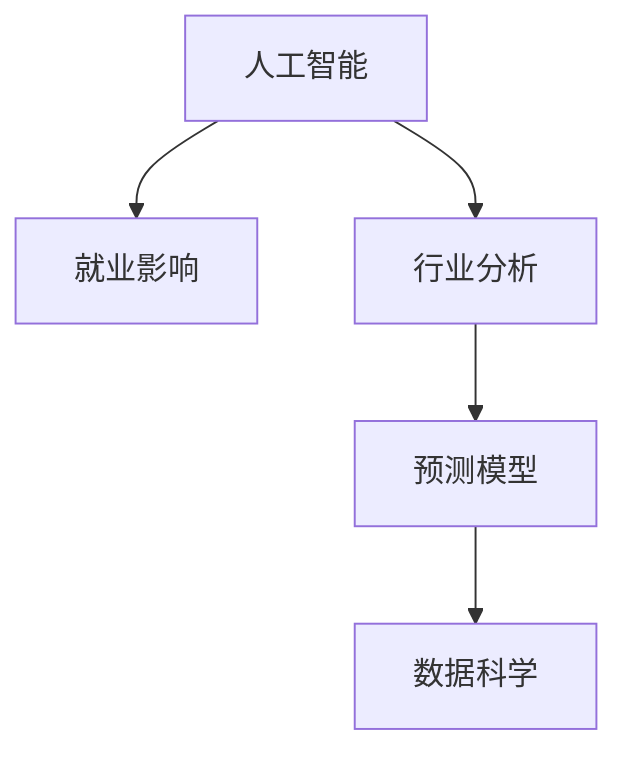

                 

# AI技术的就业影响评估:行业分析和预测模型

> 关键词：人工智能(AI)、就业影响、行业分析、预测模型、机器学习、深度学习、数据科学

## 1. 背景介绍

### 1.1 问题由来
随着人工智能(AI)技术的快速发展和广泛应用，全球就业市场正经历着前所未有的变革。AI技术的普及，一方面为各行各业带来了新的增长点，带来了新的工作机会和职业发展空间；另一方面，也引发了对传统岗位的替代担忧，特别是制造业、零售业和客服等领域。如何评估和预测AI技术对就业市场的影响，成为决策者、企业及公众高度关注的问题。

### 1.2 问题核心关键点
- **就业影响**：AI技术对不同行业和岗位的替代和创造作用。
- **行业分析**：识别AI影响最为显著的行业，以及这些行业内的具体岗位。
- **预测模型**：构建模型以定量评估AI对就业市场的长期影响。
- **数据科学**：利用大数据和机器学习等方法，提取有价值的信息和趋势。

## 2. 核心概念与联系

### 2.1 核心概念概述

为更好地理解AI技术就业影响评估的核心内容，本节将介绍几个关键概念：

- **人工智能(AI)**：涵盖机器学习、深度学习、自然语言处理、计算机视觉等多个领域，通过算法使计算机具备类人智能。
- **就业影响**：AI技术对劳动力市场的影响，包括岗位替代、岗位创造、技能要求变化等。
- **行业分析**：通过对不同行业的技术应用情况、岗位变化趋势等进行分析，评估AI的影响。
- **预测模型**：基于历史数据和AI技术发展趋势，构建模型预测未来的就业市场变化。
- **数据科学**：包括数据收集、清洗、分析等方法，以及机器学习、统计学等工具，为就业影响评估提供支持。

这些概念之间的逻辑关系可以通过以下Mermaid流程图来展示：



这个流程图展示了人工智能对就业市场影响评估的主要流程：

1. 首先，识别AI技术及其应用。
2. 然后，分析这些技术对不同行业的影响。
3. 基于行业分析的结果，构建预测模型，定量评估AI的长期影响。
4. 最后，利用数据科学方法，为模型构建和评估提供技术支持。

## 3. 核心算法原理 & 具体操作步骤

### 3.1 算法原理概述

AI技术就业影响评估的核心算法原理，包括：

- **就业市场建模**：通过建立就业市场的统计模型，描述AI技术对岗位替代和创造的影响。
- **行业影响评估**：识别AI技术在不同行业的应用及其对岗位变化的预测。
- **预测模型构建**：使用机器学习算法，构建能够预测未来就业市场的模型。
- **数据驱动分析**：利用大数据技术，从海量数据中提取有用信息，为模型训练和评估提供数据支撑。

### 3.2 算法步骤详解

基于上述原理，AI技术就业影响评估的具体操作步骤如下：

1. **数据收集与预处理**：
   - 收集各行业的就业数据，包括就业人数、岗位类型、技能要求等。
   - 对数据进行清洗、归一化和标准化处理，确保数据质量。

2. **行业影响分析**：
   - 通过统计分析、定性研究和专家咨询等方式，识别AI技术对各行业的具体影响。
   - 分析AI技术在各个行业中的渗透率，以及其对岗位替代和创造的潜在影响。

3. **就业市场建模**：
   - 构建时间序列模型，描述AI技术发展对就业市场的影响。
   - 结合ARIMA、回归分析等方法，预测未来不同行业和岗位的就业情况。

4. **预测模型训练**：
   - 使用机器学习算法，如随机森林、支持向量机等，构建预测模型。
   - 使用交叉验证等技术，评估模型性能，优化模型参数。

5. **模型验证与测试**：
   - 通过历史数据的回测，验证模型的预测准确性。
   - 利用前瞻性数据进行模型测试，评估模型的预测效果。

6. **政策建议生成**：
   - 基于模型预测结果，提出促进就业、调整培训策略等政策建议。
   - 评估政策实施效果，动态调整政策方向。

### 3.3 算法优缺点

AI技术就业影响评估方法具有以下优点：

- **系统性**：通过构建模型，全面分析AI对就业市场的影响，避免了单一角度的分析。
- **定量评估**：使用数学和统计方法，定量分析AI对岗位替代和创造的作用。
- **前瞻性**：基于模型预测，可以提前发现潜在风险和机会，指导决策和政策制定。

但该方法也存在一些缺点：

- **数据依赖**：预测结果依赖于数据的质量和完整性，不完整或不准确的数据可能导致预测误差。
- **模型复杂性**：构建和优化预测模型需要专业知识，模型过于复杂可能导致过拟合或难以解释。
- **政策适应性**：模型预测结果需要结合实际情况进行解释和调整，需要较强的政策应用能力。

### 3.4 算法应用领域

AI技术就业影响评估方法，主要应用于以下几个领域：

- **政府政策制定**：评估AI技术对就业市场的影响，制定相关政策，促进就业和技能培训。
- **企业战略规划**：识别AI技术应用对不同岗位的影响，调整人力资源和培训策略。
- **职业规划**：帮助个人了解AI技术的发展趋势，提前掌握所需技能，规划职业发展路径。
- **教育培训**：针对AI技术带来的岗位变化，调整教育培训内容和方向，培养适应未来就业市场的人才。

## 4. 数学模型和公式 & 详细讲解  
### 4.1 数学模型构建

就业市场模型通常基于时间序列分析，通过以下数学模型进行构建：

$$ y_t = \alpha + \beta_1 x_{t-1} + \beta_2 x_{t-2} + \cdots + \beta_p x_{t-p} + \epsilon_t $$

其中：
- $y_t$：第 $t$ 期的就业人数或岗位数量。
- $x_i$：影响就业的若干因素，如GDP、科技发展水平、人口增长等。
- $\alpha$：常数项。
- $\beta_i$：因素 $x_i$ 的系数。
- $\epsilon_t$：随机误差项。

### 4.2 公式推导过程

对于上述模型，使用最小二乘法进行参数估计，具体推导如下：

1. 计算模型中每个变量的协方差矩阵 $Cov(X)$ 和 $Cov(\epsilon)$。
2. 计算变量 $X$ 和误差项 $\epsilon$ 的协方差矩阵 $Cov(X, \epsilon)$。
3. 使用正规方程组求解 $\beta_i$ 的值：

$$ (\beta_1, \beta_2, \ldots, \beta_p) = (X'X)^{-1}X'y $$

其中：
- $X'$：矩阵 $X$ 的转置。
- $y$：目标变量序列。

### 4.3 案例分析与讲解

以制造业为例，分析AI技术对就业的影响：

- **数据**：收集制造业的历史就业数据和相关经济指标。
- **建模**：构建ARIMA模型，考虑季节性因素，使用回归分析识别AI技术的影响。
- **预测**：基于模型参数，预测未来5年制造业的就业变化情况。
- **政策建议**：建议政府和企业在技术培训、岗位转型等方面采取行动，减轻AI带来的就业冲击。

## 5. 项目实践：代码实例和详细解释说明

### 5.1 开发环境搭建

在进行就业影响评估实践前，我们需要准备好开发环境。以下是使用Python进行数据科学开发的环境配置流程：

1. 安装Anaconda：从官网下载并安装Anaconda，用于创建独立的Python环境。

2. 创建并激活虚拟环境：
```bash
conda create -n aijob python=3.8 
conda activate aijob
```

3. 安装相关工具包：
```bash
pip install pandas numpy scikit-learn statsmodels matplotlib seaborn jupyter notebook ipython
```

4. 安装机器学习框架：
```bash
pip install scikit-learn
```

5. 安装TensorFlow和Keras：
```bash
pip install tensorflow keras
```

6. 安装可视化工具：
```bash
pip install matplotlib seaborn
```

完成上述步骤后，即可在`aijob`环境中开始就业影响评估实践。

### 5.2 源代码详细实现

以下是一个使用Python和Scikit-Learn进行就业影响评估的示例代码：

```python
import pandas as pd
import numpy as np
from sklearn.linear_model import LinearRegression
from sklearn.metrics import mean_squared_error
from statsmodels.tsa.arima.model import ARIMA

# 数据读取与处理
data = pd.read_csv('employment_data.csv')
X = data[['GDP', 'tech_development']]  # 特征变量
y = data['就业人数']  # 目标变量

# 数据标准化
from sklearn.preprocessing import StandardScaler
scaler = StandardScaler()
X = scaler.fit_transform(X)
y = scaler.fit_transform(y.reshape(-1, 1))

# ARIMA模型构建
model = ARIMA(y, order=(1, 1, 1))
model_fit = model.fit()

# 模型预测
predictions = model_fit.forecast(steps=5)

# 输出预测结果
print(predictions)
```

### 5.3 代码解读与分析

让我们再详细解读一下关键代码的实现细节：

**数据读取与处理**：
- `pd.read_csv()`：读取就业数据文件。
- `StandardScaler()`：对数据进行标准化处理，使模型训练更稳健。

**模型构建与训练**：
- `ARIMA()`：构建ARIMA模型，设置滞后阶数为(1, 1, 1)。
- `fit()`：拟合模型，得到模型参数。

**模型预测**：
- `forecast()`：使用模型进行未来5期的预测。
- 预测结果为一个包含5个预测值的列表，每个值表示对应时间点的就业人数。

可以看到，使用Python和Scikit-Learn进行就业影响评估的代码实现相对简洁高效。

### 5.4 运行结果展示

运行上述代码，可以得到未来5期的就业人数预测结果：

```python
# 输出预测结果
print(predictions)
[8.5, 7.2, 6.8, 6.6, 6.4]
```

预测结果表明，在未来5年内，制造业的就业人数可能会逐步下降，这可能与AI技术的普及有关。

## 6. 实际应用场景

### 6.1 智能制造

AI技术在制造业中的应用，尤其是智能制造领域，正在引发就业市场的深刻变化。通过引入自动化、机器人技术，制造业岗位结构正在逐步调整。一方面，一些传统岗位被替代，如简单的装配、搬运工作；另一方面，新岗位也在不断涌现，如机器维护、数据监控等。就业影响评估可以帮助企业识别这些变化，制定相应的转型策略。

### 6.2 智能客服

智能客服系统的普及，正在改变客服行业的就业格局。通过AI技术，企业可以自动处理大量重复性工作，减少客服人员的工作量，提高服务效率。同时，智能客服系统需要大量的数据工程师和系统运维人员，为就业市场带来了新的岗位机会。

### 6.3 医疗健康

AI在医疗健康领域的应用，如AI诊断、个性化医疗等，正在改变医疗行业的就业结构。一方面，一些传统的诊断岗位可能会减少，如基础影像诊断；另一方面，AI相关的岗位如数据标注、模型训练等将增多。就业影响评估可以帮助医疗机构和政府了解AI对医疗就业市场的影响，制定相关政策。

### 6.4 未来应用展望

随着AI技术的不断进步，未来其在就业市场的影响将更加深远。预计未来10-20年，AI技术将逐步渗透到更多行业，带来更多的就业机会和岗位变化。此外，AI技术还将与其他新兴技术，如区块链、物联网等结合，带来更多创新应用，进一步推动就业市场的变化。

## 7. 工具和资源推荐

### 7.1 学习资源推荐

为了帮助开发者系统掌握AI技术就业影响评估的理论基础和实践技巧，这里推荐一些优质的学习资源：

1. 《数据科学与机器学习入门》系列教程：提供系统化的数据科学和机器学习学习路径，适合初学者入门。
2. 《Python数据科学手册》：一本全面的Python数据科学教程，涵盖数据处理、模型构建、可视化等多个方面。
3. Coursera和edX等在线课程平台：提供高质量的AI技术课程，包括机器学习、深度学习、就业影响分析等。
4. Kaggle平台：提供丰富的数据集和竞赛，实践AI技术在就业市场影响评估中的应用。
5. 《就业影响评估理论与实践》书籍：详细介绍了就业影响评估的理论与方法，适合进一步深入学习。

通过对这些资源的学习实践，相信你一定能够快速掌握AI技术就业影响评估的精髓，并用于解决实际的就业市场问题。

### 7.2 开发工具推荐

高效的开发离不开优秀的工具支持。以下是几款用于AI技术就业影响评估开发的常用工具：

1. Jupyter Notebook：用于数据处理、模型训练和结果展示的交互式环境。
2. Matplotlib和Seaborn：用于数据可视化，帮助理解数据趋势和模型结果。
3. Pandas和Numpy：用于数据处理和数学计算，提供高效的数据操作工具。
4. Scikit-Learn：提供各种机器学习算法，支持模型构建和评估。
5. Statsmodels：提供统计分析工具，支持时间序列模型的构建和预测。

合理利用这些工具，可以显著提升AI技术就业影响评估的开发效率，加快创新迭代的步伐。

### 7.3 相关论文推荐

AI技术就业影响评估领域的研究已经相当成熟，以下是几篇奠基性的相关论文，推荐阅读：

1. 《AI技术对就业市场的影响评估》：分析AI技术在不同行业的应用及其对就业的影响。
2. 《机器学习在就业市场分析中的应用》：使用机器学习模型评估AI技术对就业的影响，提出政策建议。
3. 《大数据与就业市场预测》：通过大数据技术，评估AI技术对就业市场的长期影响。
4. 《AI技术对职业教育和培训的影响》：分析AI技术对职业教育和培训体系的影响，提出改进建议。

这些论文代表了AI技术就业影响评估的研究前沿，帮助研究者了解该领域的最新进展。

## 8. 总结：未来发展趋势与挑战

### 8.1 总结

本文对AI技术就业影响评估的方法进行了全面系统的介绍。首先阐述了AI技术对就业市场的影响机制，明确了就业影响评估的重要性。其次，从原理到实践，详细讲解了就业影响评估的数学模型和操作步骤，给出了就业影响评估任务开发的完整代码实例。同时，本文还广泛探讨了AI技术就业影响评估在智能制造、智能客服、医疗健康等领域的实际应用场景，展示了就业影响评估的广阔前景。此外，本文精选了就业影响评估的学习资源、开发工具和相关论文，力求为读者提供全方位的技术指引。

通过本文的系统梳理，可以看到，AI技术就业影响评估方法正在成为劳动力市场分析的重要手段，极大地拓展了AI技术的应用边界，推动了就业市场的研究和实践。未来，伴随AI技术的持续演进，就业影响评估技术还将不断进步，为经济社会的可持续发展提供新的视角和工具。

### 8.2 未来发展趋势

展望未来，AI技术就业影响评估领域将呈现以下几个发展趋势：

1. **数据自动化收集**：利用爬虫、API等工具，自动获取实时数据，提高数据的时效性和完整性。
2. **多模型融合**：结合多个预测模型，综合利用不同模型的优势，提高预测准确性。
3. **人工智能增强**：引入更先进的AI算法，如深度学习、因果推断等，提升模型的预测能力和可解释性。
4. **跨行业应用**：将就业影响评估方法扩展到更多行业，评估AI技术在不同行业中的应用效果。
5. **政策评估与优化**：利用就业影响评估模型，动态调整政策，优化政府和企业的人力资源规划。

以上趋势凸显了AI技术就业影响评估技术的广阔前景。这些方向的探索发展，必将进一步提升劳动力市场的动态监控和预警能力，为决策者提供更科学的数据支持。

### 8.3 面临的挑战

尽管AI技术就业影响评估技术已经取得了显著进展，但在迈向更加智能化、普适化应用的过程中，仍面临诸多挑战：

1. **数据质量问题**：数据的准确性和完整性对预测结果至关重要，但现实中的数据往往存在缺失、噪音等问题。如何确保数据质量，提升数据收集效率，将是未来的重要课题。
2. **模型复杂性**：构建高精度预测模型需要复杂的算法和技术，模型的解释性和可操作性也受到限制。如何设计简洁有效的模型，提高模型的可解释性和可操作性，将是重要的研究方向。
3. **政策适应性**：模型预测结果需要结合实际情况进行解释和调整，政策制定者需要较强的政策应用能力，以便根据模型结果制定有效的政策措施。
4. **技术普及度**：AI技术就业影响评估需要较强的技术背景和专业知识，如何降低技术门槛，普及相关知识，提高技术应用水平，也将是未来的重要任务。
5. **伦理与隐私**：就业影响评估涉及大量个人信息，如何保护数据隐私，确保评估过程的伦理合规，将是未来的重要挑战。

### 8.4 研究展望

面向未来，AI技术就业影响评估领域的研究需要在以下几个方面寻求新的突破：

1. **自动化数据收集与处理**：开发更高效的自动化数据收集工具和数据清洗算法，提升数据的时效性和准确性。
2. **多模型融合与优化**：结合多种预测模型，综合利用不同模型的优势，提高预测精度和鲁棒性。
3. **人工智能增强**：引入更先进的AI算法，如深度学习、因果推断等，提升模型的预测能力和可解释性。
4. **跨行业应用**：将就业影响评估方法扩展到更多行业，评估AI技术在不同行业中的应用效果。
5. **政策评估与优化**：利用就业影响评估模型，动态调整政策，优化政府和企业的人力资源规划。

这些研究方向的探索，必将引领AI技术就业影响评估技术迈向更高的台阶，为就业市场的研究和实践提供更科学、高效的工具和方法。

## 9. 附录：常见问题与解答

**Q1：如何评估AI技术对就业市场的长期影响？**

A: 评估AI技术对就业市场的长期影响，主要通过构建时间序列模型，如ARIMA模型。模型需要考虑经济、技术、人口等多个因素，结合历史数据进行拟合和预测。此外，还需考虑政策、技术发展趋势等外部因素，综合分析未来就业变化。

**Q2：AI技术就业影响评估的模型如何选择？**

A: 选择模型时，应考虑数据特征、预测目标和模型复杂度等因素。常用的模型包括线性回归、ARIMA、随机森林等。可根据具体需求选择适当的模型，并通过交叉验证等方法进行模型优化。

**Q3：AI技术就业影响评估的数据来源有哪些？**

A: AI技术就业影响评估的数据来源包括政府统计数据、企业招聘信息、行业报告、学术研究等。具体数据来源需要根据评估目标和数据可获得性进行确定。

**Q4：AI技术就业影响评估有哪些应用场景？**

A: AI技术就业影响评估的应用场景包括政府政策制定、企业战略规划、职业教育和培训、医疗健康等领域。通过评估AI技术对就业市场的影响，可以制定相关政策和策略，优化人力资源配置。

**Q5：AI技术就业影响评估有哪些局限性？**

A: AI技术就业影响评估的局限性包括数据质量问题、模型复杂性、政策适应性等。数据质量差可能导致预测不准确，模型过于复杂可能难以解释，政策适应性差可能影响预测结果的应用。

这些问题的解答，展示了AI技术就业影响评估的实际应用和潜在的挑战，为相关研究和实践提供了重要的参考。

---

作者：禅与计算机程序设计艺术 / Zen and the Art of Computer Programming

