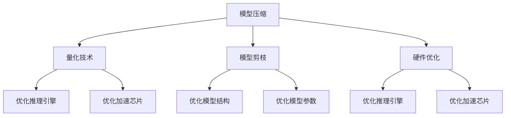

                 

# AI推理能力的工程优化:推理加速和推理优化

> 关键词：推理加速,推理优化,深度学习,模型压缩,量化技术,模型剪枝,硬件优化,推理引擎,TensorRT,ONNX

## 1. 背景介绍

### 1.1 问题由来

随着深度学习模型的日渐庞大，其推理计算开销也日益凸显。特别是在对实时性要求较高的场景，如自动驾驶、机器人控制、实时语音识别等，高效的推理计算能力变得至关重要。推理优化和加速成为实现深度学习模型高效部署的关键技术，对于提升模型性能、优化资源利用、降低计算成本具有重要意义。

推理优化主要聚焦于在不影响模型精度的前提下，通过各种技术和手段，提高推理过程的效率，降低计算和存储开销。常见的优化技术包括模型压缩、量化、剪枝、硬件优化等。其中，模型压缩和量化是降低模型计算和存储需求的关键手段，硬件优化则通过将模型部署到专门的推理引擎或加速芯片上，进一步提升推理速度。

推理优化技术的应用，使得深度学习模型能够被广泛应用于各种实时计算场景，显著提升了人工智能系统的性能和用户体验。

### 1.2 问题核心关键点

推理优化技术的主要挑战在于如何在保证模型精度的前提下，最大化地提升推理速度和降低资源需求。这涉及到模型压缩、量化、剪枝、硬件加速等核心技术。

- **模型压缩**：减少模型参数量，降低计算和存储开销。
- **量化技术**：将浮点数参数或输入输出转换为低精度整数或定点数，降低计算复杂度和存储需求。
- **模型剪枝**：去除模型中不重要或冗余的参数和连接，降低模型复杂度。
- **硬件优化**：利用专门的推理引擎和加速芯片，提升推理速度。

## 2. 核心概念与联系

### 2.1 核心概念概述

推理优化技术涉及多个核心概念，包括但不限于模型压缩、量化、剪枝、硬件加速等。这些技术相互之间存在密切联系，共同构成推理优化的完整技术体系。

- **模型压缩**：减少模型参数量，降低计算和存储需求。
- **量化技术**：将浮点数参数或输入输出转换为低精度整数或定点数，降低计算复杂度和存储需求。
- **模型剪枝**：去除模型中不重要或冗余的参数和连接，降低模型复杂度。
- **硬件优化**：利用专门的推理引擎和加速芯片，提升推理速度。

### 2.2 核心概念原理和架构的 Mermaid 流程图(Mermaid 流程节点中不要有括号、逗号等特殊字符)


这个流程图展示了模型压缩、量化、剪枝和硬件优化技术之间的关系。模型压缩、量化和剪枝是降低模型计算和存储需求的关键技术，而硬件优化则通过将模型部署到专门的推理引擎或加速芯片上，进一步提升推理速度。

## 3. 核心算法原理 & 具体操作步骤
### 3.1 算法原理概述

推理优化技术的核心在于通过一系列的模型压缩、量化、剪枝等技术手段，减少模型参数量和计算复杂度，最终实现模型推理效率的提升。具体而言，推理优化包括以下几个关键步骤：

1. **模型压缩**：通过减少模型参数量，降低计算和存储需求。常见的模型压缩技术包括权重剪枝、参数共享、模型蒸馏等。
2. **量化技术**：将浮点数参数或输入输出转换为低精度整数或定点数，降低计算复杂度和存储需求。量化技术包括权重量化、激活量化等。
3. **模型剪枝**：去除模型中不重要或冗余的参数和连接，降低模型复杂度。常见的剪枝技术包括网络剪枝、通道剪枝、连接剪枝等。
4. **硬件优化**：利用专门的推理引擎和加速芯片，提升推理速度。常见的硬件优化技术包括TensorRT、ONNX Runtime等。

### 3.2 算法步骤详解

**步骤1: 模型压缩**

模型压缩的主要目的是减少模型参数量，降低计算和存储需求。常见的模型压缩技术包括：

- **权重剪枝**：去除模型中较小的权重，只保留较大权重，减少模型参数量。常用的算法有结构剪枝、全局剪枝等。
- **参数共享**：通过共享部分参数，减少参数数量。常见的参数共享技术包括K-means聚类、稠密连接共享等。
- **模型蒸馏**：将大模型知识蒸馏到小模型中，减少模型复杂度。常见的蒸馏技术包括教师-学生蒸馏、知识蒸馏等。

**步骤2: 量化技术**

量化技术的主要目标是通过将浮点数参数或输入输出转换为低精度整数或定点数，降低计算复杂度和存储需求。常见的量化技术包括：

- **权重量化**：将权重矩阵转换为低精度整数或定点数，减少计算复杂度。常见的权重量化算法包括静态量化、动态量化等。
- **激活量化**：将激活值转换为低精度整数或定点数，减少计算复杂度。常见的激活量化算法包括仿射量化、Tanh量化等。

**步骤3: 模型剪枝**

模型剪枝的主要目的是去除模型中不重要或冗余的参数和连接，降低模型复杂度。常见的模型剪枝技术包括：

- **网络剪枝**：去除模型中冗余的卷积层和全连接层，减少模型参数量。常见的剪枝算法包括基于稀疏连接的网络剪枝、基于过滤器的网络剪枝等。
- **通道剪枝**：去除模型中冗余的通道，减少模型参数量。常见的剪枝算法包括结构剪枝、K-means聚类等。
- **连接剪枝**：去除模型中冗余的连接，减少模型参数量。常见的剪枝算法包括稀疏连接剪枝、Hessian剪枝等。

**步骤4: 硬件优化**

硬件优化的主要目的是通过将模型部署到专门的推理引擎或加速芯片上，提升推理速度。常见的硬件优化技术包括：

- **TensorRT**：NVIDIA推出的推理引擎，支持多种深度学习框架和模型，能够显著提升推理速度。
- **ONNX Runtime**：Microsoft推出的推理引擎，支持多种深度学习框架和模型，能够优化推理过程。
- **专用加速芯片**：如Google的TPU、Intel的Movidius等，能够提供更高效的推理计算能力。

### 3.3 算法优缺点

推理优化技术具有以下优点：

- **降低计算和存储开销**：通过模型压缩、量化、剪枝等技术，显著降低模型计算和存储需求，提升资源利用效率。
- **提升推理速度**：通过硬件优化和推理引擎优化，显著提升模型的推理速度，满足实时计算需求。
- **提高模型可部署性**：通过优化后的模型，可以更方便地部署到各种硬件平台，支持更多的应用场景。

然而，这些技术也存在一些缺点：

- **精度损失**：压缩、量化和剪枝技术可能引入一定程度的精度损失，需要根据应用场景进行权衡。
- **实现复杂度**：一些优化技术如TensorRT、ONNX Runtime等，需要额外的配置和优化，实现复杂度较高。
- **模型迁移性降低**：优化后的模型可能不再兼容原有框架或工具，需要额外的适配工作。

## 4. 数学模型和公式 & 详细讲解 & 举例说明（备注：数学公式请使用latex格式，latex嵌入文中独立段落使用 $$，段落内使用 $)
### 4.1 数学模型构建

推理优化技术涉及多个数学模型，主要包括以下几个方面：

- **模型压缩**：通过减少模型参数量，降低计算和存储需求。常见的模型压缩技术包括权重剪枝、参数共享、模型蒸馏等。
- **量化技术**：将浮点数参数或输入输出转换为低精度整数或定点数，降低计算复杂度和存储需求。量化技术包括权重量化、激活量化等。
- **模型剪枝**：去除模型中不重要或冗余的参数和连接，降低模型复杂度。常见的剪枝技术包括网络剪枝、通道剪枝、连接剪枝等。
- **硬件优化**：利用专门的推理引擎和加速芯片，提升推理速度。常见的硬件优化技术包括TensorRT、ONNX Runtime等。

### 4.2 公式推导过程

以权重剪枝为例，其公式推导如下：

设原模型权重矩阵为 $W$，剪枝后保留的权重矩阵为 $W'$，剪枝阈值为 $\theta$。则权重剪枝的过程可以表示为：

$$ W' = \{w_i \mid |w_i| > \theta\} $$

其中 $|w_i|$ 表示权重 $w_i$ 的绝对值。

### 4.3 案例分析与讲解

以TensorRT为例，其优化过程如下：

1. **模型转换**：将深度学习模型转换为TensorRT支持的格式，如ONNX、TensorsFlow等。
2. **网络优化**：TensorRT会对模型网络进行优化，包括去除冗余操作、融合层、去除不必要的输入输出等。
3. **内存优化**：TensorRT会对模型进行内存优化，减少内存访问开销，提升推理速度。
4. **推理优化**：TensorRT会对推理过程进行优化，包括使用快速算法、利用硬件加速等。

## 5. 项目实践：代码实例和详细解释说明
### 5.1 开发环境搭建

在进行推理优化项目开发前，需要准备好开发环境。以下是使用Python进行TensorFlow开发的环境配置流程：

1. 安装Anaconda：从官网下载并安装Anaconda，用于创建独立的Python环境。

2. 创建并激活虚拟环境：
```bash
conda create -n tf-env python=3.8 
conda activate tf-env
```

3. 安装TensorFlow：根据CUDA版本，从官网获取对应的安装命令。例如：
```bash
conda install tensorflow -c tf
```

4. 安装其他依赖工具：
```bash
pip install numpy pandas scikit-learn matplotlib tqdm jupyter notebook ipython
```

完成上述步骤后，即可在`tf-env`环境中开始推理优化实践。

### 5.2 源代码详细实现

下面我们以TensorRT优化为例，给出使用TensorRT进行模型优化的PyTorch代码实现。

首先，定义模型并进行转换：

```python
import tensorflow as tf
import tensorrt as trt
from tensorflow.keras.applications.resnet50 import ResNet50
from tensorflow.keras.preprocessing import image
from tensorflow.keras.applications.resnet50 import preprocess_input

model = ResNet50(weights='imagenet')

# 将模型转换为TensorRT格式
builder = trt.Builder(trt.DEFAULT_TENSORRT_LOGGER)
network = builder.create_network()
for layer in model.layers:
    trt_layer = builder.create_layer_from_name(layer.name, layer)
    network.add_layer(trt_layer)
```

然后，对模型进行优化：

```python
# 优化网络
calibrator = trt.Calibrator()
builder.config.set_flag(trt.BuilderFlag.FP16) # 使用FP16优化
builder.config.set_max_batch_size(8)
builder.config.set_max_workspace_size(2 << 20)
```

最后，启动推理过程：

```python
# 获取优化后的网络
network = builder.build_cuda_engine(network)
print(network)

# 设置输入输出节点
inputs = network.get_binding_shape(0)
outputs = network.get_binding_shape(1)

# 加载模型并优化
with trt.DEFAULT_TENSORRT_LOGGER as logger:
    trt_model = network.build_engine(optimizer=calibrator, logger=logger)
    with open('trt_model.txt', 'wb') as f:
        f.write(trt_model.serialize())
```

以上就是使用TensorRT进行模型优化的完整代码实现。可以看到，TensorRT的优化过程主要包括模型转换、网络优化、内存优化和推理优化等步骤，每一步都有详细的解释和示例代码。

### 5.3 代码解读与分析

让我们再详细解读一下关键代码的实现细节：

**模型转换**：
- 将深度学习模型转换为TensorRT支持的格式，如ONNX、TensorsFlow等。
- 使用`builder.create_layer_from_name`方法将模型各层转换为TensorRT层，并添加到优化后的网络中。

**网络优化**：
- 使用`calibrator`对网络进行校准，以优化FP16优化和内存优化。
- 使用`builder.config.set_flag`方法设置优化参数，如FP16优化、最大批次大小、最大工作空间大小等。

**模型加载与优化**：
- 使用`builder.build_cuda_engine`方法构建优化后的TensorRT网络。
- 使用`calibrator`对网络进行校准，以优化推理速度。
- 将优化后的TensorRT网络序列化为文件，以便后续使用。

## 6. 实际应用场景
### 6.1 自动驾驶系统

自动驾驶系统依赖于实时、准确的推理计算，以确保车辆安全和高效行驶。通过推理优化技术，自动驾驶系统能够快速处理传感器数据，进行精准决策，提高驾驶效率和安全性。

在实践中，自动驾驶系统可以采用推理优化技术对深度学习模型进行优化，以提升推理速度和降低计算成本。例如，通过TensorRT对模型进行优化，能够在GPU上实现实时推理，满足自动驾驶系统的高实时性要求。

### 6.2 语音识别系统

语音识别系统依赖于高效的推理计算，以实现实时、准确的语音转换。通过推理优化技术，语音识别系统能够快速处理音频数据，进行精准识别，提高语音转换的效率和准确性。

在实践中，语音识别系统可以采用推理优化技术对深度学习模型进行优化，以提升推理速度和降低计算成本。例如，通过TensorRT对模型进行优化，能够在GPU上实现实时推理，满足语音识别系统的高实时性要求。

### 6.3 智能监控系统

智能监控系统依赖于高效的推理计算，以实现实时、准确的图像识别和分析。通过推理优化技术，智能监控系统能够快速处理图像数据，进行精准分析，提高监控效率和安全性。

在实践中，智能监控系统可以采用推理优化技术对深度学习模型进行优化，以提升推理速度和降低计算成本。例如，通过TensorRT对模型进行优化，能够在GPU上实现实时推理，满足智能监控系统的高实时性要求。

### 6.4 未来应用展望

随着推理优化技术的不断发展，其在深度学习模型中的应用前景将更加广阔。未来，推理优化技术将在以下几个方向取得重要突破：

1. **低比特量化技术**：通过进一步降低量化精度，减少计算和存储开销。
2. **动态量化技术**：根据模型运行情况动态调整量化参数，进一步提升推理效率。
3. **端到端推理优化**：将模型、推理引擎和硬件加速结合起来，实现从模型到推理的全链路优化。
4. **软硬件协同优化**：通过软硬件协同设计，进一步提升推理速度和降低计算成本。

## 7. 工具和资源推荐
### 7.1 学习资源推荐

为了帮助开发者系统掌握推理优化技术，这里推荐一些优质的学习资源：

1. **《深度学习模型优化技术》系列博文**：由深度学习专家撰写，深入浅出地介绍了模型压缩、量化、剪枝等前沿技术。

2. **TensorFlow官网文档**：提供了TensorRT、ONNX Runtime等推理引擎的详细文档和样例代码，是入门和实践的必备资源。

3. **《深度学习优化》书籍**：全面介绍了深度学习模型优化的各种技术和方法，适合深入学习。

4. **HuggingFace官方文档**：提供了大量预训练模型和优化样例，帮助开发者快速上手实践。

5. **Coursera《深度学习优化》课程**：斯坦福大学开设的深度学习优化课程，涵盖模型压缩、量化、剪枝等技术，适合系统学习。

通过这些资源的学习实践，相信你一定能够快速掌握推理优化技术的精髓，并用于解决实际的深度学习问题。

### 7.2 开发工具推荐

高效的开发离不开优秀的工具支持。以下是几款用于推理优化开发的常用工具：

1. TensorFlow：基于Python的开源深度学习框架，支持多种优化技术，适合快速迭代研究。
2. PyTorch：基于Python的开源深度学习框架，支持多种优化技术，适合快速迭代研究。
3. TensorRT：NVIDIA推出的推理引擎，支持多种深度学习框架和模型，能够显著提升推理速度。
4. ONNX Runtime：Microsoft推出的推理引擎，支持多种深度学习框架和模型，能够优化推理过程。
5. Google TPU：Google推出的专用加速芯片，能够提供更高效的推理计算能力。

合理利用这些工具，可以显著提升推理优化任务的开发效率，加快创新迭代的步伐。

### 7.3 相关论文推荐

推理优化技术的发展得益于学界的持续研究。以下是几篇奠基性的相关论文，推荐阅读：

1. **《Deep Learning Acceleration via Hybrid Soft-/hardware Optimization》**：探讨了软硬件协同优化的技术，提高了深度学习模型的推理速度。
2. **《Model Compression: A Survey》**：总结了模型压缩的各种技术和方法，提供了全面的参考。
3. **《Pruning Techniques for Deep Learning》**：介绍了深度学习模型剪枝的各种技术和方法，提供了丰富的参考。
4. **《Weight Quantization Techniques》**：探讨了深度学习模型量化的各种技术和方法，提供了全面的参考。
5. **《TensorRT: The Engine for Intelligent Computing》**：介绍了TensorRT的优化原理和实践方法，提供了详细的参考。

这些论文代表了大模型推理优化技术的发展脉络。通过学习这些前沿成果，可以帮助研究者把握学科前进方向，激发更多的创新灵感。

## 8. 总结：未来发展趋势与挑战

### 8.1 总结

本文对深度学习模型的推理优化技术进行了全面系统的介绍。首先阐述了推理优化技术的研究背景和意义，明确了推理优化在提高模型性能、优化资源利用、降低计算成本等方面的独特价值。其次，从原理到实践，详细讲解了推理优化的数学原理和关键步骤，给出了推理优化任务开发的完整代码实例。同时，本文还广泛探讨了推理优化技术在自动驾驶、语音识别、智能监控等多个行业领域的应用前景，展示了推理优化技术的巨大潜力。此外，本文精选了推理优化技术的各类学习资源，力求为读者提供全方位的技术指引。

通过本文的系统梳理，可以看到，推理优化技术已经成为深度学习模型高效部署的重要手段，为各种实时计算场景提供了技术支撑。未来，伴随推理优化技术的持续演进，深度学习模型必将在更广阔的应用领域大放异彩，深刻影响人类的生产生活方式。

### 8.2 未来发展趋势

展望未来，推理优化技术将呈现以下几个发展趋势：

1. **低比特量化技术**：通过进一步降低量化精度，减少计算和存储开销。
2. **动态量化技术**：根据模型运行情况动态调整量化参数，进一步提升推理效率。
3. **端到端推理优化**：将模型、推理引擎和硬件加速结合起来，实现从模型到推理的全链路优化。
4. **软硬件协同优化**：通过软硬件协同设计，进一步提升推理速度和降低计算成本。
5. **模型压缩技术**：探索更多的模型压缩技术和算法，进一步减少模型参数量。

以上趋势凸显了推理优化技术的广阔前景。这些方向的探索发展，必将进一步提升深度学习模型的性能和应用范围，为人工智能技术在垂直行业的规模化落地提供更强大的技术支撑。

### 8.3 面临的挑战

尽管推理优化技术已经取得了瞩目成就，但在迈向更加智能化、普适化应用的过程中，它仍面临诸多挑战：

1. **精度损失**：压缩、量化和剪枝技术可能引入一定程度的精度损失，需要根据应用场景进行权衡。
2. **实现复杂度**：一些优化技术如TensorRT、ONNX Runtime等，需要额外的配置和优化，实现复杂度较高。
3. **模型迁移性降低**：优化后的模型可能不再兼容原有框架或工具，需要额外的适配工作。
4. **硬件资源限制**：推理优化技术依赖于高效的硬件平台，如GPU、TPU等，硬件资源的限制可能影响其普及和应用。

这些挑战需要通过更多的技术创新和工程实践来解决，以进一步推动推理优化技术的广泛应用。

### 8.4 研究展望

面对推理优化技术面临的诸多挑战，未来的研究需要在以下几个方面寻求新的突破：

1. **低比特量化技术**：探索更高效的低比特量化算法，进一步减少计算和存储开销。
2. **动态量化技术**：研究动态量化技术，根据模型运行情况动态调整量化参数，进一步提升推理效率。
3. **端到端推理优化**：将模型、推理引擎和硬件加速结合起来，实现从模型到推理的全链路优化。
4. **软硬件协同优化**：研究软硬件协同优化技术，进一步提升推理速度和降低计算成本。
5. **模型压缩技术**：探索更多的模型压缩技术和算法，进一步减少模型参数量。

这些研究方向的探索，必将引领推理优化技术迈向更高的台阶，为深度学习模型在各种实时计算场景中的应用提供更强大的技术支撑。

## 9. 附录：常见问题与解答

**Q1：推理优化技术是否适用于所有深度学习模型？**

A: 推理优化技术可以应用于各种深度学习模型，尤其是那些参数量较大的模型，如卷积神经网络、循环神经网络等。但需要注意的是，不同的模型可能需要采用不同的优化技术和策略。

**Q2：推理优化技术如何影响模型精度？**

A: 推理优化技术可能会引入一定程度的精度损失，具体取决于优化手段和应用场景。通常，量化和剪枝技术对模型精度的影响较小，而压缩技术可能会带来一定的精度损失。需要在精度和效率之间进行权衡。

**Q3：推理优化技术是否能够提升模型推理速度？**

A: 推理优化技术的主要目标之一是提升模型推理速度，通过模型压缩、量化、剪枝等技术，显著降低模型计算和存储需求，从而提升推理效率。但具体的提升效果取决于具体的优化技术和模型结构。

**Q4：推理优化技术是否影响模型的可解释性？**

A: 推理优化技术可能会影响模型的可解释性，特别是量化和剪枝技术，由于减少了模型参数量，可能使模型内部的复杂度增加，从而降低可解释性。但可以通过模型压缩技术、优化推理引擎等手段，提升模型的可解释性。

**Q5：推理优化技术如何影响模型的迁移能力？**

A: 推理优化技术可能会影响模型的迁移能力，特别是量化和剪枝技术，由于减少了模型参数量，可能会使模型在特定任务上的表现有所下降。但可以通过模型压缩技术、优化推理引擎等手段，提升模型的迁移能力。

通过这些问题的解答，可以看到，推理优化技术在提高模型推理效率的同时，也面临着精度、可解释性、迁移能力等方面的挑战。这些挑战需要通过更多的技术创新和工程实践来解决，以进一步推动推理优化技术的广泛应用。

---

作者：禅与计算机程序设计艺术 / Zen and the Art of Computer Programming

