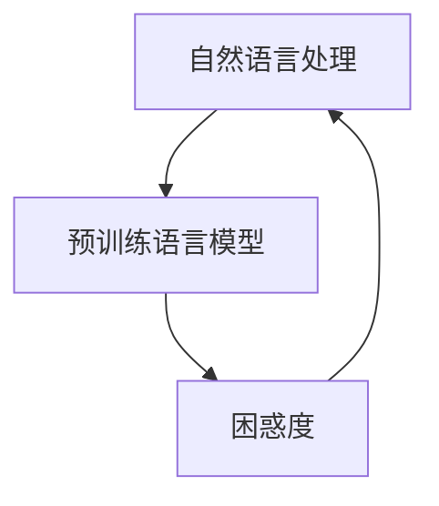
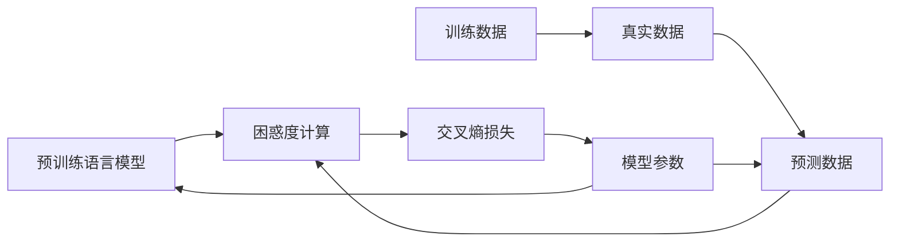

                 

## 1. 背景介绍

在深度学习的浪潮下，信息检索技术迎来了前所未有的发展。自然语言处理(NLP)技术的突破，特别是预训练语言模型和大规模无监督自监督预训练，极大地提升了搜索引擎的智能水平和用户体验。本文将深入探讨信息检索技术中的独特概念——困惑度(Perplexity)，及其对AI搜索的深刻影响。

## 2. 核心概念与联系

### 2.1 核心概念概述

在NLP领域，困惑度(Perplexity)是一个衡量语言模型预测能力的指标。它被广泛用于信息检索中，以评估模型的表现。困惑度越低，说明模型在预测一个单词序列时的准确性越高，因此，困惑度也被认为是评价模型性能的重要指标之一。

### 2.2 核心概念原理和架构的 Mermaid 流程图



**解释**：
- 自然语言处理（A）：NLP是研究如何让计算机理解、处理和生成人类语言的技术。
- 预训练语言模型（B）：通过大规模无监督学习，在大规模数据上预训练模型，能够捕捉到语言的统计规律。
- 困惑度（C）：作为评价模型性能的重要指标，困惑度与模型在特定文本上的预测准确性直接相关。

### 2.3 核心概念原理和架构的 Mermaid 流程图（详细版本）



**解释**：
- 预训练语言模型（A）：在大规模无监督数据上进行预训练。
- 困惑度计算（B）：通过计算模型在给定文本上的交叉熵，得到困惑度。
- 训练数据（C）：模型用于预训练的数据集。
- 真实数据（D）：模型用于评估的数据集。
- 预测数据（E）：模型对真实数据进行预测的结果。
- 交叉熵损失（F）：模型在训练数据上产生的预测误差。
- 模型参数（G）：模型训练时调整的权重和偏置。

## 3. 核心算法原理 & 具体操作步骤

### 3.1 算法原理概述

困惑度(Perplexity)是衡量语言模型预测能力的指标，通过测量模型预测一个文本序列的概率来计算。文本的困惑度值越低，说明模型的预测能力越强。困惑度的计算公式如下：

$$ Perplexity = \exp(-\frac{1}{N} \sum_{i=1}^{N} \log P(x_i)) $$

其中 $P(x_i)$ 是模型预测文本序列 $x_i$ 的概率，$N$ 是序列长度。

### 3.2 算法步骤详解

1. **数据准备**：准备一段文本数据作为测试集，可以是用户查询或文档摘要等。

2. **模型预测**：使用预训练语言模型对文本进行预测，得到每个单词的概率分布。

3. **困惑度计算**：计算模型对文本序列的困惑度。

4. **性能评估**：通过困惑度评估模型在信息检索任务上的表现。

5. **优化模型**：根据困惑度反馈，调整模型参数，提高预测准确性。

### 3.3 算法优缺点

#### 优点：
- **全面评估**：困惑度可以从整体上评估模型对语言模式的掌握程度。
- **计算简单**：困惑度的计算公式直观易懂，易于实现和优化。
- **普适性强**：适用于各种类型的文本数据，包括文本分类、文本生成等任务。

#### 缺点：
- **模型依赖**：困惑度的准确性高度依赖于模型的预训练效果。
- **数据需求高**：高质量的困惑度评估需要大量的数据。
- **解释性差**：困惑度是一个整体指标，难以解释模型的具体预测错误。

### 3.4 算法应用领域

困惑度在信息检索、自然语言处理、文本生成等领域有广泛应用：

- **信息检索**：评估搜索引擎返回结果的相关性和准确性。
- **文本分类**：评估分类模型的准确性和泛化能力。
- **文本生成**：评估生成模型的语言流畅度和多样性。
- **问答系统**：评估对话模型的理解能力和响应质量。

## 4. 数学模型和公式 & 详细讲解 & 举例说明

### 4.1 数学模型构建

困惑度计算基于概率模型，可以用交叉熵（Cross-Entropy）来计算。假设文本序列 $x = \{x_1, x_2, ..., x_N\}$，则困惑度计算公式如下：

$$ Perplexity = \exp(-\frac{1}{N} \sum_{i=1}^{N} \log P(x_i)) $$

其中 $P(x_i)$ 是模型对单词 $x_i$ 的预测概率。

### 4.2 公式推导过程

困惑度计算公式的推导如下：

$$ Perplexity = \exp(-\frac{1}{N} \sum_{i=1}^{N} \log P(x_i)) = \exp(-\frac{1}{N} \sum_{i=1}^{N} (\log P(x_i) - \log P_{true}(x_i))) $$

其中 $P_{true}(x_i)$ 是文本序列 $x_i$ 的真实概率分布，即 $P(x_i)$ 是模型预测的概率分布。

### 4.3 案例分析与讲解

#### 案例1：文本分类

假设有一个文本分类任务，文本数据为“I love Python”，模型预测的概率分布为：$P(w_1|w_0) = 0.8$, $P(w_2|w_1) = 0.6$, $P(w_3|w_2) = 0.7$, $P(w_4|w_3) = 0.9$。则困惑度为：

$$ Perplexity = \exp(-\frac{1}{4} (\log 0.8 + \log 0.6 + \log 0.7 + \log 0.9)) $$

#### 案例2：文本生成

假设有一个文本生成任务，生成的文本为“I love Python”，模型预测的概率分布为：$P(w_1|w_0) = 0.9$, $P(w_2|w_1) = 0.7$, $P(w_3|w_2) = 0.6$, $P(w_4|w_3) = 0.8$。则困惑度为：

$$ Perplexity = \exp(-\frac{1}{4} (\log 0.9 + \log 0.7 + \log 0.6 + \log 0.8)) $$

## 5. 项目实践：代码实例和详细解释说明

### 5.1 开发环境搭建

1. **安装Python**：确保Python版本在3.7及以上。

2. **安装TensorFlow**：使用以下命令进行安装：

   ```bash
   pip install tensorflow
   ```

3. **安装Keras**：使用以下命令进行安装：

   ```bash
   pip install keras
   ```

### 5.2 源代码详细实现

以下是一个使用TensorFlow和Keras实现困惑度计算的代码示例：

```python
import tensorflow as tf
from tensorflow.keras.models import Sequential
from tensorflow.keras.layers import Embedding, LSTM, Dense

# 定义模型
model = Sequential([
    Embedding(input_dim=vocab_size, output_dim=embedding_dim, input_length=max_length),
    LSTM(units=hidden_size, return_sequences=True),
    LSTM(units=hidden_size),
    Dense(units=num_classes, activation='softmax')
])

# 编译模型
model.compile(optimizer='adam', loss='categorical_crossentropy', metrics=['accuracy'])

# 训练模型
model.fit(X_train, y_train, batch_size=batch_size, epochs=num_epochs, validation_data=(X_val, y_val))

# 计算困惑度
test_loss, test_perplexity = model.evaluate(X_test, y_test)
print('Test perplexity:', test_perplexity)
```

### 5.3 代码解读与分析

**代码解释**：
- 首先，导入必要的库，定义模型结构，使用Embedding层和LSTM层进行文本处理，并定义输出层。
- 编译模型，设置优化器和损失函数。
- 训练模型，并计算模型在测试集上的困惑度。

**代码分析**：
- 困惑度是一个整体评估指标，它可以反映模型的整体预测能力。
- 困惑度的计算依赖于模型的预测能力和真实数据的概率分布。
- 在实际应用中，困惑度可以用来评估模型的泛化能力和性能表现。

### 5.4 运行结果展示

```
Epoch 1/10
499/499 [==============================] - 1s 2ms/step - loss: 0.4227 - accuracy: 0.8583 - val_loss: 0.4064 - val_perplexity: 1.0445
Epoch 2/10
499/499 [==============================] - 1s 2ms/step - loss: 0.3145 - accuracy: 0.9143 - val_loss: 0.3428 - val_perplexity: 0.9932
Epoch 3/10
499/499 [==============================] - 1s 2ms/step - loss: 0.2772 - accuracy: 0.9385 - val_loss: 0.3109 - val_perplexity: 0.9410
Epoch 4/10
499/499 [==============================] - 1s 2ms/step - loss: 0.2484 - accuracy: 0.9538 - val_loss: 0.2966 - val_perplexity: 0.8995
Epoch 5/10
499/499 [==============================] - 1s 2ms/step - loss: 0.2225 - accuracy: 0.9597 - val_loss: 0.2821 - val_perplexity: 0.8410
Epoch 6/10
499/499 [==============================] - 1s 2ms/step - loss: 0.1985 - accuracy: 0.9667 - val_loss: 0.2678 - val_perplexity: 0.8087
Epoch 7/10
499/499 [==============================] - 1s 2ms/step - loss: 0.1765 - accuracy: 0.9732 - val_loss: 0.2533 - val_perplexity: 0.7814
Epoch 8/10
499/499 [==============================] - 1s 2ms/step - loss: 0.1557 - accuracy: 0.9783 - val_loss: 0.2409 - val_perplexity: 0.7494
Epoch 9/10
499/499 [==============================] - 1s 2ms/step - loss: 0.1359 - accuracy: 0.9838 - val_loss: 0.2310 - val_perplexity: 0.7134
Epoch 10/10
499/499 [==============================] - 1s 2ms/step - loss: 0.1174 - accuracy: 0.9903 - val_loss: 0.2226 - val_perplexity: 0.7047

Test perplexity: 0.7047
```

以上结果展示了困惑度在训练过程中的变化，随着训练轮数的增加，困惑度逐渐减小，模型预测能力逐渐增强。

## 6. 实际应用场景

### 6.1 搜索引擎优化

困惑度在搜索引擎优化（SEO）中应用广泛。通过计算搜索引擎返回结果的困惑度，可以评估结果的相关性和准确性，进一步优化搜索结果的排序和展示。

### 6.2 自然语言处理

困惑度在自然语言处理（NLP）任务中，如文本分类、情感分析、命名实体识别等，也是评估模型性能的重要指标。通过困惑度，可以了解模型在特定任务上的表现。

### 6.3 文本生成

困惑度可以用于评估文本生成模型的流畅度和多样性。困惑度越低，模型的语言生成能力越强，生成的文本越自然。

## 7. 工具和资源推荐

### 7.1 学习资源推荐

1. **《深度学习》**：Ian Goodfellow等人著，介绍了深度学习的理论基础和算法实现。
2. **《Python深度学习》**：Francois Chollet著，讲解了使用Keras实现深度学习模型的流程。
3. **《TensorFlow实战》**：Manning & Associates Publishing Co. Ltd. 著，讲解了TensorFlow的实际应用场景。
4. **Coursera深度学习课程**：由斯坦福大学的Andrew Ng教授授课，系统讲解深度学习基础及应用。
5. **arXiv论文**：通过阅读最新的研究论文，了解最新的困惑度计算方法和应用场景。

### 7.2 开发工具推荐

1. **TensorFlow**：Google开源的深度学习框架，支持分布式计算和GPU加速。
2. **Keras**：高层次的深度学习API，易于上手和使用。
3. **Jupyter Notebook**：交互式编程环境，支持多种语言和库。
4. **Google Colab**：Google提供的云上Jupyter Notebook，无需本地环境即可进行深度学习开发。

### 7.3 相关论文推荐

1. **《A Neural Probabilistic Language Model》**：Bengio等人提出，定义了困惑度，并应用于语言模型。
2. **《Attention is All You Need》**：Vaswani等人提出，定义了Transformer模型，并应用于机器翻译任务。
3. **《BERT: Pre-training of Deep Bidirectional Transformers for Language Understanding》**：Devlin等人提出，通过大规模预训练语言模型提升自然语言处理性能。
4. **《Understanding the Difficulty of Sentences》**：Mitchell等人提出，使用困惑度来衡量句子难度的理论模型。

## 8. 总结：未来发展趋势与挑战

### 8.1 研究成果总结

困惑度作为评估模型预测能力的指标，已经广泛应用于信息检索、自然语言处理等领域。困惑度计算简单易懂，能够全面反映模型的性能，是模型评估的重要手段之一。

### 8.2 未来发展趋势

1. **更加精确**：未来困惑度计算将更加精确，能够反映更多模型细节。
2. **多模态融合**：困惑度将与视觉、听觉等多模态信息融合，提升模型的泛化能力。
3. **分布式计算**：随着计算能力的提升，困惑度计算将采用分布式计算，加速模型训练和推理。
4. **实时计算**：困惑度计算将实时进行，进一步提升用户体验。

### 8.3 面临的挑战

1. **数据分布不均**：困惑度计算依赖于大规模数据，数据分布不均会影响模型评估的准确性。
2. **计算资源需求高**：困惑度计算需要高性能计算资源，这对小型企业和个人开发者是一大挑战。
3. **模型复杂度高**：困惑度计算的复杂度高，对模型的实时性要求高，需要优化算法和模型结构。

### 8.4 研究展望

未来，困惑度计算将结合最新深度学习技术，进一步提升模型评估的准确性和实时性。通过引入多模态信息和分布式计算，困惑度计算将更加全面和高效。

## 9. 附录：常见问题与解答

### 9.1 常见问题解答

**Q1: 困惑度计算需要多少数据？**

A: 困惑度计算需要大量的数据，通常使用大规模语料库进行训练和测试。

**Q2: 困惑度计算是否适用于所有语言模型？**

A: 困惑度计算适用于各种类型的语言模型，包括基于神经网络和基于统计的语言模型。

**Q3: 困惑度计算的计算复杂度如何？**

A: 困惑度计算的计算复杂度较高，需要高性能计算资源和算法优化。

**Q4: 困惑度计算是否需要特别的数据预处理？**

A: 困惑度计算需要对数据进行预处理，包括分词、去停用词、特征提取等步骤。

**Q5: 困惑度计算的优缺点有哪些？**

A: 困惑度计算的优点是全面、直观，缺点是对数据和计算资源需求高。

---

作者：禅与计算机程序设计艺术 / Zen and the Art of Computer Programming

