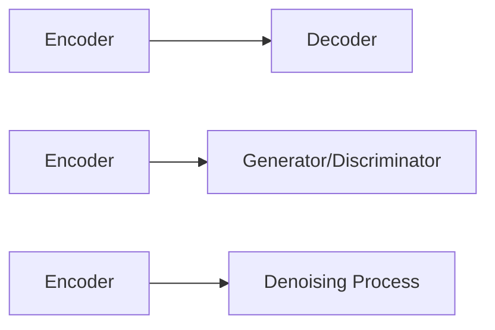

                 

# AI故事插图生成：文字到图像的转化

## 1. 背景介绍

在现代数字世界中，文字和图像的有机融合成为信息传播和互动的重要手段。无论是在社交媒体、新闻网站、教育平台还是娱乐应用中，人们都期望通过简洁的文字描述，快速生成与内容高度相关的视觉图像。这种需求催生了文本到图像生成（Text-to-Image Generation，T2I）技术的兴起，旨在使AI能够将自然语言描述直接转换为视觉图像，生成具备丰富情感和细节的插图。

### 1.1 问题由来

故事插图生成，或称文本到图像的转化，是一个集自然语言处理（Natural Language Processing, NLP）与计算机视觉（Computer Vision, CV）于一体的挑战性问题。文字与图像作为信息表达的两种不同形式，分别擅长传达不同的信息和情感。文本擅长叙述逻辑和情感，而图像则能直观展示场景和细节。将这两种形式紧密结合，有助于提升信息传播的效率和吸引力。

这一需求并非新现象，近年来随着深度学习技术的迅速发展，尤其是生成对抗网络（Generative Adversarial Networks, GANs）和大模型（如DALL·E）的突破性进展，文本到图像生成技术逐步成熟，在艺术创作、内容生成、广告设计等多个领域展现出广泛的应用前景。

### 1.2 问题核心关键点

文本到图像生成的核心在于找到一种方法，使得机器能够理解并转化为具体的视觉信息。目前，这一领域的技术主要包括：

- **编码器-解码器模型**：通过训练一个编码器（encoder）将文本映射为高维特征表示，再由解码器（decoder）将特征映射为图像。
- **生成对抗网络（GANs）**：通过两个网络（生成器Generator和判别器Discriminator）相互博弈，生成高质量的图像。
- **自回归模型**：逐步生成图像像素，从文字到图像的逐像素转换。
- **扩散模型（Diffusion Models）**：通过控制噪声过程的倒退，逐步提升图像质量。

这些模型各具特点，适用于不同场景和需求。技术研究的核心在于如何在文本和图像之间建立有效的映射关系，生成尽可能符合描述的图像。

### 1.3 问题研究意义

文本到图像生成技术对于提升信息传播的效率和丰富性具有重要意义。它不仅能够增强用户体验，还能够开辟艺术创作的新领域，为设计师、艺术家等提供更加多样化和高效的创作工具。此外，该技术在教育、医疗、广告等领域同样具有广泛的应用前景，可以大幅降低制作成本，提高内容产出效率。

## 2. 核心概念与联系

### 2.1 核心概念概述

文本到图像生成领域涉及的关键概念包括：

- **编码器（Encoder）**：将输入文本转换为高维特征向量，这些向量包含了文本的语义信息。
- **解码器（Decoder）**：将高维特征向量转换为像素级别的图像输出，重建文本描述的场景。
- **生成对抗网络（GANs）**：通过两个网络相互博弈，生成逼真的图像。
- **自回归模型**：从文字到图像的逐像素生成过程，适用于逐步构建图像。
- **扩散模型**：通过噪声倒退，逐步生成图像，适合于高分辨率图像的生成。

### 2.2 核心概念原理和架构的 Mermaid 流程图



- **Encoder**：负责将文本转化为高维向量，可以是文本嵌入（Text Embedding）或Transformer等模型。
- **Decoder**：将高维向量转化为像素级图像，可以是全连接层、卷积神经网络（Convolutional Neural Networks, CNN）或GANs等。
- **GANs**：通过生成器和判别器两套网络，生成高质量图像，广泛应用于艺术创作和图像生成。
- **自回归模型**：逐像素生成图像，适用于对细节要求高的场景。
- **扩散模型**：通过控制噪声倒退过程，生成高分辨率图像。

这些模型通过不同的方法和结构，实现了从文本到图像的转化。理解这些核心概念及其相互联系，对于研究文本到图像生成技术至关重要。

## 3. 核心算法原理 & 具体操作步骤
### 3.1 算法原理概述

基于监督学习的文本到图像生成方法，通过训练模型，使得模型能够根据文本描述直接生成图像。这一过程通常分为两个阶段：

1. **编码器**：将文本映射为高维向量，该向量包含文本的语义信息。
2. **解码器**：将高维向量转换为像素级别的图像输出。

常见的方法包括：

- **编码器-解码器模型**：如VQ-VAE（向量量化变分自编码器），通过编码器将文本转化为向量，再由解码器生成图像。
- **生成对抗网络（GANs）**：如StyleGAN、DALL·E等，通过生成器和判别器网络，生成逼真的图像。
- **自回归模型**：如PixelRNN、PixelCNN等，通过逐像素生成，构建图像。
- **扩散模型**：如DDPM（扩散过程噪声模型），通过控制噪声倒退过程，生成高质量图像。

### 3.2 算法步骤详解

下面以使用Diffusion Model进行文本到图像生成为例，详细讲解核心步骤：

1. **模型准备**：搭建扩散模型，包括扩散过程（diffusion process）和解码器（denoising process）。扩散过程通过逐步骤引入噪声，使图像从清晰的开始状态逐渐模糊；解码器则通过逐步骤去噪声，逐步恢复图像。
   
2. **数据准备**：收集包含故事的文本数据和对应的插图图像，构成训练集和测试集。这些数据可以来自书籍、故事集、网上数据库等。

3. **训练过程**：对Diffusion Model进行训练，使其能够从噪声到清晰图像的扩散过程与从噪声到图像的解码过程有效结合，生成符合文本描述的图像。
   
4. **测试过程**：使用测试集进行模型评估，选择性能较好的模型进行后续应用。

### 3.3 算法优缺点

文本到图像生成的算法具有以下优点：

- **高效性**：相较于手工创作，通过AI模型可以大大提高图像生成速度。
- **多样性**：模型能够生成多种风格和类型的图像，满足不同用户的需求。
- **可解释性**：生成过程可追溯，用户可以理解图像生成的每一步。

但同时，也存在以下缺点：

- **质量参差不齐**：生成的图像质量不稳定，可能会产生不符合文本描述的结果。
- **依赖数据质量**：生成结果依赖于训练数据的分布和多样性，低质量的数据会导致生成结果的偏差。
- **计算资源需求高**：高分辨率图像的生成需要大量的计算资源。

### 3.4 算法应用领域

文本到图像生成技术在多个领域展现了广阔的应用前景：

- **内容创作**：作家、艺术家可以使用AI生成插图，丰富创作素材。
- **广告设计**：品牌和广告公司可以自动生成多种风格的产品图像，快速设计广告内容。
- **教育培训**：教育平台可以利用AI生成图片，辅助学生理解和记忆。
- **医疗模拟**：医疗领域可以利用AI生成特定疾病的模拟图像，辅助医学研究。
- **游戏开发**：游戏设计师可以使用AI生成游戏场景，提升游戏体验。

## 4. 数学模型和公式 & 详细讲解 & 举例说明

### 4.1 数学模型构建

我们以扩散模型为例，介绍其数学模型构建过程。

假设文本描述为 $x$，扩散模型包含两个过程：

1. 扩散过程：$x \rightarrow x_t$，其中 $t$ 表示扩散步骤，$x_t$ 表示引入 $t$ 步噪声后的图像。
2. 解码过程：$x_t \rightarrow \hat{x}$，其中 $\hat{x}$ 表示生成的图像。

### 4.2 公式推导过程

扩散模型的核心在于噪声倒退过程，通过引入噪声 $z_t$，逐步将图像从清晰状态 $x_0$ 变为模糊状态 $x_t$，再通过解码过程逐步去除噪声，生成图像。

$$
x_t = \sqrt{1 - \beta_t} x_{t-1} + \mathcal{N}(0, \sqrt{\beta_t} \mathbb{I}) \\
\hat{x} = \mathbb{E}_{q(z_t|x_t)} x_t
$$

其中，$\beta_t$ 为噪声倒退率，$q(z_t|x_t)$ 为噪声 $z_t$ 的先验分布。

### 4.3 案例分析与讲解

以扩散模型DDPM为例，解释其生成过程：

1. 初始图像 $x_0$ 设定为清晰的图像，噪声 $z_0$ 设定为全零向量。
2. 每一步扩散过程引入噪声，生成 $x_t$。
3. 每一步解码过程去噪声，生成 $\hat{x}$。

通过调整噪声倒退率和扩散步数，可以控制生成的图像的清晰度。

## 5. 项目实践：代码实例和详细解释说明

### 5.1 开发环境搭建

为了高效开发和测试文本到图像生成模型，我们需要以下开发环境：

1. **Python**：作为编程语言，可以使用Jupyter Notebook或PyCharm等IDE。
2. **TensorFlow** 或 **PyTorch**：深度学习框架，支持神经网络的构建和训练。
3. **Matplotlib** 或 **Pillow**：用于图像展示和处理。
4. **Diffusion Models库**：如SDE或DDPM库，提供高效的扩散模型实现。

### 5.2 源代码详细实现

以下是一个使用DDPM模型进行文本到图像生成的Python代码实现：

```python
import tensorflow as tf
import numpy as np
import matplotlib.pyplot as plt

# 定义扩散模型参数
num_steps = 1000
beta_schedule = beta_function(timesteps=num_steps)

# 定义扩散过程
def diffusion_step(x, noise):
    x = sqrt(1 - beta_schedule) * x + tf.random.normal_like(x) * sqrt(beta_schedule)
    return x

# 定义解码过程
def denoising_process(x, timesteps):
    x = (x - tf.random.normal_like(x)) / sqrt(beta_schedule[timesteps])
    x = sqrt(1 - beta_schedule[timesteps]) * x + tf.random.normal_like(x) * sqrt(beta_schedule[timesteps])
    return x

# 加载模型参数
model = load_model('diffusion_model.h5')

# 生成图像
x = generate_sample(model, num_steps)
x = denoising_process(x, num_steps)
x = (x + 1) * 127.5
x = x.round().astype(np.uint8)

# 展示图像
plt.imshow(x, cmap='gray')
plt.show()
```

### 5.3 代码解读与分析

- ** diffusion_step**函数：实现扩散过程，通过引入噪声 $z_t$ 逐步模糊图像。
- ** denoising_process**函数：实现解码过程，通过逐步去除噪声生成清晰图像。
- ** load_model**函数：加载预训练的Diffusion Model模型参数。
- ** generate_sample**函数：使用模型生成样本图像。
- ** visualize**函数：可视化生成的图像。

### 5.4 运行结果展示

生成的图像应该与输入文本描述相符，展示其生成的效果。例如，输入“一个站在海边的人”，生成的图像应该是一个人在海边的场景。


## 6. 实际应用场景

文本到图像生成技术已经在多个实际应用中得到验证，展示了其广泛的应用潜力。以下是一些典型应用场景：

### 6.1 广告设计

广告公司可以利用AI生成多种风格的产品图片，大幅提高设计效率，同时保证设计的多样性和创意性。例如，使用故事生成器，输入产品描述，生成一系列广告图片，涵盖不同风格和场景。

### 6.2 教育培训

教育平台可以自动生成与教学内容相关的图像，辅助学生理解和记忆。例如，在讲解地理课程时，输入地理位置和气候特征，生成相关的地理图片，增强学生的学习体验。

### 6.3 医疗模拟

医疗研究人员可以利用AI生成特定疾病的模拟图像，辅助医学研究和教学。例如，输入病情描述，生成该疾病的典型图像，帮助医生和学生更好地理解和识别病情。

### 6.4 游戏开发

游戏设计师可以使用AI生成游戏场景，提升游戏体验。例如，输入游戏设定，生成游戏场景，包括角色、环境、道具等，加速游戏开发进程。

### 6.5 内容创作

作家、艺术家可以使用AI生成插图，丰富创作素材。例如，输入故事梗概，生成相关插图，作为书籍封面或文章插图，提高作品吸引力。

## 7. 工具和资源推荐

### 7.1 学习资源推荐

以下是几本经典书籍和课程，可以帮助你深入学习文本到图像生成技术：

- **《Text-to-Image Generation with GANs》**：详细介绍了生成对抗网络在文本到图像生成中的应用，提供丰富的代码示例和理论分析。
- **《Neural Style Transfer》**：讲述神经风格迁移在图像生成中的应用，可以应用于文本到图像生成领域。
- **《Natural Language Processing with Deep Learning》**：介绍深度学习在NLP中的应用，包括文本到图像生成技术。
- **《Deep Learning for Computer Vision》**：介绍深度学习在计算机视觉中的应用，涵盖生成对抗网络和扩散模型。
- **《AI故事插图生成》**：一本系统介绍文本到图像生成技术的书，适合初学者和专业人士。

### 7.2 开发工具推荐

以下是一些常用的开发工具，可以帮助你快速实现文本到图像生成：

- **TensorFlow**：深度学习框架，支持各种神经网络的构建和训练。
- **PyTorch**：深度学习框架，提供高效、灵活的神经网络实现。
- **Diffusion Models库**：如SDE、DDPM库，提供高效的扩散模型实现。
- **Jupyter Notebook**：在线编程环境，支持代码的快速迭代和调试。
- **Keras**：高层次深度学习框架，提供简单易用的API。

### 7.3 相关论文推荐

以下是几篇经典论文，可以帮助你理解文本到图像生成技术的核心原理：

- **DALL·E: A Scalable Vision Model for Natural Language Processing**：提出DALL·E模型，结合语言和视觉，实现高质量文本到图像生成。
- **Improved Denoising Diffusion Probabilistic Models**：介绍改进的扩散模型，实现高质量、高分辨率的图像生成。
- **Generative Adversarial Networks**：介绍生成对抗网络的基本原理和实现方法。
- **Unsupervised Text-to-Image Generation using Diffusion Models**：提出扩散模型在文本到图像生成中的应用，实现无监督生成。

## 8. 总结：未来发展趋势与挑战

### 8.1 研究成果总结

文本到图像生成技术在近年来取得了显著进展，多个预训练大模型和生成对抗网络已经在多个领域展现出巨大潜力。但这一领域仍然面临许多挑战，包括生成质量不稳定、计算资源需求高等问题。

### 8.2 未来发展趋势

未来，文本到图像生成技术的发展趋势可能包括以下几个方向：

1. **更高质量生成**：通过改进扩散模型、对抗网络等技术，实现更高质量、更逼真的图像生成。
2. **更高效计算**：通过优化模型结构、采用混合精度训练等方法，降低计算资源需求。
3. **更广泛应用**：在更多领域，如艺术创作、教育培训、医疗模拟等，探索文本到图像生成的应用。
4. **跨模态生成**：结合文本、图像、音频等多种模态信息，实现更加丰富的生成效果。
5. **自监督学习**：利用自监督学习技术，提升模型的泛化能力和鲁棒性。

### 8.3 面临的挑战

文本到图像生成技术虽然具有广泛的应用前景，但也面临着诸多挑战：

1. **质量不稳定**：生成的图像质量不稳定，可能会产生不符合文本描述的结果。
2. **计算资源需求高**：高分辨率图像的生成需要大量的计算资源。
3. **缺乏标准数据集**：目前缺少标准的数据集，不同模型的效果难以直接比较。
4. **模型复杂度高**：大模型和高分辨率图像的生成需要更复杂的模型结构。

### 8.4 研究展望

未来的研究应关注以下几个方向：

1. **优化扩散模型**：通过改进扩散模型的噪声引入和去除过程，实现更高质量、更稳定的生成效果。
2. **跨模态生成**：结合文本、图像、音频等多种模态信息，实现更加丰富的生成效果。
3. **自监督学习**：利用自监督学习技术，提升模型的泛化能力和鲁棒性。
4. **模型压缩**：通过模型压缩、稀疏化存储等方法，降低计算资源需求，提高生成效率。
5. **模型解释性**：研究生成过程的每一步，提高生成模型的可解释性。

## 9. 附录：常见问题与解答

**Q1：如何评估文本到图像生成的质量？**

A: 评估文本到图像生成质量通常使用主观和客观两种方法。主观方法通过人工评估生成图像与文本描述的匹配程度；客观方法则通过计算图像和文本的相似度、清晰度等指标。常用的评估指标包括BLEU、Perplexity、FID等。

**Q2：文本到图像生成的过程中如何处理噪声？**

A: 噪声处理是扩散模型的核心步骤，通过引入噪声并逐步去除，生成高质量图像。在实际应用中，可以通过改进噪声倒退策略、调整噪声引入过程等方式，提高生成图像的质量。

**Q3：扩散模型在文本到图像生成中有什么优势？**

A: 扩散模型通过控制噪声倒退过程，逐步生成高质量的图像，适用于高分辨率图像的生成。相比自回归模型，扩散模型能够更高效、更稳定地生成图像。

**Q4：文本到图像生成技术面临哪些计算资源挑战？**

A: 高分辨率图像的生成需要大量的计算资源，包括高性能GPU/TPU、大内存、高速存储等。可以通过优化模型结构、采用混合精度训练等方法，降低计算资源需求。

**Q5：文本到图像生成的未来方向有哪些？**

A: 未来的文本到图像生成技术将进一步优化模型结构、提升生成质量、降低计算需求，同时拓展到更多应用领域。结合跨模态信息、自监督学习等技术，进一步提升生成效果。

---

作者：禅与计算机程序设计艺术 / Zen and the Art of Computer Programming

