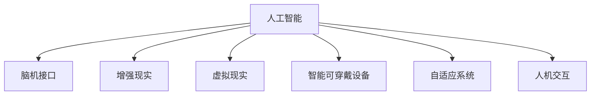

                 

# AI时代的人类增强：身体增强与认知增强

> 关键词：人工智能, 身体增强, 认知增强, 脑机接口, 增强现实, 机器人, 自适应系统, 人机交互, 人类可穿戴设备

## 1. 背景介绍

随着科技的飞速发展，人工智能(AI)技术正迅速改变着我们的生活和工作方式。从智能家居到自动驾驶，从医疗诊断到金融交易，AI的应用无处不在。然而，AI技术带来的变化，并不止步于这些物理世界的变革，它同样在深刻影响着人类的身体和认知。

### 1.1 背景的历史回顾

人工智能与人类增强的结合，并非新鲜事物。早在20世纪60年代，人们就通过机械臂和计算机辅助设计(CAD)等技术，实现了对人类手臂和眼睛的增强。这些早期的技术，奠定了现代人工智能增强的基石。

随着神经科学和计算机科学的发展，人类增强进入了新的阶段。脑机接口(Brain-Computer Interface, BCI)的诞生，使得人类可以直接将大脑信号转化为计算机指令。同时，增强现实(Augmented Reality, AR)、虚拟现实(Virtual Reality, VR)等技术的进步，更是将人类对身体的感知和认知推向了新的高度。

进入21世纪，随着深度学习和计算机视觉技术的成熟，AI对人类增强的应用变得更加广泛和深入。智能可穿戴设备、自适应系统、机器人等技术的突破，不仅极大地提升了人类的生产力和生活质量，也引发了对人类增强技术伦理、安全和社会影响的广泛讨论。

## 2. 核心概念与联系

### 2.1 核心概念概述

为了更好地理解AI时代的人类增强，我们首先介绍几个核心概念：

- **人工智能(AI)**：指通过计算机程序模拟人类智能行为的技术，包括机器学习、深度学习、自然语言处理、计算机视觉等领域。

- **脑机接口(BCI)**：通过读取和解码大脑信号，实现人脑与计算机之间的直接通信。BCI技术可以实现人类的思维直接转化为计算机指令，进而控制外设或执行计算任务。

- **增强现实(AR)和虚拟现实(VR)**：通过在现实世界叠加虚拟信息或完全重构现实环境，增强或改变人类对环境的感知和互动。

- **智能可穿戴设备**：集成了AI和传感器技术的设备，如智能眼镜、智能手表等，可以实时监测、记录和响应人类生理和行为数据。

- **自适应系统**：能够根据用户的行为和环境变化，自动调整其功能和表现的系统。自适应系统包括智能家居、自适应学习、自适应医疗等。

- **人机交互(Human-Computer Interaction, HCI)**：研究如何通过自然、直观的方式，让人类与计算机进行有效沟通的技术。

这些概念之间的逻辑关系可以通过以下Mermaid流程图来展示：



这个流程图展示了人工智能技术通过多种方式增强人类的身体和认知：

1. 通过脑机接口，将人类大脑的信号转化为计算机指令，实现对身体的直接控制。
2. 通过增强现实和虚拟现实，扩展或改变人类对现实环境的感知。
3. 通过智能可穿戴设备，实时监测和干预人类的生理和行为状态。
4. 通过自适应系统，根据环境和用户行为自动调整功能。
5. 通过人机交互技术，提升人类与计算机沟通的自然性和效率。

## 3. 核心算法原理 & 具体操作步骤

### 3.1 算法原理概述

AI时代的人类增强，涉及到多个领域的交叉技术，包括神经科学、计算机科学、生物工程等。其核心算法原理主要包括以下几个方面：

- **数据采集与预处理**：使用传感器、摄像头等设备，采集人类生理和行为数据，并进行预处理，如滤波、降噪等，以确保数据的准确性和可靠性。
- **信号解码与模式识别**：通过机器学习算法，将采集的数据转化为可识别的模式，如脑电信号的特征提取、行为数据的分类等。
- **模型训练与优化**：使用深度学习等算法，训练模型以适应特定任务，并通过优化算法（如梯度下降）不断提升模型性能。
- **人机交互与自适应**：设计自然、高效的人机交互界面，使人类能够方便地与AI系统进行沟通，同时使系统能够根据环境和用户行为自动调整其行为。

### 3.2 算法步骤详解

以下是一个基于脑机接口的增强系统的算法步骤：

1. **数据采集与预处理**：
   - 使用脑电图(EEG)、功能性磁共振成像(fMRI)等设备，采集人类大脑的电信号或血氧信号。
   - 使用预处理算法，如数字滤波、时域滤波、频域滤波等，去除噪声和干扰，增强信号质量。

2. **信号解码与模式识别**：
   - 使用深度学习算法（如卷积神经网络CNN、循环神经网络RNN、长短期记忆网络LSTM等），对采集的信号进行特征提取和模式识别。
   - 训练模型以识别不同的运动意图或指令，如“向左移动”、“拾取物体”等。

3. **模型训练与优化**：
   - 使用大量标注数据，训练模型以适应不同的运动任务。
   - 通过优化算法（如梯度下降、Adam优化器等），不断调整模型参数，提升模型准确性。
   - 进行交叉验证，确保模型在不同数据集上的泛化性能。

4. **人机交互与自适应**：
   - 设计直观、自然的人机交互界面，如可穿戴设备上的触觉反馈、语音指令等，增强用户体验。
   - 使用自适应算法（如强化学习、自适应控制算法等），根据用户的反馈和环境变化，自动调整系统行为。

### 3.3 算法优缺点

人类增强技术虽然带来了诸多便利，但也存在一些局限和挑战：

**优点**：
- **提升效率**：通过增强现实和虚拟现实，显著提升学习和工作效率。
- **增强健康**：智能可穿戴设备可以实时监测健康状况，及时预警健康问题。
- **提升生活质量**：通过自适应系统和人机交互，提升生活质量，减少繁琐操作。

**缺点**：
- **数据隐私**：采集的大量数据可能涉及隐私问题，需采取严格的数据保护措施。
- **技术门槛高**：实施这些技术需要较高的技术门槛，需要专业知识和技能。
- **伦理挑战**：增强技术可能带来伦理和社会问题，如人类依赖、隐私泄露等。

### 3.4 算法应用领域

人类增强技术在多个领域得到了广泛应用：

- **医疗领域**：通过脑机接口，帮助瘫痪患者进行辅助运动，通过可穿戴设备实时监测健康状况。
- **教育领域**：使用增强现实和虚拟现实，提升教学效果，通过自适应学习系统，个性化教育。
- **娱乐领域**：通过智能可穿戴设备和虚拟现实技术，提供沉浸式游戏体验。
- **军事领域**：使用增强现实和自适应系统，提升士兵的作战能力和决策效率。
- **工业领域**：通过智能可穿戴设备和自适应系统，提升工人的生产效率和工作安全性。

## 4. 数学模型和公式 & 详细讲解 & 举例说明

### 4.1 数学模型构建

以脑电信号为例，构建人类增强的数学模型。假设采集到的脑电信号为 $x_t = [x_{t,1}, x_{t,2}, ..., x_{t,N}]$，其中 $N$ 为时间步数。我们希望模型能够根据信号特征 $x_t$，预测用户的操作指令 $y_t$。

一个简单的预测模型可以表示为：
$$
y_t = f(x_t; \theta)
$$
其中 $f$ 为模型函数，$\theta$ 为模型参数。

### 4.2 公式推导过程

为了构建具体的预测模型，我们需要对脑电信号进行特征提取和分类。假设我们使用卷积神经网络(CNN)对信号进行特征提取，模型结构如下：
$$
y_t = \text{CNN}(x_t; \theta_{\text{CNN}}) + \text{RNN}(y_{t-1}; \theta_{\text{RNN}})
$$
其中，$\theta_{\text{CNN}}$ 为卷积神经网络的参数，$\theta_{\text{RNN}}$ 为循环神经网络的参数。

### 4.3 案例分析与讲解

以一个简单的脑电信号分类为例，假设我们希望根据脑电信号判断用户是否正在执行“拾取物体”的操作。我们可以使用以下步骤：

1. 使用CNN对脑电信号进行特征提取：
$$
x_t^{\text{features}} = \text{CNN}(x_t; \theta_{\text{CNN}})
$$

2. 将提取的特征输入RNN进行分类：
$$
y_t = \text{RNN}(x_t^{\text{features}}; \theta_{\text{RNN}})
$$

3. 通过交叉熵损失函数计算预测误差：
$$
\mathcal{L}(y_t, \hat{y_t}) = -(y_t \log \hat{y_t} + (1 - y_t) \log(1 - \hat{y_t}))
$$

4. 使用优化算法（如Adam优化器），更新模型参数以最小化损失函数。

## 5. 项目实践：代码实例和详细解释说明

### 5.1 开发环境搭建

要进行人类增强技术的项目实践，首先需要搭建好开发环境。以下是基于Python的开发环境配置流程：

1. 安装Anaconda：从官网下载并安装Anaconda，用于创建独立的Python环境。
```bash
conda create -n brain-enhancement python=3.8 
conda activate brain-enhancement
```

2. 安装必要的库：
```bash
pip install numpy pandas sklearn torch torchvision
```

3. 安装开源项目：
```bash
pip install pynwb pyrcgkit
```

### 5.2 源代码详细实现

以下是一个基于脑电信号分类的Python代码示例，使用PyTorch实现：

```python
import torch
import torch.nn as nn
import torch.optim as optim

class CNN(nn.Module):
    def __init__(self, input_dim):
        super(CNN, self).__init__()
        self.conv1 = nn.Conv2d(1, 32, 3)
        self.pool = nn.MaxPool2d(2)
        self.conv2 = nn.Conv2d(32, 64, 3)
        self.fc1 = nn.Linear(64 * 8 * 8, 128)
        self.fc2 = nn.Linear(128, 2)

    def forward(self, x):
        x = torch.relu(self.conv1(x))
        x = self.pool(x)
        x = torch.relu(self.conv2(x))
        x = self.pool(x)
        x = x.view(-1, 64 * 8 * 8)
        x = torch.relu(self.fc1(x))
        x = self.fc2(x)
        return x

class RNN(nn.Module):
    def __init__(self, input_dim):
        super(RNN, self).__init__()
        self.rnn = nn.RNN(input_dim, 64, 1, batch_first=True)
        self.fc = nn.Linear(64, 2)

    def forward(self, x):
        _, output, _ = self.rnn(x)
        x = self.fc(output)
        return x

def train_model(model, train_data, valid_data, batch_size, num_epochs):
    optimizer = optim.Adam(model.parameters(), lr=0.001)
    criterion = nn.CrossEntropyLoss()
    for epoch in range(num_epochs):
        model.train()
        for i, (inputs, targets) in enumerate(train_data):
            inputs, targets = inputs.to(device), targets.to(device)
            optimizer.zero_grad()
            outputs = model(inputs)
            loss = criterion(outputs, targets)
            loss.backward()
            optimizer.step()
        model.eval()
        with torch.no_grad():
            valid_loss = 0
            correct = 0
            total = 0
            for inputs, targets in valid_data:
                inputs, targets = inputs.to(device), targets.to(device)
                outputs = model(inputs)
                valid_loss += criterion(outputs, targets).item()
                _, predicted = outputs.max(1)
                total += targets.size(0)
                correct += predicted.eq(targets).sum().item()
            valid_loss /= len(valid_data)
            print('Epoch [{}/{}], Valid Loss: {:.4f}, Accuracy: {:.2f}%'.format(epoch+1, num_epochs, valid_loss, 100 * correct / total))

# 数据准备
# 这里省略数据集准备部分

# 模型构建
model = CNN(1)
model = RNN(model)

# 训练模型
device = torch.device("cuda" if torch.cuda.is_available() else "cpu")
train_data = ...
valid_data = ...
train_model(model, train_data, valid_data, batch_size=32, num_epochs=10)

# 测试模型
test_data = ...
with torch.no_grad():
    test_loss = 0
    correct = 0
    total = 0
    for inputs, targets in test_data:
        inputs, targets = inputs.to(device), targets.to(device)
        outputs = model(inputs)
        test_loss += criterion(outputs, targets).item()
        _, predicted = outputs.max(1)
        total += targets.size(0)
        correct += predicted.eq(targets).sum().item()
    test_loss /= len(test_data)
    print('Test Loss: {:.4f}, Accuracy: {:.2f}%'.format(test_loss, 100 * correct / total))
```

### 5.3 代码解读与分析

以下是代码的关键解释：

1. **CNN模型**：定义了两个卷积层和两个全连接层，用于提取脑电信号特征。
2. **RNN模型**：使用一个RNN层，对提取的特征进行分类。
3. **训练函数**：使用Adam优化器进行模型训练，交叉熵损失函数计算预测误差。
4. **数据准备**：这里省略了数据集的具体准备，实际应用中需要根据具体任务加载和预处理数据。
5. **模型测试**：在测试集上评估模型性能，输出测试损失和准确率。

## 6. 实际应用场景

### 6.1 智能可穿戴设备

智能可穿戴设备在医疗、健身、娱乐等领域得到了广泛应用。通过这些设备，可以实时监测用户的生理和行为数据，并根据数据分析结果，提供个性化的健康建议和生活指导。

**应用场景**：
- **健身追踪器**：如Apple Watch、Fitbit等，监测用户的心率、步数、睡眠质量等数据，提供运动建议和健康提示。
- **健康监测器**：如智能手表、智能眼镜，实时监测用户的血糖、血压、心率等生理指标，预警健康风险。

**案例分析**：
- **心率监测**：智能可穿戴设备通过监测用户的心率，及时发现异常心跳，提醒用户休息或就医。
- **睡眠追踪**：智能眼镜通过分析用户的睡眠模式，提供改善睡眠质量的建议，帮助用户养成良好的作息习惯。

### 6.2 增强现实和虚拟现实

增强现实和虚拟现实技术，通过在现实世界叠加虚拟信息，或完全重构现实环境，极大地改变了人类对世界的感知方式。

**应用场景**：
- **医疗培训**：使用虚拟现实技术，模拟手术过程，帮助医学生进行精准的手术训练。
- **军事模拟**：通过增强现实技术，模拟战场环境，训练士兵的战术和决策能力。
- **工业培训**：在虚拟现实中，模拟复杂的操作流程，提高工人的培训效果和安全性。

**案例分析**：
- **虚拟手术室**：虚拟现实技术可以模拟真实的手术环境，医学生可以在虚拟环境中进行多次操作，提升手术技能。
- **军事模拟训练**：增强现实技术可以模拟真实的战场环境，士兵可以在虚拟世界中进行战术演练，提升实战能力。

### 6.3 脑机接口

脑机接口技术，通过读取大脑信号，实现人脑与计算机之间的直接通信，为人类增强提供了新的途径。

**应用场景**：
- **辅助运动**：帮助瘫痪患者通过脑电信号控制机械臂或轮椅，进行自主运动。
- **脑控游戏**：使用脑电信号控制虚拟游戏中的角色或物品，提供沉浸式游戏体验。
- **神经反馈训练**：通过脑机接口，训练用户进行特定的思维活动，如注意力集中、冥想等。

**案例分析**：
- **脑控轮椅**：通过脑电信号控制轮椅，帮助瘫痪患者自主移动，提升生活质量。
- **脑控游戏**：通过脑电信号控制游戏中的虚拟角色，增强游戏体验的沉浸感和互动性。

## 7. 工具和资源推荐

### 7.1 学习资源推荐

为了系统掌握人类增强技术，以下是一些优秀的学习资源：

1. **《神经科学原理》**：一本介绍神经科学基本原理的经典教材，帮助你理解人类大脑的工作机制。
2. **《深度学习》**：斯坦福大学Andrew Ng教授的深度学习课程，涵盖深度学习的基础理论和实践应用。
3. **《增强现实与虚拟现实技术》**：介绍增强现实和虚拟现实技术的原理和应用场景。
4. **《脑机接口技术》**：一本介绍脑机接口技术的原理和应用的书，帮助你了解最新的研究成果。

### 7.2 开发工具推荐

以下是一些常用的开发工具，用于实现人类增强技术：

1. **PyTorch**：基于Python的开源深度学习框架，支持多种神经网络模型的实现。
2. **TensorFlow**：由Google开发的深度学习框架，支持大规模模型训练和分布式计算。
3. **OpenCV**：开源计算机视觉库，用于图像处理和计算机视觉任务。
4. **Pygame**：用于游戏开发的Python库，支持虚拟现实和增强现实应用。

### 7.3 相关论文推荐

以下是一些具有代表性的研究论文，推荐阅读：

1. **《深度学习在医疗中的应用》**：介绍深度学习在医疗诊断、影像处理、基因组学等领域的应用。
2. **《增强现实与虚拟现实技术综述》**：综述增强现实和虚拟现实技术的发展历程和应用场景。
3. **《脑机接口技术综述》**：综述脑机接口技术的研究进展和未来方向。

## 8. 总结：未来发展趋势与挑战

### 8.1 总结

本文对AI时代的人类增强技术进行了全面的介绍，包括身体增强和认知增强两大方面。通过脑机接口、增强现实、虚拟现实、智能可穿戴设备等技术，显著提升了人类的生产力和生活质量。这些技术在医疗、教育、娱乐、军事等领域得到了广泛应用，展现出巨大的潜力和前景。

### 8.2 未来发展趋势

未来，人类增强技术将在多个领域进一步发展和应用：

1. **神经科学的进步**：随着神经科学技术的进步，脑机接口技术将更加精确，可以实现更高维度的信息传输。
2. **智能系统的提升**：通过深度学习和自然语言处理技术，智能系统的决策能力和交互能力将大幅提升。
3. **跨领域融合**：人类增强技术将与其他人工智能技术进行更深入的融合，如知识表示、因果推理、强化学习等，共同推动技术进步。
4. **伦理和社会问题的解决**：随着技术的普及，如何解决伦理和社会问题，将是未来的重要课题。

### 8.3 面临的挑战

尽管人类增强技术前景广阔，但也面临一些挑战：

1. **数据隐私和安全**：采集和处理大量用户数据，可能涉及隐私和数据安全问题，需要采取严格的数据保护措施。
2. **技术瓶颈**：实现高精度和高可靠性的增强技术，需要突破当前技术瓶颈，提升信号解码和模式识别的准确性。
3. **伦理和社会影响**：增强技术可能带来伦理和社会问题，如人类依赖、隐私泄露等，需进行严格监管和引导。

### 8.4 研究展望

未来，人类增强技术的研究将更加注重伦理、安全和实际应用，具体方向包括：

1. **隐私保护**：开发隐私保护技术，如差分隐私、联邦学习等，保护用户数据隐私。
2. **技术创新**：研究新的增强技术，如基于神经形态工程、光子计算等的增强技术，提升技术性能。
3. **伦理研究**：研究增强技术的伦理和社会影响，制定相关的政策和规范，指导技术的健康发展。

总之，人类增强技术在AI时代将发挥重要作用，但同时也面临着诸多挑战。通过持续的研究和创新，我们有望克服这些挑战，将人类增强技术推向新的高度。

## 9. 附录：常见问题与解答

**Q1：人类增强技术是否存在伦理和社会问题？**

A: 是的，人类增强技术可能带来伦理和社会问题，如人类依赖、隐私泄露等。需要制定相应的政策和技术措施，确保技术的健康发展。

**Q2：人类增强技术是否适合所有人？**

A: 人类增强技术虽然在很多方面提升了人类的能力，但也存在一些限制。如老年人、儿童等群体可能难以适应这些技术，需要针对不同群体进行适当的技术适配。

**Q3：人类增强技术是否会取代人类？**

A: 目前来看，人类增强技术更多地是提升人类的能力，而不是取代人类。在需要人类智慧和经验的任务中，增强技术将发挥重要作用，提升人类工作效率和决策质量。

**Q4：人类增强技术是否需要严格的监管？**

A: 是的，人类增强技术涉及用户的隐私和数据安全，需要严格的监管和法律保障。同时，技术的发展也需遵循伦理和社会规范，避免可能带来的负面影响。

总之，人类增强技术在AI时代将发挥重要作用，但同时也面临诸多挑战。通过持续的研究和创新，我们有望克服这些挑战，将人类增强技术推向新的高度。

---

作者：禅与计算机程序设计艺术 / Zen and the Art of Computer Programming

