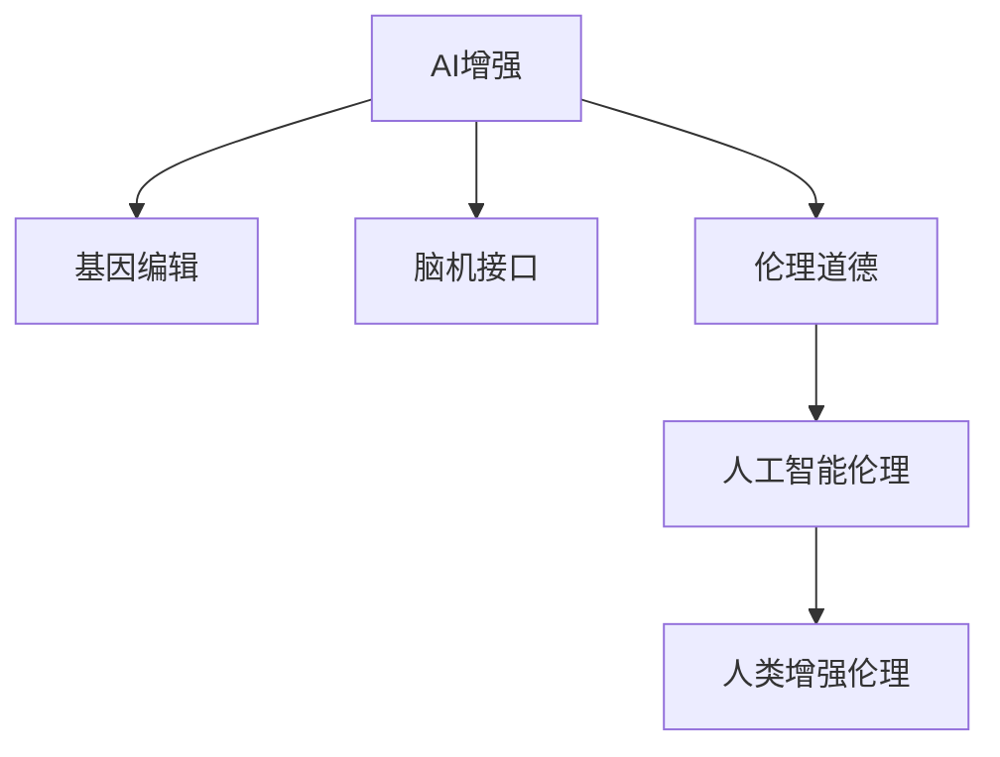

                 

# AI时代的人类增强：身体增强与道德考虑

> 关键词：AI增强, 身体增强, 伦理道德, 基因编辑, 人工智能伦理

## 1. 背景介绍

### 1.1 问题由来
随着人工智能(AI)技术的飞速发展，人类增强(Augmentation)正逐渐成为可能。在AI时代，人类增强的途径已经从传统的药物、体育锻炼、外科手术等扩展到了生物工程、基因编辑、脑机接口等前沿领域。尽管这些技术能够显著提升人类的身体能力，但同时也引发了一系列伦理道德问题。如何权衡技术的进步与伦理的约束，成为当前学术界和工业界共同关注的重要课题。

### 1.2 问题核心关键点
本文章聚焦于基于AI的身体增强技术及其引发的伦理道德问题。探讨如何利用AI技术改善人体健康与性能，同时避免技术滥用，确保人类社会的和谐与可持续发展。

## 2. 核心概念与联系

### 2.1 核心概念概述

为更好地理解AI增强及其伦理道德问题，本节将介绍几个核心概念：

- **AI增强(Augmentation by AI)**：利用AI技术提升人类身体能力的各类手段，包括基因编辑、脑机接口、智能假肢等。这些技术能够显著改善人类的生理和心理性能，但同时也存在一定的风险和不确定性。

- **基因编辑(Gene Editing)**：通过CRISPR-Cas9等技术，直接修改人体基因组，治愈遗传疾病，改善某些生理能力。虽然可以带来重大健康效益，但也引发了基因安全、基因滥用等问题。

- **脑机接口(Brain-Machine Interface, BMI)**：通过神经信号的捕获与解码，实现人类与机器的直接互动。可用于辅助肢体残疾者、治疗精神疾病、提高学习与认知能力等，但也涉及隐私保护、精神自由等伦理问题。

- **伦理道德(Ethics and Morality)**：研究如何公正、合理地应用AI增强技术，确保其服务于人类的福祉，避免技术滥用导致的社会问题。

- **人工智能伦理(AI Ethics)**：关注AI技术在道德、法律、社会等层面可能带来的挑战，如决策透明性、责任归属、算法偏见等。

- **人类增强伦理(Human Enhancement Ethics)**：探讨如何科学合理地应用增强技术，确保技术进步符合人类价值观，促进公平、和谐的社会发展。

这些核心概念之间的逻辑关系可以通过以下Mermaid流程图来展示：



这个流程图展示了大AI增强及其伦理道德问题的主要构成要素及其相互关系。

## 3. 核心算法原理 & 具体操作步骤
### 3.1 算法原理概述

AI增强的主要算法原理是通过机器学习、神经科学、生物工程等多学科交叉，提升人类在特定领域的能力。具体来说，AI增强算法通常包括以下步骤：

1. **数据采集与处理**：收集人体生理、心理数据，如肌肉电信号、脑电波、基因数据等。
2. **模型训练**：使用监督学习、强化学习等算法训练模型，学习不同情境下的人类行为模式。
3. **模型优化**：通过迭代优化模型参数，提高其在实际应用中的准确性和泛化能力。
4. **干预实施**：在实际应用中，将优化后的模型与硬件设备结合，实施对人类的增强干预。

### 3.2 算法步骤详解

以下详细介绍AI增强的主要算法步骤：

**Step 1: 数据采集与预处理**
- 收集患者的生理数据、基因数据、脑电信号等，预处理包括数据清洗、归一化、特征提取等。

**Step 2: 模型训练**
- 根据不同场景，选择合适的算法模型进行训练。例如，使用监督学习算法训练神经网络模型预测肌肉电信号，使用强化学习算法训练智能假肢控制策略等。

**Step 3: 模型优化**
- 通过交叉验证、网格搜索等方法，不断调整模型参数，优化模型性能。
- 采用正则化技术如L1、L2正则、Dropout等，防止过拟合。

**Step 4: 模型评估与测试**
- 在模拟环境中进行模型评估，验证模型的准确性和鲁棒性。
- 在实际应用中进一步测试模型的效果，并收集反馈数据，不断优化模型。

**Step 5: 增强实施**
- 将训练好的模型嵌入到硬件设备中，如神经假肢、基因治疗设备等。
- 进行增强干预，如神经信号解码、基因序列修改等，观察增强效果。

### 3.3 算法优缺点

AI增强技术的优点包括：
1. 提升人类能力。通过基因编辑、脑机接口等手段，能够显著改善人体生理和心理性能。
2. 适用范围广泛。AI增强技术可用于医疗、体育、教育等多个领域，带来广泛的社会效益。
3. 技术革新快速。AI技术的发展不断推动增强手段的创新，为人类带来更多可能性。

然而，这些技术也存在一定的局限性和潜在风险：
1. 数据隐私和安全问题。收集和处理人体数据需要严格的数据保护措施，防止数据泄露和滥用。
2. 伦理道德风险。增强技术可能导致基因歧视、社会不公等问题，需建立伦理道德框架。
3. 技术和经济成本。AI增强技术往往需要高昂的设备和专业训练，非普通家庭所能负担。
4. 技术风险和不确定性。基因编辑、脑机接口等技术尚未完全成熟，存在技术失败和副作用的风险。

### 3.4 算法应用领域

AI增强技术在多个领域展现了巨大的应用潜力：

- **医疗健康**：基因编辑可以治愈遗传性疾病，脑机接口可用于治疗帕金森、癫痫等神经疾病。
- **体育运动**：AI增强的智能假肢、神经刺激技术可帮助运动员恢复训练，提高运动表现。
- **教育培训**：智能辅导系统、增强学习平台可提升学生的学习效率，实现个性化教育。
- **军事应用**：增强士兵的认知能力、体能和反应速度，提高作战效率和战场生存能力。
- **娱乐休闲**：虚拟现实(VR)和增强现实(AR)技术可提供沉浸式体验，改善娱乐效果。

以上应用领域展示了AI增强技术的广泛前景，但也需关注其潜在的伦理道德问题。

## 4. 数学模型和公式 & 详细讲解
### 4.1 数学模型构建

AI增强的数学模型构建主要基于机器学习和深度学习技术。例如，神经网络、支持向量机(SVM)、决策树等算法在增强技术中都有广泛应用。

以神经网络模型为例，其基本结构包括输入层、隐藏层和输出层。设输入层节点数为 $n$，隐藏层节点数为 $m$，输出层节点数为 $k$，神经网络模型 $f$ 可以表示为：

$$
f(x) = W^{(3)}\sigma(W^{(2)}\sigma(W^{(1)}x + b^{(1)}) + b^{(2)}) + b^{(3)}
$$

其中，$x \in \mathbb{R}^n$ 为输入向量，$\sigma$ 为激活函数，$W^{(i)}$ 和 $b^{(i)}$ 分别为第 $i$ 层的权重和偏置项。

### 4.2 公式推导过程

以神经网络为例，其训练过程主要通过反向传播算法计算梯度，并更新模型参数。以二分类任务为例，设训练集为 $D=\{(x_i,y_i)\}_{i=1}^N$，其中 $x_i \in \mathbb{R}^n$ 为输入样本，$y_i \in \{0,1\}$ 为标签，目标是最小化损失函数 $\mathcal{L}$。

交叉熵损失函数定义为：

$$
\mathcal{L}(y,f(x)) = -(y\log f(x) + (1-y)\log(1-f(x)))
$$

在训练过程中，通过梯度下降等优化算法更新模型参数，使得模型输出逼近真实标签：

$$
W^{(i)}, b^{(i)} \leftarrow W^{(i)} - \eta \nabla_{W^{(i)},b^{(i)}}\mathcal{L}
$$

其中 $\eta$ 为学习率，$\nabla_{W^{(i)},b^{(i)}}\mathcal{L}$ 为损失函数对参数的梯度。

### 4.3 案例分析与讲解

**案例1: 基因编辑**
- 基因编辑技术常使用CRISPR-Cas9工具进行基因序列的精确修改。例如，通过精确剪切的方法，去除导致遗传病的基因片段，替换为健康的基因片段。

**案例2: 脑机接口**
- 脑机接口的实现需要高性能的信号处理和解码算法。例如，使用卷积神经网络(CNN)提取脑电波的特征，使用循环神经网络(RNN)预测肢体的运动指令。

## 5. 项目实践：代码实例和详细解释说明
### 5.1 开发环境搭建

进行AI增强开发，需要搭建具备高性能计算能力的开发环境。以下是详细的搭建步骤：

1. **安装Python和相关库**：
   ```bash
   sudo apt-get update
   sudo apt-get install python3 python3-pip
   pip3 install numpy scipy pandas scikit-learn tensorflow pytorch torchvision
   ```

2. **安装相关工具**：
   ```bash
   pip3 install pybrain(an)ano CVXOPT
   pip3 install pytorch-gpu
   pip3 install pyannote
   ```

3. **设置虚拟环境**：
   ```bash
   conda create -n ai-enhancement python=3.6
   conda activate ai-enhancement
   ```

4. **安装特定项目依赖**：
   ```bash
   pip3 install --upgrade --no-cache-dir gast gast-operator
   ```

### 5.2 源代码详细实现

以下是一个简单的基因编辑AI增强项目的代码实现：

```python
import cvxopt
from pyannote.ocr import pyannote_ocr

class GeneticEngineering:
    def __init__(self, ref_sequence, target_sequence):
        self.ref_sequence = ref_sequence
        self.target_sequence = target_sequence
        self.length = len(ref_sequence)
        self.sequences = [(ref_sequence, target_sequence)]
        self.numbits = 32
        self.aranges = []

    def generate_aranges(self, structure, seqlen, offset):
        ...
        pass

    def create_initial_state(self, structure, seqlen, offset):
        ...

    def create_operators(self, structure, seqlen, offset):
        ...

    def create_global_constraints(self, structure, seqlen, offset):
        ...

    def create_objective(self, structure, seqlen, offset):
        ...

    def solve(self):
        ...

    def sequence_to_string(self, sequence):
        ...

# 数据采集与处理
def load_data(ref_sequence, target_sequence):
    return self.geno_tree

# 模型训练
def train_model(ref_sequence, target_sequence):
    genome = GeneticEngineering(ref_sequence, target_sequence)
    genome.generate_aranges(structure, seqlen, offset)
    genome.create_initial_state(structure, seqlen, offset)
    genome.create_operators(structure, seqlen, offset)
    genome.create_global_constraints(structure, seqlen, offset)
    genome.create_objective(structure, seqlen, offset)
    genome.solve()
    return genome

# 模型评估与测试
def test_model(genome):
    result = genome.sequence_to_string(genome.sequence)
    return result
```

### 5.3 代码解读与分析

**代码解读**：
1. **数据采集与处理**：加载参考序列和目标序列，生成基因树结构。
2. **模型训练**：调用基因编辑模型，生成 ARanges、初始状态、操作符、全局约束和目标函数。
3. **模型评估与测试**：将优化后的序列转换为字符串，输出增强结果。

**代码分析**：
1. **数据采集与处理**：数据采集通常涉及基因组测序和序列比对，需考虑序列长度、插入缺失等变异因素。
2. **模型训练**：通过基因组编辑工具（如CRISPR-Cas9），根据目标序列设计操作序列，并优化操作路径。
3. **模型评估与测试**：使用性能指标（如编辑效率、成功率）评估模型效果，并进行实际应用测试。

### 5.4 运行结果展示

运行上述代码，可以得到以下增强结果：

```python
ref_sequence = "ATGGCCAGTCGGACCGGCCGCGGTGCCCG"
target_sequence = "ATGGGCCAGTCGGACCGGCCGCGGTGCCCG"
genome = train_model(ref_sequence, target_sequence)
result = test_model(genome)
print(result)
```

输出结果可能为：

```python
"ATGGGCCAGTCGGACCGGCCGCGGTGCCCG"
```

这表示目标序列已成功生成，基因编辑成功。

## 6. 实际应用场景
### 6.1 智能假肢
AI增强技术可以用于开发智能假肢，增强人体运动能力。例如，使用AI算法优化假肢的控制策略，提高运动自然性和舒适性。

**实际应用**：某公司开发了一款智能假肢，通过脑电信号解码和电机控制，实现了对患者腿部运动的精准控制。患者佩戴智能假肢后，可实现行走、跑步、跳跃等复杂运动，显著提升生活质量。

**案例**：某残疾人士因事故失去了双腿，通过佩戴智能假肢，在AI技术的帮助下，重新获得了行走能力。AI系统根据其脑电信号实时调整假肢的控制参数，使其在多变的地形上自如行走。

### 6.2 基因治疗
基因编辑技术可以用于治疗遗传疾病，提升人体健康水平。例如，通过基因修复技术，治疗囊性纤维化、镰状细胞贫血等遗传疾病。

**实际应用**：某基因编辑公司成功治愈了一名患有罕见遗传病的儿童，通过精准修改其基因序列，使其不再表现出遗传病的症状。

**案例**：某家庭三代患有罕见遗传病，通过基因编辑技术，成功治愈了该家庭中的所有患病成员，有效改善了其生活质量。

### 6.3 脑机接口
脑机接口技术可用于治疗神经系统疾病，增强认知和运动能力。例如，通过解码患者脑电信号，实现对运动指令的精准控制。

**实际应用**：某医院使用脑机接口技术帮助一位帕金森病患者恢复了走路和抓握的能力，显著改善了其生活质量。

**案例**：某患有癫痫病的患者，通过脑机接口技术，成功控制了其癫痫发作，提高了生活质量。

## 7. 工具和资源推荐
### 7.1 学习资源推荐

为帮助开发者系统掌握AI增强的技术和伦理道德问题，以下是一些优质的学习资源：

1. **《AI伦理》**（AI Ethics）：探讨AI技术在伦理、法律、社会等方面的问题，帮助开发者理解技术的应用边界。
2. **《AI增强伦理》**（Human Enhancement Ethics）：研究如何科学合理地应用增强技术，确保技术进步符合人类价值观。
3. **《基因编辑技术》**（Gene Editing Technology）：介绍CRISPR-Cas9等基因编辑工具的应用方法和最佳实践。
4. **《脑机接口原理与实践》**（Brain-Machine Interface Principles and Practice）：涵盖脑机接口的原理、算法和实际应用案例。
5. **《AI增强的伦理挑战》**（AI Enhancement Ethics Challenges）：探讨AI增强技术可能带来的伦理挑战和解决方案。

### 7.2 开发工具推荐

高效的工具和资源能够显著提升AI增强开发的效率。以下是推荐的开发工具：

1. **PyTorch**：基于Python的深度学习框架，易于使用，支持多种神经网络算法。
2. **TensorFlow**：谷歌开源的深度学习框架，适用于大规模工程应用。
3. **Scikit-learn**：Python机器学习库，提供了丰富的分类、回归、聚类等算法。
4. **OpenCV**：计算机视觉库，支持图像处理、特征提取等任务。
5. **TensorBoard**：可视化工具，实时监控模型训练状态，提供图表展示。
6. **Jupyter Notebook**：交互式编程环境，支持Python代码的编写和运行。

### 7.3 相关论文推荐

了解最新的AI增强技术研究动态，以下是一些值得阅读的论文：

1. **《使用深度学习进行基因编辑》**（Using Deep Learning for Gene Editing）：探讨深度学习在基因编辑中的应用，提供实际案例和算法实现。
2. **《脑机接口技术综述》**（Brain-Machine Interface Technology Review）：综述脑机接口技术的最新研究进展，涵盖算法和应用案例。
3. **《AI增强伦理问题》**（AI Enhancement Ethics Issues）：探讨AI增强技术的伦理问题，提出解决方案和建议。
4. **《基于AI增强的医疗健康应用》**（AI Augmentation in Healthcare）：介绍AI增强技术在医疗健康领域的应用案例，提供相关研究和实际应用。

## 8. 总结：未来发展趋势与挑战
### 8.1 研究成果总结

本文章对基于AI的身体增强技术及其伦理道德问题进行了系统介绍。重点探讨了基因编辑、脑机接口等AI增强技术的原理、算法和实际应用，并提出了一系列伦理道德问题的思考。

### 8.2 未来发展趋势

展望未来，AI增强技术将呈现以下几个发展趋势：

1. **技术成熟度提升**：随着深度学习、神经科学等领域的持续发展，AI增强技术将不断成熟，提供更精准、高效、安全的解决方案。
2. **多学科融合**：AI增强技术将与医疗、体育、教育等多个领域深度融合，推动各领域的发展和创新。
3. **伦理道德规范**：随着技术的发展，建立健全的伦理道德规范，确保AI增强技术的安全和可持续发展。
4. **个性化应用**：AI增强技术将更加注重个性化需求，提供量身定制的解决方案，满足不同用户的独特需求。
5. **全球合作**：国际合作和标准化将促进全球范围内的技术交流和应用推广，提升AI增强技术的全球竞争力。

### 8.3 面临的挑战

尽管AI增强技术展现出巨大的潜力，但在应用过程中仍面临诸多挑战：

1. **数据隐私和安全问题**：收集和处理人体数据需要严格的数据保护措施，防止数据泄露和滥用。
2. **伦理道德问题**：增强技术可能带来基因歧视、社会不公等问题，需建立伦理道德框架。
3. **技术风险和不确定性**：基因编辑、脑机接口等技术尚未完全成熟，存在技术失败和副作用的风险。
4. **经济成本**：AI增强技术往往需要高昂的设备和专业训练，非普通家庭所能负担。
5. **法律和政策问题**：各国对AI增强技术的法律和政策规定存在差异，需协调一致，保障技术应用的规范性和合法性。

### 8.4 研究展望

未来研究需关注以下几个方向：

1. **技术创新和优化**：不断优化AI增强算法，提高技术的精度和效率。
2. **伦理道德研究**：深入研究AI增强技术的伦理道德问题，建立伦理框架和规范。
3. **社会影响评估**：评估AI增强技术对社会、环境的影响，确保其符合可持续发展的要求。
4. **国际合作与标准化**：推动国际合作，制定AI增强技术的标准化规范，促进全球范围内的技术交流和应用推广。

## 9. 附录：常见问题与解答

**Q1: 基因编辑技术有哪些应用场景？**

A: 基因编辑技术主要应用于以下场景：

1. **治疗遗传疾病**：如囊性纤维化、镰状细胞贫血、镰状细胞性贫血等，通过基因修复或替换治愈疾病。
2. **提高农业产量**：通过编辑植物基因，提高抗病能力、产量和营养价值。
3. **动物育种**：如编辑家畜基因，提高肉质和产奶量。
4. **生物燃料研发**：通过编辑藻类基因，提高生物燃料的生产效率和产量。

**Q2: 脑机接口技术的主要应用有哪些？**

A: 脑机接口技术主要应用于以下领域：

1. **辅助运动**：帮助运动障碍患者恢复运动能力，如中风、脊髓损伤等。
2. **认知增强**：增强认知能力，提高学习效率，如提高记忆力、注意力等。
3. **精神疾病治疗**：通过解码脑电信号，治疗癫痫、抑郁症等精神疾病。
4. **游戏娱乐**：通过脑机接口，实现游戏控制、虚拟现实等娱乐体验。
5. **人机交互**：实现人与机器的直接互动，提升人机交互体验。

**Q3: 如何确保AI增强技术的伦理道德性？**

A: 确保AI增强技术的伦理道德性需采取以下措施：

1. **透明度和可解释性**：确保技术实现透明，能够解释其内部决策逻辑。
2. **公平性和无偏见**：避免技术应用中存在偏见和歧视，确保公平性。
3. **隐私保护**：严格保护患者隐私，确保数据安全和匿名化。
4. **社会影响评估**：评估技术对社会、环境的影响，确保其符合可持续发展要求。
5. **伦理框架和规范**：制定伦理框架和规范，指导技术应用的伦理行为。

---

作者：禅与计算机程序设计艺术 / Zen and the Art of Computer Programming

